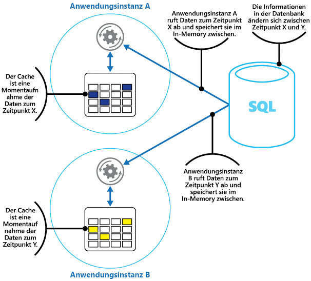

# <a name="caching"></a><span data-ttu-id="d5169-103">Caching</span><span class="sxs-lookup"><span data-stu-id="d5169-103">Caching</span></span>

<span data-ttu-id="d5169-104">Zwischenspeichern ist eine gängige Methode zur Verbesserung der Leistung und Skalierbarkeit eines Systems.</span><span class="sxs-lookup"><span data-stu-id="d5169-104">Caching is a common technique that aims to improve the performance and scalability of a system.</span></span> <span data-ttu-id="d5169-105">Dies geschieht durch vorübergehendes Kopieren häufig verwendeter Daten in einen schnellen Speicher, der sich in der Nähe der Anwendung befindet.</span><span class="sxs-lookup"><span data-stu-id="d5169-105">It does this by temporarily copying frequently accessed data to fast storage that's located close to the application.</span></span> <span data-ttu-id="d5169-106">Wenn sich dieser schnelle Datenspeicher näher an der Anwendung befindet als die ursprüngliche Datenquelle, kann Zwischenspeichern die Antwortzeiten für Clientanwendungen erheblich verbessern und die Daten schneller bereitstellen.</span><span class="sxs-lookup"><span data-stu-id="d5169-106">If this fast data storage is located closer to the application than the original source, then caching can significantly improve response times for client applications by serving data more quickly.</span></span>

<span data-ttu-id="d5169-107">Zwischenspeichern ist am effektivsten, wenn eine Instanz des Clients wiederholt die gleichen Daten liest – insbesondere dann, wenn alle folgenden Kriterien für den ursprünglichen Datenspeicher gelten:</span><span class="sxs-lookup"><span data-stu-id="d5169-107">Caching is most effective when a client instance repeatedly reads the same data, especially if all the following conditions apply to the original data store:</span></span>

* <span data-ttu-id="d5169-108">Er bleibt relativ statisch.</span><span class="sxs-lookup"><span data-stu-id="d5169-108">It remains relatively static.</span></span>
* <span data-ttu-id="d5169-109">Er ist langsam verglichen mit der Geschwindigkeit des Caches.</span><span class="sxs-lookup"><span data-stu-id="d5169-109">It's slow compared to the speed of the cache.</span></span>
* <span data-ttu-id="d5169-110">Er unterliegt in hohem Maße Konflikten.</span><span class="sxs-lookup"><span data-stu-id="d5169-110">It's subject to a high level of contention.</span></span>
* <span data-ttu-id="d5169-111">Er ist weit weg, wenn die Netzwerklatenz den Zugriff verlangsamt.</span><span class="sxs-lookup"><span data-stu-id="d5169-111">It's far away when network latency can cause access to be slow.</span></span>

## <a name="caching-in-distributed-applications"></a><span data-ttu-id="d5169-112">Caching in verteilten Anwendungen</span><span class="sxs-lookup"><span data-stu-id="d5169-112">Caching in distributed applications</span></span>
<span data-ttu-id="d5169-113">Verteilte Anwendungen stellen für das Zwischenspeichern von Daten meist eine oder beide der folgenden Strategien bereit:</span><span class="sxs-lookup"><span data-stu-id="d5169-113">Distributed applications typically implement either or both of the following strategies when caching data:</span></span>

* <span data-ttu-id="d5169-114">Verwenden eines privaten Caches, in dem Daten lokal auf dem Computer gespeichert werden, auf dem eine Instanz der Anwendung oder des Diensts ausgeführt wird.</span><span class="sxs-lookup"><span data-stu-id="d5169-114">Using a private cache, where data is held locally on the computer that's running an instance of an application or service.</span></span>
* <span data-ttu-id="d5169-115">Verwenden eines freigegebenen Cache, der als gemeinsame Datenquelle für mehrere Prozesse und/oder Computer dient.</span><span class="sxs-lookup"><span data-stu-id="d5169-115">Using a shared cache, serving as a common source which can be accessed by multiple processes and/or machines.</span></span>

<span data-ttu-id="d5169-116">In beiden Fällen kann Zwischenspeichern vom Client und/oder Server ausgeführt werden.</span><span class="sxs-lookup"><span data-stu-id="d5169-116">In both cases, caching can be performed client-side and/or server-side.</span></span> <span data-ttu-id="d5169-117">Clientseitiges Zwischenspeichern erfolgt durch den Prozess, der die Benutzeroberfläche für ein System, z. B. einen Webbrowser oder eine Desktopanwendung, bereitstellt.</span><span class="sxs-lookup"><span data-stu-id="d5169-117">Client-side caching is done by the process that provides the user interface for a system, such as a web browser or desktop application.</span></span>
<span data-ttu-id="d5169-118">Serverseitiges Zwischenspeichern erfolgt durch den Prozess, der Unternehmensdienste bereitstellt, die remote ausgeführt werden.</span><span class="sxs-lookup"><span data-stu-id="d5169-118">Server-side caching is done by the process that provides the business services that are running remotely.</span></span>

### <a name="private-caching"></a><span data-ttu-id="d5169-119">Privates Caching</span><span class="sxs-lookup"><span data-stu-id="d5169-119">Private caching</span></span>
<span data-ttu-id="d5169-120">Die einfachste Art des Caches ist ein In-Memory-Speicher.</span><span class="sxs-lookup"><span data-stu-id="d5169-120">The most basic type of cache is an in-memory store.</span></span> <span data-ttu-id="d5169-121">Er wird im Adressbereich eines einzelnen Prozesses gespeichert, und der in diesem Prozess ausgeführte Code greift direkt auf ihn zu.</span><span class="sxs-lookup"><span data-stu-id="d5169-121">It's held in the address space of a single process and accessed directly by the code that runs in that process.</span></span> <span data-ttu-id="d5169-122">Auf diese Art von Cache können Sie sehr schnell zugreifen.</span><span class="sxs-lookup"><span data-stu-id="d5169-122">This type of cache is very quick to access.</span></span> <span data-ttu-id="d5169-123">Er kann auch ein sehr effektives Mittel zum Speichern geringer Mengen statischer Daten sein, da die Größe eines Caches in der Regel durch den auf dem Hostcomputer zur Verfügung stehenden Arbeitsspeicher beschränkt ist.</span><span class="sxs-lookup"><span data-stu-id="d5169-123">It can also provide an extremely effective means for storing modest amounts of static data, since the size of a cache is typically constrained by the volume of memory that's available on the machine hosting the process.</span></span>

<span data-ttu-id="d5169-124">Wenn im Cache mehr Informationen gespeichert werden müssen, als physisch im Arbeitsspeicher möglich, können Sie zwischengespeicherte Daten auf das lokale Dateisystem schreiben.</span><span class="sxs-lookup"><span data-stu-id="d5169-124">If you need to cache more information than is physically possible in memory, you can write cached data to the local file system.</span></span> <span data-ttu-id="d5169-125">Der Zugriff auf diese Daten ist langsamer als der Zugriff auf die Daten im Arbeitsspeicher, jedoch schneller und zuverlässiger als der Datenabruf aus einem Netzwerk.</span><span class="sxs-lookup"><span data-stu-id="d5169-125">This will be slower to access than data that's held in-memory, but should still be faster and more reliable than retrieving data across a network.</span></span>

<span data-ttu-id="d5169-126">Wenn dieses Modell bei Ihnen von mehreren Instanzen einer Anwendung gleichzeitig verwendet wird, verwendet jede dieser Anwendungsinstanzen einen eigenen unabhängigen Cache mit jeweils eigenen Daten.</span><span class="sxs-lookup"><span data-stu-id="d5169-126">If you have multiple instances of an application that uses this model running concurrently, each application instance has its own independent cache holding its own copy of the data.</span></span>

<span data-ttu-id="d5169-127">Stellen Sie sich einen Cache als Momentaufnahme der Originaldaten zu einem bestimmten Zeitpunkt in der Vergangenheit vor.</span><span class="sxs-lookup"><span data-stu-id="d5169-127">Think of a cache as a snapshot of the original data at some point in the past.</span></span> <span data-ttu-id="d5169-128">Wenn diese Daten nicht statisch sind, bewahren die verschiedenen Anwendungsinstanzen vermutlich jeweils verschiedene Versionen dieser Daten in ihren Caches auf.</span><span class="sxs-lookup"><span data-stu-id="d5169-128">If this data is not static, it is likely that different application instances hold different versions of the data in their caches.</span></span> <span data-ttu-id="d5169-129">Daher kann die gleiche Abfrage in jeder dieser Instanzen unterschiedliche Ergebnisse zurückgeben (siehe Abbildung 1).</span><span class="sxs-lookup"><span data-stu-id="d5169-129">Therefore, the same query performed by these instances can return different results, as shown in Figure 1.</span></span>



<span data-ttu-id="d5169-131">*Abbildung 1: Verwenden eines arbeitsspeicherinternen Cache in verschiedenen Instanzen einer Anwendung*</span><span class="sxs-lookup"><span data-stu-id="d5169-131">*Figure 1: Using an in-memory cache in different instances of an application*</span></span>

### <a name="shared-caching"></a><span data-ttu-id="d5169-132">Shared Caching</span><span class="sxs-lookup"><span data-stu-id="d5169-132">Shared caching</span></span>
<span data-ttu-id="d5169-133">Ein gemeinsam genutzter bzw. freigegebener Cache verhindert die Diversität der Daten in den einzelnen Instanzencaches, wie es beim In-Memory-Zwischenspeichern der Fall sein kann.</span><span class="sxs-lookup"><span data-stu-id="d5169-133">Using a shared cache can help alleviate concerns that data might differ in each cache, which can occur with in-memory caching.</span></span> <span data-ttu-id="d5169-134">Shared Caching stellt sicher, dass verschiedene Anwendungsinstanzen die gleiche Ansicht der zwischengespeicherten Daten haben.</span><span class="sxs-lookup"><span data-stu-id="d5169-134">Shared caching ensures that different application instances see the same view of cached data.</span></span> <span data-ttu-id="d5169-135">Hierzu wird der Cache in einem separaten Speicherort gesucht. Er wird in der Regel als Teil eines separaten Diensts gehostet, wie in Abbildung 2 dargestellt.</span><span class="sxs-lookup"><span data-stu-id="d5169-135">It does this by locating the cache in a separate location, typically hosted as part of a separate service, as shown in Figure 2.</span></span>


<span data-ttu-id="d5169-137">*Abbildung 2: Verwenden eines freigegebenen Cache*</span><span class="sxs-lookup"><span data-stu-id="d5169-137">*Figure 2: Using a shared cache*</span></span>

<span data-ttu-id="d5169-138">Ein wichtiger Vorteil des Shared Cachings ist seine Skalierbarkeit.</span><span class="sxs-lookup"><span data-stu-id="d5169-138">An important benefit of the shared caching approach is the scalability it provides.</span></span> <span data-ttu-id="d5169-139">Viele Dienste, die freigegebenen Cache bereitstellen, werden durch einen Servercluster implementiert und verwenden Software, die die Daten innerhalb des Clusters transparent verteilen.</span><span class="sxs-lookup"><span data-stu-id="d5169-139">Many shared cache services are implemented by using a cluster of servers, and utilize software that distributes the data across the cluster in a transparent manner.</span></span> <span data-ttu-id="d5169-140">Eine Instanz der Anwendung sendet einfach eine Anforderung an den Cachedienst.</span><span class="sxs-lookup"><span data-stu-id="d5169-140">An application instance simply sends a request to the cache service.</span></span>
<span data-ttu-id="d5169-141">Die zu Grunde liegende Infrastruktur ist zuständig für das Ermitteln des Speicherorts der zwischengespeicherten Daten im Cluster.</span><span class="sxs-lookup"><span data-stu-id="d5169-141">The underlying infrastructure is responsible for determining the location of the cached data in the cluster.</span></span> <span data-ttu-id="d5169-142">Durch weitere Server lässt sich der Cache problemlos skalieren.</span><span class="sxs-lookup"><span data-stu-id="d5169-142">You can easily scale the cache by adding more servers.</span></span>

<span data-ttu-id="d5169-143">Die beiden größten Nachteile des Ansatzes mit Shared Caching sind:</span><span class="sxs-lookup"><span data-stu-id="d5169-143">There are two main disadvantages of the shared caching approach:</span></span>

* <span data-ttu-id="d5169-144">Der Zugriff auf den Cache ist langsamer, da er nicht mehr für jede Anwendungsinstanz lokal gespeichert wird.</span><span class="sxs-lookup"><span data-stu-id="d5169-144">The cache is slower to access because it is no longer held locally to each application instance.</span></span>
* <span data-ttu-id="d5169-145">Die Anforderung, einen separaten Cachedienst zu implementieren, könnte die Lösung verkomplizieren.</span><span class="sxs-lookup"><span data-stu-id="d5169-145">The requirement to implement a separate cache service might add complexity to the solution.</span></span>

## <a name="considerations-for-using-caching"></a><span data-ttu-id="d5169-146">Überlegungen zur Verwendung von Caching</span><span class="sxs-lookup"><span data-stu-id="d5169-146">Considerations for using caching</span></span>
<span data-ttu-id="d5169-147">Die folgenden Abschnitte gehen näher auf die einzelnen Überlegungen zum Entwurf und der Verwendung eines Cache ein.</span><span class="sxs-lookup"><span data-stu-id="d5169-147">The following sections describe in more detail the considerations for designing and using a cache.</span></span>

### <a name="decide-when-to-cache-data"></a><span data-ttu-id="d5169-148">Entscheiden, wann Daten zwischengespeichert werden sollen</span><span class="sxs-lookup"><span data-stu-id="d5169-148">Decide when to cache data</span></span>
<span data-ttu-id="d5169-149">Caching kann die Leistung, Skalierbarkeit und Verfügbarkeit erheblich verbessern.</span><span class="sxs-lookup"><span data-stu-id="d5169-149">Caching can dramatically improve performance, scalability, and availability.</span></span> <span data-ttu-id="d5169-150">Je mehr Daten Sie besitzen, und je größer die Anzahl der Benutzer ist, die auf diese Daten zugreifen müssen, desto größer sind die Vorteile des Zwischenspeicherns.</span><span class="sxs-lookup"><span data-stu-id="d5169-150">The more data that you have and the larger the number of users that need to access this data, the greater the benefits of caching become.</span></span> <span data-ttu-id="d5169-151">Das liegt daran, dass das Zwischenspeichern Latenz und Konflikte verringert, die mit dem Umgang mit großen Datenmengen, an die verschiedene Anforderungen gleichzeitig gestellt werden, im ursprünglichen Datenspeicher verbunden sind.</span><span class="sxs-lookup"><span data-stu-id="d5169-151">That's because caching reduces the latency and contention that's associated with handling large volumes of concurrent requests in the original data store.</span></span>

<span data-ttu-id="d5169-152">Eine Datenbank kann z. B. eine begrenzte Anzahl gleichzeitiger Verbindungen unterstützen.</span><span class="sxs-lookup"><span data-stu-id="d5169-152">For example, a database might support a limited number of concurrent connections.</span></span> <span data-ttu-id="d5169-153">Werden die Daten in diesem Fall aber nicht aus der zu Grunde liegenden Datenbank, sondern aus einem freigegebenen Cache abgerufen, so kann die Clientanwendung selbst dann noch auf diese Daten zugreifen, wenn die Anzahl der verfügbaren Verbindungen erschöpft ist.</span><span class="sxs-lookup"><span data-stu-id="d5169-153">Retrieving data from a shared cache, however, rather than the underlying database, makes it possible for a client application to access this data even if the number of available connections is currently exhausted.</span></span> <span data-ttu-id="d5169-154">Außerdem können die Clientanwendungen, sollte die Datenbank – aus welchem Grund auch immer – nicht mehr zur Verfügung stehen, nach wie vor auf die im Cache gespeicherten Daten zugreifen.</span><span class="sxs-lookup"><span data-stu-id="d5169-154">Additionally, if the database becomes unavailable, client applications might be able to continue by using the data that's held in the cache.</span></span>

<span data-ttu-id="d5169-155">Zwischenspeichern empfiehlt sich besonders für Daten, die häufig eingelesen werden, aber nur selten geändert (bei denen z.B. der Anteil der Lesezugriffe gegenüber dem Anteil der Schreibzugriffe überwiegt).</span><span class="sxs-lookup"><span data-stu-id="d5169-155">Consider caching data that is read frequently but modified infrequently (for example, data that has a higher proportion of read operations than write operations).</span></span> <span data-ttu-id="d5169-156">Allerdings sollten Sie den Cache nicht als autoritativen Speicher wichtiger Informationen verwenden.</span><span class="sxs-lookup"><span data-stu-id="d5169-156">However, we don't recommend that you use the cache as the authoritative store of critical information.</span></span> <span data-ttu-id="d5169-157">Stellen Sie stattdessen sicher, dass alle Änderungen, deren Verlust sich Ihre Anwendung nicht leisten kann, immer in einem persistenten Datenspeicher gespeichert werden.</span><span class="sxs-lookup"><span data-stu-id="d5169-157">Instead, ensure that all changes that your application cannot afford to lose are always saved to a persistent data store.</span></span> <span data-ttu-id="d5169-158">Dies bedeutet: Sollte der Cache einmal nicht verfügbar sein, kann Ihre Anwendung über den Datenspeicher weiterhin verwendet werden, ohne dass wichtige Informationen verloren gehen.</span><span class="sxs-lookup"><span data-stu-id="d5169-158">This means that if the cache is unavailable, your application can still continue to operate by using the data store, and you won't lose important information.</span></span>

### <a name="determine-how-to-cache-data-effectively"></a><span data-ttu-id="d5169-159">Bestimmen, wie Daten effektiv zwischengespeichert werden</span><span class="sxs-lookup"><span data-stu-id="d5169-159">Determine how to cache data effectively</span></span>
<span data-ttu-id="d5169-160">Der Schlüssel für die effektive Verwendung eines Cache liegt darin, möglichst geeignete Daten für eine Zwischenspeicherung zu finden und diese zum richtigen Zeitpunkt zwischenzuspeichern.</span><span class="sxs-lookup"><span data-stu-id="d5169-160">The key to using a cache effectively lies in determining the most appropriate data to cache, and caching it at the appropriate time.</span></span> <span data-ttu-id="d5169-161">Die Daten können dem Cache bei Bedarf beim ersten Abruf durch eine Anwendung hinzugefügt werden.</span><span class="sxs-lookup"><span data-stu-id="d5169-161">The data can be added to the cache on demand the first time it is retrieved by an application.</span></span> <span data-ttu-id="d5169-162">Dies bedeutet, dass die Anwendung die Daten nur einmal aus dem Datenspeicher abrufen muss, und der nachfolgende Zugriff mit dem Cache erfüllt werden kann.</span><span class="sxs-lookup"><span data-stu-id="d5169-162">This means that the application needs to fetch the data only once from the data store, and that subsequent access can be satisfied by using the cache.</span></span>

<span data-ttu-id="d5169-163">Alternativ kann ein Cache im Voraus teilweise oder vollständig mit Daten gefüllt werden, in der Regel beim Start der Anwendung (diese Vorgehensweise wird als Seeding bezeichnet).</span><span class="sxs-lookup"><span data-stu-id="d5169-163">Alternatively, a cache can be partially or fully populated with data in advance, typically when the application starts (an approach known as seeding).</span></span> <span data-ttu-id="d5169-164">Allerdings könnte Seeding bei einem großen Cache nicht ratsam sein, da diese Strategie beim Anwendungsstart eine plötzliche, hohe Last für den ursprünglichen Datenspeicher bedeutet.</span><span class="sxs-lookup"><span data-stu-id="d5169-164">However, it might not be advisable to implement seeding for a large cache because this approach can impose a sudden, high load on the original data store when the application starts running.</span></span>

<span data-ttu-id="d5169-165">Oft hilft eine Analyse der Verwendungsmuster bei der Entscheidung, ob eine vollständige oder teilweise Vorabfüllung des Caches sinnvoll ist, und welche Daten zwischengespeichert werden sollen.</span><span class="sxs-lookup"><span data-stu-id="d5169-165">Often an analysis of usage patterns can help you decide whether to fully or partially prepopulate a cache, and to choose the data to cache.</span></span> <span data-ttu-id="d5169-166">Vermutlich wäre es zum Beispiel sinnvoll, den Cache mit den statischen Benutzerprofildaten derjenigen Benutzer zu füllen, die die Anwendung regelmäßig (z. B. täglich) verwenden, aber nicht für Benutzer, die die Anwendung nur einmal pro Woche verwenden.</span><span class="sxs-lookup"><span data-stu-id="d5169-166">For example, it can be useful to seed the cache with the static user profile data for customers who use the application regularly (perhaps every day), but not for customers who use the application only once a week.</span></span>

<span data-ttu-id="d5169-167">Caching funktioniert in der Regel gut mit Daten, die sich nicht oder nur selten ändern.</span><span class="sxs-lookup"><span data-stu-id="d5169-167">Caching typically works well with data that is immutable or that changes infrequently.</span></span> <span data-ttu-id="d5169-168">Beispiele hierfür sind Referenzinformationen wie Produkt- und Preisinformationen einer E-Commerce-Anwendung oder freigegebene statische Ressourcen, deren Erstellung sehr aufwändig ist.</span><span class="sxs-lookup"><span data-stu-id="d5169-168">Examples include reference information such as product and pricing information in an e-commerce application, or shared static resources that are costly to construct.</span></span> <span data-ttu-id="d5169-169">Einige oder alle dieser Daten können beim Anwendungsstart in den Cache geladen werden, um die Ressourcenbelastung zu minimieren und die Leistung zu steigern.</span><span class="sxs-lookup"><span data-stu-id="d5169-169">Some or all of this data can be loaded into the cache at application startup to minimize demand on resources and to improve performance.</span></span> <span data-ttu-id="d5169-170">Auch sind Hintergrundprozesse denkbar, durch die Referenzdaten im Cache regelmäßig aktualisiert werden, um deren Aktualität sicherzustellen, oder durch die der Cache nach einer Änderung der Referenzdaten aktualisiert wird.</span><span class="sxs-lookup"><span data-stu-id="d5169-170">It might also be appropriate to have a background process that periodically updates reference data in the cache to ensure it is up to date, or that refreshes the cache when reference data changes.</span></span>

<span data-ttu-id="d5169-171">Für dynamische Daten ist Zwischenspeichern weniger geeignet, auch wenn es hier Ausnahmen gibt (siehe „Zwischenspeichern hochgradig dynamischer Daten“ weiter unten in diesem Artikel).</span><span class="sxs-lookup"><span data-stu-id="d5169-171">Caching is less useful for dynamic data, although there are some exceptions to this consideration (see the section Cache highly dynamic data later in this article for more information).</span></span> <span data-ttu-id="d5169-172">Wenn sich die Originaldaten häufig ändern, sind die Daten im Cache entweder sehr schnell überholt, oder der Aufwand der Synchronisierung des Caches mit dem Originaldatenspeicher steht in keinem Verhältnis zum Nutzen des Caches.</span><span class="sxs-lookup"><span data-stu-id="d5169-172">When the original data changes regularly, either the cached information becomes stale very quickly or the overhead of synchronizing the cache with the original data store reduces the effectiveness of caching.</span></span>

<span data-ttu-id="d5169-173">Beachten Sie auch, dass ein Cache nicht alle Daten einer Entität vollständig enthalten muss.</span><span class="sxs-lookup"><span data-stu-id="d5169-173">Note that a cache does not have to include the complete data for an entity.</span></span> <span data-ttu-id="d5169-174">Stellt ein Datenelement beispielsweise ein Objekt mit mehreren Werten dar, zum Beispiel einen Bankkunden mit Name, Adresse und Kontostand, können einige dieser Elemente statisch sein (z. B. Name und Adresse), während sich andere dynamisch ändern (Kontostand).</span><span class="sxs-lookup"><span data-stu-id="d5169-174">For example, if a data item represents a multivalued object such as a bank customer with a name, address, and account balance, some of these elements might remain static (such as the name and address), while others (such as the account balance) might be more dynamic.</span></span> <span data-ttu-id="d5169-175">In einer solchen Situation kann es sinnvoll sein, den statischen Anteil der Daten zwischenzuspeichern und bei Bedarf nur die übrigen Informationen abzurufen (bzw. zu berechnen).</span><span class="sxs-lookup"><span data-stu-id="d5169-175">In these situations, it can be useful to cache the static portions of the data and retrieve (or calculate) only the remaining information when it is required.</span></span>

<span data-ttu-id="d5169-176">Sie sollten durch Leistungs- und Nutzungsanalysen ermitteln, ob ein Vorabfüllen des Caches, ein Laden der Daten bei Bedarf oder eine Kombination aus beidem sinnvoll ist.</span><span class="sxs-lookup"><span data-stu-id="d5169-176">We recommend that you carry out performance testing and usage analysis to determine whether pre-population or on-demand loading of the cache, or a combination of both, is appropriate.</span></span> <span data-ttu-id="d5169-177">Bei der Entscheidung sollten sowohl die Flüchtigkeit als auch das Nutzungsmuster der Daten eine Rolle spielen.</span><span class="sxs-lookup"><span data-stu-id="d5169-177">The decision should be based on the volatility and usage pattern of the data.</span></span> <span data-ttu-id="d5169-178">Eine Nutzungs- und Leistungsanalyse für den Cache ist besonders bei stark frequentierten und ausgelasteten Anwendungen wichtig, die hochgradig skalierbar sein müssen.</span><span class="sxs-lookup"><span data-stu-id="d5169-178">Cache utilization and performance analysis is particularly important in applications that encounter heavy loads and must be highly scalable.</span></span> <span data-ttu-id="d5169-179">Gerade in hochgradig skalierbaren Szenarien kann es sinnvoll sein, den Cache per Seeding vorab zu füllen, um die Belastung des Datenspeichers zu Spitzenzeiten zu verringern.</span><span class="sxs-lookup"><span data-stu-id="d5169-179">For example, in highly scalable scenarios it might make sense to seed the cache to reduce the load on the data store at peak times.</span></span>

<span data-ttu-id="d5169-180">Durch Zwischenspeichern lassen sich auch wiederholte Berechnungen während der Laufzeit einer Anwendung vermeiden.</span><span class="sxs-lookup"><span data-stu-id="d5169-180">Caching can also be used to avoid repeating computations while the application is running.</span></span> <span data-ttu-id="d5169-181">Wenn durch eine Operation Daten umgewandelt oder komplizierte Berechnungen durchgeführt werden, können die Ergebnisse der Operation im Cache gespeichert werden.</span><span class="sxs-lookup"><span data-stu-id="d5169-181">If an operation transforms data or performs a complicated calculation, it can save the results of the operation in the cache.</span></span> <span data-ttu-id="d5169-182">Falls die gleiche Berechnung später erneut erforderlich ist, kann die Anwendung das Ergebnis einfach aus dem Cache abrufen.</span><span class="sxs-lookup"><span data-stu-id="d5169-182">If the same calculation is required afterward, the application can simply retrieve the results from the cache.</span></span>

<span data-ttu-id="d5169-183">Eine Anwendung kann Daten ändern, die in einem Cache gespeichert sind.</span><span class="sxs-lookup"><span data-stu-id="d5169-183">An application can modify data that's held in a cache.</span></span> <span data-ttu-id="d5169-184">Sie sollten den Cache jedoch als flüchtigen Datenspeicher betrachten, der jederzeit entfernt werden könnte.</span><span class="sxs-lookup"><span data-stu-id="d5169-184">However, we recommend thinking of the cache as a transient data store that could disappear at any time.</span></span> <span data-ttu-id="d5169-185">Wichtige Daten sollten Sie daher nicht nur im Cache, sondern auch im ursprünglichen Datenspeicher speichern.</span><span class="sxs-lookup"><span data-stu-id="d5169-185">Do not store valuable data in the cache only; make sure that you maintain the information in the original data store as well.</span></span> <span data-ttu-id="d5169-186">Das bedeutet: Sollte die Verfügbarkeit des Caches einmal nicht gegeben sein, vermindern Sie auf diese Weise das Risiko eines Datenverlusts.</span><span class="sxs-lookup"><span data-stu-id="d5169-186">This means that if the cache becomes unavailable, you minimize the chance of losing data.</span></span>

### <a name="cache-highly-dynamic-data"></a><span data-ttu-id="d5169-187">Zwischenspeichern hochgradig dynamischer Daten</span><span class="sxs-lookup"><span data-stu-id="d5169-187">Cache highly dynamic data</span></span>
<span data-ttu-id="d5169-188">Wenn Sie Informationen, die sich sehr schnell ändern, in einem persistenten Datenspeicher ablegen, kann dies das System enorm belasten.</span><span class="sxs-lookup"><span data-stu-id="d5169-188">When you store rapidly-changing information in a persistent data store, it can impose an overhead on the system.</span></span> <span data-ttu-id="d5169-189">Denken Sie hier zum Beispiel an ein Gerät, das kontinuierlich einen Status oder ein anderes Messergebnis meldet.</span><span class="sxs-lookup"><span data-stu-id="d5169-189">For example, consider a device that continually reports status or some other measurement.</span></span> <span data-ttu-id="d5169-190">Wenn diese Daten in einer Anwendung nicht zwischengespeichert werden, weil die zwischengespeicherten Informationen nahezu sofort schon wieder veraltet sind, gilt diese Überlegung ebenso aber auch für das Speichern und Abrufen der Informationen im Datenspeicher.</span><span class="sxs-lookup"><span data-stu-id="d5169-190">If an application chooses not to cache this data on the basis that the cached information will nearly always be outdated, then the same consideration could be true when storing and retrieving this information from the data store.</span></span> <span data-ttu-id="d5169-191">Die Daten haben sich zwischen dem Speichern und Abrufen eventuell bereits schon wieder geändert.</span><span class="sxs-lookup"><span data-stu-id="d5169-191">In the time it takes to save and fetch this data, it might have changed.</span></span>

<span data-ttu-id="d5169-192">In einer Situation wie dieser sollten Sie überlegen, welche Vorteile das Speichern der dynamischen Informationen im Cache gegenüber dem Speichern im persistenten Datenspeicher hat.</span><span class="sxs-lookup"><span data-stu-id="d5169-192">In a situation such as this, consider the benefits of storing the dynamic information directly in the cache instead of in the persistent data store.</span></span> <span data-ttu-id="d5169-193">Wenn die Daten nicht so wichtig sind und nicht überprüft werden müssen, spielt der gelegentliche Verlust einer Änderung sicherlich keine Rolle.</span><span class="sxs-lookup"><span data-stu-id="d5169-193">If the data is non-critical and does not require auditing, then it doesn't matter if the occasional change is lost.</span></span>

### <a name="manage-data-expiration-in-a-cache"></a><span data-ttu-id="d5169-194">Verwalten des Datenablaufs in einem Cache</span><span class="sxs-lookup"><span data-stu-id="d5169-194">Manage data expiration in a cache</span></span>
<span data-ttu-id="d5169-195">In den meisten Fällen handelt es sich bei den Daten in einem Cache um eine Kopie der Daten im ursprünglichen Datenspeicher.</span><span class="sxs-lookup"><span data-stu-id="d5169-195">In most cases, data that's held in a cache is a copy of data that's held in the original data store.</span></span> <span data-ttu-id="d5169-196">Die Daten im ursprünglichen Datenspeicher können sich jedoch nach dem Zwischenspeichern ändern, wodurch die Daten im Cache veralten.</span><span class="sxs-lookup"><span data-stu-id="d5169-196">The data in the original data store might change after it was cached, causing the cached data to become stale.</span></span> <span data-ttu-id="d5169-197">Viele Cachesysteme bieten daher die Möglichkeit, für die Daten im Cache ein Ablaufdatum festzulegen, wodurch sich der Zeitraum reduziert, in dem Daten veraltet vorliegen.</span><span class="sxs-lookup"><span data-stu-id="d5169-197">Many caching systems enable you to configure the cache to expire data and reduce the period for which data may be out of date.</span></span>

<span data-ttu-id="d5169-198">Beim Ablauf zwischengespeicherter Daten werden die Daten aus dem Cache entfernt, und die Anwendung muss die Daten bei Bedarf wieder aus dem ursprünglichen Datenspeicher abrufen (die neu abgerufenen Informationen können dann wieder im Cache gespeichert werden).</span><span class="sxs-lookup"><span data-stu-id="d5169-198">When cached data expires, it's removed from the cache, and the application must retrieve the data from the original data store (it can put the newly-fetched information back into cache).</span></span> <span data-ttu-id="d5169-199">Zu diesem Zweck können Sie bei der Konfiguration des Cache eine Standardrichtlinie für den Kennwortablauf festlegen.</span><span class="sxs-lookup"><span data-stu-id="d5169-199">You can set a default expiration policy when you configure the cache.</span></span> <span data-ttu-id="d5169-200">Bei vielen Cachediensten können Sie auch das Ablaufdatum für einzelne Objekte festlegen, wenn Sie sie programmgesteuert im Cache speichern.</span><span class="sxs-lookup"><span data-stu-id="d5169-200">In many cache services, you can also stipulate the expiration period for individual objects when you store them programmatically in the cache.</span></span>
<span data-ttu-id="d5169-201">Einige Caches ermöglichen Ihnen, das Ablaufdatum als absoluten Wert anzugeben, oder als gleitenden Wert, der bewirkt, dass das Element aus dem Cache entfernt wird, wenn nicht innerhalb der angegebenen Zeit darauf zugegriffen wird.</span><span class="sxs-lookup"><span data-stu-id="d5169-201">Some caches enable you to specify the expiration period as an absolute value, or as a sliding value that causes the item to be removed from the cache if it is not accessed within the specified time.</span></span> <span data-ttu-id="d5169-202">Durch diese Einstellung wird jede Cache-weite Ablaufrichtlinie überschrieben, allerdings nur für die angegebenen Elemente.</span><span class="sxs-lookup"><span data-stu-id="d5169-202">This setting overrides any cache-wide expiration policy, but only for the specified objects.</span></span>

> [!NOTE]
> <span data-ttu-id="d5169-203">Das Ablaufdatum für den Cache insgesamt sowie für einzelne Elemente muss sorgfältig bedacht werden.</span><span class="sxs-lookup"><span data-stu-id="d5169-203">Consider the expiration period for the cache and the objects that it contains carefully.</span></span> <span data-ttu-id="d5169-204">Wenn es zu kurz ist, veralten die Elemente zu schnell und werden entfernt, wodurch sich die Vorteile des Cache aufheben.</span><span class="sxs-lookup"><span data-stu-id="d5169-204">If you make it too short, objects will expire too quickly and you will reduce the benefits of using the cache.</span></span> <span data-ttu-id="d5169-205">Wenn es zu lang ist, kann es passieren, dass die im Cache vorliegenden Daten nicht mehr aktuell sind.</span><span class="sxs-lookup"><span data-stu-id="d5169-205">If you make the period too long, you risk the data becoming stale.</span></span>
> 
> 

<span data-ttu-id="d5169-206">Wenn die Zeitspanne bis zum Ablauf der Daten sehr lange ist, kann der Cache auch überlaufen.</span><span class="sxs-lookup"><span data-stu-id="d5169-206">It's also possible that the cache might fill up if data is allowed to remain resident for a long time.</span></span> <span data-ttu-id="d5169-207">In diesem Fall müssen bei jeder erneuten Anfrage zum Hinzufügen von Daten ältere Elemente meist zwangsweise aus dem Cache entfernt werden.</span><span class="sxs-lookup"><span data-stu-id="d5169-207">In this case, any requests to add new items to the cache might cause some items to be forcibly removed in a process known as eviction.</span></span> <span data-ttu-id="d5169-208">In der Regel entfernen Cachedienste die Daten auf Basis der am längsten zurückliegenden Verwendung (Least Recently Used, LRU), aber meist können Sie diese Richtlinie überschreiben und dadurch verhindern, dass Elemente entfernt werden.</span><span class="sxs-lookup"><span data-stu-id="d5169-208">Cache services typically evict data on a least-recently-used (LRU) basis, but you can usually override this policy and prevent items from being evicted.</span></span> <span data-ttu-id="d5169-209">Wenn Sie jedoch diesen Ansatz verfolgen, riskieren Sie eine Überschreitung des Arbeitsspeichers, der im Cache verfügbar ist.</span><span class="sxs-lookup"><span data-stu-id="d5169-209">However, if you adopt this approach, you risk exceeding the memory that's available in the cache.</span></span> <span data-ttu-id="d5169-210">Eine Anwendung, die versucht, ein Element zum Cache hinzufügen, wird mit einer Ausnahme fehlschlagen.</span><span class="sxs-lookup"><span data-stu-id="d5169-210">An application that attempts to add an item to the cache will fail with an exception.</span></span>

<span data-ttu-id="d5169-211">Einige Cacheimplementierungen könnten auch zusätzliche Entfernungsrichtlinien bieten.</span><span class="sxs-lookup"><span data-stu-id="d5169-211">Some caching implementations might provide additional eviction policies.</span></span> <span data-ttu-id="d5169-212">Es gibt mehrere Typen von Entfernungsrichtlinien.</span><span class="sxs-lookup"><span data-stu-id="d5169-212">There are several types of eviction policies.</span></span> <span data-ttu-id="d5169-213">Das umfasst:</span><span class="sxs-lookup"><span data-stu-id="d5169-213">These include:</span></span>

* <span data-ttu-id="d5169-214">Eine kürzlich verwendete Richtlinie (in der Annahme, dass die Daten nicht mehr benötigt werden).</span><span class="sxs-lookup"><span data-stu-id="d5169-214">A most-recently-used policy (in the expectation that the data will not be required again).</span></span>
* <span data-ttu-id="d5169-215">Eine Richtlinie für First In, First Out (älteste Daten werden zuerst entfernt).</span><span class="sxs-lookup"><span data-stu-id="d5169-215">A first-in-first-out policy (oldest data is evicted first).</span></span>
* <span data-ttu-id="d5169-216">Eine explizite Entfernungsrichtlinie auf Basis eines ausgelösten Ereignisses (z. B. Änderung der Daten).</span><span class="sxs-lookup"><span data-stu-id="d5169-216">An explicit removal policy based on a triggered event (such as the data being modified).</span></span>

### <a name="invalidate-data-in-a-client-side-cache"></a><span data-ttu-id="d5169-217">Ungültige Daten in einem clientseitigen Cache</span><span class="sxs-lookup"><span data-stu-id="d5169-217">Invalidate data in a client-side cache</span></span>
<span data-ttu-id="d5169-218">Daten, die in einem clientseitigen Cache gespeichert sind, gelten im Allgemeinen als außerhalb des Einflussbereichs des Diensts liegend, der dem Client die Daten bereitstellt.</span><span class="sxs-lookup"><span data-stu-id="d5169-218">Data that's held in a client-side cache is generally considered to be outside the auspices of the service that provides the data to the client.</span></span> <span data-ttu-id="d5169-219">Ein Dienst kann nicht direkt erzwingen, dass ein Client einem clientseitigen Cache Daten hinzufügt oder daraus entfernt.</span><span class="sxs-lookup"><span data-stu-id="d5169-219">A service cannot directly force a client to add or remove information from a client-side cache.</span></span>

<span data-ttu-id="d5169-220">Dies bedeutet, dass ein Client, der einen schlecht konfigurierten Cache verwendet, weiterhin veralteten Informationen verwenden kann.</span><span class="sxs-lookup"><span data-stu-id="d5169-220">This means that it's possible for a client that uses a poorly configured cache to continue using outdated information.</span></span> <span data-ttu-id="d5169-221">Wenn z. B. die Richtlinien für den Ablauf des Caches nicht ordnungsgemäß implementiert sind, könnte ein Client veraltete Informationen verwenden, die lokal zwischengespeichert sind, wenn die Informationen in der ursprünglichen Datenquelle geändert wurden.</span><span class="sxs-lookup"><span data-stu-id="d5169-221">For example, if the expiration policies of the cache aren't properly implemented, a client might use outdated information that's cached locally when the information in the original data source has changed.</span></span>

<span data-ttu-id="d5169-222">Wenn Sie eine Webanwendung entwickeln, die Daten über eine HTTP-Verbindung bereitstellt, können Sie einen Webclient (z. B. einen Browser oder Webproxy) implizit zwingen, die neuesten Informationen abzurufen.</span><span class="sxs-lookup"><span data-stu-id="d5169-222">If you are building a web application that serves data over an HTTP connection, you can implicitly force a web client (such as a browser or web proxy) to fetch the most recent information.</span></span> <span data-ttu-id="d5169-223">Sie können dies tun, wenn eine Ressource durch eine Änderung der URI aktualisiert wird.</span><span class="sxs-lookup"><span data-stu-id="d5169-223">You can do this if a resource is updated by a change in the URI of that resource.</span></span> <span data-ttu-id="d5169-224">Webclients verwenden die URI einer Ressource in der Regel als Schlüssel für den clientseitigen Cache, sodass die Änderung der URI bewirkt, dass der Webclient zuvor zwischengespeicherte Versionen einer Ressource ignoriert und stattdessen die neue Version abruft.</span><span class="sxs-lookup"><span data-stu-id="d5169-224">Web clients typically use the URI of a resource as the key in the client-side cache, so if the URI changes, the web client ignores any previously cached versions of a resource and fetches the new version instead.</span></span>

## <a name="managing-concurrency-in-a-cache"></a><span data-ttu-id="d5169-225">Verwalten der Parallelität in einem Cache</span><span class="sxs-lookup"><span data-stu-id="d5169-225">Managing concurrency in a cache</span></span>
<span data-ttu-id="d5169-226">Caches sind häufig für mehrere Instanzen einer Anwendung freigegeben.</span><span class="sxs-lookup"><span data-stu-id="d5169-226">Caches are often designed to be shared by multiple instances of an application.</span></span> <span data-ttu-id="d5169-227">Dabei kann jede Anwendungsinstanz die Daten im Cache lesen und ändern.</span><span class="sxs-lookup"><span data-stu-id="d5169-227">Each application instance can read and modify data in the cache.</span></span> <span data-ttu-id="d5169-228">Die Parallelitätsprobleme eines jeden freigegebenen Datenspeichers gelten daher auch für einen freigegebenen Cache.</span><span class="sxs-lookup"><span data-stu-id="d5169-228">Consequently, the same concurrency issues that arise with any shared data store also apply to a cache.</span></span> <span data-ttu-id="d5169-229">In Situationen, in denen Anwendungen die im Cache gespeicherten Daten ändern müssen, müssen Sie sicherstellen, dass die von einer Anwendungsinstanz vorgenommenen Änderungen die Änderungen einer anderen Instanz nicht überschreiben.</span><span class="sxs-lookup"><span data-stu-id="d5169-229">In a situation where an application needs to modify data that's held in the cache, you might need to ensure that updates made by one instance of the application do not overwrite the changes made by another instance.</span></span>

<span data-ttu-id="d5169-230">Je nach Art der Daten und der Wahrscheinlichkeit von Konflikten sollten Sie eine der beiden folgenden Parallelitätsstrategien verfolgen:</span><span class="sxs-lookup"><span data-stu-id="d5169-230">Depending on the nature of the data and the likelihood of collisions, you can adopt one of two approaches to concurrency:</span></span>

* <span data-ttu-id="d5169-231">**Optimistisch (vollständig):**</span><span class="sxs-lookup"><span data-stu-id="d5169-231">**Optimistic.**</span></span> <span data-ttu-id="d5169-232">Die Anwendung prüft unmittelbar vor der Aktualisierung, ob sich die Daten im Cache seit deren Abruf geändert haben.</span><span class="sxs-lookup"><span data-stu-id="d5169-232">Immediately prior to updating the data, the application checks to see whether the data in the cache has changed since it was retrieved.</span></span> <span data-ttu-id="d5169-233">Haben sich die Daten nicht geändert, kann die Aktualisierung vorgenommen werden.</span><span class="sxs-lookup"><span data-stu-id="d5169-233">If the data is still the same, the change can be made.</span></span> <span data-ttu-id="d5169-234">Andernfalls muss die Anwendung entscheiden, ob die sie die Aktualisierung vornimmt.</span><span class="sxs-lookup"><span data-stu-id="d5169-234">Otherwise, the application has to decide whether to update it.</span></span> <span data-ttu-id="d5169-235">(Die Geschäftslogik, die dieser Entscheidung zu Grunde liegt, ist die anwendungsspezifische.) Diese Strategie eignet sich für Situationen, in denen nur selten Änderungen vorgenommen werden bzw. in denen kaum mit Konflikten zu rechnen ist.</span><span class="sxs-lookup"><span data-stu-id="d5169-235">(The business logic that drives this decision will be application-specific.) This approach is suitable for situations where updates are infrequent, or where collisions are unlikely to occur.</span></span>
* <span data-ttu-id="d5169-236">**Pessimistisch (eingeschränkt):**</span><span class="sxs-lookup"><span data-stu-id="d5169-236">**Pessimistic.**</span></span> <span data-ttu-id="d5169-237">Beim Abrufen von Daten sperrt die Anwendung die Daten im Cache, um zu verhindern, dass diese durch eine andere Anwendungsinstanz geändert werden.</span><span class="sxs-lookup"><span data-stu-id="d5169-237">When it retrieves the data, the application locks it in the cache to prevent another instance from changing it.</span></span> <span data-ttu-id="d5169-238">So werden Konflikte umgangen, allerdings werden andere Anwendungsinstanzen, die die gleichen Daten verarbeiten müssen, dabei unter Umständen blockiert.</span><span class="sxs-lookup"><span data-stu-id="d5169-238">This process ensures that collisions cannot occur, but they can also block other instances that need to process the same data.</span></span> <span data-ttu-id="d5169-239">Die pessimistische Parallelität kann die Skalierbarkeit der Lösung beeinträchtigen und sollte nur für kurzlebige Prozesse verwendet werden.</span><span class="sxs-lookup"><span data-stu-id="d5169-239">Pessimistic concurrency can affect the scalability of a solution and is recommended only for short-lived operations.</span></span> <span data-ttu-id="d5169-240">Diese Strategie ist eher geeignet für Situationen, in denen Konflikte wahrscheinlich sind, insbesondere dann, wenn eine Anwendung mehrere Elemente im Cache aktualisiert und sicherstellen muss, dass diese Änderungen konsistent angewendet werden.</span><span class="sxs-lookup"><span data-stu-id="d5169-240">This approach might be appropriate for situations where collisions are more likely, especially if an application updates multiple items in the cache and must ensure that these changes are applied consistently.</span></span>

### <a name="implement-high-availability-and-scalability-and-improve-performance"></a><span data-ttu-id="d5169-241">Implementieren von Hochverfügbarkeit und Skalierbarkeit mit Verbesserung der Leistung</span><span class="sxs-lookup"><span data-stu-id="d5169-241">Implement high availability and scalability, and improve performance</span></span>
<span data-ttu-id="d5169-242">Verwenden Sie einen Cache nicht als primäres Datenrepository. Dies sollte der ursprüngliche Datenspeicher bleiben, aus dem der Cache gefüllt wird.</span><span class="sxs-lookup"><span data-stu-id="d5169-242">Avoid using a cache as the primary repository of data; this is the role of the original data store from which the cache is populated.</span></span> <span data-ttu-id="d5169-243">Der ursprüngliche Datenspeicher ist für die Persistenz der Daten verantwortlich.</span><span class="sxs-lookup"><span data-stu-id="d5169-243">The original data store is responsible for ensuring the persistence of the data.</span></span>

<span data-ttu-id="d5169-244">Achten Sie darauf, Ihre Lösungen nicht abhängig von der Verfügbarkeit eines gemeinsam genutzten Cachediensts zu machen.</span><span class="sxs-lookup"><span data-stu-id="d5169-244">Be careful not to introduce critical dependencies on the availability of a shared cache service into your solutions.</span></span> <span data-ttu-id="d5169-245">Eine Anwendung sollte funktionsfähig bleiben, wenn der Dienst, der den freigegebenen Cache bereitstellt, nicht verfügbar ist.</span><span class="sxs-lookup"><span data-stu-id="d5169-245">An application should be able to continue functioning if the service that provides the shared cache is unavailable.</span></span> <span data-ttu-id="d5169-246">Die Anwendung sollte beim Warten auf die Fortsetzung des Cachediensts auf keinen Fall nicht mehr reagieren oder fehlschlagen.</span><span class="sxs-lookup"><span data-stu-id="d5169-246">The application should not hang or fail while waiting for the cache service to resume.</span></span>

<span data-ttu-id="d5169-247">Die Anwendung muss also in der Lage sein, die Verfügbarkeit des Cachediensts zu erkennen, und bei Bedarf auf den ursprünglichen Datenspeicher zurückgreifen können, wenn der Cache nicht verfügbar ist.</span><span class="sxs-lookup"><span data-stu-id="d5169-247">Therefore, the application must be prepared to detect the availability of the cache service and fall back to the original data store if the cache is inaccessible.</span></span> <span data-ttu-id="d5169-248">Diesem Szenario kommt besonders das [Circuit-Breaker-Muster](http://msdn.microsoft.com/library/dn589784.aspx) entgegen.</span><span class="sxs-lookup"><span data-stu-id="d5169-248">The [Circuit-Breaker pattern](http://msdn.microsoft.com/library/dn589784.aspx) is useful for handling this scenario.</span></span> <span data-ttu-id="d5169-249">Der Dienst, der den Cache bereitstellt, kann wiederhergestellt werden, und sobald er verfügbar ist, kann der Cache wieder nach einer Strategie wie dem [cachefremden Muster](http://msdn.microsoft.com/library/dn589799.aspx) aus dem ursprünglichen Datenspeicher gefüllt werden.</span><span class="sxs-lookup"><span data-stu-id="d5169-249">The service that provides the cache can be recovered, and once it becomes available, the cache can be repopulated as data is read from the original data store, following a strategy such as the [Cache-aside pattern](http://msdn.microsoft.com/library/dn589799.aspx).</span></span>

<span data-ttu-id="d5169-250">Allerdings könnte die Skalierbarkeit auf dem System beeinträchtigt werden, wenn die Anwendung auf den ursprünglichen Datenspeicher zurückgreift, falls der Cache vorübergehend nicht verfügbar ist.</span><span class="sxs-lookup"><span data-stu-id="d5169-250">However, there might be a scalability impact on the system if the application falls back to the original data store when the cache is temporarily unavailable.</span></span>
<span data-ttu-id="d5169-251">Während der Wiederherstellung des Datenspeichers könnte der ursprüngliche Datenspeicher mit Datenanforderungen überschwemmt werden, sodass Zeitüberschreitungen und fehlgeschlagene Verbindungen die Folge wären.</span><span class="sxs-lookup"><span data-stu-id="d5169-251">While the data store is being recovered, the original data store could be swamped with requests for data, resulting in timeouts and failed connections.</span></span>

<span data-ttu-id="d5169-252">Erwägen Sie, zusätzlich zum freigegebenen Cache, auf den alle Anwendungsinstanzen zugreifen, einen lokalen privaten Cache in jeder Anwendungsinstanz zu implementieren.</span><span class="sxs-lookup"><span data-stu-id="d5169-252">Consider implementing a local, private cache in each instance of an application, together with the shared cache that all application instances access.</span></span> <span data-ttu-id="d5169-253">Beim Abrufen eines Elements kann die Anwendung zunächst in ihrem lokalen Cache, dann im freigegebenen Cache und schließlich im ursprünglichen Datenspeicher nachsehen.</span><span class="sxs-lookup"><span data-stu-id="d5169-253">When the application retrieves an item, it can check first in its local cache, then in the shared cache, and finally in the original data store.</span></span> <span data-ttu-id="d5169-254">Der lokale Cache kann mit den Daten des freigegebenen Caches bzw., sollte dieser nicht verfügbar sein, mit den Daten aus der ursprünglichen Datenbank gefüllt werden.</span><span class="sxs-lookup"><span data-stu-id="d5169-254">The local cache can be populated using the data in either the shared cache, or in the database if the shared cache is unavailable.</span></span>

<span data-ttu-id="d5169-255">Bei dieser Strategie ist eine sorgfältige Konfiguration erforderlich, um zu verhindern, dass der lokale Cache gegenüber dem freigegebenen Cache zu sehr veraltet.</span><span class="sxs-lookup"><span data-stu-id="d5169-255">This approach requires careful configuration to prevent the local cache from becoming too stale with respect to the shared cache.</span></span> <span data-ttu-id="d5169-256">Der lokale Cache fungiert jedoch als Puffer, wenn der freigegebene Cache nicht erreichbar ist.</span><span class="sxs-lookup"><span data-stu-id="d5169-256">However, the local cache acts as a buffer if the shared cache is unreachable.</span></span> <span data-ttu-id="d5169-257">Eine solche Struktur sehen Sie in Abbildung 3.</span><span class="sxs-lookup"><span data-stu-id="d5169-257">Figure 3 shows this structure.</span></span>

<span data-ttu-id="d5169-258">
*Abbildung 3: Verwenden eines lokalen privaten Caches mit einem freigegebenen Cache*</span><span class="sxs-lookup"><span data-stu-id="d5169-258">
*Figure 3: Using a local, private cache with a shared cache*</span></span>

<span data-ttu-id="d5169-259">Zur Unterstützung großer Caches, die relativ langlebige Daten enthalten, bieten einige Cachedienste eine Option für hohe Verfügbarkeit, die für den Fall, dass der Cache nicht verfügbar ist, automatisches Failover implementiert.</span><span class="sxs-lookup"><span data-stu-id="d5169-259">To support large caches that hold relatively long-lived data, some cache services provide a high-availability option that implements automatic failover if the cache becomes unavailable.</span></span> <span data-ttu-id="d5169-260">Diese Strategie schließt in der Regel die Replikation der auf einem primären Cacheserver zwischengespeicherten Daten auf einem sekundären Cacheserver ein, sodass bei einem Ausfall des primären Cacheservers bzw. einem Verlust der Konnektivität sofort zum sekundären Server gewechselt werden kann.</span><span class="sxs-lookup"><span data-stu-id="d5169-260">This approach typically involves replicating the cached data that's stored on a primary cache server to a secondary cache server, and switching to the secondary server if the primary server fails or connectivity is lost.</span></span>

<span data-ttu-id="d5169-261">Zur Verkürzung der Latenzzeit, die das Schreiben an mehrere Ziele mit sich bringt, kann die Replikation der Daten auf den sekundären Server auch asynchron zum Zwischenspeichern der Daten auf dem primären Server erfolgen.</span><span class="sxs-lookup"><span data-stu-id="d5169-261">To reduce the latency that's associated with writing to multiple destinations, the replication to the secondary server might occur asynchronously when data is written to the cache on the primary server.</span></span> <span data-ttu-id="d5169-262">Diese Strategie birgt zwar das Risiko, dass einige der zwischengespeicherten Informationen bei einem Fehler während dieses Prozesses verloren gehen, der Verlustanteil sollte jedoch gegenüber der Gesamtgröße des Caches vernachlässigbar sein.</span><span class="sxs-lookup"><span data-stu-id="d5169-262">This approach leads to the possibility that some cached information might be lost in the event of a failure, but the proportion of this data should be small compared to the overall size of the cache.</span></span>

<span data-ttu-id="d5169-263">Zur Verhinderung von Überlastung und Verbesserung der Skalierbarkeit kann es bei einem sehr großen freigegebenen Cache von Vorteil sein, die zwischengespeicherten Daten in Partitionen auf mehrere Knoten aufzuteilen.</span><span class="sxs-lookup"><span data-stu-id="d5169-263">If a shared cache is large, it might be beneficial to partition the cached data across nodes to reduce the chances of contention and improve scalability.</span></span> <span data-ttu-id="d5169-264">Viele freigegebene Caches unterstützen die Möglichkeit des dynamischen Hinzufügens (und Entfernens) von Knoten und die Neuverteilung der Daten auf diese Partitionen.</span><span class="sxs-lookup"><span data-stu-id="d5169-264">Many shared caches support the ability to dynamically add (and remove) nodes and rebalance the data across partitions.</span></span> <span data-ttu-id="d5169-265">Diese Strategie könnte z. B. das Clustering einbeziehen, wobei die Sammlung der Knoten den Clientanwendungen als nahtloser, einzelner Cache dargestellt wird.</span><span class="sxs-lookup"><span data-stu-id="d5169-265">This approach might involve clustering, in which the collection of nodes is presented to client applications as a seamless, single cache.</span></span> <span data-ttu-id="d5169-266">Intern werden die Daten jedoch nach einer vordefinierten Verteilungsstrategie, die die Last gleichmäßig verteilt, auf die Knoten verteilt.</span><span class="sxs-lookup"><span data-stu-id="d5169-266">Internally, however, the data is dispersed between nodes following a predefined distribution strategy that balances the load evenly.</span></span> <span data-ttu-id="d5169-267">Im Dokument [Data partitioning guidance](http://msdn.microsoft.com/library/dn589795.aspx) (Anleitung zur Datenpartitionierung) auf der Microsoft-Website finden Sie weitere Informationen zu möglichen Partitionierungsstrategien.</span><span class="sxs-lookup"><span data-stu-id="d5169-267">The [Data partitioning guidance document](http://msdn.microsoft.com/library/dn589795.aspx) on the Microsoft website provides more information about possible partitioning strategies.</span></span>

<span data-ttu-id="d5169-268">Clustering kann die Verfügbarkeit des Cache auch erhöhen.</span><span class="sxs-lookup"><span data-stu-id="d5169-268">Clustering can also increase the availability of the cache.</span></span> <span data-ttu-id="d5169-269">Wenn ein Knoten ausfällt, ist der Rest des Caches weiterhin verfügbar.</span><span class="sxs-lookup"><span data-stu-id="d5169-269">If a node fails, the remainder of the cache is still accessible.</span></span>
<span data-ttu-id="d5169-270">Clustering wird häufig in Verbindung mit Replikation und Failover verwendet.</span><span class="sxs-lookup"><span data-stu-id="d5169-270">Clustering is frequently used in conjunction with replication and failover.</span></span> <span data-ttu-id="d5169-271">Jeder Knoten kann repliziert werden, und das Replikat kann schnell online geschaltet werden, wenn der Knoten ausfällt.</span><span class="sxs-lookup"><span data-stu-id="d5169-271">Each node can be replicated, and the replica can be quickly brought online if the node fails.</span></span>

<span data-ttu-id="d5169-272">Vermutlich beinhalten viele Lese- und Schreibvorgänge nur einzelne Werte oder Elemente.</span><span class="sxs-lookup"><span data-stu-id="d5169-272">Many read and write operations are likely to involve single data values or objects.</span></span> <span data-ttu-id="d5169-273">Mitunter wird es aber auch erforderlich sein, große Datenmengen schnell zu speichern oder abzurufen.</span><span class="sxs-lookup"><span data-stu-id="d5169-273">However, at times it might be necessary to store or retrieve large volumes of data quickly.</span></span>
<span data-ttu-id="d5169-274">Beispielsweise könnte das Seeding eines Caches mit sich bringen, Hunderte oder Tausende von Elementen in den Cache zu schreiben.</span><span class="sxs-lookup"><span data-stu-id="d5169-274">For example, seeding a cache could involve writing hundreds or thousands of items to the cache.</span></span> <span data-ttu-id="d5169-275">Eine Anwendung muss möglicherweise eine große Anzahl verwandter Elemente als Teil einer Anforderung aus dem Cache abrufen.</span><span class="sxs-lookup"><span data-stu-id="d5169-275">An application might also need to retrieve a large number of related items from the cache as part of the same request.</span></span>

<span data-ttu-id="d5169-276">Viele große Caches bieten für diese Zwecke die Möglichkeit eines Batchvorgangs.</span><span class="sxs-lookup"><span data-stu-id="d5169-276">Many large-scale caches provide batch operations for these purposes.</span></span> <span data-ttu-id="d5169-277">So kann eine Clientanwendung eine große Menge an Elementen in eine einzige Anforderung packen und so den durch unzählige kleine Anforderungen verursachten Mehraufwand verringern.</span><span class="sxs-lookup"><span data-stu-id="d5169-277">This enables a client application to package up a large volume of items into a single request and reduces the overhead that's associated with performing a large number of small requests.</span></span>

## <a name="caching-and-eventual-consistency"></a><span data-ttu-id="d5169-278">Caching und letztendliche Konsistenz</span><span class="sxs-lookup"><span data-stu-id="d5169-278">Caching and eventual consistency</span></span>
<span data-ttu-id="d5169-279">Das cachefremde Muster ist davon abhängig, dass die Anwendungsinstanz, die den Cache füllt, Zugriff auf die aktuellste und konsistenteste Version der Daten hat.</span><span class="sxs-lookup"><span data-stu-id="d5169-279">For the cache-aside pattern to work, the instance of the application that populates the cache must have access to the most recent and consistent version of the data.</span></span> <span data-ttu-id="d5169-280">In einem System, das letztendlich Konsistenz bereitstellt (z. B. ein replizierter Datenspeicher), ist dies unter Umständen nicht der Fall.</span><span class="sxs-lookup"><span data-stu-id="d5169-280">In a system that implements eventual consistency (such as a replicated data store) this might not be the case.</span></span>

<span data-ttu-id="d5169-281">Es kann durchaus passieren, dass eine Anwendungsinstanz ein Datenelement ändert und damit die Version dieses Elements im Cache schon wieder ungültig macht.</span><span class="sxs-lookup"><span data-stu-id="d5169-281">One instance of an application could modify a data item and invalidate the cached version of that item.</span></span> <span data-ttu-id="d5169-282">Eine andere Instanz der Anwendung versucht nun möglicherweise, dieses Element aus dem Cache einzulesen. Dabei kommt es zu einem Cachefehler, sodass die Instanz die Daten aus dem Datenspeicher einliest und dem Cache hinzufügt.</span><span class="sxs-lookup"><span data-stu-id="d5169-282">Another instance of the application might attempt to read this item from a cache, which causes a cache-miss, so it reads the data from the data store and adds it to the cache.</span></span> <span data-ttu-id="d5169-283">Wurde der Datenspeicher allerdings nicht vollständig mit den anderen Replikaten synchronisiert, kann es passieren, dass die Anwendungsinstanz einen alten Wert einliest und diesen veralteten Wert im Cache speichert.</span><span class="sxs-lookup"><span data-stu-id="d5169-283">However, if the data store has not been fully synchronized with the other replicas, the application instance could read and populate the cache with the old value.</span></span>

<span data-ttu-id="d5169-284">Weitere Informationen zur Aufrechterhaltung der Datenkonsistenz finden Sie unter [Data consistency primer](http://msdn.microsoft.com/library/dn589800.aspx) (Grundlagen der Datenkonsistenz).</span><span class="sxs-lookup"><span data-stu-id="d5169-284">For more information about handling data consistency, see the [Data consistency primer](http://msdn.microsoft.com/library/dn589800.aspx).</span></span>

### <a name="protect-cached-data"></a><span data-ttu-id="d5169-285">Schützen der Daten im Cache</span><span class="sxs-lookup"><span data-stu-id="d5169-285">Protect cached data</span></span>
<span data-ttu-id="d5169-286">Unabhängig vom verwendeten Cachedienst sollten Sie überlegen, wie Sie die Daten im Cache vor nicht autorisiertem Zugriff schützen.</span><span class="sxs-lookup"><span data-stu-id="d5169-286">Irrespective of the cache service you use, consider how to protect the data that's held in the cache from unauthorized access.</span></span> <span data-ttu-id="d5169-287">Dabei müssen zwei Aspekte vorrangig bedacht werden:</span><span class="sxs-lookup"><span data-stu-id="d5169-287">There are two main concerns:</span></span>

* <span data-ttu-id="d5169-288">Der Schutz der Daten im Cache.</span><span class="sxs-lookup"><span data-stu-id="d5169-288">The privacy of the data in the cache.</span></span>
* <span data-ttu-id="d5169-289">Der Schutz der Daten während der Übertragung zwischen dem Cache und der Anwendung, die den Cache verwendet.</span><span class="sxs-lookup"><span data-stu-id="d5169-289">The privacy of data as it flows between the cache and the application that's using the cache.</span></span>

<span data-ttu-id="d5169-290">Zum Schutz von Daten im Cache kann der Cachedienst einen Authentifizierungsmechanismus implementieren, der erfordert, dass die Anwendungen Folgendes angeben:</span><span class="sxs-lookup"><span data-stu-id="d5169-290">To protect data in the cache, the cache service might implement an authentication mechanism that requires that applications specify the following:</span></span>

* <span data-ttu-id="d5169-291">Welche Identitäten auf die Daten im Cache zugreifen können.</span><span class="sxs-lookup"><span data-stu-id="d5169-291">Which identities can access data in the cache.</span></span>
* <span data-ttu-id="d5169-292">Welche Vorgänge (Lese- und Schreibzugriff) diese Identitäten ausführen dürfen.</span><span class="sxs-lookup"><span data-stu-id="d5169-292">Which operations (read and write) that these identities are allowed to perform.</span></span>

<span data-ttu-id="d5169-293">Zur Reduzierung des damit einhergehenden Mehraufwands beim Lesen und Schreiben der Daten kann eine Identität, nachdem sie Lese- und/oder Schreibzugriff auf den Cache erhalten hat, auf alle Daten im Cache zugreifen.</span><span class="sxs-lookup"><span data-stu-id="d5169-293">To reduce overhead that's associated with reading and writing data, after an identity has been granted write and/or read access to the cache, that identity can use any data in the cache.</span></span>

<span data-ttu-id="d5169-294">Wenn Sie den Zugriff auf Teilmengen der Daten im Cache einschränken müssen, nutzen Sie eine der folgenden Methoden:</span><span class="sxs-lookup"><span data-stu-id="d5169-294">If you need to restrict access to subsets of the cached data, you can do one of the following:</span></span>

* <span data-ttu-id="d5169-295">Teilen Sie den Cache in Partitionen auf (mithilfe mehrerer Cacheserver), und gewähren Sie den Identitäten nur Zugriff auf die Partitionen, die sie verwenden dürfen.</span><span class="sxs-lookup"><span data-stu-id="d5169-295">Split the cache into partitions (by using different cache servers) and only grant access to identities for the partitions that they should be allowed to use.</span></span>
* <span data-ttu-id="d5169-296">Verschlüsseln Sie die Daten jeder Teilmenge mit verschiedenen Schlüsseln, und stellen Sie die Verschlüsselungsschlüssel nur den Identitäten bereit, die Zugriff auf die jeweilige Teilmenge haben dürfen.</span><span class="sxs-lookup"><span data-stu-id="d5169-296">Encrypt the data in each subset by using different keys, and provide the encryption keys only to identities that should have access to each subset.</span></span> <span data-ttu-id="d5169-297">Bei der Verschlüsselungsmethode kann eine Clientanwendung nach wie vor auf alle Daten im Cache zugreifen, jedoch nur die Daten entschlüsseln, für die sie den Schlüssel hat.</span><span class="sxs-lookup"><span data-stu-id="d5169-297">A client application might still be able to retrieve all of the data in the cache, but it will only be able to decrypt the data for which it has the keys.</span></span>

<span data-ttu-id="d5169-298">Sie müssen die Daten auch während der Übertragung in den und aus dem Cache schützen.</span><span class="sxs-lookup"><span data-stu-id="d5169-298">You must also protect the data as it flows in and out of the cache.</span></span> <span data-ttu-id="d5169-299">Hierbei sind Sie von den Sicherheitsfeatures der Netzwerkinfrastruktur abhängig, über die sich die Clientanwendungen mit dem Cache verbinden.</span><span class="sxs-lookup"><span data-stu-id="d5169-299">To do this, you depend on the security features provided by the network infrastructure that client applications use to connect to the cache.</span></span> <span data-ttu-id="d5169-300">Wenn der Cache über einen lokalen Server innerhalb derselben Organisation bereitgestellt wird, der auch die Clientanwendungen hostet, sind dank der Isolation des Netzwerks vermutlich keine weiteren Schritte erforderlich.</span><span class="sxs-lookup"><span data-stu-id="d5169-300">If the cache is implemented using an on-site server within the same organization that hosts the client applications, then the isolation of the network itself might not require you to take  additional steps.</span></span> <span data-ttu-id="d5169-301">Wenn der Cache hingegen remote bereitgestellt wird und eine TCP- oder HTTP-Verbindung über ein öffentliches Netzwerk (z. B. das Internet) erfordert, erwägen Sie die Implementierung von SSL.</span><span class="sxs-lookup"><span data-stu-id="d5169-301">If the cache is located remotely and requires a TCP or HTTP connection over a public network (such as the Internet), consider implementing SSL.</span></span>

## <a name="considerations-for-implementing-caching-with-microsoft-azure"></a><span data-ttu-id="d5169-302">Überlegungen zur Implementierung von Caching in Microsoft Azure</span><span class="sxs-lookup"><span data-stu-id="d5169-302">Considerations for implementing caching with Microsoft Azure</span></span>

<span data-ttu-id="d5169-303">[Azure Redis Cache](/azure/redis-cache/) ist eine Implementierung des quelloffenen Redis Caches, der als Dienst in einem Azure-Rechenzentrum ausgeführt wird.</span><span class="sxs-lookup"><span data-stu-id="d5169-303">[Azure Redis Cache](/azure/redis-cache/) is an implementation of the open source Redis cache that runs as a service in an Azure datacenter.</span></span> <span data-ttu-id="d5169-304">Er bietet einen Cachedienst, auf den jede Azure-Anwendung zugreifen kann, und zwar unabhängig davon, ob die Anwendung als Clouddienst, als Website oder auf einem virtuellen Azure-Computer implementiert ist.</span><span class="sxs-lookup"><span data-stu-id="d5169-304">It provides a caching service that can be accessed from any Azure application, whether the application is implemented as a cloud service, a website, or inside an Azure virtual machine.</span></span> <span data-ttu-id="d5169-305">Caches können von Clientanwendungen, die über den entsprechenden Zugriffsschlüssel verfügen, gemeinsam verwendet werden.</span><span class="sxs-lookup"><span data-stu-id="d5169-305">Caches can be shared by client applications that have the appropriate access key.</span></span>

<span data-ttu-id="d5169-306">Azure Redis Cache ist eine hochleistungsfähige Lösung zum Zwischenspeichern, die Verfügbarkeit, Skalierbarkeit und Sicherheit bietet.</span><span class="sxs-lookup"><span data-stu-id="d5169-306">Azure Redis Cache is a high-performance caching solution that provides availability, scalability and security.</span></span> <span data-ttu-id="d5169-307">Die Lösung wird in der Regel als Dienst auf einem dedizierten Computer oder verteilt auf mehrere dedizierte Computer ausgeführt.</span><span class="sxs-lookup"><span data-stu-id="d5169-307">It typically runs as a service spread across one or more dedicated machines.</span></span> <span data-ttu-id="d5169-308">Es wird versucht, so viele Informationen wie möglich im Arbeitsspeicher zu speichern, um schnellen Zugriff sicherzustellen.</span><span class="sxs-lookup"><span data-stu-id="d5169-308">It attempts to store as much information as it can in memory to ensure fast access.</span></span> <span data-ttu-id="d5169-309">Diese Architektur ist für geringe Latenzzeiten und hohen Durchsatz konzipiert, indem langsame E/A-Vorgänge möglichst vermieden werden.</span><span class="sxs-lookup"><span data-stu-id="d5169-309">This architecture is intended to provide low latency and high throughput by reducing the need to perform slow I/O operations.</span></span>

 <span data-ttu-id="d5169-310">Azure Redis Cache ist mit zahlreichen APIs kompatibel, die von Clientanwendungen verwendet werden.</span><span class="sxs-lookup"><span data-stu-id="d5169-310">Azure Redis Cache is compatible with many of the various APIs that are used by client applications.</span></span> <span data-ttu-id="d5169-311">Wenn Sie bereits über Anwendungen verfügen, die Azure Redis Cache lokal verwenden, stellt Azure Redis Cache einen schnellen Migrationspfad für den Übergang zum Zwischenspeichern in der Cloud bereit.</span><span class="sxs-lookup"><span data-stu-id="d5169-311">If you have existing applications that already use Azure Redis Cache running on-premises, the Azure Redis Cache provides a quick migration path to caching in the cloud.</span></span>


### <a name="features-of-redis"></a><span data-ttu-id="d5169-312">Features von Redis</span><span class="sxs-lookup"><span data-stu-id="d5169-312">Features of Redis</span></span>
 <span data-ttu-id="d5169-313">Redis ist mehr als ein einfacher Cacheserver.</span><span class="sxs-lookup"><span data-stu-id="d5169-313">Redis is more than a simple cache server.</span></span> <span data-ttu-id="d5169-314">Die Lösung bietet eine verteilte In-Memory-Datenbank mit einem umfassenden Befehlssatz, der zahlreiche gängige Szenarien unterstützt.</span><span class="sxs-lookup"><span data-stu-id="d5169-314">It provides a distributed in-memory database with an extensive command set that supports many common scenarios.</span></span> <span data-ttu-id="d5169-315">Diese werden weiter unten in diesem Dokument im Abschnitt „Verwenden des Redis-Zwischenspeicherns“ beschrieben.</span><span class="sxs-lookup"><span data-stu-id="d5169-315">These are described later in this document, in the section Using  Redis caching.</span></span> <span data-ttu-id="d5169-316">In diesem Abschnitt werden einige der wichtigsten Features von Redis vorgestellt.</span><span class="sxs-lookup"><span data-stu-id="d5169-316">This section summarizes some of the key features that Redis provides.</span></span>

### <a name="redis-as-an-in-memory-database"></a><span data-ttu-id="d5169-317">Redis als arbeitsspeicherinterne Datenbank</span><span class="sxs-lookup"><span data-stu-id="d5169-317">Redis as an in-memory database</span></span>
<span data-ttu-id="d5169-318">Redis unterstützt sowohl Lese- als auch Schreibvorgänge.</span><span class="sxs-lookup"><span data-stu-id="d5169-318">Redis supports both read and write operations.</span></span> <span data-ttu-id="d5169-319">In Redis können Schreibvorgänge bei Systemausfällen geschützt werden, indem sie regelmäßig in einer lokalen Momentaufnahmen- oder einer Append-only-Protokolldatei gespeichert werden.</span><span class="sxs-lookup"><span data-stu-id="d5169-319">In Redis, writes can be protected from system failure either by being stored  periodically in a local snapshot file or in an append-only log file.</span></span> <span data-ttu-id="d5169-320">Dies ist bei vielen anderen Caches (die als vorübergehende Datenspeicher betrachtet werden sollten) nicht der Fall.</span><span class="sxs-lookup"><span data-stu-id="d5169-320">This is not the case in many caches (which should be considered  transitory data stores).</span></span>

 <span data-ttu-id="d5169-321">Alle Schreibvorgänge erfolgen asynchron und blockieren keine Clients, die gerade Daten lesen oder schreiben.</span><span class="sxs-lookup"><span data-stu-id="d5169-321">All writes are asynchronous and do not block clients from reading and writing data.</span></span> <span data-ttu-id="d5169-322">Beim Start von Redis liest es die Daten aus der Snapshot- oder Protokolldatei ein und erstellt daraus den arbeitsspeicherinternen Cache.</span><span class="sxs-lookup"><span data-stu-id="d5169-322">When Redis starts running, it reads the data from the snapshot or log file and uses it to construct the in-memory cache.</span></span> <span data-ttu-id="d5169-323">Weitere Informationen finden Sie auf der Redis-Website unter [Redis persistence](http://redis.io/topics/persistence) (Redis-Persistenz).</span><span class="sxs-lookup"><span data-stu-id="d5169-323">For more information, see [Redis persistence](http://redis.io/topics/persistence) on the Redis website.</span></span>

> [!NOTE]
> <span data-ttu-id="d5169-324">Im Falle eines schwerwiegenden Fehlers garantiert Redis nicht, dass alle Schreibvorgänge gespeichert werden, im schlimmsten Fall verlieren Sie aber nur die aktualisierten Daten weniger Sekunden.</span><span class="sxs-lookup"><span data-stu-id="d5169-324">Redis does not guarantee that all writes will be saved in the event of a catastrophic failure, but at worst you might lose only a few seconds worth of data.</span></span> <span data-ttu-id="d5169-325">Denken Sie jedoch daran, dass ein Cache keineswegs als autorisierende Datenquelle eingesetzt werden sollte und es den Anwendungen, die den Cache verwenden, obliegt, sicherzustellen, dass wichtige Daten erfolgreich in einem persistenten Datenspeicher abgelegt werden.</span><span class="sxs-lookup"><span data-stu-id="d5169-325">Remember that a cache is not intended to act as an authoritative data source, and it is the responsibility of the applications using the cache to ensure that critical data is saved successfully to an appropriate data store.</span></span> <span data-ttu-id="d5169-326">Weitere Informationen finden Sie unter [Cache-Aside Pattern](http://msdn.microsoft.com/library/dn589799.aspx)(Cachefremdes Muster).</span><span class="sxs-lookup"><span data-stu-id="d5169-326">For more information, see the [cache-aside pattern](http://msdn.microsoft.com/library/dn589799.aspx).</span></span>
> 
> 

#### <a name="redis-data-types"></a><span data-ttu-id="d5169-327">Von Redis unterstützte Datentypen</span><span class="sxs-lookup"><span data-stu-id="d5169-327">Redis data types</span></span>
<span data-ttu-id="d5169-328">Redis ist ein Schlüssel-/Wertspeicher, dessen Werte einfache Typen oder komplexe Datenstrukturen wie Hashes, Listen und Sätze sein können.</span><span class="sxs-lookup"><span data-stu-id="d5169-328">Redis is a key-value store, where values can contain simple types or complex data structures such as hashes, lists, and sets.</span></span> <span data-ttu-id="d5169-329">Redis unterstützt für diese Datentypen einen Satz atomarer Operationen.</span><span class="sxs-lookup"><span data-stu-id="d5169-329">It supports a set of atomic operations on these data types.</span></span> <span data-ttu-id="d5169-330">Schlüssel können permanent oder zeitlich begrenzt sein. In letzterem Fall werden die Schlüssel mit ihren Werten zum entsprechenden Zeitpunkt automatisch aus dem Cache entfernt.</span><span class="sxs-lookup"><span data-stu-id="d5169-330">Keys can be permanent or tagged with a limited time-to-live, at which point the key and its corresponding value are automatically removed from the cache.</span></span> <span data-ttu-id="d5169-331">Weitere Informationen zu den Schlüsseln und Werten in Redis finden Sie auf der Redis-Website auf der Seite [An Introduction to Redis data types and abstractions](http://redis.io/topics/data-types-intro) (Eine Einführung zu Redis-Datentypen und Abstraktionen).</span><span class="sxs-lookup"><span data-stu-id="d5169-331">For more information about Redis keys and values, visit the page [An introduction to Redis data types and abstractions](http://redis.io/topics/data-types-intro) on the Redis website.</span></span>

#### <a name="redis-replication-and-clustering"></a><span data-ttu-id="d5169-332">Replikation und Clustering mit Redis</span><span class="sxs-lookup"><span data-stu-id="d5169-332">Redis replication and clustering</span></span>
<span data-ttu-id="d5169-333">Redis unterstützt Master/Slave-Replikation, um Verfügbarkeit und Durchsatz sicherzustellen.</span><span class="sxs-lookup"><span data-stu-id="d5169-333">Redis supports master/subordinate replication to help ensure availability and maintain throughput.</span></span> <span data-ttu-id="d5169-334">Schreibvorgänge auf einen Redis-Masterknoten werden auf einem oder mehreren untergeordneten Knoten repliziert.</span><span class="sxs-lookup"><span data-stu-id="d5169-334">Write operations to a Redis master node are replicated to one or more subordinate nodes.</span></span> <span data-ttu-id="d5169-335">Lesevorgänge können vom Masterknoten oder einem beliebigen der untergeordneten Elemente bereitgestellt werden.</span><span class="sxs-lookup"><span data-stu-id="d5169-335">Read operations can be served by the master or any of the subordinates.</span></span>

<span data-ttu-id="d5169-336">Im Falle einer Netzwerkpartition können untergeordnete Knoten weiterhin Daten bereitstellen und sich später transparent mit dem Master synchronisieren, sobald die Verbindung wiederhergestellt ist.</span><span class="sxs-lookup"><span data-stu-id="d5169-336">In the event of a network partition, subordinates can continue to serve data and then transparently resynchronize with the master when the connection is reestablished.</span></span> <span data-ttu-id="d5169-337">Weitere Informationen finden Sie auf der Seite [Replication](http://redis.io/topics/replication) (in englischer Sprache) auf der Redis-Website.</span><span class="sxs-lookup"><span data-stu-id="d5169-337">For further details, visit the [Replication](http://redis.io/topics/replication) page on the Redis website.</span></span>

<span data-ttu-id="d5169-338">Darüber hinaus bietet Redis Clustering-Features, mit denen Sie Daten auf Servern transparent in Shards partitionieren können, um so die Last zu verteilen.</span><span class="sxs-lookup"><span data-stu-id="d5169-338">Redis also provides clustering, which enables  you to transparently partition data into shards across servers and spread the load.</span></span> <span data-ttu-id="d5169-339">Dieses Feature verbessert die Skalierbarkeit, da neue Redis-Server hinzugefügt und die Daten neu partitioniert werden können, während der Cache anwächst.</span><span class="sxs-lookup"><span data-stu-id="d5169-339">This feature improves scalability, because new Redis servers can be added and the data repartitioned as the size of the cache increases.</span></span>

<span data-ttu-id="d5169-340">Darüber hinaus kann jeder Server im Cluster mithilfe der Master/Slave-Replikation repliziert werden.</span><span class="sxs-lookup"><span data-stu-id="d5169-340">Furthermore, each server in the cluster can be replicated by using master/subordinate replication.</span></span> <span data-ttu-id="d5169-341">Dies gewährleistet die Verfügbarkeit der Daten auf jedem Knoten im Cluster.</span><span class="sxs-lookup"><span data-stu-id="d5169-341">This ensures availability across each node in the cluster.</span></span> <span data-ttu-id="d5169-342">Weitere Informationen zu Clustering und Sharding finden Sie auf der Redis-Website auf der Seite [Redis cluster tutorial](http://redis.io/topics/cluster-tutorial) (Redis-Clustertutorial).</span><span class="sxs-lookup"><span data-stu-id="d5169-342">For more information about clustering and sharding, visit the [Redis cluster tutorial page](http://redis.io/topics/cluster-tutorial) on the Redis website.</span></span>

### <a name="redis-memory-use"></a><span data-ttu-id="d5169-343">Arbeitsspeichernutzung in Redis</span><span class="sxs-lookup"><span data-stu-id="d5169-343">Redis memory use</span></span>
<span data-ttu-id="d5169-344">Die Größe eines Redis-Caches ist durch die auf dem Hostcomputer verfügbaren Ressourcen begrenzt.</span><span class="sxs-lookup"><span data-stu-id="d5169-344">A Redis cache has a finite size that depends on the resources available on the host computer.</span></span> <span data-ttu-id="d5169-345">Bei der Konfiguration eines Redis-Servers können Sie seine maximale Arbeitsspeichergröße angeben.</span><span class="sxs-lookup"><span data-stu-id="d5169-345">When you configure a Redis server, you can specify the maximum amount of memory it can use.</span></span> <span data-ttu-id="d5169-346">Sie können einen Schlüssel in einem Redis-Cache auch mit einer Ablaufzeit konfigurieren, nach deren Verstreichen der Schlüssel automatisch aus dem Cache entfernt wird.</span><span class="sxs-lookup"><span data-stu-id="d5169-346">You can also configure a key in a Redis cache to have an expiration time, after which it is automatically removed from the cache.</span></span> <span data-ttu-id="d5169-347">Dieses Feature kann einen Überlauf des In-Memory-Cache durch veraltete Daten weitgehend verhindern.</span><span class="sxs-lookup"><span data-stu-id="d5169-347">This feature can help prevent the in-memory cache from filling with old or stale data.</span></span>

<span data-ttu-id="d5169-348">Während sich der Arbeitsspeicher füllt, kann Redis automatisch – unter Berücksichtigung einer Reihe von Richtlinien – Schlüssel und deren Werte daraus entfernen.</span><span class="sxs-lookup"><span data-stu-id="d5169-348">As memory fills up, Redis can automatically evict keys and their values by following a number of policies.</span></span> <span data-ttu-id="d5169-349">Die Standardrichtlinie ist LRU (Least Recently Used, d. h. am längsten zurückliegende Verwendung), aber Sie können auch andere Richtlinien auswählen, zum Beispiel die Entfernung von Schlüsseln nach dem Zufallsprinzip oder gar keine Entfernung von Schlüsseln (in diesem Fall schlägt jeder Versuch fehl, einem bereits vollen Cache weitere Elemente hinzuzufügen).</span><span class="sxs-lookup"><span data-stu-id="d5169-349">The default is LRU (least recently used), but you can also select other policies such as evicting keys at random or turning off eviction altogether (in which, case attempts to add items to the cache fail if it is full).</span></span> <span data-ttu-id="d5169-350">Weitere Informationen finden Sie auf der Seite [Using Redis as an LRU Cache](http://redis.io/topics/lru-cache) (Verwenden von Redis als LRU-Cache).</span><span class="sxs-lookup"><span data-stu-id="d5169-350">The page [Using Redis as an LRU cache](http://redis.io/topics/lru-cache) provides more information.</span></span>

### <a name="redis-transactions-and-batches"></a><span data-ttu-id="d5169-351">Transaktionen und Batches in Redis</span><span class="sxs-lookup"><span data-stu-id="d5169-351">Redis transactions and batches</span></span>
<span data-ttu-id="d5169-352">Redis ermöglicht einer Clientanwendung die Übermittlung einer Reihe von Vorgängen, die Daten im Cache als atomare Transaktion lesen und schreiben.</span><span class="sxs-lookup"><span data-stu-id="d5169-352">Redis enables a client application to submit a series of operations that read and write data in the cache as an atomic transaction.</span></span> <span data-ttu-id="d5169-353">Alle Befehle einer solchen Transaktion werden garantiert sequenziell ausgeführt und kein Befehl eines anderen parallel ausgeführten Clients wird in diese Sequenz eingefügt.</span><span class="sxs-lookup"><span data-stu-id="d5169-353">All the commands in the transaction are guaranteed to run sequentially, and no commands issued by other concurrent clients will be interwoven between them.</span></span>

<span data-ttu-id="d5169-354">Es handelt sich hier jedoch nicht um echte Transaktionen im Sinne einer relationalen Datenbanktransaktion.</span><span class="sxs-lookup"><span data-stu-id="d5169-354">However, these are not true transactions as a relational database would perform them.</span></span> <span data-ttu-id="d5169-355">Die Verarbeitung von Transaktionen besteht aus zwei Phasen – in der ersten werden die Befehle in die Warteschlange gestellt, in der zweiten werden die Befehle ausgeführt.</span><span class="sxs-lookup"><span data-stu-id="d5169-355">Transaction processing consists of two stages--the first is when the commands are queued, and the second is when the commands are run.</span></span> <span data-ttu-id="d5169-356">Während der Einreihungsphase werden die Befehle der Transaktion vom Client an die Warteschlange übertragen.</span><span class="sxs-lookup"><span data-stu-id="d5169-356">During the command queuing stage, the commands that comprise the transaction are submitted by the client.</span></span> <span data-ttu-id="d5169-357">Falls während dieses Vorgangs ein Fehler auftritt (z. B. ein Syntaxfehler oder eine falsche Anzahl von Parametern), verweigert Redis die Verarbeitung der gesamten Transaktion und verwirft sie.</span><span class="sxs-lookup"><span data-stu-id="d5169-357">If some sort of error occurs at this point (such as a syntax error, or the wrong number of parameters) then Redis refuses to process the entire transaction and discards it.</span></span>

<span data-ttu-id="d5169-358">Während der Ausführungsphase führt Redis die in die Warteschlange eingereihten Befehle in der richtigen Reihenfolge aus.</span><span class="sxs-lookup"><span data-stu-id="d5169-358">During the run phase, Redis performs each queued command in sequence.</span></span> <span data-ttu-id="d5169-359">Wenn ein Befehl während dieser Phase fehlschlägt, fährt Redis schlicht mit dem nächsten Befehl in der Warteschlange fort. Ein Rollback der bereits ausgeführten Befehle findet nicht statt.</span><span class="sxs-lookup"><span data-stu-id="d5169-359">If a command fails during this phase, Redis continues with the next queued command and does not roll back the effects of any commands that have already been run.</span></span> <span data-ttu-id="d5169-360">Diese vereinfachte Transaktionsform trägt zur Aufrechterhaltung der Leistung bei und verhindert Leistungsprobleme durch Überlastung.</span><span class="sxs-lookup"><span data-stu-id="d5169-360">This simplified form of transaction helps to maintain performance and avoid performance problems that are caused by contention.</span></span>

<span data-ttu-id="d5169-361">Redis implementiert keine Form der optimistischen Sperre zur Aufrechterhaltung der Konsistenz.</span><span class="sxs-lookup"><span data-stu-id="d5169-361">Redis does implement a form of optimistic locking to assist in maintaining consistency.</span></span> <span data-ttu-id="d5169-362">Detaillierte Informationen zu Transaktionen und Sperren in Redis finden Sie auf der Seite [Transactions](http://redis.io/topics/transactions) (in englischer Sprache) auf der Redis-Website.</span><span class="sxs-lookup"><span data-stu-id="d5169-362">For detailed information about transactions and locking with Redis, visit the [Transactions page](http://redis.io/topics/transactions) on the Redis website.</span></span>

<span data-ttu-id="d5169-363">Darüber hinaus unterstützt Redis auch die nicht-transaktionale Batchverarbeitung von Anforderungen.</span><span class="sxs-lookup"><span data-stu-id="d5169-363">Redis also supports non-transactional batching of requests.</span></span> <span data-ttu-id="d5169-364">Das Redis-Protokoll, mit dem Clients Befehle an einen Redis-Server senden, ermöglicht dem Client auch die Übertragung mehrerer Vorgänge innerhalb einer Anforderung.</span><span class="sxs-lookup"><span data-stu-id="d5169-364">The Redis protocol that clients use to send commands to a Redis server enables a client to send a series of operations as part of the same request.</span></span> <span data-ttu-id="d5169-365">Dadurch reduziert sich die Paketfragmentierung im Netzwerk.</span><span class="sxs-lookup"><span data-stu-id="d5169-365">This can help to reduce packet fragmentation on the network.</span></span> <span data-ttu-id="d5169-366">Die einzelnen Befehle werden bei der Verarbeitung des Batch ausgeführt.</span><span class="sxs-lookup"><span data-stu-id="d5169-366">When the batch is processed, each command is performed.</span></span> <span data-ttu-id="d5169-367">Ein falsch formulierter Befehl wird bei dieser Art der Verarbeitung zwar abgelehnt (was bei einer Transaktion nicht vorkommt), die restlichen Befehle werden aber ausgeführt.</span><span class="sxs-lookup"><span data-stu-id="d5169-367">If any of these commands are malformed, they will be rejected (which doesn't happen with a transaction), but the remaining commands will be performed.</span></span> <span data-ttu-id="d5169-368">Außerdem gibt es keine Garantie dafür, in welcher Reihenfolge die Befehle des Batchs verarbeitet werden.</span><span class="sxs-lookup"><span data-stu-id="d5169-368">There is also no guarantee about the order in which the commands in the batch will be processed.</span></span>

### <a name="redis-security"></a><span data-ttu-id="d5169-369">Sicherheit in Redis</span><span class="sxs-lookup"><span data-stu-id="d5169-369">Redis security</span></span>
<span data-ttu-id="d5169-370">Bei Redis geht es ausschließlich um den schnellen Datenzugriff. Es stützt sich dabei auf die Ausführung in einer vertrauenswürdigen Umgebung und verlässt sich darauf, dass nur vertrauenswürdige Clients darauf zugreifen.</span><span class="sxs-lookup"><span data-stu-id="d5169-370">Redis is focused purely on providing fast access to data, and is designed to run inside a trusted environment that can be accessed only by trusted clients.</span></span> <span data-ttu-id="d5169-371">Redis unterstützt ein begrenztes Sicherheitsmodell auf Grundlage der Kennwortauthentifizierung.</span><span class="sxs-lookup"><span data-stu-id="d5169-371">Redis supports a limited security model based on password authentication.</span></span> <span data-ttu-id="d5169-372">(Es ist möglich, die Authentifizierung vollständig zu entfernen, obwohl wir dies nicht empfehlen.)</span><span class="sxs-lookup"><span data-stu-id="d5169-372">(It is possible to remove authentication completely, although we don't recommend this.)</span></span>

<span data-ttu-id="d5169-373">Alle authentifizierten Clients verwenden das gleiche globale Kennwort und haben Zugriff auf die gleichen Ressourcen.</span><span class="sxs-lookup"><span data-stu-id="d5169-373">All authenticated clients share the same global password and have access to the same resources.</span></span> <span data-ttu-id="d5169-374">Wenn Sie bei der Anmeldung mehr Sicherheit benötigen, müssen Sie vor dem Redis-Server einen eigenen Sicherheitslayer implementieren, den alle Clientanforderungen passieren müssen.</span><span class="sxs-lookup"><span data-stu-id="d5169-374">If you need more comprehensive sign-in security, you must implement your own security layer in front of the Redis server, and all client requests should pass through this additional layer.</span></span> <span data-ttu-id="d5169-375">Redis sollte mit nicht vertrauenswürdigen bzw. nicht authentifizierten Clients nicht in direkten Kontakt kommen.</span><span class="sxs-lookup"><span data-stu-id="d5169-375">Redis should not be directly exposed to untrusted or unauthenticated clients.</span></span>

<span data-ttu-id="d5169-376">Sie können den Zugriff auf Befehle einschränken, indem Sie sie deaktivieren oder umbenennen (und die neuen Namen nur privilegierten Clients bereitstellen).</span><span class="sxs-lookup"><span data-stu-id="d5169-376">You can restrict access to commands by disabling them or renaming them (and by providing only privileged clients with the new names).</span></span>

<span data-ttu-id="d5169-377">Redis unterstützt keine Form der Datenverschlüsselung direkt, d. h., eine Verschlüsselung muss immer auf Clientseite erfolgen.</span><span class="sxs-lookup"><span data-stu-id="d5169-377">Redis does not directly support any form of data encryption, so all encoding must be performed by client applications.</span></span> <span data-ttu-id="d5169-378">Darüber hinaus bietet Redis keinerlei Transportsicherheit.</span><span class="sxs-lookup"><span data-stu-id="d5169-378">Additionally, Redis does not provide any form of transport security.</span></span> <span data-ttu-id="d5169-379">Zum Schutz von Daten bei der Übertragung über das Netzwerk sollten Sie einen SSL-Proxy implementieren.</span><span class="sxs-lookup"><span data-stu-id="d5169-379">If you need to protect data as it flows across the network, we recommend implementing an SSL proxy.</span></span>

<span data-ttu-id="d5169-380">Weitere Informationen finden Sie auf der Redis-Website auf der Seite [Redis Security](http://redis.io/topics/security) (Sicherheit in Redis).</span><span class="sxs-lookup"><span data-stu-id="d5169-380">For more information, visit the [Redis security](http://redis.io/topics/security) page on the Redis website.</span></span>

> [!NOTE]
> <span data-ttu-id="d5169-381">Azure Redis Cache bietet einen eigenen Sicherheitslayer, über den Clients eine Verbindung herstellen.</span><span class="sxs-lookup"><span data-stu-id="d5169-381">Azure Redis Cache provides its own security layer through which clients connect.</span></span> <span data-ttu-id="d5169-382">Die zu Grunde liegenden Redis-Server stehen dem öffentlichen Netzwerk nicht zur Verfügung.</span><span class="sxs-lookup"><span data-stu-id="d5169-382">The underlying Redis servers are not exposed to the public network.</span></span>
> 
> 

### <a name="azure-redis-cache"></a><span data-ttu-id="d5169-383">Azure Redis Cache</span><span class="sxs-lookup"><span data-stu-id="d5169-383">Azure Redis cache</span></span>
<span data-ttu-id="d5169-384">Azure Redis Cache bietet Zugriff auf Redis-Server, die in einem Azure-Rechenzentrum gehostet werden.</span><span class="sxs-lookup"><span data-stu-id="d5169-384">Azure Redis Cache provides access to Redis servers that are hosted at an Azure datacenter.</span></span> <span data-ttu-id="d5169-385">Die Lösung fungiert als Fassade, die für Zugriffssteuerung und Sicherheit zuständig ist.</span><span class="sxs-lookup"><span data-stu-id="d5169-385">It acts as a façade that provides access control and security.</span></span> <span data-ttu-id="d5169-386">Einen Cache können Sie mithilfe des Azure-Portals bereitstellen.</span><span class="sxs-lookup"><span data-stu-id="d5169-386">You can provision a cache by using the Azure  portal.</span></span>

<span data-ttu-id="d5169-387">Das Portal bietet eine Anzahl vordefinierter Konfigurationen.</span><span class="sxs-lookup"><span data-stu-id="d5169-387">The portal provides a number of predefined configurations.</span></span> <span data-ttu-id="d5169-388">Diese reichen von einem 53 GB großen Cache, der als dedizierter Dienst ausgeführt wird und für den Datenschutz SSL-Kommunikation unterstützt und eine Master/Slave-Replikation mit einer SLA von 99,9% Verfügbarkeit garantiert, bis hin zu einem lediglich 250 MB großen Cache ohne Replikation (und somit ohne Verfügbarkeitsgarantie), der auf gemeinsam genutzter Hardware ausgeführt wird.</span><span class="sxs-lookup"><span data-stu-id="d5169-388">These range from a 53 GB cache running as a dedicated service that supports SSL communications (for privacy) and master/subordinate replication with an SLA of 99.9% availability, down to a 250 MB cache without replication (no availability guarantees) running on shared hardware.</span></span>

<span data-ttu-id="d5169-389">Auch die Entfernungsrichtlinie für den Cache können Sie über das Azure-Portal konfigurieren, ebenso, wie Sie dort durch Hinzufügen von Benutzern zu den bereitgestellten Rollen den Zugriff auf den Cache steuern können.</span><span class="sxs-lookup"><span data-stu-id="d5169-389">Using the Azure portal, you can also configure the eviction policy of the cache, and control access to the cache by adding users to the roles provided.</span></span>  <span data-ttu-id="d5169-390">Zu diesen Rollen, mit denen Vorgänge definiert werden, die Mitglieder ausführen können, gehören „Owner“, „Contributor“ und „Reader“.</span><span class="sxs-lookup"><span data-stu-id="d5169-390">These roles, which  define the operations that members can perform, include Owner, Contributor, and Reader.</span></span> <span data-ttu-id="d5169-391">So haben Mitglieder der Rolle „Owner“ (Eigentümer) vollständige Kontrolle über den Cache und seinen Inhalt (einschließlich dessen Sicherheit), Mitglieder der Rolle „Contributor“ (Mitwirkender) können Informationen im Cache lesen und schreiben und Mitglieder der Rolle „Reader“ (Leser) können die Daten aus dem Cache nur abrufen.</span><span class="sxs-lookup"><span data-stu-id="d5169-391">For example, members of the Owner role have complete control over the cache (including security) and its contents, members of the Contributor role can read and write information in the cache, and members of the Reader role can only retrieve data from the cache.</span></span>

<span data-ttu-id="d5169-392">Die meisten Verwaltungsaufgaben werden über das Azure-Portal ausgeführt .</span><span class="sxs-lookup"><span data-stu-id="d5169-392">Most administrative tasks are performed through the Azure portal.</span></span> <span data-ttu-id="d5169-393">Darum sind viele Verwaltungsbefehle aus der Standardversion von Redis, wie die Möglichkeit der programmgesteuerten Änderung der Konfiguration, das Herunterfahren des Redis-Servers, die Konfiguration weiterer Slaves oder das zwangsweise Speichern von Daten auf der Festplatte nicht verfügbar.</span><span class="sxs-lookup"><span data-stu-id="d5169-393">For this reason, many of the administrative commands that are available in the standard version of Redis are not available, including the ability to modify the configuration programmatically, shut down the Redis server, configure additional subordinates, or forcibly save data to disk.</span></span>

<span data-ttu-id="d5169-394">Das Azure-Portal bietet eine praktische grafische Übersicht, mit der sich die Leistung des Caches gut überwachen lässt.</span><span class="sxs-lookup"><span data-stu-id="d5169-394">The Azure portal includes a convenient graphical display that enables you to monitor the performance of the cache.</span></span> <span data-ttu-id="d5169-395">Beispielsweise können Sie die Anzahl der aktiven Verbindungen, die Anzahl der ausgeführten Anforderungen, die Menge der Lese- und Schreibzugriffe und die Anzahl der Cachetreffer gegenüber den fehlgeschlagenen Zugriffen auf den Cache anzeigen.</span><span class="sxs-lookup"><span data-stu-id="d5169-395">For example, you can view the number of connections being made, the number of requests being performed, the volume of reads and writes, and the number of cache hits versus cache misses.</span></span> <span data-ttu-id="d5169-396">Diesen Informationen können Sie die Effektivität des Caches entnehmen und daraufhin gegebenenfalls die Konfiguration oder die Entfernungsrichtlinie ändern.</span><span class="sxs-lookup"><span data-stu-id="d5169-396">Using this information, you can determine the effectiveness of the cache and if necessary, switch to a different configuration or change the eviction policy.</span></span>

<span data-ttu-id="d5169-397">Sie können auch Warnungen erstellen, über die Administratoren E-Mail-Benachrichtigungen erhalten, wenn eine oder mehrere wichtige Metriken außerhalb des erwarteten Bereichs fallen.</span><span class="sxs-lookup"><span data-stu-id="d5169-397">Additionally, you can create alerts that send email messages to an administrator if one or more critical metrics fall outside of an expected range.</span></span> <span data-ttu-id="d5169-398">Sie könnten z. B. festlegen, dass ein Administrator benachrichtigt wird, wenn die Anzahl der fehlgeschlagenen Zugriffe auf den Cache innerhalb der letzten Stunde einen angegebenen Wert überschritten hat, da es in diesem Fall nahe liegt, dass der Cache zu klein ist oder die zwischengespeicherten Daten zu früh entfernt werden.</span><span class="sxs-lookup"><span data-stu-id="d5169-398">For example, you might want to alert an administrator if the number of cache misses exceeds a specified value in the last hour, because it means the cache might be too small or data might be being evicted too quickly.</span></span>

<span data-ttu-id="d5169-399">Sie können auch die CPU-, Arbeitsspeicher- und Netzwerkauslastung des Caches überwachen.</span><span class="sxs-lookup"><span data-stu-id="d5169-399">You can also monitor the CPU, memory, and network usage for the cache.</span></span>

<span data-ttu-id="d5169-400">Weitere Informationen und Beispiele zum Erstellen und Konfigurieren eines Azure Redis-Cache finden Sie auf der Seite [Lap around Azure Redis Cache](https://azure.microsoft.com/blog/2014/06/04/lap-around-azure-redis-cache-preview/) (in englischer Sprache) im Azure-Blog.</span><span class="sxs-lookup"><span data-stu-id="d5169-400">For further information and examples showing how to create and configure an Azure Redis Cache, visit the page [Lap around Azure Redis Cache](https://azure.microsoft.com/blog/2014/06/04/lap-around-azure-redis-cache-preview/) on the Azure blog.</span></span>

## <a name="caching-session-state-and-html-output"></a><span data-ttu-id="d5169-401">Caching von Sitzungsstatus und HTML-Ausgabe</span><span class="sxs-lookup"><span data-stu-id="d5169-401">Caching session state and HTML output</span></span>
<span data-ttu-id="d5169-402">Wenn Sie ASP.NET-Webanwendungen erstellen, deren Berechtigungen durch Azure-Webrollen gesteuert werden, können Sie die Statusinformationen von Sitzungen und HTML-Ausgaben in einem Azure Redis-Cache speichern.</span><span class="sxs-lookup"><span data-stu-id="d5169-402">If you're building ASP.NET web applications that run by using Azure web roles, you can save session state information and HTML output in an Azure Redis Cache.</span></span> <span data-ttu-id="d5169-403">Der Sitzungsstatusanbieter für den Azure Redis-Cache ermöglicht die Freigabe der Informationen zwischen verschiedenen Instanzen einer ASP.NET-Webanwendung und ist somit sehr nützlich in Webfarmumgebungen, in denen keine Client-/Serveraffinität besteht und ein Caching der Sitzungsdaten im Arbeitsspeicher inadäquat ist.</span><span class="sxs-lookup"><span data-stu-id="d5169-403">The session state provider for Azure Redis Cache enables you to share session information between different instances of an ASP.NET web application, and is very useful in web farm situations where client-server affinity is not available and caching session data in-memory would not be appropriate.</span></span>

<span data-ttu-id="d5169-404">Die Verwendung des Sitzungsstatusanbieters mit dem Azure Redis-Cache bietet verschiedene Vorteile:</span><span class="sxs-lookup"><span data-stu-id="d5169-404">Using the session state provider with Azure Redis Cache delivers several benefits, including:</span></span>

* <span data-ttu-id="d5169-405">Freigeben des Sitzungsstatus für eine große Anzahl von Instanzen von ASP.NET-Webanwendungen.</span><span class="sxs-lookup"><span data-stu-id="d5169-405">Sharing session state with a large number of instances of ASP.NET web applications.</span></span>
* <span data-ttu-id="d5169-406">Bereitstellen verbesserter Skalierbarkeit.</span><span class="sxs-lookup"><span data-stu-id="d5169-406">Providing improved scalability.</span></span>
* <span data-ttu-id="d5169-407">Ein kontrollierter gleichzeitiger Zugriff auf die gleichen Sitzungsstatusdaten für mehrere Reader und einen einzigen Writer wird unterstützt.</span><span class="sxs-lookup"><span data-stu-id="d5169-407">Supporting controlled, concurrent access to the same session state data for multiple readers and a single writer.</span></span>
* <span data-ttu-id="d5169-408">Zur Einsparung von Arbeitsspeicher und Verbesserung der Netzwerkleistung wird Komprimierung verwendet.</span><span class="sxs-lookup"><span data-stu-id="d5169-408">Using compression to save memory and improve network performance.</span></span>

<span data-ttu-id="d5169-409">Weitere Informationen finden Sie unter [ASP.NET-Sitzungszustandsanbieter für Azure Redis Cache](/azure/redis-cache/cache-aspnet-session-state-provider/).</span><span class="sxs-lookup"><span data-stu-id="d5169-409">For more information, see [ASP.NET session state provider for Azure Redis Cache](/azure/redis-cache/cache-aspnet-session-state-provider/).</span></span>

> [!NOTE]
> <span data-ttu-id="d5169-410">Für ASP.NET-Anwendungen, die außerhalb der Azure-Umgebung ausgeführt werden, sollte der Sitzungszustandsanbieter für Azure Redis Cache nicht verwendet werden.</span><span class="sxs-lookup"><span data-stu-id="d5169-410">Do not use the session state provider for Azure Redis Cache with ASP.NET applications that run outside of the Azure environment.</span></span> <span data-ttu-id="d5169-411">Die Latenzzeiten für den Zugriff auf den Cache außerhalb von Azure können die Leistungsvorteile des Caching zunichte machen.</span><span class="sxs-lookup"><span data-stu-id="d5169-411">The latency of accessing the cache from outside of Azure can eliminate the performance benefits of caching data.</span></span>
> 
> 

<span data-ttu-id="d5169-412">Auf ähnliche Weise ermöglicht Ihnen der Ausgabecacheanbieter für Azure Redis Cache das Speichern der von einer ASP.NET-Webanwendung generierten HTTP-Antworten.</span><span class="sxs-lookup"><span data-stu-id="d5169-412">Similarly, the output cache provider for Azure Redis Cache enables you to save the HTTP responses generated by an ASP.NET web application.</span></span> <span data-ttu-id="d5169-413">Azure Redis Cache mit dem Ausgabecacheanbieter kann die Reaktionszeiten von Anwendungen verbessern, die komplexe HTML-Ausgaben rendern.</span><span class="sxs-lookup"><span data-stu-id="d5169-413">Using the output cache provider with Azure Redis Cache can improve the response times of applications that render complex HTML output.</span></span> <span data-ttu-id="d5169-414">Anwendungsinstanzen, die ähnliche Antworten generieren, können die freigegebenen Ausgabefragmente im Cache nutzen, anstatt HTML-Ausgabe neu zu generieren.</span><span class="sxs-lookup"><span data-stu-id="d5169-414">Application instances that generate similar responses can make use of the shared output fragments in the cache rather than generating this HTML output afresh.</span></span> <span data-ttu-id="d5169-415">Weitere Informationen finden Sie unter [ASP.NET-Ausgabecacheanbieter für Azure Redis Cache](/azure/redis-cache/cache-aspnet-output-cache-provider/).</span><span class="sxs-lookup"><span data-stu-id="d5169-415">For more information, see [ASP.NET output cache provider for Azure Redis Cache](/azure/redis-cache/cache-aspnet-output-cache-provider/).</span></span>

## <a name="building-a-custom-redis-cache"></a><span data-ttu-id="d5169-416">Erstellen eines benutzerdefinierten Redis-Cache</span><span class="sxs-lookup"><span data-stu-id="d5169-416">Building a custom Redis cache</span></span>
<span data-ttu-id="d5169-417">Azure Redis Cache fungiert als Fassade für die zu Grunde liegenden Redis-Server.</span><span class="sxs-lookup"><span data-stu-id="d5169-417">Azure Redis Cache acts as a façade to the underlying Redis servers.</span></span> <span data-ttu-id="d5169-418">Derzeit unterstützt er einen festen Satz an Konfigurationen, jedoch kein Redis-Clustering.</span><span class="sxs-lookup"><span data-stu-id="d5169-418">Currently it supports a fixed set of configurations but does not provide for Redis clustering.</span></span> <span data-ttu-id="d5169-419">Wenn Sie eine erweiterte Konfiguration benötigen, die nicht vom Azure Redis-Cache bereitgestellt wird (z. B. einen Cache mit mehr als 53 GB), können Sie mit virtuellen Azure-Computern eigene Redis-Server erstellen und bereitstellen.</span><span class="sxs-lookup"><span data-stu-id="d5169-419">If you require an advanced configuration that is not covered by the Azure Redis cache (such as a cache bigger than 53 GB) you can build and host your own Redis servers by using Azure virtual machines.</span></span>

<span data-ttu-id="d5169-420">Das hierzu erforderliche Verfahren ist unter Umständen recht komplex, da Sie eventuell mehrere virtuelle Computer als Master- und Slaveknoten erstellen müssen, wenn Sie auch Replikation implementieren möchten.</span><span class="sxs-lookup"><span data-stu-id="d5169-420">This is a potentially complex process because you might need to create several VMs to act as master and subordinate nodes if you want to implement replication.</span></span> <span data-ttu-id="d5169-421">Außerdem benötigen Sie mehrere Master und untergeordnete Server, wenn Sie einen Cluster erstellen möchten.</span><span class="sxs-lookup"><span data-stu-id="d5169-421">Furthermore, if you wish to create a cluster, then you need multiple masters and subordinate servers.</span></span> <span data-ttu-id="d5169-422">Für die Mindestversion einer Clustertopologie mit Replikation, die ein hohes Maß an Verfügbarkeit und Skalierbarkeit bietet, sind mindestens sechs virtuelle Computer erforderlich, die in drei Paare mit jeweils einem Master- und einem untergeordneten Server organisiert sind (ein Cluster muss mindestens drei Masterknoten enthalten).</span><span class="sxs-lookup"><span data-stu-id="d5169-422">A minimal clustered replication topology that provides a high degree of availability and scalability comprises at least six VMs organized as three pairs of master/subordinate servers (a cluster must contain at least three master nodes).</span></span>

<span data-ttu-id="d5169-423">Jeweiliger Master- und untergeordneter Server eines Paars sollten sich nahe beieinander befinden, um die Latenz zu minimieren.</span><span class="sxs-lookup"><span data-stu-id="d5169-423">Each master/subordinate pair should be located close together to minimize latency.</span></span> <span data-ttu-id="d5169-424">Die einzelnen Paare können aber in separaten Azure-Rechenzentren in verschiedenen Regionen bereitgestellt werden, wenn sich die zwischengespeicherten Daten möglichst nahe der Anwendungen befinden sollen, die sie am wahrscheinlichsten nutzen.</span><span class="sxs-lookup"><span data-stu-id="d5169-424">However, each set of pairs can be running in different Azure datacenters located in different regions, if you wish to locate cached data close to the applications that are most likely to use it.</span></span>  <span data-ttu-id="d5169-425">Ein Beispiel für die Erstellung und Konfiguration eines Redis-Knotens, der als Azure-VM ausgeführt wird, finden Sie unter [Running Redis on a CentOS Linux VM in Azure](http://blogs.msdn.com/b/tconte/archive/2012/06/08/running-redis-on-a-centos-linux-vm-in-windows-azure.aspx) (Ausführen von Redis auf einer CentOS Linux-VM in Azure).</span><span class="sxs-lookup"><span data-stu-id="d5169-425">For an example of building and configuring a Redis node running as an Azure VM, see [Running Redis on a CentOS Linux VM in Azure](http://blogs.msdn.com/b/tconte/archive/2012/06/08/running-redis-on-a-centos-linux-vm-in-windows-azure.aspx).</span></span>

> [!NOTE]
> <span data-ttu-id="d5169-426">Beachten Sie Folgendes: Wenn Sie auf diese Weise Ihren eigenen Redis-Cache implementieren, sind Sie selbst für die Überwachung, die Verwaltung und den Schutz des Diensts verantwortlich.</span><span class="sxs-lookup"><span data-stu-id="d5169-426">Please note that if you implement your own Redis cache in this way, you are responsible for monitoring, managing, and securing the service.</span></span>
> 

## <a name="partitioning-a-redis-cache"></a><span data-ttu-id="d5169-427">Partitionierung eines Redis-Cache</span><span class="sxs-lookup"><span data-stu-id="d5169-427">Partitioning a Redis cache</span></span>
<span data-ttu-id="d5169-428">Einen Cache zu partitionieren bedeutet, ihn auf mehrere Computer aufzuteilen.</span><span class="sxs-lookup"><span data-stu-id="d5169-428">Partitioning the cache involves splitting the cache across multiple computers.</span></span> <span data-ttu-id="d5169-429">Diese Struktur hat gegenüber einem einzigen Cacheserver verschiedene Vorteile:</span><span class="sxs-lookup"><span data-stu-id="d5169-429">This structure gives you several advantages over using a single cache server, including:</span></span>

* <span data-ttu-id="d5169-430">Der Cache kann weit über die Kapazität eines einzelnen Servers hinausgehen.</span><span class="sxs-lookup"><span data-stu-id="d5169-430">Creating a cache that is much bigger than can be stored on a single server.</span></span>
* <span data-ttu-id="d5169-431">Die Daten werden zugunsten einer höheren Verfügbarkeit auf mehrere Server verteilt.</span><span class="sxs-lookup"><span data-stu-id="d5169-431">Distributing data across servers, improving availability.</span></span> <span data-ttu-id="d5169-432">Wenn ein Server ausfällt oder nicht zugänglich ist, stehen nur dessen Daten nicht mehr zur Verfügung. Auf die Daten der verbleibenden Server kann weiterhin zugegriffen werden.</span><span class="sxs-lookup"><span data-stu-id="d5169-432">If one server fails or becomes inaccessible, the data that it holds is unavailable, but the data on the remaining servers can still be accessed.</span></span> <span data-ttu-id="d5169-433">Für einen Cache ist dies nicht wichtig, da die zwischengespeicherten Daten nur eine vorübergehende Kopie der in einer Datenbank gespeicherten Daten sind.</span><span class="sxs-lookup"><span data-stu-id="d5169-433">For a cache, this is not crucial because the cached data is only a transient copy of the data that's held in a database.</span></span> <span data-ttu-id="d5169-434">Zwischengespeicherte Daten auf einem Server, der nicht mehr verfügbar ist, können stattdessen auf einem anderen Server zwischengespeichert werden.</span><span class="sxs-lookup"><span data-stu-id="d5169-434">Cached data on a server that becomes inaccessible can be cached on a different server instead.</span></span>
* <span data-ttu-id="d5169-435">Die Last wird auf die Server verteilt, wodurch sich Leistung und Skalierbarkeit verbessern.</span><span class="sxs-lookup"><span data-stu-id="d5169-435">Spreading the load across servers, thereby improving performance and scalability.</span></span>
* <span data-ttu-id="d5169-436">Das lokalere Speichern der Daten in der Nähe der Benutzer (Geolocating), die darauf zugreifen, verringert die Latenz.</span><span class="sxs-lookup"><span data-stu-id="d5169-436">Geolocating data close to the users that access it, thus reducing latency.</span></span>

<span data-ttu-id="d5169-437">Für einen Cache ist die häufigste Form der Partitionierung das Sharding.</span><span class="sxs-lookup"><span data-stu-id="d5169-437">For a cache, the most common form of partitioning is sharding.</span></span> <span data-ttu-id="d5169-438">Bei dieser Strategie ist jede Partition (bzw. jeder Shard) ein separater Redis-Cache.</span><span class="sxs-lookup"><span data-stu-id="d5169-438">In this strategy, each partition (or shard) is a Redis cache in its own right.</span></span> <span data-ttu-id="d5169-439">Die Daten werden mittels der Sharding-Logik, die verschiedene Strategien einsetzen kann, auf bestimmte Partitionen verteilt.</span><span class="sxs-lookup"><span data-stu-id="d5169-439">Data is directed to a specific partition by using sharding logic, which can use a variety of approaches to distribute the data.</span></span> <span data-ttu-id="d5169-440">Nähere Informationen zur Implementierung von Sharding finden Sie unter [Sharding Pattern](http://msdn.microsoft.com/library/dn589797.aspx) (Sharding-Muster).</span><span class="sxs-lookup"><span data-stu-id="d5169-440">The [Sharding pattern](http://msdn.microsoft.com/library/dn589797.aspx) provides more information about implementing sharding.</span></span>

<span data-ttu-id="d5169-441">Für die Implementierung der Partitionierung in einem Redis-Cache können Sie eine der folgenden beiden Strategien anwenden:</span><span class="sxs-lookup"><span data-stu-id="d5169-441">To implement partitioning in a Redis cache, you can take one of the following approaches:</span></span>

* <span data-ttu-id="d5169-442">*Serverseitige Abfrageweiterleitung:*</span><span class="sxs-lookup"><span data-stu-id="d5169-442">*Server-side query routing.*</span></span> <span data-ttu-id="d5169-443">Bei diesem Verfahren sendet eine Clientanwendung eine Anforderung an einen der Redis-Server im Cache (in der Regel an den geografisch nächstliegenden Server).</span><span class="sxs-lookup"><span data-stu-id="d5169-443">In this technique, a client application sends a request to any of the Redis servers that comprise the cache (probably the closest server).</span></span> <span data-ttu-id="d5169-444">Jeder Redis-Server speichert Metadaten, die die Partition auf diesem Server beschreiben. Zudem enthält er aber auch Informationen zu den Partitionen auf den anderen Servern.</span><span class="sxs-lookup"><span data-stu-id="d5169-444">Each Redis server stores metadata that describes the partition that it holds, and also contains information about which partitions are located on other servers.</span></span> <span data-ttu-id="d5169-445">Der Redis-Server überprüft die Clientanforderung.</span><span class="sxs-lookup"><span data-stu-id="d5169-445">The Redis server examines the client request.</span></span> <span data-ttu-id="d5169-446">Wenn die Anforderung lokal aufgelöst werden kann, führt der Redis-Server den angeforderten Vorgang aus.</span><span class="sxs-lookup"><span data-stu-id="d5169-446">If it can be resolved locally, it will perform the requested operation.</span></span> <span data-ttu-id="d5169-447">Andernfalls leitet er die Anforderung an den geeigneten Server weiter.</span><span class="sxs-lookup"><span data-stu-id="d5169-447">Otherwise it will forward the request on to the appropriate server.</span></span> <span data-ttu-id="d5169-448">Dieses Modell wird durch das Clustering-Feature von Redis implementiert und auf der Seite [Redis Cluster Tutorial](http://redis.io/topics/cluster-tutorial) (Redis-Cluster-Tutorial) auf der Redis-Website ausführlich beschrieben.</span><span class="sxs-lookup"><span data-stu-id="d5169-448">This model is implemented by Redis clustering, and is described in more detail on the [Redis cluster tutorial](http://redis.io/topics/cluster-tutorial) page on the Redis website.</span></span> <span data-ttu-id="d5169-449">Redis-Clustering ist für Clientanwendungen transparent und dem Cluster können zusätzliche Redis-Server hinzugefügt (und die Daten neu partitioniert) werden, ohne die Clients neu zu konfigurieren.</span><span class="sxs-lookup"><span data-stu-id="d5169-449">Redis clustering is transparent to client applications, and additional Redis servers can be added to the cluster (and the data re-partitioned) without requiring that you reconfigure the clients.</span></span>
* <span data-ttu-id="d5169-450">*Clientseitige Partitionierung:*</span><span class="sxs-lookup"><span data-stu-id="d5169-450">*Client-side partitioning.*</span></span> <span data-ttu-id="d5169-451">In diesem Modell enthält die Client-Anwendung Logik (möglicherweise in Form einer Bibliothek), die Anforderungen an einen geeigneten Redis-Server weiterleitet.</span><span class="sxs-lookup"><span data-stu-id="d5169-451">In this model, the client application contains logic (possibly in the form of a library) that routes requests to the appropriate Redis server.</span></span> <span data-ttu-id="d5169-452">Diese Strategie kann mit Azure Redis Cache angewandt werden.</span><span class="sxs-lookup"><span data-stu-id="d5169-452">This approach can be used with Azure Redis Cache.</span></span> <span data-ttu-id="d5169-453">Erstellen Sie mehrere Azure Redis-Caches (einen für jede Datenpartition), und implementieren Sie die clientbasierte Logik, die die Anforderungen an den richtigen Cache weiterleitet.</span><span class="sxs-lookup"><span data-stu-id="d5169-453">Create multiple Azure Redis Caches (one for each data partition) and implement the client-side logic that routes the requests to the correct cache.</span></span> <span data-ttu-id="d5169-454">Wenn sich das Partitionierungsschema ändert (z. B. weil weitere Azure Redis-Caches hinzugefügt werden), müssen die Clientanwendungen unter Umständen neu konfiguriert werden.</span><span class="sxs-lookup"><span data-stu-id="d5169-454">If the partitioning scheme changes (if additional Azure Redis Caches are created, for example), client applications might need to be reconfigured.</span></span>
* <span data-ttu-id="d5169-455">*Proxy-unterstützte Partitionierung:*</span><span class="sxs-lookup"><span data-stu-id="d5169-455">*Proxy-assisted partitioning.*</span></span> <span data-ttu-id="d5169-456">Bei diesem Schema senden Clientanwendungen Anforderungen an einen zwischengeschalteten Proxydienst, der weiß, wie die Daten partitioniert sind, und die Anforderung an einen geeigneten Redis-Server weiterleitet.</span><span class="sxs-lookup"><span data-stu-id="d5169-456">In this scheme, client applications send requests to an intermediary proxy service which understands how the data is partitioned and then routes the request to the appropriate Redis server.</span></span> <span data-ttu-id="d5169-457">Auch diese Strategie kann mit Azure Redis Cache angewandt werden. Der Proxydienst kann z. B. als Azure-Clouddienst implementiert werden.</span><span class="sxs-lookup"><span data-stu-id="d5169-457">This approach can also be used with Azure Redis Cache; the proxy service can be implemented as an Azure cloud service.</span></span> <span data-ttu-id="d5169-458">Diese Strategie setzt eine zusätzliche Ebene der Komplexität für die Implementierung des Diensts voraus, weshalb die Ausführung der Anforderungen im Vergleich zur clientseitigen Partitionierung länger dauern kann.</span><span class="sxs-lookup"><span data-stu-id="d5169-458">This approach requires an additional level of complexity to implement the service, and requests might take longer to perform than using client-side partitioning.</span></span>

<span data-ttu-id="d5169-459">Die Seite [Partitionierung: das Teilen von Daten zwischen mehreren Redis-Instanzen](http://redis.io/topics/partitioning) auf die Redis-Website enthält weitere Informationen zur Implementierung der Partitionierung mit Redis.</span><span class="sxs-lookup"><span data-stu-id="d5169-459">The page [Partitioning: how to split data among multiple Redis instances](http://redis.io/topics/partitioning) on the Redis website provides further information about implementing partitioning with Redis.</span></span>

### <a name="implement-redis-cache-client-applications"></a><span data-ttu-id="d5169-460">Implementieren von Clientanwendungen für den Redis-Cache</span><span class="sxs-lookup"><span data-stu-id="d5169-460">Implement Redis cache client applications</span></span>
<span data-ttu-id="d5169-461">Redis unterstützt in den verschiedensten Programmiersprachen geschriebene Clientanwendungen.</span><span class="sxs-lookup"><span data-stu-id="d5169-461">Redis supports client applications written in numerous programming languages.</span></span> <span data-ttu-id="d5169-462">Wenn Sie neue Anwendungen mit .NET Framework erstellen, wird jedoch die Verwendung der Clientbibliothek StackExchange.Redis empfohlen.</span><span class="sxs-lookup"><span data-stu-id="d5169-462">If you are building new applications by using the .NET Framework, the recommended approach is to use the StackExchange.Redis client library.</span></span> <span data-ttu-id="d5169-463">Diese Bibliothek bietet ein .NET Framework-Objektmodell, das die Details des Verbindungsaufbaus mit einem Redis-Server sowie des Sendens von Befehlen und Empfangens von Antworten abstrahiert.</span><span class="sxs-lookup"><span data-stu-id="d5169-463">This library provides a .NET Framework object model that abstracts the details for connecting to a Redis server, sending commands, and receiving responses.</span></span> <span data-ttu-id="d5169-464">Diese Bibliothek ist als NuGet-Paket in Visual Studio verfügbar.</span><span class="sxs-lookup"><span data-stu-id="d5169-464">It is available in Visual Studio as a NuGet package.</span></span> <span data-ttu-id="d5169-465">Mit der gleichen Bibliothek können Sie eine Verbindung mit einem Azure Redis-Cache oder einem benutzerdefinierten Redis-Cache auf einem virtuellen Computer herstellen.</span><span class="sxs-lookup"><span data-stu-id="d5169-465">You can use this same library to connect to an Azure Redis Cache, or a custom Redis cache hosted on a VM.</span></span>

<span data-ttu-id="d5169-466">Zum Herstellen der Verbindung mit einem Redis-Server verwenden Sie die statische Methode `Connect` der `ConnectionMultiplexer`-Klasse.</span><span class="sxs-lookup"><span data-stu-id="d5169-466">To connect to a Redis server you use the static `Connect` method of the `ConnectionMultiplexer` class.</span></span> <span data-ttu-id="d5169-467">Die mit dieser Methode erstellte Verbindung kann für die gesamte Lebensdauer der Clientanwendung verwendet werden – auch von mehreren Threads gleichzeitig.</span><span class="sxs-lookup"><span data-stu-id="d5169-467">The connection that this method creates is designed to be used throughout the lifetime of the client application, and the same connection can be used by multiple concurrent threads.</span></span> <span data-ttu-id="d5169-468">Sie sollten die Verbindung nicht zu jedem Redis-Vorgang trennen und neu aufbauen, da dies die Leistung beeinträchtigen kann.</span><span class="sxs-lookup"><span data-stu-id="d5169-468">Do not reconnect and disconnect each time you perform a Redis operation because this can degrade performance.</span></span>

<span data-ttu-id="d5169-469">Sie können die Verbindungsparameter, z. B. die Adresse des Redis-Hosts und das benötigte Kennwort, in der Methode angeben.</span><span class="sxs-lookup"><span data-stu-id="d5169-469">You can specify the connection parameters, such as the address of the Redis host and the password.</span></span> <span data-ttu-id="d5169-470">Bei Verwendung von Azure Redis Cache ist das Kennwort der primäre oder sekundäre Schlüssel, der über das Azure-Verwaltungsportal für Azure Redis Cache generiert wird.</span><span class="sxs-lookup"><span data-stu-id="d5169-470">If you are using Azure Redis Cache, the password  is either the primary or secondary key that is generated for Azure Redis Cache by using the Azure Management portal.</span></span>

<span data-ttu-id="d5169-471">Nach dem Verbindungsaufbau mit dem Redis-Server können Sie ein Handle für die Redis-Datenbank abrufen, die als Cache fungiert.</span><span class="sxs-lookup"><span data-stu-id="d5169-471">After you have connected to the Redis server, you can obtain a handle on the Redis database that acts as the cache.</span></span> <span data-ttu-id="d5169-472">Die hierfür benötigte `GetDatabase` -Methode wird von der Redis-Verbindung bereitgestellt.</span><span class="sxs-lookup"><span data-stu-id="d5169-472">The Redis connection provides the `GetDatabase` method to do this.</span></span> <span data-ttu-id="d5169-473">Danach können Sie mit den Methoden `StringGet` und `StringSet` Elemente aus dem Cache abrufen und Daten im Cache speichern.</span><span class="sxs-lookup"><span data-stu-id="d5169-473">You can then retrieve items from the cache and store data in the cache by using the `StringGet` and `StringSet` methods.</span></span> <span data-ttu-id="d5169-474">Diese Methoden erwarten als Parameter einen Schlüssel und geben entweder das Element aus dem Cache zurück, dessen Wert mit dem Schlüssel übereinstimmt (`StringGet`), oder fügen das Element mit diesem Schlüssel dem Cache hinzu (`StringSet`).</span><span class="sxs-lookup"><span data-stu-id="d5169-474">These methods expect a key as a parameter, and return the item either in the cache that has a matching value (`StringGet`) or add the item to the cache with this key (`StringSet`).</span></span>

<span data-ttu-id="d5169-475">Je nach Standort des Redis-Servers können bei vielen Vorgängen zwischen der Übertragung der Anforderung an den Server und der Rückgabe der Antwort an den Client auch Latenzzeiten entstehen.</span><span class="sxs-lookup"><span data-stu-id="d5169-475">Depending on the location of the Redis server, many operations might incur some latency while a request is transmitted to the server and a response is returned to the client.</span></span> <span data-ttu-id="d5169-476">Durch asynchrone Versionen zahlreicher ihrer Methoden sorgt die StackExchange-Bibliothek jedoch dafür, dass die Clientanwendungen reaktionsfähig bleiben.</span><span class="sxs-lookup"><span data-stu-id="d5169-476">The StackExchange library provides asynchronous versions of many of the methods that it exposes to help client applications remain responsive.</span></span> <span data-ttu-id="d5169-477">Diese Methoden unterstützen die [aufgabenbasierten asynchronen Muster](http://msdn.microsoft.com/library/hh873175.aspx) von .NET Framework.</span><span class="sxs-lookup"><span data-stu-id="d5169-477">These methods support the [Task-based Asynchronous Pattern](http://msdn.microsoft.com/library/hh873175.aspx) in the .NET Framework.</span></span>

<span data-ttu-id="d5169-478">Der folgende Codeausschnitt zeigt eine Methode namens `RetrieveItem`.</span><span class="sxs-lookup"><span data-stu-id="d5169-478">The following code snippet shows a method named `RetrieveItem`.</span></span> <span data-ttu-id="d5169-479">Er veranschaulicht ein Beispiel für die Implementierung des cachefremden Musters mit Redis und der StackExchange-Bibliothek.</span><span class="sxs-lookup"><span data-stu-id="d5169-479">It illustrates an implementation of the cache-aside pattern based on Redis and the StackExchange library.</span></span> <span data-ttu-id="d5169-480">Die Methode akzeptiert einen Zeichenfolgeschlüsselwert und versucht durch Aufrufen der `StringGetAsync`-Methode (der asynchronen Version von `StringGet`), das entsprechende Element aus dem Redis-Cache abzurufen.</span><span class="sxs-lookup"><span data-stu-id="d5169-480">The method takes a string key value and attempts to retrieve the corresponding item from the Redis cache by calling the `StringGetAsync` method (the asynchronous version of `StringGet`).</span></span>

<span data-ttu-id="d5169-481">Wird das Element nicht gefunden, so wird es mit der `GetItemFromDataSourceAsync` -Methode (einer lokalen Methode, die nicht Teil der StackExchange-Bibliothek ist) aus der zu Grunde liegenden Datenquelle abgerufen.</span><span class="sxs-lookup"><span data-stu-id="d5169-481">If the item is not found, it is fetched from the underlying data source using the `GetItemFromDataSourceAsync` method (which is a local method and not part of the StackExchange library).</span></span> <span data-ttu-id="d5169-482">Dann wird es mit der `StringSetAsync` -Methode dem Cache hinzugefügt, sodass es beim nächsten Mal schneller abgerufen werden kann.</span><span class="sxs-lookup"><span data-stu-id="d5169-482">It's then added to the cache by using the `StringSetAsync` method so it can be retrieved more quickly next time.</span></span>

```csharp
// Connect to the Azure Redis cache
ConfigurationOptions config = new ConfigurationOptions();
config.EndPoints.Add("<your DNS name>.redis.cache.windows.net");
config.Password = "<Redis cache key from management portal>";
ConnectionMultiplexer redisHostConnection = ConnectionMultiplexer.Connect(config);
IDatabase cache = redisHostConnection.GetDatabase();
...
private async Task<string> RetrieveItem(string itemKey)
{
    // Attempt to retrieve the item from the Redis cache
    string itemValue = await cache.StringGetAsync(itemKey);

    // If the value returned is null, the item was not found in the cache
    // So retrieve the item from the data source and add it to the cache
    if (itemValue == null)
    {
        itemValue = await GetItemFromDataSourceAsync(itemKey);
        await cache.StringSetAsync(itemKey, itemValue);
    }

    // Return the item
    return itemValue;
}
```

<span data-ttu-id="d5169-483">Die `StringGet`-Methode und `StringSet`-Methode sind nicht auf das Abrufen oder Speichern von Zeichenfolgenwerten beschränkt.</span><span class="sxs-lookup"><span data-stu-id="d5169-483">The `StringGet` and `StringSet` methods are not restricted to retrieving or storing string values.</span></span> <span data-ttu-id="d5169-484">Sie akzeptieren jedes Element, das als Bytearray serialisiert wird.</span><span class="sxs-lookup"><span data-stu-id="d5169-484">They can take any item that is serialized as an array of bytes.</span></span> <span data-ttu-id="d5169-485">Wenn Sie ein .NET-Objekt speichern müssen, können Sie es als Bytedatenstrom serialisieren und mit der `StringSet` -Methode in den Cache schreiben.</span><span class="sxs-lookup"><span data-stu-id="d5169-485">If you need to save a .NET object, you can serialize it as a byte stream and use the `StringSet` method to write it to the cache.</span></span>

<span data-ttu-id="d5169-486">Auf ähnliche Weise können Sie ein Objekt mit der `StringGet` -Methode aus dem Cache lesen und in ein .NET-Objekt deserialisieren.</span><span class="sxs-lookup"><span data-stu-id="d5169-486">Similarly, you can read an object from the cache by using the `StringGet` method and deserializing it as a .NET object.</span></span> <span data-ttu-id="d5169-487">Der folgende Code zeigt verschiedene Erweiterungsmethoden für die IDatabase-Schnittstelle (die `GetDatabase`-Methode einer Redis-Verbindung gibt ein `IDatabase`-Objekt zurück) sowie Beispielcode, in dem diese Methoden zum Lesen und Schreiben eines `BlogPost`-Objekts in den Cache verwendet werden:</span><span class="sxs-lookup"><span data-stu-id="d5169-487">The following code shows a set of extension methods for the IDatabase interface (the `GetDatabase` method of a Redis connection returns an `IDatabase` object),  and some sample code that uses these methods to read and write a `BlogPost` object to the cache:</span></span>

```csharp
public static class RedisCacheExtensions
{
    public static async Task<T> GetAsync<T>(this IDatabase cache, string key)
    {
        return Deserialize<T>(await cache.StringGetAsync(key));
    }

    public static async Task<object> GetAsync(this IDatabase cache, string key)
    {
        return Deserialize<object>(await cache.StringGetAsync(key));
    }

    public static async Task SetAsync(this IDatabase cache, string key, object value)
    {
        await cache.StringSetAsync(key, Serialize(value));
    }

    static byte[] Serialize(object o)
    {
        byte[] objectDataAsStream = null;

        if (o != null)
        {
            BinaryFormatter binaryFormatter = new BinaryFormatter();
            using (MemoryStream memoryStream = new MemoryStream())
            {
                binaryFormatter.Serialize(memoryStream, o);
                objectDataAsStream = memoryStream.ToArray();
            }
        }

        return objectDataAsStream;
    }

    static T Deserialize<T>(byte[] stream)
    {
        T result = default(T);

        if (stream != null)
        {
            BinaryFormatter binaryFormatter = new BinaryFormatter();
            using (MemoryStream memoryStream = new MemoryStream(stream))
            {
                result = (T)binaryFormatter.Deserialize(memoryStream);
            }
        }

        return result;
    }
}
```

<span data-ttu-id="d5169-488">Der folgende Codeausschnitt veranschaulicht eine Methode namens `RetrieveBlogPost`, die diese Erweiterungsmethoden nach dem Cache-Aside-Muster zum Lesen und Schreiben eines serialisierbaren `BlogPost`-Objekts im Cache verwendet:</span><span class="sxs-lookup"><span data-stu-id="d5169-488">The following code illustrates a method named `RetrieveBlogPost` that uses these extension methods to read and write a serializable `BlogPost` object to the cache following the cache-aside pattern:</span></span>

```csharp
// The BlogPost type
[Serializable]
public class BlogPost
{
    private HashSet<string> tags;

    public BlogPost(int id, string title, int score, IEnumerable<string> tags)
    {
        this.Id = id;
        this.Title = title;
        this.Score = score;
        this.tags = new HashSet<string>(tags);
    }

    public int Id { get; set; }
    public string Title { get; set; }
    public int Score { get; set; }
    public ICollection<string> Tags => this.tags;
}
...
private async Task<BlogPost> RetrieveBlogPost(string blogPostKey)
{
    BlogPost blogPost = await cache.GetAsync<BlogPost>(blogPostKey);
    if (blogPost == null)
    {
        blogPost = await GetBlogPostFromDataSourceAsync(blogPostKey);
        await cache.SetAsync(blogPostKey, blogPost);
    }

    return blogPost;
}
```

<span data-ttu-id="d5169-489">Wenn eine Clientanwendung mehrere asynchrone Anforderungen sendet, unterstützt Redis auch Befehls-Pipelining.</span><span class="sxs-lookup"><span data-stu-id="d5169-489">Redis supports command pipelining if a client application sends multiple asynchronous requests.</span></span> <span data-ttu-id="d5169-490">Redis kann Anforderungen nach dem Multiplexer-Verfahren über die gleiche Verbindung verarbeiten, statt Befehle in strenger Reihenfolge zu empfangen und auszuführen.</span><span class="sxs-lookup"><span data-stu-id="d5169-490">Redis can multiplex the requests using the same connection rather than receiving and responding to commands in a strict sequence.</span></span>

<span data-ttu-id="d5169-491">Auch dadurch werden Latenzzeiten durch eine effizientere Nutzung des Netzwerks verringert.</span><span class="sxs-lookup"><span data-stu-id="d5169-491">This approach helps to reduce latency by making more efficient use of the network.</span></span> <span data-ttu-id="d5169-492">Der folgende Codeausschnitt zeigt ein Beispiel, das die Daten zweier Kunden gleichzeitig abruft.</span><span class="sxs-lookup"><span data-stu-id="d5169-492">The following code snippet shows an example that retrieves the details of two customers concurrently.</span></span> <span data-ttu-id="d5169-493">Der Code sendet zwei Anforderungen und führt dann weitere Verarbeitungsschritte aus (die hier nicht dargestellt werden), bevor er auf die Ergebnisse wartet.</span><span class="sxs-lookup"><span data-stu-id="d5169-493">The code submits two requests and then performs some other processing (not shown) before waiting to receive the results.</span></span> <span data-ttu-id="d5169-494">Die `Wait`-Methode des Cacheobjekts ist vergleichbar mit der `Task.Wait`-Methode von .NET Framework:</span><span class="sxs-lookup"><span data-stu-id="d5169-494">The `Wait` method of the cache object is similar to the .NET Framework `Task.Wait` method:</span></span>

```csharp
ConnectionMultiplexer redisHostConnection = ...;
IDatabase cache = redisHostConnection.GetDatabase();
...
var task1 = cache.StringGetAsync("customer:1");
var task2 = cache.StringGetAsync("customer:2");
...
var customer1 = cache.Wait(task1);
var customer2 = cache.Wait(task2);
```

<span data-ttu-id="d5169-495">Weitere Informationen zum Schreiben von Clientanwendungen, für die Azure Redis Cache verwendet werden kann, finden Sie in der [Dokumentation zu Redis Cache](https://azure.microsoft.com/documentation/services/cache/).</span><span class="sxs-lookup"><span data-stu-id="d5169-495">For additional information on writing client applications that can the Azure Redis Cache, see [Azure Redis Cache documentation](https://azure.microsoft.com/documentation/services/cache/).</span></span> <span data-ttu-id="d5169-496">Weitere Informationen finden Sie auch unter [StackExchange.Redis](https://github.com/StackExchange/StackExchange.Redis/blob/master/Docs/Basics.md).</span><span class="sxs-lookup"><span data-stu-id="d5169-496">More information is also available at [StackExchange.Redis](https://github.com/StackExchange/StackExchange.Redis/blob/master/Docs/Basics.md).</span></span>

<span data-ttu-id="d5169-497">Die Seite [Pipelines and Multiplexers](https://stackexchange.github.io/StackExchange.Redis/PipelinesMultiplexers) (Pipelines und Multiplexer) auf der gleichen Website bietet darüber hinaus Informationen zu asynchronen Vorgängen und Pipelining mit Redis und der StackExchange-Bibliothek.</span><span class="sxs-lookup"><span data-stu-id="d5169-497">The page [Pipelines and multiplexers](https://stackexchange.github.io/StackExchange.Redis/PipelinesMultiplexers) on the same website provides more information about asynchronous operations and pipelining with Redis and the StackExchange library.</span></span>  <span data-ttu-id="d5169-498">Im nächsten Abschnitt dieses Artikels, „Verwenden des Redis-Zwischenspeicherns“, finden Sie Beispiele für erweiterte Techniken, die Sie für die Daten in einem Redis-Cache verwenden können.</span><span class="sxs-lookup"><span data-stu-id="d5169-498">The next section in this article, Using  Redis Caching, provides examples of some of the more advanced techniques that you can apply to data that's held in a Redis cache.</span></span>

## <a name="using-redis-caching"></a><span data-ttu-id="d5169-499">Verwenden des Redis-Zwischenspeicherns</span><span class="sxs-lookup"><span data-stu-id="d5169-499">Using Redis caching</span></span>
<span data-ttu-id="d5169-500">Die einfachste Verwendung von Redis für das Zwischenspeichern beinhaltet das Speichern von Schlüssel-/Wertpaaren, wobei der Wert eine nicht interpretierte Zeichenfolge von beliebiger Länge ist, die beliebige binäre Daten enthalten kann.</span><span class="sxs-lookup"><span data-stu-id="d5169-500">The simplest use of Redis for caching concerns is key-value pairs where the value is an uninterpreted string of arbitrary length that can contain any binary data.</span></span> <span data-ttu-id="d5169-501">(Im Prinzip handelt es sich hier um ein Bytearray, das als Zeichenfolge behandelt werden kann.)</span><span class="sxs-lookup"><span data-stu-id="d5169-501">(It is essentially  an array of bytes that can be treated as a string).</span></span> <span data-ttu-id="d5169-502">Dieses Szenario wurde im Abschnitt „Implementieren von Clientanwendungen für den Redis-Cache“ weiter oben in diesem Artikel dargestellt.</span><span class="sxs-lookup"><span data-stu-id="d5169-502">This scenario was illustrated in the section Implement Redis Cache client applications earlier in this article.</span></span>

<span data-ttu-id="d5169-503">Beachten Sie, dass Schlüssel auch nicht interpretierte Daten enthalten, damit Sie beliebige binäre Informationen als Schlüssel verwenden können.</span><span class="sxs-lookup"><span data-stu-id="d5169-503">Note that keys also contain uninterpreted data, so you can use any binary information as the key.</span></span> <span data-ttu-id="d5169-504">Je länger der Schlüssel jedoch ist, desto mehr Speicherplatz beansprucht er, und desto länger dauern Suchvorgänge.</span><span class="sxs-lookup"><span data-stu-id="d5169-504">The longer the key is, however, the more space it will take to store, and the longer it will take to perform lookup operations.</span></span> <span data-ttu-id="d5169-505">Aus Gründen der Leistung und Verwaltbarkeit sollten Sie Ihren Keyspace sorgfältig planen und aussagekräftige (aber nicht allzu lange) Schlüssel verwenden.</span><span class="sxs-lookup"><span data-stu-id="d5169-505">For usability and ease of maintenance, design your keyspace carefully and use meaningful (but not verbose) keys.</span></span>

<span data-ttu-id="d5169-506">Verwenden Sie zum Beispiel strukturierte Schlüssel wie „customer:100“ zur Darstellung des Schlüssels für den Kunden mit der ID 100, anstatt einfach nur „100“.</span><span class="sxs-lookup"><span data-stu-id="d5169-506">For example, use structured keys such as "customer:100" to represent the key for the customer with ID 100 rather than simply "100".</span></span> <span data-ttu-id="d5169-507">Mit einem solchen Schema können Sie problemlos zwischen Werten unterscheiden, die unterschiedliche Datentypen speichern.</span><span class="sxs-lookup"><span data-stu-id="d5169-507">This scheme enables you to easily distinguish between values that store different data types.</span></span> <span data-ttu-id="d5169-508">Nach diesem Schema würden Sie zum Beispiel zur Darstellung des Schlüssels für den Auftrag mit der ID 100 den Schlüssel „orders:100“ verwenden.</span><span class="sxs-lookup"><span data-stu-id="d5169-508">For example, you could also use the key "orders:100" to represent the key for the order with ID 100.</span></span>

<span data-ttu-id="d5169-509">Abgesehen von eindimensionalen Binärzeichenfolgen kann ein Wert eines Schlüssel-/Wertpaars in Redis auch strukturiertere Informationen wie Listen, Sätze (sortierte und unsortierte) und Hashes enthalten.</span><span class="sxs-lookup"><span data-stu-id="d5169-509">Apart from one-dimensional binary strings, a value in a Redis key-value pair can also hold more structured information, including lists, sets (sorted and unsorted), and hashes.</span></span> <span data-ttu-id="d5169-510">Redis bietet einen umfassenden Befehlssatz, mit dem diese Datentypen verarbeitet werden können, wobei viele dieser Befehle über eine Clientbibliothek, z. B. StackExchange, auch .NET Framework-Anwendungen zur Verfügung stehen.</span><span class="sxs-lookup"><span data-stu-id="d5169-510">Redis provides a comprehensive command set that can manipulate these types, and many of these commands are available to .NET Framework applications through a client library such as StackExchange.</span></span> <span data-ttu-id="d5169-511">Eine detailliertere Übersicht über diese Datentypen und die Befehle zu deren Verarbeitung finden Sie auf der Seite [An introduction to Redis data types and abstractions](http://redis.io/topics/data-types-intro) (Eine Einführung zu Redis-Datentypen und -Abstraktionen) auf der Redis-Website.</span><span class="sxs-lookup"><span data-stu-id="d5169-511">The page [An introduction to Redis data types and abstractions](http://redis.io/topics/data-types-intro) on the Redis website provides a more detailed overview of these types and the commands that you can use to manipulate them.</span></span>

<span data-ttu-id="d5169-512">In diesem Abschnitt werden einige gängige Anwendungsbeispiele für diese Datentypen und Befehle vorgestellt.</span><span class="sxs-lookup"><span data-stu-id="d5169-512">This section summarizes some common use cases for these data types and commands.</span></span>

### <a name="perform-atomic-and-batch-operations"></a><span data-ttu-id="d5169-513">Ausführen von atomaren und Batchvorgängen</span><span class="sxs-lookup"><span data-stu-id="d5169-513">Perform atomic and batch operations</span></span>
<span data-ttu-id="d5169-514">Redis unterstützt eine Reihe von atomaren Get- und Set-Vorgängen für Zeichenfolgewerte.</span><span class="sxs-lookup"><span data-stu-id="d5169-514">Redis supports a series of atomic get-and-set operations on string values.</span></span> <span data-ttu-id="d5169-515">Durch diese Vorgänge lässt sich die Konkurrenzsituation, die zwischen separaten `GET`- und `SET`-Befehlen auftreten kann, entschärfen.</span><span class="sxs-lookup"><span data-stu-id="d5169-515">These operations remove the possible race hazards that might occur when using separate `GET` and `SET` commands.</span></span> <span data-ttu-id="d5169-516">Die verfügbaren Vorgänge umfassen:</span><span class="sxs-lookup"><span data-stu-id="d5169-516">The operations that are available include:</span></span>

* <span data-ttu-id="d5169-517">`INCR`, `INCRBY`, `DECR` und `DECRBY`, die atomare Inkrement- und Dekrementvorgänge an ganzzahligen numerischen Datenwerten ausführen.</span><span class="sxs-lookup"><span data-stu-id="d5169-517">`INCR`, `INCRBY`, `DECR`, and `DECRBY`, which perform atomic increment and decrement operations on integer numeric data values.</span></span> <span data-ttu-id="d5169-518">Die StackExchange-Bibliothek bietet zur Ausführung dieser Vorgänge und zur Rückgabe der Ergebniswerte aus dem Cache erweiterte Versionen der `IDatabase.StringIncrementAsync`- und `IDatabase.StringDecrementAsync`-Methoden.</span><span class="sxs-lookup"><span data-stu-id="d5169-518">The StackExchange library provides overloaded versions of the `IDatabase.StringIncrementAsync` and `IDatabase.StringDecrementAsync` methods to perform these operations and return the resulting value that is stored in the cache.</span></span> <span data-ttu-id="d5169-519">Folgender Codeausschnitt veranschaulicht die Verwendung dieser Methoden:</span><span class="sxs-lookup"><span data-stu-id="d5169-519">The following code snippet illustrates how to use these methods:</span></span>
  
  ```csharp
  ConnectionMultiplexer redisHostConnection = ...;
  IDatabase cache = redisHostConnection.GetDatabase();
  ...
  await cache.StringSetAsync("data:counter", 99);
  ...
  long oldValue = await cache.StringIncrementAsync("data:counter");
  // Increment by 1 (the default)
  // oldValue should be 100
  
  long newValue = await cache.StringDecrementAsync("data:counter", 50);
  // Decrement by 50
  // newValue should be 50
  ```
* <span data-ttu-id="d5169-520">`GETSET`, die den Wert eines Schlüssels abruft und ihn in einen neuen Wert ändert.</span><span class="sxs-lookup"><span data-stu-id="d5169-520">`GETSET`, which retrieves the value that's associated with a key and changes it to a new value.</span></span> <span data-ttu-id="d5169-521">Die StackExchange-Bibliothek stellt diesen Vorgang über die Methode `IDatabase.StringGetSetAsync` bereit.</span><span class="sxs-lookup"><span data-stu-id="d5169-521">The StackExchange library makes this operation available through the `IDatabase.StringGetSetAsync` method.</span></span> <span data-ttu-id="d5169-522">Nachfolgender Codeausschnitt zeigt ein Beispiel für diese Methode.</span><span class="sxs-lookup"><span data-stu-id="d5169-522">The code snippet below shows an example of this method.</span></span> <span data-ttu-id="d5169-523">Dieser Code gibt den aktuellen Wert zurück, der mit dem Schlüssel „data:counter“ aus dem vorhergehenden Beispiel verknüpft ist.</span><span class="sxs-lookup"><span data-stu-id="d5169-523">This code returns the current value that's associated with the key "data:counter" from the previous example.</span></span> <span data-ttu-id="d5169-524">Dann setzt er den Wert für diesen Schlüssel auf null zurück – alles als Teil des gleichen Vorgangs:</span><span class="sxs-lookup"><span data-stu-id="d5169-524">Then it resets the value for this key back to zero, all as part of the same operation:</span></span>
  
  ```csharp
  ConnectionMultiplexer redisHostConnection = ...;
  IDatabase cache = redisHostConnection.GetDatabase();
  ...
  string oldValue = await cache.StringGetSetAsync("data:counter", 0);
  ```
* <span data-ttu-id="d5169-525">`MGET` und `MSET`, die einen Satz von Zeichenfolgewerten in einem Vorgang zurückgeben oder ändern können.</span><span class="sxs-lookup"><span data-stu-id="d5169-525">`MGET` and `MSET`, which can return or change a set of string values as a single operation.</span></span> <span data-ttu-id="d5169-526">Diese Funktionalität wird, wie das folgende Beispiel zeigt, auch von den erweiterten Methoden `IDatabase.StringGetAsync` und `IDatabase.StringSetAsync` unterstützt:</span><span class="sxs-lookup"><span data-stu-id="d5169-526">The `IDatabase.StringGetAsync` and `IDatabase.StringSetAsync` methods are overloaded to support this functionality, as shown in the following example:</span></span>
  
  ```csharp
  ConnectionMultiplexer redisHostConnection = ...;
  IDatabase cache = redisHostConnection.GetDatabase();
  ...
  // Create a list of key-value pairs
  var keysAndValues =
      new List<KeyValuePair<RedisKey, RedisValue>>()
      {
          new KeyValuePair<RedisKey, RedisValue>("data:key1", "value1"),
          new KeyValuePair<RedisKey, RedisValue>("data:key99", "value2"),
          new KeyValuePair<RedisKey, RedisValue>("data:key322", "value3")
      };
  
  // Store the list of key-value pairs in the cache
  cache.StringSet(keysAndValues.ToArray());
  ...
  // Find all values that match a list of keys
  RedisKey[] keys = { "data:key1", "data:key99", "data:key322"};
  // values should contain { "value1", "value2", "value3" }
  RedisValue[] values = cache.StringGet(keys);

  ```

<span data-ttu-id="d5169-527">Sie können auch mehrere Vorgänge zu einer einzigen Redis-Transaktion zusammenfassen, wie weiter vorn in diesem Artikel im Abschnitt „Transaktionen und Batches in Redis“ beschrieben.</span><span class="sxs-lookup"><span data-stu-id="d5169-527">You can also combine multiple operations into a single Redis transaction as described in the Redis transactions and batches section earlier in this article.</span></span> <span data-ttu-id="d5169-528">Die StackExchange-Bibliothek bietet über die `ITransaction`-Schnittstelle Unterstützung für Transaktionen.</span><span class="sxs-lookup"><span data-stu-id="d5169-528">The StackExchange library provides support for transactions through the `ITransaction` interface.</span></span>

<span data-ttu-id="d5169-529">Sie erstellen ein `ITransaction`-Objekt mithilfe der `IDatabase.CreateTransaction`-Methode.</span><span class="sxs-lookup"><span data-stu-id="d5169-529">You create an `ITransaction` object by using the `IDatabase.CreateTransaction` method.</span></span> <span data-ttu-id="d5169-530">Sie rufen Befehle für die Transaktion mithilfe der Methoden auf, die vom `ITransaction` -Objekt bereitgestellt werden.</span><span class="sxs-lookup"><span data-stu-id="d5169-530">You invoke commands to the transaction by using the methods provided by the `ITransaction` object.</span></span>

<span data-ttu-id="d5169-531">Die `ITransaction`-Schnittstelle bietet Zugriff auf einen Satz von Methoden, die denen ähneln, auf die über die `IDatabase`-Schnittstelle zugegriffen wird; allerdings sind diese Methoden asynchron.</span><span class="sxs-lookup"><span data-stu-id="d5169-531">The `ITransaction` interface provides access to a set of methods that's similar to those accessed by the `IDatabase` interface, except that all the methods are asynchronous.</span></span> <span data-ttu-id="d5169-532">Dies bedeutet, dass sie nur ausgeführt werden, wenn die `ITransaction.Execute` -Methode aufgerufen wird.</span><span class="sxs-lookup"><span data-stu-id="d5169-532">This means that they are only performed when the `ITransaction.Execute` method is invoked.</span></span> <span data-ttu-id="d5169-533">Der von der `ITransaction.Execute` -Methode zurückgegebene Wert gibt an, ob die Transaktion erfolgreich erstellt wurde (true) oder fehlgeschlagen ist (false).</span><span class="sxs-lookup"><span data-stu-id="d5169-533">The value that's returned by the `ITransaction.Execute` method indicates whether the transaction was created successfully (true) or if it failed (false).</span></span>

<span data-ttu-id="d5169-534">Der folgende Codeausschnitt zeigt ein Beispiel, das zwei Leistungsindikatoren innerhalb derselben Transaktion inkrementiert bzw. dekrementiert:</span><span class="sxs-lookup"><span data-stu-id="d5169-534">The following code snippet shows an example that increments and decrements two counters as part of the same transaction:</span></span>

```csharp
ConnectionMultiplexer redisHostConnection = ...;
IDatabase cache = redisHostConnection.GetDatabase();
...
ITransaction transaction = cache.CreateTransaction();
var tx1 = transaction.StringIncrementAsync("data:counter1");
var tx2 = transaction.StringDecrementAsync("data:counter2");
bool result = transaction.Execute();
Console.WriteLine("Transaction {0}", result ? "succeeded" : "failed");
Console.WriteLine("Result of increment: {0}", tx1.Result);
Console.WriteLine("Result of decrement: {0}", tx2.Result);
```

<span data-ttu-id="d5169-535">Denken Sie daran, dass es sich bei Redis-Transaktionen nicht um Transaktionen im Sinne von relationalen Datenbanktransaktionen handelt.</span><span class="sxs-lookup"><span data-stu-id="d5169-535">Remember that Redis transactions are unlike transactions in relational databases.</span></span> <span data-ttu-id="d5169-536">Die `Execute` -Methode reiht lediglich alle Befehle der Transaktion zur Ausführung in eine Warteschlange ein, und wenn einer der Befehle fehlerhaft ist, wird die Transaktion gestoppt.</span><span class="sxs-lookup"><span data-stu-id="d5169-536">The `Execute` method simply queues all the commands that comprise the transaction to be run, and if any of them is malformed then the transaction is stopped.</span></span> <span data-ttu-id="d5169-537">Nach der erfolgreichen Einreihung aller Befehle in die Warteschlange werden die einzelnen Befehle asynchron ausgeführt.</span><span class="sxs-lookup"><span data-stu-id="d5169-537">If all the commands have been queued successfully, each command runs asynchronously.</span></span>

<span data-ttu-id="d5169-538">Auch wenn ein Befehl fehlschlägt, wird die Verarbeitung der anderen fortgesetzt.</span><span class="sxs-lookup"><span data-stu-id="d5169-538">If any command fails, the others still continue processing.</span></span> <span data-ttu-id="d5169-539">Falls Sie die erfolgreiche Ausführung eines Befehls überprüfen müssen, können Sie das Befehlsergebnis mit der Eigenschaft **Result** der entsprechenden Aufgabe abrufen, wie das vorangegangene Beispiel zeigt.</span><span class="sxs-lookup"><span data-stu-id="d5169-539">If you need to verify that a command has completed successfully, you must fetch the results of the command by using the **Result** property of the corresponding task, as shown in the example above.</span></span> <span data-ttu-id="d5169-540">Das Lesen der Eigenschaft **Result** blockiert den aufrufenden Thread so lange, bis die Aufgabe abgeschlossen ist.</span><span class="sxs-lookup"><span data-stu-id="d5169-540">Reading the **Result** property will block the calling thread until the task has completed.</span></span>

<span data-ttu-id="d5169-541">Weitere Informationen finden Sie auf der Seite [Transactions in Redis](https://stackexchange.github.io/StackExchange.Redis/Transactions) auf der StackExchange.Redis-Website.</span><span class="sxs-lookup"><span data-stu-id="d5169-541">For more information, see the [Transactions in Redis](https://stackexchange.github.io/StackExchange.Redis/Transactions) page on the StackExchange.Redis website.</span></span>

<span data-ttu-id="d5169-542">Zum Ausführen von Batchvorgängen können Sie die `IBatch` -Schnittstelle der StackExchange-Bibliothek verwenden.</span><span class="sxs-lookup"><span data-stu-id="d5169-542">When performing batch operations, you can use the `IBatch` interface of the StackExchange library.</span></span> <span data-ttu-id="d5169-543">Diese Schnittstelle bietet Zugriff auf einen Satz von Methoden, die denen ähneln, auf die über die `IDatabase` -Schnittstelle zugegriffen wird; allerdings sind diese Methoden asynchron.</span><span class="sxs-lookup"><span data-stu-id="d5169-543">This interface provides access to a set of methods similar to those accessed by the `IDatabase` interface, except that all the methods are asynchronous.</span></span>

<span data-ttu-id="d5169-544">Sie erstellen ein `IBatch`-Objekt mit der `IDatabase.CreateBatch`-Methode und führen den Batch dann mit der `IBatch.Execute`-Methode aus, wie das folgende Beispiel zeigt.</span><span class="sxs-lookup"><span data-stu-id="d5169-544">You create an `IBatch` object by using the `IDatabase.CreateBatch` method, and then run the batch by using the `IBatch.Execute` method, as shown in the following example.</span></span> <span data-ttu-id="d5169-545">Dieser Code legt lediglich einen Zeichenfolgewert fest, inkrementiert bzw. dekrementiert die Leistungsindikatoren aus dem vorherigen Beispiel und zeigt das Ergebnis an:</span><span class="sxs-lookup"><span data-stu-id="d5169-545">This code simply sets a string value, increments and decrements the same counters used in the previous example, and displays the results:</span></span>

```csharp
ConnectionMultiplexer redisHostConnection = ...;
IDatabase cache = redisHostConnection.GetDatabase();
...
IBatch batch = cache.CreateBatch();
batch.StringSetAsync("data:key1", 11);
var t1 = batch.StringIncrementAsync("data:counter1");
var t2 = batch.StringDecrementAsync("data:counter2");
batch.Execute();
Console.WriteLine("{0}", t1.Result);
Console.WriteLine("{0}", t2.Result);
```

<span data-ttu-id="d5169-546">Ein wichtiger Unterschied zur Transaktion: Falls ein Befehl in einem Batch fehlschlägt, weil er fehlerhaft formuliert wurde, könnten die verbleibenden Befehle dennoch ausgeführt werden.</span><span class="sxs-lookup"><span data-stu-id="d5169-546">It is important to understand that unlike a transaction, if a command in a batch fails because it is malformed, the other commands might still run.</span></span> <span data-ttu-id="d5169-547">Die `IBatch.Execute` -Methode gibt keinen Hinweis auf Erfolg oder Fehler zurück.</span><span class="sxs-lookup"><span data-stu-id="d5169-547">The `IBatch.Execute` method does not return any indication of success or failure.</span></span>

### <a name="perform-fire-and-forget-cache-operations"></a><span data-ttu-id="d5169-548">Ausführen von Fire-and-Forget-Cache-Vorgängen (Auslösen und Vergessen)</span><span class="sxs-lookup"><span data-stu-id="d5169-548">Perform fire and forget cache operations</span></span>
<span data-ttu-id="d5169-549">Zur Unterstützung von Fire-and-Forget-Vorgängen verwendet Redis Befehlsflags.</span><span class="sxs-lookup"><span data-stu-id="d5169-549">Redis supports fire and forget operations by using command flags.</span></span> <span data-ttu-id="d5169-550">Bei dieser Art von Vorgängen initiiert der Client den Vorgang lediglich, hat aber kein Interesse am Ergebnis und wartet die Befehlsausführung auch nicht ab.</span><span class="sxs-lookup"><span data-stu-id="d5169-550">In this situation, the client simply initiates an operation but has no interest in the result and does not wait for the command to be completed.</span></span> <span data-ttu-id="d5169-551">Das folgende Beispiel zeigt, wie der Befehl INCR als Fire-and-Forget-Vorgang ausgeführt wird:</span><span class="sxs-lookup"><span data-stu-id="d5169-551">The example below shows how to perform the INCR command as a fire and forget operation:</span></span>

```csharp
ConnectionMultiplexer redisHostConnection = ...;
IDatabase cache = redisHostConnection.GetDatabase();
...
await cache.StringSetAsync("data:key1", 99);
...
cache.StringIncrement("data:key1", flags: CommandFlags.FireAndForget);
```

### <a name="specify-automatically-expiring-keys"></a><span data-ttu-id="d5169-552">Festlegen des automatischen Ablaufens von Schlüsseln</span><span class="sxs-lookup"><span data-stu-id="d5169-552">Specify automatically expiring keys</span></span>
<span data-ttu-id="d5169-553">Wenn Sie ein Element in einem Redis-Cache speichern, können Sie ein Zeitlimit angeben, nach dem das Element automatisch aus dem Cache entfernt wird.</span><span class="sxs-lookup"><span data-stu-id="d5169-553">When you store an item in a Redis cache, you can specify a timeout after which the item will be automatically removed from the cache.</span></span> <span data-ttu-id="d5169-554">Sie können auch mit dem `TTL` -Befehl abfragen, wie viel Zeit noch bis zum Ablauf eines Schlüssels verbleibt.</span><span class="sxs-lookup"><span data-stu-id="d5169-554">You can also query how much more time a key has before it expires by using the `TTL` command.</span></span> <span data-ttu-id="d5169-555">Dieser Befehl steht StackExchange-Anwendungen mit der `IDatabase.KeyTimeToLive` -Methode zur Verfügung.</span><span class="sxs-lookup"><span data-stu-id="d5169-555">This command is available to StackExchange applications by using the `IDatabase.KeyTimeToLive` method.</span></span>

<span data-ttu-id="d5169-556">Der folgende Codeausschnitt zeigt, wie für einen Schlüssel eine Ablaufzeit von 20 Sekunden festgelegt und seine verbleibende Lebensdauer abgefragt wird:</span><span class="sxs-lookup"><span data-stu-id="d5169-556">The following code snippet shows how to set an expiration time of 20 seconds on a key, and query the remaining lifetime of the key:</span></span>

```csharp
ConnectionMultiplexer redisHostConnection = ...;
IDatabase cache = redisHostConnection.GetDatabase();
...
// Add a key with an expiration time of 20 seconds
await cache.StringSetAsync("data:key1", 99, TimeSpan.FromSeconds(20));
...
// Query how much time a key has left to live
// If the key has already expired, the KeyTimeToLive function returns a null
TimeSpan? expiry = cache.KeyTimeToLive("data:key1");
```

<span data-ttu-id="d5169-557">Mit dem Befehl EXPIRE, der in der StackExchange-Bibliothek als `KeyExpireAsync` -Methode zur Verfügung steht, können Sie als Ablaufzeit auch einen genauen Zeitpunkt (Datum und Uhrzeit) festlegen:</span><span class="sxs-lookup"><span data-stu-id="d5169-557">You can also set the expiration time to a specific date and time by using the EXPIRE command, which is available in the StackExchange library as the `KeyExpireAsync` method:</span></span>

```csharp
ConnectionMultiplexer redisHostConnection = ...;
IDatabase cache = redisHostConnection.GetDatabase();
...
// Add a key with an expiration date of midnight on 1st January 2015
await cache.StringSetAsync("data:key1", 99);
await cache.KeyExpireAsync("data:key1",
    new DateTime(2015, 1, 1, 0, 0, 0, DateTimeKind.Utc));
...
```

> [!TIP] 
> <span data-ttu-id="d5169-558">Mit dem Befehl DEL, der in der StackExchange-Bibliothek als `IDatabase.KeyDeleteAsync`-Methode verfügbar ist, können Sie ein Element auch manuell aus dem Cache entfernen.</span><span class="sxs-lookup"><span data-stu-id="d5169-558">You can manually remove an item from the cache by using the DEL command, which is available through the StackExchange library as the `IDatabase.KeyDeleteAsync` method.</span></span>

### <a name="use-tags-to-cross-correlate-cached-items"></a><span data-ttu-id="d5169-559">Verwenden von Tags zum übergreifenden Korrelieren der Elemente im Cache</span><span class="sxs-lookup"><span data-stu-id="d5169-559">Use tags to cross-correlate cached items</span></span>
<span data-ttu-id="d5169-560">Ein Redis-Satz ist eine Sammlung mehrerer Elemente, die einen gemeinsamen Schlüssel verwenden.</span><span class="sxs-lookup"><span data-stu-id="d5169-560">A Redis set is a collection of multiple items that share a single key.</span></span> <span data-ttu-id="d5169-561">Einen solchen Satz können Sie mit dem Befehl SADD erstellen.</span><span class="sxs-lookup"><span data-stu-id="d5169-561">You can create a set by using the SADD command.</span></span> <span data-ttu-id="d5169-562">Die Elemente eines Satzes können Sie mit dem Befehl SMEMBERS abrufen.</span><span class="sxs-lookup"><span data-stu-id="d5169-562">You can retrieve the items in a set by using the SMEMBERS command.</span></span> <span data-ttu-id="d5169-563">Die StackExchange-Bibliothek implementiert den Befehl SADD mit der `IDatabase.SetAddAsync`-Methode und der SMEMBERS-Befehl mit der `IDatabase.SetMembersAsync`-Methode.</span><span class="sxs-lookup"><span data-stu-id="d5169-563">The StackExchange library implements the SADD command with the `IDatabase.SetAddAsync` method, and the SMEMBERS command with the `IDatabase.SetMembersAsync` method.</span></span>

<span data-ttu-id="d5169-564">Mit den Befehlen SDIFF (set difference = Unterschiedsmenge), SINTER (set intersection = Schnittmenge) und SUNION (set union = Vereinigungsmenge) können bestehende Sätze auch zu neuen Sätzen zusammengefasst werden.</span><span class="sxs-lookup"><span data-stu-id="d5169-564">You can also combine existing sets to create new sets by using the SDIFF (set difference), SINTER (set intersection), and SUNION (set union) commands.</span></span> <span data-ttu-id="d5169-565">Die StackExchange-Bibliothek vereinheitlicht diese Vorgänge in der `IDatabase.SetCombineAsync` -Methode.</span><span class="sxs-lookup"><span data-stu-id="d5169-565">The StackExchange library unifies these operations in the `IDatabase.SetCombineAsync` method.</span></span> <span data-ttu-id="d5169-566">Der erste Parameter für diese Methode gibt den auszuführenden Set-Vorgang an.</span><span class="sxs-lookup"><span data-stu-id="d5169-566">The first parameter to this method specifies the set operation to perform.</span></span>

<span data-ttu-id="d5169-567">Die folgenden Codeausschnitte veranschaulichen, wie praktisch Sätze zum schnellen Speichern und Abrufen ähnlicher Elemente sind.</span><span class="sxs-lookup"><span data-stu-id="d5169-567">The following code snippets show how sets can be useful for quickly storing and retrieving collections of related items.</span></span> <span data-ttu-id="d5169-568">Dieser Code nutzt den `BlogPost` -Typ, der im Abschnitt „Implementieren von Clientanwendungen für den Redis-Cache“ weiter oben in diesem Artikel beschrieben wurde.</span><span class="sxs-lookup"><span data-stu-id="d5169-568">This code uses the `BlogPost` type that was described in the section Implement Redis Cache Client Applications earlier in this article.</span></span>

<span data-ttu-id="d5169-569">Ein `BlogPost` -Objekt enthält vier Felder – eine ID, einen Titel, eine Bewertung für die Rangfolge und eine Sammlung von Tags.</span><span class="sxs-lookup"><span data-stu-id="d5169-569">A `BlogPost` object contains four fields—an ID, a title, a ranking score, and a collection of tags.</span></span> <span data-ttu-id="d5169-570">Der erste der folgenden Codeausschnitte zeigt Beispieldaten zum Füllen einer C#-Liste mit `BlogPost` -Objekten:</span><span class="sxs-lookup"><span data-stu-id="d5169-570">The first code snippet below shows the sample data that's used for populating a C# list of `BlogPost` objects:</span></span>

```csharp
List<string[]> tags = new List<string[]>
{
    new[] { "iot","csharp" },
    new[] { "iot","azure","csharp" },
    new[] { "csharp","git","big data" },
    new[] { "iot","git","database" },
    new[] { "database","git" },
    new[] { "csharp","database" },
    new[] { "iot" },
    new[] { "iot","database","git" },
    new[] { "azure","database","big data","git","csharp" },
    new[] { "azure" }
};

List<BlogPost> posts = new List<BlogPost>();
int blogKey = 1;
int numberOfPosts = 20;
Random random = new Random();
for (int i = 0; i < numberOfPosts; i++)
{
    blogKey++;
    posts.Add(new BlogPost(
        blogKey,                  // Blog post ID
        string.Format(CultureInfo.InvariantCulture, "Blog Post #{0}",
            blogKey),             // Blog post title
        random.Next(100, 10000),  // Ranking score
        tags[i % tags.Count]));   // Tags--assigned from a collection
                                  // in the tags list
}
```

<span data-ttu-id="d5169-571">Sie können die Tags der einzelnen `BlogPost`-Objekte als Satz in einem Redis-Cache speichern und jeden Satz der `BlogPost`-ID zuordnen.</span><span class="sxs-lookup"><span data-stu-id="d5169-571">You can store the tags for each `BlogPost` object as a set in a Redis cache and associate each set with the ID of the `BlogPost`.</span></span> <span data-ttu-id="d5169-572">Auf diese Weise findet eine Anwendung die Tags eines bestimmten Blogbeitrags sehr schnell.</span><span class="sxs-lookup"><span data-stu-id="d5169-572">This enables an application to quickly find all the tags that belong to a specific blog post.</span></span> <span data-ttu-id="d5169-573">Wenn Sie die Suchrichtung umkehren und alle Blogbeiträge mit einem bestimmten Tag finden möchten, können Sie einen weiteren Satz mit Blogbeiträgen erstellen, deren Schlüssel die Tag-ID referenziert:</span><span class="sxs-lookup"><span data-stu-id="d5169-573">To enable searching in the opposite direction and find all blog posts that share a specific tag, you can create another set that holds the blog posts referencing the tag ID in the key:</span></span>

```csharp
ConnectionMultiplexer redisHostConnection = ...;
IDatabase cache = redisHostConnection.GetDatabase();
...
// Tags are easily represented as Redis Sets
foreach (BlogPost post in posts)
{
    string redisKey = string.Format(CultureInfo.InvariantCulture,
        "blog:posts:{0}:tags", post.Id);
    // Add tags to the blog post in Redis
    await cache.SetAddAsync(
        redisKey, post.Tags.Select(s => (RedisValue)s).ToArray());

    // Now do the inverse so we can figure how which blog posts have a given tag
    foreach (var tag in post.Tags)
    {
        await cache.SetAddAsync(string.Format(CultureInfo.InvariantCulture,
            "tag:{0}:blog:posts", tag), post.Id);
    }
}
```

<span data-ttu-id="d5169-574">Mithilfe dieser Strukturen lassen sich viele allgemeine Abfragen sehr effizient ausführen.</span><span class="sxs-lookup"><span data-stu-id="d5169-574">These structures enable you to perform many common queries very efficiently.</span></span> <span data-ttu-id="d5169-575">Sie können zum Beispiel wie folgt alle von Blogbeitrag 1 verwendeten Tags suchen und anzeigen:</span><span class="sxs-lookup"><span data-stu-id="d5169-575">For example, you can find and display all of the tags for blog post 1 like this:</span></span>

```csharp
// Show the tags for blog post #1
foreach (var value in await cache.SetMembersAsync("blog:posts:1:tags"))
{
    Console.WriteLine(value);
}
```

<span data-ttu-id="d5169-576">Mit dem Befehl SINTER (set intersection) können Sie wie folgt alle Tags suchen, die sowohl Blogbeitrag 1 als auch Blogbeitrag 2 zugeordnet sind:</span><span class="sxs-lookup"><span data-stu-id="d5169-576">You can find all tags that are common to blog post 1 and blog post 2 by performing a set intersection operation, as follows:</span></span>

```csharp
// Show the tags in common for blog posts #1 and #2
foreach (var value in await cache.SetCombineAsync(SetOperation.Intersect, new RedisKey[]
    { "blog:posts:1:tags", "blog:posts:2:tags" }))
{
    Console.WriteLine(value);
}
```

<span data-ttu-id="d5169-577">Oder Sie können alle Blogbeiträge suchen, die ein bestimmtes Tag enthalten:</span><span class="sxs-lookup"><span data-stu-id="d5169-577">And you can find all blog posts that contain a specific tag:</span></span>

```csharp
// Show the ids of the blog posts that have the tag "iot".
foreach (var value in await cache.SetMembersAsync("tag:iot:blog:posts"))
{
    Console.WriteLine(value);
}
```

### <a name="find-recently-accessed-items"></a><span data-ttu-id="d5169-578">Suchen der zuletzt verwendeten Elemente</span><span class="sxs-lookup"><span data-stu-id="d5169-578">Find recently accessed items</span></span>
<span data-ttu-id="d5169-579">Eine vielen Anwendungen gemeinsame Aufgabe ist das Suchen der zuletzt verwendeten Elemente.</span><span class="sxs-lookup"><span data-stu-id="d5169-579">A common task required of many applications is to find the most recently accessed items.</span></span> <span data-ttu-id="d5169-580">So sollen auf einer Blogsite beispielsweise Informationen über die zuletzt gelesenen Blogbeiträge angezeigt werden.</span><span class="sxs-lookup"><span data-stu-id="d5169-580">For example, a blogging site might want to display information about the most recently read blog posts.</span></span>

<span data-ttu-id="d5169-581">Diese Funktionalität kann durch eine Redis-Liste implementiert werden.</span><span class="sxs-lookup"><span data-stu-id="d5169-581">You can implement this functionality by using a Redis list.</span></span> <span data-ttu-id="d5169-582">Eine Redis-Liste enthält mehrere Elemente, die den gleichen Schlüssel verwenden.</span><span class="sxs-lookup"><span data-stu-id="d5169-582">A Redis list contains multiple items that share the same key.</span></span> <span data-ttu-id="d5169-583">Die Liste fungiert als Warteschlange mit doppeltem Ende.</span><span class="sxs-lookup"><span data-stu-id="d5169-583">The list acts as a double-ended queue.</span></span> <span data-ttu-id="d5169-584">Mit den Befehlen LPUSH (Links-Push) und RPUSH (Rechts-Push) können Sie Elemente mittels Push an beiden Enden der Liste einreihen.</span><span class="sxs-lookup"><span data-stu-id="d5169-584">You can push items to either end of the list by using the LPUSH (left push) and RPUSH (right push) commands.</span></span> <span data-ttu-id="d5169-585">Mit den Befehlen LPOP (Links-Pop) und RPOP (Rechts-Pop) können Sie Elemente mittels Pop von beiden Enden der Liste abrufen.</span><span class="sxs-lookup"><span data-stu-id="d5169-585">You can retrieve items from either end of the list by using the LPOP and RPOP commands.</span></span> <span data-ttu-id="d5169-586">Mit den Befehlen LRANGE (linker Bereich) und RRANGE (rechter Bereich) können Sie auch einen Elementebereich von beiden Enden der Liste zurückgeben.</span><span class="sxs-lookup"><span data-stu-id="d5169-586">You can also return a set of elements by using the LRANGE and RRANGE commands.</span></span>

<span data-ttu-id="d5169-587">Die nachfolgenden Codeausschnitte zeigen, wie diese Vorgänge mit den von der StackExchange-Bibliothek bereitgestellten Befehlen ausgeführt werden.</span><span class="sxs-lookup"><span data-stu-id="d5169-587">The code snippets below show how you can perform these operations by using the StackExchange library.</span></span> <span data-ttu-id="d5169-588">Dieser Code verwendet den `BlogPost` -Typ aus den vorherigen Beispielen.</span><span class="sxs-lookup"><span data-stu-id="d5169-588">This code uses the `BlogPost` type from the previous examples.</span></span> <span data-ttu-id="d5169-589">Während ein Benutzer einen Blogbeitrag liest, schiebt die `IDatabase.ListLeftPushAsync`-Methode den Titel des Blogbeitrags in eine Liste, die mit dem Schlüssel „blog:recent_posts“ im Redis-Cache verknüpft ist.</span><span class="sxs-lookup"><span data-stu-id="d5169-589">As a blog post is read by a user, the `IDatabase.ListLeftPushAsync` method pushes the title of the blog post onto a list that's associated with the key "blog:recent_posts" in the Redis cache.</span></span>

```csharp
ConnectionMultiplexer redisHostConnection = ...;
IDatabase cache = redisHostConnection.GetDatabase();
...
string redisKey = "blog:recent_posts";
BlogPost blogPost = ...; // Reference to the blog post that has just been read
await cache.ListLeftPushAsync(
    redisKey, blogPost.Title); // Push the blog post onto the list
```

<span data-ttu-id="d5169-590">Auch die Titel aller nachfolgend gelesenen Blogbeiträge werden in diese Liste verschoben.</span><span class="sxs-lookup"><span data-stu-id="d5169-590">As more blog posts are read, their titles are pushed onto the same list.</span></span> <span data-ttu-id="d5169-591">Die Liste wird durch die Reihenfolge geordnet, in der die Titel hinzugefügt wurden.</span><span class="sxs-lookup"><span data-stu-id="d5169-591">The list is ordered by the sequence in which the titles have been added.</span></span> <span data-ttu-id="d5169-592">Die zuletzt gelesenen Blogbeiträge befinden sich am linken Ende der Liste.</span><span class="sxs-lookup"><span data-stu-id="d5169-592">The most recently read blog posts are towards the left end of the list.</span></span> <span data-ttu-id="d5169-593">(Wenn der gleiche Blogbeitrag mehrmals gelesen wird, ist er mehrfach in der Liste eingetragen.)</span><span class="sxs-lookup"><span data-stu-id="d5169-593">(If the same blog post is read more than once, it will have multiple entries in the list.)</span></span>

<span data-ttu-id="d5169-594">Mit der `IDatabase.ListRange` -Methode können Sie die Titel der zuletzt gelesenen Beiträge anzeigen.</span><span class="sxs-lookup"><span data-stu-id="d5169-594">You can display the titles of the most recently read posts by using the `IDatabase.ListRange` method.</span></span> <span data-ttu-id="d5169-595">Diese Methode akzeptiert als Parameter den Schlüssel mit der Liste, einen Startpunkt und einen Endpunkt.</span><span class="sxs-lookup"><span data-stu-id="d5169-595">This method takes the key that contains the list, a starting point, and an ending point.</span></span> <span data-ttu-id="d5169-596">Der folgende Code ruft die Titel der 10 Blogbeiträge ab, die sich in der Liste am weitesten links befinden (Elemente 0 bis 9):</span><span class="sxs-lookup"><span data-stu-id="d5169-596">The following code retrieves the titles of the 10 blog posts (items from 0 to 9) at the left-most end of the list:</span></span>

```csharp
// Show latest ten posts
foreach (string postTitle in await cache.ListRangeAsync(redisKey, 0, 9))
{
    Console.WriteLine(postTitle);
}
```

<span data-ttu-id="d5169-597">Beachten Sie, dass die `ListRangeAsync` -Methode keine Elemente aus der Liste entfernt.</span><span class="sxs-lookup"><span data-stu-id="d5169-597">Note that the `ListRangeAsync` method does not remove items from the list.</span></span> <span data-ttu-id="d5169-598">Zu diesem Zweck können Sie die `IDatabase.ListLeftPopAsync`- und `IDatabase.ListRightPopAsync`-Methode verwenden.</span><span class="sxs-lookup"><span data-stu-id="d5169-598">To do this, you can use the `IDatabase.ListLeftPopAsync` and `IDatabase.ListRightPopAsync` methods.</span></span>

<span data-ttu-id="d5169-599">Um zu verhindern, dass die Liste ins Unermessliche anwächst, können Sie die Liste mit ListTrimAsync in regelmäßigen Abständen kürzen.</span><span class="sxs-lookup"><span data-stu-id="d5169-599">To prevent the list from growing indefinitely, you can periodically cull items by trimming the list.</span></span> <span data-ttu-id="d5169-600">Der folgende Codeausschnitt zeigt Ihnen, wie Sie alle Elemente bis auf die fünf am weitesten links befindlichen aus der Liste entfernen:</span><span class="sxs-lookup"><span data-stu-id="d5169-600">The code snippet below shows you how to remove all but the five left-most items from the list:</span></span>

```csharp
await cache.ListTrimAsync(redisKey, 0, 5);
```

### <a name="implement-a-leader-board"></a><span data-ttu-id="d5169-601">Implementieren einer Rangliste</span><span class="sxs-lookup"><span data-stu-id="d5169-601">Implement a leader board</span></span>
<span data-ttu-id="d5169-602">Standardmäßig werden die Elemente eines Satzes nicht in einer bestimmten Reihenfolge aufbewahrt.</span><span class="sxs-lookup"><span data-stu-id="d5169-602">By default, the items in a set are not held in any specific order.</span></span> <span data-ttu-id="d5169-603">Mit dem Befehl ZADD, der in der StackExchange-Bibliothek als `IDatabase.SortedSetAdd` -Methode zur Verfügung steht, können Sie einen Satz jedoch sortieren.</span><span class="sxs-lookup"><span data-stu-id="d5169-603">You can create an ordered set by using the ZADD command (the `IDatabase.SortedSetAdd` method in the StackExchange library).</span></span> <span data-ttu-id="d5169-604">Die Elemente werden nach einem numerischen Wert, dem Score (Bewertung), der dem Befehl als Parameter übergeben wird, sortiert.</span><span class="sxs-lookup"><span data-stu-id="d5169-604">The items are ordered by using a numeric value called a score, which is provided as a parameter to the command.</span></span>

<span data-ttu-id="d5169-605">Der folgende Codeausschnitt fügt einer sortierten Liste den Titel eines Blogbeitrags hinzu.</span><span class="sxs-lookup"><span data-stu-id="d5169-605">The following code snippet adds the title of a blog post to an ordered list.</span></span> <span data-ttu-id="d5169-606">In diesem Beispiel hat jeder Blogbeitrag auch ein Scorefeld mit der Rangfolge des Blogbeitrags.</span><span class="sxs-lookup"><span data-stu-id="d5169-606">In this example, each blog post also has a score field that contains the ranking of the blog post.</span></span>

```csharp
ConnectionMultiplexer redisHostConnection = ...;
IDatabase cache = redisHostConnection.GetDatabase();
...
string redisKey = "blog:post_rankings";
BlogPost blogPost = ...; // Reference to a blog post that has just been rated
await cache.SortedSetAddAsync(redisKey, blogPost.Title, blogPost.Score);
```

<span data-ttu-id="d5169-607">Mit der `IDatabase.SortedSetRangeByRankWithScores`-Methode können Sie die Titel und Scores der Blogbeiträge in aufsteigender Scorereihenfolge abrufen:</span><span class="sxs-lookup"><span data-stu-id="d5169-607">You can retrieve the blog post titles and scores in ascending score order by using the `IDatabase.SortedSetRangeByRankWithScores` method:</span></span>

```csharp
foreach (var post in await cache.SortedSetRangeByRankWithScoresAsync(redisKey))
{
    Console.WriteLine(post);
}
```

> [!NOTE]
> <span data-ttu-id="d5169-608">Darüber hinaus stellt die StackExchange-Bibliothek die `IDatabase.SortedSetRangeByRankAsync`-Methode bereit, die die Daten in Scorereihenfolge, jedoch ohne Angabe der Scores zurückgibt.</span><span class="sxs-lookup"><span data-stu-id="d5169-608">The StackExchange library also provides the `IDatabase.SortedSetRangeByRankAsync` method, which returns the data in score order, but does not return the scores.</span></span>
> 
> 

<span data-ttu-id="d5169-609">Mit zusätzlichen Parametern, die Sie der `IDatabase.SortedSetRangeByRankWithScoresAsync`-Methode übergeben, können Sie die Elemente auch in absteigender Scorereihenfolge abrufen, oder die Anzahl der abgerufenen Elemente begrenzen.</span><span class="sxs-lookup"><span data-stu-id="d5169-609">You can also retrieve items in descending order of scores, and limit the number of items that are returned by providing additional parameters to the `IDatabase.SortedSetRangeByRankWithScoresAsync` method.</span></span> <span data-ttu-id="d5169-610">Das nächste Beispiel zeigt die Titel und Scores der Blogbeiträge mit den zehn höchsten Scores:</span><span class="sxs-lookup"><span data-stu-id="d5169-610">The next example displays the titles and scores of the top 10 ranked blog posts:</span></span>

```csharp
foreach (var post in await cache.SortedSetRangeByRankWithScoresAsync(
                               redisKey, 0, 9, Order.Descending))
{
    Console.WriteLine(post);
}
```

<span data-ttu-id="d5169-611">Im nächsten Beispiel wird die `IDatabase.SortedSetRangeByScoreWithScoresAsync`-Methode verwendet. Damit können Sie die zurückgegebenen Elemente auf diejenigen eines bestimmten Scorebereichs beschränken:</span><span class="sxs-lookup"><span data-stu-id="d5169-611">The next example uses the `IDatabase.SortedSetRangeByScoreWithScoresAsync` method, which you can use to limit the items that are returned to those that fall within a given score range:</span></span>

```csharp
// Blog posts with scores between 5000 and 100000
foreach (var post in await cache.SortedSetRangeByScoreWithScoresAsync(
                               redisKey, 5000, 100000))
{
    Console.WriteLine(post);
}
```

### <a name="message-by-using-channels"></a><span data-ttu-id="d5169-612">Nachrichten über Kanäle</span><span class="sxs-lookup"><span data-stu-id="d5169-612">Message by using channels</span></span>
<span data-ttu-id="d5169-613">Abgesehen von seiner Funktion als Datencache bietet ein Redis-Server über einen hochleistungsfähigen Publish/Subscribe-Mechanismus auch Messaging-Funktionalität.</span><span class="sxs-lookup"><span data-stu-id="d5169-613">Apart from acting as a data cache, a Redis server provides messaging through a high-performance publisher/subscriber mechanism.</span></span> <span data-ttu-id="d5169-614">Clientanwendungen können einen Kanal abonnieren (subskribieren), und andere Anwendungen oder Dienste können Nachrichten für diesen Kanal veröffentlichen (publizieren).</span><span class="sxs-lookup"><span data-stu-id="d5169-614">Client applications can subscribe to a channel, and other applications or services can publish messages to the channel.</span></span> <span data-ttu-id="d5169-615">Die subskribierenden Anwendungen erhalten die veröffentlichten Nachrichten und können diese verarbeiten.</span><span class="sxs-lookup"><span data-stu-id="d5169-615">Subscribing applications will then receive these messages and can process them.</span></span>

<span data-ttu-id="d5169-616">Redis bietet den SUBSCRIBE-Befehl für Clientanwendungen, um Kanäle zu abonnieren.</span><span class="sxs-lookup"><span data-stu-id="d5169-616">Redis provides the SUBSCRIBE command for client applications to use to subscribe to channels.</span></span> <span data-ttu-id="d5169-617">Dieser Befehl erwartet als Parameter den Namen eines oder mehrerer Kanäle, über die die Anwendung Nachrichten akzeptiert.</span><span class="sxs-lookup"><span data-stu-id="d5169-617">This command expects the name of one or more channels on which the application will accept messages.</span></span> <span data-ttu-id="d5169-618">Die StackExchange-Bibliothek bietet darüber hinaus die `ISubscription`-Schnittstelle, über die eine .NET Framework-Anwendung Kanäle abonnieren und Nachrichten über Kanäle veröffentlichen kann.</span><span class="sxs-lookup"><span data-stu-id="d5169-618">The StackExchange library includes the `ISubscription` interface, which enables a .NET Framework application to subscribe and publish to channels.</span></span>

<span data-ttu-id="d5169-619">Sie erstellen ein `ISubscription`-Objekt mithilfe der `GetSubscriber`-Methode der Verbindung mit dem Redis-Server.</span><span class="sxs-lookup"><span data-stu-id="d5169-619">You create an `ISubscription` object by using the `GetSubscriber` method of the connection to the Redis server.</span></span> <span data-ttu-id="d5169-620">Und Sie empfangen Nachrichten über einen Kanal mithilfe der `SubscribeAsync` -Methode dieses Objekts.</span><span class="sxs-lookup"><span data-stu-id="d5169-620">Then you listen for messages on a channel by using the `SubscribeAsync` method of this object.</span></span> <span data-ttu-id="d5169-621">Das folgende Codebeispiel zeigt, wie ein Kanal mit dem Namen „messages:blogPosts“ abonniert wird:</span><span class="sxs-lookup"><span data-stu-id="d5169-621">The following code example shows how to subscribe to a channel named "messages:blogPosts":</span></span>

```csharp
ConnectionMultiplexer redisHostConnection = ...;
ISubscriber subscriber = redisHostConnection.GetSubscriber();
...
await subscriber.SubscribeAsync("messages:blogPosts", (channel, message) => Console.WriteLine("Title is: {0}", message));
```

<span data-ttu-id="d5169-622">Der erste Parameter der `Subscribe` -Methode ist der Name des Kanals.</span><span class="sxs-lookup"><span data-stu-id="d5169-622">The first parameter to the `Subscribe` method is the name of the channel.</span></span> <span data-ttu-id="d5169-623">Dieser Name entspricht den gleichen Konventionen, denen Schlüssel im Cache entsprechen.</span><span class="sxs-lookup"><span data-stu-id="d5169-623">This name follows the same conventions that are used by keys in the cache.</span></span> <span data-ttu-id="d5169-624">Der Name kann beliebige Binärdaten enthalten, dennoch sollten für gute Leistung und Verwaltbarkeit kurze, aussagekräftige Zeichenfolgen verwendet werden.</span><span class="sxs-lookup"><span data-stu-id="d5169-624">The name can contain any binary data, although it is advisable to use relatively short, meaningful strings to help ensure good performance and maintainability.</span></span>

<span data-ttu-id="d5169-625">Beachten Sie außerdem, dass der von Kanälen verwendete Namespace sich von dem Namespace unterscheidet, der von Schlüsseln verwendet wird.</span><span class="sxs-lookup"><span data-stu-id="d5169-625">Note also that the namespace used by channels is separate from that used by keys.</span></span> <span data-ttu-id="d5169-626">Sie können also Kanäle und Schlüssel identischen Namens haben, obwohl dies die Verwaltung Ihres Anwendungscodes erschweren könnte.</span><span class="sxs-lookup"><span data-stu-id="d5169-626">This means you can have channels and keys that have the same name, although this may make your application code more difficult to maintain.</span></span>

<span data-ttu-id="d5169-627">Der zweite Parameter ist ein Aktionsdelegat.</span><span class="sxs-lookup"><span data-stu-id="d5169-627">The second parameter is an Action delegate.</span></span> <span data-ttu-id="d5169-628">Dieser Delegat wird bei jeder im Kanal neu veröffentlichten Nachricht asynchron ausgeführt.</span><span class="sxs-lookup"><span data-stu-id="d5169-628">This delegate runs asynchronously whenever a new message appears on the channel.</span></span> <span data-ttu-id="d5169-629">Im nächsten Beispiel wird lediglich eine Nachricht auf der Konsole angezeigt (die Nachricht enthält den Titel eines Blogbeitrags).</span><span class="sxs-lookup"><span data-stu-id="d5169-629">This example simply displays the message on the console (the message will contain the title of a blog post).</span></span>

<span data-ttu-id="d5169-630">Für die Veröffentlichung über einen Kanal kann eine Anwendung den Redis-Befehl PUBLISH verwenden.</span><span class="sxs-lookup"><span data-stu-id="d5169-630">To publish to a channel, an application can use the Redis PUBLISH command.</span></span> <span data-ttu-id="d5169-631">Außerdem stellt die StackExchange-Bibliothek zu diesem Zweck die `IServer.PublishAsync` -Methode bereit.</span><span class="sxs-lookup"><span data-stu-id="d5169-631">The StackExchange library provides the `IServer.PublishAsync` method to perform this operation.</span></span> <span data-ttu-id="d5169-632">Der nächste Codeausschnitt zeigt, wie eine Nachricht über den Kanal „messages:blogPosts“ veröffentlicht wird:</span><span class="sxs-lookup"><span data-stu-id="d5169-632">The next code snippet shows how to publish a message to the "messages:blogPosts" channel:</span></span>

```csharp
ConnectionMultiplexer redisHostConnection = ...;
ISubscriber subscriber = redisHostConnection.GetSubscriber();
...
BlogPost blogPost = ...;
subscriber.PublishAsync("messages:blogPosts", blogPost.Title);
```

<span data-ttu-id="d5169-633">Über den Publish/Subscribe-Mechanismus sollten Sie verschiedene Dinge wissen:</span><span class="sxs-lookup"><span data-stu-id="d5169-633">There are several points you should understand about the publish/subscribe mechanism:</span></span>

* <span data-ttu-id="d5169-634">Mehrere Abonnenten können den gleichen Kanal abonnieren. Sie alle erhalten dann die über diesen Kanal veröffentlichten Nachrichten.</span><span class="sxs-lookup"><span data-stu-id="d5169-634">Multiple subscribers can subscribe to the same channel, and they will all receive the messages that are published to that channel.</span></span>
* <span data-ttu-id="d5169-635">Abonnenten empfangen nur Nachrichten, die nach dem Abschluss ihres Abonnements veröffentlicht wurden.</span><span class="sxs-lookup"><span data-stu-id="d5169-635">Subscribers only receive messages that have been published after they have subscribed.</span></span> <span data-ttu-id="d5169-636">Die Kanäle sind nicht gepuffert. Nach der Veröffentlichung einer Nachricht überträgt die Redis-Infrastruktur die Nachricht sofort an jeden Abonnenten und entfernt die Nachricht anschließend wieder aus dem Kanal.</span><span class="sxs-lookup"><span data-stu-id="d5169-636">Channels are not buffered, and once a message is published, the Redis infrastructure pushes the message to each subscriber and then removes it.</span></span>
* <span data-ttu-id="d5169-637">Die Abonnenten erhalten die Nachrichten standardmäßig in der Reihenfolge, in der sie gesendet werden.</span><span class="sxs-lookup"><span data-stu-id="d5169-637">By default, messages are received by subscribers in the order in which they are sent.</span></span> <span data-ttu-id="d5169-638">Innerhalb eines sehr aktiven Systems mit sehr vielen Nachrichten und vielen Abonnenten und Publishern würde die garantierte Zustellung der Nachrichten in der sequenziell richtigen Reihenfolge die Leistung des Systems beeinträchtigen.</span><span class="sxs-lookup"><span data-stu-id="d5169-638">In a highly active system with a large number of messages and many subscribers and publishers, guaranteed sequential delivery of messages can slow performance of the system.</span></span> <span data-ttu-id="d5169-639">Wenn die Nachrichten unabhängig voneinander sind und die Reihenfolge ihrer Zustellung unerheblich ist, können Sie die Parallelverarbeitung durch das Redis-System aktivieren, was die Reaktionsfähigkeit verbessern kann.</span><span class="sxs-lookup"><span data-stu-id="d5169-639">If each message is independent and the order is unimportant, you can enable concurrent processing by the Redis system, which can help to improve responsiveness.</span></span> <span data-ttu-id="d5169-640">Dazu setzen Sie die Einstellung PreserveAsyncOrder der vom Abonnenten verwendeten Verbindung auf dem StackExchange-Client auf „false“:</span><span class="sxs-lookup"><span data-stu-id="d5169-640">You can achieve this in a StackExchange client by setting the PreserveAsyncOrder of the connection used by the subscriber to false:</span></span>

```csharp
ConnectionMultiplexer redisHostConnection = ...;
redisHostConnection.PreserveAsyncOrder = false;
ISubscriber subscriber = redisHostConnection.GetSubscriber();
```

### <a name="serialization-considerations"></a><span data-ttu-id="d5169-641">Aspekte der Serialisierung</span><span class="sxs-lookup"><span data-stu-id="d5169-641">Serialization considerations</span></span>

<span data-ttu-id="d5169-642">Berücksichtigen Sie beim Wählen eines Serialisierungsformats die Kompromisse zwischen Leistung, Interoperabilität, Versionsverwaltung, Kompatibilität mit vorhandenen Systemen, Datenkomprimierung und Arbeitsspeicherauslastung.</span><span class="sxs-lookup"><span data-stu-id="d5169-642">When you choose a serialization format, consider tradeoffs between performance, interoperability, versioning, compatibility with existing systems, data compression, and memory overhead.</span></span> <span data-ttu-id="d5169-643">Bedenken Sie beim Auswerten der Leistung, dass Benchmarks stark kontextabhängig sind.</span><span class="sxs-lookup"><span data-stu-id="d5169-643">When you are evaluating performance, remember that benchmarks are highly dependent on context.</span></span> <span data-ttu-id="d5169-644">Sie spiegeln ggf. nicht Ihre tatsächliche Arbeitsauslastung wider, und neuere Bibliotheken oder Versionen werden unter Umständen nicht berücksichtigt.</span><span class="sxs-lookup"><span data-stu-id="d5169-644">They may not reflect your actual workload, and may not consider newer libraries or versions.</span></span> <span data-ttu-id="d5169-645">Es ist kein „schnellstes“ Serialisierungsmodul für alle Szenarien vorhanden.</span><span class="sxs-lookup"><span data-stu-id="d5169-645">There is no single "fastest" serializer for all scenarios.</span></span> 

<span data-ttu-id="d5169-646">Einige zu berücksichtigende Optionen sind:</span><span class="sxs-lookup"><span data-stu-id="d5169-646">Some options to consider include:</span></span>

- <span data-ttu-id="d5169-647">[Protokollpuffer](https://github.com/google/protobuf) (auch kurz als „protobuf“ bezeichnet) sind ein von Google entwickeltes Serialisierungsformat, mit dem strukturierte Daten effizient serialisiert werden können.</span><span class="sxs-lookup"><span data-stu-id="d5169-647">[Protocol Buffers](https://github.com/google/protobuf) (also called protobuf) is a serialization format developed by Google for serializing structured data efficiently.</span></span> <span data-ttu-id="d5169-648">Hierbei werden Definitionsdateien mit starker Typisierung verwendet, um Nachrichtenstrukturen zu definieren.</span><span class="sxs-lookup"><span data-stu-id="d5169-648">It uses strongly-typed definition files to define message structures.</span></span> <span data-ttu-id="d5169-649">Anschließend werden die Definitionsdateien in sprachspezifischen Code zum Serialisieren und Deserialisieren von Nachrichten kompiliert.</span><span class="sxs-lookup"><span data-stu-id="d5169-649">These definition files are then compiled to language-specific code for serializing and deserializing messages.</span></span> <span data-ttu-id="d5169-650">Protokollpuffer können für vorhandene RPC-Mechanismen verwendet werden, oder es kann ein RPC-Dienst generiert werden.</span><span class="sxs-lookup"><span data-stu-id="d5169-650">Protobuf can be used over existing RPC mechanisms, or it can generate an RPC service.</span></span>

- <span data-ttu-id="d5169-651">Für [Apache Thrift](https://thrift.apache.org/) wird ein ähnlicher Ansatz mit stark typisierten Definitionsdateien und einem Kompilierungsschritt genutzt, um den Serialisierungscode und RPC-Dienste zu generieren.</span><span class="sxs-lookup"><span data-stu-id="d5169-651">[Apache Thrift](https://thrift.apache.org/) uses a similar approach, with strongly typed definition files and a compilation step to generate the serialization code and RPC services.</span></span>  

- <span data-ttu-id="d5169-652">[Apache Avro](https://avro.apache.org/) stellt ähnliche Funktionalität für Protokollpuffer und Thrift bereit, aber es ist kein Kompilierungsschritt vorhanden.</span><span class="sxs-lookup"><span data-stu-id="d5169-652">[Apache Avro](https://avro.apache.org/) provides similar functionality to Protocol Buffers and Thrift, but there is no compilation step.</span></span> <span data-ttu-id="d5169-653">Stattdessen enthalten serialisierte Daten immer ein Schema, mit dem die Struktur beschrieben wird.</span><span class="sxs-lookup"><span data-stu-id="d5169-653">Instead, serialized data always includes a schema that describes the structure.</span></span> 

- <span data-ttu-id="d5169-654">[JSON](http://json.org/) ist ein offener Standard, bei dem für Menschen lesbare Textfelder verwendet werden.</span><span class="sxs-lookup"><span data-stu-id="d5169-654">[JSON](http://json.org/) is an open standard that uses human-readable text fields.</span></span> <span data-ttu-id="d5169-655">Er bietet eine umfassende plattformübergreifende Unterstützung.</span><span class="sxs-lookup"><span data-stu-id="d5169-655">It has broad cross-platform support.</span></span> <span data-ttu-id="d5169-656">Für JSON werden keine Nachrichtenschemas genutzt.</span><span class="sxs-lookup"><span data-stu-id="d5169-656">JSON does not use message schemas.</span></span> <span data-ttu-id="d5169-657">Da es sich um ein textbasiertes Format handelt, ist die Effizienz bei der Übertragung nicht sehr hoch.</span><span class="sxs-lookup"><span data-stu-id="d5169-657">Being a text-based format, it is not very efficient over the wire.</span></span> <span data-ttu-id="d5169-658">In einigen Fällen geben Sie zwischengespeicherte Elemente aber ggf. direkt per HTTP an einen Client zurück. In diesem Fall können mit der JSON-Speicherung die Kosten für die Deserialisierung aus einem anderen Format und die anschließende Serialisierung in JSON gespart werden.</span><span class="sxs-lookup"><span data-stu-id="d5169-658">In some cases, however, you may be returning cached items directly to a client via HTTP, in which case storing JSON could save the cost of deserializing from another format and then serializing to JSON.</span></span>

- <span data-ttu-id="d5169-659">[BSON](http://bsonspec.org/) ist ein binäres Serialisierungsformat, für das eine ähnliche Struktur wie bei JSON verwendet wird.</span><span class="sxs-lookup"><span data-stu-id="d5169-659">[BSON](http://bsonspec.org/) is a binary serialization format that uses a structure similar to JSON.</span></span> <span data-ttu-id="d5169-660">BSON wurde so entworfen, dass es einfach und leicht zu scannen ist und schnell serialisiert und deserialisiert werden kann (verglichen mit JSON).</span><span class="sxs-lookup"><span data-stu-id="d5169-660">BSON was designed to be lightweight, easy to scan, and fast to serialize and deserialize, relative to JSON.</span></span> <span data-ttu-id="d5169-661">Die Nutzlasten sind von der Größe her mit JSON vergleichbar.</span><span class="sxs-lookup"><span data-stu-id="d5169-661">Payloads are comparable in size to JSON.</span></span> <span data-ttu-id="d5169-662">Je nach den Daten kann eine BSON-Nutzlast kleiner oder größer als eine JSON-Nutzlast sein.</span><span class="sxs-lookup"><span data-stu-id="d5169-662">Depending on the data, a BSON payload may be smaller or larger than a JSON payload.</span></span> <span data-ttu-id="d5169-663">BSON verfügt über einige zusätzliche Datentypen, die in JSON nicht verfügbar sind, z.B. „BinData“ (für Bytearrays) und „Date“.</span><span class="sxs-lookup"><span data-stu-id="d5169-663">BSON has some additional data types that are not available in JSON, notably BinData (for byte arrays) and Date.</span></span>

- <span data-ttu-id="d5169-664">[MessagePack](http://msgpack.org/) ist ein binäres Serialisierungsformat mit einem kompakten Design für die Übertragung.</span><span class="sxs-lookup"><span data-stu-id="d5169-664">[MessagePack](http://msgpack.org/) is a binary serialization format that is designed to be compact for transmission over the wire.</span></span> <span data-ttu-id="d5169-665">Es werden keine Nachrichtenschemas oder Überprüfungen des Nachrichtentyps verwendet.</span><span class="sxs-lookup"><span data-stu-id="d5169-665">There are no message schemas or message type checking.</span></span>

- <span data-ttu-id="d5169-666">[Bond](https://microsoft.github.io/bond/) ist ein plattformübergreifendes Framework zur Verwendung von schematisierten Daten.</span><span class="sxs-lookup"><span data-stu-id="d5169-666">[Bond](https://microsoft.github.io/bond/) is a cross-platform framework for working with schematized data.</span></span> <span data-ttu-id="d5169-667">Die sprachübergreifende Serialisierung und Deserialisierung wird unterstützt.</span><span class="sxs-lookup"><span data-stu-id="d5169-667">It supports cross-language serialization and deserialization.</span></span> <span data-ttu-id="d5169-668">Relevante Unterschiede zu anderen hier aufgeführten Systemen sind die Unterstützung von Vererbung, Typaliase und Generika.</span><span class="sxs-lookup"><span data-stu-id="d5169-668">Notable differences from other systems listed here are support for inheritance, type aliases, and generics.</span></span> 

- <span data-ttu-id="d5169-669">[gRPC](http://www.grpc.io/) ist ein Open Source-RPC-System, das von Google entwickelt wurde.</span><span class="sxs-lookup"><span data-stu-id="d5169-669">[gRPC](http://www.grpc.io/) is an open source RPC system developed by Google.</span></span> <span data-ttu-id="d5169-670">Standardmäßig werden Protokollpuffer als Definitionssprache und zugrunde liegendes Format für den Nachrichtenaustausch genutzt.</span><span class="sxs-lookup"><span data-stu-id="d5169-670">By default, it uses Protocol Buffers as its definition language and underlying message interchange format.</span></span>

## <a name="related-patterns-and-guidance"></a><span data-ttu-id="d5169-671">Zugehörige Muster und Anleitungen</span><span class="sxs-lookup"><span data-stu-id="d5169-671">Related patterns and guidance</span></span>

<span data-ttu-id="d5169-672">Eventuell sind auch folgende Muster für Ihr Szenario interessant, wenn Sie in Ihren Anwendungen Zwischenspeichern implementieren:</span><span class="sxs-lookup"><span data-stu-id="d5169-672">The following pattern might also be relevant to your scenario when you implement caching in your applications:</span></span>

* <span data-ttu-id="d5169-673">[Cachefremdes Muster](http://msdn.microsoft.com/library/dn589799.aspx): Dieses Muster beschreibt, wie Daten bei Bedarf aus einem Datenspeicher in einen Cache geladen werden.</span><span class="sxs-lookup"><span data-stu-id="d5169-673">[Cache-aside pattern](http://msdn.microsoft.com/library/dn589799.aspx): This pattern describes how to load data on demand into a cache from a data store.</span></span> <span data-ttu-id="d5169-674">Dieses Muster trägt auch dazu bei, die Konsistenz zwischen den im Cache gespeicherten Daten und den Daten im ursprünglichen Datenspeicher zu bewahren.</span><span class="sxs-lookup"><span data-stu-id="d5169-674">This pattern also helps to maintain consistency between data that's held in the cache and the data in the original data store.</span></span>
* <span data-ttu-id="d5169-675">[Sharding-Muster](http://msdn.microsoft.com/library/dn589797.aspx) : Dieses Muster beschreibt die Implementierung einer horizontalen Partitionierung, die beim Speichern und Abrufen großer Datenvolumen zur Verbesserung der Skalierbarkeit beiträgt.</span><span class="sxs-lookup"><span data-stu-id="d5169-675">The [Sharding pattern](http://msdn.microsoft.com/library/dn589797.aspx) provides information about implementing horizontal partitioning to help improve scalability when storing and accessing large volumes of data.</span></span>

## <a name="more-information"></a><span data-ttu-id="d5169-676">Weitere Informationen</span><span class="sxs-lookup"><span data-stu-id="d5169-676">More information</span></span>
* <span data-ttu-id="d5169-677">Seite [MemoryCache-Klasse](http://msdn.microsoft.com/library/system.runtime.caching.memorycache.aspx) auf der Microsoft-Website</span><span class="sxs-lookup"><span data-stu-id="d5169-677">The [MemoryCache class](http://msdn.microsoft.com/library/system.runtime.caching.memorycache.aspx) page on the Microsoft website</span></span>
* <span data-ttu-id="d5169-678">Seite [Dokumentation zu Redis Cache](https://azure.microsoft.com/documentation/services/cache/) auf der Microsoft-Website</span><span class="sxs-lookup"><span data-stu-id="d5169-678">The [Azure Redis Cache documentation](https://azure.microsoft.com/documentation/services/cache/) page on the Microsoft website</span></span>
* <span data-ttu-id="d5169-679">Seite [Azure Redis Cache – häufig gestellte Fragen](/azure/redis-cache/cache-faq) auf der Microsoft-Website</span><span class="sxs-lookup"><span data-stu-id="d5169-679">The [Azure Redis Cache FAQ](/azure/redis-cache/cache-faq) page on the Microsoft website</span></span>
* <span data-ttu-id="d5169-680">Seite [Konfigurationsmodell in Azure-In-Role Cache](http://msdn.microsoft.com/library/windowsazure/hh914149.aspx) auf der Microsoft-Website</span><span class="sxs-lookup"><span data-stu-id="d5169-680">The [Configuration model](http://msdn.microsoft.com/library/windowsazure/hh914149.aspx) page on the Microsoft website</span></span>
* <span data-ttu-id="d5169-681">Seite [Task-based Asynchronous Pattern (TAP)](http://msdn.microsoft.com/library/hh873175.aspx) (Aufgabenbasiertes asynchrones Muster ) auf der Microsoft-Website</span><span class="sxs-lookup"><span data-stu-id="d5169-681">The [Task-based Asynchronous Pattern](http://msdn.microsoft.com/library/hh873175.aspx) page on the Microsoft website</span></span>
* <span data-ttu-id="d5169-682">Seite [Pipelines and Multiplexers](https://stackexchange.github.io/StackExchange.Redis/PipelinesMultiplexers) (Pipelines und Multiplexer) im GitHub-Repository zu StackExchange.Redis</span><span class="sxs-lookup"><span data-stu-id="d5169-682">The [Pipelines and multiplexers](https://stackexchange.github.io/StackExchange.Redis/PipelinesMultiplexers) page on the StackExchange.Redis GitHub repo</span></span>
* <span data-ttu-id="d5169-683">Seite [Redis Persistence](http://redis.io/topics/persistence) (Redis-Persistenz) auf der Redis-Website</span><span class="sxs-lookup"><span data-stu-id="d5169-683">The [Redis persistence](http://redis.io/topics/persistence) page on the Redis website</span></span>
* <span data-ttu-id="d5169-684">Seite [Replication](http://redis.io/topics/replication) (Replikation) auf der Redis-Website</span><span class="sxs-lookup"><span data-stu-id="d5169-684">The [Replication page](http://redis.io/topics/replication) on the Redis website</span></span>
* <span data-ttu-id="d5169-685">Seite [Redis Cluster Tutorial](http://redis.io/topics/cluster-tutorial) (Redis-Cluster-Tutorial) auf der Redis-Website</span><span class="sxs-lookup"><span data-stu-id="d5169-685">The [Redis cluster tutorial](http://redis.io/topics/cluster-tutorial) page on the Redis website</span></span>
* <span data-ttu-id="d5169-686">Seite [Partitioning: how to split data among multiple Redis instances](http://redis.io/topics/partitioning) (Partitionierung: Teilen von Daten zwischen mehreren Redis-Instanzen) auf der Redis-Website</span><span class="sxs-lookup"><span data-stu-id="d5169-686">The [Partitioning: how to split data among multiple Redis instances](http://redis.io/topics/partitioning) page on the Redis website</span></span>
* <span data-ttu-id="d5169-687">Seite [Using Redis as an LRU Cache](http://redis.io/topics/lru-cache) (Verwenden von Redis als LRU-Cache) auf der Redis-Website</span><span class="sxs-lookup"><span data-stu-id="d5169-687">The [Using Redis as an LRU Cache](http://redis.io/topics/lru-cache) page on the Redis website</span></span>
* <span data-ttu-id="d5169-688">Seite [Transactions](http://redis.io/topics/transactions) (Transaktionen) auf der Redis-Website.</span><span class="sxs-lookup"><span data-stu-id="d5169-688">The [Transactions](http://redis.io/topics/transactions) page on the Redis website</span></span>
* <span data-ttu-id="d5169-689">Seite [Redis Security](http://redis.io/topics/security) (Sicherheit in Redis) auf der Redis-Website</span><span class="sxs-lookup"><span data-stu-id="d5169-689">The [Redis security](http://redis.io/topics/security) page on the Redis website</span></span>
* <span data-ttu-id="d5169-690">Seite [Lap around Azure Redis Cache](https://azure.microsoft.com/blog/2014/06/04/lap-around-azure-redis-cache-preview/) (Übersicht zu Azure Redis Cache) im Azure-Blog</span><span class="sxs-lookup"><span data-stu-id="d5169-690">The [Lap around Azure Redis Cache](https://azure.microsoft.com/blog/2014/06/04/lap-around-azure-redis-cache-preview/) page on the Azure blog</span></span>
* <span data-ttu-id="d5169-691">Seite [Running Redis on a CentOS Linux VM in Azure](http://blogs.msdn.com/b/tconte/archive/2012/06/08/running-redis-on-a-centos-linux-vm-in-windows-azure.aspx) (Ausführen von Redis auf einer CentOS Linux-VM in Azure) auf der Microsoft-Website</span><span class="sxs-lookup"><span data-stu-id="d5169-691">The [Running Redis on a CentOS Linux VM in Azure](http://blogs.msdn.com/b/tconte/archive/2012/06/08/running-redis-on-a-centos-linux-vm-in-windows-azure.aspx) page on the Microsoft website</span></span>
* <span data-ttu-id="d5169-692">Seite [ASP.NET-Sitzungszustandsanbieter für Azure Redis Cache](/azure/redis-cache/cache-aspnet-session-state-provider) auf der Microsoft-Website</span><span class="sxs-lookup"><span data-stu-id="d5169-692">The [ASP.NET session state provider for Azure Redis Cache](/azure/redis-cache/cache-aspnet-session-state-provider) page on the Microsoft website</span></span>
* <span data-ttu-id="d5169-693">Seite [ASP.NET-Ausgabecacheanbieter für Azure Redis Cache](/azure/redis-cache/cache-aspnet-output-cache-provider) auf der Microsoft-Website</span><span class="sxs-lookup"><span data-stu-id="d5169-693">The [ASP.NET output cache provider for Azure Redis Cache](/azure/redis-cache/cache-aspnet-output-cache-provider) page on the Microsoft website</span></span>
* <span data-ttu-id="d5169-694">Seite [An Introduction to Redis data types and abstractions](http://redis.io/topics/data-types-intro) (Eine Einführung zu Redis-Datentypen und Abstraktionen) auf der Redis-Website</span><span class="sxs-lookup"><span data-stu-id="d5169-694">The [An Introduction to Redis data types and abstractions](http://redis.io/topics/data-types-intro) page on the Redis website</span></span>
* <span data-ttu-id="d5169-695">Seite [Basic Usage](https://stackexchange.github.io/StackExchange.Redis/Basics) (Grundlegende Nutzung) auf der StackExchange.Redis-Website</span><span class="sxs-lookup"><span data-stu-id="d5169-695">The [Basic usage](https://stackexchange.github.io/StackExchange.Redis/Basics) page on the StackExchange.Redis website</span></span>
* <span data-ttu-id="d5169-696">Seite [Transactions in Redis](https://stackexchange.github.io/StackExchange.Redis/Transactions) (Transaktionen in Redis) im Repository zu StackExchange.Redis</span><span class="sxs-lookup"><span data-stu-id="d5169-696">The [Transactions in Redis](https://stackexchange.github.io/StackExchange.Redis/Transactions) page on the StackExchange.Redis repo</span></span>
* <span data-ttu-id="d5169-697">Seite [Data Partitioning Guidance](http://msdn.microsoft.com/library/dn589795.aspx) (Anleitung zur Datenpartitionierung) auf der Microsoft-Website</span><span class="sxs-lookup"><span data-stu-id="d5169-697">The [Data partitioning guide](http://msdn.microsoft.com/library/dn589795.aspx) on the Microsoft website</span></span>

