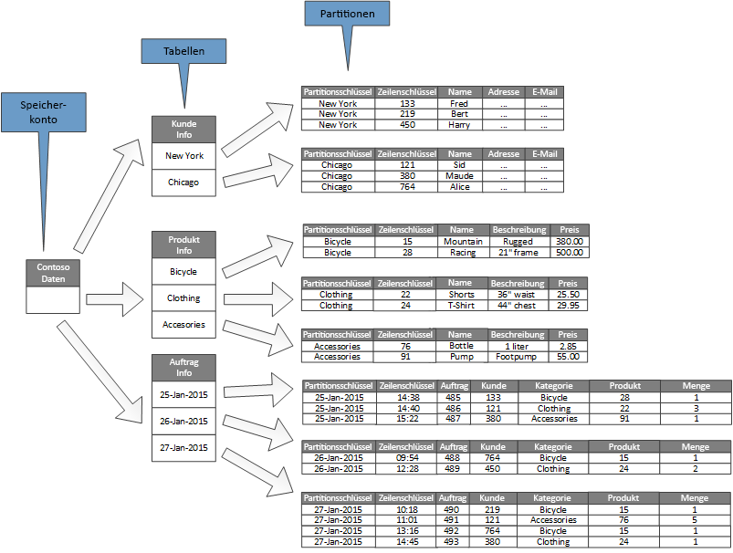
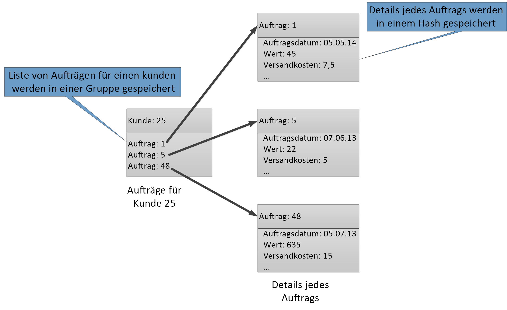

# DatenpartitionierungData partitioning
[!INCLUDE [header](../_includes/header.md)]

In vielen umfangreichen Lösungen werden Daten in getrennte Partitionen aufgeteilt, die getrennt verwaltet werden können und auf die separat zugegriffen werden kann.In many large-scale solutions, data is divided into separate partitions that can be managed and accessed separately. Die Partitionierungsstrategie muss sorgfältig ausgewählt werden, um die Vorteile zu maximieren und gleichzeitig nachteilige Auswirkungen zu minimieren.The partitioning strategy must be chosen carefully to maximize the benefits while minimizing adverse effects. Partitionierung kann die Skalierbarkeit verbessern, Konflikte reduzieren und die Leistung optimieren.Partitioning can help improve scalability, reduce contention, and optimize performance. Ein weiterer Vorteil der Partitionierung ist, dass sie einen Mechanismus zum Unterteilen von Daten nach Verwendungsmuster bereitstellen kann.Another benefit of partitioning is that it can provide a mechanism for dividing data by the pattern of use. Beispielsweise können Sie ältere, weniger aktive (kalte) Daten in kostengünstigeren Datenspeichern archivieren.For example, you can archive older, less active (cold) data in cheaper data storage.

## Gründe für DatenpartitionierungWhy partition data?
Die meisten Cloud-Anwendungen und Dienste speichern Daten als Teil ihrer Vorgänge ab und rufen diese auf.Most cloud applications and services store and retrieve data as part of their operations. Das Design der Datenspeicher, die eine Anwendung nutzt, kann einen erheblichen Einfluss auf die Leistung, den Durchsatz und die Skalierbarkeit eines Systems haben.The design of the data stores that an application uses can have a significant bearing on the performance, throughput, and scalability of a system. Eine Technik, die häufig für großmaßstäbliche Systeme eingesetzt wird, ist die Unterteilung von Daten in separate Partitionen.One technique that is commonly applied in large-scale systems is to divide the data into separate partitions.

> In diesem Artikel steht der Begriff *Partitionierung* für den Prozess der physischen Unterteilung von Daten in separate Datenspeicher.In this article, the term *partitioning* means the process of physically dividing data into separate data stores. Dies ist nicht dasselbe wie die SQL Server-Tabellenpartitionierung.It is not the same as SQL Server table partitioning.

Partitionieren von Daten kann eine Reihe von Vorteilen bieten.Partitioning data can offer a number of benefits. Es kann z. B. angewendet werden für:For example, it can be applied in order to:

* **Verbesserung der Skalierbarkeit**.**Improve scalability**. Beim zentralen Hochskalieren eines einzelnen Datenbanksystems wird schließlich ein physisches Hardwarelimit erreicht.When you scale up a single database system, it will eventually reach a physical hardware limit. Wenn Sie Daten auf mehrere Partitionen aufteilen, von denen jede auf einem separaten Server gehostet wird, können Sie das System fast unbegrenzt horizontal hochskalieren.If you divide data across multiple partitions, each of which is hosted on a separate server, you can scale out the system almost indefinitely.
* **Verbesserung der Leistung****Improve performance**. Zugriffe auf Daten in jeder Partition finden über eine kleinere Datenmenge statt.Data access operations on each partition take place over a smaller volume of data. Vorausgesetzt, dass die Daten auf geeignete Weise partitioniert werden, wird Ihr System dadurch viel effizienter.Provided that the data is partitioned in a suitable way, partitioning can make your system more efficient. Vorgänge, die mehr als eine Partition betreffen, können parallel ausgeführt werden.Operations that affect more than one partition can run in parallel. Jede Partition kann in der Nähe der Anwendung gefunden werden, die diese verwendet, um die Netzwerklatenz zu minimieren.Each partition can be located near the application that uses it to minimize network latency.
* **Verbesserung der Verfügbarkeit****Improve availability**. Das Aufteilen von Daten über mehrere Server hinweg vermeidet eine einzelne Fehlerquelle.Separating data across multiple servers avoids a single point of failure. Wenn ein Server ausfällt oder planmäßig gewartet wird, sind nur die Daten in der Partition nicht verfügbar.If a server fails, or is undergoing planned maintenance, only the data in that partition is unavailable. Vorgänge auf anderen Partitionen können fortgesetzt werden.Operations on other partitions can continue. Durch Erhöhen der Anzahl von Partitionen verringern sich die relativen Auswirkungen des Ausfalls eines einzelnen Servers, da der Prozentsatz an Daten reduziert wird, die nicht verfügbar sind.Increasing the number of partitions reduces the relative impact of a single server failure by reducing the percentage of data that will be unavailable. Das Replizieren jeder Partition kann das Risiko eines einzelnen Partitionsausfalls, der sich auf die Vorgänge auswirkt, reduzieren.Replicating each partition can further reduce the chance of a single partition failure affecting operations. Auch können kritische Daten, die dauerhaft hochverfügbar sein müssen, von Daten mit geringerem Wert (z. B. Protokolldateien) getrennt werden, die geringere Verfügbarkeitsanforderungen haben.It also makes it possible to separate critical data that must be continually and highly available from low-value data that has lower availability requirements (log files, for example).
* **Verbesserung der Sicherheit****Improve security**. Abhängig von der Art der Daten und ihrer Partitionierung können sensible und nicht sensible Daten in verschiedenen Partitionen und somit auf unterschiedlichen Servern bzw. in unterschiedlichen Datenspeichern gespeichert werden.Depending on the nature of the data and how it is partitioned, it might be possible to separate sensitive and non-sensitive data into different partitions, and therefore into different servers or data stores. Die Sicherheit kann dann speziell für die sensiblen Daten optimiert werden.Security can then be specifically optimized for the sensitive data.
* **Bereitstellen von Flexibilität bei Vorgängen**.**Provide operational flexibility**. Partitionieren bietet viele Möglichkeiten für die Feinabstimmung von Vorgängen, das Maximieren administrativer Effizienz und die Minimierung von Kosten.Partitioning offers many opportunities for fine tuning operations, maximizing administrative efficiency, and minimizing cost. Sie können beispielsweise basierend auf der Wichtigkeit der Daten in jeder Partition unterschiedliche Strategien für die Verwaltung, Überwachung, Sicherung und Wiederherstellung sowie für andere administrative Aufgaben definieren.For example, you can define different strategies for management, monitoring, backup and restore, and other administrative tasks based on the importance of the data in each partition.
* **Übereinstimmung der Daten mit dem Anwendungsmuster****Match the data store to the pattern of use**. Mithilfe der Partitionierung kann jede Partition basierend auf den Kosten und integrierten Funktionen, die dieser Datenspeicher bietet, auf einer anderen Art von Datenspeicher bereitgestellt werden.Partitioning allows each partition to be deployed on a different type of data store, based on cost and the built-in features that data store offers. Umfangreiche binäre Daten können z. B. in einem Blobdatenspeicher gespeichert werden, strukturiertere Daten dagegen in einer Dokumentendatenbank.For example, large binary data can be stored in a blob data store, while more structured data can be held in a document database. Weitere Informationen finden Sie im Patterns & Practices-Handbuch auf der Microsoft-Website unter [Building a polyglot solution] (Erstellen einer Polyglot-Lösung) sowie unter [Data access for highly-scalable solutions: Using SQL, NoSQL, and polyglot persistence] (Datenzugriff für hoch skalierbare Lösungen: mit SQL, NoSQL und Polyglot Persistence).For more information, see [Building a polyglot solution] in the patterns & practices guide and [Data access for highly-scalable solutions: Using SQL, NoSQL, and polyglot persistence] on the Microsoft website.

Einige Systeme implementieren keine Partitionierung, da sie als aufwendig anstatt als vorteilhaft empfunden wird.Some systems do not implement partitioning because it is considered a cost rather than an advantage. Häufige Erklärungen für diese Begründung umschließen:Common reasons for this rationale include:

* Viele Datenspeichersysteme unterstützen keine Verknüpfungen über Partitionen hinweg und es kann schwierig sein, in einem partitionierten System referenzielle Integrität zu wahren.Many data storage systems do not support joins across partitions, and it can be difficult to maintain referential integrity in a partitioned system. Es ist häufig erforderlich, Verknüpfungen zu implementieren und Integritätsprüfungen im Anwendungscode (in der Partitionierungsebene) vorzunehmen, was zu zusätzlichen E/A und höherer Anwendungskomplexität führen kann.It is frequently necessary to implement joins and integrity checks in application code (in the partitioning layer), which can result in additional I/O and application complexity.
* Verwalten von Partitionen ist nicht immer eine einfache Aufgabe.Maintaining partitions is not always a trivial task. In einem System, in dem die Daten flüchtig sind, müssen Sie die Partitionen in regelmäßigen Abständen neu verteilen, um Konflikte und Hotspots zu reduzieren.In a system where the data is volatile, you might need to rebalance partitions periodically to reduce contention and hot spots.
* Einige häufig verwendete Tools funktionieren mit partitionierten Daten nicht natürlich.Some common tools do not work naturally with partitioned data.

## Entwerfen von PartitionenDesigning partitions
Daten können auf unterschiedliche Weise partitioniert werden: horizontal, vertikal oder funktional.Data can be partitioned in different ways: horizontally, vertically, or functionally. Die von Ihnen gewählte Strategie hängt von dem Grund für die Partitionierung der Daten sowie von den Anforderungen der Anwendungen und Dienste ab, die die Daten verwenden werden.The strategy you choose depends on the reason for partitioning the data, and the requirements of the applications and services that will use the data.

> [!NOTE]
> Die in diesem Leitfaden beschriebenen Partitionierungsschemen werden auf eine Weise erläutert, die von der zugrunde liegenden Datenspeicherungstechnologie unabhängig ist.The partitioning schemes described in this guidance are explained in a way that is independent of the underlying data storage technology. Sie können auf viele Arten von Datenspeichern, einschließlich relationalen und NoSQL-Datenbanken, angewendet werden.They can be applied to many types of data stores, including relational and NoSQL databases.
>
>

### PartitionierungsstrategienPartitioning strategies
Die drei typischen Strategien zum Partitionieren von Daten sind:The three typical strategies for partitioning data are:

* **Horizontale Partitionierung** (häufig als *Sharding* bezeichnet).**Horizontal partitioning** (often called *sharding*). Bei dieser Strategie stellt jede Partition einen selbstständigen Datenspeicher dar, wobei jedoch alle Partitionen das gleiche Schema aufweisen.In this strategy, each partition is a data store in its own right, but all partitions have the same schema. Jede Partition ist als ein *Shard* bekannt und enthält eine bestimmte Teilmenge der Daten, z.B. alle Bestellungen für einen bestimmten Satz von Kunden in einer E-Commerce-Anwendung.Each partition is known as a *shard* and holds a specific subset of the data, such as all the orders for a specific set of customers in an e-commerce application.
* **Vertikale Partitionierung**.**Vertical partitioning**. Bei dieser Strategie enthält jede Partition eine Teilmenge der Felder für Elemente im Datenspeicher.In this strategy, each partition holds a subset of the fields for items in the data store. Die Felder werden gemäß ihrem Verwendungsmuster unterteilt.The fields are divided according to their pattern of use. Beispielsweise können häufig verwendete Felder in einer vertikalen Partition und weniger häufig verwendete Felder in einer anderen Partition platziert werden.For example, frequently accessed fields might be placed in one vertical partition and less frequently accessed fields in another.
* **Funktionale Partitionierung**.**Functional partitioning**. Bei dieser Strategie werden Daten nach der Art und Weise aggregiert, in der sie im System von jedem begrenzten Kontext verwendet werden.In this strategy, data is aggregated according to how it is used by each bounded context in the system. Ein Beispiel: In einem E-Commerce-System, das separate Geschäftsfunktionen für die Rechnungsstellung und die Verwaltung des Warenbestands implementiert, werden Rechnungsdaten möglicherweise in einer Partition und Daten zum Warenbestand in einer anderen Partition gespeichert.For example, an e-commerce system that implements separate business functions for invoicing and managing product inventory might store invoice data in one partition and product inventory data in another.

Es ist wichtig zu beachten, dass die hier beschriebenen Strategien kombiniert werden können.It’s important to note that the three strategies described here can be combined. Sie schließen sich nicht gegenseitig aus, und es empfiehlt sich, sie alle beim Entwurf eines Partitionierungsschemas zu berücksichtigen.They are not mutually exclusive, and we recommend that you consider them all when you design a partitioning scheme. Beispielsweise könnten Sie Daten in Shards unterteilen und dann die Daten mittels vertikaler Partitionierung innerhalb der einzelnen Shards weiter unterteilen.For example, you might divide data into shards and then use vertical partitioning to further subdivide the data in each shard. Auf ähnliche Weise können die Daten einer funktionalen Partition in Shards aufgeteilt werden (die ebenfalls vertikal partitioniert werden können).Similarly, the data in a functional partition can be split into shards (which can also be vertically partitioned).

Die unterschiedlichen Anforderungen der einzelnen Strategien können jedoch eine Reihe von in Konflikt stehenden Problemen auslösen.However, the differing requirements of each strategy can raise a number of conflicting issues. Sie müssen all diese möglichen Probleme bewerten und gegeneinander abwägen, wenn Sie ein Partitionierungsschema entwerfen, das sämtliche Leistungsziele der Datenverarbeitung für Ihr System erfüllen soll.You must evaluate and balance all of these when designing a partitioning scheme that meets the overall data processing performance targets for your system. Die folgenden Abschnitte untersuchen jede einzelne Strategien eingehender.The following sections explore each of the strategies in more detail.

### Horizontale Partitionierung (Sharding)Horizontal partitioning (sharding)
Abbildung 1 zeigt eine Übersicht der horizontalen Partitionierung oder Sharding.Figure 1 shows an overview of horizontal partitioning or sharding. In diesem Beispiel werden Warenbestandsdaten basierend auf dem Produktschlüssel in Shards unterteilt.In this example, product inventory data is divided into shards based on the product key. Jedes Shard enthält die Daten für einen zusammenhängenden Bereich von Shard-Schlüsseln (A-G und H-Z) in alphabetischer Anordnung.Each shard holds the data for a contiguous range of shard keys (A-G and H-Z), organized alphabetically.

*Abbildung 1: Horizontale Partitionierung (Sharding) von Daten auf Grundlage eines Partitionsschlüssels**Figure 1. Horizontally partitioning (sharding) data based on a partition key*

Durch Sharding können Sie die Last auf mehrere Computer verteilen, was Konflikte reduziert und die Leistung verbessert.Sharding helps you spread the load over more computers, which reduces contention and improves performance. Sie können das System horizontal hochskalieren, indem Sie weitere Shards hinzufügen, die auf zusätzlichen Servern ausgeführt werden.You can scale the system out by adding further shards that run on additional servers.

Der wichtigste Faktor bei der Implementierung dieser Partitionierungsstrategie ist die Auswahl der Shardingschlüssel.The most important factor when implementing this partitioning strategy is the choice of sharding key. Es kann schwierig sein, den Schlüssel zu ändern, nachdem das System in Betrieb ist.It can be difficult to change the key after the system is in operation. Der Schlüssel muss sicherstellen, dass Daten auf eine Weise partitioniert werden, die die Workload möglichst gleichmäßig über die Shards hinweg verteilt.The key must ensure that data is partitioned so that the workload is as even as possible across the shards.

Beachten Sie, dass verschiedene Shards keine ähnliche Datenmengen enthalten müssen.Note that different shards do not have to contain similar volumes of data. Wichtiger ist es, die Anzahl von Anfragen gleichmäßig zu verteilen.Rather, the more important consideration is to balance the number of requests. Einige Shards sind möglicherweise sehr groß, aber es gibt nur eine geringe Anzahl von Zugriffsvorgängen für jedes Element.Some shards might be very large, but each item is the subject of a low number of access operations. Andere Shards können kleiner sein, aber es wird viel häufiger auf jedes Element zugegriffen.Other shards might be smaller, but each item is accessed much more frequently. Außerdem ist es wichtig sicherzustellen, dass kein einzelner Shard die Skalierungsgrenzen (im Hinblick auf Kapazität und Verarbeitungsressourcen) des Datenspeichers überschreitet, der zum Hosten dieses Shards verwendet wird.It is also important to ensure that a single shard does not exceed the scale limits (in terms of capacity and processing resources) of the data store that's being used to host that shard.

Wenn Sie ein Shardingschema verwenden, sollten Sie auch vermeiden, Hotspots (oder „heiße“ Partitionen) zu erstellen, die möglicherweise die Leistung und Verfügbarkeit beeinträchtigen.If you use a sharding scheme, avoid creating hotspots (or hot partitions) that can affect performance and availability. Beispielsweise verhindert das Verwenden eines Hashs einer Kunden-ID anstelle des ersten Buchstaben des Kundennamens eine ungleichmäßige Verteilung, die durch häufige und weniger häufige Anfangsbuchstaben entsteht.For example, if you use a hash of a customer identifier instead of the first letter of a customer’s name, you prevent the unbalanced distribution that results from common and less common initial letters. Dies ist ein übliches Verfahren, mit dessen Hilfe Daten gleichmäßiger über die Partitionen verteilt werden können.This is a typical technique that helps distribute data more evenly across partitions.

Wählen Sie einen Shardingschlüssel, der die Notwendigkeit minimiert, zu einem späteren Zeitpunkt große Shards in kleinere Teile aufteilen, kleinere Shards in größeren Partitionen zusammenfügen oder das Schema ändern zu müssen, das die in einem Satz von Partitionen gespeicherten Daten beschreibt.Choose a sharding key that minimizes any future requirements to split large shards into smaller pieces, coalesce small shards into larger partitions, or change the schema that describes the data stored in a set of partitions. Diese Vorgänge können sehr zeitaufwendig sein und erfordern es möglicherweise, während der Ausführung einen oder mehrere Shards offline zu schalten.These operations can be very time consuming, and might require taking one or more shards offline while they are performed.

Wenn Shards repliziert werden, ist es eventuell möglich, einige der Replikate online zu halten, während andere Replikate geteilt, zusammengeführt oder neu konfiguriert werden.If shards are replicated, it might be possible to keep some of the replicas online while others are split, merged, or reconfigured. Das System muss jedoch möglicherweise die Vorgänge begrenzen, die für die Daten in diesen Shards ausgeführt werden können, während die Neukonfiguration stattfindet.However, the system might need to limit the operations that can be performed on the data in these shards while the reconfiguration is taking place. Beispielsweise können die Daten in den Replikaten als schreibgeschützt markiert werden, um den Umfang von Inkonsistenzen zu begrenzen, die bei der Umstrukturierung von Shards auftreten können.For example, the data in the replicas can be marked as read-only to limit the scope of inconsistences that might occur while shards are being restructured.

> Ausführlichere Informationen und Anweisungen zu vielen dieser Überlegungen sowie zu bewährten Verfahren für das Entwerfen von Datenspeichern, die horizontale Partitionierung implementieren, finden Sie unter [Sharding Pattern](Shardingmuster).For more detailed information and guidance about many of these considerations, and good practice techniques for designing data stores that implement horizontal partitioning, see [Sharding pattern].
>
>

### Vertikale PartitionierungVertical partitioning
Die häufigste Verwendung für die vertikale Partitionierung ist, die E/A und die Leistungskosten zu reduzieren, die mit dem Abrufen der Elemente verknüpft sind, auf die am häufigsten zugegriffen wird.The most common use for vertical partitioning is to reduce the I/O and performance costs associated with fetching the items that are accessed most frequently. Abbildung 2 zeigt ein Beispiel für die vertikale Partitionierung.Figure 2 shows an example of vertical partitioning. In diesem Beispiel sind verschiedene Eigenschaften für jedes Datenelement in verschiedenen Partitionen enthalten.In this example, different properties for each data item are held in different partitions. Eine Partition enthält Daten, auf die häufiger zugegriffen wird, einschließlich Name, Beschreibung und Preisinformationen für Produkte.One partition holds data that is accessed more frequently, including the name, description, and price information for products. Eine andere Partition enthält die Menge im Warenbestand und das Datum der letzten Bestellung.Another holds the volume in stock and the last ordered date.

*Abbildung 2: Vertikale Partitionierung von Daten nach Verwendungsmuster**Figure 2. Vertically partitioning data by its pattern of use*

In diesem Beispiel fragt die Anwendung regelmäßig den Produktnamen, die Beschreibung und den Preis ab, wenn Kunden Produktdetails angezeigt werden.In this example, the application regularly queries the product name, description, and price when displaying the product details to customers. Die Lagerbestand und das Datum, an dem das Produkt zuletzt vom Hersteller bestellt wurde, sind in einer separaten Partition enthalten, da diese beiden Elemente häufig zusammen verwendet werden.The stock level and date when the product was last ordered from the manufacturer are held in a separate partition because these two items are commonly used together.

Dieses Partitionierungsschema bietet den zusätzlichen Vorteil, dass sich relativ langsam bewegende Daten (Produktname, Beschreibung und Preis) von den dynamischeren Daten (Lagerbestand und Datum der letzten Bestellung) getrennt werden.This partitioning scheme has the added advantage that the relatively slow-moving data (product name, description, and price) is separated from the more dynamic data (stock level and last ordered date). Für eine Anwendung ist es möglicherweise sinnvoll, die sich langsam bewegenden Daten im Arbeitsspeicher zwischenzuspeichern, wenn auf diese regelmäßig zugegriffen wird.An application might find it beneficial to cache the slow-moving data in memory if it is frequently accessed.

Ein weiteres typisches Szenario für diese Partitionierungsstrategie ist die Maximierung der Sicherheit sensibler Daten.Another typical scenario for this partitioning strategy is to maximize the security of sensitive data. Dies können Sie z. B. durch Speichern von Kreditkartennummern und der entsprechenden Kartenprüfnummern in separaten Partitionen implementieren.For example, you can do this by storing credit card numbers and the corresponding card security verification numbers in separate partitions.

Eine vertikale Partitionierung kann auch die erforderlichen gleichzeitigen Zugriffe auf die Daten verringern.Vertical partitioning can also reduce the amount of concurrent access that's needed to the data.

> Vertikale Partitionierung findet auf der Entitätsebene in einem Datenspeicher statt, wobei eine Entität teilweise normalisiert wird, um sie von einem *breiten* Element in einen Satz *schmaler Elemente* aufzuschlüsseln.Vertical partitioning operates at the entity level within a data store, partially normalizing an entity to break it down from a *wide* item to a set of *narrow* items. Es eignet sich ideal für spaltenorientierte Datenspeicher wie z. B. HBase und Cassandra.It is ideally suited for column-oriented data stores such as HBase and Cassandra. Wenn es unwahrscheinlich ist, dass sich Daten in einer Auflistung von Spalten ändern, können Sie auch in Betracht ziehen, Spaltenspeicher im SQL Server zu nutzen.If the data in a collection of columns is unlikely to change, you can also consider using column stores in SQL Server.
>
>

### Funktionale PartitionierungFunctional partitioning
Für Systeme, in denen es möglich ist, einen gebundenen Kontext für jeden bestimmten Geschäftsbereich oder Dienst in der Anwendung zu identifizieren, bietet die funktionale Partitionierung ein Verfahren zur Verbesserung der Isolation und Datenzugriffsleistung.For systems where it is possible to identify a bounded context for each distinct business area or service in the application, functional partitioning provides a technique for improving isolation and data access performance. Darüber hinaus wird die funktionale Partitionierung häufig verwendet, um Lese/Schreib-Daten von schreibgeschützten Daten zu trennen, die für Berichtszwecke verwendet werden.Another common use of functional partitioning is to separate read-write data from read-only data that's used for reporting purposes. Abbildung 3 zeigt eine Übersicht einer funktionalen Partitionierung, in der Bestandsdaten von Kundendaten getrennt werden.Figure 3 shows an overview of functional partitioning where inventory data is separated from customer data.

*Abbildung 3: Funktionale Datenpartitionierung nach begrenztem Kontext oder Unterdomäne**Figure 3. Functionally partitioning data by bounded context or subdomain*

Diese Partitionierungsstrategie kann helfen, Datenzugriffskonflikte über verschiedene Teile eines Systems hinweg zu reduzieren.This partitioning strategy can help reduce data access contention across different parts of a system.

## Entwerfen von Partitionen für SkalierbarkeitDesigning partitions for scalability
Es ist wichtig, die Größe und Workload für jede Partition zu berücksichtigen und auszubalancieren, um die Daten so zu verteilen, dass eine maximale Skalierbarkeit erreicht wird.It's vital to consider size and workload for each partition and balance them so that data is distributed to achieve maximum scalability. Allerdings müssen Sie die Daten auch so partitionieren, dass nicht die Skalierungsgrenzen des Speicherplatzes der einzelnen Partitionen überschritten werden.However, you must also partition the data so that it does not exceed the scaling limits of a single partition store.

Gehen Sie beim Entwerfen von Partitionen für maximale Skalierbarkeit folgendermaßen vor:Follow these steps when designing partitions for scalability:

1. Analysieren Sie die Anwendung, um die Datenzugriffsmuster zu verstehen, wie z. B. die Größe des Resultsets jeder Abfrage, die Häufigkeit des Zugriffs, die inhärente Latenz und die serverseitige Anforderungen an die Rechenleistung.Analyze the application to understand the data access patterns, such as the size of the result set returned by each query, the frequency of access, the inherent latency, and the server-side compute processing requirements. In vielen Fällen werden einige Hauptentitäten den Großteil der Verarbeitungsressourcen anfordern.In many cases, a few major entities will demand most of the processing resources.
2. Verwenden Sie diese Analyse, um die aktuellen und zukünftigen Skalierbarkeitsziele wie z. B. die Größe der Daten und die Workload festzulegen.Use this analysis to determine the current and future scalability targets, such as data size and workload. Anschließend verteilen Sie die Daten auf die Partitionen, um das Skalierbarkeitsziel zu erreichen.Then distribute the data across the partitions to meet the scalability target. Für die Strategie zur horizontalen Partitionierung ist die Auswahl des angemessenen Shardschlüssels wichtig, um sicherzustellen, dass die Verteilung gleichmäßig erfolgt ist.In the horizontal partitioning strategy, choosing the appropriate shard key is important to make sure distribution is even. Weitere Informationen finden Sie unter [Sharding Pattern].For more information, see the [Sharding pattern].
3. Stellen Sie sicher, dass die für jede Partition verfügbaren Ressourcen ausreichen, um den Anforderungen an die Skalierbarkeit im Hinblick auf die Größe der Daten und den Durchsatz zu entsprechen.Make sure that the resources available to each partition are sufficient to handle the scalability requirements in terms of data size and throughput. Beispielsweise erzwingt der Knoten, der eine Partition hostet, möglicherweise eine harte Grenze für die Menge an Speicherplatz, Verarbeitungsleistung oder Netzwerkbandbreite, die er bereitstellt.For example, the node that's hosting a partition might impose a hard limit on the amount of storage space, processing power, or network bandwidth that it provides. Wenn die Datenspeicher- und Verarbeitungsanforderungen diese Grenzwerte wahrscheinlich überschreiten werden, kann es notwendig sein, Ihre Partitionierungsstrategie zu verfeinern oder die Daten noch weiter aufzuteilen.If the data storage and processing requirements are likely to exceed these limits, it might be necessary to refine your partitioning strategy or split data out further. Eine Herangehensweise an die Skalierbarkeit kann es z. B. sein, Protokolldaten von den Kernfunktionen der Anwendung zu trennen.For example, one scalability approach might be to separate logging data from the core application features. Dazu verwenden Sie getrennte Datenspeicher, um zu verhindern, dass die Datenspeicheranforderungen insgesamt die Skalierungsgrenzwerte des Knotens überschreiten.You do this by using separate data stores to prevent the total data storage requirements from exceeding the scaling limit of the node. Wenn die Gesamtzahl der Datenspeicher die Grenzwerte des Knotens überschreitet, kann es notwendig sein, separate Speicherknoten zu verwenden.If the total number of data stores exceeds the node limit, it might be necessary to use separate storage nodes.
4. Überwachen Sie das verwendete System, um sicherzustellen, dass die Daten wie erwartet verteilt werden und die Partitionen die vorgegebene Last verarbeiten können.Monitor the system under use to verify that the data is distributed as expected and that the partitions can handle the load that is imposed on them. Es ist möglich, dass die tatsächliche Nutzung nicht der durch die Analyse prognostizierten Nutzung entspricht.It's possible that the usage does not match the usage that's anticipated by the analysis. In diesem Fall können die Partitionen möglicherweise neu aufgeteilt werden.In that case, it might be possible to rebalance the partitions. Sollte dies nicht möglich sein, müssen eventuell einige Teile des Systems umgestaltet werden, um die erforderliche Balance zu erzielen.Failing that, it might be necessary to redesign some parts of the system to gain the required balance.

Beachten Sie, dass einige Cloudumgebungen Ressourcen gemäß Infrastrukturgrenzen zuordnen.Note that some cloud environments allocate resources in terms of infrastructure boundaries. Stellen Sie sicher, dass die Limits der von Ihnen ausgewählten Infrastrukturgrenze hinsichtlich Datenspeicherung, Verarbeitungsleistung und Bandbreite ausreichend Platz für das erwartete Wachstum der Datenmenge bieten.Ensure that the limits of your selected boundary provide enough room for any anticipated growth in the volume of data, in terms of data storage, processing power, and bandwidth.

Wenn Sie beispielsweise den Azure-Tabellenspeicher verwenden, benötigt ein ausgelasteter Shard möglicherweise mehr Ressourcen, als in einer einzelnen Partition zur Verarbeitung von Anforderungen zur Verfügung stehen.For example, if you use Azure table storage, a busy shard might require more resources than are available to a single partition to handle requests. (Die Menge von Anforderungen, die von einer einzelnen Partition in einem bestimmten Zeitraum verarbeitet werden können, ist begrenzt.(There is a limit to the volume of requests that can be handled by a single partition in a particular period of time. Weitere Informationen finden Sie auf der Microsoft-Website im Artikel [Skalierbarkeits- und Leistungsziele für Azure Storage] .)See the page [Azure storage scalability and performance targets] on the Microsoft website for more details.)

 In diesem Fall muss der Shard womöglich neu partitioniert werden, um die Last zu verteilen.If this is the case, the shard might need to be repartitioned to spread the load. Wenn die Gesamtgröße oder der Gesamtdurchsatz dieser Tabellen die Kapazität eines Speicherkontos überschreitet, kann das Erstellen zusätzlicher Speicherkonten sowie die Verteilung der Tabellen auf diese Konten erforderlich sein.If the total size or throughput of these tables exceeds the capacity of a storage account, it might be necessary to create additional storage accounts and spread the tables across these accounts. Überschreitet die Anzahl der Speicherkonten die Anzahl der Konten, die für ein Abonnement verfügbar sind, müssen möglicherweise mehrere Abonnements verwendet werden.If the number of storage accounts exceeds the number of accounts that are available to a subscription, then it might be necessary to use multiple subscriptions.

## Entwerfen von Partitionen für die AbfrageleistungDesigning partitions for query performance
Die Abfrageleistung kann oft mit kleineren Datensätzen und der parallelen Ausführung von Abfragen erhöht werden.Query performance can often be boosted by using smaller data sets and by running parallel queries. Jede Partition sollte einen kleinen Anteil des gesamten Datasets enthalten.Each partition should contain a small proportion of the entire data set. Diese Reduzierung des Volumens kann die Leistung von Abfragen verbessern.This reduction in volume can improve the performance of queries. Allerdings ist das Partitionieren keine Alternative zum angemessenen Entwerfen und Konfigurieren einer Datenbank.However, partitioning is not an alternative for designing and configuring a database appropriately. Stellen Sie z. B. sicher, dass Sie über die erforderlichen Indizes verfügen, wenn Sie eine relationale Datenbank verwenden.For example, make sure that you have the necessary indexes in place if you are using a relational database.

Gehen Sie beim Entwerfen von Partitionen für maximale Abfrageleistung folgendermaßen vor:Follow these steps when designing partitions for query performance:

1. Überprüfen Sie die Anwendungsanforderungen und Leistung:Examine the application requirements and performance:
   * Berücksichtigen Sie die Unternehmensanforderungen, um die kritischen Anfragen zu bestimmen, die stets schnell ausgeführt werden müssen.Use the business requirements to determine the critical queries that must always perform quickly.
   * Überwachen Sie das System, um Abfragen zu identifizieren, die nur langsam durchgeführt werden.Monitor the system to identify any queries that perform slowly.
   * Ermitteln Sie, welche Abfragen am häufigsten ausgeführt werden.Establish which queries are performed most frequently. Eine einzelne Instanz einer Abfrage kann minimale Kosten haben, aber der kumulative Ressourcenverbrauch könnte erheblich sein.A single instance of each query might have minimal cost, but the cumulative consumption of resources could be significant. Es kann von Vorteil sein, die Daten, die durch diese Abfragen abgerufen werden, in eine bestimmte Partition oder sogar einen Cache zu separieren.It might be beneficial to separate the data that's retrieved by these queries into a distinct partition, or even a cache.
2. Partitionieren Sie die Daten, die für eine geringe Leistung verantwortlich sind:Partition the data that is causing slow performance:
   * Beschränken Sie die Größe der einzelnen Partitionen, sodass die Abfrageantwortzeit innerhalb des Ziels liegt.Limit the size of each partition so that the query response time is within target.
   * Entwerfen Sie den Shardschlüssel so, dass die Anwendung die Partition problemlos finden kann, wenn Sie eine horizontale Partitionierung implementieren.Design the shard key so that the application can easily find the partition if you are implementing horizontal partitioning. Dies verhindert, dass die Abfrage jede Partition durchsuchen muss.This prevents the query from having to scan through every partition.
   * Berücksichtigen Sie den Speicherort einer Partition.Consider the location of a partition. Versuchen Sie nach Möglichkeit die Daten in Partitionen zu belassen, die geografisch dicht bei den Anwendungen und Benutzern liegen, die darauf zugreifen.If possible, try to keep data in partitions that are geographically close to the applications and users that access it.
3. Besitzt eine Entität Durchsatz und Anforderungen an die Abfrageleistung, verwenden Sie funktionale Partitionierung basierend auf dieser Entität.If an entity has throughput and query performance requirements, use functional partitioning based on that entity. Wenn die Anforderungen dadurch immer noch nicht erfüllt sind, wenden Sie auch eine horizontale Partitionierung an.If this still doesn't satisfy the requirements, apply horizontal partitioning as well. In den meisten Fällen reicht eine einzelne Partitionierungsstrategie, aber in einigen Fällen ist es effizienter, beide Strategien zu kombinieren.In most cases a single partitioning strategy will suffice, but in some cases it is more efficient to combine both strategies.
4. Erwägen Sie asynchrone Abfragen, die zur Verbesserung der Leistung über Partitionen hinweg parallel ausgeführt werden.Consider using asynchronous queries that run in parallel across partitions to improve performance.

## Entwerfen von Partitionen für VerfügbarkeitDesigning partitions for availability
Partitionieren von Daten kann die Verfügbarkeit von Anwendungen verbessern, indem Sie sicherstellen, dass das gesamte Dataset keine einzelne Fehlerquelle darstellt und einzelne Teilmengen des Datasets unabhängig voneinander verwaltet werden können.Partitioning data can improve the availability of applications by ensuring that the entire dataset does not constitute a single point of failure and that individual subsets of the dataset can be managed independently. Das Replizieren von Partitionen mit wichtigen Daten kann die Verfügbarkeit auch verbessern.Replicating partitions that contain critical data can also improve availability.

Berücksichtigen Sie beim Entwerfen und Implementieren von Partitionen die folgenden Faktoren, die sich auf die Verfügbarkeit auswirken:When designing and implementing partitions, consider the following factors that affect availability:

* **Wie kritisch sind die Daten für den Geschäftsbetrieb?****How critical the data is to business operations**. Einige Daten können kritische geschäftliche Informationen wie z. B. Rechnungsdetails oder Banktransaktionen umfassen.Some data might include critical business information such as invoice details or bank transactions. Andere Daten enthalten möglicherweise weniger kritische operative Informationen, wie Protokolldateien, Daten zur Leistungsnachverfolgung usw.Other data might include less critical operational data, such as log files, performance traces, and so on. Berücksichtigen Sie nach dem Ermitteln der jeweiligen Daten Folgendes:After identifying each type of data, consider:
  * Speichern von kritischen Daten in hochverfügbaren Partitionen mit einem geeigneten Sicherungsplans.Storing critical data in highly-available partitions with an appropriate backup plan.
  * Einrichten von separater Verwaltung und Überwachungsmechanismen oder Verfahren für die verschiedenen Kritikalitäten von jedem Dataset.Establishing separate management and monitoring mechanisms or procedures for the different criticalities of each dataset. Speichern Sie Daten der gleichen Wichtigkeitsstufe in der gleichen Partition, sodass sie mit angemessener Häufigkeit zusammen gesichert werden können.Place data that has the same level of criticality in the same partition so that it can be backed up together at an appropriate frequency. Partitionen, die Daten für Banktransaktionen enthalten, müssen z. B. häufiger gesichert werden als Partitionen mit Protokollierungs- oder Nachverfolgungsinformationen.For example, partitions that hold data for bank transactions might need to be backed up more frequently than partitions that hold logging or trace information.
* **Wie werden die einzelnen Partitionen verwaltet?****How individual partitions can be managed**. Das Entwerfen von Partitionen, um unabhängige Verwaltung und Wartung zu unterstützen, bietet mehrere Vorteile.Designing partitions to support independent management and maintenance provides several advantages. Zum Beispiel:For example:
  * Wenn eine Partition fehlschlägt, kann sie unabhängig wiederhergestellt werden, ohne Auswirkungen auf Instanzen von Anwendungen zu haben, die auf Daten in anderen Partitionen zugreifen.If a partition fails, it can be recovered independently without affecting instances of applications that access data in other partitions.
  * Das Partitionieren von Daten nach geografischem Bereich ermöglicht die Ausführung von geplanten Wartungsaufgaben außerhalb der Spitzenzeiten für jeden Standort.Partitioning data by geographical area allows scheduled maintenance tasks to occur at off-peak hours for each location. Stellen Sie sicher, dass die Partitionen nicht zu groß sind, um zu verhindern, dass eine geplante Wartung während dieses Zeitraums abgeschlossen wird.Ensure that partitions are not too big to prevent any planned maintenance from being completed during this period.
* **Sollen kritische Daten partitionsübergreifend repliziert werden?****Whether to replicate critical data across partitions**. Diese Strategie kann Verfügbarkeit und Leistung verbessern, obwohl es auch zu Konsistenzproblemen führen kann.This strategy can improve availability and performance, although it can also introduce consistency issues. Es dauert eine Weile, bis Änderungen an Daten in einer Partition mit jedem Replikat synchronisiert wurden.It takes time for changes made to data in a partition to be synchronized with every replica. Während dieses Zeitraums enthalten verschiedene Partitionen unterschiedliche Datenwerte.During this period, different partitions will contain different data values.

## Grundlegendes zu den Auswirkungen der Partitionierung auf Entwurf und EntwicklungUnderstanding how partitioning affects design and development
Durch Partitionierung werden der Entwurf und die Entwicklung des Systems komplexer.Using partitioning adds complexity to the design and development of your system. Betrachten Sie die Partitionierung als grundlegenden Bestandteil des Systementwurfs, selbst wenn das System zunächst nur eine Partition umfasst.Consider partitioning as a fundamental part of system design even if the system initially only contains a single partition. Wenn Sie eine Partitionierung erst dann vornehmen, wenn das System bereits Leistungs- und Skalierbarkeitsprobleme zeigt, steigt die Komplexität, da Sie mittlerweile ein Live-System zu verwalten haben.If you address partitioning as an afterthought, when the system starts to suffer performance and scalability issues, the complexity increases because you already have a live system to maintain.

Wenn Sie das System in dieser Umgebung partitionieren, müssen Sie die Datenzugriffslogik ändern.If you update the system to incorporate partitioning in this environment, it necessitates modifying the data access logic. Dazu kann auch gehören, dass Sie große Mengen bereits vorhandener Daten migrieren müssen, um sie auf die Partitionen zu verteilen – dies kann zu Konflikten führen, da die Benutzer erwarten, das System weiterhin nutzen zu können.It can also involve migrating large quantities of existing data to distribute it across partitions, often while users expect to be able to continue using the system.

In einigen Fällen wird die Partitionierung nicht als wichtig angesehen, da das ursprüngliche Dataset klein ist und problemlos von einem einzelnen Server verarbeitet werden kann.In some cases, partitioning is not considered important because the initial dataset is small and can be easily handled by a single server. Dies mag für ein System zutreffen, das voraussichtlich nicht über seine Anfangsgröße hinaus skaliert werden muss, viele kommerzielle Systeme müssen jedoch mit zunehmender Benutzeranzahl erweitert werden.This might be true in a system that is not expected to scale beyond its initial size, but many commercial systems need to expand as the number of users increases. Diese Erweiterung wird in der Regel von einer Zunahme der Datenmenge begleitet.This expansion is typically accompanied by a growth in the volume of data.

Es ist auch wichtig zu verstehen, dass die Partitionierung nicht immer eine Funktion von großen Datenspeichern ist.It's also important to understand that partitioning is not always a function of large data stores. Beispielsweise kann auf einen kleinen Datenspeicher  von mehreren hundert gleichzeitigen Clients intensiv zugegriffen werden.For example, a small data store might be heavily accessed by hundreds of concurrent clients. Das Partitionieren der Daten kann in dieser Situation helfen, Konflikte zu minimieren und den Durchsatz verbessern.Partitioning the data in this situation can help to reduce contention and improve throughput.

Beachten Sie beim Entwerfen eines Schemas für die Datenpartitionierung folgende Punkte:Consider the following points when you design a data partitioning scheme:

* **Halten Sie die Daten für die am häufigsten verwendeten Datenbankvorgänge nach Möglichkeit in jeder Partition zusammen, um partitionsübergreifende Datenzugriffsvorgänge zu minimieren.****Where possible, keep data for the most common database operations together in each partition to minimize cross-partition data access operations**. Abfragen über Partitionen hinweg kann mehr Zeit in Anspruch nehmen als Abfragen innerhalb einer einzelnen Partition. Das Optimieren der Partitionen für eine Reihe von Abfragen könnte jedoch andere Sätze von Abfragen beeinträchtigen.Querying across partitions can be more time-consuming than querying only within a single partition, but optimizing partitions for one set of queries might adversely affect other sets of queries. Wenn sich partitionsübergreifende Abfragen nicht vermeiden lassen, minimieren Sie die Abfragezeit, indem Sie parallele Abfragen ausführen und die Ergebnisse innerhalb der Anwendung aggregieren.When you can't avoid querying across partitions, minimize query time by running parallel queries and aggregating the results within the application. Diese Herangehensweise lässt sich möglicherweise nicht in allen Fällen umsetzen, z. B. wenn ein Ergebnis aus einer bestimmten Abfrage für die nächste Abfrage verwendet werden muss.This approach might not be possible in some cases, such as when it's necessary to obtain a result from one query and use it in the next query.
* **Wenn in Abfragen relativ statische Referenzdaten genutzt werden, z.B. Tabellen mit Postleitzahlen oder Produktlisten, sollten Sie erwägen, diese Daten in allen Partitionen zu replizieren, um die Anforderungen für separate Suchvorgänge in den verschiedenen Partitionen zu reduzieren.****If queries make use of relatively static reference data, such as postal code tables or product lists, consider replicating this data in all of the partitions to reduce the requirement for separate lookup operations in different partitions**. Dadurch lässt sich auch die Wahrscheinlichkeit verringern, dass Referenzdaten zu einem „heißen“ Dataset mit umfangreichem Datenverkehr aus dem gesamten System werden.This approach can also reduce the likelihood of the reference data becoming a "hot" dataset that is subject to heavy traffic from across the entire system. Das Synchronisieren von Änderungen, die an diesen Referenzdaten vorgenommen werden, ist aber mit zusätzlichem Aufwand verbunden.However,   there is an additional cost associated with synchronizing any changes that might occur to this reference data.
* **Minimieren Sie nach Möglichkeit die Anforderungen für referenzielle Integrität über vertikale und funktionale Partitionen hinweg.****Where possible, minimize requirements for referential integrity across vertical and functional partitions**. In diesen Schemen ist die Anwendung selbst für die Wahrung der referenziellen Integrität über Partitionen hinweg verantwortlich, wenn die Daten aktualisiert und verarbeitet werden.In these schemes, the application itself is responsible for maintaining referential integrity across partitions when data is updated and consumed. Abfragen, die Daten über mehrere Partitionen hinweg verknüpfen müssen, werden langsamer ausgeführt als Abfragen, die nur Daten in der gleichen Partition verknüpfen, da die Anwendung in der Regel aufeinanderfolgende Abfragen basierend auf einem Schlüssel und dann auf einem Fremdschlüssel durchführen muss.Queries that must join data across multiple partitions run more slowly than queries that join data only within the same partition because the application typically needs to perform consecutive queries based on a key and then on a foreign key. Ziehen Sie stattdessen in Betracht, die relevanten Daten zu replizieren oder zu denormalisieren.Instead, consider replicating or de-normalizing the relevant data. Um die Zeit für Abfragen zu minimieren, bei denen partitionsübergreifende Verknüpfungen notwendig sind, führen Sie parallele Abfragen über die Partitionen hinweg aus, und verknüpfen Sie die Daten innerhalb der Anwendung.To minimize the query time where cross-partition joins are necessary, run parallel queries over the partitions and join the data within the application.
* **Wägen Sie die Auswirkungen ab, die das Partitionierungsschema möglicherweise auf die Datenkonsistenz über die Partitionen hinweg hat.****Consider the effect that the partitioning scheme might have on the data consistency across partitions.** Überprüfen Sie, ob eine hohe Konsistenz tatsächlich erforderlich ist.Evaluate whether strong consistency is actually a requirement. Stattdessen ist eine gängige Vorgehensweise in der Cloud, letztendliche Konsistenz zu implementieren.Instead, a common approach in the cloud is to implement eventual consistency. Die Daten in jeder Partition werden separat aktualisiert, und die Anwendungslogik stellt sicher, dass alle Updates erfolgreich abgeschlossen werden.The data in each partition is updated separately, and the application logic ensures that the updates are all completed successfully. Die Logik verarbeitet auch alle Inkonsistenzen, die durch Abfragen von Daten während eines letztlich konsistenten Vorgangs entstehen.It also handles the inconsistencies that can arise from querying data while an eventually consistent operation is running. Weitere Informationen zum Implementieren von letztlicher Konsistenz finden Sie unter [Data Consistency Primer](Grundlagen der Datenkonsistenz).For more information about implementing eventual consistency, see the [Data consistency primer].
* **Überlegen Sie, wie Abfragen die richtige Partition finden.****Consider how queries locate the correct partition**. Wenn eine Abfrage alle Partitionen durchsuchen muss, um die erforderlichen Daten zu finden, wirkt sich das erheblich auf die Leistung aus, auch wenn mehrere parallele Abfragen ausgeführt werden.If a query must scan all partitions to locate the required data, there is a significant impact on performance, even when multiple parallel queries are running. Abfragen, die mit vertikalen und funktionalen Partitionierungsstrategien verwendet werden, können natürlich die Partitionen angeben.Queries that are used with vertical and functional partitioning strategies can naturally specify the partitions. Allerdings kann bei Verwendung der horizontalen Partitionierung (Sharding) das Auffinden eines Elements schwierig sein, da jeder Shard über das gleiche Schema verfügt.However, horizontal partitioning (sharding) can make locating an item difficult because every shard has the same schema. Eine typische Lösung für Sharding ist, eine Zuordnung zu verwalten, die verwendet werden kann, um den Shard-Speicherort für bestimmte Datenelemente zu suchen.A typical solution for sharding is to maintain a map that can be used to look up the shard location for specific items of data. Diese Zuordnung kann in der Shardinglogik der Anwendung implementiert sein oder vom Datenspeicher verwaltet werden, wenn transparentes Sharding unterstützt wird.This map can be implemented in the sharding logic of the application, or maintained by the data store if it supports transparent sharding.
* **Bei Verwendung einer horizontalen Partitionierungsstrategie sollten Sie einen regelmäßigen Neuausgleich der Shards erwägen.****When using a horizontal partitioning strategy, consider periodically rebalancing the shards**. So lassen sich die Daten nach Größe und Workload gleichmäßig verteilen, um Hotspots zu minimieren, die Abfrageleistung zu maximieren und physische Speichereinschränkungen zu umgehen.This helps distribute the data evenly by size and by workload to minimize hotspots, maximize query performance, and work around physical storage limitations. Dies ist jedoch eine komplexe Aufgabe, die häufig ein benutzerdefiniertes Tool oder einen benutzerdefinierten Prozess erfordert.However, this is a complex task that often requires the use of a custom tool or process.
* **Die Replikation jeder Partition bietet zusätzlichen Schutz vor Ausfällen.****If you replicate each partition, it provides additional protection against failure**. Wenn ein einzelnes Replikat fehlschlägt, können Abfragen gegen eine Arbeitskopie geleitet werden.If a single replica fails, queries can be directed towards a working copy.
* **Wenn die physischen Grenzen einer Partitionierungsstrategie erreicht sind, müssen Sie die Skalierbarkeit auf eine andere Ebene erweitern.****If you reach the physical limits of a partitioning strategy, you might need to extend the scalability to a different level**. Wurde die Partitionierung beispielsweise auf Datenbankebene implementiert, müssen Sie möglicherweise Partitionen in mehreren Datenbanken suchen oder replizieren.For example, if partitioning is at the database level, you might need to locate or replicate partitions in multiple databases. Wenn die Partitionierung bereits auf Datenbankebene implementiert wurde und physische Einschränkungen ein Problem sind, kann dies bedeuten, dass Sie Partitionen in mehreren Hostingkonten suchen oder replizieren müssen.If partitioning is already at the database level, and physical limitations are an issue, it might mean that you need to locate or replicate partitions in multiple hosting accounts.
* **Vermeiden Sie Transaktionen, die auf Daten in mehreren Partitionen zugreifen.****Avoid transactions that access data in multiple partitions**. Einige Datenspeicher implementieren Transaktionskonsistenz und -integrität für Vorgänge, die Daten ändern, aber nur, wenn sich diese in einer einzelnen Partition befinden.Some data stores implement transactional consistency and integrity for operations that modify data, but only when the data is located in a single partition. Wenn Sie Transaktionsunterstützung über mehrere Partitionen benötigen, müssen Sie diese wahrscheinlich als Teil Ihrer Anwendungslogik implementieren, da die meisten Partitionierungssysteme keine systemeigene Unterstützung bereitstellen.If you need transactional support across multiple partitions, you will probably need to implement this as part of your application logic because most partitioning systems do not provide native support.

Alle Datenspeicher erfordern ein gewisses Maß an Betriebsverwaltung und Überwachung.All data stores require some operational management and monitoring activity. Die Aufgaben können vom Laden der Daten, Backup und Wiederherstellen der Daten bis Neuorganisieren der Daten reichen und stellen sicher, dass das System ordnungsgemäß und effizient arbeitet.The tasks can range from loading data, backing up and restoring data, reorganizing data, and ensuring that the system is performing correctly and efficiently.

Berücksichtigen Sie die folgenden Faktoren, die sich auf die Betriebsverwaltung auswirken:Consider the following factors that affect operational management:

* **Wie werden die notwendigen verwaltungsbezogenen und operativen Aufgaben implementiert, wenn die Daten partitioniert sind?****How to implement appropriate management and operational tasks when the data is partitioned**. Hierzu können Aufgaben zur Sicherung und Wiederherstellung, Datenarchivierung, Systemüberwachung sowie weitere administrative Aufgaben gehören.These tasks might include backup and restore, archiving data, monitoring the system, and other administrative tasks. Beispielsweise kann das Verwalten von logischer Konsistenz bei Backup- und Wiederherstellungsvorgängen schwierig sein.For example, maintaining logical consistency during backup and restore operations can be a challenge.
* **Wie werden Daten in die verschiedenen Partitionen geladen und neue Daten aus anderen Quellen hinzugefügt?****How to load the data into multiple partitions and add new data that's arriving from other sources**. Einige Tools und Hilfsprogramme unterstützen Datenvorgänge in Shards wie das Laden von Daten in die richtige Partition möglicherweise nicht.Some tools and utilities might not support sharded data operations such as loading data into the correct partition. Dies bedeutet, dass Sie möglicherweise neue Tools und Hilfsprogramme erstellen oder abrufen müssen.This means that you might have to create or obtain new tools and utilities.
* **Wie werden die Daten in regelmäßigen Abständen archiviert und gelöscht?****How to archive and delete the data on a regular basis**. Um ein übermäßiges Wachstum der Partitionen zu verhindern, müssen Daten in regelmäßigen Abständen (z. B. monatlich) archiviert und gelöscht werden.To prevent the excessive growth of partitions, you need to archive and delete data on a regular basis (perhaps monthly). Es kann notwendig sein, die Daten zu transformieren, um einem anderen Archivschema zu entsprechen.It might be necessary to transform the data to match a different archive schema.
* **Wie werden Datenintegritätsprobleme ermittelt?****How to locate data integrity issues**. Es empfiehlt sich, einen regelmäßigen Prozess zum Ermitteln möglicher Datenintegritätsprobleme auszuführen, wie z. B. Daten in einer Partition, die auf nicht vorhandene Informationen in einer anderen Partition verweisen.Consider running a periodic process to locate any data integrity issues such as data in one partition that references missing information in another. Der Prozess kann entweder versuchen, diese Probleme automatisch zu beheben oder an einen Operator eine Warnung zur manuellen Behebung der Probleme ausgeben.The process can either attempt to fix these issues automatically or raise an alert to an operator to correct the problems manually. In einer E-Commerce-Anwendung können sich beispielsweise die Bestellinformationen in einer Partition befinden, aber die Posten der einzelnen Aufträge in einer anderen.For example, in an e-commerce application, order information might be held in one partition but the line items that constitute each order might be held in another. Während des Prozesses der Auftragserteilung müssen Daten zu anderen Partitionen hinzugefügt werden.The process of placing an order needs to add data to other partitions. Wenn dieser Prozess fehlschlägt, könnten Posten gespeichert werden, für die es keine entsprechende Bestellung gibt.If this process fails, there might be line items stored for which there is no corresponding order.

Verschiedene Datenspeicherungstechnologien bieten in der Regel ihre eigenen Funktionen zur Unterstützung der Partitionierung an.Different data storage technologies typically provide their own features to support partitioning. In den folgenden Abschnitten werden die Optionen zusammengefasst, die durch häufig von Azure-Anwendungen verwendeten Datenspeicher implementiert werden.The following sections summarize the options that are implemented by data stores commonly used by Azure applications. Es werden außerdem Überlegungen zum Entwurf von Anwendungen beschrieben, mit denen sich diese Funktionen am besten nutzen lassen.They also describe considerations for designing applications that can best take advantage of these features.

## Partitionierungsstrategien für Azure SQL-DatenbankPartitioning strategies for Azure SQL Database
Azure SQL-Datenbank ist eine relationale Datenbank-as-a-Service, die in der Cloud ausgeführt wird.Azure SQL Database is a relational database-as-a-service that runs in the cloud. Sie basiert auf dem Microsoft SQL Server.It is based on Microsoft SQL Server. Eine relationale Datenbank teilt die Informationen in Tabellen und jede Tabelle enthält Informationen zu Entitäten als eine Reihe von Zeilen.A relational database divides information into tables, and each table holds information about entities as a series of rows. Jede Zeile enthält Spalten, die die Daten für die einzelnen Felder einer Entität enthalten.Each row contains columns that hold the data for the individual fields of an entity. Im Artikel [Was ist SQL-Datenbank?] auf der Microsoft-Website finden Sie ausführliche Informationen zum Erstellen und Verwenden von SQL-Datenbanken.The page [What is Azure SQL Database?] on the Microsoft website provides detailed documentation about creating and using SQL databases.

## Horizontale Partitionierung mit elastischer DatenbankHorizontal partitioning with Elastic Database
Die Datenmenge, die eine einzelne SQL-­Datenbank enthalten kann, ist begrenzt.A single SQL database has a limit to the volume of data that it can contain. Der Durchsatz wird durch architekturbezogene Faktoren sowie die Anzahl von gleichzeitigen Verbindungen eingeschränkt, die von der Datenbank unterstützt werden.Throughput is constrained by architectural factors and the number of concurrent connections that it supports. Das Feature für elastische Datenbanken der SQL-Datenbank unterstützt die horizontale Skalierung für eine SQL-Datenbank.The Elastic Database feature of SQL Database supports horizontal scaling for a SQL database. Mithilfe einer elastischen Datenbank können Sie Ihre Daten in Shards partitionieren, die über mehrere SQL-Datenbanken verteilt sind.Using Elastic Database, you can partition your data into shards that are spread across multiple SQL databases. Sie können Shards auch hinzufügen oder entfernen, wenn die zu verarbeitende Datenmenge wächst oder schrumpft.You can also add or remove shards as the volume of data that you need to handle grows and shrinks. Eine elastische Datenbank kann auch zur Verringerung von Konflikten beitragen, indem die Last auf mehrere Datenbanken verteilt wird.Using Elastic Database can also help reduce contention by distributing the load across databases.

> [!NOTE]
> Die elastische Datenbank ist ein Ersatz für das Verbundfeature der Azure SQL-Datenbank.Elastic Database is a replacement for the Federations feature of Azure SQL Database. Bestehende Installationen mit Azure SQL-Datenbankverbund können mithilfe des Federations Migration Utility (Hilfsprogramm zur Verbundmigration) zu einer elastischen Datenbank migriert werden.Existing SQL Database Federation installations can be migrated to Elastic Database by using the Federations migration utility. Alternativ können Sie Ihren eigenen Shardingmechanismus implementieren, falls sich Ihr Szenario nicht von sich aus für die elastischen Datenbankfeatures eignet.Alternatively, you can implement your own sharding mechanism if your scenario does not lend itself naturally to the features that are provided by Elastic Database.
>
>

Jedes Shard wird als SQL-Datenbank implementiert.Each shard is implemented as a SQL database. Ein Shard kann mehrere Datasets enthalten (so genannte *Shardlets*).A shard can hold more than one dataset (referred to as a *shardlet*). Jede Datenbank verwaltet Metadaten, die die darin enthaltenen Shardlets beschreiben.Each database maintains metadata that describes the shardlets that it contains. Ein Shardlet kann ein einzelnes Datenelement oder eine Gruppe von Elementen sein, die den gleichen Shardlet-Schlüssel verwenden.A shardlet can be a single data item, or it can be a group of items that share the same shardlet key. Beim Sharding von Daten in einer mehrinstanzenfähigen Anwendung kann der Shardlet-Schlüssel beispielsweise die Mandanten-ID sein, und alle Daten für einen bestimmten Mandanten können als Teil des gleichen Shardlets gespeichert werden.For example, if you are sharding data in a multitenant application, the shardlet key can be the tenant ID, and all data for a given tenant can be held as part of the same shardlet. Daten für andere Mandanten würden in verschiedenen Shardlets gehalten werden.Data for other tenants would be held in different shardlets.

Der Programmierer ist dafür verantwortlich, einem Dataset einen Shardlet-Schlüssel zuzuordnen.It is the programmer's responsibility to associate a dataset with a shardlet key. Eine separate SQL-Datenbank fungiert als globaler Shardzuordnungs-Manager.A separate SQL database acts as a global shard map manager. Diese Datenbank enthält eine Liste aller Shards und Shardlets im System.This database contains a list of all the shards and shardlets in the system. Eine Clientanwendung, die auf Daten zugreift, stellt zuerst eine Verbindung mit der globalen Datenbank des Shardzuordnungs-Managers her, um eine Kopie der Shardzuordnung (Auflistung der Shards und Shardlets) abzurufen, und speichert diese Kopie dann lokal zwischen.A client application that accesses data connects first to the global shard map manager database to obtain a copy of the shard map (listing shards and shardlets), which it then caches locally.

Die Anwendung nutzt dann diese Informationen, um Datenanforderungen an das entsprechenden Shard weiterzuleiten.The application then uses this information to route data requests to the appropriate shard. Diese Funktionalität ist hinter einer Reihe von APIs verborgen, die in der als NuGet-Paket verfügbaren Azure SQL-Datenbank-Clientbibliothek für elastische Datenbanken enthalten sind.This functionality is hidden behind a series of APIs that are contained in the Azure SQL Database Elastic Database Client Library, which is available as a NuGet package. Die Seite [Übersicht über Features für elastische Datenbanken] auf der Microsoft-Website bietet eine ausführlichere Einführung in elastische Datenbanken.The page [Elastic Database features overview] on the Microsoft website provides a more comprehensive introduction to Elastic Database.

> [!NOTE]
> Sie können die globale Datenbank des Shardzuordnungs-Managers replizieren, um die Latenz zu verringern und die Verfügbarkeit zu verbessern.You can replicate the global shard map manager database to reduce latency and improve availability. Wenn Sie die Datenbank im Rahmen eines Premium-Tarifs implementieren, können Sie die aktive Georeplikation konfigurieren, um kontinuierlich Daten in Datenbanken in verschiedenen Regionen zu kopieren.If you implement the database by using one of the Premium pricing tiers, you can configure active geo-replication to continuously copy data to databases in different regions. Erstellen Sie eine Kopie der Datenbank in jeder Region, in der Benutzer vorhanden sind.Create a copy of the database in each region in which users are based. Konfigurieren Sie die Anwendung anschließend so, dass sie eine Verbindung mit dieser Kopie herstellt, um die Shardzuordnung abzurufen.Then configure your application to connect to this copy to obtain the shard map.
>
> Ein alternativer Ansatz ist die Verwendung der Azure SQL-Datensynchronisierung oder einer Azure Data Factory-Pipeline, um die Shardzuordnungs-Manager-Datenbank über Regionen hinweg zu replizieren.An alternative approach is to use Azure SQL Data Sync or an Azure Data Factory pipeline to replicate the shard map manager database across regions. Diese Form der Replikation wird in regelmäßigen Abständen ausgeführt und eignet sich besser, wenn die Shardzuordnung unregelmäßig geändert wird.This form of replication runs periodically and is more suitable if the shard map changes infrequently. Darüber hinaus muss die Shardzuordnungs-Manager-Datenbank nicht in einem Premium-Tarif erstellt werden.Additionally, the shard map manager database does not have to be created by using a Premium pricing tier.
>
>

Elastische Datenbanken bieten zwei Schemas für das Zuordnen von Daten zu Shardlets und deren Speicherung in Shards:Elastic Database provides two schemes for mapping data to shardlets and storing them in shards:

* Eine **listenbasierte Shardzuordnung** beschreibt die Zuordnung zwischen einem einzelnen Schlüssel und einem Shardlet.A **list shard map** describes an association between a single key and a shardlet. In einem mehrinstanzenfähigen System können beispielsweise die Daten für jeden Mandanten einem eindeutigen Schlüssel zugeordnet und in einem eigenen Shardlet gespeichert werden.For example, in a multitenant system, the data for each tenant can be associated with a unique key and stored in its own shardlet. Um Datenschutz und strikte Trennung zu gewährleisten (um zu verhindern, dass ein Mandant die Datenspeicherressourcen anderer Mandanten verbraucht), kann jedes Shardlet innerhalb eines eigenen Shards gespeichert werden.To guarantee privacy and isolation (that is, to prevent one tenant from exhausting the data storage resources available to others), each shardlet can be held within its own shard.

*Abbildung 4: Verwenden einer listenbasierten Shardzuordnung zum Speichern von Mandantendaten in separaten Shards**Figure 4. Using a list shard map to store tenant data in separate shards*

* Eine **bereichsbasierte Shardzuordnung** beschreibt die Zuordnung zwischen einem Satz zusammenhängender Schlüsselwerte und einem Shardlet.A **range shard map** describes an association between a set of contiguous key values and a shardlet. Im zuvor beschriebenen Beispiel einer mehrinstanzenfähigen Anwendung können Sie als Alternative zum Implementieren dedizierter Shardlets die Daten für eine Reihe von Mandanten (jeweils mit ihrem eigenen Schlüssel) innerhalb des gleichen Shardlets gruppieren.In the multitenant example described previously, as an alternative to implementing dedicated shardlets, you can group the data for a set of tenants (each with their own key) within the same shardlet. Dieses Schema ist kostengünstiger als das erste (da Mandanten Datenspeicherressourcen gemeinsam nutzen), birgt jedoch das Risiko eines geringeren Datenschutzes und einer weniger strikten Trennung.This scheme is less expensive than the first (because tenants share data storage resources), but it also creates a risk of reduced data privacy and isolation.

*Abbildung 5: Verwenden einer bereichsbasierten Shardzuordnung zum Speichern von Daten für einen Reihe von Mandanten in einem Shard**Figure 5. Using a range shard map to store data for a range of tenants in a shard*

Beachten Sie, dass ein einzelnes Shard die Daten für mehrere Shardlets enthalten kann.Note that a single shard can contain the data for several shardlets. Beispielsweise können Sie listenbasierte Shardlets verwenden, um Daten für verschiedene nicht zusammenhängende Mandanten im gleichen Shard zu speichern.For example, you can use list shardlets to store data for different non-contiguous tenants in the same shard. Sie können auch bereichs- und listenbasierte Shardlets im gleichen Shard kombinieren, obwohl der Zugriff auf die Shardlets über verschiedene Zuordnungen hinweg in der globalen Datenbank des Shardzuordnungs-Managers erfolgt.You can also mix range shardlets and list shardlets in the same shard, although they will be addressed through different maps in the global shard map manager database. (Die globale Datenbank des Shardzuordnungs-Managers kann mehrere Shardzuordnungen enthalten.) Abbildung 6 zeigt diesen Ansatz.(The global shard map manager database can contain multiple shard maps.) Figure 6 depicts this approach.

*Abbildung 6: Implementieren von mehreren Shardzuordnungen**Figure 6. Implementing multiple shard maps*

Das Partitionierungsschema, das Sie implementieren, kann die Leistung Ihres Systems erheblich beeinflussen.The partitioning scheme that you implement can have a significant bearing on the performance of your system. Es kann sich auch darauf auswirken, wie häufig Shards hinzugefügt oder entfernt oder wie häufig Daten über Shards hinweg neu partitioniert werden müssen.It can also affect the rate at which shards have to be added or removed, or the rate at which data must be repartitioned across shards. Berücksichtigen Sie beim Partitionieren von Daten mithilfe einer elastischen Datenbank folgende Punkte:Consider the following points when you use Elastic Database to partition data:

* Gruppieren Sie Daten, die im gleichen Shard verwendet werden, und vermeiden Sie Vorgänge, die auf Daten in mehreren Shards zugreifen müssen.Group data that is used together in the same shard, and avoid operations that need to access data that's held in multiple shards. Beachten Sie, dass es sich bei einem Shard im Kontext elastischer Datenbanken um eine selbständige SQL-Datenbank handelt und dass die Azure SQL-Datenbank keine datenbankübergreifenden Verknüpfungen unterstützt (diese Vorgänge müssen auf der Clientseite ausgeführt werden).Keep in mind that with Elastic Database, a shard is a SQL database in its own right, and Azure SQL Database does not support cross-database joins (which have to be performed on the client side). Beachten Sie außerdem, dass in Azure SQL-Datenbank Einschränkungen der referenziellen Integrität, Trigger und gespeicherte Prozeduren in einer Datenbank nicht auf Objekte in einer anderen Datenbank verweisen können.Remember also that in Azure SQL Database, referential integrity constraints, triggers, and stored procedures in one database cannot reference objects in another. Entwerfen Sie also kein System, in dem Abhängigkeiten zwischen Shards bestehen.Therefore, don't design a system that has dependencies between shards. Eine SQL-Datenbank kann allerdings Tabellen mit Kopien von Referenzdaten enthalten, die häufig von Abfragen und anderen Vorgängen verwendet werden.A SQL database can, however, contain tables that hold copies of reference data frequently used by queries and other operations. Diese Tabellen müssen nicht zu einem spezifischen Shardlet gehören.These tables do not have to belong to any specific shardlet. Durch Replizieren dieser Daten über Shards hinweg kann die Notwendigkeit entfallen, Daten zu verknüpfen, die sich über mehrere Datenbanken erstrecken.Replicating this data across shards can help remove the need to join data that spans databases. Im Idealfall sollten diese Daten statisch oder langsam bewegend sein, um den Replikationsaufwand zu minimieren und die Wahrscheinlichkeit reduzieren, dass sie veralten.Ideally, such data should be static or slow-moving to minimize the replication effort and reduce the chances of it becoming stale.

  > [!NOTE]
  > Obwohl eine SQL-Datenbank keine datenbankübergreifenden Verknüpfungen unterstützt, ermöglicht die API für elastische Datenbanken die Ausführung von shardübergreifenden Abfragen.Although SQL Database does not support cross-database joins, you can perform cross-shard queries with the Elastic Database API. Diese Abfragen können transparent die Daten in allen Shardlets durchlaufen, die in einer Shardzuordnung referenziert werden.These queries can transparently iterate through the data held in all the shardlets that are referenced by a shard map. Die API für elastische Datenbanken unterteilt shardübergreifende Abfragen in eine Reihe einzelner Abfragen (eine für jede Datenbank) und führt dann die Ergebnisse zusammen.The Elastic Database API breaks cross-shard queries down into a series of individual queries (one for each database) and then merges the results. Weitere Informationen finden Sie auf der Microsoft-Website im Artikel [Abfragen von mehreren Shards] .For more information, see the page [Multi-shard querying] on the Microsoft website.
  >
  >
* Die Daten, die in Shardlets gespeichert sind, die zu der gleichen Shardzuordnung gehören, sollten das gleiche Schema besitzen.The data stored in shardlets that belong to the same shard map should have the same schema. Erstellen Sie z. B. keine Listen-Shardzuordnung, die auf einige Shardlets, die Mandantendaten enthalten, oder auf andere Shardlets, die Produktinformationen enthalten, verweist.For example, don't create a list shard map that points to some shardlets containing tenant data and other shardlets containing product information. Diese Regel wird von der elastischen Datenbank zwar nicht erzwungen, die Datenverwaltung und Abfragen werden jedoch sehr komplex, wenn jedes Shardlet ein anderes Schema hat.This rule is not enforced by Elastic Database, but data management and querying becomes very complex if each shardlet has a different schema. Im eben erwähnten Beispiel wäre es eine gute Lösung, zwei listenbasierte Shardzuordnungen zu erstellen: eine zum Referenzieren der Mandantendaten und eine weitere, die auf Produktinformationen verweist.In the example just cited, a good solution is to create two list shard maps: one that references tenant data and another that points to product information. Denken Sie daran, dass die Daten, die zu unterschiedlichen Shardlets gehören, in der gleichen Shard gespeichert werden können.Remember that the data belonging to different shardlets can be stored in the same shard.

  > [!NOTE]
  > Die übergreifende Shard-Abfragefunktion der API für die elastische Datenbank hängt von jedem Shardlet in der Shardzuordnung mit dem gleichen Schema ab.The cross-shard query functionality of the Elastic Database API depends on each shardlet in the shard map containing the same schema.
  >
  >
* Transaktionsvorgänge werden nur für die Daten innerhalb des gleichen Shards unterstützt, nicht über Shards hinweg.Transactional operations are only supported for data that's held within the same shard, and not across shards. Transaktionen können sich über Shardlets erstrecken, solange sie dem gleichen Shard angehören.Transactions can span shardlets as long as they are part of the same shard. Wenn Ihre Geschäftslogik Transaktionen durchführen muss, sollten Sie daher die betroffenen Daten in der gleichen Shard speichern oder letztendliche Konsistenz implementieren.Therefore, if your business logic needs to perform transactions, either store the affected data in the same shard or implement eventual consistency. Weitere Informationen finden Sie unter [Data Consistency Primer](Grundlagen der Datenkonsistenz).For more information, see the [Data consistency primer].
* Platzieren Sie Shards in der Nähe der Benutzer, die auf die Daten in diesen Shards zugreifen (sorgen Sie also für eine geografische Standortnähe der Shards).Place shards close to the users that access the data in those shards (in other words, geo-locate the shards). Diese Strategie hilft dabei, Latenzen zu reduzieren.This strategy helps reduce latency.
* Vermeiden Sie eine Mischung aus sehr aktiven (Hotspots) und relativ inaktiven Shards.Avoid having a mixture of highly active (hotspots) and relatively inactive shards. Versuchen Sie, die Last gleichmäßig über Shards hinweg zu verteilen.Try to spread the load evenly across shards. Dies erfordert möglicherweise ein Hashing der Shardletschlüssel.This might require hashing the shardlet keys.
* Stellen Sie bei der Geolokalisierung von Shards sicher, dass die Schlüssel mit Hash Shardlets zugeordnet sind, die in der Nähe der Benutzer gespeichert sind, die auf diese Daten zugreifen.If you are geo-locating shards, make sure that the hashed keys map to shardlets held in shards stored close to the users that access that data.
* Derzeit wird nur ein begrenzter Satz von SQL-Datentypen als Shardlet-Schlüssel unterstützt: *int, bigint, varbinary* und *uniqueidentifier*.Currently, only a limited set of SQL data types are supported as shardlet keys; *int, bigint, varbinary,* and *uniqueidentifier*. Die SQL-Typen *int* und *bigint* entsprechen den Datentypen *int* und *long* in C# und haben die gleichen Bereiche.The SQL *int* and *bigint* types correspond to the *int* and *long* data types in C#, and have the same ranges. Der SQL-Typ *varbinary* kann mit einem *Byte*-Array in C# verwendet werden, und der SQL-Typ *uniqueidentifier* entspricht der *Guid*-Klasse im .NET Framework.The SQL *varbinary* type can be handled by using a *Byte* array in C#, and the SQL *uniqueidentier* type corresponds to the *Guid* class in the .NET Framework.

Wie der Name schon sagt, kann ein System mit elastischen Datenbanken Shards hinzufügen oder entfernen, je nachdem wie sich das Datenvolumen verkleinert oder vergrößert.As the name implies, Elastic Database makes it possible for a system to add and remove shards as the volume of data shrinks and grows. Durch die APIs in der Azure SQL-Datenbank-Clientbibliothek für elastische Datenbanken kann eine Anwendung Shards dynamisch erstellen und löschen (und transparent den Shardzuordnungs-Manager aktualisieren).The APIs in the Azure SQL Database Elastic Database client library enable an application to create and delete shards dynamically (and transparently update the shard map manager). Das Entfernen eines Shards ist jedoch ein destruktiver Vorgang, der auch das Löschen aller Daten in diesem Shard erfordert.However, removing a shard is a destructive operation that also requires deleting all the data in that shard.

Wenn eine Anwendung einen Shard in zwei separate Shards aufteilen oder Shards kombinieren muss, bietet die elastische Datenbank einen separaten Dienst zum Aufteilen/Zusammenführen.If an application needs to split a shard into two separate shards or combine shards, Elastic Database provides a separate split-merge service. Dieser Dienst wird in einem in der Cloud gehosteten Dienst ausgeführt (der vom Entwickler erstellt werden muss) und migriert Daten sicher zwischen Shards.This service runs in a cloud-hosted service (which must be created by the developer) and migrates data safely between shards. Weitere Informationen finden Sie auf der Microsoft-Website unter [Skalierung mit dem Split-Merge-Tool für elastische Datenbanken] .For more information, see the topic [Scaling using the Elastic Database split-merge tool] on the Microsoft website.

## Partitionierungsstrategien für Azure-SpeicherPartitioning strategies for Azure Storage
Azure-Speicher stellt vier Abstraktionen für die Verwaltung von Daten bereit:Azure storage provides four abstractions for managing data:

* Blob Storage dient zum Speichern unstrukturierter Objektdaten.Blob Storage stores unstructured object data. Bei einem Blob kann es sich um einen beliebigen Text- oder Binärdatentyp handeln – also beispielsweise um ein Dokument, eine Mediendatei oder einen Anwendungs-Installer.A blob can be any type of text or binary data, such as a document, media file, or application installer. Blob Storage wird auch als Objektspeicher bezeichnet.Blob storage is also referred to as Object storage.
* Table Storage dient zum Speichern strukturierter Datasets.Table Storage stores structured datasets. Table Storage ist ein Schlüssel-/Attribut-basierter NoSQL-Datenspeicher, der eine rasche Entwicklung und schnellen Zugriff auf große Datenmengen erlaubt.Table storage is a NoSQL key-attribute data store, which allows for rapid development and fast access to large quantities of data.
* Queue Storage bietet zuverlässiges Messaging für die Workflowverarbeitung und für die Kommunikation zwischen Komponenten von Clouddiensten.Queue Storage provides reliable messaging for workflow processing and for communication between components of cloud services.
* File Storage bietet einen gemeinsam genutzten Speicher für Legacyanwendungen unter Verwendung des standardmäßigen SMB-Protokolls.File Storage offers shared storage for legacy applications using the standard SMB protocol. Virtuelle Azure-Computer und Clouddienste können Dateidaten in verschiedenen Anwendungskomponenten über eingebundene Freigaben teilen, und lokale Anwendungen können über die REST-API des Dateidiensts auf Dateidaten in einer Freigabe zugreifen.Azure virtual machines and cloud services can share file data across application components via mounted shares, and on-premises applications can access file data in a share via the File service REST API.

Tabellenspeicher und Blobspeicher sind im Wesentlichen Schlüssel-Wert-Speicher, die für strukturierte bzw. unstrukturierte Daten optimiert sind.Table storage and blob storage are essentially key-value stores that are optimized to hold structured and unstructured data respectively. Speicherwarteschlangen bieten einen Mechanismus zum Erstellen von lose gekoppelten, skalierbaren Anwendungen.Storage queues provide a mechanism for building loosely coupled, scalable applications. Tabellenspeicher, Dateispeicher, Blobspeicher und Speicherwarteschlangen werden im Kontext eines Azure Storage-Kontos erstellt.Table storage, file storage, blob storage, and storage queues are created within the context of an Azure storage account. Speicherkonten unterstützen drei Arten von Redundanz:Storage accounts support three forms of redundancy:

* **Lokal redundanter Speicher**, der drei Kopien von Daten in einem einzigen Rechenzentrum verwaltet.**Locally redundant storage**, which maintains three copies of data within a single datacenter. Diese Form der Redundanz schützt vor Hardwarefehlern, aber nicht gegen einen Notfall, der das gesamte Datencenter umfasst.This form of redundancy protects against hardware failure but not against a disaster that encompasses the entire datacenter.
* **Zonenredundanter Speicher**, der drei Kopien von Daten verwaltet, die auf verschiedene Rechenzentren innerhalb derselben Region (oder in zwei geografisch nahen Regionen) verteilt sind.**Zone-redundant storage**, which maintains three copies of data spread across different datacenters within the same region (or across two geographically close regions). Diese Form der Redundanz schützt vor Katastrophen, die innerhalb eines einzigen Datacenters auftreten können, aber nicht vor umfangreichen Netzwerktrennungen, die eine ganze Region betreffen.This form of redundancy can protect against disasters that occur within a single datacenter, but cannot protect against large-scale network disconnects that affect an entire region. Beachten Sie, dass zonenredundanter Speicher derzeit nur für Blockblobs verfügbar ist.Note that zone-redundant storage is currently only available for block blobs.
* **Georedundanter Speicher**, der sechs Kopien von Daten verwaltet: drei Kopien in einer Region (Ihrer lokalen Region) und weitere drei Kopien in einer entfernten Region.**Geo-redundant storage**, which maintains six copies of data: three copies in one region (your local region), and another three copies in a remote region. Diese Form der Redundanz bietet den höchsten Schutz für Notfälle.This form of redundancy provides the highest level of disaster protection.

Microsoft hat Skalierbarkeitsziele für Azure Storage veröffentlicht.Microsoft has published scalability targets for Azure Storage. Weitere Informationen finden Sie auf der Microsoft-Website im Artikel [Skalierbarkeits- und Leistungsziele für Azure Storage] .For more information, see the page [Azure Storage scalability and performance targets] on the Microsoft website. Derzeit darf die Gesamtspeicherkapazität eines Kontos 500 TB nicht überschreiten.Currently, the total storage account capacity cannot exceed 500 TB. (Hierzu gehören auch die Daten in Tabellenspeicher, Dateispeicher und Blobspeicher sowie ausstehende Nachrichten in Speicherwarteschlangen.)(This includes the size of data that's held in table storage, file storage and blob storage, as well as outstanding messages that are held in storage queue).

Die maximale Anforderungsrate für ein Speicherkonto (bei einer Entität, einem Blob bzw. einer Nachrichtengröße von 1 KB) beträgt 20.000 Anforderungen pro Sekunde.The maximum request rate for a storage account (assuming a 1-KB entity, blob, or message size) is 20,000 requests per second. Ein Speicherkonto verfügt pro Dateifreigabe maximal über einen IOPS-Wert von 1.000 (Größe von 8 KB).A storage account has a maximum of 1000 IOPS (8 KB in size) per file share. Wenn diese Grenzwerte in Ihrem System voraussichtlich überschritten werden, sollten Sie die Last über mehrere Speicherkonten hinweg partitionieren.If your system is likely to exceed these limits, consider partitioning the load across multiple storage accounts. Unter einem einzelnen Azure-Abonnement können bis zu 200 Speicherkonten erstellt werden.A single Azure subscription can create up to 200 storage accounts. Beachten Sie jedoch, dass sich diese Grenzwerte im Laufe der Zeit ändern können.However, note that these limits might change over time.

## Partitionierung des Microsoft Azure-TabellenspeichersPartitioning Azure table storage
Azure-Tabellenspeicher ist ein Schlüssel-Wert-Speicher, der mit Fokus auf die Partitionierung entworfen wurde.Azure table storage is a key-value store that's designed around partitioning. Alle Entitäten werden in einer Partition gespeichert und Partitionen werden intern von Azure-Tabellenspeicher verwaltet.All entities are stored in a partition, and partitions are managed internally by Azure table storage. Jede in einer Tabelle gespeicherte Entität muss einen zweiteiligen Schlüssel bereitstellen, der Folgendes umfasst:Each entity that's stored in a table must provide a two-part key that includes:

* **Partitionsschlüssel**:**The partition key**. Dies ist ein Zeichenfolgenwert, der bestimmt, in welcher Partition der Azure-Tabellenspeicher die Entität platzieren wird.This is a string value that determines in which partition Azure table storage will place the entity. Alle Entitäten mit demselben Partitionsschlüssel werden in der gleichen Partition gespeichert werden.All entities with the same partition key will be stored in the same partition.
* **Zeilenschlüssel**:**The row key**. Dies ist ein anderer String-Zeichenfolgewert, der die Entität innerhalb der Partition identifiziert.This is another string value that identifies the entity within the partition. Alle Entitäten innerhalb einer Partition werden durch diesen Schlüssel lexikalisch, in aufsteigender Reihenfolge sortiert.All entities within a partition are sorted lexically, in ascending order, by this key. Die Kombination aus Partitions- und Zeilenschlüssel muss für jede Entität eindeutig sein und darf 1 KB Länge nicht überschreiten.The partition key/row key combination must be unique for each entity and cannot exceed 1 KB in length.

Der Rest der Daten für eine Entität besteht aus anwendungsdefinierten Feldern.The remainder of the data for an entity consists of application-defined fields. Es werden keine bestimmte Schemen erzwungen und jede Zeile kann einen anderen Satz von anwendungsdefinierten Feldern enthalten.No particular schemas are enforced, and each row can contain a different set of application-defined fields. Die einzige Einschränkung besteht darin, dass die maximale Größe einer Entität (einschließlich des Partitions- und des Zeilenschlüssels) derzeit 1 MB beträgt.The only limitation is that the maximum size of an entity (including the partition and row keys) is currently 1 MB. Die maximale Größe einer Tabelle beträgt 200 TB, diese Zahlen können sich jedoch in Zukunft ändern.The maximum size of a table is 200 TB, although these figures might change in the future. (Aktuelle Informationen zu diesen Grenzwerten finden Sie auf der Microsoft-Website im Artikel [Skalierbarkeits- und Leistungsziele für Azure Storage] .)(Check the page [Azure Storage scalability and performance targets] on the Microsoft website for the most recent information about these limits.)

Wenn Sie Entitäten speichern müssen, die diese Kapazität überschreiten, sollten Sie diese auf mehrere Tabelle aufteilen.If you are attempting to store entities that exceed this capacity, then consider splitting them into multiple tables. Verwenden Sie die vertikale Partitionierung, um die Felder in die Gruppen zu teilen, auf die höchstwahrscheinlich gemeinsam zugegriffen wird.Use vertical partitioning to divide the fields into the groups that are most likely to be accessed together.

Abbildung 7 zeigt die logische Struktur eines Beispielspeicherkontos (Contoso-Daten) für eine fiktive E-Commerce-Anwendung.Figure 7 shows the logical structure of an example storage account (Contoso Data) for a fictitious e-commerce application. Das Speicherkonto enthält drei Tabellen mit Informationen zu Kunden, Produkten und Bestellungen.The storage account contains three tables: Customer Info, Product Info, and Order Info. Jede Tabelle verfügt über mehrere Partitionen.Each table has multiple partitions.

In der Tabelle mit den Kundeninformationen sind die Daten nach der Stadt partitioniert, in der sich der Kunde befindet, und der Zeilenschlüssel enthält die Kunden-ID.In the Customer Info table, the data is partitioned according to the city in which the customer is located, and the row key contains the customer ID. In der Tabelle mit den Produktinformationen sind die Produkte nach Kategorie partitioniert, und der Zeilenschlüssel enthält die Produktnummer.In the Product Info table, the products are partitioned by product category, and the row key contains the product number. In der Tabelle mit den Bestellinformationen sind die Bestellungen nach dem Datum partitioniert, an dem sie aufgegeben wurden, und der Zeilenschlüssel gibt die Uhrzeit an, zu der die Bestellung eingegangen ist.In the Order Info table, the orders are partitioned by the date on which they were placed, and the row key specifies the time the order was received. Beachten Sie, dass alle Daten anhand der Zeilenschlüssel in jeder Partition sortiert sind.Note that all data is ordered by the row key in each partition.

*Abbildung 7: Die Tabellen und Partitionen in einem Beispielspeicherkonto**Figure 7. The tables and partitions in an example storage account*

> [!NOTE]
> Azure-Tabellenspeicher fügt auch ein Timestamp-Feld für jede Entität hinzu.Azure table storage also adds a timestamp field to each entity. Das Timestamp-Feld wird vom Tabellenspeicher verwaltet und wird jedes Mal aktualisiert, wenn die Entität geändert und erneut in eine Partition geschrieben wird.The timestamp field is maintained by table storage and is updated each time the entity is modified and written back to a partition. Der Tabellenspeicherdienst verwendet dieses Feld zum Implementieren einer optimistischen Nebenläufigkeit.The table storage service uses this field to implement optimistic concurrency. Jedes Mal, wenn eine Anwendung eine Entität zurück in den Tabellenspeicher schreibt, vergleicht der Tabellenspeicherdienst den Wert des Zeitstempels in der geschriebenen Entität mit dem im Tabellenspeicher vorhandenen Wert.(Each time an application writes an entity back to table storage, the table storage service compares the value of the timestamp in the entity that's being written with the value that's held in table storage. Wenn sich die Werte unterscheiden, bedeutet dies, dass eine andere Anwendung die Entität seit dem letzten Abruf geändert hat, und beim Schreibvorgang tritt ein Fehler auf.If the values are different, it means that another application must have modified the entity since it was last retrieved, and the write operation fails. Ändern Sie dieses Feld in Ihrem eigenen Code nicht, und legen Sie auch keinen Wert für dieses Feld fest, wenn Sie eine neue Identität erstellen.Don't modify this field in your own code, and don't specify a value for this field when you create a new entity.
>
>

Der Azure-Tabellenspeicher verwendet den Partitionsschlüssel, um zu bestimmen, wie die Daten zu speichern sind.Azure table storage uses the partition key to determine how to store the data. Wenn eine Entität einer Tabelle mit einem zuvor nicht verwendetem Partitionsschlüssel hinzugefügt wird, erstellt der Azure-Tabellenspeicher eine neue Partition für diese Entität.If an entity is added to a table with a previously unused partition key, Azure table storage creates a new partition for this entity. Andere Entitäten mit demselben Partitionsschlüssel werden in der gleichen Partition gespeichert.Other entities with the same partition key will be stored in the same partition.

Dieser Mechanismus implementiert effektiv eine Strategie für die automatische Skalierungsstrategie.This mechanism effectively implements an automatic scale-out strategy. Jede Partition wird auf einem einzigen Server in einem Azure-Rechenzentrum gespeichert, um sicherzustellen, dass Abfragen, die Daten aus einer einzigen Partition abrufen, schnell ausgeführt werden.Each partition is stored on a single server in an Azure datacenter to help ensure that queries that retrieve data from a single partition run quickly. Verschiedene Partitionen können jedoch auf mehrere Server verteilt werden.However, different partitions can be distributed across multiple servers. Darüber hinaus kann ein einzelner Server mehrere Partitionen hosten, wenn diese Partitionen in ihrer Größe beschränkt sind.Additionally, a single server can host multiple partitions if these partitions are limited in size.

Berücksichtigen Sie die folgenden Punkte beim Entwerfen der Entitäten für den Azure-Tabellenspeicher:Consider the following points when you design your entities for Azure table storage:

* Die Auswahl der Partitions- und Zeilenschlüssel sollten auf die Weise gesteuert werden, in der auf die Daten zugegriffen wird.The selection of partition key and row key values should be driven by the way in which the data is accessed. Wählen Sie eine Kombination aus Partitions- und Zeilenschlüssel, die den Großteil Ihrer Abfragen unterstützt.Choose a partition key/row key combination that supports the majority of your queries. Die effizientesten Abfragen rufen Daten durch Angeben des Partitions- und des Zeilenschlüssels ab.The most efficient queries retrieve data by specifying the partition key and the row key. Abfragen, die einen Partitionsschlüssel und einen Zeilenschlüsselbereich angeben, können durch Durchsuchen einer einzigen Partition ausgeführt werden.Queries that specify a partition key and a range of row keys can be completed by scanning a single partition. Dies ist ein relativ schneller Vorgang, da die Daten in der Reihenfolge der Zeilenschlüssel gespeichert sind.This is relatively fast because the data is held in row key order. Wenn die zu durchsuchende Partition in einer Abfrage nicht angegeben ist, erfordert der Partitionsschlüssel möglicherweise, dass der Azure-Tabellenspeicher jede Partition nach den Daten durchsucht.If queries don't specify which partition to scan, the partition key might require Azure table storage to scan every partition for your data.

  > [!TIP]
  > Wenn eine Entität einen natürlichen Schlüssel hat, dann verwenden Sie diesen als Partitionsschlüssel und geben Sie eine leere Zeichenfolge als Zeilenschlüssel an.If an entity has one natural key, then use it as the partition key and specify an empty string as the row key. Wenn eine Entität über einen zusammengesetzten Schlüssel aus zwei Eigenschaften verfügt, wählen Sie die Eigenschaft, die sich am langsamsten ändert, als Partitionsschlüssel und die andere als Zeilenschlüssel.If an entity has a composite key comprising two properties, select the slowest changing property as the partition key and the other as the row key. Wenn eine Entität über mehr als zwei Schlüsseleigenschaften verfügt, verwenden Sie eine Verkettung der Eigenschaften, um die Partitions- und Zeilenschlüssel bereitzustellen.If an entity has more than two key properties, use a concatenation of properties to provide the partition and row keys.
  >
  >
* Wenn Sie regelmäßig Abfragen durchführen, die Daten mithilfe anderer Felder als den Partitions- und Zeilenschlüsseln aufrufen, sollten Sie ein [Index Table Pattern](Indextabellenmuster) implementieren.If you regularly perform queries that look up data by using fields other than the partition and row keys, consider implementing the [index table pattern].
* Wenn Sie Partitionsschlüssel mithilfe einer monoton ansteigenden oder absteigenden Sequenz generieren (z. B. „0001“, „0002“, „0003“ usw.) und jede Partition nur eine begrenzte Menge von Daten enthält, dann kann der Azure-Tabellenspeicher diese Partitionen physisch auf demselben Server gruppieren.If you generate partition keys by using a monotonic increasing or decreasing sequence (such as "0001", "0002", "0003", and so on) and each partition only contains a limited amount of data, then Azure table storage can physically group these partitions together on the same server. Dieser Mechanismus geht davon aus, dass die Anwendung am ehesten Abfragen über einen zusammenhängenden Bereich von Partitionen (Bereichsabfragen) durchführen wird und ist für diesen Fall optimiert.This mechanism assumes that the application is most likely to perform queries across a contiguous range of partitions (range queries) and is optimized for this case. Dieser Ansatz kann jedoch zu Hotspots mit Fokus auf einen einzelnen Server führen, da es wahrscheinlich ist, dass alle neu eingefügten Entitäten an dem einen oder dem anderen Ende der zusammenhängenden Bereiche konzentriert werden.However, this approach can lead to hotspots focused on a single server because all insertions of new entities are likely to be concentrated at one end or the other of the contiguous ranges. Er kann auch die Skalierbarkeit verringern.It can also reduce scalability. Um die Last gleichmäßiger auf Server zu verteilen, sollten Sie ein Hashing des Partitionsschlüssels erwägen, um die Sequenz zufälliger zu gestalten.To spread the load more evenly across servers, consider hashing the partition key to make the sequence more random.
* Azure-Tabellenspeicher unterstützt Transaktionsvorgänge für Entitäten, die zur selben Partition gehören.Azure table storage supports transactional operations for entities that belong to the same partition. Dies bedeutet, dass eine Anwendung mehrere Einfüge-, Aktualisierungs-, Lösch-, Ersetzungs- oder Zusammenführungsvorgänge in Form einer atomischen Einheit ausführen kann (sofern die Transaktion nicht mehr als 100 Entitäten umfasst und die Nutzlast der Anforderung 4 MB nicht überschreitet).This means that an application can perform multiple insert, update, delete, replace, or merge operations as an atomic unit (as long as the transaction doesn't include more than 100 entities and the payload of the request doesn't exceed 4 MB). Vorgänge, die sich über mehrere Partitionen erstrecken, sind nicht transaktional und erfordern möglicherweise die Implementierung von letztlicher Konsistenz, wie unter [Data Consistency Primer](Grundlagen der Datenkonsistenz) beschrieben.Operations that span multiple partitions are not transactional, and might require you to implement eventual consistency as described by the [Data consistency primer]. Weitere Informationen zu Tabellenspeichern und Transaktionen finden Sie auf der Microsoft-Website im Artikel [Ausführen von Entitätsgruppentransaktionen] .For more information about table storage and transactions, go to the page [Performing entity group transactions] on the Microsoft website.
* Achten Sie aus folgenden Gründen besonders auf die Granularität der Partitionsschlüssel:Give careful attention to the granularity of the partition key because of the following reasons:
  * Die Verwendung des gleichen Partitionsschlüssels für jede Entität führt dazu, dass der Tabellenspeicherdienst eine einzelne große Partition erstellt, die auf einem Server gespeichert wird.Using the same partition key for every entity causes the table storage service to create a single large partition that's held on one server. Dies verhindert ein horizontales Hochskalieren und konzentriert die Last auf einen einzigen Server.This prevents it from scaling out and instead focuses the load on a single server. Daher eignet sich diese Vorgehensweise nur für Systeme, die eine kleine Anzahl von Entitäten verwalten.As a result, this approach is only suitable for systems that manage a small number of entities. Dieser Ansatz gewährleistet jedoch, dass alle Entitäten in die Entitätsgruppentransaktionen einbezogen werden können.However, this approach does ensure that all entities can participate in entity group transactions.
  * Die Verwendung eines eindeutigen Partitionsschlüssels für jede Entität führt dazu, dass der Tabellenspeicherdienst eine separate Partition für jede Entität erstellt, was (je nach Größe der Entitäten) möglicherweise zu einer großen Anzahl von kleinen Partitionen führen kann.Using a unique partition key for every entity causes the table storage service to create a separate partition for each entity, possibly resulting in a large number of small partitions (depending on the size of the entities). Dieser Ansatz bietet mehr Skalierbarkeit als ein einzelner Partitionsschlüssel, Gruppentransaktionen für Entitäten sind jedoch nicht möglich.This approach is more scalable than using a single partition key, but entity group transactions are not possible. Auch erfordern Abfragen, die mehr als eine Entität abrufen, möglicherweise Lesevorgänge auf mehr als einem Server.Also, queries that fetch more than one entity might involve reading from more than one server. Wenn die Anwendung jedoch Bereichsabfragen ausführt, kann die Verwendung einer monotonen Sequenz zum Generieren der Partitionsschlüssel zur Optimierung dieser Abfragen beitragen.However, if the application performs range queries, then using a monotonic sequence to generate the partition keys might help to optimize these queries.
  * Durch Nutzung eines einzelnen Partitionsschlüssels für eine Teilmenge von Entitäten können Sie verknüpfte Entitäten in derselben Partition gruppieren.Sharing the partition key across a subset of entities makes it possible for you to group related entities in the same partition. Vorgänge mit verknüpften Entitäten lassen sich mithilfe von Gruppentransaktionen für Entitäten durchführen, und Abfragen, die einen Satz verknüpfter Entitäten abrufen, können durch Zugriff auf einen einzigen Server durchgeführt werden.Operations that involve related entities can be performed by using entity group transactions, and queries that fetch a set of related entities can be satisfied by accessing a single server.

Weitere Informationen zum Partitionieren von Daten im Azure-Tabellenspeicher finden Sie auf der Microsoft-Website im Artikel [Azure-Speichertabelle – Entwurfshandbuch] .For additional information about partitioning data in Azure table storage, see the article [Azure storage table design guide] on the Microsoft website.

## Partitionierung des Azure-BlobspeichersPartitioning Azure blob storage
Azure-Blobspeicher ermöglicht die Speicherung großer Binärobjekte – zurzeit bis zu 5 TB für Blockblobs oder 1 TB für Seitenblobs.Azure blob storage makes it possible to hold large binary objects--currently up to 5 TB in size for block blobs or 1 TB for page blobs. (Aktuelle Informationen finden Sie auf der Microsoft-Website im Artikel [Skalierbarkeits- und Leistungsziele für Azure Storage].) Verwenden Sie die Block-Blobs in Szenarien wie z. B. Streaming, in denen Sie große Datenmengen schnell hoch- oder herunterladen müssen.(For the most recent information, go to the page [Azure Storage scalability and performance targets] on the Microsoft website.) Use block blobs in scenarios such as streaming where you need to upload or download large volumes of data quickly. Verwenden Sie Seitenblobs für Anwendungen, die eher zufälligen als seriellen Zugriff auf Teile der Daten erfordern.Use page blobs for applications that require random rather than serial access to parts of the data.

Jedes Blob (Block oder Seite), wird in einem Container in einem Azure-Speicherkonten aufrechterhalten.Each blob (either block or page) is held in a container in an Azure storage account. Sie können Container verwenden, um verwandte Blobs zu gruppieren, für die die gleichen Sicherheitsanforderungen gelten.You can use containers to group related blobs that have the same security requirements. Diese Gruppierung ist nicht physischer, sondern logischer Art.This grouping is logical rather than physical. In einem Container hat jedes Blob einen eindeutigen Namen.Inside a container, each blob has a unique name.

Der Partitionsschlüssel für ein Blob setzt sich aus dem Kontonamen, Containernamen und Blobnamen zusammen.The partition key for a blob is account name + container name + blob name. Dies bedeutet, dass jedes Blob seine eigene Partition aufweisen kann, wenn die Last auf dem Blob dies verlangt.This means each blob can have its own partition if load on the blob demands it. Blobs können über mehrere Server verteilt werden, um den Zugriff darauf horizontal hochzuskalieren, aber ein einzelnes Blob kann nur von einem einzelnen Server bedient werden.Blobs can be distributed across many servers in order to scale out access to them, but a single blob can only be served by a single server. 

Die Aktionen des Schreibens eines einzelnen Blocks (Block-Blob) oder einer Seite (Seitenblob) sind atomar, aber Vorgänge, die Blöcke, Seiten oder Blobs umfassen, hingegen nicht.The actions of writing a single block (block blob) or page (page blob) are atomic, but operations that span blocks, pages, or blobs are not. Wenn Sie bei der Ausführung von Schreibvorgängen Konsistenz zwischen Blöcken, Seiten und Blobs gewährleisten müssen, richten Sie mithilfe einer Bloblease eine Schreibsperre ein.If you need to ensure consistency when performing write operations across blocks, pages, and blobs, take out a write lock by using a blob lease.

Für Azure-Blobspeicher werden Übertragungsraten von bis zu 60 MB pro Sekunde oder 500 Anforderungen pro Sekunde für jedes Blob angestrebt.Azure blob storage targets transfer rates of up to 60 MB per second or 500 requests per second for each blob. Wenn Sie erwarten, diese Grenzwerte zu überschreiten und die Blobdaten relativ statisch sind, sollten Sie die Replikation von Blobs mithilfe von Azure Content Delivery Network erwägen.If you anticipate surpassing these limits, and the blob data is relatively static, then consider replicating blobs by using the Azure Content Delivery Network. Weitere Informationen finden Sie auf der Microsoft-Website unter [Übersicht über das Azure Content Delivery Network (CDN)].For more information, see the page [Azure Content Delivery Network] on the Microsoft website. Weitere Anleitungen und Überlegungen finden Sie im Artikel [Erste Schritte mit Azure CDN].For additional guidance and considerations, see [Using Azure Content Delivery Network].

## Partitionierung von Azure-SpeicherwarteschlangenPartitioning Azure storage queues
Azure-Speicherwarteschlangen ermöglichen Ihnen asynchrones Messaging zwischen Prozessen.Azure storage queues enable you to implement asynchronous messaging between processes. Ein Azure-Speicherkonto kann eine beliebige Anzahl an Warteschlangen enthalten und jede Warteschlange kann eine beliebige Anzahl an Nachrichten enthalten.An Azure storage account can contain any number of queues, and each queue can contain any number of messages. Die einzige Beschränkung ist der im Speicherkonto verfügbare Platz.The only limitation is the space that's available in the storage account. Die maximale Größe einer einzelnen Nachricht beträgt 64 KB.The maximum size of an individual message is 64 KB. Falls Sie größere Nachrichten erfordern, dann sollten Sie in Betracht ziehen, stattdessen Azure Service Bus-Warteschlangen zu verwenden.If you require messages bigger than this, then consider using Azure Service Bus queues instead.

Jede Speicherwarteschlange verfügt über einen eindeutigen Namen innerhalb des Speicherkontos, in dem sie enthalten ist.Each storage queue has a unique name within the storage account that contains it. Azure partitioniert Warteschlangen basierend auf dem Namen.Azure partitions queues based on the name. Alle Nachrichten für dieselbe Warteschlange werden in derselben Partition gespeichert, die von einem einzigen Server kontrolliert wird.All messages for the same queue are stored in the same partition, which is controlled by a single server. Verschiedene Warteschlangen können von verschiedenen Servern verwaltet werden, um beim Lastausgleich zu helfen.Different queues can be managed by different servers to help balance the load. Die Zuordnung der Warteschlangen zu Servern ist für Anwendungen und Benutzer transparent.The allocation of queues to servers is transparent to applications and users.

 Verwenden Sie in einer umfangreichen Anwendung nicht die gleiche Speicherwarteschlange für alle Instanzen der Anwendung, da bei diesen Ansatz der Server, der die Warteschlange hostet, zum Hotspot werden kann.In a large-scale application, don't use the same storage queue for all instances of the application because this approach might cause the server that's hosting the queue to become a hotspot. Verwenden Sie stattdessen verschiedene Warteschlangen für verschiedene Funktionsbereiche der Anwendung.Instead, use different queues for different functional areas of the application. Azure-Speicherwarteschlangen unterstützen keine Transaktionen, d.h. das Weiterleiten von Nachrichten an verschiedene Warteschlangen sollte nur eine geringe Auswirkung auf die Messaging-Konsistenz haben.Azure storage queues do not support transactions, so directing messages to different queues should have little impact on messaging consistency.

Eine Azure-Speicherwarteschlange kann bis zu 2.000 Nachrichten pro Sekunde verarbeiten.An Azure storage queue can handle up to 2,000 messages per second.  Wenn Sie Nachrichten schneller verarbeiten müssen, sollten Sie das Erstellen mehrerer Warteschlangen in Betracht ziehen.If you need to process messages at a greater rate than this, consider creating multiple queues. Erstellen Sie z. B. in einer globalen Anwendung separate Speicherwarteschlangen in separaten Speicherkonten, um Anwendungsinstanzen zu verarbeiten, die in jeder Region ausgeführt werden.For example, in a global application, create separate storage queues in separate storage accounts to handle application instances that are running in each region.

## Partitionierungsstrategien für Azure-Service BusPartitioning strategies for Azure Service Bus
Azure Service Bus verwendet einen Nachrichtenbroker, um Nachrichten zu verarbeiten, die an eine Service Bus-Warteschlange oder ein Topic gesendet wurden.Azure Service Bus uses a message broker to handle messages that are sent to a Service Bus queue or topic. Standardmäßig werden alle an eine Warteschlange oder ein Topic gesendeten Nachrichten vom gleichen Nachrichtenbrokerprozess verarbeitet.By default, all messages that are sent to a queue or topic are handled by the same message broker process. Diese Architektur kann den Gesamtdurchsatz der Nachrichten-Warteschlange eingrenzen.This architecture can place a limitation on the overall throughput of the message queue. Sie können eine Warteschlange oder ein Topic jedoch auch während der Erstellung partitionieren.However, you can also partition a queue or topic when it is created. Legen Sie dazu die *EnablePartitioning*-Eigenschaft der Warteschlange oder des Themas *true* fest.You do this by setting the *EnablePartitioning* property of the queue or topic description to *true*.

Eine partitionierte Warteschlange oder ein partitioniertes Topic ist in mehrere Fragmente unterteilt, von denen jedes durch einen separaten Nachrichtenspeicher und Nachrichtenbroker gesichert ist.A partitioned queue or topic is divided into multiple fragments, each of which is backed by a separate message store and message broker. Service Bus übernimmt die Verantwortung zum Erstellen und Verwalten dieser Fragmente.Service Bus takes responsibility for creating and managing these fragments. Wenn eine Anwendung eine Nachricht an eine partitionierte Warteschlange oder ein partitioniertes Thema postet, ordnet Service Bus die Nachricht einem Fragment für diese Warteschlange oder dieses Thema zu.When an application posts a message to a partitioned queue or topic, Service Bus assigns the message to a fragment for that queue or topic. Wenn eine Anwendung eine Nachricht von einer Warteschlange oder einem Abonnement empfängt, überprüft Service Bus jedes Fragment auf die nächste verfügbare Nachricht und leitet diese dann an die Anwendung zur Verarbeitung weiter.When an application receives a message from a queue or subscription, Service Bus checks each fragment for the next available message and then passes it to the application for processing.

Mit dieser Struktur kann die Last auf die Nachrichtenbroker und Nachrichtenspeicher verteilt werden, um die Skalierbarkeit und Verfügbarkeit zu verbessern.This structure helps distribute the load across message brokers and message stores, increasing scalability and improving availability. Wenn der Nachrichtenbroker oder der Nachrichtenspeicher für ein Fragment vorübergehend nicht verfügbar ist, kann Service Bus Nachrichten aus einem der anderen verfügbaren Fragmente abrufen.If the message broker or message store for one fragment is temporarily unavailable, Service Bus can retrieve messages from one of the remaining available fragments.

Service Bus ordnet jeder Nachricht folgendermaßen ein Fragment zu:Service Bus assigns a message to a fragment as follows:

* Wenn die Nachricht zu einer Sitzung gehört, werden alle Nachrichten mit dem gleichen Wert für die „SessionId“-Eigenschaft an dasselbe Fragment gesendet.If the message belongs to a session, all messages with the same value for the * SessionId*  property are sent to the same fragment.
* Wenn die Nachricht nicht zu einer Sitzung gehört, aber der Absender einen Wert für die *PartitionKey*-Eigenschaft angegeben hat, werden alle Nachrichten mit demselben *PartitionKey*-Wert an dasselbe Fragment gesendet.If the message does not belong to a session, but the sender has specified a value for the *PartitionKey* property, then all messages with the same *PartitionKey* value are sent to the same fragment.

  > [!NOTE]
  > Wenn die Eigenschaften *SessionId* und *PartitionKey* angegeben werden, müssen sie auf denselben Wert festgelegt werden. Andernfalls wird die Nachricht abgelehnt.If the *SessionId* and *PartitionKey* properties are both specified, then they must be set to the same value or the message will be rejected.
  >
  >
* Wenn die Eigenschaften *SessionID* und *PartitionKey* für eine Nachricht nicht angegeben sind, aber Duplikaterkennung aktiviert ist, wird die *MessageID*-Eigenschaft verwendet.If the *SessionId* and *PartitionKey* properties for a message are not specified, but duplicate detection is enabled, the *MessageId* property will be used. Alle Nachrichten mit derselben *MessageID* werden an dasselbe Fragment geleitet.All messages with the same *MessageId* will be directed to the same fragment.
* Wenn Nachrichten keine *SessionId-, PartitionKey-* oder *MessageId*-Eigenschaft enthalten, ordnet Service Bus die Nachrichten den Fragmenten sequenziell zu.If messages do not include a *SessionId, PartitionKey,* or *MessageId* property, then Service Bus assigns messages to fragments sequentially. Wenn ein Fragment nicht verfügbar ist, geht Service Bus zum nächsten über.If a fragment is unavailable, Service Bus will move on to the next. Dies bedeutet, dass ein vorübergehender Fehler in der Nachrichteninfrastruktur nicht dazu führt, dass der Nachrichtensendevorgang nicht ausgeführt werden kann.This means that a temporary fault in the messaging infrastructure does not cause the message-send operation to fail.

Beachten Sie die folgende Punkte, wenn Sie entscheiden, ob und wie Sie eine Service Bus-Nachrichtenwarteschlange oder ein Service Bus-Topic partitionieren:Consider the following points when deciding if or how to partition a Service Bus message queue or topic:

* Service Bus-Warteschlangen und -Themen werden im Umfang des Service Bus-Namespace erstellt.Service Bus queues and topics are created within the scope of a Service Bus namespace. Service Bus erlaubt derzeit bis zu 100 partitionierte Warteschlangen oder Themen pro Namespace.Service Bus currently allows up to 100 partitioned queues or topics per namespace.
* Jeder Service Bus-Namespace setzt Kontingente für die verfügbaren Ressourcen fest, wie z. B. die Anzahl der Abonnements pro Topic, die Anzahl gleichzeitiger Sende- und Empfangsanforderungen und die maximale Anzahl gleichzeitiger Verbindungen, die aufgebaut werden können.Each Service Bus namespace imposes quotas on the available resources, such as the number of subscriptions per topic, the number of concurrent send and receive requests per second, and the maximum number of concurrent connections that can be established. Diese Kontingente sind auf der Microsoft-Website unter [Service Bus-Kontingente] dokumentiert.These quotas are documented on the Microsoft website on the page [Service Bus quotas]. Wenn Sie diese Werte überschreiten möchten, dann erstellen Sie zusätzliche Namespaces mit ihren eigenen Warteschlangen und Themen und verteilen Sie die Arbeit auf diese Namespaces.If you expect to exceed these values, then create additional namespaces with their own queues and topics, and spread the work across these namespaces. Erstellen Sie z. B. in einer globalen Anwendung separate Namespaces in jeder Region und konfigurieren Sie die Anwendungsinstanzen so, dass sie die Warteschlangen und Themen in nächstliegendem Namespace verwenden.For example, in a global application, create separate namespaces in each region and configure application instances to use the queues and topics in the nearest namespace.
* Nachrichten, die als Teil einer Transaktion gesendet werden, müssen einen Partitionsschlüssel angeben.Messages that are sent as part of a transaction must specify a partition key. Dies kann eine *SessionId*-, *PartitionKey*- oder *MessageId*-Eigenschaft sein.This can be a *SessionId*, *PartitionKey*, or *MessageId* property. Alle Nachrichten, die als Teil derselben Transaktion gesendet werden, müssen denselben Partitionsschlüssel angeben, da sie vom selben Nachrichtenbroker-Prozess verarbeitet werden müssen.All messages that are sent as part of the same transaction must specify the same partition key because they must be handled by the same message broker process. Sie können keine Nachrichten an verschiedene Warteschlangen oder Themen innerhalb der gleichen Transaktion senden.You cannot send messages to different queues or topics within the same transaction.
* Partitionierte Warteschlangen und Topics können nicht so konfiguriert werden, dass sie im Leerlauf automatisch gelöscht werden.Partitioned queues and topics can't be configured to be automatically deleted when they become idle.
* Partitionierte Warteschlangen und Topics können zurzeit nicht mit dem Advanced Message Queuing Protocol (AMQP) verwendet werden, wenn Sie plattformübergreifende oder hybride Lösungen erstellen.Partitioned queues and topics can't currently be used with the Advanced Message Queuing Protocol (AMQP) if you are building cross-platform or hybrid solutions.

## Partitionierungsstrategien für die DocumentDB-APIPartitioning strategies for DocumentDB API
Azure Cosmos DB ist eine NoSQL-Datenbank, für die Dokumente mit der [DocumentDB-API][documentdb-api] gespeichert werden können.Azure Cosmos DB is a NoSQL database that can store documents using the [DocumentDB API][documentdb-api]. Ein Dokument in einer Cosmos DB-Datenbank ist eine JSON-serialisierte Darstellung eines Objekts oder sonstigen Datensegments.A document in a Cosmos DB database is a JSON-serialized representation of an object or other piece of data. Es werden keine festgelegten Schemen erzwungen, außer dass jedes Dokument über eine eindeutige ID verfügen muss.No fixed schemas are enforced except that every document must contain a unique ID.

Dokumente werden in Auflistungen organisiert.Documents are organized into collections. In einer Sammlung können Sie verwandte Dokumente gruppieren.You can group related documents together in a collection. Beispielsweise könnten Sie in einem System, das Blogbeiträge verwaltet, den Inhalt jedes Blogbeitrags als Dokument in einer Sammlung speichern.For example, in a system that maintains blog postings, you can store the contents of each blog post as a document in a collection. Sie können auch Sammlungen für jeden Thementyp erstellen.You can also create collections for each subject type. Alternativ dazu könnten Sie in einer mehrinstanzenfähigen Anwendung, wie beispielsweise einem System, in dem verschiedene Autoren ihre eigenen Blogbeiträge kontrollieren und verwalten können, Blogs nach Autor partitionieren und für jeden Autor eine separate Sammlung erstellen.Alternatively, in a multitenant application, such as a system where different authors control and manage their own blog posts, you can partition blogs by author and create separate collections for each author. Der Speicherplatz, der Sammlungen zugeordnet ist, ist elastisch und kann je nach Bedarf schrumpfen oder wachsen.The storage space that's allocated to collections is elastic and can shrink or grow as needed.

Dokumentsammlungen bieten einen natürlichen Mechanismus zum Partitionieren von Daten innerhalb einer Einzeldatenbank.Document collections provide a natural mechanism for partitioning data within a single database. Intern kann eine Cosmos-Datenbank mehrere Server umspannen und versucht unter Umständen, die Last zu verteilen, indem Sammlungen auf die Server aufgeteilt werden.Internally, a Cosmos DB database can span several servers and might attempt to spread the load by distributing collections across servers. Der einfachste Weg zur Implementierung von Sharding besteht darin, für jeden Shard eine Sammlung zu erstellen.The simplest way to implement sharding is to create a collection for each shard.

> [!NOTE]
> Jede Cosmos DB-Datenbank weist eine bestimmte *Leistungsebene* auf, mit der der Umfang der Ressourcen festgelegt wird, die von der Datenbank genutzt werden können.Each Cosmos DB database has a *performance level* that determines the amount of resources it gets. Jeder Leistungsstufe ist eine Ratenbegrenzung für *Anforderungseinheiten* (Request Unit, RU) zugeordnet.A performance level is associated with a *request unit* (RU) rate limit. Die RU-Ratenbegrenzung gibt die Menge der Ressourcen an, die für diese Sammlung reserviert sind und für die ausschließliche Verwendung durch diese Sammlung zur Verfügung stehen.The RU rate limit specifies the volume of resources that's reserved and available for exclusive use by that collection. Die Kosten einer Sammlung richten sich nach der Leistungsstufe, die für diese Sammlung gewählt wurde.The cost of a collection depends on the performance level that's selected for that collection. Je höher die Leistungsstufe (und die RU-Ratenbegrenzung), desto höher die Kosten.The higher the performance level (and RU rate limit) the higher the charge. Sie können die Leistungsstufe einer Sammlung über das Azure-Portal anpassen.You can adjust the performance level of a collection by using the Azure portal. Weitere Informationen finden Sie unter [Performance levels in Cosmos DB] (Leistungsebenen in Cosmos DB) auf der Microsoft-Website.For more information, see the page [Performance levels in Cosmos DB] on the Microsoft website.
>
>

Alle Datenbanken werden im Kontext eines Cosmos DB-Datenbankkontos erstellt.All databases are created in the context of a Cosmos DB database account. Ein einzelnes Konto kann mehrere Datenbanken enthalten und gibt an, in welcher Region die Datenbanken erstellt werden.A single account can contain several databases, and it specifies in which regions the databases are created. Jedes Konto erzwingt auch seine eigene Zugriffssteuerung.Each account also enforces its own access control. Sie können Cosmos DB-Konten verwenden, um Shards (Sammlungen in Datenbanken) geografisch in der Nähe der Benutzer zu platzieren, die darauf zugreifen müssen, und Einschränkungen erzwingen, sodass nur diese Benutzer eine Verbindung damit herstellen können.You can use Cosmos DB accounts to geo-locate shards (collections within databases) close to the users who need to access them, and enforce restrictions so that only those users can connect to them.

Jedes Cosmos DB-Konto verfügt über ein Kontingent, durch das die Anzahl von Datenbanken und Sammlungen, die es enthalten kann, sowie die Menge des verfügbaren Dokumentspeicherplatzes begrenzt wird.Each Cosmos DB account has a quota that limits the number of databases and collections that it can contain and the amount of document storage that's available. Weitere Informationen finden Sie unter [Grenzwerte für Azure-Abonnements, -Dienste und -Kontingente sowie allgemeine Beschränkungen][azure-limits].For more information, see [Azure subscription and service limits, quotas, and constraints][azure-limits]. Theoretisch ist es möglich, dass bei der Implementierung eines Systems, in dem alle Shards zur gleichen Datenbank gehören, die Speicherkapazitätsgrenze des Kontos erreicht wird.It is theoretically possible that if you implement a system where all shards belong to the same database, you might reach the storage capacity limit of the account.

In diesem Fall müssen Sie unter Umständen zusätzliche Konten und Datenbanken einrichten und die Shards auf diese Datenbanken verteilen.In this case, you might need to create additional accounts and databases, and distribute the shards across these databases. Auch wenn es unwahrscheinlich ist, dass die maximale Speicherkapazität einer Datenbank erreicht wird, empfiehlt es sich, mehrere Datenbanken zu verwenden.However, even if you are unlikely to reach the storage capacity of a database, it's a good practice to use multiple databases. Da jede Datenbank über einen eigenen Satz an Benutzern und Berechtigungen verfügt, können Sie diesen Mechanismus verwenden, um den Zugriff auf Sammlungen basierend auf der Datenbank zu steuern.That's because each database has its own set of users and permissions, and you can use this mechanism to isolate access to collections on a per-database basis.

In Abbildung 8 ist die allgemeine Struktur der DocumentDB-API dargestellt.Figure 8 illustrates the high-level structure of the DocumentDB API.

*Abbildung 8:  Struktur der DocumentDB-API-Architektur**Figure 8.  The structure of the DocumentDB API architecture*

Es ist Aufgabe der Clientanwendung, Anforderungen an den geeigneten Shard zu leiten, für gewöhnlich durch Implementieren ihres eigenen Zuordnungsmechanismus, basierend auf einigen Attributen der Daten, die den Shardschlüssel definieren.It is the task of the client application to direct requests to the appropriate shard, usually by implementing its own mapping mechanism based on some attributes of the data that define the shard key. Abbildung 9 zeigt zwei DocumentDB-API-Datenbanken, von denen jede zwei Sammlungen enthält, die als Shards fungieren.Figure 9 shows two DocumentDB API databases, each containing two collections that are acting as shards. Das Sharding der Daten erfolgt über eine Mandanten-ID, und die Daten sind spezifisch für einen bestimmten Mandanten.The data is sharded by a tenant ID and contains the data for a specific tenant. Die Datenbanken werden in separaten Cosmos DB-Konten erstellt.The databases are created in separate Cosmos DB accounts. Diese Konten befinden sich in der gleichen Region wie die Mandanten, deren Daten sie enthalten.These accounts are located in the same region as the tenants for which they contain data. Die Routinglogik in der Clientanwendung verwendet die Mandanten-ID als Shardschlüssel.The routing logic in the client application uses the tenant ID as the shard key.

*Abbildung 9: Implementieren von Sharding mithilfe der DocumentDB-API**Figure 9. Implementing sharding using the DocumentDB API*

Berücksichtigen Sie die folgenden Punkte bei der Entscheidung, wie Daten mit der DocumentDB-API partitioniert werden sollen:Consider the following points when deciding how to partition data with the DocumentDB API:

* **Die für eine DocumentDB-API-Datenbank verfügbaren Ressourcen unterliegen den Kontingentgrenzen für das Konto**.**The resources available to a DocumentDB API database are subject to the quota limitations of the account**. Jede Datenbank kann eine Reihe von Sammlungen enthalten (mit erneuter Beschränkung) und jeder Sammlung ist eine Leistungsebene zugeordnet, die die RU-Ratenbegrenzung (reservierter Durchsatz) für diese Sammlung regelt.Each database can hold a number of collections (again, there is a limit), and each collection is associated with a performance level that governs the RU rate limit (reserved throughput) for that collection. Weitere Informationen finden Sie unter [Grenzwerte für Azure-Abonnements, -Dienste und -Kontingente sowie allgemeine Beschränkungen].For more information, see [Azure subscription and service limits, quotas, and constraints].
* **Jedes Dokument muss über ein Attribut verfügen, das verwendet werden kann, um das Dokument in der Sammlung, in der es enthalten ist, eindeutig zu identifizieren**.**Each document must have an attribute that can be used to uniquely identify that document within the collection in which it is held**. Dieses Attribut unterscheidet sich vom Shardschlüssel, der die Sammlung definiert, in der das Dokument enthalten ist.This attribute is different from the shard key, which defines which collection holds the document. Eine Sammlung kann eine große Anzahl von Dokumenten enthalten.A collection can contain a large number of documents. Theoretisch besteht die einzige Einschränkung in der maximalen Länge der Dokument-ID.In theory, it's limited only by the maximum length of the document ID. Die Dokument-ID kann bis zu 255 Zeichen lang sein.The document ID can be up to 255 characters.
* **Alle Vorgänge für ein Dokument werden im Kontext einer Transaktion ausgeführt. Transaktionen sind auf die Sammlung begrenzt, in der das Dokument enthalten ist.****All operations against a document are performed within the context of a transaction. Transactions are scoped to the collection in which the document is contained.** Wenn ein Vorgang fehlschlägt, wird die Arbeit, die durch ihn ausgeführt wurde, zurückgesetzt.If an operation fails, the work that it has performed is rolled back. Während ein Vorgang für ein Dokument ausgeführt wird, unterliegen alle vorgenommenen Änderungen einer Isolierung auf Snapshotebene.While a document is subject to an operation, any changes that are made are subject to snapshot-level isolation. Wenn z. B. eine Anforderung zum Erstellen eines neuen Dokuments fehlschlägt, stellt dieser Mechanismus sicher, dass einem anderen Benutzer, der die Datenbank gleichzeitig abfragt, kein Teildokument angezeigt wird, das dann entfernt wird.This mechanism guarantees that if, for example, a request to create a new document fails, another user who's querying the database simultaneously will not see a partial document that is then removed.
* **Datenbankabfragen sind ebenfalls auf die Sammlungsebene begrenzt**.**Database queries are also scoped to the collection level**. Eine einzelne Abfrage kann nur Daten aus einer Sammlung abrufen.A single query can retrieve data from only one collection. Wenn Sie Daten aus mehreren Sammlungen abrufen müssen, müssen Sie jede Sammlung einzeln abfragen und die Ergebnisse in Ihrem Anwendungscode zusammenführen.If you need to retrieve data from multiple collections, you must query each collection individually and merge the results in your application code.
* **DocumentDB-API-Datenbanken unterstützen programmierbare Elemente, die alle zusammen mit Dokumenten in einer Sammlung gespeichert werden können**.**DocumentDB API databases supports programmable items that can all be stored in a collection alongside documents**. Hierzu gehören gespeicherte Prozeduren, benutzerdefinierte Funktionen und Trigger (geschrieben in JavaScript).These include stored procedures, user-defined functions, and triggers (written in JavaScript). Diese Elemente können auf alle Dokumente in der gleichen Auflistung zugreifen.These items can access any document within the same collection. Außerdem werden diese Elemente entweder im Rahmen der Ambient-Transaktion ausgeführt (im Fall eines Triggers, der als Ergebnis eines für ein Dokument ausgeführten Erstellungs-, Lösch- oder Ersetzungsvorgangs ausgelöst wird) oder durch Starten einer neuen Transaktion (im Fall einer gespeicherten Prozedur, die als Ergebnis einer expliziten Clientanforderung ausgeführt wird).Furthermore, these items run either inside the scope of the ambient transaction (in the case of a trigger that fires as the result of a create, delete, or replace operation performed against a document), or by starting a new transaction (in the case of a stored procedure that is run as the result of an explicit client request). Wenn der Code in einem programmierbaren Element eine Ausnahme auslöst, wird für die Transaktion ein Rollback ausgeführt.If the code in a programmable item throws an exception, the transaction is rolled back. Sie können gespeicherte Prozeduren und Trigger verwenden, um die Integrität und Konsistenz zwischen den Dokumenten zu verwalten, aber diese Dokumente müssen alle derselben Auflistung angehören.You can use stored procedures and triggers to maintain integrity and consistency between documents, but these documents must all be part of the same collection.
* **Die Sammlungen, die Sie in den Datenbanken speichern möchten, sollten die von den Leistungsstufen der Sammlungen definierten Durchsatzgrenzen nicht überschreiten**.**The collections that you intend to hold in the databases should be unlikely to exceed the throughput limits defined by the performance levels of the collections**. Weitere Informationen finden Sie unter [Anforderungseinheiten in Azure Cosmos DB][cosmos-db-ru].For more informationm, see Request Units in Azure Cosmos DB][cosmos-db-ru]. Wenn diese Grenzwerte bei Ihnen voraussichtlich erreicht werden, sollten Sie erwägen, die Sammlungen auf Datenbanken in verschiedenen Konten zu verteilen, um die Last pro Sammlung zu verringern.If you anticipate reaching these limits, consider splitting collections across databases in different accounts to reduce the load per collection.

## Partitionierungsstrategien für Azure SearchPartitioning strategies for Azure Search
Die Fähigkeit, nach Daten zu suchen, ist häufig die primäre Navigations- und Untersuchungsmethode, die von vielen Webanwendungen bereitgestellt wird.The ability to search for data is often the primary method of navigation and exploration that's provided by many web applications. Damit können Benutzer Ressourcen anhand einer Kombination verschiedener Suchkriterien schnell finden (beispielsweise Produkte in einer E-Commerce-Anwendung).It helps users find resources quickly (for example, products in an e-commerce application) based on combinations of search criteria. Azure Search bietet Volltext-Suchfunktionen über Web-Inhalte und umfasst Funktionen wie z. B. Type-ahead, vorgeschlagene Abfragen basierend auf Übereinstimmungen und Facettennavigation.The Azure Search service provides full-text search capabilities over web content, and includes features such as type-ahead, suggested queries based on near matches, and faceted navigation. Eine vollständige Beschreibung dieser Funktionen finden Sie auf der Microsoft-Website im Artikel [Was ist Azure Search?].A full description of these capabilities is available on the page [What is Azure Search?] on the Microsoft website.

Azure Search speichert durchsuchbare Inhalte in Form von JSON-Dokumenten in einer Datenbank.Azure Search stores searchable content as JSON documents in a database. Sie definieren Indizes, um die durchsuchbaren Felder in diesen Dokumenten anzugeben, und stellen diese Definitionen Azure Search zur Verfügung.You define indexes that specify the searchable fields in these documents and provide these definitions to Azure Search. Wenn ein Benutzer eine Suchanforderung sendet, verwendet Azure Search die entsprechenden Indizes, um übereinstimmende Elemente zu finden.When a user submits a search request, Azure Search uses the appropriate indexes to find matching items.

Um Konflikte zu reduzieren, kann der von Azure Search verwendete Speicher in 1, 2, 3, 4, 6 oder 12 Partitionen unterteilt werden, von denen jede bis zu 6-mal repliziert werden kann.To reduce contention, the storage that's used by Azure Search can be divided into 1, 2, 3, 4, 6, or 12 partitions, and each partition can be replicated up to 6 times. Das Produkt der Multiplikation aus Anzahl von Partitionen und Anzahl von Replikaten wird *Sucheinheit* (Search Unit, SU) genannt.The product of the number of partitions multiplied by the number of replicas is called the *search unit* (SU). Eine einzelne Instanz von Azure Search kann maximal 36 SUs enthalten (eine Datenbank mit 12 Partitionen unterstützt nur maximal 3 Replikate).A single instance of Azure Search can contain a maximum of 36 SUs (a database with 12 partitions only supports a maximum of 3 replicas).

Jede SU, die Ihrem Dienst zugeordnet wird, wird Ihnen berechnet.You are billed for each SU that is allocated to your service. Wenn die Menge an durchsuchbaren Inhalten oder die Rate der Suchanforderungen wächst, können Sie einer vorhandenen Azure Search-Instanz SUs hinzufügen, um die zusätzliche Last zu verarbeiten.As the volume of searchable content increases or the rate of search requests grows, you can add SUs to an existing instance of Azure Search to handle the extra load. Azure Search selbst verteilt die Dokumente gleichmäßig über die Partitionen.Azure Search itself distributes the documents evenly across the partitions. Zurzeit werden keine manuellen Partitionierungsstrategien unterstützt.No manual partitioning strategies are currently supported.

Jede Partition kann maximal 15 Millionen Dokumente enthalten oder 300 GB Speicherplatz belegen (je nachdem, welche Menge geringer ist).Each partition can contain a maximum of 15 million documents or occupy 300 GB of storage space (whichever is smaller). Sie können bis zu 50 Indizes generieren.You can create up to 50 indexes. Die Leistung des Diensts variiert und ist abhängig von der Komplexität der Dokumente, den verfügbaren Indizes und den Auswirkungen von Netzwerklatenz.The performance of the service varies and depends on the complexity of the documents, the available indexes, and the effects of network latency. Im Durchschnitt sollte ein einzelnes Replikat (1 SU) 15 Abfragen pro Sekunde (Queries Per Second, QPS) verarbeiten können. Es empfiehlt sich allerdings, ein Benchmarking mit Ihren eigenen Daten durchzuführen, um ein genaueres Maß für den Durchsatz zu erhalten.On average, a single replica (1 SU) should be able to handle 15 queries per second (QPS), although we recommend performing benchmarking with your own data to obtain a more precise measure of throughput. Weitere Informationen finden Sie auf der Microsoft-Website im Artikel [Grenzwerte für den Azure Search-Dienst] .For more information, see the page [Service limits in Azure Search] on the Microsoft website.

> [!NOTE]
> Sie können eine begrenzte Anzahl von Datentypen in durchsuchbaren Dokumenten speichern, z. B. Zeichenfolgen, boolesche Werte, numerische Daten, Datums-/Uhrzeitdaten und einige geografische Daten.You can store a limited set of data types in searchable documents, including strings, Booleans, numeric data, datetime data, and some geographical data. Weitere Informationen finden Sie auf der Microsoft-Website im Artikel [Unterstützte Datentypen (Azure Search)].For more details, see the page [Supported data types (Azure Search)] on the Microsoft website.
>
>

Sie können die Art und Weise, in der Azure Search Daten für jede Instanz des Diensts partitioniert, nur in begrenztem Umfang steuern.You have limited control over how Azure Search partitions data for each instance of the service. In einer globalen Umgebung können Sie jedoch möglicherweise die Leistung verbessern sowie Latenz und Konflikte verringern, indem Sie den Dienst selbst mithilfe einer der folgenden Strategien partitionieren:However, in a global environment you might be able to improve performance and reduce latency and contention further by partitioning the service itself using either of the following strategies:

* Erstellen Sie eine Instanz von Azure Search in jeder geografischen Region, und stellen Sie sicher, dass Clientanwendungen an die nächste verfügbare Instanz geleitet werden.Create an instance of Azure Search in each geographic region, and ensure that client applications are directed towards the nearest available instance. Diese Strategie erfordert, dass alle Aktualisierungen von durchsuchbarem Inhalt für alle Instanzen des Dienstes rechtzeitig repliziert werden.This strategy requires that any updates to searchable content are replicated in a timely manner across all instances of the service.
* Erstellen Sie zwei Ebenen von Azure Search:Create two tiers of Azure Search:

  * Einen lokalen Dienst in jeder Region, der die Daten enthält, auf die Benutzer in dieser Region am häufigsten zugreifen.A local service in each region that contains the data that's most frequently accessed by users in that region. Benutzer können auf dieser Ebene suchen, um schnelle, aber eingeschränkte Ergebnisse zu erhalten.Users can direct requests here for fast but limited results.
  * Einen globalen Dienst, der alle Daten enthält.A global service that encompasses all the data. Benutzer können auf dieser Ebene suchen, um langsamere, aber vollständigere Ergebnisse zu erhalten.Users can direct requests here for slower but more complete results.

Dieser Ansatz ist besonders geeignet, wenn erhebliche regionale Unterschiede in Bezug auf die gesuchten Daten vorhanden sind.This approach is most suitable when there is a significant regional variation in the data that's being searched.

## Partitionierungsstrategien für Azure Redis CachePartitioning strategies for Azure Redis Cache
Azure Redis Cache bietet einen Shared Caching Service in der Cloud, der auf dem Redis-Schlüssel-Wert-Datenspeicher basiert.Azure Redis Cache provides a shared caching service in the cloud that's based on the Redis key-value data store. Wie der Name schon sagt, ist Azure Redis Cache als Cachinglösung konzipiert.As its name implies, Azure Redis Cache is intended as a caching solution. Verwenden Sie den Cache nur zur vorübergehenden Speicherung, nicht als permanenten Datenspeicher.Use it only for holding transient data and not as a permanent data store. Anwendungen, die Azure Redis Cache verwenden, sollten weiterhin funktionieren, auch wenn der Cache nicht verfügbar ist.Applications that utilize Azure Redis Cache should be able to continue functioning if the cache is unavailable. Azure Redis Cache unterstützt die primäre/sekundäre Replikation zur Gewährleistung hoher Verfügbarkeit, derzeit ist die maximale Cachegröße jedoch auf 53 GB beschränkt.Azure Redis Cache supports primary/secondary replication to provide high availability, but currently limits the maximum cache size to 53 GB. Wenn mehr Speicherplatz benötigt wird, müssen Sie zusätzliche Caches erstellen.If you need more space than this, you must create additional caches. Weitere Informationen finden Sie auf der Microsoft-Website im Artikel [Azure Redis Cache] .For more information, go to the page [Azure Redis Cache] on the Microsoft website.

Die Partitionierung eines Redis-Datenspeichers umfasst das Aufteilen von Daten über Instanzen des Redis-Diensts hinweg.Partitioning a Redis data store involves splitting the data across instances of the Redis service. Jede Instanz stellt eine einzelne Partition dar.Each instance constitutes a single partition. Azure Redis Cache abstrahiert die Redis-Dienste hinter einer Fassade und zeigt sie nicht direkt an.Azure Redis Cache abstracts the Redis services behind a façade and does not expose them directly. Die einfachste Methode zum Implementieren der Partitionierung ist es, mehrere Azure Redis Cache-Instanzen zu erstellen und die Daten auf diese Instanzen zu verteilen.The simplest way to implement partitioning is to create multiple Azure Redis Cache instances and spread the data across them.

Sie können jedem Datenelement einen Bezeichner (Partitionsschlüssel) zuordnen, der angibt, in welchem Cache es gespeichert ist.You can associate each data item with an identifier (a partition key) that specifies which cache stores the data item. Die Logik der Clientanwendung kann diesen Bezeichner dann zum Weiterleiten von Anforderungen an die entsprechende Partition verwenden.The client application logic can then use this identifier to route requests to the appropriate partition. Dieses Schema ist sehr einfach, aber wenn sich das Partitionierungsschema ändert (z. B. durch Erstellen zusätzlicher Azure Redis Cache-Instanzen), müssen Clientanwendungen möglicherweise neu konfiguriert werden.This scheme is very simple, but if the partitioning scheme changes (for example, if additional Azure Redis Cache instances are created), client applications might need to be reconfigured.

Systemeigene Redis (nicht Azure Redis Cache) unterstützt die serverseitige Partitionierung basierend auf Redis-Clustering.Native Redis (not Azure Redis Cache) supports server-side partitioning based on Redis clustering. Bei diesem Ansatz können Sie die Daten mit einem Hashmechanismus gleichmäßig auf die Server verteilen.In this approach, you can divide the data evenly across servers by using a hashing mechanism. Jeder Redis-Server speichert Metadaten, die den Bereich der Hash-Schlüssel beschreiben, die die Partition enthält, und enthält außerdem Informationen dazu, welche Hash-Schlüssel sich in den Partitionen auf anderen Servern befinden.Each Redis server stores metadata that describes the range of hash keys that the partition holds, and also contains information about which hash keys are located in the partitions on other servers.

Clientanwendungen senden Anforderungen einfach an einen der teilnehmenden Redis-Server (wahrscheinlich an den nächstgelegenen).Client applications simply send requests to any of the participating Redis servers (probably the closest one). Der Redis-Server überprüft die Clientanforderung.The Redis server examines the client request. Wenn die Anforderung lokal aufgelöst werden kann, führt der Redis-Server den angeforderten Vorgang aus.If it can be resolved locally, it performs the requested operation. Andernfalls leitet er die Anforderung an den geeigneten Server weiter.Otherwise it forwards the request on to the appropriate server.

Dieses Modell wird mithilfe von Redis-Clustering implementiert und wird ausführlicher im [Redis-Cluster-Lernprogramm] auf der Redis-Website beschrieben.This model is implemented by using Redis clustering, and is described in more detail on the [Redis cluster tutorial] page on the Redis website. Redis-Clustering ist für Clientanwendungen transparent.Redis clustering is transparent to client applications. Dem Cluster können zusätzliche Redis-Server hinzugefügt (und die Daten neu partitioniert) werden, ohne dass die Clients neu konfiguriert werden müssen.Additional Redis servers can be added to the cluster (and the data can be re-partitioned) without requiring that you reconfigure the clients.

> [!IMPORTANT]
> Azure Redis Cache unterstützt derzeit kein Redis-Clustering.Azure Redis Cache does not currently support Redis clustering. Wenn Sie diesen Ansatz mit Azure umsetzen möchten, müssen Sie Ihre eigenen Redis-Server implementieren, indem Sie Redis auf einem Satz virtueller Azure-Computer installieren und diese manuell konfigurieren.If you want to implement this approach with Azure, then you must implement your own Redis servers by installing Redis on a set of Azure virtual machines and configuring them manually. Im Blog [Running Redis on a CentOS Linux VM in Azure] (Ausführen von Redis auf einer CentOS-Linux-VM in Azure) auf der Microsoft-Website finden Sie ein Beispiel für die Erstellung und Konfiguration eines Redis-Knotens, der als virtueller Azure-Computer ausgeführt wird.The page [Running Redis on a CentOS Linux VM in Azure] on the Microsoft website walks through an example that shows you how to build and configure a Redis node running as an Azure VM.
>
>

Weitere Informationen zur Implementierung der Partitionierung mit Redis finden Sie auf der Redis-Website unter [Partitioning: how to split data among multiple Redis instances] (Partitionierung: Aufteilen von Daten auf mehrere Redis-Instanzen).The page [Partitioning: how to split data among multiple Redis instances] on the Redis website provides more information about implementing partitioning with Redis. Im restlichen Abschnitt wird davon ausgegangen, dass Sie clientseitige oder Proxy-unterstützte Partitionierung implementieren.The remainder of this section assumes that you are implementing client-side or proxy-assisted partitioning.

Berücksichtigen Sie folgende Punkte bei der Entscheidung, wie Daten mit Azure Redis Cache partitioniert werden sollen:Consider the following points when deciding how to partition data with Azure Redis Cache:

* Azure Redis Cache ist nicht als dauerhafter Datenspeicher gedacht, d. h. unabhängig vom Partitionierungsschema, das Sie implementieren, muss Ihr Anwendungscode Daten aus anderen Speicherorten als dem Cache abrufen können.Azure Redis Cache is not intended to act as a permanent data store, so whatever partitioning scheme you implement, your application code must be able to retrieve data from a location that's not the cache.
* Daten, auf die häufig zugegriffen wird, sollten in derselben Partition gespeichert werden.Data that is frequently accessed together should be kept in the same partition. Redis ist ein leistungsfähiger Schlüssel-Wert-Speicher, der mehrere in hohem Maß optimierte Mechanismen zum Strukturieren von Daten bereitstellt.Redis is a powerful key-value store that provides several highly optimized mechanisms for structuring data. Bei diesen Mechanismen kann es sich um folgende handeln:These mechanisms can be one of the following:

  * Einfache Zeichenfolgen (binäre Daten mit einer Länge von bis zu 512 MB)Simple strings (binary data up to 512 MB in length)
  * Aggregierte Datentypen wie beispielsweise Listen (die als Warteschlangen und Stapel fungieren können)Aggregate types such as lists (which can act as queues and stacks)
  * Sätze (sortiert und nicht sortiert)Sets (ordered and unordered)
  * Hashes (die verwandte Felder gruppieren können, wie z. B. die Elemente, die die Felder in einem Objekt repräsentieren)Hashes (which can group related fields together, such as the items that represent the fields in an object)
* Mithilfe der aggregierten Datentypen können Sie viele ähnliche Werte mit dem gleichen Schlüssel verknüpfen.The aggregate types enable you to associate many related values with the same key. Ein Redis-Schlüssel identifiziert eine Liste, einen Satz oder einen Hash anstatt der darin enthaltenen Datenelemente.A Redis key identifies a list, set, or hash rather than the data items that it contains. All diese Datentypen sind mit Azure Redis Cache verfügbar und werden auf der Redis-Website unter [Data types] (Datentypen) beschrieben.These types are all available with Azure Redis Cache and are described by the [Data types] page on the Redis website. Beispielsweise können in dem Teil eines E-Commerce-Systems, in dem die Bestellungen von Kunden verfolgt werden, die Details der einzelnen Kunden in einem Redis-Hash gespeichert werden, der mithilfe der Kunden-ID verschlüsselt wurde.For example, in part of an e-commerce system that tracks the orders that are placed by customers, the details of each customer can be stored in a Redis hash that is keyed by using the customer ID. Jeder Hash kann eine Sammlung von Bestellnummern für den jeweiligen Kunden enthalten.Each hash can hold a collection of order IDs for the customer. Ein separater Redis-Satz kann die Bestellungen enthalten, die wieder als Hashes strukturiert sind und mithilfe der Bestellnummer verschlüsselt wurden.A separate Redis set can hold the orders, again structured as hashes, and keyed by using the order ID. Abbildung 10 zeigt eine solche Struktur.Figure 10 shows this structure. Beachten Sie, dass Redis keine Form der referenziellen Integrität implementiert, daher ist es die Verantwortung des Entwicklers, die Beziehungen zwischen Kunden und Bestellungen zu verwalten.Note that Redis does not implement any form of referential integrity, so it is the developer's responsibility to maintain the relationships between customers and orders.

*Abbildung 10: Vorgeschlagene Struktur im Redis-Speicher für die Aufzeichnung von Bestellungen und Informationen von Kunden**Figure 10. Suggested structure in Redis storage for recording customer orders and their details*

> [!NOTE]
> In Redis sind alle Schlüssel binäre Datenwerte (wie Redis-Zeichenfolgen) und können bis zu 512 MB Daten enthalten.In Redis, all keys are binary data values (like Redis strings) and can contain up to 512 MB of data. Theoretisch kann ein Schlüssel nahezu jegliche Informationen enthalten.In theory, a key can contain almost any information. Es empfiehlt sich jedoch, eine konsistente Namenskonvention für Schlüssel anzuwenden, die den Datentyp beschreibt und die Entität identifiziert, aber nicht übermäßig lang ist.However, we recommend adopting a consistent naming convention for keys that is descriptive of the type of data and that identifies the entity, but is not excessively long. Eine gängige Methode ist die Verwendung von Schlüsseln im Format „Entitätstyp:ID“.A common approach is to use keys of the form "entity_type:ID". Beispielsweise können Sie „Kunde:99“ verwenden, um den Schlüssel für einen Kunden mit der ID 99 anzugeben.For example, you can use "customer:99" to indicate the key for a customer with the ID 99.
>
>

* Sie können die vertikale Partitionierung durch das Speichern von verwandten Informationen in anderen Aggregationen in derselben Datenbank implementieren.You can implement vertical partitioning by storing related information in different aggregations in the same database. Sie können z. B. in einer E-Commerce-Anwendung häufig abgerufene Informationen zu Produkten in einem Redis-Hash speichern und weniger häufig verwendete Detailinformationen in einem anderen.For example, in an e-commerce application, you can store commonly accessed information about products in one Redis hash and less frequently used detailed information in another.
  Beide Hashes können die gleiche Produkt-ID als Teil des Schlüssels verwenden.Both hashes can use the same product ID as part of the key. Sie können beispielsweise „Produkt: *nn*“ für die allgemeinen Produktinformationen (*nn* ist die Produkt-ID) und „Produktdetails: *nn*“ für die Detailinformationen verwenden.For example, you can use "product: *nn*" (where *nn* is the product ID) for the product information and "product_details: *nn*" for the detailed data. Mit dieser Strategie lässt sich die Datenmenge reduzieren, die bei den meisten Abfragen wahrscheinlich abgerufen werden.This strategy can help reduce the volume of data that most queries are likely to retrieve.
* Sie können einen Redis-Datenspeicher neu partitionieren, denken Sie jedoch daran, dass dies eine komplexe und zeitaufwendige Aufgabe ist.You can repartition a Redis data store, but keep in mind that it's a complex and time-consuming task. Redis-Clustering kann Daten automatisch neu partitionieren, diese Funktion ist allerdings mit Azure Redis Cache nicht verfügbar.Redis clustering can repartition data automatically, but this capability is not available with Azure Redis Cache. Daher sollten Sie beim Entwerfen Ihres Partitionierungsschemas für ausreichend freien Speicherplatz in jeder Partition sorgen, um den langfristig zu erwartenden Datenzuwachs zu ermöglichen.Therefore, when you design your partitioning scheme, try to leave sufficient free space in each partition to allow for expected data growth over time. Denken Sie jedoch daran, dass Azure Redis Cache zur vorübergehenden Zwischenspeicherung von Daten vorgesehen ist, und dass im Cache gehaltene Daten eine begrenzte Lebensdauer haben, die als Time-to-live (TTL) Wert angegeben wird.However, remember that Azure Redis Cache is intended to cache data temporarily, and that data held in the cache can have a limited lifetime specified as a time-to-live (TTL) value. Für relativ flüchtige Daten sollte der TTL-Wert klein, für statische Daten kann er jedoch wesentlich größer sein.For relatively volatile data, the TTL can be short, but for static data the TTL can be a lot longer. Vermeiden Sie die Speicherung großer Mengen langlebiger Daten im Cache, wenn die Datenmenge wahrscheinlich den kompletten Cache belegen wird.Avoid storing large amounts of long-lived data in the cache if the volume of this data is likely to fill the cache. Sie können eine Entfernungsrichtlinie angeben, die bewirkt, dass Azure Redis Cache die Daten entfernt, wenn der Speicherplatz knapp bemessen ist.You can specify an eviction policy that causes Azure Redis Cache to remove data if space is at a premium.

  > [!NOTE]
  > Wenn Sie Azure Redis Cache verwenden, können Sie durch Auswahl des entsprechenden Tarifs die maximale Größe des Caches (von 250 MB bis 53 GB) angeben.When you use Azure Redis cache, you specify the maximum size of the cache (from 250 MB to 53 GB) by selecting the appropriate pricing tier. Sie können einen Azure Redis Cache jedoch nach dem Erstellen nicht vergrößern (oder verkleinern).However, after an Azure Redis Cache has been created, you cannot increase (or decrease) its size.
  >
  >
* Redis-Batches und -Transaktionen können sich nicht über mehrere Verbindungen erstrecken, d. h. alle Daten, die von einem Batch- oder Transaktionsvorgang betroffen sind, sollten in der gleichen Datenbank (Shard) gespeichert werden.Redis batches and transactions cannot span multiple connections, so all data that is affected by a batch or transaction should be held in the same database (shard).

  > [!NOTE]
  > Eine Abfolge von Operationen in einer Redis-Transaktion ist nicht unbedingt atomar.A sequence of operations in a Redis transaction is not necessarily atomic. Die Befehle, die eine Transaktion bilden, werden vor der Ausführung überprüft und in eine Warteschlange eingereiht.The commands that compose a transaction are verified and queued before they run. Wenn während dieser Phase ein Fehler auftritt, wird die gesamte Warteschlange verworfen.If an error occurs during this phase, the entire queue is discarded. Nachdem die Transaktion jedoch erfolgreich übermittelt wurde, werden die Befehle in der Warteschlange der Reihenfolge nach ausgeführt.However, after the transaction has been successfully submitted, the queued commands run in sequence. Wenn bei einem Befehl ein Fehler auftritt, wird nur die Ausführung dieses Befehls beendet.If any command fails, only that command stops running. Alle vorherigen und nachfolgenden Befehle in der Warteschlange werden ausgeführt.All previous and subsequent commands in the queue are performed. Weitere Informationen finden Sie auf der Redis-Website unter [Transactions] (Transaktionen).For more information, go to the [Transactions] page on the Redis website.
  >
  >
* Redis unterstützt eine begrenzte Anzahl von atomischen Vorgängen.Redis supports a limited number of atomic operations. Die einzige Vorgänge dieser Art, die mehrere Schlüssel und Werte unterstützen, sind MGET und MSET.The only operations of this type that support multiple keys and values are MGET and MSET operations. MGET-Vorgänge geben eine Auflistung von Werten für eine angegebene Liste von Schlüsseln zurück, und MSET-Vorgänge speichern eine Auflistung von Werten für eine angegebene Liste von Schlüsseln.MGET operations return a collection of values for a specified list of keys, and MSET operations store a collection of values for a specified list of keys. Wenn Sie diese Vorgänge verwenden müssen, müssen die Schlüssel-Wert-Paare, auf die durch die MSET- und MGET-Befehle verwiesen wird, in derselben Datenbank gespeichert sein.If you need to use these operations, the key-value pairs that are referenced by the MSET and MGET commands must be stored within the same database.

## Partitionierungsstrategien für Azure Service FabricPartitioning Strategies for Azure Service Fabric
Azure Service Fabric ist eine Microservice-Plattform, die eine Laufzeit für verteilte Anwendungen in der Cloud bereitstellt.Azure Service Fabric is a microservices platform that provides a runtime for distributed applications in the cloud. Service Fabric unterstützt ausführbare .NET-Gastanwendungsdateien, zustandsbehaftete und zustandslose Dienste sowie Container.Service Fabric supports .Net guest executables, stateful and stateless services, and containers. Für zustandsbehaftete Dienste wird eine [Reliable Collection][service-fabric-reliable-collections] bereitgestellt, um Daten im Service Fabric-Cluster in einer Schlüssel-Wert-Sammlung dauerhaft zu speichern.Stateful services provide a [reliable collection][service-fabric-reliable-collections] to persistently store data in a key-value collection within the Service Fabric cluster. Weitere Informationen zu Strategien für die Partitionierung von Schlüsseln in einer Reliable Collection finden Sie unter [Richtlinien und Empfehlungen für Reliable Collections in Azure Service Fabric].For more information about strategies for partioning keys in a reliable collection, see [guidelines and recommendations for reliable collections in Azure Service Fabric].

### Weitere InformationenMore information
* Der Artikel [Übersicht über Azure Service Fabric] enthält eine Einführung in Azure Service Fabric.[Overview of Azure Service Fabric] is an introduction to Azure Service Fabric.
* [Partitionieren von Service Fabric Reliable Services] enthält weitere Informationen zu Reliable Services in Azure Service Fabric.[Partition Service Fabric reliable services] provides more information about reliable services in Azure Service Fabric.

## Partitionierungsstrategien für Azure Event HubsPartitioning strategies for Azure Event Hubs

[Azure Event Hubs][event-hubs] ist für das Datenstreaming in großem Umfang ausgelegt, und die Partitionierung ist in den Dienst integriert, um die horizontale Skalierung zu ermöglichen.[Azure Event Hubs][event-hubs] is designed for data streaming at massive scale, and partitioning is built into the service to enable horizontal scaling. Jeder Consumer liest nur eine bestimmte Partition des Nachrichtendatenstroms.Each consumer only reads a specific partition of the message stream. 

Dem Ereignisherausgeber ist nur der Partitionsschlüssel bekannt, nicht die Partition, auf der die Ereignisse veröffentlicht werden.The event publisher is only aware of its partition key, not the partition to which the events are published. Dieses Entkoppeln von Schlüssel und Partition entbindet den Absender davon, zu viel über die Downstreamverarbeitung wissen zu müssen.This decoupling of key and partition insulates the sender from needing to know too much about the downstream processing. (Es ist auch möglich, Ereignisse direkt an eine bestimmte Partition zu senden, aber normalerweise ist dies nicht zu empfehlen.)(It's also possible send events directly to a given partition, but generally that's not recommended.)  

Berücksichtigen Sie bei der Wahl der Anzahl von Partitionen die langfristigen Skalierungsanforderungen.Consider long-term scale when you select the partition count. Nach der Erstellung eines Event Hub können Sie die Anzahl von Partitionen nicht mehr ändern.After an event hub is created, you can't change the number of partitions. 

Weitere Informationen zur Verwendung von Partitionen in Event Hubs finden Sie unter [Was ist Event Hubs?].For more information about using partitions in Event Hubs, see [What is Event Hubs?].

Informationen zu den Kompromissen, die in Bezug auf die Verfügbarkeit und die Konsistenz gemacht werden müssen, finden Sie unter [Verfügbarkeit und Konsistenz in Event Hubs].For considerations about trade-offs between availability and consistency, see [Availability and consistency in Event Hubs].

## Neuverteilen von PartitionenRebalancing partitions
Während ein System sich entwickelt und wenn Sie die Verwendungsmuster besser kennen, müssen Sie das Partitionierungsschema möglicherweise anpassen.As a system matures and you understand the usage patterns better, you might have to adjust the partitioning scheme. Beispielsweise ist es möglich, dass in einzelnen Partitionen ein unverhältnismäßig großes Datenverkehrsvolumen auftritt, sodass diese Partitionen zu „heißen“ Partitionen werden, was zu übermäßigen Konflikten führt.For example, individual partitions might start attracting a disproportionate volume of traffic and become hot, leading to excessive contention. Darüber hinaus haben Sie möglicherweise die Datenmenge in einigen Partitionen unterschätzt, wodurch nun die Grenzen der Speicherkapazität in diesen Partitionen erreicht werden.Additionally, you might have underestimated the volume of data in some partitions, causing you to approach the limits of the storage capacity in these partitions. Unabhängig von den Ursachen, ist es manchmal notwendig, die Partitionen für einen ausgewogeneren Lastausgleich neu zu verteilen.Whatever the cause, it is sometimes necessary to rebalance partitions to spread the load more evenly.

In einigen Fällen können Datenspeichersysteme, die nicht öffentlich anzeigen, wie Daten den Servern zugeordnet werden, Partitionen innerhalb der Grenzen der verfügbaren Ressourcen automatisch neu verteilen.In some cases, data storage systems that don't publicly expose how data is allocated to servers can automatically rebalance partitions within the limits of the resources available. In anderen Situationen ist das Neuverteilen eine administrative Aufgabe, die aus zwei Schritten besteht:In other situations, rebalancing is an administrative task that consists of two stages:

1. Festlegen der neuen Partitionierungsstrategie, um Folgendes zu ermitteln:Determining the new partitioning strategy to ascertain:
   * Welche Partitionen müssen aufgeteilt (oder möglicherweise kombiniert) werden?Which partitions might need to be split (or possibly combined).
   * Wie müssen die neuen Partitionsschlüssel entworfen werden, um diesen neuen Partitionen Daten zuzuordnen?How to allocate data to these new partitions by designing new partition keys.
2. Migrieren der betroffenen Daten vom alten Partitionierungsschema in den neuen Satz von Partitionen.Migrating the affected data from the old partitioning scheme to the new set of partitions.

> [!NOTE]
> Die Zuordnung der Datenbanksammlungen zu Servern ist transparent, aber Sie können die Grenzen der Speicherkapazität und des Durchsatzes eines Cosmos DB-Kontos dennoch erreichen.The mapping of database collections to servers is transparent, but you can still reach the storage capacity and throughput limits of a Cosmos DB account. In diesem Fall müssen Sie Ihr Partitionierungsschema ändern und die Daten migrieren.If this happens, you might need to redesign your partitioning scheme and migrate the data.
>
>

Je nach Datenspeicherungstechnologie und Entwurf Ihres Datenspeichersystems können Sie möglicherweise Daten zwischen Partitionen migrieren, während diese verwendet werden (Onlinemigration).Depending on the data storage technology and the design of your data storage system, you might be able to migrate data between partitions while they are in use (online migration). Wenn dies nicht möglich ist, müssen Sie die Verfügbarkeit der betroffenen Partitionen vorübergehend aufheben, während die Daten migriert werden (Offlinemigration).If this isn't possible, you might need to make the affected partitions temporarily unavailable while the data is relocated (offline migration).

## OfflinemigrationOffline migration
Die Offlinemigration ist wohl die einfachste Vorgehensweise, da sie die Wahrscheinlichkeit von Konflikten reduziert.Offline migration is arguably the simplest approach because it reduces the chances of contention occurring. Nehmen Sie keine Änderungen an den Daten vor, während diese verschoben und neu strukturiert werden.Don't make any changes to the data while it is being moved and restructured.

Dieser Prozess umfasst im Prinzip die folgenden Schritte:Conceptually, this process includes the following steps:

1. Kennzeichnen Sie den Shard als offline.Mark the shard offline.
2. Teilen Sie die Daten auf bzw. führen Sie sie zusammen, und verschieben Sie sie in die neuen Shards.Split-merge and move the data to the new shards.
3. Überprüfen Sie die Daten.Verify the data.
4. Stellen Sie die neuen Shards online.Bring the new shards online.
5. Entfernen Sie den alten Shard.Remove the old shard.

Um ein gewisses Maß an Verfügbarkeit beizubehalten, können Sie den ursprünglichen Shard in Schritt 1 als schreibgeschützt markieren, anstatt seine Verfügbarkeit aufzuheben.To retain some availability, you can mark the original shard as read-only in step 1 rather than making it unavailable. Auf diese Weise könnten Anwendungen die Daten während des Verschiebevorgangs lesen, jedoch nicht ändern.This allows applications to read the data while it is being moved but not to change it.

## OnlinemigrationOnline migration
Eine Onlinemigration ist komplexer, doch für Benutzer weniger störend, da die Daten während des gesamten Vorgangs verfügbar bleiben.Online migration is more complex to perform but less disruptive to users because data remains available during the entire procedure. Der Prozess ähnelt der Offlinemigration, außer dass der ursprüngliche Shard nicht als offline (Schritt 1) gekennzeichnet wird.The process is similar to that used by offline migration, except that the original shard is not marked offline (step 1). Je nach Granularität des Migrationsvorgangs (z. B. abhängig davon, ob der Vorgang Element für Element oder Shard für Shard ausgeführt wird) muss der Datenzugriffscode in den Clientanwendungen Daten an zwei Orten lesen und schreiben (im ursprünglichen und im neuen Shard).Depending on the granularity of the migration process (for example, whether it's done item by item or shard by shard), the data access code in the client applications might have to handle reading and writing data that's held in two locations (the original shard and the new shard).

Ein Beispiel für eine Lösung, die die Onlinemigration unterstützt, finden Sie auf der Microsoft-Website im Artikel [Skalierung mit dem Split-Merge-Tool für elastische Datenbanken] .For an example of a solution that supports online migration, see the article [Scaling using the Elastic Database split-merge tool] on the Microsoft website.

## Zugehörige Muster und AnleitungenRelated patterns and guidance
Wenn Sie Strategien zum Implementieren der Datenkonsistenz in Betracht ziehen, können die folgenden Muster auch für Ihr Szenario relevant sein:When considering strategies for implementing data consistency, the following patterns might also be relevant to your scenario:

* Im Artikel [Data Consistency Primer] (Grundlagen der Datenkonsistenz) auf der Microsoft-Website werden Strategien für die Gewährleistung der Datenkonsistenz in einer verteilten Umgebung wie etwa der Cloud beschrieben.The [Data consistency primer] page on the Microsoft website describes strategies for maintaining consistency in a distributed environment such as the cloud.
* Im Artikel [Data Partitioning Guidance] (Anleitung zur Datenpartitionierung) auf der Microsoft-Website erhalten Sie eine allgemeine Übersicht über das Entwerfen von Partitionen, um zahlreiche Kriterien in einer verteilten Lösung zu erfüllen.The [Data partitioning guidance] page on the Microsoft website provides a general overview of how to design partitions to meet various criteria in a distributed solution.
* Im Artikel [Sharding Pattern] (Shardingmuster) auf der Microsoft-Website sind einige allgemeine Strategien für das Sharding von Daten zusammengefasst.The [sharding pattern] as described on the Microsoft website summarizes some common strategies for sharding data.
* Im Artikel [Index Table Pattern] (Indextabellenmuster) auf der Microsoft-Website wird veranschaulicht, wie Sie sekundäre Indizes für Daten erstellen.The [index table pattern] as described on the Microsoft website illustrates how to create secondary indexes over data. Mit diesem Ansatz kann eine Anwendung Daten durch Abfragen, die nicht auf den Primärschlüssel einer Sammlung verweisen, schnell abrufen.An application can quickly retrieve data with this approach, by using queries that do not reference the primary key of a collection.
* Im Artikel [Materialized View Pattern] (Muster für materialisierte Sichten) auf der Microsoft-Website wird erläutert, wie Sie vorab aufgefüllte Ansichten generieren können, die Daten zusammenfassen, um schnelle Abfragevorgänge zu unterstützen.The [materialized view pattern] as described on the Microsoft website describes how to generate pre-populated views that summarize data to support fast query operations. Dieser Ansatz kann in einem partitionierten Datenspeicher hilfreich sein, wenn die Partitionen, die die Daten enthalten, die zusammengefasst werden, über mehrere Standorte verteilt sind.This approach can be useful in a partitioned data store if the partitions that contain the data being summarized are distributed across multiple sites.
* Der Artikel [Erste Schritte mit Azure CDN] auf der Microsoft-Website stellt zusätzliche Anleitungen zum Konfigurieren und Verwenden eines Content Delivery Network mit Azure bereit.The [Using Azure Content Delivery Network] article on the Microsoft website provides additional guidance on configuring and using Content Delivery Network with Azure.

## Weitere InformationenMore information
* Im Artikel [Was ist SQL-Datenbank?] auf der Microsoft-Website finden Sie ausführliche Informationen zum Erstellen und Verwenden von SQL-Datenbanken.The page [What is Azure SQL Database?] on the Microsoft website provides detailed documentation that describes how to create and use SQL databases.
* Die Seite [Übersicht über Features für elastische Datenbanken] auf der Microsoft-Website bietet eine umfassende Einführung in elastische Datenbanken.The page [Elastic Database features overview] on the Microsoft website provides a comprehensive introduction to Elastic Database.
* Im Artikel [Skalierung mit dem Split-Merge-Tool für elastische Datenbanken] auf der Microsoft-Website erhalten Sie Informationen zur Verwaltung elastischer Datenbanken mithilfe des Diensts zum Aufteilen/Zusammenführen.The page [Scaling using the Elastic Database split-merge tool] on the Microsoft website contains information about using the split-merge service to manage Elastic Database shards.
* Im Artikel [Skalierbarkeits- und Leistungsziele für Azure Storage](https://msdn.microsoft.com/library/azure/dn249410.aspx) auf der Microsoft-Website sind die aktuellen Größen- und Durchsatzgrenzen vom Azure Storage dokumentiert.The page [Azure storage scalability and performance targets](https://msdn.microsoft.com/library/azure/dn249410.aspx) on the Microsoft website documents the current sizing and throughput limits of Azure Storage.
* Im Artikel [Ausführen von Entitätsgruppentransaktionen] auf der Microsoft-Website erhalten Sie detaillierte Informationen zur Implementierung der Transaktionsvorgänge für Entitäten, die im Azure-Tabellenspeicher gespeichert sind.The page [Performing entity group transactions] on the Microsoft website provides detailed information about implementing transactional operations over entities that are stored in Azure table storage.
* Im Artikel [Azure-Speichertabellen – Entwurfshandbuch] auf der Microsoft-Website finden Sie ausführliche Informationen zum Partitionieren von Daten im Azure-Tabellenspeicher.The article [Azure Storage table design guide] on the Microsoft website contains detailed information about partitioning data in Azure table storage.
* Im Artikel [Erste Schritte mit Azure CDN] auf der Microsoft Website wird beschrieben, wie Daten in Azure-Blobspeichern mithilfe von Azure Content Delivery Network (CDN) repliziert werden können.The page [Using Azure Content Delivery Network] on the Microsoft website describes how to replicate data that's held in Azure blob storage by using the Azure Content Delivery Network.
* Im Artikel [Was ist Azure Search?] auf der Microsoft-Website finden Sie eine vollständige Beschreibung der Funktionen von Azure Search.The page [What is Azure Search?] on the Microsoft website provides a full description of the capabilities that are available in Azure Search.
* Im Artikel [Grenzwerte für den Azure Search-Dienst] auf der Microsoft-Website finden Sie Informationen zur Kapazität der einzelnen Instanzen von Azure Search.The page [Service limits in Azure Search] on the Microsoft website contains information about the capacity of each instance of Azure Search.
* Im Artikel [Unterstützte Datentypen (Azure Search)] auf der Microsoft-Website sind die Datentypen zusammengefasst, die Sie in durchsuchbaren Dokumenten und Indizes verwenden können.The page [Supported data types (Azure Search)] on the Microsoft website summarizes the data types that you can use in searchable documents and indexes.
* Im Artikel [Azure Redis Cache] auf der Microsoft-Website erhalten Sie eine Einführung in Azure Redis Cache.The page [Azure Redis Cache] on the Microsoft website provides an introduction to Azure Redis Cache.
* Auf der Seite [Partitioning: how to split data among multiple Redis instances] (Partitionierung: Aufteilen von Daten auf mehrere Redis-Instanzen) auf der Redis-Website finden Sie weitere Informationen zur Implementierung der Partitionierung mit Redis.The [Partitioning: how to split data among multiple Redis instances] page on the Redis website provides information about how to implement partitioning with Redis.
* Im Blog [Running Redis on a CentOS Linux VM in Azure] (Ausführen von Redis auf einer CentOS-Linux-VM in Azure) auf der Microsoft-Website finden Sie ein Beispiel für die Erstellung und Konfiguration eines Redis-Knotens, der als virtueller Azure-Computer ausgeführt wird.The page [Running Redis on a CentOS Linux VM in Azure] on the Microsoft website walks through an example that shows you how to build and configure a Redis node running as an Azure VM.
* Auf der Seite [Data Types] (Datentypen) auf der Redis-Website werden die Datentypen beschrieben, die mit Redis und Azure Redis Cache verfügbar sind.The [Data types] page on the Redis website describes the data types that are available with Redis and Azure Redis Cache.

[Verfügbarkeit und Konsistenz in Event Hubs]: /azure/event-hubs/event-hubs-availability-and-consistency
[azure-limits]: /azure/azure-subscription-service-limit
[Übersicht über das Azure Content Delivery Network (CDN)]: /azure/cdn/cdn-overview
[Azure Redis Cache]: http://azure.microsoft.com/services/cache/
[Azure Storage Scalability and Performance Targets]: /azure/storage/storage-scalability-targets
[Azure Storage Table Design Guide]: /azure/storage/storage-table-design-guide
[Building a Polyglot Solution]: https://msdn.microsoft.com/library/dn313279.aspx (Erstellen einer Polyglot-Lösung)
[cosmos-db-ru]: /azure/documentdb/documentdb-request-units
[Data Access for Highly-Scalable Solutions: Using SQL, NoSQL, and Polyglot Persistence]: https://msdn.microsoft.com/library/dn271399.aspx (Datenzugriff für hoch skalierbare Lösungen: Verwenden von SQL, NoSQL und Polyglot Persistence)
[Data Consistency Primer]: http://aka.ms/Data-Consistency-Primer
[Data Partitioning Guidance]: https://msdn.microsoft.com/library/dn589795.aspx
[Data Types]: http://redis.io/topics/data-types
[documentdb-api]: /azure/documentdb/documentdb-introduction
[Übersicht über Features für elastische Datenbanken]: /azure/sql-database/sql-database-elastic-scale-introduction
[event-hubs]: /azure/event-hubs
[Federations Migration Utility]: https://code.msdn.microsoft.com/vstudio/Federations-Migration-ce61e9c1
[Richtlinien und Empfehlungen für Reliable Collections in Azure Service Fabric]: /azure/service-fabric/service-fabric-reliable-services-reliable-collections-guidelines
[Index Table Pattern]: http://aka.ms/Index-Table-Pattern
[Materialized View Pattern]: http://aka.ms/Materialized-View-Pattern
[Abfragen von mehreren Shards]: /azure/sql-database/sql-database-elastic-scale-multishard-querying
[Übersicht über Azure Service Fabric]: /azure/service-fabric/service-fabric-overview
[Partitionieren von Service Fabric Reliable Services]: /azure/service-fabric/service-fabric-concepts-partitioning
[Partitioning: how to split data among multiple Redis instances]: http://redis.io/topics/partitioning
[Performing Entity Group Transactions]: https://msdn.microsoft.com/library/azure/dd894038.aspx
[Redis-Cluster-Lernprogramm]: http://redis.io/topics/cluster-tutorial
[Running Redis on a CentOS Linux VM in Azure]: http://blogs.msdn.com/b/tconte/archive/2012/06/08/running-redis-on-a-centos-linux-vm-in-windows-azure.aspx
[Skalierung mit dem Split-Merge-Tool für elastische Datenbanken]: /azure/sql-database/sql-database-elastic-scale-overview-split-and-merge
[Erste Schritte mit Azure CDN]: /azure/cdn/cdn-create-new-endpoint
[Service Bus-Kontingente]: /azure/service-bus-messaging/service-bus-quotas
[service-fabric-reliable-collections]: /azure/service-fabric/service-fabric-reliable-services-reliable-collections
[Grenzwerte für den Azure Search-Dienst]:  /azure/search/search-limits-quotas-capacity
[Sharding Pattern]: http://aka.ms/Sharding-Pattern
[Unterstützte Datentypen (Azure Search)]:  https://msdn.microsoft.com/library/azure/dn798938.aspx
[Transactions]: http://redis.io/topics/transactions
[Was ist Event Hubs?]: /azure/event-hubs/event-hubs-what-is-event-hubs
[Was ist Azure Search?]: /azure/search/search-what-is-azure-search
[Was ist SQL-Datenbank?]: /azure/sql-database/sql-database-technical-overview
