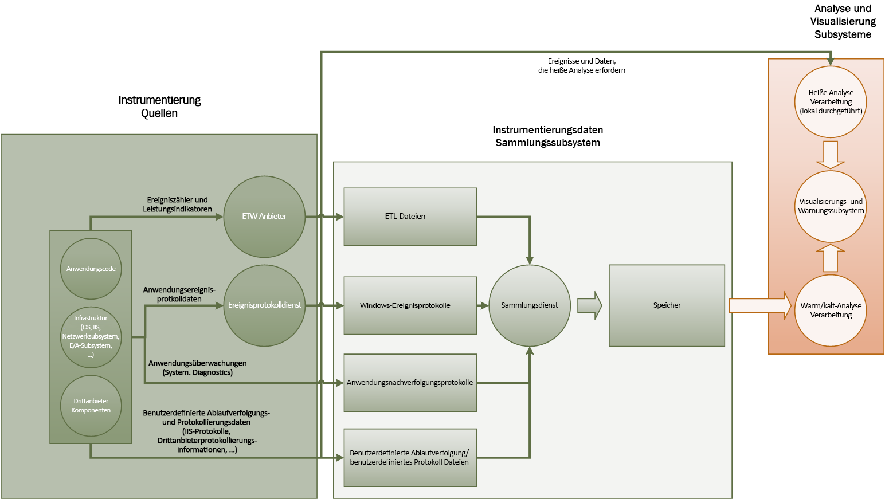
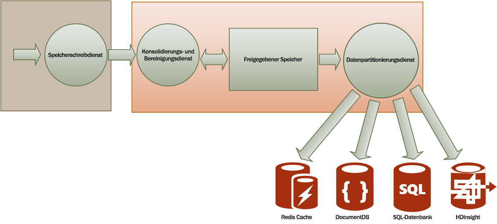

# <a name="monitoring-and-diagnostics"></a><span data-ttu-id="7682d-103">Überwachung und Diagnose</span><span class="sxs-lookup"><span data-stu-id="7682d-103">Monitoring and diagnostics</span></span>
[!INCLUDE [header](../_includes/header.md)]

<span data-ttu-id="7682d-104">Verteilte Anwendungen und Dienste in der Cloud sind naturgemäß komplexe Softwarekomponenten, die viele bewegliche Teile umfassen.</span><span class="sxs-lookup"><span data-stu-id="7682d-104">Distributed applications and services running in the cloud are, by their nature, complex pieces of software that comprise many moving parts.</span></span> <span data-ttu-id="7682d-105">In einer Produktionsumgebung sollten Sie unbedingt nachvollziehen können, auf welche Weise Benutzer Ihr System verwenden. Ferner müssen Sie in der Lage sein, die Ressourcennutzung nachzuverfolgen und allgemein die Integrität und Leistung des Systems zu überwachen.</span><span class="sxs-lookup"><span data-stu-id="7682d-105">In a production environment, it's important to be able to track the way in which users utilize your system, trace resource utilization, and generally monitor the health and performance of your system.</span></span> <span data-ttu-id="7682d-106">Diese Informationen dienen als Diagnosehilfe, um Probleme zu erkennen und zu korrigieren sowie potenzielle Probleme frühzeitig zu erkennen und zu verhindern.</span><span class="sxs-lookup"><span data-stu-id="7682d-106">You can use this information as a diagnostic aid to detect and correct issues, and also to help spot potential problems and prevent them from occurring.</span></span>

## <a name="monitoring-and-diagnostics-scenarios"></a><span data-ttu-id="7682d-107">Überwachung- und Diagnoseszenarien</span><span class="sxs-lookup"><span data-stu-id="7682d-107">Monitoring and diagnostics scenarios</span></span>
<span data-ttu-id="7682d-108">Durch die Überwachung erhalten einen Einblick in die Funktionsweise eines Systems.</span><span class="sxs-lookup"><span data-stu-id="7682d-108">You can use monitoring to gain an insight into how well a system is functioning.</span></span> <span data-ttu-id="7682d-109">Die Überwachung ist ein wichtiger Aspekt beim Einhalten von Zielen zur Servicequalität.</span><span class="sxs-lookup"><span data-stu-id="7682d-109">Monitoring is a crucial part of maintaining quality-of-service targets.</span></span> <span data-ttu-id="7682d-110">Häufige Szenarien für das Sammeln von Überwachungsdaten sind:</span><span class="sxs-lookup"><span data-stu-id="7682d-110">Common scenarios for collecting monitoring data include:</span></span>

* <span data-ttu-id="7682d-111">Sicherstellen, dass das System fehlerfrei bleibt.</span><span class="sxs-lookup"><span data-stu-id="7682d-111">Ensuring that the system remains healthy.</span></span>
* <span data-ttu-id="7682d-112">Nachverfolgen der Verfügbarkeit des Systems und seiner Komponenten.</span><span class="sxs-lookup"><span data-stu-id="7682d-112">Tracking the availability of the system and its component elements.</span></span>
* <span data-ttu-id="7682d-113">Verwalten von Leistung, um sicherzustellen, dass sich der Durchsatz des Systems nicht unerwartet verschlechtert, während die Menge an Arbeit sich erhöht.</span><span class="sxs-lookup"><span data-stu-id="7682d-113">Maintaining performance to ensure that the throughput of the system does not degrade unexpectedly as the volume of work increases.</span></span>
* <span data-ttu-id="7682d-114">Sicherstellen, dass das System mit Kunden vereinbarte SLAs (Service Level Agreements) erfüllt.</span><span class="sxs-lookup"><span data-stu-id="7682d-114">Guaranteeing that the system meets any service-level agreements (SLAs) established with customers.</span></span>
* <span data-ttu-id="7682d-115">Schutz der Privatsphäre und der Sicherheit des Systems, der Benutzer und ihrer Daten.</span><span class="sxs-lookup"><span data-stu-id="7682d-115">Protecting the privacy and security of the system, users, and their data.</span></span>
* <span data-ttu-id="7682d-116">Verfolgen der Vorgänge, die zu Überwachungs- oder rechtlichen Zwecken ausgeführt werden.</span><span class="sxs-lookup"><span data-stu-id="7682d-116">Tracking the operations that are performed for auditing or regulatory purposes.</span></span>
* <span data-ttu-id="7682d-117">Überwachen der täglichen Nutzung des Systems und Ermitteln von Trends, die zu Problemen führen könnten, wenn sie nicht behandelt werden.</span><span class="sxs-lookup"><span data-stu-id="7682d-117">Monitoring the day-to-day usage of the system and spotting trends that might lead to problems if they're not addressed.</span></span>
* <span data-ttu-id="7682d-118">Nachverfolgen von auftretenden Problemen, vom ersten Bericht bis zur Analyse der möglichen Ursachen, Berichtigung, folgende Softwareupdates und Bereitstellung.</span><span class="sxs-lookup"><span data-stu-id="7682d-118">Tracking issues that occur, from initial report through to analysis of possible causes, rectification, consequent software updates, and deployment.</span></span>
* <span data-ttu-id="7682d-119">Ablaufverfolgung von Vorgängen und das Debuggen von Software-Versionen.</span><span class="sxs-lookup"><span data-stu-id="7682d-119">Tracing operations and debugging software releases.</span></span>

> [!NOTE]
> <span data-ttu-id="7682d-120">Diese Liste erhebt keinen Anspruch auf Vollständigkeit.</span><span class="sxs-lookup"><span data-stu-id="7682d-120">This list is not intended to be comprehensive.</span></span> <span data-ttu-id="7682d-121">In diesem Dokument liegt der Schwerpunkt auf diesen Szenarien, da sie die gängigsten Überwachungssituationen darstellen.</span><span class="sxs-lookup"><span data-stu-id="7682d-121">This document focuses on these scenarios as the most common situations for performing monitoring.</span></span> <span data-ttu-id="7682d-122">Es gibt möglicherweise weitere Szenarien, die weniger häufig vorkommen oder für Ihre Umgebung spezifisch sind.</span><span class="sxs-lookup"><span data-stu-id="7682d-122">There might be others that are less common or are specific to your environment.</span></span>
> 
> 

<span data-ttu-id="7682d-123">In den folgenden Abschnitten werden diese Szenarien ausführlich beschrieben.</span><span class="sxs-lookup"><span data-stu-id="7682d-123">The following sections describe these scenarios in more detail.</span></span> <span data-ttu-id="7682d-124">Die Informationen für jedes Szenario werden im folgenden Format behandelt:</span><span class="sxs-lookup"><span data-stu-id="7682d-124">The information for each scenario is discussed in the following format:</span></span>

1. <span data-ttu-id="7682d-125">Eine kurze Übersicht über das Szenario</span><span class="sxs-lookup"><span data-stu-id="7682d-125">A brief overview of the scenario</span></span>
2. <span data-ttu-id="7682d-126">Die typischen Anforderungen dieses Szenarios</span><span class="sxs-lookup"><span data-stu-id="7682d-126">The typical requirements of this scenario</span></span>
3. <span data-ttu-id="7682d-127">Die unformatierten Instrumentierungsdaten, die zur Unterstützung des Szenarios erforderlich sind, und mögliche Quellen für diese Informationen</span><span class="sxs-lookup"><span data-stu-id="7682d-127">The raw instrumentation data that's required to support the scenario, and possible sources of this information</span></span>
4. <span data-ttu-id="7682d-128">Wie Rohdaten analysiert und kombiniert werden können, um sinnvolle Diagnoseinformationen zu generieren</span><span class="sxs-lookup"><span data-stu-id="7682d-128">How this raw data can be analyzed and combined to generate meaningful diagnostic information</span></span>

## <a name="health-monitoring"></a><span data-ttu-id="7682d-129">Systemüberwachung</span><span class="sxs-lookup"><span data-stu-id="7682d-129">Health monitoring</span></span>
<span data-ttu-id="7682d-130">Ein System ist fehlerfrei, wenn es ausgeführt wird und Anforderungen verarbeiten kann.</span><span class="sxs-lookup"><span data-stu-id="7682d-130">A system is healthy if it is running and capable of processing requests.</span></span> <span data-ttu-id="7682d-131">Die Systemüberwachung dient zum Generieren einer Momentaufnahme der aktuellen Systemintegrität, damit Sie überprüfen können, ob alle Komponenten des Systems wie erwartet funktionieren.</span><span class="sxs-lookup"><span data-stu-id="7682d-131">The purpose of health monitoring is to generate a snapshot of the current health of the system so that you can verify that all components of the system are functioning as expected.</span></span>

### <a name="requirements-for-health-monitoring"></a><span data-ttu-id="7682d-132">Anforderungen für die Systemüberwachung</span><span class="sxs-lookup"><span data-stu-id="7682d-132">Requirements for health monitoring</span></span>
<span data-ttu-id="7682d-133">Ein Operator sollte schnell (innerhalb weniger Sekunden) benachrichtigt werden, wenn ein Teil des Systems als fehlerhaft eingestuft wird.</span><span class="sxs-lookup"><span data-stu-id="7682d-133">An operator should be alerted quickly (within a matter of seconds) if any part of the system is deemed to be unhealthy.</span></span> <span data-ttu-id="7682d-134">Der Operator sollte ermitteln können, welche Teile des Systems ordnungsgemäß ausgeführt werden und in welchen Teile Probleme auftreten.</span><span class="sxs-lookup"><span data-stu-id="7682d-134">The operator should be able to ascertain which parts of the system are functioning normally, and which parts are experiencing problems.</span></span> <span data-ttu-id="7682d-135">Die Systemintegrität kann über ein Ampelsystem angezeigt werden:</span><span class="sxs-lookup"><span data-stu-id="7682d-135">System health can be highlighted through a traffic-light system:</span></span>

* <span data-ttu-id="7682d-136">Rot für fehlerhaft (das System wurde beendet)</span><span class="sxs-lookup"><span data-stu-id="7682d-136">Red for unhealthy (the system has stopped)</span></span>
* <span data-ttu-id="7682d-137">Gelb für teilweise fehlerfrei (das System wird mit eingeschränkter Funktionalität ausgeführt)</span><span class="sxs-lookup"><span data-stu-id="7682d-137">Yellow for partially healthy (the system is running with reduced functionality)</span></span>
* <span data-ttu-id="7682d-138">Grün für völlig fehlerfrei</span><span class="sxs-lookup"><span data-stu-id="7682d-138">Green for completely healthy</span></span>

<span data-ttu-id="7682d-139">Eine umfassende Systemüberwachung ermöglicht es einem Operator, der einen Drilldown durch das System zum Anzeigen des Integritätsstatus von Subsystemen und Komponenten ausführen.</span><span class="sxs-lookup"><span data-stu-id="7682d-139">A comprehensive health-monitoring system enables an operator to drill down through the system to view the health status of subsystems and components.</span></span> <span data-ttu-id="7682d-140">Wenn z. B. das gesamte System als teilweise fehlerfrei dargestellt ist, sollte der Operator in der Lage sein, es zu vergrößern und zu bestimmen, welche Funktionalität zurzeit nicht verfügbar ist.</span><span class="sxs-lookup"><span data-stu-id="7682d-140">For example, if the overall system is depicted as partially healthy, the operator should be able to zoom in and determine which functionality is currently unavailable.</span></span>

### <a name="data-sources-instrumentation-and-data-collection-requirements"></a><span data-ttu-id="7682d-141">Datenquellen, Instrumentierung und Anforderungen für die Datensammlung</span><span class="sxs-lookup"><span data-stu-id="7682d-141">Data sources, instrumentation, and data-collection requirements</span></span>
<span data-ttu-id="7682d-142">Die Rohdaten, die zur Unterstützung der Systemüberwachung erforderlich sind, können als Ergebnis folgender Aktionen generiert werden:</span><span class="sxs-lookup"><span data-stu-id="7682d-142">The raw data that's required to support health monitoring can be generated as a result of:</span></span>

* <span data-ttu-id="7682d-143">Nachverfolgen der Ausführung von Benutzeranforderungen.</span><span class="sxs-lookup"><span data-stu-id="7682d-143">Tracing execution of user requests.</span></span> <span data-ttu-id="7682d-144">Diese Informationen können verwendet werden, um zu bestimmen, welche Anforderungen erfolgreich ausgeführt wurden, welche fehlgeschlagen sind und wie lange jede Anforderung dauert.</span><span class="sxs-lookup"><span data-stu-id="7682d-144">This information can be used to determine which requests have succeeded, which have failed, and how long each request takes.</span></span>
* <span data-ttu-id="7682d-145">Synthetische Benutzerüberwachung.</span><span class="sxs-lookup"><span data-stu-id="7682d-145">Synthetic user monitoring.</span></span> <span data-ttu-id="7682d-146">Dieser Vorgang simuliert die Schritte, die von einem Benutzer durchgeführt werden, und folgt einer vordefinierten Reihe von Schritten.</span><span class="sxs-lookup"><span data-stu-id="7682d-146">This process simulates the steps performed by a user and follows a predefined series of steps.</span></span> <span data-ttu-id="7682d-147">Die Ergebnisse der einzelnen Schritte sollten erfasst werden.</span><span class="sxs-lookup"><span data-stu-id="7682d-147">The results of each step should be captured.</span></span>
* <span data-ttu-id="7682d-148">Protokollieren von Ausnahmen, Fehlern und Warnungen.</span><span class="sxs-lookup"><span data-stu-id="7682d-148">Logging exceptions, faults, and warnings.</span></span> <span data-ttu-id="7682d-149">Diese Informationen können als Ergebnis von Überwachungsanweisungen erfasst werden, die im Anwendungscode eingebettet sind, sowie durch Abrufen von Informationen aus den Ereignisprotokollen der Dienste, auf die das System verweist.</span><span class="sxs-lookup"><span data-stu-id="7682d-149">This information can be captured as a result of trace statements embedded into the application code, as well as retrieving information from the event logs of any services that the system references.</span></span>
* <span data-ttu-id="7682d-150">Überwachen des Zustands von Drittanbieterdiensten, die vom System verwendet werden.</span><span class="sxs-lookup"><span data-stu-id="7682d-150">Monitoring the health of any third-party services that the system uses.</span></span> <span data-ttu-id="7682d-151">Für diese Überwachung müssen möglicherweise Integritätsdaten abgerufen und analysiert werden, die von diesen Dienste bereitgestellt werden.</span><span class="sxs-lookup"><span data-stu-id="7682d-151">This monitoring might require retrieving and parsing health data that these services supply.</span></span> <span data-ttu-id="7682d-152">Diese Informationen können in einer Vielzahl von Formaten vorliegen.</span><span class="sxs-lookup"><span data-stu-id="7682d-152">This information might take a variety of formats.</span></span>
* <span data-ttu-id="7682d-153">Endpunktüberwachung.</span><span class="sxs-lookup"><span data-stu-id="7682d-153">Endpoint monitoring.</span></span> <span data-ttu-id="7682d-154">Dieser Mechanismus wird im Abschnitt „Verfügbarkeitsüberwachung“ ausführlicher beschrieben.</span><span class="sxs-lookup"><span data-stu-id="7682d-154">This mechanism is described in more detail in the "Availability monitoring" section.</span></span>
* <span data-ttu-id="7682d-155">Sammeln von umgebenden Leistungsinformationen, z. B. CPU-Auslastung im Hintergrund oder E/A-Aktivität (einschließlich Netzwerk).</span><span class="sxs-lookup"><span data-stu-id="7682d-155">Collecting ambient performance information, such as background CPU utilization or I/O (including network) activity.</span></span>

### <a name="analyzing-health-data"></a><span data-ttu-id="7682d-156">Analysieren von Zustandsdaten</span><span class="sxs-lookup"><span data-stu-id="7682d-156">Analyzing health data</span></span>
<span data-ttu-id="7682d-157">Die Systemüberwachung soll hauptsächlich rasch angeben können, ob das System ausgeführt wird.</span><span class="sxs-lookup"><span data-stu-id="7682d-157">The primary focus of health monitoring is to quickly indicate whether the system is running.</span></span> <span data-ttu-id="7682d-158">Durch die sofortige Analyse heißer Daten kann eine Warnung ausgelöst werden, wenn eine kritische Komponente als fehlerhaft erkannt wird.</span><span class="sxs-lookup"><span data-stu-id="7682d-158">Hot analysis of the immediate data can trigger an alert if a critical component is detected as unhealthy.</span></span> <span data-ttu-id="7682d-159">(Beispielsweise reagiert sie nicht auf eine aufeinanderfolgende Reihe von Pings.) Der Operator kann dann die entsprechenden Korrekturmaßnahmen einleiten.</span><span class="sxs-lookup"><span data-stu-id="7682d-159">(It fails to respond to a consecutive series of pings, for example.) The operator can then take the appropriate corrective action.</span></span>

<span data-ttu-id="7682d-160">Ein fortgeschritteneres System kann ein Prognoseelement umfassen, das eine kalte Analyse über die letzten und die aktuellen Workloads ausführt.</span><span class="sxs-lookup"><span data-stu-id="7682d-160">A more advanced system might include a predictive element that performs a cold analysis over recent and current workloads.</span></span> <span data-ttu-id="7682d-161">Durch eine kalte Analyse können Sie Trends ermitteln und feststellen, ob das System wahrscheinlich fehlerfrei bleibt oder ob das System zusätzliche Ressourcen benötigt.</span><span class="sxs-lookup"><span data-stu-id="7682d-161">A cold analysis can spot trends and determine whether the system is likely to remain healthy or whether the system will need additional resources.</span></span> <span data-ttu-id="7682d-162">Dieses Prognoseelement sollte auf wichtigen Leistungsmetriken wie den folgenden basieren:</span><span class="sxs-lookup"><span data-stu-id="7682d-162">This predictive element should be based on critical performance metrics, such as:</span></span>

* <span data-ttu-id="7682d-163">Die Rate der Anforderungen, die an die einzelnen Dienste oder Subsysteme gerichtet werden.</span><span class="sxs-lookup"><span data-stu-id="7682d-163">The rate of requests directed at each service or subsystem.</span></span>
* <span data-ttu-id="7682d-164">Die Antwortzeiten dieser Anforderungen.</span><span class="sxs-lookup"><span data-stu-id="7682d-164">The response times of these requests.</span></span>
* <span data-ttu-id="7682d-165">Das Datenvolumen, das bei den einzelnen Diensten eingeht und ausgegeben wird.</span><span class="sxs-lookup"><span data-stu-id="7682d-165">The volume of data flowing into and out of each service.</span></span>

<span data-ttu-id="7682d-166">Wenn der Wert einer Metrik einen festgelegten Schwellenwert überschreitet, kann das System eine Warnung auslösen, damit von einem Operator oder durch eine automatische Skalierung (falls verfügbar) vorbeugende Maßnahmen für das Aufrechterhalten der Systemintegrität ergriffen werden können.</span><span class="sxs-lookup"><span data-stu-id="7682d-166">If the value of any metric exceeds a defined threshold, the system can raise an alert to enable an operator or autoscaling (if available) to take the preventative actions necessary to maintain system health.</span></span> <span data-ttu-id="7682d-167">Diese Aktionen beinhalten möglicherweise das Hinzufügen von Ressourcen, den Neustart eines oder mehrerer fehlschlagender Dienste oder die Drosselung auf Anforderungen mit niedrigerer Priorität.</span><span class="sxs-lookup"><span data-stu-id="7682d-167">These actions might involve adding resources, restarting one or more services that are failing, or applying throttling to lower-priority requests.</span></span>

## <a name="availability-monitoring"></a><span data-ttu-id="7682d-168">Verfügbarkeitsüberwachung</span><span class="sxs-lookup"><span data-stu-id="7682d-168">Availability monitoring</span></span>
<span data-ttu-id="7682d-169">Ein wirklich fehlerfreies System erfordert, dass die Komponenten und Subsysteme, aus denen das System besteht, verfügbar sind.</span><span class="sxs-lookup"><span data-stu-id="7682d-169">A truly healthy system requires that the components and subsystems that compose the system are available.</span></span> <span data-ttu-id="7682d-170">Die Verfügbarkeitsüberwachung ist mit der Integritätsüberwachung eng verknüpft.</span><span class="sxs-lookup"><span data-stu-id="7682d-170">Availability monitoring is closely related to health monitoring.</span></span> <span data-ttu-id="7682d-171">Während die Integritätsüberwachung jedoch eine sofortige Ansicht des aktuellen Systemzustands bereitstellt, ist die Verfügbarkeitsüberwachung für das Nachverfolgen der Verfügbarkeit des Systems und seiner Komponenten zuständig und erstellt Statistiken über die Betriebszeit des Systems.</span><span class="sxs-lookup"><span data-stu-id="7682d-171">But whereas health monitoring provides an immediate view of the current health of the system, availability monitoring is concerned with tracking the availability of the system and its components to generate statistics about the uptime of the system.</span></span>

<span data-ttu-id="7682d-172">In vielen Systemen sind einige Komponenten (z. B. eine Datenbank) mit integrierten Redundanz konfiguriert, um schnelles Failover im Falle eines schwerwiegenden Fehlers oder eines Verlusts der Verbindung zuzulassen.</span><span class="sxs-lookup"><span data-stu-id="7682d-172">In many systems, some components (such as a database) are configured with built-in redundancy to permit rapid failover in the event of a serious fault or loss of connectivity.</span></span> <span data-ttu-id="7682d-173">Im Idealfall sollten Benutzer gar nicht bemerken, dass ein Fehler aufgetreten ist.</span><span class="sxs-lookup"><span data-stu-id="7682d-173">Ideally, users should not be aware that such a failure has occurred.</span></span> <span data-ttu-id="7682d-174">Aus der Perspektive der Verfügbarkeitsüberwachung ist es jedoch notwendig, so viele Informationen wie möglich über solche Fehler zu sammeln, um die Ursache zu ermitteln und Korrekturmaßnahmen zu ergreifen, damit sie sich nicht wiederholen.</span><span class="sxs-lookup"><span data-stu-id="7682d-174">But from an availability monitoring perspective, it's necessary to gather as much information as possible about such failures to determine the cause and take corrective actions to prevent them from recurring.</span></span>

<span data-ttu-id="7682d-175">Die Daten, die zum Nachverfolgen der Verfügbarkeit erforderlich sind, können von einer Reihe von Faktoren auf niedrigerer Ebene abhängen.</span><span class="sxs-lookup"><span data-stu-id="7682d-175">The data that's required to track availability might depend on a number of lower-level factors.</span></span> <span data-ttu-id="7682d-176">Viele dieser Faktoren beziehen sich möglicherweise speziell auf Anwendung, System und Umgebung.</span><span class="sxs-lookup"><span data-stu-id="7682d-176">Many of these factors might be specific to the application, system, and environment.</span></span> <span data-ttu-id="7682d-177">Ein effektives Überwachungssystem erfasst die Verfügbarkeitsdaten, die diesen Faktoren auf niedriger Ebene entsprechen, und aggregiert diese anschließend, um einen allgemeinen Überblick über das System zu erhalten.</span><span class="sxs-lookup"><span data-stu-id="7682d-177">An effective monitoring system captures the availability data that corresponds to these low-level factors and then aggregates them to give an overall picture of the system.</span></span> <span data-ttu-id="7682d-178">Beispielsweise können in einem E-Commerce-System die Geschäftsfunktionen, mit denen der Kunde Bestellungen aufgeben kann, vom Repository abhängen, in dem Bestelldetails gespeichert sind, und vom Zahlungssystem, das die finanziellen Transaktionen für die Zahlung dieser Aufträge verarbeitet.</span><span class="sxs-lookup"><span data-stu-id="7682d-178">For example, in an e-commerce system, the business functionality that enables a customer to place orders might depend on the repository where order details are stored and the payment system that handles the monetary transactions for paying for these orders.</span></span> <span data-ttu-id="7682d-179">Die Verfügbarkeit des Systemteils, der für die Platzierung von Bestellungen zuständig ist, ist daher eine Funktion der Verfügbarkeit des Repositorys und des Zahlungssubsystems.</span><span class="sxs-lookup"><span data-stu-id="7682d-179">The availability of the order-placement part of the system is therefore a function of the availability of the repository and the payment subsystem.</span></span>

### <a name="requirements-for-availability-monitoring"></a><span data-ttu-id="7682d-180">Anforderungen für die Verfügbarkeitsüberwachung</span><span class="sxs-lookup"><span data-stu-id="7682d-180">Requirements for availability monitoring</span></span>
<span data-ttu-id="7682d-181">Ein Operator sollte auch die bisherige Verfügbarkeit der einzelnen Systeme und Subsysteme anzeigen können und anhand dieser Informationen Trends erkennen, die in einem oder mehreren Subsystemen in regelmäßigen Abständen Fehler verursachen.</span><span class="sxs-lookup"><span data-stu-id="7682d-181">An operator should also be able to view the historical availability of each system and subsystem, and use this information to spot any trends that might cause one or more subsystems to periodically fail.</span></span> <span data-ttu-id="7682d-182">(Fallen Dienste zu einer bestimmten Tageszeit aus, die den Spitzenverarbeitungszeiten entspricht?)</span><span class="sxs-lookup"><span data-stu-id="7682d-182">(Do services start to fail at a particular time of day that corresponds to peak processing hours?)</span></span>

<span data-ttu-id="7682d-183">Eine Überwachungslösung sollte eine unmittelbare und historische Ansicht der Verfügbarkeit bzw. Nichtverfügbarkeit der einzelnen Subsysteme bereitstellen.</span><span class="sxs-lookup"><span data-stu-id="7682d-183">A monitoring solution should provide an immediate and historical view of the availability or unavailability of each subsystem.</span></span> <span data-ttu-id="7682d-184">Sie sollte außerdem einen Operator schnell warnen können, wenn mindestens ein Dienst ausfällt oder wenn Benutzer keine Verbindung mit Diensten herstellen können.</span><span class="sxs-lookup"><span data-stu-id="7682d-184">It should also be capable of quickly alerting an operator when one or more services fail or when users can't connect to services.</span></span> <span data-ttu-id="7682d-185">Hierbei geht es nicht nur darum, die einzelnen Dienste zu überwachen, sondern auch darum, die von den einzelnen Benutzern durchgeführten Aktionen zu untersuchen, wenn beim Kommunikationsversuch mit einem Dienst ein Fehler auftritt.</span><span class="sxs-lookup"><span data-stu-id="7682d-185">This is a matter of not only monitoring each service, but also examining the actions that each user performs if these actions fail when they attempt to communicate with a service.</span></span> <span data-ttu-id="7682d-186">In gewissem Umfang sind Verbindungsfehler normal und können durch vorübergehende Fehler verursacht werden.</span><span class="sxs-lookup"><span data-stu-id="7682d-186">To some extent, a degree of connectivity failure is normal and might be due to transient errors.</span></span> <span data-ttu-id="7682d-187">Es kann jedoch hilfreich sein, dem System das Ausgeben einer Warnung für die Anzahl von Verbindungsfehlern mit einem bestimmten Subsystem zu ermöglichen, die während eines bestimmten Zeitraums auftreten.</span><span class="sxs-lookup"><span data-stu-id="7682d-187">But it might be useful to allow the system to raise an alert for the number of connectivity failures to a specified subsystem that occur during a specific period.</span></span>

### <a name="data-sources-instrumentation-and-data-collection-requirements"></a><span data-ttu-id="7682d-188">Datenquellen, Instrumentierung und Anforderungen für die Datensammlung</span><span class="sxs-lookup"><span data-stu-id="7682d-188">Data sources, instrumentation, and data-collection requirements</span></span>
<span data-ttu-id="7682d-189">Wie bei der Integritätsüberwachung können die Rohdaten zur Unterstützung der Verfügbarkeitsüberwachung als Ergebnis der synthetischen Benutzerüberwachung und der Protokollierung aller Ausnahmen, Fehler und Warnungen generiert werden.</span><span class="sxs-lookup"><span data-stu-id="7682d-189">As with health monitoring, the raw data that's required to support availability monitoring can be generated as a result of synthetic user monitoring and logging any exceptions, faults, and warnings that might occur.</span></span> <span data-ttu-id="7682d-190">Darüber hinaus können Verfügbarkeitsdaten durch eine Endpunktüberwachung abgerufen werden.</span><span class="sxs-lookup"><span data-stu-id="7682d-190">In addition, availability data can be obtained from performing endpoint monitoring.</span></span> <span data-ttu-id="7682d-191">Die Anwendung kann einen oder mehrere Integritätsendpunkte offenlegen, von dem jeder den Zugriff auf den Funktionsbereich innerhalb des Systems prüft.</span><span class="sxs-lookup"><span data-stu-id="7682d-191">The application can expose one or more health endpoints, each testing access to a functional area within the system.</span></span> <span data-ttu-id="7682d-192">Das Überwachungssystem kann jeden Endpunkt nach einem definierten Zeitplan pingen und die Ergebnisse erfassen (erfolgreich oder Fehler).</span><span class="sxs-lookup"><span data-stu-id="7682d-192">The monitoring system can ping each endpoint by following a defined schedule and collect the results (success or fail).</span></span>

<span data-ttu-id="7682d-193">Alle Timeouts, Netzwerkkonnektivitätsfehler und wiederholte Verbindungsversuche müssen aufgezeichnet werden.</span><span class="sxs-lookup"><span data-stu-id="7682d-193">All timeouts, network connectivity failures, and connection retry attempts must be recorded.</span></span> <span data-ttu-id="7682d-194">Alle Daten sollten mit einem Zeitstempel versehen sein.</span><span class="sxs-lookup"><span data-stu-id="7682d-194">All data should be time-stamped.</span></span>

<a name="analyzing-availability-data"></a>

### <a name="analyzing-availability-data"></a><span data-ttu-id="7682d-195">Analysieren von Verfügbarkeitsdaten</span><span class="sxs-lookup"><span data-stu-id="7682d-195">Analyzing availability data</span></span>
<span data-ttu-id="7682d-196">Die Instrumentierungsdaten müssen zusammengefasst und korreliert werden, um die folgenden Arten der Analyse zu unterstützen:</span><span class="sxs-lookup"><span data-stu-id="7682d-196">The instrumentation data must be aggregated and correlated to support the following types of analysis:</span></span>

* <span data-ttu-id="7682d-197">Die sofortige Verfügbarkeit des Systems und der Subsysteme.</span><span class="sxs-lookup"><span data-stu-id="7682d-197">The immediate availability of the system and subsystems.</span></span>
* <span data-ttu-id="7682d-198">Die Fehlerraten für die Verfügbarkeit des Systems und der Subsysteme.</span><span class="sxs-lookup"><span data-stu-id="7682d-198">The availability failure rates of the system and subsystems.</span></span> <span data-ttu-id="7682d-199">Im Idealfall sollte ein Operator Fehler mit bestimmten Aktivitäten in Beziehung setzen können: Was ist gerade passiert, als der Systemfehler auftrat?</span><span class="sxs-lookup"><span data-stu-id="7682d-199">Ideally, an operator should be able to correlate failures with specific activities: what was happening when the system failed?</span></span>
* <span data-ttu-id="7682d-200">Eine Verlaufsansicht mit den Fehlerraten des Systems oder der Subsysteme in einem angegeben Zeitraum und die Auslastung des Systems (z. B. die Anzahl von Benutzeranforderungen), als ein Fehler aufgetreten ist.</span><span class="sxs-lookup"><span data-stu-id="7682d-200">A historical view of failure rates of the system or any subsystems across any specified period, and the load on the system (number of user requests, for example) when a failure occurred.</span></span>
* <span data-ttu-id="7682d-201">Die Gründe für die Nichtverfügbarkeit des Systems oder eines Subsystems.</span><span class="sxs-lookup"><span data-stu-id="7682d-201">The reasons for unavailability of the system or any subsystems.</span></span> <span data-ttu-id="7682d-202">Mögliche Gründe sind zum Beispiel, dass ein Dienst nicht ausgeführt wird, dass die Verbindung verloren gegangen ist oder dass die Verbindung zwar besteht, aber ein Timeout auftritt oder Fehler zurückgegeben werden.</span><span class="sxs-lookup"><span data-stu-id="7682d-202">For example, the reasons might be service not running, connectivity lost, connected but timing out, and connected but returning errors.</span></span>

<span data-ttu-id="7682d-203">Sie können die prozentuale Verfügbarkeit eines Diensts über einen Zeitraum mit folgender Formel berechnen:</span><span class="sxs-lookup"><span data-stu-id="7682d-203">You can calculate the percentage availability of a service over a period of time by using the following formula:</span></span>

```
%Availability =  ((Total Time – Total Downtime) / Total Time ) * 100
```

<span data-ttu-id="7682d-204">Dies ist zu SLA-Zwecken hilfreich.</span><span class="sxs-lookup"><span data-stu-id="7682d-204">This is useful for SLA purposes.</span></span> <span data-ttu-id="7682d-205">(Die [SLA-Überwachung](#SLA-monitoring) wird weiter unten in diesem Leitfaden ausführlicher beschrieben.) Die Definition von *Downtime* hängt vom Dienst ab.</span><span class="sxs-lookup"><span data-stu-id="7682d-205">([SLA monitoring](#SLA-monitoring) is described in more detail later in this guidance.) The definition of *downtime* depends on the service.</span></span> <span data-ttu-id="7682d-206">Z. B. definiert der Visual Studio Team Services-Builddienst Ausfallzeiten als den Zeitraum (Gesamtzahl der Minuten), in dem der Builddienst nicht verfügbar ist.</span><span class="sxs-lookup"><span data-stu-id="7682d-206">For example, Visual Studio Team Services Build Service defines downtime as the period (total accumulated minutes) during which Build Service is unavailable.</span></span> <span data-ttu-id="7682d-207">Eine Minute wird als nicht verfügbar betrachtet, wenn alle fortlaufend an den Builddienst gesendeten HTTP-Anforderungen zum Ausführen kundeninitiierter Vorgänge während dieser Minute zu einem Fehlercode führen oder keine Antwort zurückgeben.</span><span class="sxs-lookup"><span data-stu-id="7682d-207">A minute is considered unavailable if all continuous HTTP requests to Build Service to perform customer-initiated operations throughout the minute either result in an error code or do not return a response.</span></span>

## <a name="performance-monitoring"></a><span data-ttu-id="7682d-208">Leistungsüberwachung</span><span class="sxs-lookup"><span data-stu-id="7682d-208">Performance monitoring</span></span>
<span data-ttu-id="7682d-209">Während das System (durch eine wachsende Anzahl von Benutzern) immer mehr belastet wird, wächst die Größe der Datasets, auf die diese Benutzer zugreifen, und die Fehlerwahrscheinlichkeit für die einzelnen Komponenten nimmt zu.</span><span class="sxs-lookup"><span data-stu-id="7682d-209">As the system is placed under more and more stress (by increasing the volume of users), the size of the datasets that these users access grows and the possibility of failure of one or more components becomes more likely.</span></span> <span data-ttu-id="7682d-210">Häufig ist eine Abnahme der Leistung Komponentenfehlern vorangestellt.</span><span class="sxs-lookup"><span data-stu-id="7682d-210">Frequently, component failure is preceded by a decrease in performance.</span></span> <span data-ttu-id="7682d-211">Wenn Sie in der Lage sind, eine solche Leistungsabnahme zu erkennen, können Sie proaktive Maßnahmen zur Abhilfe ergreifen.</span><span class="sxs-lookup"><span data-stu-id="7682d-211">If you're able detect such a decrease, you can take proactive steps to remedy the situation.</span></span>

<span data-ttu-id="7682d-212">Die Systemleistung hängt von einer Reihe von Faktoren ab.</span><span class="sxs-lookup"><span data-stu-id="7682d-212">System performance depends on a number of factors.</span></span> <span data-ttu-id="7682d-213">Jeder dieser Faktoren wird in der Regel mithilfe von Leistungskennzahlen (Key Performance Indicators, KPIs) gemessen, z. B. die Anzahl von Datenbanktransaktionen pro Sekunde oder die Menge der Netzwerkanforderungen, die in einem bestimmten Zeitrahmen erfolgreich bearbeitet werden.</span><span class="sxs-lookup"><span data-stu-id="7682d-213">Each factor is typically measured through key performance indicators (KPIs), such as the number of database transactions per second or the volume of network requests that are successfully serviced in a specified time frame.</span></span> <span data-ttu-id="7682d-214">KPIs können als spezifische Leistungskennzahlen zur Verfügung stehen oder aus einer Kombination von Metriken abgeleitet werden.</span><span class="sxs-lookup"><span data-stu-id="7682d-214">Some of these KPIs might be available as specific performance measures, whereas others might be derived from a combination of metrics.</span></span>

> [!NOTE]
> <span data-ttu-id="7682d-215">Das Bestimmen einer schlechten oder guten Leistung erfordert, dass Sie das Leistungsniveau verstehen, mit der das System betrieben werden können sollte.</span><span class="sxs-lookup"><span data-stu-id="7682d-215">Determining poor or good performance requires that you understand the level of performance at which the system should be capable of running.</span></span> <span data-ttu-id="7682d-216">Dies erfordert die Beobachtung des Systems, während es bei einer durchschnittlichen Belastung arbeitet, sowie das Erfassen der Daten für die einzelnen KPIs über einen Zeitraum.</span><span class="sxs-lookup"><span data-stu-id="7682d-216">This requires observing the system while it's functioning under a typical load and capturing the data for each KPI over a period of time.</span></span> <span data-ttu-id="7682d-217">Dabei wird z. B. die Auslastung des laufenden Systems in einer Testumgebung simuliert und die entsprechenden Daten gesammelt, und zwar vor der Bereitstellung des Systems in einer Produktionsumgebung.</span><span class="sxs-lookup"><span data-stu-id="7682d-217">This might involve running the system under a simulated load in a test environment and gathering the appropriate data before deploying the system to a production environment.</span></span>
> 
> <span data-ttu-id="7682d-218">Sie sollten auch sicherstellen, dass die Überwachung zu Leistungszwecken keine Belastung für das System darstellt.</span><span class="sxs-lookup"><span data-stu-id="7682d-218">You should also ensure that monitoring for performance purposes does not become a burden on the system.</span></span> <span data-ttu-id="7682d-219">Sie können möglicherweise die Detailebene für die in der Leistungsüberwachung gesammelten Daten dynamisch anpassen.</span><span class="sxs-lookup"><span data-stu-id="7682d-219">You might be able to dynamically adjust the level of detail for the data that the performance monitoring process gathers.</span></span>
> 
> 

### <a name="requirements-for-performance-monitoring"></a><span data-ttu-id="7682d-220">Anforderungen für die Leistungsüberwachung</span><span class="sxs-lookup"><span data-stu-id="7682d-220">Requirements for performance monitoring</span></span>
<span data-ttu-id="7682d-221">Um die Systemleistung zu untersuchen, muss ein Operator in der Regel Informationen wie diese erhalten:</span><span class="sxs-lookup"><span data-stu-id="7682d-221">To examine system performance, an operator typically needs to see information that includes:</span></span>

* <span data-ttu-id="7682d-222">Die Antwortrate bei Benutzeranforderungen.</span><span class="sxs-lookup"><span data-stu-id="7682d-222">The response rates for user requests.</span></span>
* <span data-ttu-id="7682d-223">Die Anzahl gleichzeitiger Benutzeranfragen.</span><span class="sxs-lookup"><span data-stu-id="7682d-223">The number of concurrent user requests.</span></span>
* <span data-ttu-id="7682d-224">Das Volumen des Netzwerkverkehrs.</span><span class="sxs-lookup"><span data-stu-id="7682d-224">The volume of network traffic.</span></span>
* <span data-ttu-id="7682d-225">Die Sätze, zu denen geschäftliche Transaktionen vorgenommen werden.</span><span class="sxs-lookup"><span data-stu-id="7682d-225">The rates at which business transactions are being completed.</span></span>
* <span data-ttu-id="7682d-226">Die durchschnittliche Verarbeitungszeit für Anforderungen.</span><span class="sxs-lookup"><span data-stu-id="7682d-226">The average processing time for requests.</span></span>

<span data-ttu-id="7682d-227">Es kann auch hilfreich sein, Tools zur Verfügung zu stellen, die einem Operator das Erkennen von Korrelationen ermöglichen, z. B.:</span><span class="sxs-lookup"><span data-stu-id="7682d-227">It can also be helpful to provide tools that enable an operator to help spot correlations, such as:</span></span>

* <span data-ttu-id="7682d-228">Die Anzahl gleichzeitiger Benutzer im Vergleich zu den Anforderungslatenzzeiten (wie lange es bis zum Starten der Anforderungsverarbeitung dauert, nachdem der Benutzer sie gesendet hat).</span><span class="sxs-lookup"><span data-stu-id="7682d-228">The number of concurrent users versus request latency times (how long it takes to start processing a request after the user has sent it).</span></span>
* <span data-ttu-id="7682d-229">Die Anzahl gleichzeitiger Benutzer im Vergleich zur durchschnittlichen Antwortzeit (wie lange es bis zum Abschluss einer Anforderung dauert, nachdem die Verarbeitung begonnen hat).</span><span class="sxs-lookup"><span data-stu-id="7682d-229">The number of concurrent users versus the average response time (how long it takes to complete a request after it has started processing).</span></span>
* <span data-ttu-id="7682d-230">Das Anforderungsvolumen im Vergleich zur Anzahl von Fehlern bei der Verarbeitung.</span><span class="sxs-lookup"><span data-stu-id="7682d-230">The volume of requests versus the number of processing errors.</span></span>

<span data-ttu-id="7682d-231">Neben diesen allgemeinen funktionalen Informationen sollte ein Operator auch eine detaillierte Ansicht der Leistung für die einzelnen Komponenten im System erhalten.</span><span class="sxs-lookup"><span data-stu-id="7682d-231">Along with this high-level functional information, an operator should be able to obtain a detailed view of the performance for each component in the system.</span></span> <span data-ttu-id="7682d-232">Diese Daten werden in der Regel mithilfe von Low-Level-Leistungsindikatoren bereitgestellt, die u. a. folgende Informationen erfassen:</span><span class="sxs-lookup"><span data-stu-id="7682d-232">This data is typically provided through low-level performance counters that track information such as:</span></span>

* <span data-ttu-id="7682d-233">Speicherauslastung.</span><span class="sxs-lookup"><span data-stu-id="7682d-233">Memory utilization.</span></span>
* <span data-ttu-id="7682d-234">Anzahl der Threads.</span><span class="sxs-lookup"><span data-stu-id="7682d-234">Number of threads.</span></span>
* <span data-ttu-id="7682d-235">CPU-Verarbeitungszeit.</span><span class="sxs-lookup"><span data-stu-id="7682d-235">CPU processing time.</span></span>
* <span data-ttu-id="7682d-236">Länge der Anforderungswarteschlange.</span><span class="sxs-lookup"><span data-stu-id="7682d-236">Request queue length.</span></span>
* <span data-ttu-id="7682d-237">Datenträger- oder Netzwerk-E/A-Raten und -Fehler.</span><span class="sxs-lookup"><span data-stu-id="7682d-237">Disk or network I/O rates and errors.</span></span>
* <span data-ttu-id="7682d-238">Anzahl gelesener oder geschriebener Bytes.</span><span class="sxs-lookup"><span data-stu-id="7682d-238">Number of bytes written or read.</span></span>
* <span data-ttu-id="7682d-239">Middleware-Indikatoren, z. B. die Warteschlangenlänge.</span><span class="sxs-lookup"><span data-stu-id="7682d-239">Middleware indicators, such as queue length.</span></span>

<span data-ttu-id="7682d-240">Bei allen Visualisierungen sollte ein Operator die Möglichkeit erhalten, einen Zeitraum festzulegen.</span><span class="sxs-lookup"><span data-stu-id="7682d-240">All visualizations should allow an operator to specify a time period.</span></span> <span data-ttu-id="7682d-241">Die angezeigten Daten können eine Momentaufnahme der aktuellen Situation und/oder eine Verlaufsansicht der Leistung sein.</span><span class="sxs-lookup"><span data-stu-id="7682d-241">The displayed data might be a snapshot of the current situation and/or a historical view of the performance.</span></span>

<span data-ttu-id="7682d-242">Ein Operator sollte basierend auf den Leistungsmeasures eine Warnung für jeden angegebenen Wert während eines angegebenen Zeitintervalls ausgeben können.</span><span class="sxs-lookup"><span data-stu-id="7682d-242">An operator should be able to raise an alert based on any performance measure for any specified value during any specified time interval.</span></span>

### <a name="data-sources-instrumentation-and-data-collection-requirements"></a><span data-ttu-id="7682d-243">Datenquellen, Instrumentierung und Anforderungen für die Datensammlung</span><span class="sxs-lookup"><span data-stu-id="7682d-243">Data sources, instrumentation, and data-collection requirements</span></span>
<span data-ttu-id="7682d-244">Durch Überwachen der Fortschritte von eingehenden und das System passierenden Benutzeranforderungen können Sie allgemeine Leistungsdaten sammeln (Durchsatz, Anzahl gleichzeitiger Benutzer, Anzahl von Geschäftstransaktionen, Fehlerraten und so weiter).</span><span class="sxs-lookup"><span data-stu-id="7682d-244">You can gather high-level performance data (throughput, number of concurrent users, number of business transactions, error rates, and so on) by monitoring the progress of users' requests as they arrive and pass through the system.</span></span> <span data-ttu-id="7682d-245">Dies beinhaltet das Einbinden von Ablaufverfolgungsanweisungen an wichtigen Punkten im Anwendungscode zusammen mit Informationen zur zeitlichen Steuerung.</span><span class="sxs-lookup"><span data-stu-id="7682d-245">This involves incorporating tracing statements at key points in the application code, together with timing information.</span></span> <span data-ttu-id="7682d-246">Alle Fehler, Ausnahmen und Warnungen sollten mit einer ausreichenden Datenmenge erfasst werden, damit ein Bezug zu den Anforderungen hergestellt werden kann, die sie verursacht haben.</span><span class="sxs-lookup"><span data-stu-id="7682d-246">All faults, exceptions, and warnings should be captured with sufficient data for correlating them with the requests that caused them.</span></span> <span data-ttu-id="7682d-247">Das IIS-Protokoll (Internet Information Services) ist eine weitere nützliche Datenquelle.</span><span class="sxs-lookup"><span data-stu-id="7682d-247">The Internet Information Services (IIS) log is another useful source.</span></span>

<span data-ttu-id="7682d-248">Wenn möglich, sollten Sie Leistungsdaten für alle externen Systeme erfassen, die die Anwendung verwendet.</span><span class="sxs-lookup"><span data-stu-id="7682d-248">If possible, you should also capture performance data for any external systems that the application uses.</span></span> <span data-ttu-id="7682d-249">Diese externen Systeme bieten möglicherweise eigene Leistungsindikatoren oder andere Features für die Anforderung von Leistungsdaten.</span><span class="sxs-lookup"><span data-stu-id="7682d-249">These external systems might provide their own performance counters or other features for requesting performance data.</span></span> <span data-ttu-id="7682d-250">Wenn dies nicht möglich ist, erfassen Sie Informationen wie z. B. die Start- und Endzeit der einzelnen Anforderungen an ein externes System zusammen mit dem Status des Vorgangs (Erfolgreich, Fehler oder Warnung).</span><span class="sxs-lookup"><span data-stu-id="7682d-250">If this is not possible, record information such as the start time and end time of each request made to an external system, together with the status (success, fail, or warning) of the operation.</span></span> <span data-ttu-id="7682d-251">Beispielsweise können Sie einen Stoppuhransatz verfolgen, um Anforderungen zeitlich zu erfassen: Starten Sie einen Timer, wenn die Anforderung gestartet wird, und stoppen Sie den Timer, wenn die Anforderung abgeschlossen ist.</span><span class="sxs-lookup"><span data-stu-id="7682d-251">For example, you can use a stopwatch approach to time requests: start a timer when the request starts and then stop the timer when the request finishes.</span></span>

<span data-ttu-id="7682d-252">Detaillierte Low-Level-Leistungsdaten für einzelne Komponenten in einem System stehen möglicherweise über Features und Dienste wie Windows-Leistungsindikatoren und Azure-Diagnose zur Verfügung.</span><span class="sxs-lookup"><span data-stu-id="7682d-252">Low-level performance data for individual components in a system might be available through features and services such as Windows performance counters and Azure Diagnostics.</span></span>

### <a name="analyzing-performance-data"></a><span data-ttu-id="7682d-253">Analysieren von Leistungsdaten</span><span class="sxs-lookup"><span data-stu-id="7682d-253">Analyzing performance data</span></span>
<span data-ttu-id="7682d-254">Ein Großteil der Analysearbeit besteht aus dem Aggregieren von Leistungsdaten nach Benutzeranforderungstyp und/oder nach Subsystem oder Dienst, an das bzw. den die einzelnen Anforderungen gesendet werden.</span><span class="sxs-lookup"><span data-stu-id="7682d-254">Much of the analysis work consists of aggregating performance data by user request type and/or the subsystem or service to which each request is sent.</span></span> <span data-ttu-id="7682d-255">Ein Beispiel für eine Benutzeranforderung ist das Hinzufügen eines Elements zu einem Einkaufswagen oder der Auftragsabschluss in einem E-Commerce-System.</span><span class="sxs-lookup"><span data-stu-id="7682d-255">An example of a user request is adding an item to a shopping cart or performing the checkout process in an e-commerce system.</span></span>

<span data-ttu-id="7682d-256">Eine weitere häufige Anforderung ist die Zusammenfassung von Leistungsdaten in ausgewählten Prozentsätzen.</span><span class="sxs-lookup"><span data-stu-id="7682d-256">Another common requirement is summarizing performance data in selected percentiles.</span></span> <span data-ttu-id="7682d-257">Beispielsweise kann ein Operator die Antwortzeiten für 99 Prozent der Anforderungen, 95 Prozent der Anforderungen und 70 Prozent der Anforderungen ermitteln.</span><span class="sxs-lookup"><span data-stu-id="7682d-257">For example, an operator might determine the response times for 99 percent of requests, 95 percent of requests, and 70 percent of requests.</span></span> <span data-ttu-id="7682d-258">Möglicherweise sind für jeden Prozentwert SLA-Ziele oder andere Ziele festgelegt.</span><span class="sxs-lookup"><span data-stu-id="7682d-258">There might be SLA targets or other goals set for each percentile.</span></span> <span data-ttu-id="7682d-259">Die fortlaufenden Ergebnisse sollten nahezu in Echtzeit gemeldet werden, um Probleme sofort zu erkennen.</span><span class="sxs-lookup"><span data-stu-id="7682d-259">The ongoing results should be reported in near real time to help detect immediate issues.</span></span> <span data-ttu-id="7682d-260">Außerdem sollten die Ergebnisse zu statistischen Zwecken über längere Zeit aggregiert werden.</span><span class="sxs-lookup"><span data-stu-id="7682d-260">The results should also be aggregated over the longer time for statistical purposes.</span></span>

<span data-ttu-id="7682d-261">Im Fall von leistungsbeeinträchtigenden Latenzproblemen sollte ein Operator in der Lage sein, die Ursache für den Engpass schnell zu identifizieren, indem er die Latenzzeit der einzelnen Schritte jeder Anforderung untersucht.</span><span class="sxs-lookup"><span data-stu-id="7682d-261">In the case of latency issues affecting performance, an operator should be able to quickly identify the cause of the bottleneck by examining the latency of each step that each request performs.</span></span> <span data-ttu-id="7682d-262">Die Leistungsdaten müssen daher ein Mittel zum Korrelieren von Leistungsindikatoren für jeden Schritt bereitstellen, um sie mit einer bestimmten Anforderung zu verknüpfen.</span><span class="sxs-lookup"><span data-stu-id="7682d-262">The performance data must therefore provide a means of correlating performance measures for each step to tie them to a specific request.</span></span>

<span data-ttu-id="7682d-263">Je nach Visualisierungsanforderungen kann es hilfreich sein, einen Datencube zu generieren und zu speichern, der Ansichten der Rohdaten enthält.</span><span class="sxs-lookup"><span data-stu-id="7682d-263">Depending on the visualization requirements, it might be useful to generate and store a data cube that contains views of the raw data.</span></span> <span data-ttu-id="7682d-264">Dieser Datencube kann komplexe Ad-hoc-Abfragen und die Analyse der Leistungsdaten ermöglichen.</span><span class="sxs-lookup"><span data-stu-id="7682d-264">This data cube can allow complex ad hoc querying and analysis of the performance information.</span></span>

## <a name="security-monitoring"></a><span data-ttu-id="7682d-265">Sicherheitsüberwachung</span><span class="sxs-lookup"><span data-stu-id="7682d-265">Security monitoring</span></span>
<span data-ttu-id="7682d-266">Alle kommerziellen Systeme, die sensible Daten enthalten, müssen eine Sicherheitsstruktur implementieren.</span><span class="sxs-lookup"><span data-stu-id="7682d-266">All commercial systems that include sensitive data must implement a security structure.</span></span> <span data-ttu-id="7682d-267">Die Komplexität des Sicherheitsmechanismus ist in der Regel eine Funktion der Sensibilität der Daten.</span><span class="sxs-lookup"><span data-stu-id="7682d-267">The complexity of the security mechanism is usually a function of the sensitivity of the data.</span></span> <span data-ttu-id="7682d-268">In einem System, das die Authentifizierung von Benutzern verlangt, sollten Sie Folgendes aufzeichnen:</span><span class="sxs-lookup"><span data-stu-id="7682d-268">In a system that requires users to be authenticated, you should record:</span></span>

* <span data-ttu-id="7682d-269">Alle Anmeldeversuche, sowohl fehlerhafte als auch erfolgreiche.</span><span class="sxs-lookup"><span data-stu-id="7682d-269">All sign-in attempts, whether they fail or succeed.</span></span>
* <span data-ttu-id="7682d-270">Alle von einem authentifizierten Benutzer ausgeführten Vorgänge sowie die Details aller Ressourcen, auf die der Benutzer zugreift.</span><span class="sxs-lookup"><span data-stu-id="7682d-270">All operations performed by--and the details of all resources accessed by--an authenticated user.</span></span>
* <span data-ttu-id="7682d-271">Zeitpunkt, zu dem ein Benutzer eine Sitzung beendet und sich abmeldet.</span><span class="sxs-lookup"><span data-stu-id="7682d-271">When a user ends a session and signs out.</span></span>

<span data-ttu-id="7682d-272">Die Überwachung kann dabei helfen, Angriffe auf das System zu erkennen.</span><span class="sxs-lookup"><span data-stu-id="7682d-272">Monitoring might be able to help detect attacks on the system.</span></span> <span data-ttu-id="7682d-273">Zum Beispiel kann eine große Anzahl misslungener Anmeldeversuche auf einen Brute-Force-Angriff hinweisen.</span><span class="sxs-lookup"><span data-stu-id="7682d-273">For example, a large number of failed sign-in attempts might indicate a brute-force attack.</span></span> <span data-ttu-id="7682d-274">Ein unerwarteter Anstieg von Anforderungen kann das Ergebnis eines verteilten Denial-of-Service-Angriffs (DDoS) sein.</span><span class="sxs-lookup"><span data-stu-id="7682d-274">An unexpected surge in requests might be the result of a distributed denial-of-service (DDoS) attack.</span></span> <span data-ttu-id="7682d-275">Sie müssen vorbereitet sein, um alle Anforderungen an alle Ressourcen unabhängig von der Quelle dieser Anforderungen zu überwachen.</span><span class="sxs-lookup"><span data-stu-id="7682d-275">You must be prepared to monitor all requests to all resources regardless of the source of these requests.</span></span> <span data-ttu-id="7682d-276">Ein System mit einer Sicherheitslücke bei der Anmeldung stellt möglicherweise unbeabsichtigt Ressourcen zum externen Gebrauch zur Verfügung, ohne dass ein Benutzer sich dafür anmelden muss.</span><span class="sxs-lookup"><span data-stu-id="7682d-276">A system that has a sign-in vulnerability might accidentally expose resources to the outside world without requiring a user to actually sign in.</span></span>

### <a name="requirements-for-security-monitoring"></a><span data-ttu-id="7682d-277">Anforderungen für die Sicherheitsüberwachung</span><span class="sxs-lookup"><span data-stu-id="7682d-277">Requirements for security monitoring</span></span>
<span data-ttu-id="7682d-278">Die wichtigsten Aspekte der Sicherheitsüberwachung sollten einem Operator schnell Folgendes ermöglichen:</span><span class="sxs-lookup"><span data-stu-id="7682d-278">The most critical aspects of security monitoring should enable an operator to quickly:</span></span>

* <span data-ttu-id="7682d-279">Erkennen von Angriffsversuchen von einer nicht authentifizierten Entität.</span><span class="sxs-lookup"><span data-stu-id="7682d-279">Detect attempted intrusions by an unauthenticated entity.</span></span>
* <span data-ttu-id="7682d-280">Identifizieren von Versuchen von Entitäten, Vorgänge für Daten auszuführen, für die ihnen kein Zugriff erteilt wurde.</span><span class="sxs-lookup"><span data-stu-id="7682d-280">Identify attempts by entities to perform operations on data for which they have not been granted access.</span></span>
* <span data-ttu-id="7682d-281">Ermitteln, ob das System oder ein Teil des Systems einem Angriff von außerhalb oder von innerhalb ausgesetzt ist.</span><span class="sxs-lookup"><span data-stu-id="7682d-281">Determine whether the system, or some part of the system, is under attack from outside or inside.</span></span> <span data-ttu-id="7682d-282">(Beispielsweise kann ein böswilliger authentifizierter Benutzer versuchen, einen Systemausfall zu verursachen.)</span><span class="sxs-lookup"><span data-stu-id="7682d-282">(For example, a malicious authenticated user might be attempting to bring the system down.)</span></span>

<span data-ttu-id="7682d-283">Um diese Anforderungen zu unterstützen, sollte ein Operator über Folgendes benachrichtigt werden:</span><span class="sxs-lookup"><span data-stu-id="7682d-283">To support these requirements, an operator should be notified:</span></span>

* <span data-ttu-id="7682d-284">Wenn ein Konto innerhalb eines angegebenen Zeitraums wiederholt fehlerhafte Anmeldeversuche unternimmt.</span><span class="sxs-lookup"><span data-stu-id="7682d-284">If one account makes repeated failed sign-in attempts within a specified period.</span></span>
* <span data-ttu-id="7682d-285">Wenn ein authentifiziertes Konto während eines angegebenen Zeitraums wiederholt versucht, auf eine verbotene Ressource zuzugreifen.</span><span class="sxs-lookup"><span data-stu-id="7682d-285">If one authenticated account repeatedly tries to access a prohibited resource during a specified period.</span></span>
* <span data-ttu-id="7682d-286">Wenn während eines angegebenen Zeitraums eine große Anzahl nicht authentifizierter oder nicht autorisierter Anforderungen auftritt.</span><span class="sxs-lookup"><span data-stu-id="7682d-286">If a large number of unauthenticated or unauthorized requests occur during a specified period.</span></span>

<span data-ttu-id="7682d-287">Die einem Operator bereitgestellten Informationen sollten für jede Anforderung die Hostadresse der Quelle beinhalten.</span><span class="sxs-lookup"><span data-stu-id="7682d-287">The information that's provided to an operator should include the host address of the source for each request.</span></span> <span data-ttu-id="7682d-288">Wenn Sicherheitsverletzungen regelmäßig aus einem bestimmten Adressbereich auftreten, könnten diese Hosts blockiert werden.</span><span class="sxs-lookup"><span data-stu-id="7682d-288">If security violations regularly arise from a particular range of addresses, these hosts might be blocked.</span></span>

<span data-ttu-id="7682d-289">Eine wichtige Rolle bei der Wahrung der Sicherheit eines Systems ist das schnelle Erkennen von Aktionen, die vom üblichen Muster abweichen.</span><span class="sxs-lookup"><span data-stu-id="7682d-289">A key part in maintaining the security of a system is being able to quickly detect actions that deviate from the usual pattern.</span></span> <span data-ttu-id="7682d-290">Informationen wie z. B. die Anzahl fehlerhafter und/oder erfolgreicher Anmeldeanforderungen kann visuell dargestellt werden, um zu erkennen, ob zu einer ungewöhnlichen Zeit eine Spitze in der Aktivität vorliegt.</span><span class="sxs-lookup"><span data-stu-id="7682d-290">Information such as the number of failed and/or successful sign-in requests can be displayed visually to help detect whether there is a spike in activity at an unusual time.</span></span> <span data-ttu-id="7682d-291">(Ein Beispiel für diese Aktivität ist, wenn Benutzer sich um 3:00 Uhr morgens anmelden und eine große Anzahl von Vorgängen ausführen, wenn der Arbeitstag um 9:00 Uhr beginnt).</span><span class="sxs-lookup"><span data-stu-id="7682d-291">(An example of this activity is users signing in at 3:00 AM and performing a large number of operations when their working day starts at 9:00 AM).</span></span> <span data-ttu-id="7682d-292">Anhand dieser Informationen kann auch die zeitbasierte automatische Skalierung konfiguriert werden.</span><span class="sxs-lookup"><span data-stu-id="7682d-292">This information can also be used to help configure time-based autoscaling.</span></span> <span data-ttu-id="7682d-293">Wenn z. B. ein Operator beobachtet, dass eine große Anzahl von Benutzern sich regelmäßig zu einer bestimmten Tageszeit anmeldet, kann er den Start zusätzlicher Authentifizierungsdienste veranlassen, um das Arbeitsvolumen verarbeiten zu können. Er kann diese zusätzlichen Dienste wieder beenden, wenn die Spitze vorbei ist.</span><span class="sxs-lookup"><span data-stu-id="7682d-293">For example, if an operator observes that a large number of users regularly sign in at a particular time of day, the operator can arrange to start additional authentication services to handle the volume of work, and then shut down these additional services when the peak has passed.</span></span>

### <a name="data-sources-instrumentation-and-data-collection-requirements"></a><span data-ttu-id="7682d-294">Datenquellen, Instrumentierung und Anforderungen für die Datensammlung</span><span class="sxs-lookup"><span data-stu-id="7682d-294">Data sources, instrumentation, and data-collection requirements</span></span>
<span data-ttu-id="7682d-295">Sicherheit ist bei den meisten verteilten Systemen ein allumfassender Aspekt.</span><span class="sxs-lookup"><span data-stu-id="7682d-295">Security is an all-encompassing aspect of most distributed systems.</span></span> <span data-ttu-id="7682d-296">Die relevanten Daten werden wahrscheinlich an mehreren Punkten in einem System generiert.</span><span class="sxs-lookup"><span data-stu-id="7682d-296">The pertinent data is likely to be generated at multiple points throughout a system.</span></span> <span data-ttu-id="7682d-297">Sie sollten die Implementierung eines SIEM-Ansatzes (Security Information and Event Management) erwägen, um die Sicherheitsinformationen aus Ereignissen zu sammeln, die von der Anwendung, Netzwerkgeräten, Servern, Firewalls, Antivirensoftware und anderen Elementen des Eindringschutzes ausgelöst wurden.</span><span class="sxs-lookup"><span data-stu-id="7682d-297">You should consider adopting a Security Information and Event Management (SIEM) approach to gather the security-related information that results from events raised by the application, network equipment, servers, firewalls, antivirus software, and other intrusion-prevention elements.</span></span>

<span data-ttu-id="7682d-298">Die Sicherheitsüberwachung kann Daten aus Tools integrieren, die nicht Teil der Anwendung sind.</span><span class="sxs-lookup"><span data-stu-id="7682d-298">Security monitoring can incorporate data from tools that are not part of your application.</span></span> <span data-ttu-id="7682d-299">Dazu gehören beispielsweise Hilfsprogramme, die Portüberwachungsaktivitäten durch externe Einrichtungen ermitteln, oder Netzwerkfilter, die nicht authentifizierte Zugriffsversuche auf Anwendung und Daten erkennen.</span><span class="sxs-lookup"><span data-stu-id="7682d-299">These tools can include utilities that identify port-scanning activities by external agencies, or network filters that detect attempts to gain unauthenticated access to your application and data.</span></span>

<span data-ttu-id="7682d-300">In allen Fällen muss ein Administrator anhand der erfassten Daten die Art des Angriffs ermitteln und die entsprechenden Gegenmaßnahmen einleiten können.</span><span class="sxs-lookup"><span data-stu-id="7682d-300">In all cases, the gathered data must enable an administrator to determine the nature of any attack and take the appropriate countermeasures.</span></span>

### <a name="analyzing-security-data"></a><span data-ttu-id="7682d-301">Analysieren von Sicherheitsdaten</span><span class="sxs-lookup"><span data-stu-id="7682d-301">Analyzing security data</span></span>
<span data-ttu-id="7682d-302">Ein Feature der Sicherheitsüberwachung ist die Vielzahl von Quellen, aus denen die Daten entstehen.</span><span class="sxs-lookup"><span data-stu-id="7682d-302">A feature of security monitoring is the variety of sources from which the data arises.</span></span> <span data-ttu-id="7682d-303">Die verschiedenen Formate und Detailebenen erfordern häufig eine komplexe Analyse der erfassten Daten, um sie zu einem Thread zusammenhängender Informationen zusammenzufassen.</span><span class="sxs-lookup"><span data-stu-id="7682d-303">The different formats and level of detail often require complex analysis of the captured data to tie it together into a coherent thread of information.</span></span> <span data-ttu-id="7682d-304">Abgesehen von den einfachsten Fällen (z. B. dem Erkennen einer großen Anzahl fehlerhafter Anmeldungen oder wiederholter nicht autorisierter Zugriffsversuche auf wichtige Ressourcen) ist es gelegentlich nicht möglich, eine komplexe automatisierte Verarbeitung von Sicherheitsdaten durchzuführen.</span><span class="sxs-lookup"><span data-stu-id="7682d-304">Apart from the simplest of cases (such as detecting a large number of failed sign-ins, or repeated attempts to gain unauthorized access to critical resources), it might not be possible to perform any complex automated processing of security data.</span></span> <span data-ttu-id="7682d-305">Stattdessen kann es sich anbieten, diese Daten mit einem Zeitstempel, ansonsten aber in ihrer ursprünglichen Form, in ein sicheres Repository zu schreiben, um sie einer manuellen Expertenanalyse zu unterziehen.</span><span class="sxs-lookup"><span data-stu-id="7682d-305">Instead, it might be preferable to write this data, time-stamped but otherwise in its original form, to a secure repository to allow for expert manual analysis.</span></span>

<a name="SLA-monitoring"></a>

## <a name="sla-monitoring"></a><span data-ttu-id="7682d-306">SLA-Überwachung</span><span class="sxs-lookup"><span data-stu-id="7682d-306">SLA monitoring</span></span>
<span data-ttu-id="7682d-307">Viele kommerzielle Systeme, die zahlende Kunden unterstützen, bieten Garantien in Bezug auf die Leistung des Systems in Form von SLAs.</span><span class="sxs-lookup"><span data-stu-id="7682d-307">Many commercial systems that support paying customers make guarantees about the performance of the system in the form of SLAs.</span></span> <span data-ttu-id="7682d-308">Im Wesentlichen wird durch SLAs festgelegt, dass das System ein definiertes Arbeitsvolumen innerhalb eines vereinbarten Zeitrahmens und ohne Verlust wichtiger Informationen verarbeiten kann.</span><span class="sxs-lookup"><span data-stu-id="7682d-308">Essentially, SLAs state that the system can handle a defined volume of work within an agreed time frame and without losing critical information.</span></span> <span data-ttu-id="7682d-309">Die SLA-Überwachung soll sicherstellen, dass das System messbare SLAs erfüllen kann.</span><span class="sxs-lookup"><span data-stu-id="7682d-309">SLA monitoring is concerned with ensuring that the system can meet measurable SLAs.</span></span>

> [!NOTE]
> <span data-ttu-id="7682d-310">Die SLA-Überwachung ist mit der Leistungsüberwachung eng verknüpft.</span><span class="sxs-lookup"><span data-stu-id="7682d-310">SLA monitoring is closely related to performance monitoring.</span></span> <span data-ttu-id="7682d-311">Während die Leistungsüberwachung jedoch sicherstellen soll, dass das System *optimal* funktioniert, unterliegt die SLA-Überwachung einer vertraglichen Verpflichtung, die definiert, was *optimal* eigentlich bedeutet.</span><span class="sxs-lookup"><span data-stu-id="7682d-311">But whereas performance monitoring is concerned with ensuring that the system functions *optimally*, SLA monitoring is governed by a contractual obligation that defines what *optimally* actually means.</span></span>
> 
> 

<span data-ttu-id="7682d-312">SLAs werden häufig wie folgt definiert:</span><span class="sxs-lookup"><span data-stu-id="7682d-312">SLAs are often defined in terms of:</span></span>

* <span data-ttu-id="7682d-313">Allgemeine Systemverfügbarkeit.</span><span class="sxs-lookup"><span data-stu-id="7682d-313">Overall system availability.</span></span> <span data-ttu-id="7682d-314">Beispielsweise kann eine Organisation garantieren, dass das System zu 99,9 Prozent der Zeit zur Verfügung steht.</span><span class="sxs-lookup"><span data-stu-id="7682d-314">For example, an organization might guarantee that the system will be available for 99.9 percent of the time.</span></span> <span data-ttu-id="7682d-315">Dies entspricht einer Ausfallzeit von nicht mehr als 9 Stunden pro Jahr oder ungefähr 10 Minuten pro Woche.</span><span class="sxs-lookup"><span data-stu-id="7682d-315">This equates to no more than 9 hours of downtime per year, or approximately 10 minutes a week.</span></span>
* <span data-ttu-id="7682d-316">Operativer Durchsatz.</span><span class="sxs-lookup"><span data-stu-id="7682d-316">Operational throughput.</span></span> <span data-ttu-id="7682d-317">Dieser Aspekt wird oft als eine oder mehrere „Hochwassermarken“ ausgedrückt, z. B. die Garantie, dass das System bis zu 100.000 Benutzeranfragen gleichzeitig unterstützt oder 10.000 Geschäftstransaktionen gleichzeitig verarbeiten kann.</span><span class="sxs-lookup"><span data-stu-id="7682d-317">This aspect is often expressed as one or more high-water marks, such as guaranteeing that the system can support up to 100,000 concurrent user requests or handle 10,000 concurrent business transactions.</span></span>
* <span data-ttu-id="7682d-318">Operative Reaktionszeit.</span><span class="sxs-lookup"><span data-stu-id="7682d-318">Operational response time.</span></span> <span data-ttu-id="7682d-319">Das System kann auch die Geschwindigkeit garantieren, mit der Anforderungen verarbeitet werden.</span><span class="sxs-lookup"><span data-stu-id="7682d-319">The system might also make guarantees for the rate at which requests are processed.</span></span> <span data-ttu-id="7682d-320">Ein Beispiel dafür ist, dass 99 Prozent aller Geschäftstransaktionen innerhalb von 2 Sekunden abgeschlossen werden und dass keine einzelne Transaktion länger als 10 Sekunden dauert.</span><span class="sxs-lookup"><span data-stu-id="7682d-320">An example is that 99 percent of all business transactions will finish within 2 seconds, and no single transaction will take longer than 10 seconds.</span></span>

> [!NOTE]
> <span data-ttu-id="7682d-321">Einige Verträge für kommerzielle Systeme können auch SLAs für den Kundensupport umfassen.</span><span class="sxs-lookup"><span data-stu-id="7682d-321">Some contracts for commercial systems might also include SLAs for customer support.</span></span> <span data-ttu-id="7682d-322">Beispielsweise könnten alle Helpdeskanfragen innerhalb von fünf Minuten beantwortet und 99 Prozent aller Probleme innerhalb eines Arbeitstags vollständig behoben werden.</span><span class="sxs-lookup"><span data-stu-id="7682d-322">An example is that all help-desk requests will elicit a response within 5 minutes, and that 99 percent of all problems will be fully addressed within 1 working day.</span></span> <span data-ttu-id="7682d-323">Effektive [Problemverfolgung](#issue-tracking) (weiter unten in diesem Abschnitt beschrieben) ist der Schlüssel für die Einhaltung von SLAs wie diesen.</span><span class="sxs-lookup"><span data-stu-id="7682d-323">Effective [issue tracking](#issue-tracking) (described later in this section) is key to meeting SLAs such as these.</span></span>
> 
> 

### <a name="requirements-for-sla-monitoring"></a><span data-ttu-id="7682d-324">Anforderungen für die SLA-Überwachung</span><span class="sxs-lookup"><span data-stu-id="7682d-324">Requirements for SLA monitoring</span></span>
<span data-ttu-id="7682d-325">Auf der höchsten Ebene sollte ein Operator auf einen Blick feststellen können, ob das System die vereinbarten SLAs erfüllt oder nicht.</span><span class="sxs-lookup"><span data-stu-id="7682d-325">At the highest level, an operator should be able to determine at a glance whether the system is meeting the agreed SLAs or not.</span></span> <span data-ttu-id="7682d-326">Falls nicht, sollte der Operator einen Drilldown durchführen und die zugrunde liegenden Faktoren untersuchen können, um die Gründe für die nicht dem Standard entsprechende Leistung zu ermitteln.</span><span class="sxs-lookup"><span data-stu-id="7682d-326">And if not, the operator should be able to drill down and examine the underlying factors to determine the reasons for substandard performance.</span></span>

<span data-ttu-id="7682d-327">Typische Indikatoren höherer Ebene, die visuell dargestellt werden können, umfassen:</span><span class="sxs-lookup"><span data-stu-id="7682d-327">Typical high-level indicators that can be depicted visually include:</span></span>

* <span data-ttu-id="7682d-328">Der Prozentsatz der Betriebszeit des Dienstes.</span><span class="sxs-lookup"><span data-stu-id="7682d-328">The percentage of service uptime.</span></span>
* <span data-ttu-id="7682d-329">Der Anwendungsdurchsatz (gemessen in Bezug auf erfolgreiche Transaktionen und/oder Vorgänge pro Sekunde).</span><span class="sxs-lookup"><span data-stu-id="7682d-329">The application throughput (measured in terms of successful transactions and/or operations per second).</span></span>
* <span data-ttu-id="7682d-330">Die Anzahl der Anforderungen für die erfolgreiche/fehlgeschlagene Anwendung.</span><span class="sxs-lookup"><span data-stu-id="7682d-330">The number of successful/failing application requests.</span></span>
* <span data-ttu-id="7682d-331">Die Anzahl der Anwendungs- und Systemfehler, Ausnahmen und Warnungen.</span><span class="sxs-lookup"><span data-stu-id="7682d-331">The number of application and system faults, exceptions, and warnings.</span></span>

<span data-ttu-id="7682d-332">All diese Indikatoren sollten nach einem bestimmten Zeitraum gefiltert werden können.</span><span class="sxs-lookup"><span data-stu-id="7682d-332">All of these indicators should be capable of being filtered by a specified period of time.</span></span>

<span data-ttu-id="7682d-333">Eine Cloud-Anwendung umfasst wahrscheinlich eine Anzahl von Subsystemen und Komponenten.</span><span class="sxs-lookup"><span data-stu-id="7682d-333">A cloud application will likely comprise a number of subsystems and components.</span></span> <span data-ttu-id="7682d-334">Ein Operator sollte auf höherer Ebene einen Indikator auswählen und sehen können, wie sich dieser aus der Integrität der zugrunde liegenden Elementen zusammensetzt.</span><span class="sxs-lookup"><span data-stu-id="7682d-334">An operator should be able to select a high-level indicator and see how it's composed from the health of the underlying elements.</span></span> <span data-ttu-id="7682d-335">Wenn z. B. die Verfügbarkeit des gesamten Systems einen zulässigen Wert unterschreitet, sollte ein Operator in der Lage sein, Details anzuzeigen und zu ermitteln, welche Elemente zu diesem Fehler beitragen.</span><span class="sxs-lookup"><span data-stu-id="7682d-335">For example, if the uptime of the overall system falls below an acceptable value, an operator should be able to zoom in and determine which elements are contributing to this failure.</span></span>

> [!NOTE]
> <span data-ttu-id="7682d-336">Die Verfügbarkeit der Systeme muss sorgfältig definiert werden.</span><span class="sxs-lookup"><span data-stu-id="7682d-336">System uptime needs to be defined carefully.</span></span> <span data-ttu-id="7682d-337">In einem System, das Redundanz verwendet, um eine maximale Verfügbarkeit zu gewährleisten, können einzelne Instanzen der Elemente fehlschlagen, aber das System bleibt dennoch funktionsfähig.</span><span class="sxs-lookup"><span data-stu-id="7682d-337">In a system that uses redundancy to ensure maximum availability, individual instances of elements might fail, but the system can remain functional.</span></span> <span data-ttu-id="7682d-338">Die durch die Systemüberwachung dargestellte Systemverfügbarkeit sollte die aggregierte Betriebszeit von jedem Element angeben und nicht unbedingt, ob das System tatsächlich angehalten wurde.</span><span class="sxs-lookup"><span data-stu-id="7682d-338">System uptime as presented by health monitoring should indicate the aggregate uptime of each element and not necessarily whether the system has actually halted.</span></span> <span data-ttu-id="7682d-339">Darüber hinaus können Fehler isoliert werden.</span><span class="sxs-lookup"><span data-stu-id="7682d-339">Additionally, failures might be isolated.</span></span> <span data-ttu-id="7682d-340">Also auch wenn ein bestimmtes System nicht verfügbar ist, ist möglicherweise der Rest des Systems verfügbar, wenn auch mit verringerter Funktionalität.</span><span class="sxs-lookup"><span data-stu-id="7682d-340">So even if a specific system is unavailable, the remainder of the system might remain available, although with decreased functionality.</span></span> <span data-ttu-id="7682d-341">(In einem E-Commerce-System kann ein Fehler im System verhindern, dass ein Kunde Bestellungen aufgibt, aber der Kunde kann möglicherweise weiterhin den Produktkatalog durchsuchen.)</span><span class="sxs-lookup"><span data-stu-id="7682d-341">(In an e-commerce system, a failure in the system might prevent a customer from placing orders, but the customer might still be able to browse the product catalog.)</span></span>
> 
> 

<span data-ttu-id="7682d-342">Zu Warnzwecken sollte das System möglicherweise ein Ereignis auslösen, wenn einer der allgemeinen Indikatoren den angegebenen Schwellenwert überschreitet.</span><span class="sxs-lookup"><span data-stu-id="7682d-342">For alerting purposes, the system should be able to raise an event if any of the high-level indicators exceed a specified threshold.</span></span> <span data-ttu-id="7682d-343">Die Low-Level-Details der verschiedenen Faktoren, aus denen sich der High-Level-Indikator zusammensetzt, sollten dem Warnsystem als Kontextdaten zur Verfügung stehen.</span><span class="sxs-lookup"><span data-stu-id="7682d-343">The lower-level details of the various factors that compose the high-level indicator should be available as contextual data to the alerting system.</span></span>

### <a name="data-sources-instrumentation-and-data-collection-requirements"></a><span data-ttu-id="7682d-344">Datenquellen, Instrumentierung und Anforderungen für die Datensammlung</span><span class="sxs-lookup"><span data-stu-id="7682d-344">Data sources, instrumentation, and data-collection requirements</span></span>
<span data-ttu-id="7682d-345">Die Rohdaten, die zur Unterstützung der SLA-Überwachung erforderlich sind, ähneln den Rohdaten, die für die Leistungsüberwachung benötigt werden, und umfassen zudem einige Aspekte der Integritäts- und Verfügbarkeitsüberwachung.</span><span class="sxs-lookup"><span data-stu-id="7682d-345">The raw data that's required to support SLA monitoring is similar to the raw data that's required for performance monitoring, together with some aspects of health and availability monitoring.</span></span> <span data-ttu-id="7682d-346">(Weitere Informationen hierzu finden Sie in den betreffenden Abschnitten.) Sie können diese Daten erfassen durch:</span><span class="sxs-lookup"><span data-stu-id="7682d-346">(See those sections for more details.) You can capture this data by:</span></span>

* <span data-ttu-id="7682d-347">Durchführen von Endpunkt-Überwachung</span><span class="sxs-lookup"><span data-stu-id="7682d-347">Performing endpoint monitoring.</span></span>
* <span data-ttu-id="7682d-348">Protokollieren von Ausnahmen, Fehlern und Warnungen.</span><span class="sxs-lookup"><span data-stu-id="7682d-348">Logging exceptions, faults, and warnings.</span></span>
* <span data-ttu-id="7682d-349">Nachverfolgen der Ausführung von Benutzeranforderungen.</span><span class="sxs-lookup"><span data-stu-id="7682d-349">Tracing the execution of user requests.</span></span>
* <span data-ttu-id="7682d-350">Überwachen der Verfügbarkeit von Drittanbieterdiensten, die vom System verwendet werden.</span><span class="sxs-lookup"><span data-stu-id="7682d-350">Monitoring the availability of any third-party services that the system uses.</span></span>
* <span data-ttu-id="7682d-351">Verwenden von Leistungsmetriken und -indikatoren.</span><span class="sxs-lookup"><span data-stu-id="7682d-351">Using performance metrics and counters.</span></span>

<span data-ttu-id="7682d-352">Alle Daten müssen zeitlich festgelegt und mit einem Zeitstempel versehen werden.</span><span class="sxs-lookup"><span data-stu-id="7682d-352">All data must be timed and time-stamped.</span></span>

### <a name="analyzing-sla-data"></a><span data-ttu-id="7682d-353">Analysieren von SLA-Daten</span><span class="sxs-lookup"><span data-stu-id="7682d-353">Analyzing SLA data</span></span>
<span data-ttu-id="7682d-354">Die Instrumentierungsdaten müssen aggregiert werden, um einen Überblick über die allgemeine Leistung des Systems zu generieren.</span><span class="sxs-lookup"><span data-stu-id="7682d-354">The instrumentation data must be aggregated to generate a picture of the overall performance of the system.</span></span> <span data-ttu-id="7682d-355">Aggregierte Daten müssen auch einen Drilldown unterstützen, um eine Untersuchung der Leistung der zugrunde liegenden Subsysteme zu ermöglichen.</span><span class="sxs-lookup"><span data-stu-id="7682d-355">Aggregated data must also support drill-down to enable examination of the performance of the underlying subsystems.</span></span> <span data-ttu-id="7682d-356">Sie sollten z. B. in der Lage sein:</span><span class="sxs-lookup"><span data-stu-id="7682d-356">For example, you should be able to:</span></span>

* <span data-ttu-id="7682d-357">Die Gesamtzahl der Benutzeranforderungen in einem bestimmten Zeitraum zu berechnen und die Erfolgs- und Fehlerereignisrate dieser Anforderungen zu ermitteln.</span><span class="sxs-lookup"><span data-stu-id="7682d-357">Calculate the total number of user requests during a specified period and determine the success and failure rate of these requests.</span></span>
* <span data-ttu-id="7682d-358">Die Antwortzeiten von Benutzeranforderungen zu kombinieren, um einen allgemeinen Überblick über die Reaktionszeiten zu generieren.</span><span class="sxs-lookup"><span data-stu-id="7682d-358">Combine the response times of user requests to generate an overall view of system response times.</span></span>
* <span data-ttu-id="7682d-359">Den Status der Benutzeranforderungen zu analysieren, um die gesamte Antwortzeit einer Anforderung in die Antwortzeiten der einzelnen Arbeitselemente in dieser Anforderung zu unterteilen.</span><span class="sxs-lookup"><span data-stu-id="7682d-359">Analyze the progress of user requests to break down the overall response time of a request into the response times of the individual work items in that request.</span></span>  
* <span data-ttu-id="7682d-360">Die Gesamtverfügbarkeit des Systems als Betriebszeit in Prozent für einen bestimmten Zeitraum zu ermitteln.</span><span class="sxs-lookup"><span data-stu-id="7682d-360">Determine the overall availability of the system as a percentage of uptime for any specific period.</span></span>
* <span data-ttu-id="7682d-361">Die zeitliche Verfügbarkeit in Prozent für die einzelnen Komponenten und Dienste im System zu analysieren.</span><span class="sxs-lookup"><span data-stu-id="7682d-361">Analyze the percentage time availability of the individual components and services in the system.</span></span> <span data-ttu-id="7682d-362">Hierzu gehört z. B. die Analyse von Protokollen, die von Drittanbieterdiensten erstellt wurden.</span><span class="sxs-lookup"><span data-stu-id="7682d-362">This might involve parsing logs that third-party services have generated.</span></span>

<span data-ttu-id="7682d-363">Viele kommerzielle Systeme sind erforderlich, um reale Leistungsangaben gegen vereinbarte SLAs für einen bestimmten Zeitraum zu melden, in der Regel einen Monat.</span><span class="sxs-lookup"><span data-stu-id="7682d-363">Many commercial systems are required to report real performance figures against agreed SLAs for a specified period, typically a month.</span></span> <span data-ttu-id="7682d-364">Diese Informationen können verwendet werden, um Guthaben oder andere Formen der Rückzahlung für Kunden zu berechnen, wenn während dieses Zeitraums die SLAs nicht erfüllt werden.</span><span class="sxs-lookup"><span data-stu-id="7682d-364">This information can be used to calculate credits or other forms of repayments for customers if the SLAs are not met during that period.</span></span> <span data-ttu-id="7682d-365">Sie können die Verfügbarkeit für einen Dienst berechnen, indem Sie die im Abschnitt [Analysieren von Verfügbarkeitsdaten](#analyzing-availability-data)beschriebene Technik verwenden.</span><span class="sxs-lookup"><span data-stu-id="7682d-365">You can calculate availability for a service by using the technique described in the section [Analyzing availability data](#analyzing-availability-data).</span></span>

<span data-ttu-id="7682d-366">Für interne Zwecke kann eine Organisation auch die Anzahl und Art der Vorfälle nachverfolgen, die die Ursache für das Fehlschlagen von Diensten waren.</span><span class="sxs-lookup"><span data-stu-id="7682d-366">For internal purposes, an organization might also track the number and nature of incidents that caused services to fail.</span></span> <span data-ttu-id="7682d-367">Erfahren Sie, wie Sie diese Probleme schnell beheben oder vollständig beseitigen. Dies trägt zur Reduzierung von Ausfallzeiten bei und dient der Erfüllung der SLAs.</span><span class="sxs-lookup"><span data-stu-id="7682d-367">Learning how to resolve these issues quickly, or eliminate them completely, will help to reduce downtime and meet SLAs.</span></span>

## <a name="auditing"></a><span data-ttu-id="7682d-368">Überwachung</span><span class="sxs-lookup"><span data-stu-id="7682d-368">Auditing</span></span>
<span data-ttu-id="7682d-369">Je nach Art der Anwendung gibt es möglicherweise gesetzliche Bestimmungen, die Anforderungen für die Überwachung von Benutzervorgängen und für das Aufzeichnen des gesamten Datenzugriffs festlegen.</span><span class="sxs-lookup"><span data-stu-id="7682d-369">Depending on the nature of the application, there might be statutory or other legal regulations that specify requirements for auditing users' operations and recording all data access.</span></span> <span data-ttu-id="7682d-370">Die Überwachung kann nachweisen, dass Kunden mit bestimmten Anforderungen verknüpft sind.</span><span class="sxs-lookup"><span data-stu-id="7682d-370">Auditing can provide evidence that links customers to specific requests.</span></span> <span data-ttu-id="7682d-371">Nichtabstreitbarkeit ist ein wichtiger Faktor bei vielen E-Business-Systemen zur Erhaltung der Vertrauensstellung zwischen einem Kunden und der Organisation, die für die Anwendung oder den Dienst zuständig ist.</span><span class="sxs-lookup"><span data-stu-id="7682d-371">Non-repudiation is an important factor in many e-business systems to help maintain trust be between a customer and the organization that's responsible for the application or service.</span></span>

### <a name="requirements-for-auditing"></a><span data-ttu-id="7682d-372">Anforderungen für das Überwachen</span><span class="sxs-lookup"><span data-stu-id="7682d-372">Requirements for auditing</span></span>
<span data-ttu-id="7682d-373">Analysten müssen in der Lage sein, die Abfolge der von den Benutzern durchgeführten Geschäftsvorgänge zu verfolgen, um die Aktionen des Benutzers nachvollziehen zu können.</span><span class="sxs-lookup"><span data-stu-id="7682d-373">An analyst must be able to trace the sequence of business operations that users are performing so that you can reconstruct users' actions.</span></span> <span data-ttu-id="7682d-374">Dies kann einfach zu Aufzeichnungszwecken oder im Rahmen einer forensischen Untersuchung erforderlich sein.</span><span class="sxs-lookup"><span data-stu-id="7682d-374">This might be necessary simply as a matter of record, or as part of a forensic investigation.</span></span>

<span data-ttu-id="7682d-375">Überwachungsinformationen sind sehr vertraulich.</span><span class="sxs-lookup"><span data-stu-id="7682d-375">Audit information is highly sensitive.</span></span> <span data-ttu-id="7682d-376">Wahrscheinlich umfassen sie Daten, durch die die Benutzer des Systems sowie die von ihnen ausgeführten Aufgaben identifiziert werden.</span><span class="sxs-lookup"><span data-stu-id="7682d-376">It will likely include data that identifies the users of the system, together with the tasks that they're performing.</span></span> <span data-ttu-id="7682d-377">Aus diesem Grund werden Überwachungsinformationen wahrscheinlich in Form von Berichten bereitgestellt, die nur vertrauenswürdigen Analysten zur Verfügung stehen, und nicht als interaktives System, das grafische Drilldownvorgänge unterstützt.</span><span class="sxs-lookup"><span data-stu-id="7682d-377">For this reason, audit information will most likely take the form of reports that are available only to trusted analysts rather than as an interactive system that supports drill-down of graphical operations.</span></span> <span data-ttu-id="7682d-378">Ein Analyst sollte eine Reihe von Berichten generieren können.</span><span class="sxs-lookup"><span data-stu-id="7682d-378">An analyst should be able to generate a range of reports.</span></span> <span data-ttu-id="7682d-379">Beispielsweise können Berichte alle Benutzeraktivitäten während eines angegebenen Zeitraums auflisten, die Abfolge der Aktivitäten für einen einzelnen Benutzer beschreiben oder die aufeinanderfolgenden Vorgänge für eine oder mehrere Ressourcen umfassen.</span><span class="sxs-lookup"><span data-stu-id="7682d-379">For example, reports might list all users' activities occurring during a specified time frame, detail the chronology of activity for a single user, or list the sequence of operations performed against one or more resources.</span></span>

### <a name="data-sources-instrumentation-and-data-collection-requirements"></a><span data-ttu-id="7682d-380">Datenquellen, Instrumentierung und Anforderungen für die Datensammlung</span><span class="sxs-lookup"><span data-stu-id="7682d-380">Data sources, instrumentation, and data-collection requirements</span></span>
<span data-ttu-id="7682d-381">Die primären Informationsquellen für die Überwachung können umfassen:</span><span class="sxs-lookup"><span data-stu-id="7682d-381">The primary sources of information for auditing can include:</span></span>

* <span data-ttu-id="7682d-382">Das Sicherheitssystem, das die Benutzerauthentifizierung verwaltet.</span><span class="sxs-lookup"><span data-stu-id="7682d-382">The security system that manages user authentication.</span></span>
* <span data-ttu-id="7682d-383">Ablaufverfolgungsprotokolle, die die Benutzeraktivität aufzeichnen.</span><span class="sxs-lookup"><span data-stu-id="7682d-383">Trace logs that record user activity.</span></span>
* <span data-ttu-id="7682d-384">Sicherheitsprotokolle zur Nachverfolgung aller identifizierbaren und nicht identifizierbaren Netzwerkanforderungen.</span><span class="sxs-lookup"><span data-stu-id="7682d-384">Security logs that track all identifiable and unidentifiable network requests.</span></span>

<span data-ttu-id="7682d-385">Das Format der Überwachungsdaten und die Form, in der sie gespeichert sind, unterliegen möglicherweise gesetzlichen Anforderungen.</span><span class="sxs-lookup"><span data-stu-id="7682d-385">The format of the audit data and the way in which it's stored might be driven by regulatory requirements.</span></span> <span data-ttu-id="7682d-386">Beispielsweise können die Daten möglicherweise in keiner Form bereinigt werden.</span><span class="sxs-lookup"><span data-stu-id="7682d-386">For example, it might not be possible to clean the data in any way.</span></span> <span data-ttu-id="7682d-387">(Sie müssen im ursprünglichen Format aufgezeichnet werden.) Der Zugriff auf das Repository, in dem sie gespeichert sind, muss geschützt sein, um Manipulationen zu verhindern.</span><span class="sxs-lookup"><span data-stu-id="7682d-387">(It must be recorded in its original format.) Access to the repository where it's held must be protected to prevent tampering.</span></span>

### <a name="analyzing-audit-data"></a><span data-ttu-id="7682d-388">Analysieren von Überwachungsdaten</span><span class="sxs-lookup"><span data-stu-id="7682d-388">Analyzing audit data</span></span>
<span data-ttu-id="7682d-389">Analysten müssen auf die Rohdaten in ihrer Gesamtheit und ursprünglichen Form zugreifen können.</span><span class="sxs-lookup"><span data-stu-id="7682d-389">An analyst must be able to access the raw data in its entirety, in its original form.</span></span> <span data-ttu-id="7682d-390">Abgesehen von der Anforderung zum Generieren allgemeiner Überwachungsberichte, sind die Tools zum Analysieren der Daten wahrscheinlich spezialisiert und befinden sich außerhalb des Systems.</span><span class="sxs-lookup"><span data-stu-id="7682d-390">Aside from the requirement to generate common audit reports, the tools for analyzing this data are likely to be specialized and kept external to the system.</span></span>

## <a name="usage-monitoring"></a><span data-ttu-id="7682d-391">Nutzungsüberwachung</span><span class="sxs-lookup"><span data-stu-id="7682d-391">Usage monitoring</span></span>
<span data-ttu-id="7682d-392">Die Nutzungsüberwachung verfolgt, wie die Features und Komponenten einer Anwendung verwendet werden.</span><span class="sxs-lookup"><span data-stu-id="7682d-392">Usage monitoring tracks how the features and components of an application are used.</span></span> <span data-ttu-id="7682d-393">Ein Operator kann die erfassten Daten zu folgenden Zwecken verwenden:</span><span class="sxs-lookup"><span data-stu-id="7682d-393">An operator can use the gathered data to:</span></span>

* <span data-ttu-id="7682d-394">Ermitteln sehr häufig verwendeter Features und potenzieller Hotspots im System.</span><span class="sxs-lookup"><span data-stu-id="7682d-394">Determine which features are heavily used and determine any potential hotspots in the system.</span></span> <span data-ttu-id="7682d-395">Elemente mit hohem Datenverkehr könnten von funktioneller Partitionierung oder sogar der Replikation profitieren, um die Last gleichmäßig zu verteilen.</span><span class="sxs-lookup"><span data-stu-id="7682d-395">High-traffic elements might benefit from functional partitioning or even replication to spread the load more evenly.</span></span> <span data-ttu-id="7682d-396">Ein Operator kann anhand dieser Informationen auch ermitteln, welche Funktionen selten verwendet werden und mögliche Kandidaten für die Stilllegung sind oder in einer zukünftigen Version des Systems ersetzt werden können.</span><span class="sxs-lookup"><span data-stu-id="7682d-396">An operator can also use this information to ascertain which features are infrequently used and are possible candidates for retirement or replacement in a future version of the system.</span></span>
* <span data-ttu-id="7682d-397">Erhalten von Informationen über die operationellen Ereignisse im System unter normalen Gebrauch.</span><span class="sxs-lookup"><span data-stu-id="7682d-397">Obtain information about the operational events of the system under normal use.</span></span> <span data-ttu-id="7682d-398">Bei einer E-Commerce-Website könnten Sie z. B. die statistischen Informationen über die Anzahl der Transaktionen und die Menge an Kunden aufzeichnen, die dafür verantwortlich sind.</span><span class="sxs-lookup"><span data-stu-id="7682d-398">For example, in an e-commerce site, you can record the statistical information about the number of transactions and the volume of customers that are responsible for them.</span></span> <span data-ttu-id="7682d-399">Diese Informationen könnten zur Kapazitätsplanung bei steigender Kundenzahl verwendet werden.</span><span class="sxs-lookup"><span data-stu-id="7682d-399">This information can be used for capacity planning as the number of customers grows.</span></span>
* <span data-ttu-id="7682d-400">Ermitteln der Benutzerzufriedenheit mit der Leistung oder der Funktionalität des Systems (möglicherweise indirekt).</span><span class="sxs-lookup"><span data-stu-id="7682d-400">Detect (possibly indirectly) user satisfaction with the performance or functionality of the system.</span></span> <span data-ttu-id="7682d-401">Wenn eine große Anzahl von Kunden in einem E-Commerce-System regelmäßig ihre Einkaufswagen verwirft, könnte die Ursache beispielsweise ein Problem mit der Checkout-Funktionalität sein.</span><span class="sxs-lookup"><span data-stu-id="7682d-401">For example, if a large number of customers in an e-commerce system regularly abandon their shopping carts, this might be due to a problem with the checkout functionality.</span></span>
* <span data-ttu-id="7682d-402">Generieren von Abrechnungsinformationen.</span><span class="sxs-lookup"><span data-stu-id="7682d-402">Generate billing information.</span></span> <span data-ttu-id="7682d-403">Eine kommerzielle Anwendung oder ein Dienst mit mehreren Mandanten kann Kunden die verwendeten Ressourcen in Rechnung stellen.</span><span class="sxs-lookup"><span data-stu-id="7682d-403">A commercial application or multitenant service might charge customers for the resources that they use.</span></span>
* <span data-ttu-id="7682d-404">Erzwingen von Kontingenten.</span><span class="sxs-lookup"><span data-stu-id="7682d-404">Enforce quotas.</span></span> <span data-ttu-id="7682d-405">Wenn ein Benutzer in einem System mit mehreren Mandanten das kostenpflichtige Kontingent an Verarbeitungszeit oder Ressourcenverbrauch innerhalb eines bestimmten Zeitraums überschreitet, kann der Zugriff begrenzt oder die Verarbeitung gedrosselt werden.</span><span class="sxs-lookup"><span data-stu-id="7682d-405">If a user in a multitenant system exceeds their paid quota of processing time or resource usage during a specified period, their access can be limited or processing can be throttled.</span></span>

### <a name="requirements-for-usage-monitoring"></a><span data-ttu-id="7682d-406">Anforderungen für die Nutzungsüberwachung</span><span class="sxs-lookup"><span data-stu-id="7682d-406">Requirements for usage monitoring</span></span>
<span data-ttu-id="7682d-407">Um die Systemnutzung zu untersuchen, muss ein Operator in der Regel Informationen wie diese erhalten:</span><span class="sxs-lookup"><span data-stu-id="7682d-407">To examine system usage, an operator typically needs to see information that includes:</span></span>

* <span data-ttu-id="7682d-408">Die Anzahl der Anforderungen, die von den einzelnen Subsystemen verarbeitet und an die einzelnen Ressourcen geleitet werden.</span><span class="sxs-lookup"><span data-stu-id="7682d-408">The number of requests that are processed by each subsystem and directed to each resource.</span></span>
* <span data-ttu-id="7682d-409">Die Arbeit, die die einzelnen Benutzer ausführen.</span><span class="sxs-lookup"><span data-stu-id="7682d-409">The work that each user is performing.</span></span>
* <span data-ttu-id="7682d-410">Die Größe des Datenspeichers, der von den einzelnen Benutzern belegt wird.</span><span class="sxs-lookup"><span data-stu-id="7682d-410">The volume of data storage that each user occupies.</span></span>
* <span data-ttu-id="7682d-411">Die Ressourcen, auf die die einzelnen Benutzer zugreifen.</span><span class="sxs-lookup"><span data-stu-id="7682d-411">The resources that each user is accessing.</span></span>

<span data-ttu-id="7682d-412">Ein Operator sollte auch Diagramme generieren können.</span><span class="sxs-lookup"><span data-stu-id="7682d-412">An operator should also be able to generate graphs.</span></span> <span data-ttu-id="7682d-413">Ein Diagramm kann z. B. die Benutzer anzeigen, die die meisten Ressourcen verschlingen, oder die am häufigsten verwendeten Ressourcen oder Systemfunktionen.</span><span class="sxs-lookup"><span data-stu-id="7682d-413">For example, a graph might display the most resource-hungry users, or the most frequently accessed resources or system features.</span></span>

### <a name="data-sources-instrumentation-and-data-collection-requirements"></a><span data-ttu-id="7682d-414">Datenquellen, Instrumentierung und Anforderungen für die Datensammlung</span><span class="sxs-lookup"><span data-stu-id="7682d-414">Data sources, instrumentation, and data-collection requirements</span></span>
<span data-ttu-id="7682d-415">Die Nutzungsverfolgung kann auf einer relativ allgemeinen Ebene ausgeführt werden.</span><span class="sxs-lookup"><span data-stu-id="7682d-415">Usage tracking can be performed at a relatively high level.</span></span> <span data-ttu-id="7682d-416">Dabei können die Anfangs- und die Endzeiten der einzelnen Anforderungen sowie die Art der jeweiligen Anforderung erfasst werden (Lesen, Schreiben usw., abhängig von der betreffenden Ressource).</span><span class="sxs-lookup"><span data-stu-id="7682d-416">It can note the start and end times of each request and the nature of the request (read, write, and so on, depending on the resource in question).</span></span> <span data-ttu-id="7682d-417">Sie erhalten diese Informationen durch:</span><span class="sxs-lookup"><span data-stu-id="7682d-417">You can obtain this information by:</span></span>

* <span data-ttu-id="7682d-418">Ablaufverfolgung der Benutzeraktivität.</span><span class="sxs-lookup"><span data-stu-id="7682d-418">Tracing user activity.</span></span>
* <span data-ttu-id="7682d-419">Erfassen von Leistungsindikatoren, die die Auslastung für die einzelnen Ressourcen messen.</span><span class="sxs-lookup"><span data-stu-id="7682d-419">Capturing performance counters that measure the utilization for each resource.</span></span>
* <span data-ttu-id="7682d-420">Überwachen des Ressourcenverbrauchs durch jeden Benutzer.</span><span class="sxs-lookup"><span data-stu-id="7682d-420">Monitoring the resource consumption by each user.</span></span>

<span data-ttu-id="7682d-421">Zu Zwecken der Messung müssen Sie auch erkennen können, welcher Benutzer für das Durchführen welcher Vorgänge verantwortlich ist und welche Ressourcen von diesen Vorgänge verwendet werden.</span><span class="sxs-lookup"><span data-stu-id="7682d-421">For metering purposes, you also need to be able to identify which users are responsible for performing which operations, and the resources that these operations utilize.</span></span> <span data-ttu-id="7682d-422">Die gesammelten Informationen sollten detailliert genug sein, um eine genaue Abrechnung zu ermöglichen.</span><span class="sxs-lookup"><span data-stu-id="7682d-422">The gathered information should be detailed enough to enable accurate billing.</span></span>

<a name="issue-tracking"></a>

## <a name="issue-tracking"></a><span data-ttu-id="7682d-423">Problemverfolgung</span><span class="sxs-lookup"><span data-stu-id="7682d-423">Issue tracking</span></span>
<span data-ttu-id="7682d-424">Kunden und andere Benutzer könnten bei unerwarteten Ereignissen oder unerwartetem Verhalten im System möglicherweise Probleme melden.</span><span class="sxs-lookup"><span data-stu-id="7682d-424">Customers and other users might report issues if unexpected events or behavior occurs in the system.</span></span> <span data-ttu-id="7682d-425">Die Problemverfolgung betrifft das Verwalten dieser Probleme, das Zuordnen zu Lösungen für alle zugrunde liegenden Probleme im System und dem Informieren der Kunden über mögliche Lösungen.</span><span class="sxs-lookup"><span data-stu-id="7682d-425">Issue tracking is concerned with managing these issues, associating them with efforts to resolve any underlying problems in the system, and informing customers of possible resolutions.</span></span>

### <a name="requirements-for-issue-tracking"></a><span data-ttu-id="7682d-426">Anforderungen für die Problemverfolgung</span><span class="sxs-lookup"><span data-stu-id="7682d-426">Requirements for issue tracking</span></span>
<span data-ttu-id="7682d-427">Operatoren führen die Problemverfolgung häufig anhand eines separaten Systems durch, mit dem sie die Details der von den Benutzern gemeldeten Probleme aufzeichnen und in Berichten erfassen können.</span><span class="sxs-lookup"><span data-stu-id="7682d-427">Operators often perform issue tracking by using a separate system that enables them to record and report the details of problems that users report.</span></span> <span data-ttu-id="7682d-428">Zu diesen Details zählen die Aufgaben, die der Benutzer durchführen wollte, die Symptome des Problems, die Abfolge der Ereignisse und alle ausgegebenen Fehler- oder Warnmeldungen.</span><span class="sxs-lookup"><span data-stu-id="7682d-428">These details can include the tasks that the user was trying to perform, symptoms of the problem, the sequence of events, and any error or warning messages that were issued.</span></span>

### <a name="data-sources-instrumentation-and-data-collection-requirements"></a><span data-ttu-id="7682d-429">Datenquellen, Instrumentierung und Anforderungen für die Datensammlung</span><span class="sxs-lookup"><span data-stu-id="7682d-429">Data sources, instrumentation, and data-collection requirements</span></span>
<span data-ttu-id="7682d-430">Die ursprüngliche Datenquelle für die Problemverfolgung von Daten ist der Benutzer, der das Problem überhaupt gemeldet hat.</span><span class="sxs-lookup"><span data-stu-id="7682d-430">The initial data source for issue-tracking data is the user who reported the issue in the first place.</span></span> <span data-ttu-id="7682d-431">Der Benutzer kann möglicherweise zusätzliche Daten bereitstellen, beispielsweise:</span><span class="sxs-lookup"><span data-stu-id="7682d-431">The user might be able to provide additional data such as:</span></span>

* <span data-ttu-id="7682d-432">Ein Absturzabbild (wenn die Anwendung eine Komponente umfasst, die auf dem Desktop des Benutzers ausgeführt wird).</span><span class="sxs-lookup"><span data-stu-id="7682d-432">A crash dump (if the application includes a component that runs on the user's desktop).</span></span>
* <span data-ttu-id="7682d-433">Einen Screenshot.</span><span class="sxs-lookup"><span data-stu-id="7682d-433">A screen snapshot.</span></span>
* <span data-ttu-id="7682d-434">Datum und Uhrzeit, wann der Fehler aufgetreten ist, zusammen mit anderen Umgebungsinformationen wie z. B. dem Standort des Benutzers.</span><span class="sxs-lookup"><span data-stu-id="7682d-434">The date and time when the error occurred, together with any other environmental information such as the user's location.</span></span>

<span data-ttu-id="7682d-435">Diese Informationen können beim Debuggen und beim Erstellen eines Backlogs für zukünftige Versionen der Software helfen.</span><span class="sxs-lookup"><span data-stu-id="7682d-435">This information can be used to help the debugging effort and help construct a backlog for future releases of the software.</span></span>

### <a name="analyzing-issue-tracking-data"></a><span data-ttu-id="7682d-436">Analysieren der Problemverfolgungsdaten</span><span class="sxs-lookup"><span data-stu-id="7682d-436">Analyzing issue-tracking data</span></span>
<span data-ttu-id="7682d-437">Verschiedene Benutzer melden möglicherweise dasselbe Problem.</span><span class="sxs-lookup"><span data-stu-id="7682d-437">Different users might report the same problem.</span></span> <span data-ttu-id="7682d-438">Das Problemverfolgungssystem sollte gemeinsame Berichte zuordnen.</span><span class="sxs-lookup"><span data-stu-id="7682d-438">The issue-tracking system should associate common reports.</span></span>

<span data-ttu-id="7682d-439">Der Verlauf der Debugmaßnahmen sollte für jeden Problembericht aufgezeichnet werden.</span><span class="sxs-lookup"><span data-stu-id="7682d-439">The progress of the debugging effort should be recorded against each issue report.</span></span> <span data-ttu-id="7682d-440">Wenn das Problem gelöst ist, kann der Kunde über die Lösung informiert werden.</span><span class="sxs-lookup"><span data-stu-id="7682d-440">When the problem is resolved, the customer can be informed of the solution.</span></span>

<span data-ttu-id="7682d-441">Wenn ein Benutzer ein Problem meldet, zu dem es eine bekannte Lösung im Problemverfolgungssystem gibt, sollte der Operator den Benutzer umgehend über die Lösung informieren können.</span><span class="sxs-lookup"><span data-stu-id="7682d-441">If a user reports an issue that has a known solution in the issue-tracking system, the operator should be able to inform the user of the solution immediately.</span></span>

## <a name="tracing-operations-and-debugging-software-releases"></a><span data-ttu-id="7682d-442">Ablaufverfolgung von Vorgängen und das Debuggen von Software-Versionen.</span><span class="sxs-lookup"><span data-stu-id="7682d-442">Tracing operations and debugging software releases</span></span>
<span data-ttu-id="7682d-443">Wenn ein Benutzer ein Problem meldet, sind ihm häufig nur die unmittelbaren Auswirkungen auf seine Vorgänge bekannt.</span><span class="sxs-lookup"><span data-stu-id="7682d-443">When a user reports an issue, the user is often only aware of the immediate impact that it has on their operations.</span></span> <span data-ttu-id="7682d-444">Der Benutzer kann nur die Ergebnisse der eigenen Erfahrungen an einen Operator melden, der für die Wartung des Systems zuständig ist.</span><span class="sxs-lookup"><span data-stu-id="7682d-444">The user can only report the results of their own experience back to an operator who is responsible for maintaining the system.</span></span> <span data-ttu-id="7682d-445">Diese Erfahrungen sind in der Regel nur sichtbare Symptome für ein grundlegendes Problem oder mehrere.</span><span class="sxs-lookup"><span data-stu-id="7682d-445">These experiences are usually just a visible symptom of one or more fundamental problems.</span></span> <span data-ttu-id="7682d-446">In vielen Fällen müssen Analysten die Abfolge der zugrunde liegenden Vorgänge prüfen, um die eigentliche Ursache des Problems zu rekonstruieren.</span><span class="sxs-lookup"><span data-stu-id="7682d-446">In many cases, an analyst will need to dig through the chronology of the underlying operations to establish the root cause of the problem.</span></span> <span data-ttu-id="7682d-447">Dieser Prozess wird als *Fehlerursachenanalyse*bezeichnet.</span><span class="sxs-lookup"><span data-stu-id="7682d-447">This process is called *root cause analysis*.</span></span>

> [!NOTE]
> <span data-ttu-id="7682d-448">Die Fehlerursachenanalyse kann Ineffizienzen im Design einer Anwendung aufdecken.</span><span class="sxs-lookup"><span data-stu-id="7682d-448">Root cause analysis might uncover inefficiencies in the design of an application.</span></span> <span data-ttu-id="7682d-449">In diesen Fällen kann es möglich sein, die betroffenen Elemente zu überarbeiten und im Rahmen einer späteren Version bereitzustellen.</span><span class="sxs-lookup"><span data-stu-id="7682d-449">In these situations, it might be possible to rework the affected elements and deploy them as part of a subsequent release.</span></span> <span data-ttu-id="7682d-450">Dieser Vorgang erfordert eine sorgfältige Steuerung und die aktualisierten Komponenten sollten genau überwacht werden.</span><span class="sxs-lookup"><span data-stu-id="7682d-450">This process requires careful control, and the updated components should be monitored closely.</span></span>
> 
> 

### <a name="requirements-for-tracing-and-debugging"></a><span data-ttu-id="7682d-451">Anforderungen für Ablaufverfolgung und Debuggen</span><span class="sxs-lookup"><span data-stu-id="7682d-451">Requirements for tracing and debugging</span></span>
<span data-ttu-id="7682d-452">Für die Ablaufverfolgung unerwarteter Ereignisse und anderer Probleme ist es wichtig, dass die Überwachungsdaten aussagekräftig sind, damit ein Analyst die Ursprünge dieser Probleme nachverfolgen und die Abfolge der aufgetretenen Ereignisse rekonstruieren kann.</span><span class="sxs-lookup"><span data-stu-id="7682d-452">For tracing unexpected events and other problems, it's vital that the monitoring data provides enough information to enable an analyst to trace back to the origins of these issues and reconstruct the sequence of events that occurred.</span></span> <span data-ttu-id="7682d-453">Diese Informationen müssen ausreichen, um einem Analysten die Diagnose der Problemursache zu ermöglichen.</span><span class="sxs-lookup"><span data-stu-id="7682d-453">This information must be sufficient to enable an analyst to diagnose the root cause of any problems.</span></span> <span data-ttu-id="7682d-454">Ein Entwickler kann dann die erforderlichen Änderungen vornehmen, um ein erneutes Auftreten zu verhindern.</span><span class="sxs-lookup"><span data-stu-id="7682d-454">A developer can then make the necessary modifications to prevent them from recurring.</span></span>

### <a name="data-sources-instrumentation-and-data-collection-requirements"></a><span data-ttu-id="7682d-455">Datenquellen, Instrumentierung und Anforderungen für die Datensammlung</span><span class="sxs-lookup"><span data-stu-id="7682d-455">Data sources, instrumentation, and data-collection requirements</span></span>
<span data-ttu-id="7682d-456">Die Problembehandlung kann die Ablaufverfolgung aller Methoden (und ihrer Parameter) beinhalten, die im Rahmen eines Vorgangs aufgerufen werden. Daraus wird eine Struktur erstellt, die den logischen Fluss des Systems bei Eingang einer bestimmten Kundenanforderung darstellt.</span><span class="sxs-lookup"><span data-stu-id="7682d-456">Troubleshooting can involve tracing all the methods (and their parameters) invoked as part of an operation to build up a tree that depicts the logical flow through the system when a customer makes a specific request.</span></span> <span data-ttu-id="7682d-457">Vom System als Ergebnis dieses Flusses generierte Ausnahmen und Warnungen müssen erfasst und protokolliert werden.</span><span class="sxs-lookup"><span data-stu-id="7682d-457">Exceptions and warnings that the system generates as a result of this flow need to be captured and logged.</span></span>

<span data-ttu-id="7682d-458">Um das Debuggen zu unterstützen, kann das System Hooks bereitstellen, mit denen ein Operator Zustandsinformationen an wichtigen Stellen im System erfassen kann.</span><span class="sxs-lookup"><span data-stu-id="7682d-458">To support debugging, the system can provide hooks that enable an operator to capture state information at crucial points in the system.</span></span> <span data-ttu-id="7682d-459">Alternativ dazu kann das System detaillierte Schritt-für-Schritt-Informationen liefern, während die ausgewählten Vorgänge fortschreiten.</span><span class="sxs-lookup"><span data-stu-id="7682d-459">Or, the system can deliver detailed step-by-step information as selected operations progress.</span></span> <span data-ttu-id="7682d-460">Die Erfassung von Daten auf dieser Detailebene kann das System zusätzlich belasten und sollte nur vorübergehend durchgeführt werden.</span><span class="sxs-lookup"><span data-stu-id="7682d-460">Capturing data at this level of detail can impose an additional load on the system and should be a temporary process.</span></span> <span data-ttu-id="7682d-461">Ein Operator verwendet diesen Prozess in erster Linie, wenn eine besonders ungewöhnliche Serie von Ereignissen auftritt und schwer zu replizieren ist oder wenn eine neue Version eines oder mehrerer Elemente in einem System sorgfältig überwacht werden muss, um sicherzustellen, dass die Elemente wie erwartet funktionieren.</span><span class="sxs-lookup"><span data-stu-id="7682d-461">An operator uses this process mainly when a highly unusual series of events occurs and is difficult to replicate, or when a new release of one or more elements into a system requires careful monitoring to ensure that the elements function as expected.</span></span>

## <a name="the-monitoring-and-diagnostics-pipeline"></a><span data-ttu-id="7682d-462">Überwachungs- und Diagnosepipeline</span><span class="sxs-lookup"><span data-stu-id="7682d-462">The monitoring and diagnostics pipeline</span></span>
<span data-ttu-id="7682d-463">Die Überwachung eines umfangreichen verteilten Systems stellt eine erhebliche Herausforderung dar.</span><span class="sxs-lookup"><span data-stu-id="7682d-463">Monitoring a large-scale distributed system poses a significant challenge.</span></span> <span data-ttu-id="7682d-464">Jedes der im vorherigen Abschnitt erläuterten Szenarios sollte nicht unbedingt isoliert betrachtet werden.</span><span class="sxs-lookup"><span data-stu-id="7682d-464">Each of the scenarios described in the previous section should not necessarily be considered in isolation.</span></span> <span data-ttu-id="7682d-465">Es gibt wahrscheinlich erhebliche Überschneidungen bei der Überwachung und Diagnose von Daten, die für die einzelnen Situationen erforderlich sind, auch wenn diese Daten auf verschiedene Weise verarbeitet und dargestellt werden.</span><span class="sxs-lookup"><span data-stu-id="7682d-465">There is likely to be a significant overlap in the monitoring and diagnostic data that's required for each situation, although this data might need to be processed and presented in different ways.</span></span> <span data-ttu-id="7682d-466">Aus diesen Gründen sollten Sie die Überwachung und Diagnose ganzheitlich betrachten.</span><span class="sxs-lookup"><span data-stu-id="7682d-466">For these reasons, you should take a holistic view of monitoring and diagnostics.</span></span>

<span data-ttu-id="7682d-467">Sie können sich die gesamte Überwachung und den Diagnoseprozess als eine Pipeline vorstellen, die die in Abbildung 1 dargestellten Phasen umfasst.</span><span class="sxs-lookup"><span data-stu-id="7682d-467">You can envisage the entire monitoring and diagnostics process as a pipeline that comprises the stages shown in Figure 1.</span></span>


<span data-ttu-id="7682d-469">*Abbildung 1: Die Phasen in der Überwachungs- und Diagnosepipeline*</span><span class="sxs-lookup"><span data-stu-id="7682d-469">*Figure 1. The stages in the monitoring and diagnostics pipeline*</span></span>

<span data-ttu-id="7682d-470">Abbildung 1 zeigt, wie die Daten für die Überwachung und Diagnose aus einer Vielzahl von Datenquellen stammen können.</span><span class="sxs-lookup"><span data-stu-id="7682d-470">Figure 1 highlights how the data for monitoring and diagnostics can come from a variety of data sources.</span></span> <span data-ttu-id="7682d-471">In der Instrumentierungs- und der Sammlungsphase werden die Quellen ermittelt, von denen die Daten erfasst werden müssen. Dabei wird festgelegt, welche Daten auf welche Weise erfasst werden und wie diese Daten so formatiert werden, dass sie leicht überprüft werden können.</span><span class="sxs-lookup"><span data-stu-id="7682d-471">The instrumentation and collection stages are concerned with identifying the sources from where the data needs to be captured, determining which data to capture, how to capture it, and how to format this data so that it can be easily examined.</span></span> <span data-ttu-id="7682d-472">In der Analyse-/Diagnosephase werden anhand der Rohdaten aussagekräftige Informationen generiert, mit denen ein Operator den Systemzustands feststellen kann.</span><span class="sxs-lookup"><span data-stu-id="7682d-472">The analysis/diagnosis stage takes the raw data and uses it to generate meaningful information that an operator can use to determine the state of the system.</span></span> <span data-ttu-id="7682d-473">Der Operator kann anhand dieser Informationen Entscheidungen über mögliche Maßnahmen treffen und die Ergebnisse in die Instrumentierungs- und die Sammlungsphase zurückführen.</span><span class="sxs-lookup"><span data-stu-id="7682d-473">The operator can use this information to make decisions about possible actions to take, and then feed the results back into the instrumentation and collection stages.</span></span> <span data-ttu-id="7682d-474">Die Visualisierungs-/Warnungsphase bietet eine Nutzungsansicht des Systemzustands.</span><span class="sxs-lookup"><span data-stu-id="7682d-474">The visualization/alerting stage phase presents a consumable view of the system state.</span></span> <span data-ttu-id="7682d-475">Darin können Informationen anhand einer Reihe von Dashboards nahezu in Echtzeit angezeigt werden.</span><span class="sxs-lookup"><span data-stu-id="7682d-475">It can display information in near real time by using a series of dashboards.</span></span> <span data-ttu-id="7682d-476">Zudem kann sie Berichte, Graphen und Diagramme generieren, um eine historische Ansicht der Daten zum Ermitteln langfristiger Trends bereitzustellen.</span><span class="sxs-lookup"><span data-stu-id="7682d-476">And it can generate reports, graphs, and charts to provide a historical view of the data that can help identify long-term trends.</span></span> <span data-ttu-id="7682d-477">Wenn Informationen darauf hinweisen, dass eine KPI wahrscheinlich die zulässigen Begrenzungen überschreitet, kann in dieser Phase außerdem eine Warnung an einen Operator ausgelöst werden.</span><span class="sxs-lookup"><span data-stu-id="7682d-477">If information indicates that a KPI is likely to exceed acceptable bounds, this stage can also trigger an alert to an operator.</span></span> <span data-ttu-id="7682d-478">In einigen Fällen kann über eine Warnung auch ein automatisierter Prozess ausgelöst werden, der versucht, Korrekturmaßnahmen wie z. B. die automatische Skalierung durchzuführen.</span><span class="sxs-lookup"><span data-stu-id="7682d-478">In some cases, an alert can also be used to trigger an automated process that attempts to take corrective actions, such as autoscaling.</span></span>

<span data-ttu-id="7682d-479">Beachten Sie, dass diese Schritte den fortlaufenden Prozessablauf bilden, in dem die Phasen parallel erfolgen.</span><span class="sxs-lookup"><span data-stu-id="7682d-479">Note that these steps constitute a continuous-flow process where the stages are happening in parallel.</span></span> <span data-ttu-id="7682d-480">Im Idealfall sollten alle Phasen dynamisch konfigurierbar sein.</span><span class="sxs-lookup"><span data-stu-id="7682d-480">Ideally, all the phases should be dynamically configurable.</span></span> <span data-ttu-id="7682d-481">Insbesondere in manchen Fällen, wenn ein System neu bereitgestellt wurde oder Probleme aufgetreten sind, kann das häufigere Sammeln erweiterter Daten erforderlich sein.</span><span class="sxs-lookup"><span data-stu-id="7682d-481">At some points, especially when a system has been newly deployed or is experiencing problems, it might be necessary to gather extended data on a more frequent basis.</span></span> <span data-ttu-id="7682d-482">In anderen Fällen sollte es möglich sein, zur Aufzeichnung grundlegender Informationen zurückzukehren, um zu überprüfen, ob das System ordnungsgemäß funktioniert.</span><span class="sxs-lookup"><span data-stu-id="7682d-482">At other times, it should be possible to revert to capturing a base level of essential information to verify that the system is functioning properly.</span></span>

<span data-ttu-id="7682d-483">Darüber hinaus sollte der gesamte Überwachungsprozess als dynamische, fortlaufende Lösung angesehen werden, die der Feinabstimmung und Verbesserungen durch Feedback unterliegt.</span><span class="sxs-lookup"><span data-stu-id="7682d-483">Additionally, the entire monitoring process should be considered a live, ongoing solution that's subject to fine-tuning and improvements as a result of feedback.</span></span> <span data-ttu-id="7682d-484">Sie könnten z. B. mit der Messung zahlreicher Faktoren beginnen, um die Systemintegrität zu ermitteln.</span><span class="sxs-lookup"><span data-stu-id="7682d-484">For example, you might start with measuring many factors to determine system health.</span></span> <span data-ttu-id="7682d-485">Eine langfristige Analyse führt dann zu einer feineren Abstimmung, in deren Verlauf irrelevante Messungen verworfen werden, sodass Sie sich genauer auf die wirklich benötigten Daten konzentrieren können, während unnötige Daten auf ein Mindestmaß reduziert werden.</span><span class="sxs-lookup"><span data-stu-id="7682d-485">Analysis over time might lead to a refinement as you discard measures that aren't relevant, enabling you to more precisely focus on the data that you need while minimizing background noise.</span></span>

## <a name="sources-of-monitoring-and-diagnostic-data"></a><span data-ttu-id="7682d-486">Datenquellen der Überwachung und Diagnose</span><span class="sxs-lookup"><span data-stu-id="7682d-486">Sources of monitoring and diagnostic data</span></span>
<span data-ttu-id="7682d-487">Die vom Überwachungsprozess verwendeten Informationen können aus verschiedenen Quellen stammen, wie in Abbildung 1 dargestellt.</span><span class="sxs-lookup"><span data-stu-id="7682d-487">The information that the monitoring process uses can come from several sources, as illustrated in Figure 1.</span></span> <span data-ttu-id="7682d-488">Auf der Anwendungsebene stammen Informationen aus Protokollen der Ablaufverfolgung, die im Code des Systems integriert sind.</span><span class="sxs-lookup"><span data-stu-id="7682d-488">At the application level, information comes from trace logs incorporated into the code of the system.</span></span> <span data-ttu-id="7682d-489">Entwickler sollten bei der Nachverfolgung des Steuerungsflusses durch ihren Code einen standardisierten Ansatz befolgen.</span><span class="sxs-lookup"><span data-stu-id="7682d-489">Developers should follow a standard approach for tracking the flow of control through their code.</span></span> <span data-ttu-id="7682d-490">Beispielsweise kann beim Einstieg in eine Methode eine Ablaufverfolgungsmeldung ausgegeben werden, die den Namen der Methode, die aktuelle Uhrzeit, den Wert der einzelnen Parameter und andere relevante Informationen angibt.</span><span class="sxs-lookup"><span data-stu-id="7682d-490">For example, an entry to a method can emit a trace message that specifies the name of the method, the current time, the value of each parameter, and any other pertinent information.</span></span> <span data-ttu-id="7682d-491">Das Aufzeichnen der Einstiegs- und Ausgangszeiten könnten sich ebenso als nützlich erweisen.</span><span class="sxs-lookup"><span data-stu-id="7682d-491">Recording the entry and exit times can also prove useful.</span></span>

<span data-ttu-id="7682d-492">Sie sollten alle Ausnahmen und Warnungen protokollieren und sicherstellen, dass Sie eine vollständige Ablaufverfolgung von geschachtelten Ausnahmen und Warnungen beibehalten.</span><span class="sxs-lookup"><span data-stu-id="7682d-492">You should log all exceptions and warnings, and ensure that you retain a full trace of any nested exceptions and warnings.</span></span> <span data-ttu-id="7682d-493">Im Idealfall sollten Sie auch Informationen zum Identifizieren des Benutzers erfassen, der den Code ausführt, sowie Informationen zur Aktivitätskorrelation (zum Nachverfolgen von Anforderungen, während sie das System passieren).</span><span class="sxs-lookup"><span data-stu-id="7682d-493">Ideally, you should also capture information that identifies the user who is running the code, together with activity correlation information (to track requests as they pass through the system).</span></span> <span data-ttu-id="7682d-494">Ferner sollten Sie alle Versuche zum Zugreifen auf Ressourcen wie Nachrichtenwarteschlangen, Datenbanken, Dateien und andere abhängige Dienste protokollieren.</span><span class="sxs-lookup"><span data-stu-id="7682d-494">And you should log attempts to access all resources such as message queues, databases, files, and other dependent services.</span></span> <span data-ttu-id="7682d-495">Diese Informationen können zu Mess- und Überwachungszwecken verwendet werden.</span><span class="sxs-lookup"><span data-stu-id="7682d-495">This information can be used for metering and auditing purposes.</span></span>

<span data-ttu-id="7682d-496">Viele Anwendungen verwenden Bibliotheken und Frameworks für allgemeine Aufgaben wie den Zugriff auf einen Datenspeicher oder die Kommunikation über ein Netzwerk.</span><span class="sxs-lookup"><span data-stu-id="7682d-496">Many applications make use of libraries and frameworks to perform common tasks such as accessing a data store or communicating over a network.</span></span> <span data-ttu-id="7682d-497">Diese Frameworks können möglicherweise so konfiguriert werden, dass sie eigene Meldungen zur Ablaufverfolgung und unformatierte Diagnoseinformationen ausgeben, z. B. Transaktionsraten oder Datenübertragungserfolge und -fehler.</span><span class="sxs-lookup"><span data-stu-id="7682d-497">These frameworks might be configurable to provide their own trace messages and raw diagnostic information, such as transaction rates and data transmission successes and failures.</span></span>

> [!NOTE]
> <span data-ttu-id="7682d-498">Viele moderne Frameworks veröffentlichen automatisch Leistung und Ablaufverfolgungsereignisse.</span><span class="sxs-lookup"><span data-stu-id="7682d-498">Many modern frameworks automatically publish performance and trace events.</span></span> <span data-ttu-id="7682d-499">Zum Erfassen dieser Informationen muss einfach eine Möglichkeit bereitgestellt werden, sie abzurufen und an einer Stelle zu speichern, an der sie verarbeitet und analysiert werden können.</span><span class="sxs-lookup"><span data-stu-id="7682d-499">Capturing this information is simply a matter of providing a means to retrieve and store it where it can be processed and analyzed.</span></span>
> 
> 

<span data-ttu-id="7682d-500">Das Betriebssystem, auf dem die Anwendung ausgeführt wird, kann als Quelle detaillierter, systemweiter Informationen dienen, z. B. Leistungsindikatoren, die E/A-Raten, Speicherauslastung und CPU-Auslastung angeben.</span><span class="sxs-lookup"><span data-stu-id="7682d-500">The operating system where the application is running can be a source of low-level system-wide information, such as performance counters that indicate I/O rates, memory utilization, and CPU usage.</span></span> <span data-ttu-id="7682d-501">Betriebssystemfehler (z. B. Fehler beim Öffnen einer Datei) können ebenfalls gemeldet werden.</span><span class="sxs-lookup"><span data-stu-id="7682d-501">Operating system errors (such as the failure to open a file correctly) might also be reported.</span></span>

<span data-ttu-id="7682d-502">Sie sollten auch die zugrunde liegende Infrastruktur und Komponenten berücksichtigen, mit denen das System ausgeführt wird.</span><span class="sxs-lookup"><span data-stu-id="7682d-502">You should also consider the underlying infrastructure and components on which your system runs.</span></span> <span data-ttu-id="7682d-503">Virtuelle Computer, virtuelle Netzwerke und Speicherdienste können alle Quellen für wichtige Leistungsindikatoren auf Infrastrukturebene und andere Diagnosedaten sein.</span><span class="sxs-lookup"><span data-stu-id="7682d-503">Virtual machines, virtual networks, and storage services can all be sources of important infrastructure-level performance counters and other diagnostic data.</span></span>

<span data-ttu-id="7682d-504">Wenn die Anwendung andere externe Dienste verwendet, wie z. B. einen Webserver oder ein Datenverwaltungssystem, veröffentlichen diese Dienste möglicherweise ihre eigenen Ablaufverfolgungsinformationen, Protokolle und Leistungsindikatoren.</span><span class="sxs-lookup"><span data-stu-id="7682d-504">If your application uses other external services, such as a web server or database management system, these services might publish their own trace information, logs, and performance counters.</span></span> <span data-ttu-id="7682d-505">Beispiele sind SQL Server Dynamic Management Views zum Nachverfolgen von Vorgängen in einer SQL Server-Datenbank sowie IIS-Ablaufverfolgungsprotokolle zum Aufzeichnen von Anforderungen an einen Webserver.</span><span class="sxs-lookup"><span data-stu-id="7682d-505">Examples include SQL Server Dynamic Management Views for tracking operations performed against a SQL Server database, and IIS trace logs for recording requests made to a web server.</span></span>

<span data-ttu-id="7682d-506">Wenn die Komponenten eines Systems geändert und neue Versionen bereitgestellt werden, ist es wichtig, Probleme, Ereignisse und Metriken den einzelnen Versionen zuordnen zu können.</span><span class="sxs-lookup"><span data-stu-id="7682d-506">As the components of a system are modified and new versions are deployed, it's important to be able to attribute issues, events, and metrics to each version.</span></span> <span data-ttu-id="7682d-507">Diese Informationen sollten an die Versionspipeline gebunden sein, damit Probleme mit einer bestimmten Version einer Komponente schnell nachverfolgt und behoben werden können.</span><span class="sxs-lookup"><span data-stu-id="7682d-507">This information should be tied back to the release pipeline so that problems with a specific version of a component can be tracked quickly and rectified.</span></span>

<span data-ttu-id="7682d-508">Sicherheitsprobleme können an jedem Punkt im System auftreten.</span><span class="sxs-lookup"><span data-stu-id="7682d-508">Security issues might occur at any point in the system.</span></span> <span data-ttu-id="7682d-509">Beispielsweise kann ein Benutzer versuchen, sich mit einer ungültigen Benutzer-ID oder einem ungültigen Kennwort anzumelden.</span><span class="sxs-lookup"><span data-stu-id="7682d-509">For example, a user might attempt to sign in with an invalid user ID or password.</span></span> <span data-ttu-id="7682d-510">Ein authentifizierter Benutzer kann versuchen, nicht autorisierten Zugriff auf eine Ressource zu erhalten,</span><span class="sxs-lookup"><span data-stu-id="7682d-510">An authenticated user might try to obtain unauthorized access to a resource.</span></span> <span data-ttu-id="7682d-511">oder ein Benutzer stellt möglicherweise einen ungültigen oder veralteten Schlüssel für den Zugriff auf verschlüsselte Informationen bereit.</span><span class="sxs-lookup"><span data-stu-id="7682d-511">Or a user might provide an invalid or outdated key to access encrypted information.</span></span> <span data-ttu-id="7682d-512">Sicherheitsinformationen für erfolgreiche und fehlgeschlagene Anforderungen sollten immer protokolliert werden.</span><span class="sxs-lookup"><span data-stu-id="7682d-512">Security-related information for successful and failing requests should always be logged.</span></span>

<span data-ttu-id="7682d-513">Der Abschnitt [Instrumentieren einer Anwendung](#instrumenting-an-application) enthält weitere Anleitungen zu den Informationen, die Sie erfassen sollten.</span><span class="sxs-lookup"><span data-stu-id="7682d-513">The section [Instrumenting an application](#instrumenting-an-application) contains more guidance on the information that you should capture.</span></span> <span data-ttu-id="7682d-514">Hierzu können Sie jedoch eine Vielzahl von Strategien einsetzen:</span><span class="sxs-lookup"><span data-stu-id="7682d-514">But you can use a variety of strategies to gather this information:</span></span>

* <span data-ttu-id="7682d-515">**Anwendungs-/Systemüberwachung**.</span><span class="sxs-lookup"><span data-stu-id="7682d-515">**Application/system monitoring**.</span></span> <span data-ttu-id="7682d-516">Diese Strategie nutzt interne Quellen innerhalb der Anwendung, der Anwendungsframeworks, des Betriebssystems und der Infrastruktur.</span><span class="sxs-lookup"><span data-stu-id="7682d-516">This strategy uses internal sources within the application, application frameworks, operating system, and infrastructure.</span></span> <span data-ttu-id="7682d-517">Der Anwendungscode kann an wesentlichen Punkten im Lebenszyklus einer Clientanforderung eigene Überwachungsdaten generieren.</span><span class="sxs-lookup"><span data-stu-id="7682d-517">The application code can generate its own monitoring data at notable points during the lifecycle of a client request.</span></span> <span data-ttu-id="7682d-518">Die Anwendung kann Anweisungen für die Ablaufverfolgung enthalten, die je nach Umständen selektiv aktiviert oder deaktiviert werden können.</span><span class="sxs-lookup"><span data-stu-id="7682d-518">The application can include tracing statements that might be selectively enabled or disabled as circumstances dictate.</span></span> <span data-ttu-id="7682d-519">Es kann auch möglich sein, die Diagnose mithilfe eines Diagnoseframeworks dynamisch einzufügen.</span><span class="sxs-lookup"><span data-stu-id="7682d-519">It might also be possible to inject diagnostics dynamically by using a diagnostics framework.</span></span> <span data-ttu-id="7682d-520">Diese Frameworks stellen in der Regel Plug-Ins bereit, die sich an verschiedenen Punkten der Instrumentierung in Ihrem Code anfügen und Ablaufverfolgungsdaten an diesen Punkten erfassen können.</span><span class="sxs-lookup"><span data-stu-id="7682d-520">These frameworks typically provide plug-ins that can attach to various instrumentation points in your code and capture trace data at these points.</span></span>
  
    <span data-ttu-id="7682d-521">Darüber hinaus kann Ihr Code und/oder die zugrunde liegende Infrastruktur an kritischen Punkten Ereignisse auslösen.</span><span class="sxs-lookup"><span data-stu-id="7682d-521">Additionally, your code and/or the underlying infrastructure might raise events at critical points.</span></span> <span data-ttu-id="7682d-522">Überwachungsagenten, die für die Überwachung dieser Ereignisse konfiguriert sind, können die Ereignisinformationen erfassen.</span><span class="sxs-lookup"><span data-stu-id="7682d-522">Monitoring agents that are configured to listen for these events can record the event information.</span></span>
* <span data-ttu-id="7682d-523">**Überwachung realer Benutzer**.</span><span class="sxs-lookup"><span data-stu-id="7682d-523">**Real user monitoring**.</span></span> <span data-ttu-id="7682d-524">Dieser Ansatz zeichnet die Interaktionen zwischen einem Benutzer und der Anwendung auf und beobachtet den Fluss der einzelnen Anforderungen und Antworten.</span><span class="sxs-lookup"><span data-stu-id="7682d-524">This approach records the interactions between a user and the application and observes the flow of each request and response.</span></span> <span data-ttu-id="7682d-525">Diese Informationen können zwei Zwecken dienen: Sie messen die Nutzung durch die einzelnen Benutzer, und sie zeigen, ob Benutzer die angemessene Servicequalität erhalten (z. B. schnelle Antwortzeiten, niedrige Latenz und eine minimale Fehlerquote).</span><span class="sxs-lookup"><span data-stu-id="7682d-525">This information can have a two-fold purpose: it can be used for metering usage by each user, and it can be used to determine whether users are receiving a suitable quality of service (for example, fast response times, low latency, and minimal errors).</span></span> <span data-ttu-id="7682d-526">Anhand der erfassten Daten können Sie Problembereiche identifizieren, in denen Fehler am häufigsten auftreten.</span><span class="sxs-lookup"><span data-stu-id="7682d-526">You can use the captured data to identify areas of concern where failures occur most often.</span></span> <span data-ttu-id="7682d-527">Sie können mithilfe der Daten auch Elemente ermitteln, die das System verlangsamen, möglicherweise aufgrund von Hotspots in der Anwendung oder einer anderen Form von Engpass.</span><span class="sxs-lookup"><span data-stu-id="7682d-527">You can also use the data to identify elements where the system slows down, possibly due to hotspots in the application or some other form of bottleneck.</span></span> <span data-ttu-id="7682d-528">Wenn dieser Ansatz sorgfältig implementiert wird, ist es eventuell möglich, Benutzerabläufe in der Anwendung zu Debug- und Testzwecken zu rekonstruieren.</span><span class="sxs-lookup"><span data-stu-id="7682d-528">If you implement this approach carefully, it might be possible to reconstruct users' flows through the application for debugging and testing purposes.</span></span>
  
  > [!IMPORTANT]
  > <span data-ttu-id="7682d-529">Sie sollten die Daten, die durch die Überwachung realer Benutzer erfasst werden, als hochsensibel behandeln, da sie möglicherweise vertrauliches Material umfassen.</span><span class="sxs-lookup"><span data-stu-id="7682d-529">You should consider the data that's captured by monitoring real users to be highly sensitive because it might include confidential material.</span></span> <span data-ttu-id="7682d-530">Wenn Sie die erfassten Daten speichern, sorgen Sie für eine sichere Aufbewahrung.</span><span class="sxs-lookup"><span data-stu-id="7682d-530">If you save captured data, store it securely.</span></span> <span data-ttu-id="7682d-531">Wenn Sie die Daten zur Leistungsüberwachung und zum Debuggen verwenden möchten, löschen Sie zuerst alle personenbezogenen Informationen.</span><span class="sxs-lookup"><span data-stu-id="7682d-531">If you want to use the data for performance monitoring or debugging purposes, strip out all personally identifiable information first.</span></span>
  > 
  > 
* <span data-ttu-id="7682d-532">**Überwachung synthetischer Benutzer**.</span><span class="sxs-lookup"><span data-stu-id="7682d-532">**Synthetic user monitoring**.</span></span> <span data-ttu-id="7682d-533">Bei dieser Vorgehensweise schreiben Sie Ihren eigenen Testclient, der einen Benutzer simuliert und eine konfigurierbare, aber typische Reihe von Vorgängen ausführt.</span><span class="sxs-lookup"><span data-stu-id="7682d-533">In this approach, you write your own test client that simulates a user and performs a configurable but typical series of operations.</span></span> <span data-ttu-id="7682d-534">Sie können die Leistung des Testclients verfolgen, um den Zustand des Systems zu ermitteln.</span><span class="sxs-lookup"><span data-stu-id="7682d-534">You can track the performance of the test client to help determine the state of the system.</span></span> <span data-ttu-id="7682d-535">Sie können auch mehrere Instanzen des Testclients als Teil eines Belastungstests einrichten, um festzustellen, wie das System unter Stress reagiert und welche Art von Überwachungsausgabe unter diesen Bedingungen generiert wird.</span><span class="sxs-lookup"><span data-stu-id="7682d-535">You can also use multiple instances of the test client as part of a load-testing operation to establish how the system responds under stress, and what sort of monitoring output is generated under these conditions.</span></span>
  
  > [!NOTE]
  > <span data-ttu-id="7682d-536">Sie können die tatsächliche und synthetische Benutzerüberwachung durch Einschließen von Code implementieren, der die Ausführung von Methodenaufrufen und anderen kritischen Teilen einer Anwendung verfolgt und zeitlich einordnet.</span><span class="sxs-lookup"><span data-stu-id="7682d-536">You can implement real and synthetic user monitoring by including code that traces and times the execution of method calls and other critical parts of an application.</span></span>
  > 
  > 
* <span data-ttu-id="7682d-537">**Profilerstellung**.</span><span class="sxs-lookup"><span data-stu-id="7682d-537">**Profiling**.</span></span> <span data-ttu-id="7682d-538">Dieser Ansatz zielt in erster Linie auf das Überwachen und Verbessern der Anwendungsleistung ab.</span><span class="sxs-lookup"><span data-stu-id="7682d-538">This approach is primarily targeted at monitoring and improving application performance.</span></span> <span data-ttu-id="7682d-539">Statt auf der Funktionsebene der Überwachung realer und synthetischer Benutzer anzusetzen, erfasst er Informationen auf niedrigerer Ebene, während die Anwendung ausgeführt wird.</span><span class="sxs-lookup"><span data-stu-id="7682d-539">Rather than operating at the functional level of real and synthetic user monitoring, it captures lower-level information as the application runs.</span></span> <span data-ttu-id="7682d-540">Sie können die Profilerstellung anhand regelmäßiger Stichproben zum Ausführungszustand einer Anwendung implementieren (und dabei ermitteln, welcher Teil des Codes von der Anwendung zu einem bestimmten Zeitpunkt ausgeführt wird).</span><span class="sxs-lookup"><span data-stu-id="7682d-540">You can implement profiling by using periodic sampling of the execution state of an application (determining which piece of code that the application is running at a given point in time).</span></span> <span data-ttu-id="7682d-541">Sie können auch eine Instrumentierung verwenden, die Tests an wichtigen Stellen in den Code einfügt (z. B. den Start und das Ende eines Methodenaufrufs) und aufzeichnet, welche Methoden zu welchem Zeitpunkt aufgerufen wurden und wie lange die einzelnen Aufrufe gedauert haben.</span><span class="sxs-lookup"><span data-stu-id="7682d-541">You can also use instrumentation that inserts probes into the code at important junctures (such as the start and end of a method call) and records which methods were invoked, at what time, and how long each call took.</span></span> <span data-ttu-id="7682d-542">Diese Daten können Sie dann analysieren, um zu bestimmen, welche Teile der Anwendung zu Leistungsproblemen führen können.</span><span class="sxs-lookup"><span data-stu-id="7682d-542">You can then analyze this data to determine which parts of the application might cause performance problems.</span></span>
* <span data-ttu-id="7682d-543">**Endpunktüberwachung**.</span><span class="sxs-lookup"><span data-stu-id="7682d-543">**Endpoint monitoring**.</span></span> <span data-ttu-id="7682d-544">Diese Technik verwendet einen oder mehrere diagnostische Endpunkte, die von der Anwendung speziell für die Überwachung verfügbar gemacht werden.</span><span class="sxs-lookup"><span data-stu-id="7682d-544">This technique uses one or more diagnostic endpoints that the application exposes specifically to enable monitoring.</span></span> <span data-ttu-id="7682d-545">Ein Endpunkt stellt einen Pfad in den Anwendungscode bereit und kann Informationen über den Zustand des Systems zurückgeben.</span><span class="sxs-lookup"><span data-stu-id="7682d-545">An endpoint provides a pathway into the application code and can return information about the health of the system.</span></span> <span data-ttu-id="7682d-546">Verschiedene Endpunkte können sich auf verschiedene Aspekte der Funktionalität konzentrieren.</span><span class="sxs-lookup"><span data-stu-id="7682d-546">Different endpoints can focus on various aspects of the functionality.</span></span> <span data-ttu-id="7682d-547">Sie können Ihren eigenen Diagnose-Client schreiben, der periodisch Anforderungen an diese Endpunkte sendet, und die Antworten anpassen.</span><span class="sxs-lookup"><span data-stu-id="7682d-547">You can write your own diagnostics client that sends periodic requests to these endpoints and assimilate the responses.</span></span> <span data-ttu-id="7682d-548">Weitere Informationen finden Sie unter [Überwachungsmuster für den Integritätsendpunkt](../patterns/health-endpoint-monitoring.md).</span><span class="sxs-lookup"><span data-stu-id="7682d-548">For more information, see the [Health Endpoint Monitoring Pattern](../patterns/health-endpoint-monitoring.md).</span></span>

<span data-ttu-id="7682d-549">Zur maximalen Absicherung sollten Sie eine Kombination dieser Techniken verwenden.</span><span class="sxs-lookup"><span data-stu-id="7682d-549">For maximum coverage, you should use a combination of these techniques.</span></span>

<a name="instrumenting-an-application"></a>

## <a name="instrumenting-an-application"></a><span data-ttu-id="7682d-550">Instrumentieren einer Anwendung</span><span class="sxs-lookup"><span data-stu-id="7682d-550">Instrumenting an application</span></span>
<span data-ttu-id="7682d-551">Die Instrumentierung ist ein wichtiger Bestandteil des Überwachungsprozesses.</span><span class="sxs-lookup"><span data-stu-id="7682d-551">Instrumentation is a critical part of the monitoring process.</span></span> <span data-ttu-id="7682d-552">Sie können nur dann fundierte Entscheidungen für die Leistung und Integrität des Systems treffen, wenn Sie zuerst die Daten erfassen, die diese Entscheidungen ermöglichen.</span><span class="sxs-lookup"><span data-stu-id="7682d-552">You can make meaningful decisions about the performance and health of a system only if you first capture the data that enables you to make these decisions.</span></span> <span data-ttu-id="7682d-553">Die Informationen, die Sie mithilfe der Instrumentierung sammeln, sollten zum Bewerten der Leistung, zum Diagnostizieren von Problemen und zum Treffen von Entscheidungen ausreichen, ohne dass Sie sich bei einem Remoteproduktionsserver anmelden und die Ablaufverfolgung (und das Debuggen) manuell ausführen müssen.</span><span class="sxs-lookup"><span data-stu-id="7682d-553">The information that you gather by using instrumentation should be sufficient to enable you to assess performance, diagnose problems, and make decisions without requiring you to sign in to a remote production server to perform tracing (and debugging) manually.</span></span> <span data-ttu-id="7682d-554">Instrumentierungsdaten umfassen normalerweise Metriken und Informationen, die in Ablaufverfolgungsprotokolle geschrieben werden:</span><span class="sxs-lookup"><span data-stu-id="7682d-554">Instrumentation data typically comprises metrics and information that's written to trace logs.</span></span>

<span data-ttu-id="7682d-555">Der Inhalt eines Ablaufverfolgungsprotokolls können Textdaten sein, die von der Anwendung geschrieben werden, oder binäre Daten, die als Ergebnis eines Ablaufverfolgungsereignisses erstellt werden (wenn die Anwendung die Ereignisablaufverfolgung für Windows, ETW, verwendet).</span><span class="sxs-lookup"><span data-stu-id="7682d-555">The contents of a trace log can be the result of textual data that's written by the application or binary data that's created as the result of a trace event (if the application is using Event Tracing for Windows--ETW).</span></span> <span data-ttu-id="7682d-556">Der Inhalt kann auch aus Systemprotokollen generiert werden, die Ereignisse aufzeichnen, die durch Teile der Infrastruktur, z. B. einen Webserver, ausgelöst werden.</span><span class="sxs-lookup"><span data-stu-id="7682d-556">They can also be generated from system logs that record events arising from parts of the infrastructure, such as a web server.</span></span> <span data-ttu-id="7682d-557">Protokollmeldungen sind oft auf Lesbarkeit für Personen ausgelegt, sollten aber auch in einem Format geschrieben sein, das eine einfache Analyse durch ein automatisiertes System ermöglicht.</span><span class="sxs-lookup"><span data-stu-id="7682d-557">Textual log messages are often designed to be human-readable, but they should also be written in a format that enables an automated system to parse them easily.</span></span>

<span data-ttu-id="7682d-558">Protokolle sollten zudem kategorisiert werden.</span><span class="sxs-lookup"><span data-stu-id="7682d-558">You should also categorize logs.</span></span> <span data-ttu-id="7682d-559">Schreiben Sie nicht alle Ablaufverfolgungsdaten in ein einzelnes Protokoll, sondern verwenden Sie separate Protokolle zum Aufzeichnen der Ablaufverfolgungsausgabe von verschiedenen betrieblichen Aspekten des Systems.</span><span class="sxs-lookup"><span data-stu-id="7682d-559">Don't write all trace data to a single log, but use separate logs to record the trace output from different operational aspects of the system.</span></span> <span data-ttu-id="7682d-560">Dadurch können Sie Protokollmeldungen schnell filtern, indem Sie das entsprechende Protokoll lesen, statt eine einzelne lange Datei verarbeiten zu müssen.</span><span class="sxs-lookup"><span data-stu-id="7682d-560">You can then quickly filter log messages by reading from the appropriate log rather than having to process a single lengthy file.</span></span> <span data-ttu-id="7682d-561">Schreiben Sie nie Informationen, die unterschiedlichen Sicherheitsanforderungen unterliegen, in dasselbe Protokoll (z. B. Überwachungsinformationen und Debugging-Daten).</span><span class="sxs-lookup"><span data-stu-id="7682d-561">Never write information that has different security requirements (such as audit information and debugging data) to the same log.</span></span>

> [!NOTE]
> <span data-ttu-id="7682d-562">Ein Protokoll kann als Datei im Dateisystem implementiert oder in einem anderen Format wie einem Blob im Blobspeicher aufbewahrt werden.</span><span class="sxs-lookup"><span data-stu-id="7682d-562">A log might be implemented as a file on the file system, or it might be held in some other format, such as a blob in blob storage.</span></span> <span data-ttu-id="7682d-563">Protokollinformationen können auch in strukturierteren Speichern gehalten werden, z. B. Zeilen in einer Tabelle.</span><span class="sxs-lookup"><span data-stu-id="7682d-563">Log information might also be held in more structured storage, such as rows in a table.</span></span>
> 
> 

<span data-ttu-id="7682d-564">Metriken sind generell ein Maß oder eine Anzahl eines Aspekts oder einer Ressource im System zu einem bestimmten Zeitpunkt, mit einem oder mehren zugeordneten Tags oder Dimensionen (manchmal auch als *Stichprobe* bezeichnet).</span><span class="sxs-lookup"><span data-stu-id="7682d-564">Metrics will generally be a measure or count of some aspect or resource in the system at a specific time, with one or more associated tags or dimensions (sometimes called a *sample*).</span></span> <span data-ttu-id="7682d-565">Eine einzelne Instanz einer Metrik ist für sich betrachtet in der Regel nicht nützlich.</span><span class="sxs-lookup"><span data-stu-id="7682d-565">A single instance of a metric is usually not useful in isolation.</span></span> <span data-ttu-id="7682d-566">Stattdessen müssen Metriken über einen Zeitraum erfasst werden.</span><span class="sxs-lookup"><span data-stu-id="7682d-566">Instead, metrics have to be captured over time.</span></span> <span data-ttu-id="7682d-567">Die wichtigste zu berücksichtigende Frage ist, welche Metriken erfasst werden sollten und wie häufig.</span><span class="sxs-lookup"><span data-stu-id="7682d-567">The key issue to consider is which metrics you should record and how frequently.</span></span> <span data-ttu-id="7682d-568">Die zu häufige Datengenerierung für Metriken kann oft eine erhebliche zusätzliche Last für das System bedeuten, während zu seltenes Erfassen der Metriken dazu führen kann, dass Sie die Umstände verpassen, die zu einem wichtigen Ereignis führen.</span><span class="sxs-lookup"><span data-stu-id="7682d-568">Generating data for metrics too often can impose a significant additional load on the system, whereas capturing metrics infrequently might cause you to miss the circumstances that lead to a significant event.</span></span> <span data-ttu-id="7682d-569">Die Überlegungen variieren von Metrik zu Metrik.</span><span class="sxs-lookup"><span data-stu-id="7682d-569">The considerations will vary from metric to metric.</span></span> <span data-ttu-id="7682d-570">Z. B. kann die CPU-Auslastung auf einem Server von Sekunde zu Sekunde erheblich variieren, aber eine hohe Auslastung wird nur dann zu einem Problem, wenn sie über mehrere Minuten andauert.</span><span class="sxs-lookup"><span data-stu-id="7682d-570">For example, CPU utilization on a server might vary significantly from second to second, but high utilization becomes an issue only if it's long-lived over a number of minutes.</span></span>

<a name="information-for-correlating-data"></a>

### <a name="information-for-correlating-data"></a><span data-ttu-id="7682d-571">Informationen zum Korrelieren von Daten</span><span class="sxs-lookup"><span data-stu-id="7682d-571">Information for correlating data</span></span>
<span data-ttu-id="7682d-572">Sie können einfach einzelne Leistungsindikatoren auf Systemebene überwachen, Metriken für Ressourcen erfassen und Ablaufverfolgungsinformationen für die Anwendung aus verschiedenen Protokolldateien erhalten.</span><span class="sxs-lookup"><span data-stu-id="7682d-572">You can easily monitor individual system-level performance counters, capture metrics for resources, and obtain application trace information from various log files.</span></span> <span data-ttu-id="7682d-573">Für einige Formen der Überwachung ist jedoch die Analyse- und Diagnosephase in der Überwachungspipeline erforderlich, um zwischen den aus verschiedenen Quellen abgerufenen Daten einen Zusammenhang herzustellen.</span><span class="sxs-lookup"><span data-stu-id="7682d-573">But some forms of monitoring require the analysis and diagnostics stage in the monitoring pipeline to correlate the data that's retrieved from several sources.</span></span> <span data-ttu-id="7682d-574">Diese Daten können in den Rohdaten verschiedene Formen annehmen, und dem Analyseprozess müssen ausreichende Instrumentierungsdaten bereitgestellt werden, um die verschiedenen Formen abzubilden.</span><span class="sxs-lookup"><span data-stu-id="7682d-574">This data might take several forms in the raw data, and the analysis process must be provided with sufficient instrumentation data to be able to map these different forms.</span></span> <span data-ttu-id="7682d-575">Beispielsweise kann auf der Ebene des Anwendungsframeworks eine Aufgabe durch eine Thread-ID identifiziert werden.</span><span class="sxs-lookup"><span data-stu-id="7682d-575">For example, at the application framework level, a task might be identified by a thread ID.</span></span> <span data-ttu-id="7682d-576">Innerhalb einer Anwendung kann die gleiche Arbeit der Benutzer-ID des Benutzer zugeordnet sein, der diese Aufgabe ausführt.</span><span class="sxs-lookup"><span data-stu-id="7682d-576">Within an application, the same work might be associated with the user ID for the user who is performing that task.</span></span>

<span data-ttu-id="7682d-577">Darüber hinaus gibt es wahrscheinlich keine 1:1-Zuordnung zwischen Threads und Benutzeranforderungen, da asynchrone Vorgänge dieselben Threads wiederverwenden, um Vorgänge für mehrere Benutzer durchzuführen.</span><span class="sxs-lookup"><span data-stu-id="7682d-577">Also, there's unlikely to be a 1:1 mapping between threads and user requests, because asynchronous operations might reuse the same threads to perform operations on behalf of more than one user.</span></span> <span data-ttu-id="7682d-578">Um die Angelegenheit noch komplizierter zu machen, kann eine einzelne Anforderung von mehreren Threads verarbeitet werden, während die Ausführung das System durchläuft.</span><span class="sxs-lookup"><span data-stu-id="7682d-578">To complicate matters further, a single request might be handled by more than one thread as execution flows through the system.</span></span> <span data-ttu-id="7682d-579">Ordnen Sie nach Möglichkeit jeder Anforderung eine eindeutige Aktivitäts-ID zu, die als Teil des Anforderungskontexts durch das System weitergegeben wird.</span><span class="sxs-lookup"><span data-stu-id="7682d-579">If possible, associate each request with a unique activity ID that's propagated through the system as part of the request context.</span></span> <span data-ttu-id="7682d-580">(Das Verfahren zum Generieren und Einschließen von Aktivitäts-IDs in Ablaufverfolgungsinformationen hängt von der Technologie ab, die zum Erfassen der Ablaufverfolgungsdaten verwendet wird.)</span><span class="sxs-lookup"><span data-stu-id="7682d-580">(The technique for generating and including activity IDs in trace information depends on the technology that's used to capture the trace data.)</span></span>

<span data-ttu-id="7682d-581">Alle Überwachungsdaten sollten auf gleiche Weise mit einem Zeitstempel versehen werden.</span><span class="sxs-lookup"><span data-stu-id="7682d-581">All monitoring data should be time-stamped in the same way.</span></span> <span data-ttu-id="7682d-582">Notieren Sie aus Gründen der Konsistenz alle Datums- und Uhrzeitangaben mithilfe der Coordinated Universal Time.</span><span class="sxs-lookup"><span data-stu-id="7682d-582">For consistency, record all dates and times by using Coordinated Universal Time.</span></span> <span data-ttu-id="7682d-583">So können Sie Sequenzen von Ereignissen leichter nachverfolgen.</span><span class="sxs-lookup"><span data-stu-id="7682d-583">This will help you more easily trace sequences of events.</span></span>

> [!NOTE]
> <span data-ttu-id="7682d-584">Computer in verschiedenen Zeitzonen und Netzwerken werden vielleicht nicht synchronisiert.</span><span class="sxs-lookup"><span data-stu-id="7682d-584">Computers operating in different time zones and networks might not be synchronized.</span></span> <span data-ttu-id="7682d-585">Verlassen Sie sich nicht nur auf Zeitstempel, wenn Sie Instrumentierungsdaten korrelieren, die mehrere Computer umfassen.</span><span class="sxs-lookup"><span data-stu-id="7682d-585">Don't depend on using time stamps alone for correlating instrumentation data that spans multiple machines.</span></span>
> 
> 

### <a name="information-to-include-in-the-instrumentation-data"></a><span data-ttu-id="7682d-586">In die Instrumentierungsdaten einzubeziehende Informationen</span><span class="sxs-lookup"><span data-stu-id="7682d-586">Information to include in the instrumentation data</span></span>
<span data-ttu-id="7682d-587">Beachten Sie die folgenden Punkte, wenn Sie entscheiden, welche Instrumentierungsdaten gesammelt werden sollen:</span><span class="sxs-lookup"><span data-stu-id="7682d-587">Consider the following points when you're deciding which instrumentation data you need to collect:</span></span>

* <span data-ttu-id="7682d-588">Stellen Sie sicher, dass Informationen, die von Ablaufverfolgungsereignissen erfasst werden, für Computer und Personen lesbar sind.</span><span class="sxs-lookup"><span data-stu-id="7682d-588">Make sure that information captured by trace events is machine and human readable.</span></span> <span data-ttu-id="7682d-589">Implementieren Sie umfassend definierte Schemas für diese Informationen, um die automatisierte Verarbeitung von Protokolldaten über Systeme hinweg zu vereinfachen und Konsistenz für Vorgänge und technische Mitarbeiter sicherzustellen, die die Protokolle lesen.</span><span class="sxs-lookup"><span data-stu-id="7682d-589">Adopt well-defined schemas for this information to facilitate automated processing of log data across systems, and to provide consistency to operations and engineering staff reading the logs.</span></span> <span data-ttu-id="7682d-590">Schließen Sie die Umgebungsinformationen mit ein, wie z. B. die Bereitstellungsumgebung, den Computer, auf dem der Prozess ausgeführt wird, die Details des Prozesses und die Aufrufliste.</span><span class="sxs-lookup"><span data-stu-id="7682d-590">Include environmental information, such as the deployment environment, the machine on which the process is running, the details of the process, and the call stack.</span></span>  
* <span data-ttu-id="7682d-591">Aktivieren Sie die Profilerstellung nur bei Bedarf, da sie eine erhebliche Belastung für das System darstellen kann.</span><span class="sxs-lookup"><span data-stu-id="7682d-591">Enable profiling only when necessary because it can impose a significant overhead on the system.</span></span> <span data-ttu-id="7682d-592">Bei der Profilerstellung mithilfe der Instrumentierung wird ein Ereignis (z. B. ein Methodenaufruf) jedes Mal aufgezeichnet, wenn es auftritt. Bei Stichproben werden hingegen nur ausgewählte Ereignisse aufgezeichnet.</span><span class="sxs-lookup"><span data-stu-id="7682d-592">Profiling by using instrumentation records an event (such as a method call) every time it occurs, whereas sampling records only selected events.</span></span> <span data-ttu-id="7682d-593">Die Auswahl kann nach Zeit (alle *n* Sekunden) oder nach Häufigkeit (alle *n* Anforderungen) erfolgen.</span><span class="sxs-lookup"><span data-stu-id="7682d-593">The selection can be time-based (once every *n* seconds), or frequency-based (once every *n* requests).</span></span> <span data-ttu-id="7682d-594">Wenn Ereignisse sehr häufig auftreten, kann die Profilerstellung mit der Instrumentierungsmethode eine zu große Belastung darstellen und die Gesamtleistung beeinträchtigen.</span><span class="sxs-lookup"><span data-stu-id="7682d-594">If events occur very frequently, profiling by instrumentation might cause too much of a burden and itself affect overall performance.</span></span> <span data-ttu-id="7682d-595">In diesem Fall ist der Stichprobenansatz vorzuziehen.</span><span class="sxs-lookup"><span data-stu-id="7682d-595">In this case, the sampling approach might be preferable.</span></span> <span data-ttu-id="7682d-596">Wenn Ereignisse allerdings selten auftreten, werden sie bei der Stichprobenentnahme möglicherweise verpasst.</span><span class="sxs-lookup"><span data-stu-id="7682d-596">However, if the frequency of events is low, sampling might miss them.</span></span> <span data-ttu-id="7682d-597">In diesem Fall ist die Instrumentierung möglicherweise der bessere Ansatz.</span><span class="sxs-lookup"><span data-stu-id="7682d-597">In this case, instrumentation might be the better approach.</span></span>
* <span data-ttu-id="7682d-598">Geben Sie genügend Kontext an, damit ein Entwickler oder Administrator die Quelle jeder einzelnen Anforderung ermitteln kann.</span><span class="sxs-lookup"><span data-stu-id="7682d-598">Provide sufficient context to enable a developer or administrator to determine the source of each request.</span></span> <span data-ttu-id="7682d-599">Dazu gehört zum Beispiel eine Form von Aktivitäts-ID, die eine bestimmte Instanz einer Anforderung identifiziert.</span><span class="sxs-lookup"><span data-stu-id="7682d-599">This might include some form of activity ID that identifies a specific instance of a request.</span></span> <span data-ttu-id="7682d-600">Dazu gehören beispielsweise auch Informationen, mit deren Hilfe diese Aktivität mit der durchgeführten Computerarbeit und den verwendeten Ressourcen in Bezug gesetzt werden kann.</span><span class="sxs-lookup"><span data-stu-id="7682d-600">It might also include information that can be used to correlate this activity with the computational work performed and the resources used.</span></span> <span data-ttu-id="7682d-601">Beachten Sie, dass diese Arbeit Prozess- und Computergrenzen überschreiten kann.</span><span class="sxs-lookup"><span data-stu-id="7682d-601">Note that this work might cross process and machine boundaries.</span></span> <span data-ttu-id="7682d-602">Für die Messung sollte der Kontext (entweder direkt oder indirekt über andere korrelierte Informationen) auch einen Verweis auf den Kunden beinhalten, der die Anforderung veranlasst hat.</span><span class="sxs-lookup"><span data-stu-id="7682d-602">For metering, the context should also include (either directly or indirectly via other correlated information) a reference to the customer who caused the request to be made.</span></span> <span data-ttu-id="7682d-603">Dieser Kontext stellt wertvolle Informationen über den Anwendungszustand zum Zeitpunkt der Aufzeichnung der Überwachungsdaten bereit.</span><span class="sxs-lookup"><span data-stu-id="7682d-603">This context provides valuable information about the application state at the time that the monitoring data was captured.</span></span>
* <span data-ttu-id="7682d-604">Notieren Sie alle Anforderungen und die Standorte oder Regionen, aus denen solche Anforderungen gesendet werden.</span><span class="sxs-lookup"><span data-stu-id="7682d-604">Record all requests, and the locations or regions from which these requests are made.</span></span> <span data-ttu-id="7682d-605">Anhand dieser Informationen lässt sich feststellen, ob standortspezifische Hotspots vorliegen.</span><span class="sxs-lookup"><span data-stu-id="7682d-605">This information can assist in determining whether there are any location-specific hotspots.</span></span> <span data-ttu-id="7682d-606">Außerdem kann mithilfe dieser Informationen ermittelt werden, ob eine Anwendung oder die von ihr verwendeten Daten neu partitioniert werden sollten.</span><span class="sxs-lookup"><span data-stu-id="7682d-606">This information can also be useful in determining whether to repartition an application or the data that it uses.</span></span>
* <span data-ttu-id="7682d-607">Die Details der Ausnahmen sollten Sie sorgfältig aufzeichnen und erfassen.</span><span class="sxs-lookup"><span data-stu-id="7682d-607">Record and capture the details of exceptions carefully.</span></span> <span data-ttu-id="7682d-608">Oftmals gehen sehr wichtige Debuginformationen aufgrund einer mangelhaften Ausnahmebehandlung verloren.</span><span class="sxs-lookup"><span data-stu-id="7682d-608">Often, critical debug information is lost as a result of poor exception handling.</span></span> <span data-ttu-id="7682d-609">Erfassen Sie alle Details zu Ausnahmen, die von der Anwendung ausgelöst werden, einschließlich aller inneren Ausnahmen und anderer Kontextinformationen.</span><span class="sxs-lookup"><span data-stu-id="7682d-609">Capture the full details of exceptions that the application throws, including any inner exceptions and other context information.</span></span> <span data-ttu-id="7682d-610">Beziehen Sie nach Möglichkeit die Aufrufliste ein.</span><span class="sxs-lookup"><span data-stu-id="7682d-610">Include the call stack if possible.</span></span>
* <span data-ttu-id="7682d-611">Sorgen Sie für Konsistenz bei den Daten, die von den verschiedenen Elementen Ihrer Anwendung erfasst werden, da dies bei der Analyse von Ereignissen und bei deren Korrelation zu Benutzeranfragen hilfreich sein kann.</span><span class="sxs-lookup"><span data-stu-id="7682d-611">Be consistent in the data that the different elements of your application capture, because this can assist in analyzing events and correlating them with user requests.</span></span> <span data-ttu-id="7682d-612">Erwägen Sie die Nutzung eines umfassenden und konfigurierbaren Protokollierungspakets, um Informationen zu sammeln, anstatt sich darauf zu verlassen, dass Entwickler die verschiedenen Teile des Systems nach dem gleichen Ansatz implementieren.</span><span class="sxs-lookup"><span data-stu-id="7682d-612">Consider using a comprehensive and configurable logging package to gather information, rather than depending on developers to adopt the same approach as they implement different parts of the system.</span></span> <span data-ttu-id="7682d-613">Das Sammeln von Daten zu wesentlichen Leistungsindikatoren, wie z. B. ausgeführtes E/A-Volumen, Netzwerkauslastung, Anzahl der Anforderungen, Speichernutzung und CPU-Auslastung.</span><span class="sxs-lookup"><span data-stu-id="7682d-613">Gather data from key performance counters, such as the volume of I/O being performed, network utilization, number of requests, memory use, and CPU utilization.</span></span> <span data-ttu-id="7682d-614">Einige Infrastrukturdienste stellen ihre eigenen Leistungsindikatoren bereit, wie z. B. die Anzahl der Verbindungen mit einer Datenbank, die Rate, mit der Transaktionen ausgeführt werden, und die Anzahl der erfolgreichen oder fehlerhaften Transaktionen.</span><span class="sxs-lookup"><span data-stu-id="7682d-614">Some infrastructure services might provide their own specific performance counters, such as the number of connections to a database, the rate at which transactions are being performed, and the number of transactions that succeed or fail.</span></span> <span data-ttu-id="7682d-615">Anwendungen können auch ihre eigenen Leistungsindikatoren definieren.</span><span class="sxs-lookup"><span data-stu-id="7682d-615">Applications might also define their own specific performance counters.</span></span>
* <span data-ttu-id="7682d-616">Protokollieren Sie alle Aufrufe an externe Dienste wie Datenbanksysteme, Webdienste oder andere Dienste auf Systemebene, die Teil der Infrastruktur sind.</span><span class="sxs-lookup"><span data-stu-id="7682d-616">Log all calls made to external services, such as database systems, web services, or other system-level services that are part of the infrastructure.</span></span> <span data-ttu-id="7682d-617">Zeichnen Sie Informationen über die Verarbeitungszeit für jeden Aufruf auf, und ob der Aufruf erfolgreich war oder fehlgeschlagen ist.</span><span class="sxs-lookup"><span data-stu-id="7682d-617">Record information about the time taken to perform each call, and the success or failure of the call.</span></span> <span data-ttu-id="7682d-618">Wenn möglich, erfassen Sie Informationen über alle Wiederholungsversuche und Fehlversuche für vorübergehende Fehler, die auftreten.</span><span class="sxs-lookup"><span data-stu-id="7682d-618">If possible, capture information about all retry attempts and failures for any transient errors that occur.</span></span>

### <a name="ensuring-compatibility-with-telemetry-systems"></a><span data-ttu-id="7682d-619">Sicherstellen der Kompatibilität mit Telemetrie-Systemen</span><span class="sxs-lookup"><span data-stu-id="7682d-619">Ensuring compatibility with telemetry systems</span></span>
<span data-ttu-id="7682d-620">In vielen Fällen werden mit der Instrumentierung produzierte Informationen als eine Reihe von Ereignissen generiert und zur Verarbeitung und Analyse an ein separates Telemetriesystem übergeben.</span><span class="sxs-lookup"><span data-stu-id="7682d-620">In many cases, the information that instrumentation produces is generated as a series of events and passed to a separate telemetry system for processing and analysis.</span></span> <span data-ttu-id="7682d-621">Ein Telemetriesystem ist in der Regel unabhängig von einer bestimmten Anwendung oder Technologie, erwartet Informationen jedoch in einem bestimmten Format, das in der Regel durch ein Schema definiert ist.</span><span class="sxs-lookup"><span data-stu-id="7682d-621">A telemetry system is typically independent of any specific application or technology, but it expects information to follow a specific format that's usually defined by a schema.</span></span> <span data-ttu-id="7682d-622">Das Schema gibt gewissermaßen einen Vertrag an, in dem die Datenfelder und Typen definiert sind, die das Telemetriesystem erfassen kann.</span><span class="sxs-lookup"><span data-stu-id="7682d-622">The schema effectively specifies a contract that defines the data fields and types that the telemetry system can ingest.</span></span> <span data-ttu-id="7682d-623">Das Schema sollte generalisiert sein, damit Daten aus einer Reihe von Plattformen und Geräten stammen können.</span><span class="sxs-lookup"><span data-stu-id="7682d-623">The schema should be generalized to allow for data arriving from a range of platforms and devices.</span></span>

<span data-ttu-id="7682d-624">Ein allgemeines Schema sollte Felder enthalten, die auf alle Instrumentierungsereignisse zutreffen, wie z. B. den Namen und die Uhrzeit des Ereignisses, die IP-Adresse des Absenders und die für die Korrelation mit anderen Ereignissen erforderlichen Details (z. B. eine Benutzer-ID, eine Geräte-ID und eine Anwendungs-ID).</span><span class="sxs-lookup"><span data-stu-id="7682d-624">A common schema should include fields that are common to all instrumentation events, such as the event name, the event time, the IP address of the sender, and the details that are required for correlating with other events (such as a user ID, a device ID, and an application ID).</span></span> <span data-ttu-id="7682d-625">Denken Sie daran, dass Ereignisse von einer beliebigen Anzahl von Geräten ausgelöst werden können, also sollte das Schema nicht vom Gerätetyp abhängig sein.</span><span class="sxs-lookup"><span data-stu-id="7682d-625">Remember that any number of devices might raise events, so the schema should not depend on the device type.</span></span> <span data-ttu-id="7682d-626">Darüber hinaus können Ereignisse für dieselbe Anwendung durch verschiedene Geräte ausgelöst werden. Die Anwendung unterstützt womöglich Roaming oder eine andere Form der geräteübergreifenden Verteilung.</span><span class="sxs-lookup"><span data-stu-id="7682d-626">Additionally, various devices might raise events for the same application; the application might support roaming or some other form of cross-device distribution.</span></span>

<span data-ttu-id="7682d-627">Das Schema kann auch Domänenfelder enthalten, die für ein bestimmtes Szenario relevant sind, das für verschiedene Anwendungen gilt.</span><span class="sxs-lookup"><span data-stu-id="7682d-627">The schema might also include domain fields that are relevant to a particular scenario that's common across different applications.</span></span> <span data-ttu-id="7682d-628">Dabei kann es sich um Informationen zu Ausnahmen, zu Ereignissen bei Anwendungsstart und -ende sowie zu erfolgreichen und/oder fehlerhaften Web Services-API-Aufrufen handeln.</span><span class="sxs-lookup"><span data-stu-id="7682d-628">This might be information about exceptions, application start and end events, and success and/or failure of web service API calls.</span></span> <span data-ttu-id="7682d-629">Alle Anwendungen, die den gleichen Satz von Feldern für die Domäne verwenden, sollten den gleichen Satz von Ereignissen ausgeben, was einen Satz gemeinsamer Berichte und Analysen ermöglicht, die zu erstellen sind.</span><span class="sxs-lookup"><span data-stu-id="7682d-629">All applications that use the same set of domain fields should emit the same set of events, enabling a set of common reports and analytics to be built.</span></span>

<span data-ttu-id="7682d-630">Zudem kann ein Schema benutzerdefinierte Felder zum Erfassen der Details von anwendungsspezifischen Ereignissen enthalten.</span><span class="sxs-lookup"><span data-stu-id="7682d-630">Finally, a schema might contain custom fields for capturing the details of application-specific events.</span></span>

### <a name="best-practices-for-instrumenting-applications"></a><span data-ttu-id="7682d-631">Empfehlungen zum Instrumentieren von Anwendungen</span><span class="sxs-lookup"><span data-stu-id="7682d-631">Best practices for instrumenting applications</span></span>
<span data-ttu-id="7682d-632">Die folgende Liste enthält Empfehlungen zum Instrumentieren einer verteilten Anwendung, die in der Cloud ausgeführt wird.</span><span class="sxs-lookup"><span data-stu-id="7682d-632">The following list summarizes best practices for instrumenting a distributed application running in the cloud.</span></span>

* <span data-ttu-id="7682d-633">Erstellen Sie Protokolle so, dass sie einfach zu lesen und leicht zu analysieren sind.</span><span class="sxs-lookup"><span data-stu-id="7682d-633">Make logs easy to read and easy to parse.</span></span> <span data-ttu-id="7682d-634">Verwenden Sie die strukturierte Protokollierung, wo möglich.</span><span class="sxs-lookup"><span data-stu-id="7682d-634">Use structured logging where possible.</span></span> <span data-ttu-id="7682d-635">Seien Sie in Protokollmeldungen prägnant und anschaulich.</span><span class="sxs-lookup"><span data-stu-id="7682d-635">Be concise and descriptive in log messages.</span></span>
* <span data-ttu-id="7682d-636">Identifizieren Sie in allen Protokollen die Quelle und stellen Sie Kontext- und Zeitinformationen bereit, während jeder Protokolldatensatz geschrieben wird.</span><span class="sxs-lookup"><span data-stu-id="7682d-636">In all logs, identify the source and provide context and timing information as each log record is written.</span></span>
* <span data-ttu-id="7682d-637">Verwenden Sie die gleiche Zeitzone und das gleiche Format für alle Zeitstempel.</span><span class="sxs-lookup"><span data-stu-id="7682d-637">Use the same time zone and format for all time stamps.</span></span> <span data-ttu-id="7682d-638">Dadurch können Sie Ereignisse für Vorgänge korrelieren, die Hardware und Dienste in unterschiedlichen geografischen Regionen umfassen.</span><span class="sxs-lookup"><span data-stu-id="7682d-638">This will help to correlate events for operations that span hardware and services running in different geographic regions.</span></span>
* <span data-ttu-id="7682d-639">Kategorisieren Sie Protokolle und schreiben Sie Meldungen in die entsprechende Protokolldatei.</span><span class="sxs-lookup"><span data-stu-id="7682d-639">Categorize logs and write messages to the appropriate log file.</span></span>
* <span data-ttu-id="7682d-640">Legen Sie keine vertraulichen Informationen zum System oder persönliche Informationen über Benutzer offen.</span><span class="sxs-lookup"><span data-stu-id="7682d-640">Do not disclose sensitive information about the system or personal information about users.</span></span> <span data-ttu-id="7682d-641">Bereinigen Sie diese Informationen, bevor sie protokolliert werden, aber stellen Sie sicher, dass alle relevanten Details erhalten bleiben.</span><span class="sxs-lookup"><span data-stu-id="7682d-641">Scrub this information before it's logged, but ensure that the relevant details are retained.</span></span> <span data-ttu-id="7682d-642">Entfernen Sie z. B. die ID und das Kennwort von allen Datenbank-Verbindungszeichenfolgen, aber schreiben Sie die restlichen Daten in das Protokoll, sodass ein Analyst bestimmen kann, ob das System auf die richtige Datenbank zugreift.</span><span class="sxs-lookup"><span data-stu-id="7682d-642">For example, remove the ID and password from any database connection strings, but write the remaining information to the log so that an analyst can determine that the system is accessing the correct database.</span></span> <span data-ttu-id="7682d-643">Protokollieren Sie alle kritische Ausnahmen, aber ermöglichen Sie es dem Administrator, Ausnahmen und Warnungen der unteren Ebene zu aktivieren und deaktivieren.</span><span class="sxs-lookup"><span data-stu-id="7682d-643">Log all critical exceptions, but enable the administrator to turn logging on and off for lower levels of exceptions and warnings.</span></span> <span data-ttu-id="7682d-644">Erfassen und protokollieren Sie darüber hinaus alle logischen Wiederholungsinformationen.</span><span class="sxs-lookup"><span data-stu-id="7682d-644">Also, capture and log all retry logic information.</span></span> <span data-ttu-id="7682d-645">Diese Daten können bei der Überwachung des vorübergehenden Systemzustands nützlich sein.</span><span class="sxs-lookup"><span data-stu-id="7682d-645">This data can be useful in monitoring the transient health of the system.</span></span>
* <span data-ttu-id="7682d-646">Verfolgen Sie Aufrufe außerhalb des Prozesses, z. B. Anforderungen an externe Webdienste oder Datenbanken.</span><span class="sxs-lookup"><span data-stu-id="7682d-646">Trace out of process calls, such as requests to external web services or databases.</span></span>
* <span data-ttu-id="7682d-647">Vermischen Sie keine Protokollmeldungen mit verschiedenen Sicherheitsanforderungen in derselben Protokolldatei.</span><span class="sxs-lookup"><span data-stu-id="7682d-647">Don't mix log messages with different security requirements in the same log file.</span></span> <span data-ttu-id="7682d-648">Schreiben Sie z. B. keine Informationen zum Debuggen und zum Überwachen in das gleiche Protokoll.</span><span class="sxs-lookup"><span data-stu-id="7682d-648">For example, don't write debug and audit information to the same log.</span></span>
* <span data-ttu-id="7682d-649">Mit Ausnahme von Überwachungsereignissen müssen alle Aufrufe der Protokollierung „Fire-and-Forget“-Vorgänge sein, die den Geschäftsbetrieb nicht blockieren dürfen.</span><span class="sxs-lookup"><span data-stu-id="7682d-649">With the exception of auditing events, make sure that all logging calls are fire-and-forget operations that do not block the progress of business operations.</span></span> <span data-ttu-id="7682d-650">Überwachungsereignisse sind außergewöhnlich, da sie für das Unternehmen wichtig sind und als grundlegender Bestandteil der Geschäftsvorgänge klassifiziert werden können.</span><span class="sxs-lookup"><span data-stu-id="7682d-650">Auditing events are exceptional because they are critical to the business and can be classified as a fundamental part of business operations.</span></span>
* <span data-ttu-id="7682d-651">Stellen Sie sicher, dass die Protokollierung erweiterbar und nicht direkt von einem konkreten Ziel abhängig ist.</span><span class="sxs-lookup"><span data-stu-id="7682d-651">Make sure that logging is extensible and does not have any direct dependencies on a concrete target.</span></span> <span data-ttu-id="7682d-652">Anstatt z. B. Daten mithilfe von *System.Diagnostics.Trace* zu schreiben, definieren Sie eine abstrakte Schnittstelle (z. B. *ILogger*), die Protokollierungsmethoden verfügbar macht und mithilfe angemessener Maßnahmen implementiert werden kann.</span><span class="sxs-lookup"><span data-stu-id="7682d-652">For example, rather than writing information by using *System.Diagnostics.Trace*, define an abstract interface (such as *ILogger*) that exposes logging methods and that can be implemented through any appropriate means.</span></span>
* <span data-ttu-id="7682d-653">Stellen Sie sicher, dass die gesamte Protokollierung ausfallsicher ist und niemals kaskadierende Fehler auslöst.</span><span class="sxs-lookup"><span data-stu-id="7682d-653">Make sure that all logging is fail-safe and never triggers any cascading errors.</span></span> <span data-ttu-id="7682d-654">Protokollierungen dürfen keine Ausnahmen auslösen.</span><span class="sxs-lookup"><span data-stu-id="7682d-654">Logging must not throw any exceptions.</span></span>
* <span data-ttu-id="7682d-655">Behandeln Sie die Instrumentierung als fortlaufenden, iterativen Prozess und überprüfen Sie Protokolle regelmäßig, nicht nur, wenn ein Problem vorliegt.</span><span class="sxs-lookup"><span data-stu-id="7682d-655">Treat instrumentation as an ongoing iterative process and review logs regularly, not just when there is a problem.</span></span>

## <a name="collecting-and-storing-data"></a><span data-ttu-id="7682d-656">Erfassen und Speichern von Daten</span><span class="sxs-lookup"><span data-stu-id="7682d-656">Collecting and storing data</span></span>
<span data-ttu-id="7682d-657">In der Sammlungsphase des Überwachungsprozesses werden die durch die Instrumentierung generierten Informationen abgerufen, so formatiert, dass sie in der Analyse-/Diagnosephase leichter zu nutzen sind, und als transformierte Daten in einem zuverlässigen Speicher abgelegt.</span><span class="sxs-lookup"><span data-stu-id="7682d-657">The collection stage of the monitoring process is concerned with retrieving the information that instrumentation generates, formatting this data to make it easier for the analysis/diagnosis stage to consume, and saving the transformed data in reliable storage.</span></span> <span data-ttu-id="7682d-658">Die Instrumentierungsdaten, die Sie aus verschiedenen Teilen eines verteilten Systems erfassen, können in einer Vielzahl von Speicherorten und in unterschiedlichen Formaten gehalten werden.</span><span class="sxs-lookup"><span data-stu-id="7682d-658">The instrumentation data that you gather from different parts of a distributed system can be held in a variety of locations and with varying formats.</span></span> <span data-ttu-id="7682d-659">Ihr Anwendungscode kann z. B. Ablaufverfolgungsprotokolle und Ereignisprotokolldaten für die Anwendung generieren, während die Leistungsindikatoren, die die wichtigsten Aspekte der von der Anwendung genutzten Infrastruktur überwachen, mithilfe anderer Technologien erfasst werden können.</span><span class="sxs-lookup"><span data-stu-id="7682d-659">For example, your application code might generate trace log files and generate application event log data, whereas performance counters that monitor key aspects of the infrastructure that your application uses can be captured through other technologies.</span></span> <span data-ttu-id="7682d-660">Alle von Ihrer Anwendung verwendeten Drittanbieterkomponenten und -dienste können Instrumentierungsinformationen in unterschiedlichen Formaten bereitstellen, indem sie separate Ablaufverfolgungsdateien, Blobspeicher oder sogar einen benutzerdefinierten Datenspeicher verwenden.</span><span class="sxs-lookup"><span data-stu-id="7682d-660">Any third-party components and services that your application uses might provide instrumentation information in different formats, by using separate trace files, blob storage, or even a custom data store.</span></span>

<span data-ttu-id="7682d-661">Die Datensammlung erfolgt häufig über einen Sammlungsdienst, der unabhängig von der Anwendung ausgeführt werden kann, die die Instrumentierungsdaten generiert.</span><span class="sxs-lookup"><span data-stu-id="7682d-661">Data collection is often performed through a collection service that can run autonomously from the application that generates the instrumentation data.</span></span> <span data-ttu-id="7682d-662">Abbildung 2 zeigt ein Beispiel für diese Architektur, in dem das Subsystem der Instrumentierungsdatensammlung hervorgehoben ist.</span><span class="sxs-lookup"><span data-stu-id="7682d-662">Figure 2 illustrates an example of this architecture, highlighting the instrumentation data-collection subsystem.</span></span>



<span data-ttu-id="7682d-664">*Abbildung 2: Erfassen von Instrumentierungsdaten*</span><span class="sxs-lookup"><span data-stu-id="7682d-664">*Figure 2. Collecting instrumentation data*</span></span>

<span data-ttu-id="7682d-665">Bitte beachten Sie, dass dies eine vereinfachte Ansicht ist.</span><span class="sxs-lookup"><span data-stu-id="7682d-665">Note that this is a simplified view.</span></span> <span data-ttu-id="7682d-666">Der Sammlungsdienst ist nicht unbedingt ein einzelner Prozess und umfasst möglicherweise viele Bestandteile, die auf verschiedenen Computern ausgeführt werden, wie in den folgenden Abschnitten beschrieben.</span><span class="sxs-lookup"><span data-stu-id="7682d-666">The collection service is not necessarily a single process and might comprise many constituent parts running on different machines, as described in the following sections.</span></span> <span data-ttu-id="7682d-667">Wenn die Analyse einiger Telemetriedaten darüber hinaus schnell ausgeführt werden muss (heiße Analyse, wie im Abschnitt [Unterstützung von heißer, warmer und kalter Analyse](#supporting-hot-warm-and-cold-analysis) weiter unten in diesem Dokument beschrieben), können lokale Komponenten außerhalb des Erfassungsdienstes die Analyseaufgaben sofort durchführen.</span><span class="sxs-lookup"><span data-stu-id="7682d-667">Additionally, if the analysis of some telemetry data must be performed quickly (hot analysis, as described in the section [Supporting hot, warm, and cold analysis](#supporting-hot-warm-and-cold-analysis) later in this document), local components that operate outside the collection service might perform the analysis tasks immediately.</span></span> <span data-ttu-id="7682d-668">Abbildung 2 zeigt diese Situation für ausgewählte Ereignisse.</span><span class="sxs-lookup"><span data-stu-id="7682d-668">Figure 2 depicts this situation for selected events.</span></span> <span data-ttu-id="7682d-669">Nach der analytischen Verarbeitung können die Ergebnisse direkt an das Visualisierungs- und Warnsubsystem gesendet werden.</span><span class="sxs-lookup"><span data-stu-id="7682d-669">After analytical processing, the results can be sent directly to the visualization and alerting subsystem.</span></span> <span data-ttu-id="7682d-670">Daten zur warmen oder kalten Analyse werden im Speicher gehalten, während sie auf die Verarbeitung warten.</span><span class="sxs-lookup"><span data-stu-id="7682d-670">Data that's subjected to warm or cold analysis is held in storage while it awaits processing.</span></span>

<span data-ttu-id="7682d-671">Für Azure-Anwendungen und -Dienste bietet die Azure-Diagnose eine mögliche Lösung für das Erfassen von Daten.</span><span class="sxs-lookup"><span data-stu-id="7682d-671">For Azure applications and services, Azure Diagnostics provides one possible solution for capturing data.</span></span> <span data-ttu-id="7682d-672">Die Azure-Diagnose sammelt Daten aus den folgenden Quellen für jeden Computeknoten, verdichtet sie und lädt sie dann in Azure Storage hoch:</span><span class="sxs-lookup"><span data-stu-id="7682d-672">Azure Diagnostics gathers data from the following sources for each compute node, aggregates it, and then uploads it to Azure Storage:</span></span>

* <span data-ttu-id="7682d-673">IIS-Protokolle</span><span class="sxs-lookup"><span data-stu-id="7682d-673">IIS logs</span></span>
* <span data-ttu-id="7682d-674">Protokolle zu IIS-Anforderungsfehlern</span><span class="sxs-lookup"><span data-stu-id="7682d-674">IIS Failed Request logs</span></span>
* <span data-ttu-id="7682d-675">Windows-Ereignisprotokolle</span><span class="sxs-lookup"><span data-stu-id="7682d-675">Windows event logs</span></span>
* <span data-ttu-id="7682d-676">Leistungsindikatoren</span><span class="sxs-lookup"><span data-stu-id="7682d-676">Performance counters</span></span>
* <span data-ttu-id="7682d-677">Absturzabbilder</span><span class="sxs-lookup"><span data-stu-id="7682d-677">Crash dumps</span></span>
* <span data-ttu-id="7682d-678">Infrastrukturprotokolle der Azure-Diagnose</span><span class="sxs-lookup"><span data-stu-id="7682d-678">Azure Diagnostics infrastructure logs</span></span>  
* <span data-ttu-id="7682d-679">Benutzerdefinierte Fehlerprotokolle</span><span class="sxs-lookup"><span data-stu-id="7682d-679">Custom error logs</span></span>
* <span data-ttu-id="7682d-680">.NET-EventSource</span><span class="sxs-lookup"><span data-stu-id="7682d-680">.NET EventSource</span></span>
* <span data-ttu-id="7682d-681">Manifestbasierte ETW</span><span class="sxs-lookup"><span data-stu-id="7682d-681">Manifest-based ETW</span></span>

<span data-ttu-id="7682d-682">Weitere Informationen finden Sie im Artikel [Azure: Telemetry Basics and Troubleshooting](http://social.technet.microsoft.com/wiki/contents/articles/18146.windows-azure-telemetry-basics-and-troubleshooting.aspx)(Azure: Telemetrie-Grundlagen und Problembehandlung).</span><span class="sxs-lookup"><span data-stu-id="7682d-682">For more information, see the article [Azure: Telemetry Basics and Troubleshooting](http://social.technet.microsoft.com/wiki/contents/articles/18146.windows-azure-telemetry-basics-and-troubleshooting.aspx).</span></span>

### <a name="strategies-for-collecting-instrumentation-data"></a><span data-ttu-id="7682d-683">Strategien zum Erfassen von Instrumentierungsdaten</span><span class="sxs-lookup"><span data-stu-id="7682d-683">Strategies for collecting instrumentation data</span></span>
<span data-ttu-id="7682d-684">Angesichts der Elastizität der Cloud und um zu vermeiden, dass Telemetriedaten manuell von jedem Knoten im System abgerufen werden müssen, sollten Sie dafür sorgen, dass Daten an einen zentralen Standort übertragen und dort konsolidiert werden können.</span><span class="sxs-lookup"><span data-stu-id="7682d-684">Considering the elastic nature of the cloud, and to avoid the necessity of manually retrieving telemetry data from every node in the system, you should arrange for the data to be transferred to a central location and consolidated.</span></span> <span data-ttu-id="7682d-685">In einem System, das mehrere Rechenzentren umfasst, kann es hilfreich sein, Daten zunächst zu sammeln, zu konsolidieren und je nach Region zu speichern und dann die regionalen Daten in einem einzigen zentralen System zu aggregieren.</span><span class="sxs-lookup"><span data-stu-id="7682d-685">In a system that spans multiple datacenters, it might be useful to first collect, consolidate, and store data on a region-by-region basis, and then aggregate the regional data into a single central system.</span></span>

<span data-ttu-id="7682d-686">Um die Verwendung der Bandbreite zu optimieren, können Sie festlegen, dass weniger dringende Daten in Segmenten als Batches übertragen werden.</span><span class="sxs-lookup"><span data-stu-id="7682d-686">To optimize the use of bandwidth, you can elect to transfer less urgent data in chunks, as batches.</span></span> <span data-ttu-id="7682d-687">Jedoch dürfen die Daten nicht unbegrenzt verzögert werden, insbesondere, wenn sie zeitgebundene Informationen beinhalten.</span><span class="sxs-lookup"><span data-stu-id="7682d-687">However, the data must not be delayed indefinitely, especially if it contains time-sensitive information.</span></span>

#### <a name="pulling-and-pushing-instrumentation-data"></a><span data-ttu-id="7682d-688">*Pullen und Pushen von Instrumentierungsdaten*</span><span class="sxs-lookup"><span data-stu-id="7682d-688">*Pulling and pushing instrumentation data*</span></span>
<span data-ttu-id="7682d-689">Das Subsystem für die Instrumentierungsdatensammlung kann Instrumentierungsdaten aktiv aus den verschiedenen Protokollen und anderen Quellen für die einzelnen Instanzen der Anwendung abrufen (das *Pullmodell*).</span><span class="sxs-lookup"><span data-stu-id="7682d-689">The instrumentation data-collection subsystem can actively retrieve instrumentation data from the various logs and other sources for each instance of the application (the *pull model*).</span></span> <span data-ttu-id="7682d-690">Alternativ dazu kann es als passiver Empfänger fungieren, der wartet, bis die Daten von den Komponenten gesendet werden, aus denen sich die einzelnen Instanzen der Anwendung zusammensetzen (das *Pushmodell*).</span><span class="sxs-lookup"><span data-stu-id="7682d-690">Or, it can act as a passive receiver that waits for the data to be sent from the components that constitute each instance of the application (the *push model*).</span></span>

<span data-ttu-id="7682d-691">Ein Ansatz zum Implementieren des Pullmodells ist die Verwendung von Überwachungs-Agents, die lokal auf den einzelnen Instanzen der Anwendung ausgeführt werden.</span><span class="sxs-lookup"><span data-stu-id="7682d-691">One approach to implementing the pull model is to use monitoring agents that run locally with each instance of the application.</span></span> <span data-ttu-id="7682d-692">Ein Überwachungs-Agent ist ein separater Prozess, der per Pull in regelmäßigen Abständen Telemetriedaten abruft, die vom lokalen Knoten gesammelt werden, und diese Informationen direkt in den zentralen Speicher schreibt, der von allen Instanzen der Anwendung gemeinsam verwendet wird.</span><span class="sxs-lookup"><span data-stu-id="7682d-692">A monitoring agent is a separate process that periodically retrieves (pulls) telemetry data collected at the local node and writes this information directly to centralized storage that all instances of the application share.</span></span> <span data-ttu-id="7682d-693">Dies ist der Mechanismus, der in der Azure-Diagnose implementiert wird.</span><span class="sxs-lookup"><span data-stu-id="7682d-693">This is the mechanism that Azure Diagnostics implements.</span></span> <span data-ttu-id="7682d-694">Jede Instanz einer Web- oder Workerrolle in Azure kann so konfiguriert werden, dass Diagnose- und andere lokal gespeicherte Ablaufverfolgungsinformationen erfasst werden.</span><span class="sxs-lookup"><span data-stu-id="7682d-694">Each instance of an Azure web or worker role can be configured to capture diagnostic and other trace information that's stored locally.</span></span> <span data-ttu-id="7682d-695">Der Überwachungs-Agent, der neben den einzelnen Instanzen ausgeführt wird, kopiert die angegebenen Daten in Azure Storage.</span><span class="sxs-lookup"><span data-stu-id="7682d-695">The monitoring agent that runs alongside each instance copies the specified data to Azure Storage.</span></span> <span data-ttu-id="7682d-696">Im Artikel [Aktivieren der Diagnose in Azure Cloud Services und Virtual Machines](/azure/cloud-services/cloud-services-dotnet-diagnostics) finden Sie nähere Einzelheiten.</span><span class="sxs-lookup"><span data-stu-id="7682d-696">The article [Enabling Diagnostics in Azure Cloud Services and Virtual Machines](/azure/cloud-services/cloud-services-dotnet-diagnostics) provides more details on this process.</span></span> <span data-ttu-id="7682d-697">Einige Elemente, wie z. B. IIS-Protokolle, Absturzabbilder und benutzerdefinierte Fehlerprotokolle, werden in Blobspeicher geschrieben.</span><span class="sxs-lookup"><span data-stu-id="7682d-697">Some elements, such as IIS logs, crash dumps, and custom error logs, are written to blob storage.</span></span> <span data-ttu-id="7682d-698">Daten aus dem Windows-Ereignisprotokoll, ETW-Ereignisse und Leistungsindikatoren werden im Tabellenspeicher aufgezeichnet.</span><span class="sxs-lookup"><span data-stu-id="7682d-698">Data from the Windows event log, ETW events, and performance counters is recorded in table storage.</span></span> <span data-ttu-id="7682d-699">Dieser Mechanismus ist in Abbildung 3 dargestellt.</span><span class="sxs-lookup"><span data-stu-id="7682d-699">Figure 3 illustrates this mechanism.</span></span>


<span data-ttu-id="7682d-701">*Abbildung 3: Verwenden eines Überwachungs-Agents zum Abrufen von Informationen und Schreiben in einen freigegebenen Speicher*</span><span class="sxs-lookup"><span data-stu-id="7682d-701">*Figure 3. Using a monitoring agent to pull information and write to shared storage*</span></span>

> [!NOTE]
> <span data-ttu-id="7682d-702">Die Verwendung eines Überwachungs-Agents eignet sich hervorragend zum Erfassen von Instrumentierungsdaten, die naturgemäß per Pull aus einer Datenquelle übertragen werden.</span><span class="sxs-lookup"><span data-stu-id="7682d-702">Using a monitoring agent is ideally suited to capturing instrumentation data that's naturally pulled from a data source.</span></span> <span data-ttu-id="7682d-703">Ein Beispiel sind Informationen von SQL Server Dynamic Management Views oder die Länge einer Azure Service Bus-Warteschlange.</span><span class="sxs-lookup"><span data-stu-id="7682d-703">An example is information from SQL Server Dynamic Management Views or the length of an Azure Service Bus queue.</span></span>
> 
> 

<span data-ttu-id="7682d-704">Es ist möglich, den soeben beschriebenen Ansatz zum Speichern von Telemetriedaten für eine kleine Anwendung einzusetzen, die auf einer begrenzten Anzahl von Knoten an einem einzigen Standort ausgeführt wird.</span><span class="sxs-lookup"><span data-stu-id="7682d-704">It's feasible to use the approach just described to store telemetry data for a small-scale application running on a limited number of nodes in a single location.</span></span> <span data-ttu-id="7682d-705">Eine komplexe, hochgradig skalierbare, globale Cloudanwendung kann jedoch riesige Mengen von Daten aus Hunderten von Web- und Workerrollen, Datenbankshards und anderen Diensten generieren.</span><span class="sxs-lookup"><span data-stu-id="7682d-705">However, a complex, highly scalable, global cloud application might generate huge volumes of data from hundreds of web and worker roles, database shards, and other services.</span></span> <span data-ttu-id="7682d-706">Diese Datenflut kann leicht die an einem einzelnen zentralen Standort verfügbare E/A-Bandbreite überlasten.</span><span class="sxs-lookup"><span data-stu-id="7682d-706">This flood of data can easily overwhelm the I/O bandwidth available with a single, central location.</span></span> <span data-ttu-id="7682d-707">Daher muss Ihre Telemetrielösung skalierbar sein, damit sie beim Erweitern des Systems nicht zum Engpass wird.</span><span class="sxs-lookup"><span data-stu-id="7682d-707">Therefore, your telemetry solution must be scalable to prevent it from acting as a bottleneck as the system expands.</span></span> <span data-ttu-id="7682d-708">Ihre Lösung sollte im Idealfall ein gewisses Maß an Redundanz bieten, um das Risiko zu reduzieren, dass wichtige Überwachungsinformationen (z. B. Audit- oder Rechnungsdaten) bei einem teilweisen Systemausfall verloren gehen.</span><span class="sxs-lookup"><span data-stu-id="7682d-708">Ideally, your solution should incorporate a degree of redundancy to reduce the risks of losing important monitoring information (such as auditing or billing data) if part of the system fails.</span></span>

<span data-ttu-id="7682d-709">Um diese Aspekte abzudecken, können Sie Warteschlangen implementieren, wie in Abbildung 4 dargestellt.</span><span class="sxs-lookup"><span data-stu-id="7682d-709">To address these issues, you can implement queuing, as shown in Figure 4.</span></span> <span data-ttu-id="7682d-710">In dieser Architektur stellt der lokale Überwachungs-Agent (sofern er entsprechend konfiguriert werden kann) oder (andernfalls) der benutzerdefinierte Datensammlungsdienst Daten in einer Warteschlange bereit.</span><span class="sxs-lookup"><span data-stu-id="7682d-710">In this architecture, the local monitoring agent (if it can be configured appropriately) or custom data-collection service (if not) posts data to a queue.</span></span> <span data-ttu-id="7682d-711">Ein separater, asynchron ausgeführter Prozess (der Speicherschreibdienst in Abbildung 4) verwendet die Daten aus dieser Warteschlange und schreibt sie in freigegebenen Speicher.</span><span class="sxs-lookup"><span data-stu-id="7682d-711">A separate process running asynchronously (the storage writing service in Figure 4) takes the data in this queue and writes it to shared storage.</span></span> <span data-ttu-id="7682d-712">Eine Nachrichtenwarteschlange ist für dieses Szenario geeignet, da sie eine „Mindestens-einmal“-Semantik umfasst, um sicherzustellen, dass in die Warteschlange eingereihte Daten nach dem Bereitstellen nicht verloren gehen.</span><span class="sxs-lookup"><span data-stu-id="7682d-712">A message queue is suitable for this scenario because it provides "at least once" semantics that help ensure that queued data will not be lost after it's posted.</span></span> <span data-ttu-id="7682d-713">Sie können den Speicherschreibdienst anhand einer separaten Workerrolle implementieren.</span><span class="sxs-lookup"><span data-stu-id="7682d-713">You can implement the storage writing service by using a separate worker role.</span></span>


<span data-ttu-id="7682d-715">*Abbildung 4: Mithilfe einer Warteschlange Instrumentierungsdaten puffern*</span><span class="sxs-lookup"><span data-stu-id="7682d-715">*Figure 4. Using a queue to buffer instrumentation data*</span></span>

<span data-ttu-id="7682d-716">Der lokale Datensammlungsdienst kann Daten unmittelbar nach deren Empfang einer Warteschlange hinzufügen.</span><span class="sxs-lookup"><span data-stu-id="7682d-716">The local data-collection service can add data to a queue immediately after it's received.</span></span> <span data-ttu-id="7682d-717">Die Warteschlange fungiert als Puffer, und der Speicherschreibdienst kann die Daten in seinem eigenen Tempo abrufen und schreiben.</span><span class="sxs-lookup"><span data-stu-id="7682d-717">The queue acts as a buffer, and the storage writing service can retrieve and write the data at its own pace.</span></span> <span data-ttu-id="7682d-718">Standardmäßig arbeitet eine Warteschlange nach dem Prinzip „First In, First Out“.</span><span class="sxs-lookup"><span data-stu-id="7682d-718">By default, a queue operates on a first-in, first-out basis.</span></span> <span data-ttu-id="7682d-719">Sie können Nachrichten jedoch priorisieren, um ihren Weg durch die Warteschlange zu beschleunigen, wenn sie Daten enthalten, die schneller verarbeitet werden müssen.</span><span class="sxs-lookup"><span data-stu-id="7682d-719">But you can prioritize messages to accelerate them through the queue if they contain data that must be handled more quickly.</span></span> <span data-ttu-id="7682d-720">Weitere Informationen finden Sie unter [Prioritätswarteschlange](https://msdn.microsoft.com/library/dn589794.aspx).</span><span class="sxs-lookup"><span data-stu-id="7682d-720">For more information, see the [Priority Queue](https://msdn.microsoft.com/library/dn589794.aspx) pattern.</span></span> <span data-ttu-id="7682d-721">Alternativ dazu können Sie, abhängig von der Form der erforderlichen analytischen Verarbeitung, verschiedene Kanäle (z. B. Service Bus-Topics) verwenden, um Daten an verschiedene Ziele zu leiten.</span><span class="sxs-lookup"><span data-stu-id="7682d-721">Alternatively, you can use different channels (such as Service Bus topics) to direct data to different destinations depending on the form of analytical processing that's required.</span></span>

<span data-ttu-id="7682d-722">Aus Gründen der Skalierbarkeit könnten Sie mehrere Instanzen des Speicherschreibdienstes ausführen.</span><span class="sxs-lookup"><span data-stu-id="7682d-722">For scalability, you can run multiple instances of the storage writing service.</span></span> <span data-ttu-id="7682d-723">Gibt es eine große Anzahl von Ereignissen, können Sie einen Event Hub verwenden, um die Daten an verschiedene Computeressourcen zur Verarbeitung und Speicherung zu senden.</span><span class="sxs-lookup"><span data-stu-id="7682d-723">If there is a high volume of events, you can use an event hub to dispatch the data to different compute resources for processing and storage.</span></span>

<a name="consolidating-instrumentation-data"></a>

#### <a name="consolidating-instrumentation-data"></a><span data-ttu-id="7682d-724">*Konsolidierung von Instrumentierungsdaten*</span><span class="sxs-lookup"><span data-stu-id="7682d-724">*Consolidating instrumentation data*</span></span>
<span data-ttu-id="7682d-725">Die vom Datensammlungsdienst aus einer einzelnen Instanz einer Anwendung abgerufenen Instrumentierungsdaten bieten eine lokalisierte Ansicht der Integrität und Leistung dieser Instanz.</span><span class="sxs-lookup"><span data-stu-id="7682d-725">The instrumentation data that the data-collection service retrieves from a single instance of an application gives a localized view of the health and performance of that instance.</span></span> <span data-ttu-id="7682d-726">Um die allgemeine Integrität des Systems zu bewerten, ist es erforderlich, einige Aspekte der Daten in den lokalen Ansichten zu konsolidieren.</span><span class="sxs-lookup"><span data-stu-id="7682d-726">To assess the overall health of the system, it's necessary to consolidate some aspects of the data in the local views.</span></span> <span data-ttu-id="7682d-727">Diesen Schritt können Sie nach der Speicherung der Daten durchführen. In einigen Fällen kann die Konsolidierung auch während der Sammlung erfolgen.</span><span class="sxs-lookup"><span data-stu-id="7682d-727">You can perform this after the data has been stored, but in some cases, you can also achieve it as the data is collected.</span></span> <span data-ttu-id="7682d-728">Statt direkt in den freigegebenen Speicher geschrieben zu werden, können die Instrumentierungsdaten einen separaten Datenkonsolidierungsdienst durchlaufen, der Daten kombiniert und die Rolle eines Filter- und Bereinigungsprozesses übernimmt.</span><span class="sxs-lookup"><span data-stu-id="7682d-728">Rather than being written directly to shared storage, the instrumentation data can pass through a separate data consolidation service that combines data and acts as a filter and cleanup process.</span></span> <span data-ttu-id="7682d-729">Beispielsweise können Instrumentierungsdaten mit den gleichen Korrelationsinformationen, z. B. einer Aktivitäts-ID, zusammengelegt werden.</span><span class="sxs-lookup"><span data-stu-id="7682d-729">For example, instrumentation data that includes the same correlation information such as an activity ID can be amalgamated.</span></span> <span data-ttu-id="7682d-730">(Es ist möglich, dass ein Benutzer einen Geschäftsvorgang auf einem Knoten beginnt und dann bei einem Knotenausfall oder durch die Konfiguration des Lastenausgleichs auf einen anderen Knoten verwiesen wird.) Dieser Prozess kann auch alle doppelt vorhandenen Daten erkennen und entfernen (immer eine Möglichkeit, wenn der Telemetriedienst Nachrichtenwarteschlangen verwendet, um Instrumentierungsdaten aus dem Speicher zu pushen).</span><span class="sxs-lookup"><span data-stu-id="7682d-730">(It's possible that a user starts performing a business operation on one node and then gets transferred to another node in the event of node failure, or depending on how load balancing is configured.) This process can also detect and remove any duplicated data (always a possibility if the telemetry service uses message queues to push instrumentation data out to storage).</span></span> <span data-ttu-id="7682d-731">Abbildung 5 zeigt ein Beispiel für diese Struktur.</span><span class="sxs-lookup"><span data-stu-id="7682d-731">Figure 5 illustrates an example of this structure.</span></span>


<span data-ttu-id="7682d-733">*Abbildung 5: Verwenden eines separaten Dienstes zum Konsolidieren und Bereinigen von Instrumentierungsdaten*</span><span class="sxs-lookup"><span data-stu-id="7682d-733">*Figure 5. Using a separate service to consolidate and clean up instrumentation data*</span></span>

### <a name="storing-instrumentation-data"></a><span data-ttu-id="7682d-734">Speichern von Instrumentierungsdaten</span><span class="sxs-lookup"><span data-stu-id="7682d-734">Storing instrumentation data</span></span>
<span data-ttu-id="7682d-735">Die vorherigen Diskussionen haben auf eher simple Weise dargestellt, wie Instrumentierungsdaten gespeichert werden.</span><span class="sxs-lookup"><span data-stu-id="7682d-735">The previous discussions have depicted a rather simplistic view of the way in which instrumentation data is stored.</span></span> <span data-ttu-id="7682d-736">In der Realität kann es sinnvoll sein, die verschiedenen Arten von Informationen mithilfe von Technologien zu speichern, die am besten für die Art der Verwendung geeignet sind.</span><span class="sxs-lookup"><span data-stu-id="7682d-736">In reality, it can make sense to store the different types of information by using technologies that are most appropriate to the way in which each type is likely to be used.</span></span>

<span data-ttu-id="7682d-737">Beispielsweise weisen Azure-Blob- und -Tabellenspeicher Gemeinsamkeiten im Hinblick auf den Zugriff auf.</span><span class="sxs-lookup"><span data-stu-id="7682d-737">For example, Azure blob and table storage have some similarities in the way in which they're accessed.</span></span> <span data-ttu-id="7682d-738">Es gibt jedoch Einschränkungen in den Vorgängen, die Sie damit ausführen können, und die Granularität der darin enthaltenen Daten ist sehr unterschiedlich.</span><span class="sxs-lookup"><span data-stu-id="7682d-738">But they have limitations in the operations that you can perform by using them, and the granularity of the data that they hold is quite different.</span></span> <span data-ttu-id="7682d-739">Wenn Sie weitere analytische Vorgänge durchführen müssen oder Volltext-Suchfunktionen für die Daten erforderlich sind, ist möglicherweise die Nutzung einer Datenspeicherung besser geeignet, die für bestimmte Typen von Abfragen und Datenzugriff optimierte Funktionen bietet.</span><span class="sxs-lookup"><span data-stu-id="7682d-739">If you need to perform more analytical operations or require full-text search capabilities on the data, it might be more appropriate to use data storage that provides capabilities that are optimized for specific types of queries and data access.</span></span> <span data-ttu-id="7682d-740">Beispiel:</span><span class="sxs-lookup"><span data-stu-id="7682d-740">For example:</span></span>

* <span data-ttu-id="7682d-741">Leistungsindikatordaten können in einer SQL-Datenbank gespeichert werden, um eine Ad-hoc-Analyse zu ermöglichen.</span><span class="sxs-lookup"><span data-stu-id="7682d-741">Performance counter data can be stored in a SQL database to enable ad hoc analysis.</span></span>
* <span data-ttu-id="7682d-742">Ablaufverfolgungsprotokolle sollten eher in Azure Cosmos DB gespeichert werden.</span><span class="sxs-lookup"><span data-stu-id="7682d-742">Trace logs might be better stored in Azure Cosmos DB.</span></span>
* <span data-ttu-id="7682d-743">Sicherheitsinformationen können in HDFS geschrieben werden.</span><span class="sxs-lookup"><span data-stu-id="7682d-743">Security information can be written to HDFS.</span></span>
* <span data-ttu-id="7682d-744">Informationen, die eine Volltextsuche erfordern, können über Elasticsearch gespeichert werden. (So können Suchvorgänge auch mithilfe der umfassenden Indexierung beschleunigt werden.)</span><span class="sxs-lookup"><span data-stu-id="7682d-744">Information that requires full-text search can be stored through Elasticsearch (which can also speed searches by using rich indexing).</span></span>

<span data-ttu-id="7682d-745">Sie können einen zusätzlichen Dienst implementieren, der die Daten in regelmäßigen Abständen aus dem freigegebenen Speicher abruft, sie partitioniert und gemäß ihrem Zweck filtert, und sie anschließend in einen entsprechenden Satz von Datenspeichern schreibt, wie in Abbildung 6 dargestellt.</span><span class="sxs-lookup"><span data-stu-id="7682d-745">You can implement an additional service that periodically retrieves the data from shared storage, partitions and filters the data according to its purpose, and then writes it to an appropriate set of data stores as shown in Figure 6.</span></span> <span data-ttu-id="7682d-746">Ein alternativer Ansatz besteht darin, diese Funktionalität in den Konsolidierungs- und Bereinigungsvorgang einzubeziehen und die Daten direkt beim Abrufen in diese Speicher zu schreiben, anstatt sie in einem freigegebenen Zwischenspeicherbereich zu speichern.</span><span class="sxs-lookup"><span data-stu-id="7682d-746">An alternative approach is to include this functionality in the consolidation and cleanup process and write the data directly to these stores as it's retrieved rather than saving it in an intermediate shared storage area.</span></span> <span data-ttu-id="7682d-747">Jeder Ansatz hat Vor- und Nachteile.</span><span class="sxs-lookup"><span data-stu-id="7682d-747">Each approach has its advantages and disadvantages.</span></span> <span data-ttu-id="7682d-748">Das Implementieren eines separaten Partitionierungsdiensts verringert die Belastung des Konsolidierungs- und Bereinigungsdiensts und ermöglicht, dass wenigstens einige der partitionierten Daten bei Bedarf neu generiert werden (abhängig davon, wie viele Daten im freigegebenen Speicher beibehalten werden).</span><span class="sxs-lookup"><span data-stu-id="7682d-748">Implementing a separate partitioning service lessens the load on the consolidation and cleanup service, and it enables at least some of the partitioned data to be regenerated if necessary (depending on how much data is retained in shared storage).</span></span> <span data-ttu-id="7682d-749">Allerdings werden dadurch zusätzliche Ressourcen verbraucht.</span><span class="sxs-lookup"><span data-stu-id="7682d-749">However, it consumes additional resources.</span></span> <span data-ttu-id="7682d-750">Zudem gibt es möglicherweise eine Verzögerung zwischen den Empfang von Instrumentierungsdaten von den einzelnen Anwendungsinstanzen und der Konvertierung dieser Daten in verwertbare Informationen.</span><span class="sxs-lookup"><span data-stu-id="7682d-750">Also, there might be a delay between the receipt of instrumentation data from each application instance and the conversion of this data into actionable information.</span></span>



<span data-ttu-id="7682d-752">*Abbildung 6: Partitionierung von Daten anhand analytischer Anforderungen und Speicheranforderungen*</span><span class="sxs-lookup"><span data-stu-id="7682d-752">*Figure 6. Partitioning data according to analytical and storage requirements*</span></span>

<span data-ttu-id="7682d-753">Die gleichen Instrumentierungsdaten können für mehrere Zwecke erforderlich sein.</span><span class="sxs-lookup"><span data-stu-id="7682d-753">The same instrumentation data might be required for more than one purpose.</span></span> <span data-ttu-id="7682d-754">Leistungsindikatoren können z. B. verwendet werden, um eine historische Ansicht der Systemleistung über einen Zeitraum bereitzustellen.</span><span class="sxs-lookup"><span data-stu-id="7682d-754">For example, performance counters can be used to provide a historical view of system performance over time.</span></span> <span data-ttu-id="7682d-755">Diese Informationen können mit anderen Nutzungsdaten kombiniert werden, um Abrechnungsinformationen für Kunden zu generieren.</span><span class="sxs-lookup"><span data-stu-id="7682d-755">This information might be combined with other usage data to generate customer billing information.</span></span> <span data-ttu-id="7682d-756">In diesen Fällen können dieselben Daten an mehrere Ziele gesendet werden, z. B. eine Dokumentendatenbank, die als langfristiger Speicher für Abrechnungsinformationen dient, und einen mehrdimensionalen Speicher für die Verarbeitung komplexer Leistungsanalysen.</span><span class="sxs-lookup"><span data-stu-id="7682d-756">In these situations, the same data might be sent to more than one destination, such as a document database that can act as a long-term store for holding billing information, and a multidimensional store for handling complex performance analytics.</span></span>

<span data-ttu-id="7682d-757">Sie sollten auch berücksichtigen, wie dringend die Daten benötigt werden.</span><span class="sxs-lookup"><span data-stu-id="7682d-757">You should also consider how urgently the data is required.</span></span> <span data-ttu-id="7682d-758">Daten, die Informationen zu Warnzwecken bereitstellen, müssen schnell zugänglich sein, daher sollten sie in einem schnellen Datenspeicher gehalten und so indiziert oder strukturiert werden, dass die vom Warnsystem durchgeführten Abfragen optimiert durchgeführt werden.</span><span class="sxs-lookup"><span data-stu-id="7682d-758">Data that provides information for alerting must be accessed quickly, so it should be held in fast data storage and indexed or structured to optimize the queries that the alerting system performs.</span></span> <span data-ttu-id="7682d-759">In einigen Fällen kann es für den Telemetriedienst, der die Daten auf den einzelnen Knoten sammelt, notwendig sein, diese zu formatieren und lokal zu speichern, sodass eine lokale Instanz des Warnsystems Sie schnell auf Probleme hinweisen kann.</span><span class="sxs-lookup"><span data-stu-id="7682d-759">In some cases, it might be necessary for the telemetry service that gathers the data on each node to format and save data locally so that a local instance of the alerting system can quickly notify you of any issues.</span></span> <span data-ttu-id="7682d-760">Die gleichen Daten können an den in den vorherigen Diagrammen gezeigten Speicherschreibdienst verteilt und zentral gespeichert werden, wenn sie für weitere Zwecke erforderlich sind.</span><span class="sxs-lookup"><span data-stu-id="7682d-760">The same data can be dispatched to the storage writing service shown in the previous diagrams and stored centrally if it's also required for other purposes.</span></span>

<span data-ttu-id="7682d-761">Informationen, die für eine eingehendere Analyse, für die Berichterstellung und für das Erkennen historischer Trends verwendet werden, sind weniger dringend und können so gespeichert werden, dass Data Mining und Ad-hoc-Abfragen unterstützt werden.</span><span class="sxs-lookup"><span data-stu-id="7682d-761">Information that's used for more considered analysis, for reporting, and for spotting historical trends is less urgent and can be stored in a manner that supports data mining and ad hoc queries.</span></span> <span data-ttu-id="7682d-762">Weitere Informationen finden Sie im Abschnitt [Unterstützung von heißer, warmer und kalter Analyse](#supporting-hot-warm-and-cold-analysis) weiter unten in diesem Dokument.</span><span class="sxs-lookup"><span data-stu-id="7682d-762">For more information, see the section [Supporting hot, warm, and cold analysis](#supporting-hot-warm-and-cold-analysis) later in this document.</span></span>

#### <a name="log-rotation-and-data-retention"></a><span data-ttu-id="7682d-763">*Protokollrotation und Aufbewahrung von Daten*</span><span class="sxs-lookup"><span data-stu-id="7682d-763">*Log rotation and data retention*</span></span>
<span data-ttu-id="7682d-764">Die Instrumentierung kann erhebliche Datenmengen generieren.</span><span class="sxs-lookup"><span data-stu-id="7682d-764">Instrumentation can generate considerable volumes of data.</span></span> <span data-ttu-id="7682d-765">Diese Daten können an mehreren Stellen gehalten werden, von den rohen Protokolldateien, den Ablaufverfolgungsdateien und anderen Informationen, die in jedem Knoten erfasst werden, zur konsolidierten, bereinigten und partitionierten Ansicht der Daten im freigegebenen Speicher.</span><span class="sxs-lookup"><span data-stu-id="7682d-765">This data can be held in several places, starting with the raw log files, trace files, and other information captured at each node to the consolidated, cleaned, and partitioned view of this data held in shared storage.</span></span> <span data-ttu-id="7682d-766">In einigen Fällen können die ursprünglichen, rohen Quelldaten aus den einzelnen Knoten entfernt werden, sobald die Daten verarbeitet und übertragen wurden.</span><span class="sxs-lookup"><span data-stu-id="7682d-766">In some cases, after the data has been processed and transferred, the original raw source data can be removed from each node.</span></span> <span data-ttu-id="7682d-767">In anderen Fällen kann es notwendig oder einfach nützlich sein, die unformatierten Informationen zu speichern.</span><span class="sxs-lookup"><span data-stu-id="7682d-767">In other cases, it might be necessary or simply useful to save the raw information.</span></span> <span data-ttu-id="7682d-768">Z. B. kann es möglicherweise besser sein, zu Debugzwecken generierte Daten in unformatierter Form zu belassen. Diese Daten können jedoch schnell verworfen werden, sobald alle Fehler behoben wurden.</span><span class="sxs-lookup"><span data-stu-id="7682d-768">For example, data that's generated for debugging purposes might be best left available in its raw form but can then be discarded quickly after any bugs have been rectified.</span></span>

<span data-ttu-id="7682d-769">Leistungsdaten haben häufig eine längere Lebensdauer, damit sie zum Erkennen von Leistungstrends und für die Kapazitätsplanung verwendet werden können.</span><span class="sxs-lookup"><span data-stu-id="7682d-769">Performance data often has a longer life so that it can be used for spotting performance trends and for capacity planning.</span></span> <span data-ttu-id="7682d-770">Die konsolidierte Ansicht dieser Daten bleibt in der Regel für einen begrenzten Zeitraum online, um einen schnellen Zugriff zu ermöglichen.</span><span class="sxs-lookup"><span data-stu-id="7682d-770">The consolidated view of this data is usually kept online for a finite period to enable fast access.</span></span> <span data-ttu-id="7682d-771">Danach können diese Daten archiviert oder verworfen werden.</span><span class="sxs-lookup"><span data-stu-id="7682d-771">After that, it can be archived or discarded.</span></span> <span data-ttu-id="7682d-772">Für die Messung und die Kundenabrechnung gesammelte Daten müssen möglicherweise dauerhaft gespeichert werden.</span><span class="sxs-lookup"><span data-stu-id="7682d-772">Data gathered for metering and billing customers might need to be saved indefinitely.</span></span> <span data-ttu-id="7682d-773">Darüber hinaus kann es gesetzlich vorgeschrieben sein, dass für Überwachungs- und Sicherheitszwecke gesammelte Daten ebenfalls archiviert und gespeichert werden müssen.</span><span class="sxs-lookup"><span data-stu-id="7682d-773">Additionally, regulatory requirements might dictate that information collected for auditing and security purposes also needs to be archived and saved.</span></span> <span data-ttu-id="7682d-774">Diese Daten sind zudem vertraulich und müssen möglicherweise verschlüsselt oder auf andere Art geschützt werden, um Manipulationen zu verhindern.</span><span class="sxs-lookup"><span data-stu-id="7682d-774">This data is also sensitive and might need to be encrypted or otherwise protected to prevent tampering.</span></span> <span data-ttu-id="7682d-775">Sie sollten niemals Benutzerkennwörter oder andere Informationen aufzeichnen, die für Identitätsdiebstähle verwendet werden können.</span><span class="sxs-lookup"><span data-stu-id="7682d-775">You should never record users' passwords or other information that might be used to commit identity fraud.</span></span> <span data-ttu-id="7682d-776">Diese Angaben sollten aus den Daten bereinigt werden, bevor sie gespeichert werden.</span><span class="sxs-lookup"><span data-stu-id="7682d-776">Such details should be scrubbed from the data before it's stored.</span></span>

#### <a name="down-sampling"></a><span data-ttu-id="7682d-777">*Downsampling*</span><span class="sxs-lookup"><span data-stu-id="7682d-777">*Down-sampling*</span></span>
<span data-ttu-id="7682d-778">Dies ist zum Speichern von Verlaufsdaten sinnvoll, um langfristige Trends zu ermitteln zu können.</span><span class="sxs-lookup"><span data-stu-id="7682d-778">It's useful to store historical data so you can spot long-term trends.</span></span> <span data-ttu-id="7682d-779">Statt alte Daten in ihrer Gesamtheit zu speichern, kann ein Downsampling der Daten möglich sein, um die Auflösung zu reduzieren und Speicherkosten zu sparen.</span><span class="sxs-lookup"><span data-stu-id="7682d-779">Rather than saving old data in its entirety, it might be possible to down-sample the data to reduce its resolution and save storage costs.</span></span> <span data-ttu-id="7682d-780">Anstatt beispielsweise Leistungsindikatoren minütlich zu speichern, können Sie Daten, die über einen Monat alt sind, so konsolidieren, dass sie einen stündlichen Überblick geben.</span><span class="sxs-lookup"><span data-stu-id="7682d-780">As an example, rather than saving minute-by-minute performance indicators, you can consolidate data that's more than a month old to form an hour-by-hour view.</span></span>

### <a name="best-practices-for-collecting-and-storing-logging-information"></a><span data-ttu-id="7682d-781">Bewährte Methoden für das Sammeln und Speichern von Protokollierungsinformationen</span><span class="sxs-lookup"><span data-stu-id="7682d-781">Best practices for collecting and storing logging information</span></span>
<span data-ttu-id="7682d-782">Die folgende Liste enthält bewährte Methoden zum Erfassen und Speichern von Protokollierungsinformationen:</span><span class="sxs-lookup"><span data-stu-id="7682d-782">The following list summarizes best practices for capturing and storing logging information:</span></span>

* <span data-ttu-id="7682d-783">Der Überwachungs-Agent oder der Datensammlungsdienst sollte als prozessunabhängiger Dienst ausgeführt werden und einfach bereitzustellen sein.</span><span class="sxs-lookup"><span data-stu-id="7682d-783">The monitoring agent or data-collection service should run as an out-of-process service and should be simple to deploy.</span></span>
* <span data-ttu-id="7682d-784">Die gesamte Ausgabe vom Überwachungs-Agent bzw. Datensammlungsdienst sollte ein agnostisches Format aufweisen, das unabhängig vom Computer, Betriebssystem oder Netzwerkprotokoll ist.</span><span class="sxs-lookup"><span data-stu-id="7682d-784">All output from the monitoring agent or data-collection service should be an agnostic format that's independent of the machine, operating system, or network protocol.</span></span> <span data-ttu-id="7682d-785">Geben Sie z. B. Informationen in einem selbstbeschreibenden Format wie JSON, MessagePack oder Protobuf anstelle von ETL/ETW aus.</span><span class="sxs-lookup"><span data-stu-id="7682d-785">For example, emit information in a self-describing format such as JSON, MessagePack, or Protobuf rather than ETL/ETW.</span></span> <span data-ttu-id="7682d-786">Mithilfe standardisierter Formate kann das System Verarbeitungspipelines erstellen: Komponenten, die Daten im vereinbarten Format lesen, transformieren und ausgeben, können einfach integriert werden.</span><span class="sxs-lookup"><span data-stu-id="7682d-786">Using a standard format enables the system to construct processing pipelines; components that read, transform, and send data in the agreed format can be easily integrated.</span></span>
* <span data-ttu-id="7682d-787">Der Prozess der Überwachung und Datensammlung muss ausfallsicher sein und darf keine kaskadierenden Fehlerbedingungen auslösen.</span><span class="sxs-lookup"><span data-stu-id="7682d-787">The monitoring and data-collection process must be fail-safe and must not trigger any cascading error conditions.</span></span>
* <span data-ttu-id="7682d-788">Bei einem vorübergehenden Fehler beim Senden der Informationen an eine Datensenke sollten der Überwachungs-Agent oder der Datensammlungsdienst darauf vorbereitet sein, Telemetriedaten neu anzuordnen, damit die neuesten Informationen zuerst gesendet werden.</span><span class="sxs-lookup"><span data-stu-id="7682d-788">In the event of a transient failure in sending information to a data sink, the monitoring agent or data-collection service should be prepared to reorder telemetry data so that the newest information is sent first.</span></span> <span data-ttu-id="7682d-789">(Der Überwachungs-Agent/Datensammlungsdienst entscheidet sich möglicherweise nach eigenem Ermessen dazu, die älteren Daten zu löschen, oder dazu, sie lokal zu speichern und später zu senden.)</span><span class="sxs-lookup"><span data-stu-id="7682d-789">(The monitoring agent/data-collection service might elect to drop the older data, or save it locally and transmit it later to catch up, at its own discretion.)</span></span>

## <a name="analyzing-data-and-diagnosing-issues"></a><span data-ttu-id="7682d-790">Analysieren von Daten und Diagnose von Problemen</span><span class="sxs-lookup"><span data-stu-id="7682d-790">Analyzing data and diagnosing issues</span></span>
<span data-ttu-id="7682d-791">Ein wichtiger Teil des Überwachungs- und Diagnoseprozesses ist die Analyse der gesammelten Daten, um einen Überblick über den allgemeinen Zustand des Systems zu erhalten.</span><span class="sxs-lookup"><span data-stu-id="7682d-791">An important part of the monitoring and diagnostics process is analyzing the gathered data to obtain a picture of the overall well-being of the system.</span></span> <span data-ttu-id="7682d-792">Sie sollten eigene KPIs und Leistungsmetriken definiert haben und wissen, wie Sie die gesammelten Daten so strukturieren können, dass sie Ihren Analyseanforderungen entsprechen.</span><span class="sxs-lookup"><span data-stu-id="7682d-792">You should have defined your own KPIs and performance metrics, and it's important to understand how you can structure the data that has been gathered to meet your analysis requirements.</span></span> <span data-ttu-id="7682d-793">Sie sollten auch die in verschiedenen Metriken und Protokolldateien erfassten Daten in einen Zusammenhang setzen können, da diese Informationen für die Überwachung einer Sequenz von Ereignissen und bei der Diagnose auftretender Probleme entscheidend sein können.</span><span class="sxs-lookup"><span data-stu-id="7682d-793">It's also important to understand how the data that's captured in different metrics and log files is correlated, because this information can be key to tracking a sequence of events and help diagnose problems that arise.</span></span>

<span data-ttu-id="7682d-794">Wie im Abschnitt [Konsolidierung von Instrumentierungsdaten](#consolidating-instrumentation-data)beschrieben, werden die Daten für jeden Teil des Systems in der Regel lokal erfasst, müssen aber im Allgemeinen mit Daten kombiniert werden, die an anderen am System beteiligten Standorten generiert werden.</span><span class="sxs-lookup"><span data-stu-id="7682d-794">As described in the section [Consolidating instrumentation data](#consolidating-instrumentation-data), the data for each part of the system is typically captured locally, but it generally needs to be combined with data generated at other sites that participate in the system.</span></span> <span data-ttu-id="7682d-795">Diese Informationen erfordern eine sorgfältige Korrelation, um sicherzustellen, dass die Daten genau kombiniert werden.</span><span class="sxs-lookup"><span data-stu-id="7682d-795">This information requires careful correlation to ensure that data is combined accurately.</span></span> <span data-ttu-id="7682d-796">Die Verwendungsdaten für einen Vorgang können zum Beispiel einen Knoten, der eine Website für Benutzerverbindungen hostet, einen Knoten mit einem separaten Dienst, auf den im Rahmen dieses Vorgangs zugegriffen wird, und Datenspeicher auf einem weiteren Knoten umfassen.</span><span class="sxs-lookup"><span data-stu-id="7682d-796">For example, the usage data for an operation might span a node that hosts a website to which a user connects, a node that runs a separate service accessed as part of this operation, and data storage held on another node.</span></span> <span data-ttu-id="7682d-797">Diese Informationen müssen miteinander verknüpft werden, um einen allgemeinen Überblick über die Verwendung von Ressourcen und der Verarbeitung für den Vorgang zu bieten.</span><span class="sxs-lookup"><span data-stu-id="7682d-797">This information needs to be tied together to provide an overall view of the resource and processing usage for the operation.</span></span> <span data-ttu-id="7682d-798">Eine Vorverarbeitung und Filterung von Daten kann auf dem Knoten erfolgen, auf dem die Daten erfasst werden, während Aggregation und Formatierung eher auf einem zentralen Knoten ausgeführt werden.</span><span class="sxs-lookup"><span data-stu-id="7682d-798">Some pre-processing and filtering of data might occur on the node on which the data is captured, whereas aggregation and formatting are more likely to occur on a central node.</span></span>

<a name="supporting-hot-warm-and-cold-analysis"></a>

### <a name="supporting-hot-warm-and-cold-analysis"></a><span data-ttu-id="7682d-799">Unterstützung von heißer, warmer und kalter Analyse</span><span class="sxs-lookup"><span data-stu-id="7682d-799">Supporting hot, warm, and cold analysis</span></span>
<span data-ttu-id="7682d-800">Das Analysieren und Umformatieren von Daten zu Visualisierungs-, Berichterstellungs- und Alarmierungszwecken kann ein komplexer Prozess sein, der einen eigenen Satz von Ressourcen nutzt.</span><span class="sxs-lookup"><span data-stu-id="7682d-800">Analyzing and reformatting data for visualization, reporting, and alerting purposes can be a complex process that consumes its own set of resources.</span></span> <span data-ttu-id="7682d-801">Einige Formen der Überwachung sind zeitkritisch und erfordern eine sofortige Analyse der Daten, um effektiv zu sein.</span><span class="sxs-lookup"><span data-stu-id="7682d-801">Some forms of monitoring are time-critical and require immediate analysis of data to be effective.</span></span> <span data-ttu-id="7682d-802">Dies bezeichnet man als *heiße Analyse*.</span><span class="sxs-lookup"><span data-stu-id="7682d-802">This is known as *hot analysis*.</span></span> <span data-ttu-id="7682d-803">Beispiele hierfür sind die für Warnungen und einige Aspekte der Sicherheitsüberwachung erforderlichen Analysen (z. B. Erkennen eines Angriffs auf das System).</span><span class="sxs-lookup"><span data-stu-id="7682d-803">Examples include the analyses that are required for alerting and some aspects of security monitoring (such as detecting an attack on the system).</span></span> <span data-ttu-id="7682d-804">Daten, die für diese Zwecke benötigt werden, müssen schnell verfügbar und für eine effiziente Verarbeitung strukturiert sein.</span><span class="sxs-lookup"><span data-stu-id="7682d-804">Data that's required for these purposes must be quickly available and structured for efficient processing.</span></span> <span data-ttu-id="7682d-805">In einigen Fällen kann es erforderlich sein, die Analyseverarbeitung auf die einzelnen Knoten zu verschieben, auf denen die Daten gespeichert sind.</span><span class="sxs-lookup"><span data-stu-id="7682d-805">In some cases, it might be necessary to move the analysis processing to the individual nodes where the data is held.</span></span>

<span data-ttu-id="7682d-806">Andere Arten der Analyse sind weniger zeitkritisch und erfordern möglicherweise Berechnung und Aggregation, nachdem die Rohdaten empfangen wurden.</span><span class="sxs-lookup"><span data-stu-id="7682d-806">Other forms of analysis are less time-critical and might require some computation and aggregation after the raw data has been received.</span></span> <span data-ttu-id="7682d-807">Dies wird als *warme Analyse* bezeichnet.</span><span class="sxs-lookup"><span data-stu-id="7682d-807">This is called *warm analysis*.</span></span> <span data-ttu-id="7682d-808">Die Leistungsanalyse wird oft zu dieser Kategorie gezählt.</span><span class="sxs-lookup"><span data-stu-id="7682d-808">Performance analysis often falls into this category.</span></span> <span data-ttu-id="7682d-809">In diesem Fall ist ein isoliertes, einzelnes Leistungsereignis statistisch wahrscheinlich nicht signifikant.</span><span class="sxs-lookup"><span data-stu-id="7682d-809">In this case, an isolated, single performance event is unlikely to be statistically significant.</span></span> <span data-ttu-id="7682d-810">(Es kann auf eine plötzliche Spitze oder Störung zurückzuführen sein.) Die Daten aus einer Reihe von Ereignissen sollten ein zuverlässigeres Bild der Systemleistung ergeben.</span><span class="sxs-lookup"><span data-stu-id="7682d-810">(It might be caused by a sudden spike or glitch.) The data from a series of events should provide a more reliable picture of system performance.</span></span>

<span data-ttu-id="7682d-811">Die warme Analyse kann auch zur Diagnose von Integritätsproblemen verwendet werden.</span><span class="sxs-lookup"><span data-stu-id="7682d-811">Warm analysis can also be used to help diagnose health issues.</span></span> <span data-ttu-id="7682d-812">Ein Integritätsereignis wird in der Regel in einer heißen Analyse verarbeitet und kann sofort eine Warnung auslösen.</span><span class="sxs-lookup"><span data-stu-id="7682d-812">A health event is typically processed through hot analysis and can raise an alert immediately.</span></span> <span data-ttu-id="7682d-813">Ein Operator sollte die Ursachen für das Integritätsereignis näher untersuchen können, indem er die Daten aus dem warmen Pfad analysiert.</span><span class="sxs-lookup"><span data-stu-id="7682d-813">An operator should be able to drill into the reasons for the health event by examining the data from the warm path.</span></span> <span data-ttu-id="7682d-814">Diese Daten sollten Informationen über die Ereignisse enthalten, die zu dem Problem geführt haben, durch das das Integritätsereignis verursacht wurde.</span><span class="sxs-lookup"><span data-stu-id="7682d-814">This data should contain information about the events leading up to the issue that caused the health event.</span></span>

<span data-ttu-id="7682d-815">Einige Arten der Überwachung generieren langfristigere Daten.</span><span class="sxs-lookup"><span data-stu-id="7682d-815">Some types of monitoring generate more long-term data.</span></span> <span data-ttu-id="7682d-816">Diese Analyse kann zu einem späteren Zeitpunkt, möglicherweise nach einem vordefinierten Zeitplan, ausgeführt werden.</span><span class="sxs-lookup"><span data-stu-id="7682d-816">This analysis can be performed at a later date, possibly according to a predefined schedule.</span></span> <span data-ttu-id="7682d-817">In einigen Fällen müssen bei der Analyse komplexe Filterungen großer Datenmengen durchgeführt werden, die über einen Zeitraum erfasst wurden.</span><span class="sxs-lookup"><span data-stu-id="7682d-817">In some cases, the analysis might need to perform complex filtering of large volumes of data captured over a period of time.</span></span> <span data-ttu-id="7682d-818">Dies wird als *kalte Analyse* bezeichnet.</span><span class="sxs-lookup"><span data-stu-id="7682d-818">This is called *cold analysis*.</span></span> <span data-ttu-id="7682d-819">Die wichtigste Anforderung ist, dass die Daten nach ihrer Erfassung sicher gespeichert werden.</span><span class="sxs-lookup"><span data-stu-id="7682d-819">The key requirement is that the data is stored safely after it has been captured.</span></span> <span data-ttu-id="7682d-820">Z. B. erfordert die Nutzungsüberwachung ein genaues Bild des Systemzustands zu regelmäßigen Zeiten, allerdings müssen diese Zustandsinformationen nicht umgehend für die Verarbeitung bereitstehen, nachdem sie gesammelt wurden.</span><span class="sxs-lookup"><span data-stu-id="7682d-820">For example, usage monitoring and auditing require an accurate picture of the state of the system at regular points in time, but this state information does not have to be available for processing immediately after it has been gathered.</span></span>

<span data-ttu-id="7682d-821">Ein Operator kann die kalte Analyse auch zum Bereitstellen von Daten für die vorausschauende Integritätsanalyse verwenden.</span><span class="sxs-lookup"><span data-stu-id="7682d-821">An operator can also use cold analysis to provide the data for predictive health analysis.</span></span> <span data-ttu-id="7682d-822">Der Operator kann historische Informationen über einen angegebenen Zeitraum sammeln und in Verbindung mit den aktuellen Integritätsdaten verwenden (abgerufen vom heißen Pfad), um Trends zu ermitteln, die bald zu Integritätsproblemen führen könnten.</span><span class="sxs-lookup"><span data-stu-id="7682d-822">The operator can gather historical information over a specified period and use it in conjunction with the current health data (retrieved from the hot path) to spot trends that might soon cause health issues.</span></span> <span data-ttu-id="7682d-823">In diesen Fällen kann es erforderlich sein, eine Warnung auszulösen, damit Korrekturmaßnahmen eingeleitet werden können.</span><span class="sxs-lookup"><span data-stu-id="7682d-823">In these cases, it might be necessary to raise an alert so that corrective action can be taken.</span></span>

### <a name="correlating-data"></a><span data-ttu-id="7682d-824">Korrelieren von Daten</span><span class="sxs-lookup"><span data-stu-id="7682d-824">Correlating data</span></span>
<span data-ttu-id="7682d-825">Die von der Instrumentierung erfassten Daten können eine Momentaufnahme des Systemzustands bereitstellen, allerdings besteht der Zweck der Analyse darin, die Daten als Aktionsgrundlage verwenden zu können.</span><span class="sxs-lookup"><span data-stu-id="7682d-825">The data that instrumentation captures can provide a snapshot of the system state, but the purpose of analysis is to make this data actionable.</span></span> <span data-ttu-id="7682d-826">Zum Beispiel:</span><span class="sxs-lookup"><span data-stu-id="7682d-826">For example:</span></span>

* <span data-ttu-id="7682d-827">Wodurch wurde z. B. zu einem bestimmten Zeitpunkt eine ressourcenintensive E/A-Last auf Systemebene verursacht?</span><span class="sxs-lookup"><span data-stu-id="7682d-827">What has caused an intense I/O loading at the system level at a specific time?</span></span>
* <span data-ttu-id="7682d-828">Ist sie das Ergebnis einer großen Anzahl von Datenbankvorgängen?</span><span class="sxs-lookup"><span data-stu-id="7682d-828">Is it the result of a large number of database operations?</span></span>
* <span data-ttu-id="7682d-829">Schlägt sich dies in den Antwortzeiten der Datenbank nieder, der Anzahl der Transaktionen pro Sekunde und den Antwortzeiten der Anwendung am gleichen Verbindungspunkt?</span><span class="sxs-lookup"><span data-stu-id="7682d-829">Is this reflected in the database response times, the number of transactions per second, and application response times at the same juncture?</span></span>

<span data-ttu-id="7682d-830">In diesem Fall könnte eine korrigierende Maßnahme zum Reduzieren der Last darin bestehen, die Daten horizontal über mehrere Servern zu partitionieren.</span><span class="sxs-lookup"><span data-stu-id="7682d-830">If so, one remedial action that might reduce the load might be to shard the data over more servers.</span></span> <span data-ttu-id="7682d-831">Darüber hinaus können auf jeder Ebene des Systems Ausnahmen aufgrund eines Fehlers auftreten.</span><span class="sxs-lookup"><span data-stu-id="7682d-831">In addition, exceptions can arise as a result of a fault in any level of the system.</span></span> <span data-ttu-id="7682d-832">Eine Ausnahme auf einer Ebene löst häufig eine Ausnahme auf der darüber liegenden Ebene aus.</span><span class="sxs-lookup"><span data-stu-id="7682d-832">An exception in one level often triggers another fault in the level above.</span></span>

<span data-ttu-id="7682d-833">Aus diesen Gründen müssen Sie in der Lage sein, die verschiedenen Typen von Überwachungsdaten auf jeder Ebene zu korrelieren, um eine allgemeine Übersicht über den Zustand des Systems und der darauf ausgeführten Anwendungen zu erstellen.</span><span class="sxs-lookup"><span data-stu-id="7682d-833">For these reasons, you need to be able to correlate the different types of monitoring data at each level to produce an overall view of the state of the system and the applications that are running on it.</span></span> <span data-ttu-id="7682d-834">Sie können dann anhand dieser Informationen Entscheidungen darüber fällen, ob das System akzeptabel funktioniert oder nicht, und bestimmen, was zur Verbesserung der Systemqualität getan werden muss.</span><span class="sxs-lookup"><span data-stu-id="7682d-834">You can then use this information to make decisions about whether the system is functioning acceptably or not, and determine what can be done to improve the quality of the system.</span></span>

<span data-ttu-id="7682d-835">Wie im Abschnitt [Informationen zum Korrelieren von Daten](#information-for-correlating-data)beschrieben, müssen Sie sicherstellen, dass die unformatierten Instrumentierungsdaten genügend Informationen zu Kontext und Aktivitäts-ID enthalten, um die erforderlichen Aggregationen für korrelierende Ereignisse zu unterstützen.</span><span class="sxs-lookup"><span data-stu-id="7682d-835">As described in the section [Information for correlating data](#information-for-correlating-data), you must ensure that the raw instrumentation data includes sufficient context and activity ID information to support the required aggregations for correlating events.</span></span> <span data-ttu-id="7682d-836">Darüber hinaus werden diese Daten möglicherweise in verschiedenen Formaten gespeichert, und es kann erforderlich sein, die Informationen zur Analyse in ein standardisiertes Format umzuwandeln.</span><span class="sxs-lookup"><span data-stu-id="7682d-836">Additionally, this data might be held in different formats, and it might be necessary to parse this information to convert it into a standardized format for analysis.</span></span>

### <a name="troubleshooting-and-diagnosing-issues"></a><span data-ttu-id="7682d-837">Problembehandlung und Diagnose von Problemen</span><span class="sxs-lookup"><span data-stu-id="7682d-837">Troubleshooting and diagnosing issues</span></span>
<span data-ttu-id="7682d-838">Für die Diagnose ist es erforderlich, die Ursache für Fehler oder unerwartetes Verhalten ermitteln zu können. Dazu gehört auch die Durchführung der Fehlerursachenanalyse.</span><span class="sxs-lookup"><span data-stu-id="7682d-838">Diagnosis requires the ability to determine the cause of faults or unexpected behavior, including performing root cause analysis.</span></span> <span data-ttu-id="7682d-839">In der Regel sind folgende Informationen erforderlich:</span><span class="sxs-lookup"><span data-stu-id="7682d-839">The information that's required typically includes:</span></span>

* <span data-ttu-id="7682d-840">Ausführliche Informationen aus Ereignisprotokollen und Ablaufverfolgungen, entweder für das gesamte System oder für ein bestimmtes Subsystem in einem angegebenen Zeitfenster.</span><span class="sxs-lookup"><span data-stu-id="7682d-840">Detailed information from event logs and traces, either for the entire system or for a specified subsystem during a specified time window.</span></span>
* <span data-ttu-id="7682d-841">Vollständige Stapelüberwachungen, die aus Ausnahmen und Fehlern einer angegebenen Stufe resultieren, welche während einer angegebenen Zeitspanne innerhalb des Systems oder auf einem angegebenen Subsystem auftreten.</span><span class="sxs-lookup"><span data-stu-id="7682d-841">Complete stack traces resulting from exceptions and faults of any specified level that occur within the system or a specified subsystem during a specified period.</span></span>
* <span data-ttu-id="7682d-842">Absturzabbilder für fehlerhafte Prozesse an einer beliebigen Stelle im System oder für ein angegebenes Subsystem innerhalb eines angegebenen Zeitraums.</span><span class="sxs-lookup"><span data-stu-id="7682d-842">Crash dumps for any failed processes either anywhere in the system or for a specified subsystem during a specified time window.</span></span>
* <span data-ttu-id="7682d-843">Aktivitätsprotokolle mit den Aufzeichnungen der Vorgänge, die während einer angegebenen Zeitspanne von allen oder von ausgewählten Benutzern ausgeführt werden.</span><span class="sxs-lookup"><span data-stu-id="7682d-843">Activity logs recording the operations that are performed either by all users or for selected users during a specified period.</span></span>

<span data-ttu-id="7682d-844">Das Analysieren von Daten zum Zweck der Problembehandlung erfordert häufig tiefgehende technische Kenntnisse der Systemarchitektur und der verschiedenen Komponenten der Lösung.</span><span class="sxs-lookup"><span data-stu-id="7682d-844">Analyzing data for troubleshooting purposes often requires a deep technical understanding of the system architecture and the various components that compose the solution.</span></span> <span data-ttu-id="7682d-845">Demzufolge ist häufig ein hohes Maß manuellen Eingreifens erforderlich, um die Daten zu interpretieren, die Ursache der Probleme festzustellen und eine geeignete Strategie zu deren Korrektur vorzuschlagen.</span><span class="sxs-lookup"><span data-stu-id="7682d-845">As a result, a large degree of manual intervention is often required to interpret the data, establish the cause of problems, and recommend an appropriate strategy to correct them.</span></span> <span data-ttu-id="7682d-846">Möglicherweise ist es zweckdienlich, eine Kopie dieser Informationen im ursprünglichen Format zu speichern und sie für die kalte Analyse durch einen Experten verfügbar zu machen.</span><span class="sxs-lookup"><span data-stu-id="7682d-846">It might be appropriate simply to store a copy of this information in its original format and make it available for cold analysis by an expert.</span></span>

## <a name="visualizing-data-and-raising-alerts"></a><span data-ttu-id="7682d-847">Visualisieren von Daten und Auslösen von Warnungen</span><span class="sxs-lookup"><span data-stu-id="7682d-847">Visualizing data and raising alerts</span></span>
<span data-ttu-id="7682d-848">Ein wichtiger Aspekt eines jeden Überwachungssystems ist die Fähigkeit, die Daten so darzustellen, dass ein Operator Trends oder Probleme schnell erkennen kann.</span><span class="sxs-lookup"><span data-stu-id="7682d-848">An important aspect of any monitoring system is the ability to present the data in such a way that an operator can quickly spot any trends or problems.</span></span> <span data-ttu-id="7682d-849">Zudem muss ein Operator schnell informiert werden können, wenn ein wichtiges Ereignis eingetreten ist, das möglicherweise seine Aufmerksamkeit erfordert.</span><span class="sxs-lookup"><span data-stu-id="7682d-849">Also important is the ability to quickly inform an operator if a significant event has occurred that might require attention.</span></span>

<span data-ttu-id="7682d-850">Die Darstellung von Daten kann unterschiedliche Formen annehmen, einschließlich der Visualisierung mithilfe von Dashboards, Warnungen und Berichtserstellung.</span><span class="sxs-lookup"><span data-stu-id="7682d-850">Data presentation can take several forms, including visualization by using dashboards, alerting, and reporting.</span></span>

### <a name="visualization-by-using-dashboards"></a><span data-ttu-id="7682d-851">Visualisierung mithilfe von Dashboards</span><span class="sxs-lookup"><span data-stu-id="7682d-851">Visualization by using dashboards</span></span>
<span data-ttu-id="7682d-852">Die gängigste Methode zum Visualisieren von Daten ist die Verwendung von Dashboards, die Informationen als eine Reihe von Diagrammen, Graphen oder eine andere Art von Abbildung darstellen können.</span><span class="sxs-lookup"><span data-stu-id="7682d-852">The most common way to visualize data is to use dashboards that can display information as a series of charts, graphs, or some other illustration.</span></span> <span data-ttu-id="7682d-853">Diese Elemente könnten parametrisiert werden, und ein Analyst sollte die wichtigen Parameter (z. B. den Zeitraum) für jede beliebige Situation auswählen können.</span><span class="sxs-lookup"><span data-stu-id="7682d-853">These items can be parameterized, and an analyst should be able to select the important parameters (such as the time period) for any specific situation.</span></span>

<span data-ttu-id="7682d-854">Dashboards können hierarchisch organisiert werden.</span><span class="sxs-lookup"><span data-stu-id="7682d-854">Dashboards can be organized hierarchically.</span></span> <span data-ttu-id="7682d-855">Dashboards der höchsten Ebene bieten einen allgemeinen Überblick über die einzelnen Aspekte des Systems, erlauben dem Operator jedoch auch, die näheren Details zu untersuchen.</span><span class="sxs-lookup"><span data-stu-id="7682d-855">Top-level dashboards can give an overall view of each aspect of the system but enable an operator to drill down to the details.</span></span> <span data-ttu-id="7682d-856">Ein Dashboard, das z. B. die gesamte E/A für das System darstellt, sollte es einem Analysten ermöglichen, die E/A-Raten für jeden einzelnen Datenträger zu ermitteln, um festzustellen, ob ein bestimmtes Gerät oder mehrere für eine unverhältnismäßig große Menge an Datenverkehr verantwortlich sind.</span><span class="sxs-lookup"><span data-stu-id="7682d-856">For example, a dashboard that depicts the overall disk I/O for the system should allow an analyst to view the I/O rates for each individual disk to ascertain whether one or more specific devices account for a disproportionate volume of traffic.</span></span> <span data-ttu-id="7682d-857">Im Idealfall sollte das Dashboard auch verknüpfte Informationen anzeigen, wie z. B. die Quelle der einzelnen Anforderungen (Benutzer oder Aktivität), die diese E/A verursachen.</span><span class="sxs-lookup"><span data-stu-id="7682d-857">Ideally, the dashboard should also display related information, such as the source of each request (the user or activity) that's generating this I/O.</span></span> <span data-ttu-id="7682d-858">Anhand dieser Informationen kann dann ermittelt werden, ob (und wie) die Last gleichmäßiger über die Geräte verteilt werden sollte und ob das System eine bessere Leistung zeigen würde, wenn weitere Geräte hinzugefügt würden.</span><span class="sxs-lookup"><span data-stu-id="7682d-858">This information can then be used to determine whether (and how) to spread the load more evenly across devices, and whether the system would perform better if more devices were added.</span></span>

<span data-ttu-id="7682d-859">Ein Dashboard könnte auch eine Farbcodierung oder andere visuelle Hinweise verwenden, um Werte anzuzeigen, die anomal scheinen oder außerhalb eines erwarteten Bereichs liegen.</span><span class="sxs-lookup"><span data-stu-id="7682d-859">A dashboard might also use color-coding or some other visual cues to indicate values that appear anomalous or that are outside an expected range.</span></span> <span data-ttu-id="7682d-860">In Bezug auf das vorherige Beispiel:</span><span class="sxs-lookup"><span data-stu-id="7682d-860">Using the previous example:</span></span>

* <span data-ttu-id="7682d-861">Ein Datenträger mit einer E/A-Rate, die sich über einen längeren Zeitraum der maximalen Kapazität nähert (heißer Datenträger) kann rot hervorgehoben werden.</span><span class="sxs-lookup"><span data-stu-id="7682d-861">A disk with an I/O rate that's approaching its maximum capacity over an extended period (a hot disk) can be highlighted in red.</span></span>
* <span data-ttu-id="7682d-862">Ein Datenträger mit einer E/A-Rate, die sich regelmäßig über kurze Zeiträume am oberen Limit bewegt (warmer Datenträger) kann gelb hervorgehoben werden.</span><span class="sxs-lookup"><span data-stu-id="7682d-862">A disk with an I/O rate that periodically runs at its maximum limit over short periods (a warm disk) can be highlighted in yellow.</span></span>
* <span data-ttu-id="7682d-863">Ein Datenträger mit normaler Nutzung kann grün angezeigt werden.</span><span class="sxs-lookup"><span data-stu-id="7682d-863">A disk that's exhibiting normal usage can be displayed in green.</span></span>

<span data-ttu-id="7682d-864">Beachten Sie, dass einem Dashboard die Rohdaten zur Verfügung stehen müssen, damit es effektiv funktioniert.</span><span class="sxs-lookup"><span data-stu-id="7682d-864">Note that for a dashboard system to work effectively, it must have the raw data to work with.</span></span> <span data-ttu-id="7682d-865">Wenn Sie Ihr eigenes Dashboardsystem erstellen oder ein von einer anderen Organisation entwickeltes Dashboard nutzen, müssen Sie wissen, welche Instrumentierungsdaten Sie in welcher Granularität sammeln müssen und wie diese Daten für die Nutzung durch das Dashboard formatiert sein müssen.</span><span class="sxs-lookup"><span data-stu-id="7682d-865">If you are building your own dashboard system, or using a dashboard developed by another organization, you must understand which instrumentation data you need to collect, at what levels of granularity, and how it should be formatted for the dashboard to consume.</span></span>

<span data-ttu-id="7682d-866">Ein gutes Dashboard zeigt nicht nur Informationen an, es bietet einem Analysten auch die Möglichkeit, Ad-hoc-Fragen zu den Informationen zu stellen.</span><span class="sxs-lookup"><span data-stu-id="7682d-866">A good dashboard does not only display information, it also enables an analyst to pose ad hoc questions about that information.</span></span> <span data-ttu-id="7682d-867">Einige Systeme bieten Verwaltungstools, mit denen ein Operator diese Aufgaben ausführen und die zugrunde liegenden Daten untersuchen kann.</span><span class="sxs-lookup"><span data-stu-id="7682d-867">Some systems provide management tools that an operator can use to perform these tasks and explore the underlying data.</span></span> <span data-ttu-id="7682d-868">Alternativ kann es je nach dem Repository, das zum Speichern der Informationen verwendet wird, möglich sein, diese Daten direkt abzufragen oder sie zur weiteren Analyse und Berichterstellung in Tools wie Microsoft Excel zu importieren.</span><span class="sxs-lookup"><span data-stu-id="7682d-868">Alternatively, depending on the repository that's used to hold this information, it might be possible to query this data directly, or import it into tools such as Microsoft Excel for further analysis and reporting.</span></span>

> [!NOTE]
> <span data-ttu-id="7682d-869">Sie sollten den Zugriff auf Dashboards auf autorisierte Mitarbeiter beschränken, da die Informationen kommerziell vertraulich sein könnten.</span><span class="sxs-lookup"><span data-stu-id="7682d-869">You should restrict access to dashboards to authorized personnel, because this information might be commercially sensitive.</span></span> <span data-ttu-id="7682d-870">Sie sollten auch die den Dashboards zugrunde liegenden Daten schützen, um Benutzer an deren Änderung zu hindern.</span><span class="sxs-lookup"><span data-stu-id="7682d-870">You should also protect the underlying data for dashboards to prevent users from changing it.</span></span>
> 
> 

### <a name="raising-alerts"></a><span data-ttu-id="7682d-871">Warnungen auslösen</span><span class="sxs-lookup"><span data-stu-id="7682d-871">Raising alerts</span></span>
<span data-ttu-id="7682d-872">Unter Warnungen versteht man den Prozess der Analyse der Überwachungs- und Instrumentierungsdaten und dem Generieren einer Benachrichtigung, wenn ein wichtiges Ereignis erkannt wird.</span><span class="sxs-lookup"><span data-stu-id="7682d-872">Alerting is the process of analyzing the monitoring and instrumentation data and generating a notification if a significant event is detected.</span></span>

<span data-ttu-id="7682d-873">Mit Warnungen kann man sicherstellen, dass das System fehlerfrei, reaktionsfähig und sicher bleibt.</span><span class="sxs-lookup"><span data-stu-id="7682d-873">Alerting helps ensure that the system remains healthy, responsive, and secure.</span></span> <span data-ttu-id="7682d-874">Sie sind ein wichtiger Teil jedes Systems, das den Benutzern Leistungs-, Verfügbarkeits- und Datenschutzgarantien zusichert und in dem möglicherweise sofort auf die Daten reagiert werden muss.</span><span class="sxs-lookup"><span data-stu-id="7682d-874">It's an important part of any system that makes performance, availability, and privacy guarantees to the users where the data might need to be acted on immediately.</span></span> <span data-ttu-id="7682d-875">Ein Operator muss unter Umständen über das Ereignis informiert werden, das die Warnung ausgelöst hat.</span><span class="sxs-lookup"><span data-stu-id="7682d-875">An operator might need to be notified of the event that triggered the alert.</span></span> <span data-ttu-id="7682d-876">Warnungen können auch zum Aufrufen von Systemfunktionen wie für die automatische Skalierung verwendet werden.</span><span class="sxs-lookup"><span data-stu-id="7682d-876">Alerting can also be used to invoke system functions such as autoscaling.</span></span>

<span data-ttu-id="7682d-877">Warnungen hängen in der Regel von den folgenden Instrumentierungsdaten ab:</span><span class="sxs-lookup"><span data-stu-id="7682d-877">Alerting usually depends on the following instrumentation data:</span></span>

* <span data-ttu-id="7682d-878">Sicherheitsereignisse.</span><span class="sxs-lookup"><span data-stu-id="7682d-878">Security events.</span></span> <span data-ttu-id="7682d-879">Ergeben die Ereignisprotokolle, dass wiederholte Authentifizierungs- und/oder Autorisierungsfehler auftreten, wird das System möglicherweise gerade angegriffen, und ein Operator sollte informiert werden.</span><span class="sxs-lookup"><span data-stu-id="7682d-879">If the event logs indicate that repeated authentication and/or authorization failures are occurring, the system might be under attack and an operator should be informed.</span></span>
* <span data-ttu-id="7682d-880">Leistungsmetriken.</span><span class="sxs-lookup"><span data-stu-id="7682d-880">Performance metrics.</span></span> <span data-ttu-id="7682d-881">Das System muss schnell reagieren, wenn eine bestimmte Leistungsmetrik einen angegebenen Schwellenwert überschreitet.</span><span class="sxs-lookup"><span data-stu-id="7682d-881">The system must quickly respond if a particular performance metric exceeds a specified threshold.</span></span>
* <span data-ttu-id="7682d-882">Verfügbarkeitsinformationen.</span><span class="sxs-lookup"><span data-stu-id="7682d-882">Availability information.</span></span> <span data-ttu-id="7682d-883">Wenn ein Fehler gefunden wird, kann es erforderlich sein, ein oder mehrere Subsysteme schnell neu zu starten oder ein Failover auf eine Backupressource durchzuführen.</span><span class="sxs-lookup"><span data-stu-id="7682d-883">If a fault is detected, it might be necessary to quickly restart one or more subsystems, or fail over to a backup resource.</span></span> <span data-ttu-id="7682d-884">Wiederholte Fehler in einem Subsystem können auf schwerwiegendere Probleme hinweisen.</span><span class="sxs-lookup"><span data-stu-id="7682d-884">Repeated faults in a subsystem might indicate more serious concerns.</span></span>

<span data-ttu-id="7682d-885">Operatoren können Warnungsinformationen über viele Übermittlungskanäle erhalten, wie z. B. E-Mail, Pager oder SMS.</span><span class="sxs-lookup"><span data-stu-id="7682d-885">Operators might receive alert information by using many delivery channels such as email, a pager device, or an SMS text message.</span></span> <span data-ttu-id="7682d-886">Eine Warnung kann auch einen Hinweis darauf enthalten, wie kritisch eine Situation ist.</span><span class="sxs-lookup"><span data-stu-id="7682d-886">An alert might also include an indication of how critical a situation is.</span></span> <span data-ttu-id="7682d-887">Viele Warnsysteme unterstützen Abonnentengruppen, und alle Operatoren, die Mitglieder derselben Gruppe sind, können dieselben Warnungen erhalten.</span><span class="sxs-lookup"><span data-stu-id="7682d-887">Many alerting systems support subscriber groups, and all operators who are members of the same group can receive the same set of alerts.</span></span>

<span data-ttu-id="7682d-888">Ein Warnsystem sollten anpassbar sein, und die entsprechenden Werte aus den zugrunde liegenden Instrumentierungsdaten können als Parameter angegeben werden.</span><span class="sxs-lookup"><span data-stu-id="7682d-888">An alerting system should be customizable, and the appropriate values from the underlying instrumentation data can be provided as parameters.</span></span> <span data-ttu-id="7682d-889">Dieser Ansatz ermöglicht es einem Operator, Daten zu filtern und sich auf die Schwellenwerte oder Kombinationen von Werten zu konzentrieren, die von Interesse sind.</span><span class="sxs-lookup"><span data-stu-id="7682d-889">This approach enables an operator to filter data and focus on those thresholds or combinations of values that are of interest.</span></span> <span data-ttu-id="7682d-890">Beachten Sie, dass dem Warnsystem in einigen Fällen die unformatierten Instrumentierungsdaten bereitgestellt werden können.</span><span class="sxs-lookup"><span data-stu-id="7682d-890">Note that in some cases, the raw instrumentation data can be provided to the alerting system.</span></span> <span data-ttu-id="7682d-891">In anderen Situationen ist es möglicherweise angebracht, aggregierte Daten bereitzustellen.</span><span class="sxs-lookup"><span data-stu-id="7682d-891">In other situations, it might be more appropriate to supply aggregated data.</span></span> <span data-ttu-id="7682d-892">(Beispielsweise kann eine Warnung ausgelöst werden, wenn die CPU-Auslastung für einen Knoten während der letzten 10 Minuten 90 Prozent überschritten hat.)</span><span class="sxs-lookup"><span data-stu-id="7682d-892">(For example, an alert can be triggered if the CPU utilization for a node has exceeded 90 percent over the last 10 minutes).</span></span> <span data-ttu-id="7682d-893">Die dem Warnsystem bereitgestellten Angaben sollten auch alle erforderlichen Zusammenfassungs- und Kontextinformationen umfassen.</span><span class="sxs-lookup"><span data-stu-id="7682d-893">The details provided to the alerting system should also include any appropriate summary and context information.</span></span> <span data-ttu-id="7682d-894">Diese Daten können die Wahrscheinlichkeit verringern, dass falsch-positive Ereignisse eine Warnung auslösen.</span><span class="sxs-lookup"><span data-stu-id="7682d-894">This data can help reduce the possibility that false-positive events will trip an alert.</span></span>

### <a name="reporting"></a><span data-ttu-id="7682d-895">Berichterstellung</span><span class="sxs-lookup"><span data-stu-id="7682d-895">Reporting</span></span>
<span data-ttu-id="7682d-896">Die Berichterstellung wird verwendet, um eine allgemeine Übersicht über das System zu generieren.</span><span class="sxs-lookup"><span data-stu-id="7682d-896">Reporting is used to generate an overall view of the system.</span></span> <span data-ttu-id="7682d-897">Sie kann neben den aktuellen Informationen auch Verlaufsdaten umfassen.</span><span class="sxs-lookup"><span data-stu-id="7682d-897">It might incorporate historical data in addition to current information.</span></span> <span data-ttu-id="7682d-898">Anforderungen an die Berichterstellung selbst fallen in zwei breite Kategorien: die operative Berichterstellung für die Sicherheitsberichterstellung.</span><span class="sxs-lookup"><span data-stu-id="7682d-898">Reporting requirements themselves fall into two broad categories: operational reporting and security reporting.</span></span>

<span data-ttu-id="7682d-899">Die operative Berichterstellung umfasst in der Regel die folgenden Aspekte:</span><span class="sxs-lookup"><span data-stu-id="7682d-899">Operational reporting typically includes the following aspects:</span></span>

* <span data-ttu-id="7682d-900">Das Aggregieren von Statistiken, mit denen die Ressourcennutzung des gesamten Systems oder angegebener Subsysteme innerhalb eines angegebenen Zeitraums nachvollzogen werden kann.</span><span class="sxs-lookup"><span data-stu-id="7682d-900">Aggregating statistics that you can use to understand resource utilization of the overall system or specified subsystems during a specified time window</span></span>
* <span data-ttu-id="7682d-901">Das Identifizieren von Trends bei der Ressourcenverwendung für das gesamte System oder für die angegebenen Subsysteme während eines bestimmten Zeitraums.</span><span class="sxs-lookup"><span data-stu-id="7682d-901">Identifying trends in resource usage for the overall system or specified subsystems during a specified period</span></span>
* <span data-ttu-id="7682d-902">Das Überwachen von Ausnahmen, die im gesamten System oder in bestimmten Subsystemen während eines angegebenen Zeitraums aufgetreten sind.</span><span class="sxs-lookup"><span data-stu-id="7682d-902">Monitoring the exceptions that have occurred throughout the system or in specified subsystems during a specified period</span></span>
* <span data-ttu-id="7682d-903">Das Ermitteln der Anwendungseffizienz im Hinblick auf die bereitgestellten Ressourcen und das Feststellen, ob die Menge der Ressourcen (und die damit verbundenen Kosten) reduziert werden können, ohne die Leistung unnötig zu beeinträchtigen.</span><span class="sxs-lookup"><span data-stu-id="7682d-903">Determining the efficiency of the application in terms of the deployed resources, and understanding whether the volume of resources (and their associated cost) can be reduced without affecting performance unnecessarily</span></span>

<span data-ttu-id="7682d-904">Anhand der Sicherheitsberichterstellung wird die Nutzung des Systems durch den Kunden verfolgt.</span><span class="sxs-lookup"><span data-stu-id="7682d-904">Security reporting is concerned with tracking customers' use of the system.</span></span> <span data-ttu-id="7682d-905">Dazu gehört:</span><span class="sxs-lookup"><span data-stu-id="7682d-905">It can include:</span></span>

* <span data-ttu-id="7682d-906">Überwachen von Benutzervorgängen.</span><span class="sxs-lookup"><span data-stu-id="7682d-906">Auditing user operations.</span></span> <span data-ttu-id="7682d-907">Dies erfordert das Aufzeichnen der einzelnen Anforderungen mit Datumsangaben und Uhrzeiten, die von jedem Benutzer ausgeführt wurden.</span><span class="sxs-lookup"><span data-stu-id="7682d-907">This requires recording the individual requests that each user performs, together with dates and times.</span></span> <span data-ttu-id="7682d-908">Die Daten sollten strukturiert werden, damit ein Administrator die Reihenfolge der durch einen bestimmten Benutzer durchgeführten Vorgänge über einen bestimmten Zeitraum schnell rekonstruieren kann.</span><span class="sxs-lookup"><span data-stu-id="7682d-908">The data should be structured to enable an administrator to quickly reconstruct the sequence of operations that a user performs over a specified period.</span></span>
* <span data-ttu-id="7682d-909">Nachverfolgen der Ressourcennutzung nach Benutzer.</span><span class="sxs-lookup"><span data-stu-id="7682d-909">Tracking resource use by user.</span></span> <span data-ttu-id="7682d-910">Hierfür muss aufgezeichnet werden, wie und wie lange jede Anforderung für einen Benutzer auf die verschiedenen Ressourcen zugreift, aus denen das System besteht.</span><span class="sxs-lookup"><span data-stu-id="7682d-910">This requires recording how each request for a user accesses the various resources that compose the system, and for how long.</span></span> <span data-ttu-id="7682d-911">Ein Administrator muss diese Daten nutzen können, um einen Nutzungsbericht pro Benutzer über einen angegebenen Zeitraum zu generieren, möglicherweise zu Abrechnungszwecken.</span><span class="sxs-lookup"><span data-stu-id="7682d-911">An administrator must be able to use this data to generate a utilization report by user over a specified period, possibly for billing purposes.</span></span>

<span data-ttu-id="7682d-912">In vielen Fällen können Batchprozesse Berichte nach einem definierten Zeitplan generieren.</span><span class="sxs-lookup"><span data-stu-id="7682d-912">In many cases, batch processes can generate reports according to a defined schedule.</span></span> <span data-ttu-id="7682d-913">(Latenz ist normalerweise kein Problem.) Sie sollten aber bei Bedarf auch auf Ad-hoc-Basis generiert werden können.</span><span class="sxs-lookup"><span data-stu-id="7682d-913">(Latency is not normally an issue.) But they should also be available for generation on an ad hoc basis if needed.</span></span> <span data-ttu-id="7682d-914">Wenn Sie beispielsweise Daten in einer relationalen Datenbank speichern, wie z. B. der Azure SQL-Datenbank, können Sie ein Tool wie SQL Server Reporting Services zum Extrahieren und Formatieren der Daten verwenden und diese als eine Reihe von Berichten darstellen.</span><span class="sxs-lookup"><span data-stu-id="7682d-914">As an example, if you are storing data in a relational database such as Azure SQL Database, you can use a tool such as SQL Server Reporting Services to extract and format data and present it as a set of reports.</span></span>

## <a name="related-patterns-and-guidance"></a><span data-ttu-id="7682d-915">Zugehörige Muster und Anleitungen</span><span class="sxs-lookup"><span data-stu-id="7682d-915">Related patterns and guidance</span></span>
* <span data-ttu-id="7682d-916">[Leitfaden zur automatischen Skalierung](../best-practices/auto-scaling.md) wird beschrieben, wie der Verwaltungsaufwand dadurch gesenkt wird, dass der Operator nicht mehr ständig die Leistung des Systems überwachen und Entscheidungen über das Hinzufügen und Entfernen von Ressourcen treffen muss.</span><span class="sxs-lookup"><span data-stu-id="7682d-916">[Autoscaling guidance](../best-practices/auto-scaling.md) describes how to decrease management overhead by reducing the need for an operator to continually monitor the performance of a system and make decisions about adding or removing resources.</span></span>
* <span data-ttu-id="7682d-917">[Überwachungsmuster für den Integritätsendpunkt](https://msdn.microsoft.com/library/dn589789.aspx) (Muster zur Integritätsüberwachung für Endpunkte) beschreibt, wie Sie funktionale Prüfungen innerhalb einer Anwendung implementieren, auf die externe Tools in regelmäßigen Abständen über verfügbar gemachte Endpunkte zugreifen können.</span><span class="sxs-lookup"><span data-stu-id="7682d-917">[Health Endpoint Monitoring Pattern](https://msdn.microsoft.com/library/dn589789.aspx) describes how to implement functional checks within an application that external tools can access through exposed endpoints at regular intervals.</span></span>
* <span data-ttu-id="7682d-918">[Prioritätswarteschlangen-Muster](https://msdn.microsoft.com/library/dn589794.aspx) zeigt, wie Nachrichten in der Warteschlange so priorisiert werden, dass dringende Anforderungen vor weniger dringenden Nachrichten empfangen und verarbeitet werden.</span><span class="sxs-lookup"><span data-stu-id="7682d-918">[Priority Queue Pattern](https://msdn.microsoft.com/library/dn589794.aspx) shows how to prioritize queued messages so that urgent requests are received and can be processed before less urgent messages.</span></span>

## <a name="more-information"></a><span data-ttu-id="7682d-919">Weitere Informationen</span><span class="sxs-lookup"><span data-stu-id="7682d-919">More information</span></span>
* [<span data-ttu-id="7682d-920">Microsoft Azure-Speicher: Überwachung, Diagnose und Problembehandlung</span><span class="sxs-lookup"><span data-stu-id="7682d-920">Monitor, diagnose, and troubleshoot Microsoft Azure Storage</span></span>](/azure/storage/storage-monitoring-diagnosing-troubleshooting)
* [<span data-ttu-id="7682d-921">Azure: Telemetry Basics and Troubleshooting (Telemetriegrundlagen und Problembehandlung)</span><span class="sxs-lookup"><span data-stu-id="7682d-921">Azure: Telemetry Basics and Troubleshooting</span></span>](http://social.technet.microsoft.com/wiki/contents/articles/18146.windows-azure-telemetry-basics-and-troubleshooting.aspx)
* [<span data-ttu-id="7682d-922">Aktivieren der Diagnose in Azure Cloud Services und Virtual Machines</span><span class="sxs-lookup"><span data-stu-id="7682d-922">Enabling Diagnostics in Azure Cloud Services and Virtual Machines</span></span>](/azure/cloud-services/cloud-services-dotnet-diagnostics)
* <span data-ttu-id="7682d-923">[Azure Redis Cache](https://azure.microsoft.com/services/cache/), [Azure Cosmos DB](https://azure.microsoft.com/services/cosmos-db/) und [HDInsight](https://azure.microsoft.com/services/hdinsight/)</span><span class="sxs-lookup"><span data-stu-id="7682d-923">[Azure Redis Cache](https://azure.microsoft.com/services/cache/), [Azure Cosmos DB](https://azure.microsoft.com/services/cosmos-db/), and [HDInsight](https://azure.microsoft.com/services/hdinsight/)</span></span>
* [<span data-ttu-id="7682d-924">Verwenden von Service Bus-Warteschlangen</span><span class="sxs-lookup"><span data-stu-id="7682d-924">How to use Service Bus queues</span></span>](/azure/service-bus-messaging/service-bus-dotnet-get-started-with-queues)
* [<span data-ttu-id="7682d-925">SQL Server-Business Intelligence in Azure Virtual Machines</span><span class="sxs-lookup"><span data-stu-id="7682d-925">SQL Server business intelligence in Azure Virtual Machines</span></span>](/azure/virtual-machines/windows/sqlclassic/virtual-machines-windows-classic-ps-sql-bi)
* <span data-ttu-id="7682d-926">[Empfangen von Warnbenachrichtigungen](/azure/monitoring-and-diagnostics/insights-receive-alert-notifications) und [Nachverfolgen der Dienstintegrität](/azure/monitoring-and-diagnostics/insights-service-health)</span><span class="sxs-lookup"><span data-stu-id="7682d-926">[Receive alert notifications](/azure/monitoring-and-diagnostics/insights-receive-alert-notifications) and [Track service health](/azure/monitoring-and-diagnostics/insights-service-health)</span></span>
* [<span data-ttu-id="7682d-927">Application Insights</span><span class="sxs-lookup"><span data-stu-id="7682d-927">Application Insights</span></span>](/azure/application-insights/app-insights-overview)

