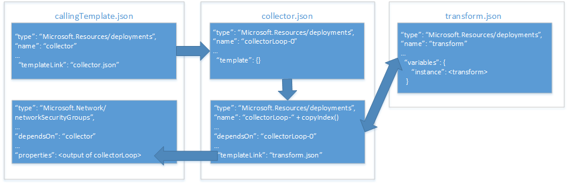

# <a name="implement-a-property-transformer-and-collector-in-an-azure-resource-manager-template"></a><span data-ttu-id="9657c-103">Implementieren eines Transformers und Collectors für Eigenschaften in eine Azure Resource Manager-Vorlage</span><span class="sxs-lookup"><span data-stu-id="9657c-103">Implement a property transformer and collector in an Azure Resource Manager template</span></span>

<span data-ttu-id="9657c-104">Unter [Verwenden eines Objekts als Parameter in einer Azure Resource Manager-Vorlage][objects-as-parameters] wurde beschrieben, wie Sie Werte von Ressourceneigenschaften in einem Objekt speichern und während der Bereitstellung auf eine Ressource anwenden.</span><span class="sxs-lookup"><span data-stu-id="9657c-104">In [use an object as a parameter in an Azure Resource Manager template][objects-as-parameters], you learned how to store resource property values in an object and apply them to a resource during deployment.</span></span> <span data-ttu-id="9657c-105">Dies ist eine sehr gute Möglichkeit, um Ihre Parameter zu verwalten. Bei jeder Verwendung in Ihrer Vorlage müssen Sie aber trotzdem weiterhin die Eigenschaften des Objekts den Ressourceneigenschaften zuordnen.</span><span class="sxs-lookup"><span data-stu-id="9657c-105">While this is a very useful way to manage your parameters, it still requires you to map the object's properties to resource properties each time you use it in your template.</span></span>

<span data-ttu-id="9657c-106">Zur Umgehung dieses Problems können Sie eine Vorlage für die Transformation und Sammlung von Eigenschaften (Transformer und Collector) implementieren, mit der Ihr Objektarray durchlaufen und in das JSON-Schema transformiert wird, das von der Ressource erwartet wird.</span><span class="sxs-lookup"><span data-stu-id="9657c-106">To work around this, you can implement a property transform and collector template that iterates your object array and transforms it into the JSON schema expected by the resource.</span></span>

> [!IMPORTANT]
> <span data-ttu-id="9657c-107">Für diesen Ansatz ist es erforderlich, dass Sie eingehend mit Resource Manager-Vorlagen und -Funktionen vertraut sind.</span><span class="sxs-lookup"><span data-stu-id="9657c-107">This approach requires that you have a deep understanding of Resource Manager templates and functions.</span></span>

<span data-ttu-id="9657c-108">Wir sehen uns nun an, wie wir einen Collector und Transformer für Eigenschaften implementieren können. Hierzu verwenden wir ein Beispiel, in dem eine [Netzwerksicherheitsgruppe (NSG)][nsg] bereitgestellt wird.</span><span class="sxs-lookup"><span data-stu-id="9657c-108">Let's take a look at how we can implement a property collector and transformer with an example that deploys a [network security group (NSG)][nsg].</span></span> <span data-ttu-id="9657c-109">Im Diagramm unten ist die Beziehung zwischen unseren Vorlagen und Ressourcen in diesen Vorlagen dargestellt:</span><span class="sxs-lookup"><span data-stu-id="9657c-109">The diagram below shows the relationship between our templates and our resources within those templates:</span></span>



<span data-ttu-id="9657c-111">Unsere **aufrufende Vorlage** enthält zwei Ressourcen:</span><span class="sxs-lookup"><span data-stu-id="9657c-111">Our **calling template** includes two resources:</span></span>
* <span data-ttu-id="9657c-112">Einen Vorlagenlink, über den die **Collector-Vorlage** aufgerufen wird.</span><span class="sxs-lookup"><span data-stu-id="9657c-112">a template link that invokes our **collector template**.</span></span>
* <span data-ttu-id="9657c-113">Die bereitzustellende NSG-Ressource.</span><span class="sxs-lookup"><span data-stu-id="9657c-113">the NSG resource to deploy.</span></span>

<span data-ttu-id="9657c-114">Unsere **Collector-Vorlage** enthält zwei Ressourcen:</span><span class="sxs-lookup"><span data-stu-id="9657c-114">Our **collector template** includes two resources:</span></span>
* <span data-ttu-id="9657c-115">Eine **anchor**-Ressource.</span><span class="sxs-lookup"><span data-stu-id="9657c-115">an **anchor** resource.</span></span>
* <span data-ttu-id="9657c-116">Einen Vorlagenlink, über den die Transformer-Vorlage in einer Kopierschleife aufgerufen wird.</span><span class="sxs-lookup"><span data-stu-id="9657c-116">a template link that invokes the transform template in a copy loop.</span></span>

<span data-ttu-id="9657c-117">Unsere **Transformer-Vorlage** enthält eine einzelne Ressource: eine leere Vorlage mit einer Variablen, die den `source`-JSON-Code in das JSON-Schema transformiert, der von der NSG-Ressource in der **Hauptvorlage** erwartet wird.</span><span class="sxs-lookup"><span data-stu-id="9657c-117">Our **transform template** includes a single resource: an empty template with a variable that transforms our `source` JSON to the JSON schema expected by our NSG resource in the **main template**.</span></span>

## <a name="parameter-object"></a><span data-ttu-id="9657c-118">Parameterobjekt</span><span class="sxs-lookup"><span data-stu-id="9657c-118">Parameter object</span></span>

<span data-ttu-id="9657c-119">Wir verwenden das Parameterobjekt `securityRules` aus [Objekte als Parameter][objects-as-parameters].</span><span class="sxs-lookup"><span data-stu-id="9657c-119">We'll be using our `securityRules` parameter object from [objects as parameters][objects-as-parameters].</span></span> <span data-ttu-id="9657c-120">Mit der **Transformer-Vorlage** wird jedes Objekt im Array `securityRules` in das JSON-Schema transformiert, das von der NSG-Ressource in unserer **aufrufenden Vorlage** erwartet wird.</span><span class="sxs-lookup"><span data-stu-id="9657c-120">Our **transform template** will transform each object in the `securityRules` array into the JSON schema expected by the NSG resource in our **calling template**.</span></span>

```json
{
    "$schema": "https://schema.management.azure.com/schemas/2015-01-01/deploymentParameters.json#",
    "contentVersion": "1.0.0.0",
    "parameters":{ 
      "networkSecurityGroupsSettings": {
      "value": {
          "securityRules": [
            {
              "name": "RDPAllow",
              "description": "allow RDP connections",
              "direction": "Inbound",
              "priority": 100,
              "sourceAddressPrefix": "*",
              "destinationAddressPrefix": "10.0.0.0/24",
              "sourcePortRange": "*",
              "destinationPortRange": "3389",
              "access": "Allow",
              "protocol": "Tcp"
            },
            {
              "name": "HTTPAllow",
              "description": "allow HTTP connections",
              "direction": "Inbound",
              "priority": 200,
              "sourceAddressPrefix": "*",
              "destinationAddressPrefix": "10.0.1.0/24",
              "sourcePortRange": "*",
              "destinationPortRange": "80",
              "access": "Allow",
              "protocol": "Tcp"
            }
          ]
        }
      }
    }
  }
```

<span data-ttu-id="9657c-121">Wir sehen uns zuerst die **Transformer-Vorlage** an.</span><span class="sxs-lookup"><span data-stu-id="9657c-121">Let's look at our **transform template** first.</span></span>

## <a name="transform-template"></a><span data-ttu-id="9657c-122">Transformer-Vorlage</span><span class="sxs-lookup"><span data-stu-id="9657c-122">Transform template</span></span>

<span data-ttu-id="9657c-123">Die **Transformer-Vorlage** enthält zwei Parameter, die von der **Collector-Vorlage** übergeben werden:</span><span class="sxs-lookup"><span data-stu-id="9657c-123">Our **transform template** includes two parameters that are passed from the **collector template**:</span></span> 
* <span data-ttu-id="9657c-124">`source` ist ein Objekt, das eines der Eigenschaftswertobjekte aus dem Eigenschaftenarray empfängt.</span><span class="sxs-lookup"><span data-stu-id="9657c-124">`source` is an object that receives one of the property value objects from the property array.</span></span> <span data-ttu-id="9657c-125">In unserem Beispiel wird jedes Objekt aus dem Array `"securityRules"` einzeln übergeben.</span><span class="sxs-lookup"><span data-stu-id="9657c-125">In our example, each object from the `"securityRules"` array will be passed in one at a time.</span></span>
* <span data-ttu-id="9657c-126">`state` ist ein Array, das die verketteten Ergebnisse aller vorherigen Transformationen empfängt.</span><span class="sxs-lookup"><span data-stu-id="9657c-126">`state` is an array that receives the concatenated results of all the previous transforms.</span></span> <span data-ttu-id="9657c-127">Dies ist die Sammlung mit dem transformierten JSON-Code.</span><span class="sxs-lookup"><span data-stu-id="9657c-127">This is the collection of transformed JSON.</span></span>

<span data-ttu-id="9657c-128">Unsere Parameter sehen wie folgt aus:</span><span class="sxs-lookup"><span data-stu-id="9657c-128">Our parameters look like this:</span></span>

```json
{
  "$schema": "http://schema.management.azure.com/schemas/2015-01-01/deploymentTemplate.json#",
  "contentVersion": "1.0.0.0",
  "parameters": {
    "source": { "type": "object" },
    "state": {
      "type": "array",
      "defaultValue": [ ]
    }
  },
```

<span data-ttu-id="9657c-129">In unserer Vorlage wird auch eine Variable mit dem Namen `instance` definiert.</span><span class="sxs-lookup"><span data-stu-id="9657c-129">Our template also defines a variable named `instance`.</span></span> <span data-ttu-id="9657c-130">Hiermit wird die eigentliche Transformation unseres `source`-Objekts in das erforderliche JSON-Schema durchgeführt:</span><span class="sxs-lookup"><span data-stu-id="9657c-130">It performs the actual tranform of our `source` object into the required JSON schema:</span></span>

```json
  "variables": {
    "instance": [
      {
        "name": "[parameters('source').name]",
        "properties":{
            "description": "[parameters('source').description]",
            "protocol": "[parameters('source').protocol]",
            "sourcePortRange": "[parameters('source').sourcePortRange]",
            "destinationPortRange": "[parameters('source').destinationPortRange]",
            "sourceAddressPrefix": "[parameters('source').sourceAddressPrefix]",
            "destinationAddressPrefix": "[parameters('source').destinationAddressPrefix]",
            "access": "[parameters('source').access]",
            "priority": "[parameters('source').priority]",
            "direction": "[parameters('source').direction]"            
        }
      }
    ]

  },
```

<span data-ttu-id="9657c-131">Abschließend werden in der Ausgabe (`output`) unserer Vorlage die gesammelten Transformationen des Parameters `state` mit der aktuellen Transformation verkettet, die von der Variablen `instance` durchgeführt wird:</span><span class="sxs-lookup"><span data-stu-id="9657c-131">Finally, the `output` of our template concatenates the collected transforms of our `state` parameter with the current transform performed by our `instance` variable:</span></span>

```json
  "outputs": {
    "collection": {
      "type": "array",
      "value": "[concat(parameters('state'), variables('instance'))]"
    }
```

<span data-ttu-id="9657c-132">Als Nächstes sehen wir uns unsere **Collector-Vorlage** an, um zu verfolgen, wie die Parameterwerte übergeben werden.</span><span class="sxs-lookup"><span data-stu-id="9657c-132">Next, let's take a look at our **collector template** to see how it passes in our parameter values.</span></span>

## <a name="collector-template"></a><span data-ttu-id="9657c-133">Collector-Vorlage</span><span class="sxs-lookup"><span data-stu-id="9657c-133">Collector template</span></span>

<span data-ttu-id="9657c-134">Die **Collector-Vorlage** enthält drei Parameter:</span><span class="sxs-lookup"><span data-stu-id="9657c-134">Our **collector template** includes three parameters:</span></span>
* <span data-ttu-id="9657c-135">`source` ist unser vollständiges Parameterobjektarray.</span><span class="sxs-lookup"><span data-stu-id="9657c-135">`source` is our complete parameter object array.</span></span> <span data-ttu-id="9657c-136">Es wird von der **aufrufenden Vorlage** übergeben.</span><span class="sxs-lookup"><span data-stu-id="9657c-136">It's passed in by the **calling template**.</span></span> <span data-ttu-id="9657c-137">Dieses Array hat den gleichen Namen wie der Parameter `source` in der **Transformer-Vorlage**, aber es gibt einen wichtigen Unterschied, den Sie vielleicht schon bemerkt haben: Dies ist das vollständige Array, aber es wird jeweils nur ein Element dieses Arrays an die **Transformer-Vorlage** übergeben.</span><span class="sxs-lookup"><span data-stu-id="9657c-137">This has the same name as the `source` parameter in our **transform template** but there is one key difference that you may have already noticed: this is the complete array, but we only pass one element of this array to the **transform template** at a time.</span></span>
* <span data-ttu-id="9657c-138">`transformTemplateUri` ist der URI der **Transformer-Vorlage**.</span><span class="sxs-lookup"><span data-stu-id="9657c-138">`transformTemplateUri` is the URI of our **transform template**.</span></span> <span data-ttu-id="9657c-139">Wir definieren ihn hier als Parameter, um die Vorlage wiederverwenden zu können.</span><span class="sxs-lookup"><span data-stu-id="9657c-139">We're defining it as a parameter here for template reusability.</span></span>
* <span data-ttu-id="9657c-140">`state` ist ein ursprünglich leeres Array, das wir an die **Transformer-Vorlage** übergeben.</span><span class="sxs-lookup"><span data-stu-id="9657c-140">`state` is an initially empty array that we pass to our **transform template**.</span></span> <span data-ttu-id="9657c-141">Darin wird die Sammlung mit den transformierten Parameterobjekten gespeichert, wenn die Kopierschleife abgeschlossen ist.</span><span class="sxs-lookup"><span data-stu-id="9657c-141">It stores the collection of transformed parameter objects when the copy loop is complete.</span></span>

<span data-ttu-id="9657c-142">Unsere Parameter sehen wie folgt aus:</span><span class="sxs-lookup"><span data-stu-id="9657c-142">Our parameters look like this:</span></span>

```json
  "parameters": {
    "source": { "type": "array" },
    "transformTemplateUri": { "type": "string" },
    "state": {
      "type": "array",
      "defaultValue": [ ]
    }
``` 

<span data-ttu-id="9657c-143">Als Nächstes definieren wir eine Variable mit dem Namen `count`.</span><span class="sxs-lookup"><span data-stu-id="9657c-143">Next, we define a variable named `count`.</span></span> <span data-ttu-id="9657c-144">Ihr Wert ist die Länge des Parameterobjektarrays `source`:</span><span class="sxs-lookup"><span data-stu-id="9657c-144">Its value is the length of the `source` parameter object array:</span></span>

```json
  "variables": {
    "count": "[length(parameters('source'))]"
  },
```

<span data-ttu-id="9657c-145">Wie Sie vielleicht schon erwartet haben, verwenden wir sie für die Anzahl von Durchläufen (Iterationen) unserer Kopierschleife.</span><span class="sxs-lookup"><span data-stu-id="9657c-145">As you might suspect, we use it for the number of iterations in our copy loop.</span></span>

<span data-ttu-id="9657c-146">Wir sehen uns nun die Ressourcen an.</span><span class="sxs-lookup"><span data-stu-id="9657c-146">Now let's take a look at our resources.</span></span> <span data-ttu-id="9657c-147">Es werden zwei Ressourcen definiert:</span><span class="sxs-lookup"><span data-stu-id="9657c-147">We define two resources:</span></span>
* <span data-ttu-id="9657c-148">`loop-0` ist die nullbasierte Ressource für unsere Kopierschleife.</span><span class="sxs-lookup"><span data-stu-id="9657c-148">`loop-0` is the zero-based resource for our copy loop.</span></span>
* <span data-ttu-id="9657c-149">`loop-` wird mit dem Ergebnis der Funktion `copyIndex(1)` verkettet, um einen eindeutigen iterationsbasierten Namen für die Ressource zu generieren, der mit `1` beginnt.</span><span class="sxs-lookup"><span data-stu-id="9657c-149">`loop-` is concatenated with the result of the `copyIndex(1)` function to generate a unique iteration-based name for our resource, starting with `1`.</span></span>

<span data-ttu-id="9657c-150">Unsere Ressourcen sehen wie folgt aus:</span><span class="sxs-lookup"><span data-stu-id="9657c-150">Our resources look like this:</span></span>

```json
  "resources": [
    {
      "type": "Microsoft.Resources/deployments",
      "apiVersion": "2015-01-01",
      "name": "loop-0",
      "properties": {
        "mode": "Incremental",
        "parameters": { },
        "template": {
          "$schema": "http://schema.management.azure.com/schemas/2015-01-01/deploymentTemplate.json#",
          "contentVersion": "1.0.0.0",
          "parameters": { },
          "variables": { },
          "resources": [ ],
          "outputs": {
            "collection": {
              "type": "array",
              "value": "[parameters('state')]"
            }
          }
        }
      }
    },
    {
      "type": "Microsoft.Resources/deployments",
      "apiVersion": "2015-01-01",
      "name": "[concat('loop-', copyindex(1))]",
      "copy": {
        "name": "iterator",
        "count": "[variables('count')]",
        "mode": "serial"
      },
      "dependsOn": [
        "loop-0"
      ],
      "properties": {
        "mode": "Incremental",
        "templateLink": { "uri": "[parameters('transformTemplateUri')]" },
        "parameters": {
          "source": { "value": "[parameters('source')[copyindex()]]" },
          "state": { "value": "[reference(concat('loop-', copyindex())).outputs.collection.value]" }
        }
      }
    }
  ],
```

<span data-ttu-id="9657c-151">Wir werfen einen genaueren Blick auf die Parameter, die wir an die **Transformer-Vorlage** in der geschachtelten Vorlage übergeben.</span><span class="sxs-lookup"><span data-stu-id="9657c-151">Let's take a closer look at the parameters we're passing to our **transform template** in the nested template.</span></span> <span data-ttu-id="9657c-152">Sie erinnern sich, dass mit dem Parameter `source` das aktuelle Objekt im Parameterobjektarray `source` übergeben wird.</span><span class="sxs-lookup"><span data-stu-id="9657c-152">Recall from earlier that our `source` parameter passes the current object in the `source` parameter object array.</span></span> <span data-ttu-id="9657c-153">Die Sammlung wird im Parameter `state` durchgeführt. Es wird die Ausgabe des vorherigen Durchlaufs durch die Kopierschleife verwendet (die Funktion `reference()` verwendet die Funktion `copyIndex()` ohne Parameter, um auf das `name`-Element des vorherigen verknüpften Vorlagenobjekts zu verweisen) und an den aktuellen Durchlauf übergeben.</span><span class="sxs-lookup"><span data-stu-id="9657c-153">The `state` parameter is where the collection happens, because it takes the output of the previous iteration of our copy loop&mdash;notice that the `reference()` function uses the `copyIndex()` function with no parameter to reference the `name` of our previous linked template object&mdash;and passes it to the current iteration.</span></span>

<span data-ttu-id="9657c-154">Abschließend gibt die Ausgabe (`output`) unserer Vorlage die Ausgabe (`output`) des letzten Durchlaufs unserer **Transformer-Vorlage** zurück:</span><span class="sxs-lookup"><span data-stu-id="9657c-154">Finally, the `output` of our template returns the `output` of the last iteration of our **transform template**:</span></span>

```json
  "outputs": {
    "result": {
      "type": "array",
      "value": "[reference(concat('loop-', variables('count'))).outputs.collection.value]"
    }
  }
```
<span data-ttu-id="9657c-155">Es kann ungewöhnlich erscheinen, dass die Ausgabe (`output`) des letzten Durchlaufs der **Transformer-Vorlage** an die **aufrufende Vorlage** übergeben wird, da sie anscheinend im Parameter `source` gespeichert wurde.</span><span class="sxs-lookup"><span data-stu-id="9657c-155">It may seem counterintuitive to return the `output` of the last iteration of our **transform template** to our **calling template** because it appeared we were storing it in our `source` parameter.</span></span> <span data-ttu-id="9657c-156">Bedenken Sie aber, dass dies der letzte Durchlauf der **Transformer-Vorlage** ist, die das gesamte Array mit den Eigenschaftsobjekten enthält, und dass dies die Daten sind, die wir zurückgeben möchten.</span><span class="sxs-lookup"><span data-stu-id="9657c-156">However, remember that it's the last iteration of our **transform template** that holds the complete array of transformed property objects, and that's what we want to return.</span></span>

<span data-ttu-id="9657c-157">Zum Schluss sehen wir uns noch an, wie die **Collector-Vorlage** aus der **aufrufenden Vorlage** aufgerufen wird.</span><span class="sxs-lookup"><span data-stu-id="9657c-157">Finally, let's take a look at how to call the **collector template** from our **calling template**.</span></span>

## <a name="calling-template"></a><span data-ttu-id="9657c-158">Aufrufende Vorlage</span><span class="sxs-lookup"><span data-stu-id="9657c-158">Calling template</span></span>

<span data-ttu-id="9657c-159">Mit der **aufrufenden Vorlage** wird ein einzelner Parameter mit dem Namen `networkSecurityGroupsSettings` definiert:</span><span class="sxs-lookup"><span data-stu-id="9657c-159">Our **calling template** defines a single parameter named `networkSecurityGroupsSettings`:</span></span>

```json
...
"parameters": {
    "networkSecurityGroupsSettings": {
        "type": "object"
    }
```

<span data-ttu-id="9657c-160">Als Nächstes definiert unsere Vorlage eine einzelne Variable mit dem Namen `collectorTemplateUri`:</span><span class="sxs-lookup"><span data-stu-id="9657c-160">Next, our template defines a single variable named `collectorTemplateUri`:</span></span>

```json
"variables": {
    "collectorTemplateUri": "[uri(deployment().properties.templateLink.uri, 'collector.template.json')]"
  }
```

<span data-ttu-id="9657c-161">Wie zu erwarten ist, ist dies der URI für die **Collector-Vorlage**, die von der verknüpften Vorlagenressource verwendet wird:</span><span class="sxs-lookup"><span data-stu-id="9657c-161">As you would expect, this is the URI for the **collector template** that will be used by our linked template resource:</span></span>

```json
{
    "apiVersion": "2015-01-01",
    "name": "collector",
    "type": "Microsoft.Resources/deployments",
    "properties": {
        "mode": "Incremental",
        "templateLink": {
            "uri": "[variables('linkedTemplateUri')]",
            "contentVersion": "1.0.0.0"
        },
        "parameters": {
            "source" : {"value": "[parameters('networkSecurityGroupsSettings').securityRules]"},
            "transformTemplateUri": { "value": "[uri(deployment().properties.templateLink.uri, 'transform.json')]"}
        }
    }
}
```

<span data-ttu-id="9657c-162">Wir übergeben zwei Parameter an die **Collector-Vorlage**:</span><span class="sxs-lookup"><span data-stu-id="9657c-162">We pass two parameters to the **collector template**:</span></span>
* <span data-ttu-id="9657c-163">`source` ist unser Eigenschaftsobjektarray.</span><span class="sxs-lookup"><span data-stu-id="9657c-163">`source` is our property object array.</span></span> <span data-ttu-id="9657c-164">In unserem Beispiel ist dies der Parameter `networkSecurityGroupsSettings`.</span><span class="sxs-lookup"><span data-stu-id="9657c-164">In our example, it's our `networkSecurityGroupsSettings` parameter.</span></span>
* <span data-ttu-id="9657c-165">`transformTemplateUri` ist die Variable, die wir gerade mit dem URI der **Collector-Vorlage** definiert haben.</span><span class="sxs-lookup"><span data-stu-id="9657c-165">`transformTemplateUri` is the variable we just defined with the URI of our **collector template**.</span></span>

<span data-ttu-id="9657c-166">Zuletzt weist die Ressource `Microsoft.Network/networkSecurityGroups` die Ausgabe (`output`) der verknüpften Vorlagenressource `collector` direkt der dazugehörigen `securityRules`-Eigenschaft zu:</span><span class="sxs-lookup"><span data-stu-id="9657c-166">Finally, our `Microsoft.Network/networkSecurityGroups` resource directly assigns the `output` of the `collector` linked template resource to its `securityRules` property:</span></span>

```json
    {
      "apiVersion": "2015-06-15",
      "type": "Microsoft.Network/networkSecurityGroups",
      "name": "networkSecurityGroup1",
      "location": "[resourceGroup().location]",
      "properties": {
        "securityRules": "[reference('firstResource').outputs.result.value]"
      }
    }
  ],
  "outputs": {
      "instance":{
          "type": "array",
          "value": "[reference('firstResource').outputs.result.value]"
      }

  }
```

## <a name="next-steps"></a><span data-ttu-id="9657c-167">Nächste Schritte</span><span class="sxs-lookup"><span data-stu-id="9657c-167">Next steps</span></span>

* <span data-ttu-id="9657c-168">Dieses Verfahren ist im [Vorlagenbaustein-Projekt](https://github.com/mspnp/template-building-blocks) und in den [Azure-Referenzarchitekturen](/azure/architecture/reference-architectures/) implementiert.</span><span class="sxs-lookup"><span data-stu-id="9657c-168">This technique is implemented in the [template building blocks project](https://github.com/mspnp/template-building-blocks) and the [Azure reference architectures](/azure/architecture/reference-architectures/).</span></span> <span data-ttu-id="9657c-169">Sie können hiermit Ihre eigene Architektur erstellen, oder Sie können eine unserer Referenzarchitekturen bereitstellen.</span><span class="sxs-lookup"><span data-stu-id="9657c-169">You can use these to create your own architecture or deploy one of our reference architectures.</span></span>

<!-- links -->
[objects-as-parameters]: ./objects-as-parameters.md
[resource-manager-linked-template]: /azure/azure-resource-manager/resource-group-linked-templates
[resource-manager-variables]: /azure/azure-resource-manager/resource-group-template-functions-deployment
[nsg]: /azure/virtual-network/virtual-networks-nsg
