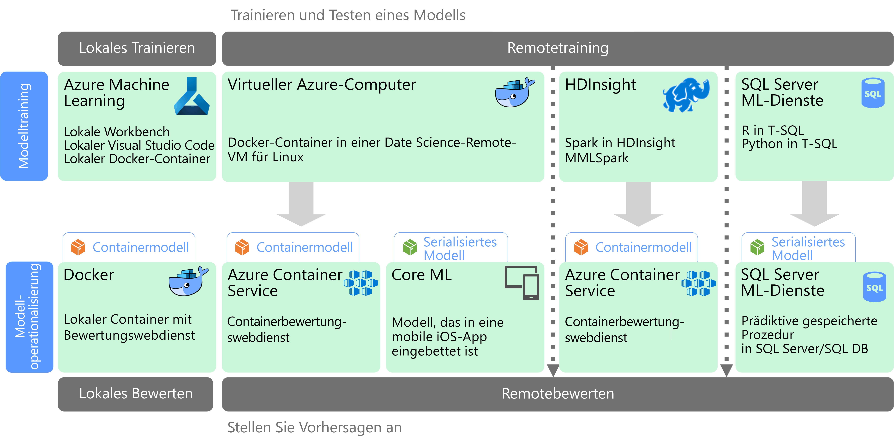

# Bedarfsorientiertes Machine LearningMachine learning at scale

Machine Learning (ML) ist ein Verfahren, das zum Trainieren von Vorhersagemodellen basierend auf mathematischen Algorithmen eingesetzt wird.Machine learning (ML) is a technique used to train predictive models based on mathematical algorithms. Beim Machine Learning werden die Beziehungen zwischen Datenfeldern analysiert, um unbekannte Werte vorherzusagen.Machine learning analyzes the relationships between data fields to predict unknown values.

Die Erstellung und Bereitstellung eines Machine Learning-Modells ist ein iterativer Prozess:Creating and deploying a machine learning model is an iterative process:

* Data Scientists untersuchen die Quelldaten, um Beziehungen zwischen *Features* und vorhergesagten *Bezeichnungen* zu ermitteln.Data scientists explore the source data to determine relationships between *features* and predicted *labels*.
* Die Data Scientists trainieren und überprüfen Modelle anhand von geeigneten Algorithmen, um das optimale Modell für die Vorhersage zu finden.The data scientists train and validate models based on appropriate algorithms to find the optimal model for prediction.
* Das optimale Modell wird in der Produktion als Webdienst oder als eine andere gekapselte Funktion bereitgestellt.The optimal model is deployed into production, as a web service or some other encapsulated function.
* Wenn neue Daten gesammelt werden, wird das Modell regelmäßig neu trainiert, um die Effektivität zu verbessern.As new data is collected, the model is periodically retrained to improve is effectiveness.

Mit dem bedarfsorientierten Machine Learning werden zwei verschiedene Skalierbarkeitsziele erreicht.Machine learning at scale addresses two different scalability concerns. Das erste Ziel ist das Trainieren eines Modells basierend auf großen Datasets, für die zum Trainieren die Funktionen zum horizontalen Hochskalieren eines Clusters benötigt werden.The first is training a model against large data sets that require the scale-out capabilities of a cluster to train. Beim zweiten Ziel geht es um die Operationalisierung des Lernmodells mit einem Ansatz, bei dem eine Skalierung vorgenommen werden kann, um die Anforderungen der Consumeranwendungen zu erfüllen.The second centers is operationalizating the learned model in a way that can scale to meet the demands of the applications that consume it. Normalerweise wird dies erreicht, indem die Vorhersagefunktionen als Webdienst bereitgestellt werden, der dann horizontal hochskaliert werden kann.Typically this is accomplished by deploying the predictive capabilities as a web service that can then be scaled out.

Das bedarfsorientierte Machine Learning hat den Vorteil, dass leistungsstarke Vorhersagefunktionen produziert werden können, da bessere Modelle in der Regel das Ergebnis der Verwendung einer größeren Datenmenge sind.Machine learning at scale has the benefit that it can produce powerful, predictive capabilities because better models typically result from more data. Nachdem ein Modell trainiert wurde, kann es als zustandsloser, hoch performanter Webdienst mit der Möglichkeit zum horizontalen Hochskalieren bereitgestellt werden.Once a model is trained, it can be deployed as a stateless, highly-performant, scale-out web service. 

## Modellvorbereitung und -trainingModel preparation and training

Während der Phase für die Modellvorbereitung und das Training untersuchen Data Scientists die Daten interaktiv, indem sie Sprachen wie Python und R für folgende Zwecke nutzen:During the model preparation and training phase, data scientists explore the data interactively using languages like Python and R to:

* Extrahieren von Stichproben aus Datenspeichern mit großen DatenmengenExtract samples from high volume data stores.
* Suchen und Behandeln von Ausreißern, Duplikaten und fehlenden Werten zum Bereinigen der DatenFind and treat outliers, duplicates, and missing values to clean the data.
* Ermitteln von Korrelationen und Beziehungen in den Daten per statistischer Analyse und VisualisierungDetermine correlations and relationships in the data through statistical analysis and visualization.
* Generieren neuer berechneter Features zur Verbesserung der Vorhersagbarkeit von statistischen BeziehungenGenerate new calculated features that improve the predictiveness of statistical relationships.
* Trainieren von ML-Modellen basierend auf VorhersagealgorithmenTrain ML models based on predictive algorithms.
* Überprüfen von trainierten Modellen anhand von Daten, die während des Trainingsschritts zurückgehalten wurdenValidate trained models using data that was withheld during training.

Zur Unterstützung dieser Phase für die interaktive Analyse und Modellierung müssen für Data Scientists auf der Datenplattform verschiedene Tools zum Untersuchen der Daten verfügbar sein.To support this interactive analysis and modeling phase, the data platform must enable data scientists to explore data using a variety of tools. Außerdem können für das Trainieren eines komplexen Machine Learning-Modells viele intensive Schritte zur Verarbeitung großer Datenmengen erforderlich sein, sodass es wichtig ist, dass genügend Ressourcen für das horizontale Hochskalieren des Modelltrainings vorhanden sind.Additionally, the training of a complex machine learning model can require a lot of intensive processing of high volumes of data, so sufficient resources for scaling out the model training is essential.

## Modellbereitstellung und -nutzungModel deployment and consumption

Wenn ein Modell bereit für die Bereitstellung ist, kann es als Webdienst gekapselt und in der Cloud, auf einem Edgegerät oder in einer ML-Ausführungsumgebung für Unternehmen bereitgestellt werden.When a model is ready to be deployed, it can be encapsulated as a web service and deployed in the cloud, to an edge device, or within an enterprise ML execution environment. Der Bereitstellungsprozess wird als Operationalisierung bezeichnet.This deployment process is referred to as operationalization.

## HerausforderungenChallenges

Bedarfsorientiertes Machine Learning ist mit einigen Herausforderungen verbunden:Machine learning at scale produces a few challenges:

- Normalerweise benötigen Sie zum Trainieren eines Modells viele Daten – vor allem für Deep Learning-Modelle.You typically need a lot of data to train a model, especially for deep learning models.
- Sie müssen diese großen Datasets zunächst vorbereiten, bevor Sie mit dem Trainieren Ihres Modells beginnen können.You need to prepare these big data sets before you can even begin training your model.
- In der Phase des Modelltrainings muss auf die Big Data-Speicher zugegriffen werden.The model training phase must access the big data stores. Häufig wird für das Modelltraining derselbe Big Data-Cluster verwendet, z.B. Spark, der auch für die Datenvorbereitung genutzt wird.It's common to perform the model training using the same big data cluster, such as Spark, that is used for data preparation. 
- Für Szenarien wie das Deep Learning benötigen Sie nicht nur einen Cluster, der Ihnen das horizontale Hochskalieren für CPUs ermöglicht, sondern Ihr Cluster muss auch aus GPU-fähigen Knoten bestehen.For scenarios such as deep learning, not only will you need a cluster that can provide you scale out on CPUs, but your cluster will need to consist of GPU-enabled nodes.

## Bedarfsorientiertes Machine Learning in AzureMachine learning at scale in Azure

Bevor Sie die Entscheidung treffen, welche ML-Dienste für das Training und die Operationalisierung verwendet werden, sollten Sie sich die folgende Frage stellen: Muss überhaupt ein Modell trainiert werden, oder erfüllt auch ein vordefiniertes Modell Ihre Anforderungen?Before deciding which ML services to use in training and operationalization, consider whether you need to train a model at all, or if a prebuilt model can meet your requirements. In vielen Fällen muss für die Verwendung eines vordefinierten Modells lediglich ein Webdienst aufgerufen oder eine ML-Bibliothek verwendet werden, um ein vorhandenes Modell zu laden.In many cases, using a prebuilt model is just a matter of calling a web service or using an ML library to load an existing model. Beispiele für Optionen sind:Some options include: 

- Verwenden Sie die Webdienste, die über Microsoft Cognitive Services bereitgestellt werden.Use the web services provided by Microsoft Cognitive Services.
- Verwenden Sie die vortrainierten neuronalen Netzwerkmodelle des Cognitive Toolkit.Use the pretrained neural network models provided by Cognitive Toolkit.
- Betten Sie die serialisierten Modelle ein, die von Core ML für iOS-Apps bereitgestellt werden.Embed the serialized models provided by Core ML for an iOS apps. 

Falls ein vordefiniertes Modell für Ihre Daten oder Ihr Szenario nicht geeignet ist, können Sie in Azure die Optionen Azure Machine Learning, HDInsight mit Spark MLlib und MMLSpark, Cognitive Toolkit und SQL Machine Learning Services verwenden.If a prebuilt model does not fit your data or your scenario, options in Azure include Azure Machine Learning, HDInsight with Spark MLlib and MMLSpark, Cognitive Toolkit, and SQL Machine Learning Services. Falls Sie sich für die Nutzung eines benutzerdefinierten Modells entscheiden, müssen Sie eine Pipeline entwerfen, die das Modelltraining und die Operationalisierung umfasst.If you decide to use a custom model, you must design a pipeline that includes model training and operationalization. 

Eine Liste mit Technologieoptionen für ML in Azure finden Sie unter den folgenden Themen:For a list of technology choices for ML in Azure, see the following topics:

- [Auswählen einer Cognitive Services-TechnologieChoosing a cognitive services technology](../technology-choices/cognitive-services.md)
- [Auswählen einer Machine Learning-TechnologieChoosing a machine learning technology](../technology-choices/data-science-and-machine-learning.md)
- [Auswählen einer Technologie zur Verarbeitung von natürlicher SpracheChoosing a natural language processing technology](../technology-choices/natural-language-processing.md)
