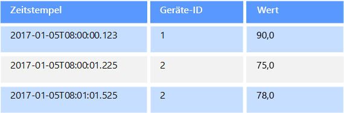
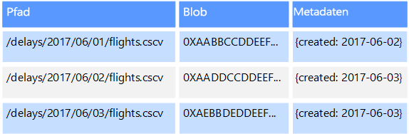
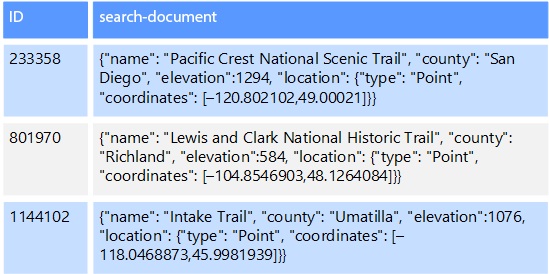

# Nicht relationale Daten und NoSQL

Eine *nicht relationale Datenbank* ist eine Datenbank, die nicht das tabellarische Schema mit Zeilen und Spalten verwendet, das in den meisten herkömmlichen Datenbanksystemen zum Einsatz kommt. Nicht relationale Daten verwenden stattdessen ein Speichermodell, das für die spezifischen Anforderungen des gespeicherten Datentyps optimiert ist. So können die Daten beispielsweise als einfache Schlüssel-Wert-Paare, als JSON-Dokumente oder als Diagramm mit Edges und Scheitelpunkten gespeichert werden. 

Diese Datenspeicher haben alle eins gemeinsam: Sie verwenden kein [relationales Modell](../relational-data/index.md). Darüber hinaus sind sie für gewöhnlich spezifischer, was die Art der unterstützten Daten und die Vorgehensweise zum Abfragen von Daten angeht. So sind Zeitreihen-Datenspeicher beispielsweise für Abfragen über zeitbasierte Sequenzen von Daten optimiert, während Diagrammdatenspeicher für die Untersuchung gewichteter Beziehungen zwischen Entitäten optimiert sind. Beide Formate eignen sich nicht sonderlich gut für die allgemeine Verwaltung von Transaktionsdaten. 

Der Begriff *NoSQL* bezieht sich auf Datenspeicher, die anstelle von SQL andere Programmiersprachen und Konstrukte für Datenabfragen verwenden. In der Praxis bedeutet „NoSQL“ so viel wie „nicht relationale Datenbank“, auch wenn viele dieser Datenbanken SQL-kompatible Abfragen unterstützen. Die zugrunde liegende Abfrageausführungsstrategie unterscheidet sich jedoch in der Regel deutlich von der Ausführung der gleichen SQL-Abfrage durch ein herkömmliches RDBMS.

In den folgenden Abschnitten werden die Hauptkategorien einer nicht relationalen Datenbank bzw. einer NoSQL-Datenbank beschrieben.

## Dokumentdatenspeicher
Ein Dokumentdatenspeicher verwaltet einen Satz von benannten Zeichenfolgenfeldern und Objektdatenwerten in einer als *Dokument* bezeichneten Entität. In diesen Datenspeichern werden Daten üblicherweise als JSON-Dokumente gespeichert. Jeder Feldwert kann ein Skalarelement (beispielsweise eine Zahl) oder ein Verbundelement (beispielsweise eine Liste oder eine hierarchische Sammlung) sein. Die Daten in den Feldern eines Dokuments können auf verschiedene Arten (beispielsweise im XML-, YAML-, JSON- oder BSON-Format) codiert oder als einfacher Text gespeichert werden. Die Felder in Dokumenten werden für das Speicherverwaltungssystem verfügbar gemacht, sodass eine Anwendung Daten abfragen und filtern kann, indem sie die Werte in diesen Feldern verwendet.  

Üblicherweise enthält ein Dokument die gesamten Daten einer Entität. Die Elemente, aus denen sich eine Entität zusammensetzt, sind anwendungsspezifisch. Eine Entität kann beispielsweise die Details eines Kunden, eines Auftrags oder einer Kombination aus beidem enthalten. Ein einzelnes Dokument kann Informationen enthalten, die bei einem Managementsystem für relationale Datenbanken (Relational Database Management System, RDBMS) auf mehrere relationale Tabellen verteilt wären. Ein Dokumentspeicher setzt nicht voraus, dass alle Dokumente die gleiche Struktur haben. Dieser Konzept der freien Form bietet ein hohes Maß an Flexibilität. Anwendungen können beispielsweise verschiedene Daten in Dokumenten speichern, um auf veränderte Geschäftsanforderungen zu reagieren.  

  

Mithilfe des Dokumentschlüssels kann die Anwendung Dokumente abrufen. Dieser Schlüssel ist ein eindeutiger Bezeichner des Dokuments, der häufig einem Hashvorgang unterzogen wird, um eine gleichmäßige Verteilung der Daten zu ermöglichen. Einige Dokumentdatenbanken erstellen den Dokumentschlüssel automatisch. Andere ermöglichen Ihnen, ein Attribut des Dokuments anzugeben, das als Schlüssel verwendet werden soll. Die Anwendung kann auch auf Basis des Werts eines oder mehrerer Felder Dokumente abfragen. Einige Dokumentdatenbanken unterstützen die Indizierung, um eine schnelle Suche nach Dokumenten zu ermöglichen, die auf einem oder mehreren indizierten Feldern basieren.  

Viele Dokumentdatenbanken unterstützen direkte Aktualisierungen, sodass eine Anwendung die Werte bestimmter Felder in einem Dokument ändern kann, ohne das gesamte Dokument neu schreiben zu müssen. Lese- und Schreibvorgänge in mehreren Feldern eines Dokuments sind in der Regel atomisch.

In Frage kommender Azure-Dienst:  

- [Azure Cosmos DB](https://azure.microsoft.com/services/cosmos-db/)

## Spaltenbasierte Datenspeicher
Bei einem spaltenbasierten Datenspeicher bzw. einem Spaltenfamilien-Datenspeicher werden Daten in Zeilen und Spalten organisiert. In ihrer einfachsten Form kann ein Spaltenfamilien-Datenspeicher einer relationalen Datenbank sehr ähnlich sein (zumindest konzeptionell). Die eigentliche Stärke einer Spaltenfamilien-Datenbank liegt in ihrem denormalisierten Ansatz zur Strukturierung von Daten mit geringer Dichte, der auf den spaltenorientierten Datenspeicherungsansatz zurückgeht.  

Einen Spaltenfamilien-Datenspeicher können Sie sich als eine Datenbank mit tabellarischen Daten in Zeilen und Spalten vorstellen, wobei die Spalten in Gruppen unterteilt sind, die als Spaltenfamilien bezeichnet werden. Jede Spaltenfamilie enthält eine Reihe von Spalten, die logisch miteinander verknüpft sind und typischerweise als Einheit abgerufen oder bearbeitet werden. Andere Daten, auf die separat zugegriffen wird, können in separaten Spaltenfamilien gespeichert werden. Innerhalb einer Spaltenfamilie können neue Spalten dynamisch hinzugefügt werden, und Zeilen müssen nicht für jede Spalte einen Wert aufweisen. 

Das folgende Diagramm zeigt ein Beispiel mit zwei Spaltenfamilien, `Identity` und `Contact Info`. Die Daten für eine einzelne Entität haben in jeder Spaltenfamilie den gleichen Zeilenschlüssel. Diese Struktur, bei der die Zeilen für ein beliebiges Objekt in einer Spaltenfamilie dynamisch variieren können, ist ein wichtiger Vorteil des Spaltenfamilienansatzes. Dadurch eignet sich diese Form der Datenspeicherung hervorragend für die Speicherung strukturierter Daten mit variierenden Schemas.

Im Gegensatz zu einem Schlüssel-Wert-Speicher oder einer Dokumentendatenbank speichern die meisten Spaltenfamilien-Datenbanken Daten physisch in Schlüsselreihenfolge und nicht durch die Berechnung eines Hashwerts. Der Zeilenschlüssel wird als primärer Index betrachtet und ermöglicht den schlüsselbasierten Zugriff über einen bestimmten Schlüssel oder einen Schlüsselbereich. Bei einigen Implementierungen können Sie sekundäre Indizes für bestimmte Spalten einer Spaltenfamilie erstellen. Mit sekundären Indizes können Daten nach Spaltenwert (anstatt nach Zeilenschlüssel) abgerufen werden.

Auf dem Datenträger werden alle Spalten innerhalb einer Spaltenfamilie gemeinsam in der gleichen Datei gespeichert – mit einer bestimmten Anzahl von Zeilen pro Datei. Bei umfangreichen Datasets bietet dieser Ansatz einen Leistungsvorteil, da er die Datenmenge verringert, die vom Datenträger gelesen werden muss, wenn nur einige wenige Spalten abgefragt werden. 

Lese- und Schreibvorgänge für eine Zeile sind innerhalb einer einzelnen Spaltenfamilie in der Regel atomisch. Einige Implementierungen bieten jedoch Atomarität für die gesamte Zeile und beziehen mehrere Spaltenfamilien mit ein.

In Frage kommender Azure-Dienst:  

- [HBase in HDInsight](/azure/hdinsight/hdinsight-hbase-overview)

## Schlüssel-Wert-Datenspeicher
Ein Schlüssel-Wert-Speicher ist im Wesentlichen eine große Hashtabelle. Sie ordnen jedem Datenwert einen eindeutigen Schlüssel zu. Der Schlüssel-Wert-Speicher verwendet diesen Schlüssel, um die Daten mithilfe einer entsprechenden Hashfunktion zu speichern. Die Hashfunktion wird gewählt, um eine gleichmäßige Verteilung der Hash-Schlüssel auf den Datenspeicher zu gewährleisten.

Die meisten Schlüssel-Wert-Speicher unterstützen nur einfache Abfrage-, Einfüge- und Löschvorgänge. Um einen Wert (teilweise oder vollständig) zu modifizieren, muss eine Anwendung die vorhandenen Daten für den gesamten Wert überschreiben. Bei den meisten Implementierungen ist das Lesen oder Schreiben eines einzelnen Werts ein atomischer Vorgang. Wenn der Wert groß ist, kann das Schreiben einige Zeit in Anspruch nehmen.

Eine Anwendung kann beliebige Daten als eine Menge von Werten speichern, obwohl bei einigen Schlüssel-Wert-Speichern die maximale Größe der Werte begrenzt ist. Die gespeicherten Werte sind für die Speichersystemsoftware nicht transparent. Die Anwendung muss alle Schemainformationen bereitstellen und interpretieren. Im Wesentlichen handelt es sich bei Werten um Blobs, und der Schlüssel-Wert-Speicher ruft den Wert einfach ab oder speichert ihn nach Schlüssel.

Schlüssel-Wert-Speicher sind stark für Anwendungen optimiert, die einfache Nachschlagevorgänge auf der Grundlage des Schlüsselwerts oder eines Schlüsselbereichs durchführen. Sie eignen sich jedoch weniger für Systeme, die Daten in verschiedenen Schlüssel-Wert-Tabellen abfragen müssen, wie es etwa bei tabellenübergreifenden Datenverknüpfungen der Fall ist. 

Schlüssel-Wert-Speicher sind auch nicht für Szenarien optimiert, in denen die Abfrage oder Filterung auf der Grundlage schlüsselfremder Werte wichtig ist (im Gegensatz zu rein schlüsselbasierten Nachschlagevorgängen). Bei einer relationalen Datenbank können Sie beispielsweise nach einem Datensatz suchen, indem Sie die schlüsselfremden Spalten mithilfe einer WHERE-Klausel filtern. Bei Schlüssel-Wert-Speichern steht dagegen in der Regel keine solche Nachschlagefunktion für Werte zur Verfügung, oder sie erfordert eine langsame Überprüfung sämtlicher Werte.

Ein einziger Schlüssel-Wert-Speicher kann überaus skalierbar sein, da der Datenspeicher Daten problemlos auf mehrere Knoten auf getrennten Computern verteilen kann.

In Frage kommender Azure-Dienst:  
- [Azure Cosmos DB-Tabellen-API](/azure/cosmos-db/table-introduction)  
- [Azure Redis Cache](https://azure.microsoft.com/services/cache/)  
- [Azure Table Storage](https://azure.microsoft.com/services/storage/tables/)

## Diagrammdatenspeicher
In einem Diagrammdatenspeicher werden zwei Arten von Informationen gespeichert: Knoten und Edges. Knoten stellen Entitäten dar, Edges geben die Beziehungen zwischen diesen Entitäten an. Sowohl Knoten als auch Edges können Eigenschaften haben, die ähnlich wie Spalten in einer Tabelle Informationen zum Knoten oder Edge liefern. Edges können auch eine Richtung haben, die die Art der Beziehung angibt.  

Mit einem Diagrammdatenspeicher kann eine Anwendung effiziente Abfragen durchführen, die das Netzwerk von Knoten und Edges durchqueren, sowie die Beziehungen zwischen Entitäten analysieren. Das folgende Diagramm zeigt die Personaldaten einer Organisation in grafischer Form. Die Entitäten sind Mitarbeiter und Abteilungen, und die Edges zeigen die Hierarchiebeziehungen und Abteilung der Mitarbeiter. In diesem Diagramm zeigen die Pfeile an den Edges die Richtung der Beziehungen an.

Diese Struktur macht es einfach, Abfragen wie „Alle Mitarbeiter finden, die Sarah direkt oder indirekt unterstellt sind“ oder „Wer arbeitet in derselben Abteilung wie John?“ auszuführen. Bei großen Diagrammen mit vielen Entitäten und Beziehungen können Sie sehr komplexe Analysen sehr schnell durchführen. Viele Diagrammdatenbanken bieten eine Abfragesprache, mit der Sie ein Beziehungsnetz effizient durchlaufen können.  

In Frage kommender Azure-Dienst:  
- [Graph-API für Azure Cosmos DB](/azure/cosmos-db/graph-introduction)  

## Zeitreihen-Datenspeicher
Bei Zeitreihendaten handelt es sich um eine Gruppe von nach Zeit organisierten Werten. Ein Zeitreihen-Datenspeicher ist für diese Art von Daten optimiert. Zeitreihen-Datenspeicher müssen eine sehr hohe Anzahl von Schreibvorgängen unterstützen, da sie typischerweise große Datenmengen in Echtzeit aus einer großen Anzahl von Quellen sammeln. Zeitreihen-Datenspeicher sind für die Speicherung von Telemetriedaten optimiert. Einsatzszenarien sind z.B. IoT-Sensoren oder Anwendungs- und Systemleistungsindikatoren. Aktualisierungen sind selten, und Löschvorgänge erfolgen oft als Massenvorgänge.

Die Datensätze, die in eine Zeitreihen-Datenbank geschrieben werden, sind zwar in der Regel klein, ihre Anzahl ist jedoch häufig groß, sodass die Gesamtdatenmenge schnell zunehmen kann. Zeitreihen-Datenspeicher kümmern sich auch um Daten, die in falscher Reihenfolge oder verspätet eintreffen, sowie um die automatische Indizierung von Datenpunkten und um Optimierungen für Zeitfensterabfragen. Das letztgenannte Feature ermöglicht die schnelle Ausführung von Abfragen für Millionen von Datenpunkten und mehrere Datenströme zur Unterstützung von Zeitreihenvisualisierungen (eine verbreitete Nutzung von Zeitreihendaten). 

Weitere Informationen finden Sie unter [Time series solutions](../scenarios/time-series.md) (Zeitreihenlösungen)

In Frage kommender Azure-Dienst:  
- [Azure Time Series Insights](https://azure.microsoft.com/services/time-series-insights/)  
- [OpenTSDB mit HBase in HDInsight](/azure/hdinsight/hdinsight-hbase-overview)

## Objektdatenspeicher
Objektdatenspeicher sind für das Speichern und Abrufen großer binärer Objekte oder Blobs optimiert. Hierzu zählen beispielsweise Bilder, Textdateien, Video- und Audiostreams, große Anwendungsdatenobjekte und -dokumente sowie VM-Datenträgerimages. Ein Objekt setzt sich aus den gespeicherten Daten, einigen Metadaten und einer eindeutigen ID für den Objektzugriff zusammen. Objektspeicher sind für die Unterstützung großer Einzeldateien konzipiert und bieten insgesamt viel Speicherplatz für die Verwaltung aller Dateien.  

Einige Objektdatenspeicher replizieren ein Blob über mehrere Serverknoten hinweg und ermöglichen dadurch schnelle parallele Lesevorgänge. Dies ermöglicht wiederum die horizontale Skalierung von Datenabfragen in großen Dateien, da mehrere Prozesse, die üblicherweise auf verschiedenen Servern ausgeführt werden, die große Datendatei parallel abfragen können.

Ein Sonderfall des Objektdatenspeichers ist die Netzwerkdateifreigabe. Die Verwendung von Dateifreigaben ermöglicht den Zugriff auf Dateien in einem Netzwerk unter Verwendung standardmäßiger Netzwerkprotokolle wie SMB (Server Message Block). Eine solche Freigabe von Daten bietet verteilten Diensten einen überaus skalierbaren Datenzugriff für grundlegende, allgemeine Vorgänge wie einfache Lese- und Schreibvorgänge (entsprechende Sicherheits- und Steuerungsmechanismen für den gleichzeitigen Zugriff vorausgesetzt).

In Frage kommender Azure-Dienst:   

- [Azure Blob Storage](https://azure.microsoft.com/services/storage/blobs/)  
- [Azure Data Lake Store](https://azure.microsoft.com/services/data-lake-store/)  
- [Azure File Storage](https://azure.microsoft.com/services/storage/files/)  

## Datenspeicher für externe Indizes

Datenspeicher für externe Indizes ermöglichen die Suche nach Informationen in anderen Datenspeichern und Diensten. Ein externer Index fungiert als sekundärer Index für einen beliebigen Datenspeicher und kann verwendet werden, um riesige Datenmengen zu indizieren und nahezu in Echtzeit auf diese Indizes zuzugreifen. 

Ein Beispiel: Angenommen, Sie haben Textdateien in einem Dateisystem gespeichert. Anhand des Pfads kann eine Datei schnell gefunden werden. Bei einer inhaltsbasierten Suche müssen dagegen alle Dateien überprüft werden, was lange dauert. Ein externer Index ermöglicht die Erstellung sekundärer Suchindizes, mit deren Hilfe Sie schnell den Pfad der Dateien ermitteln können, die Ihren Kriterien entsprechen. Ein externer Index kann aber beispielsweise auch mit Schlüssel-Wert-Speichern verwendet werden, bei denen nur eine Indizierung nach Schlüssel erfolgt. Sie können einen sekundären Index auf der Grundlage der Werte in den Daten erstellen und schnell den Schlüssel ermitteln, der die übereinstimmenden Elemente jeweils eindeutig identifiziert. 

Die Indizes werden im Rahmen eines Indizierungsprozesses erstellt. Dieser Prozess kann unter Verwendung eines vom Datenspeicher ausgelösten Pullmodells oder unter Verwendung eines durch Anwendungscode initiierten Pushmodells ausgeführt werden. Indizes können mehrdimensional sein und Freitextsuchen für große Mengen von Textdaten unterstützen. 

Datenspeicher für externe Indizes werden häufig zur Unterstützung von Volltextsuchen und webbasierten Suchen verwendet. Die Suche kann in diesen Fällen exakt oder unscharf sein. Eine unscharfe Suche findet Dokumente, die mit einer Reihe von Begriffen übereinstimmen, und berechnet, wie genau diese übereinstimmen. Einige externe Indizes unterstützen auch linguistische Analysen, die Treffer auf der Grundlage von Synonymen, Gattungserweiterungen (etwa von „Hunde“ auf „Haustiere“) und Wortstammerkennung (Beispiel: Suche nach „laufen“ gibt auch „gelaufen“ und „laufend“ zurück) liefern können. 

In Frage kommender Azure-Dienst:  

- [Azure Search](https://azure.microsoft.com/services/search/)

## Typische Voraussetzungen
Nicht relationale Datenspeicher verwenden häufig eine andere Speicherarchitektur als relationale Datenbanken. Insbesondere verfügen sie häufig nicht über ein festes Schema. Darüber hinaus unterstützen sie häufig keine Transaktionen oder schränken den Umfang von Transaktionen ein, und bieten aus Gründen der Skalierbarkeit üblicherweise keine sekundären Indizes.

Die folgende Tabelle enthält eine Übersicht über die Anforderungen für die einzelnen nicht relationalen Datenspeicher:

| Anforderung | Dokumentdaten | Spaltenfamiliendaten | Schlüssel-Wert-Daten | Diagrammdaten | 
| --- | --- | --- | --- | --- | 
| Normalisierung | Denormalisiert | Denormalisiert | Denormalisiert | Normalisiert | 
| Schema | Schema beim Lesen | Spaltenfamilien definiert beim Schreiben, Spaltenschema beim Lesen | Schema beim Lesen | Schema beim Lesen | 
| Konsistenz (für gleichzeitige Transaktionen) | Anpassbare Konsistenz, Garantien auf Dokumentebene | Garantien auf Spaltenfamilienebene | Garantien auf Schlüsselebene | Garantien auf Diagrammebene 
| Atomarität (Transaktionsbereich) | Sammlung | Table | Table | Graph | 
| Sperrstrategie | Optimistisch (keine Sperrung) | Pessimistisch (Sperrungen auf Zeilenebene) | Optimistisch (ETag) | 
| Zugriffsmuster | Wahlfreier Zugriff | Aggregation für Daten (hoch/breit) | Wahlfreier Zugriff | Wahlfreier Zugriff |
| Indizierung | Primäre und sekundäre Indizes | Primäre und sekundäre Indizes | Nur primärer Index | Primäre und sekundäre Indizes | 
| Datenform | Dokument | Tabellarisch mit in Spaltenfamilien enthaltenen Spalten | Schlüssel und Wert | Diagramm mit Edges und Scheitelpunkten | 
| Platzsparend | Ja | Ja | Ja | Nein  | 
| Breit (viele Spalten/Attribute) | Ja | Ja | Nein  | Nein  |  
| Bezugsgröße | Klein (KB) bis mittel (wenige MB) | Mittel (MB) bis groß (wenige GB) | Klein (KB) | Klein (KB) | 
| Maximale Gesamtskalierung | Sehr hoch (PB) | Sehr hoch (PB) | Sehr hoch (PB) | Hoch (TB) | 

| Anforderung | Zeitreihendaten | Objektdaten | Daten für externe Indizes |
| --- | --- | --- | --- |
| Normalisierung | Normalisiert | Denormalisiert | Denormalisiert |
| Schema | Schema beim Lesen | Schema beim Lesen | Schema beim Schreiben | 
| Konsistenz (für gleichzeitige Transaktionen) | N/V | N/V | N/V | 
| Atomarität (Transaktionsbereich) | N/V | Objekt | N/V |
| Sperrstrategie | N/V | Pessimistisch (Blobsperren) | N/V |
| Zugriffsmuster | Wahlfreier Zugriff und Aggregation | Sequenzieller Zugriff | Wahlfreier Zugriff | 
| Indizierung | Primäre und sekundäre Indizes | Nur primärer Index | N/V |
| Datenform | Tabellarisch | Blob und Metadaten | Dokument |
| Platzsparend | Nein  | N/V | Nein  | 
| Breit (viele Spalten/Attribute) |  Nein  | Ja | Ja |  
| Bezugsgröße | Klein (KB) | Groß (GB) bis sehr groß (TB) | Klein (KB) |
| Maximale Gesamtskalierung | Hoch (wenige TB)  | Sehr hoch (PB) | Hoch (wenige TB) | 

