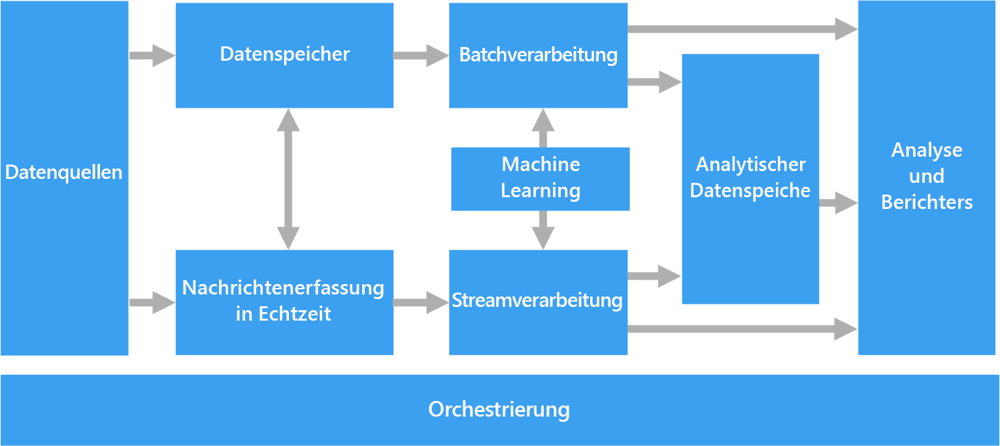
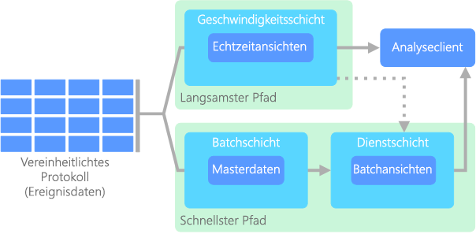
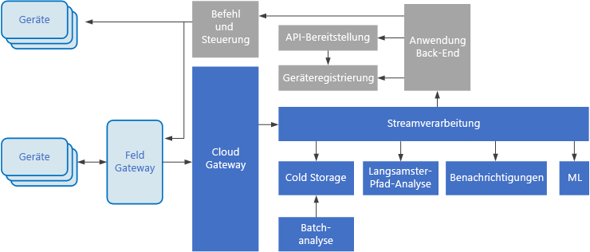

# Big Data-Architekturen

Eine Big Data-Architektur ist für die Erfassung, Verarbeitung und Analyse von Daten konzipiert, die für herkömmliche Datenbanksysteme zu groß oder zu komplex sind. An welchem Punkt eine Organisation in den Big Data-Bereich übergeht, ist von den Kompetenzen der Benutzer sowie von deren Tools abhängig. Bei einigen ist es vielleicht bereits ab einer Datenmenge von mehreren hundert Gigabytes der Fall, bei anderen womöglich erst ab mehreren hundert Terabytes. Mit der Weiterentwicklung der Tools umfangreicher Datasets entwickelt sich auch die Bedeutung von Big Data weiter. Der Begriff bezieht sich zunehmend den Nutzen, den Sie durch erweiterte Analysen aus Ihren Daten ziehen können, und weniger auf die Größe der Daten, obwohl sie in diesen Fällen üblicherweise ziemlich groß ausfallen.

Die Datenlandschaft hat sich im Laufe der Jahre verändert. Dadurch haben sich auch die Möglichkeiten und Erwartungen im Zusammenhang mit der Datennutzung geändert. Speicherkosten sind erheblich gesunken, und es stehen immer mehr Möglichkeiten für die Datensammlung zur Verfügung. Einige Daten gehen mit hoher Geschwindigkeit ein und müssen kontinuierlich erfasst und beobachtet werden. Andere Daten gehen langsamer ein, dafür aber in sehr großen Blöcken – häufig in Form historischer Daten für mehrere Jahrzehnte. Möglicherweise stehen Sie vor einer Aufgabe, die eine erweiterte Analyse oder Machine Learning erfordert. Diese Herausforderungen lassen sich mit Big Data-Architekturen bewältigen.

Big Data-Lösungen umfassen üblicherweise mindestens einen der folgenden Workloadtypen:

* Batchverarbeitung von ruhenden Big Data-Quellen
* Echtzeitverarbeitung von Big Data während der Übertragung
* Interaktive Erkundung von Big Data.
* Predictive Analytics und Machine Learning

Big Data-Architekturen können in folgenden Szenarien in Betracht gezogen werden:

* Sie möchten Daten in Mengen speichern und verarbeiten, die für eine herkömmliche Datenbank zu groß sind.
* Sie möchten unstrukturierte Daten zum Zweck der Analyse und Berichterstellung transformieren.
* Sie möchten ungebundene Datenströme in Echtzeit oder mit geringer Latenz erfassen, verarbeiten und analysieren.

## Komponenten einer Big Data-Architektur

Das folgende Diagramm zeigt die möglichen logischen Komponenten einer Big Data-Architektur. Individuelle Lösungen müssen nicht alle Elemente aus diesem Diagramm enthalten.

 

Die meisten Big Data-Architekturen enthalten einige oder alle der folgenden Komponenten:

* **Datenquellen:** Alle Big Data-Lösungen beginnen mit mindestens einer Datenquelle. Beispiele:

    * Anwendungsdatenspeicher wie z.B. relationale Datenbanken
    * Von Anwendungen erzeugte statische Dateien, z.B. Webserver-Protokolldateien
    * Echtzeitdatenquellen wie z.B. IoT-Geräte

* **Datenspeicher:** Daten für die Batchverarbeitung werden in der Regel in einem verteilten Dateispeicher gespeichert, der große Mengen an umfangreichen Dateien in verschiedenen Formaten aufnehmen kann. Diese Art Speicher wird häufig als *Data Lake* bezeichnet. Ein solcher Speicher lässt sich beispielsweise über Azure Data Lake Store oder Blobcontainer in Azure Storage implementieren.

* **Batchverarbeitung:** Da die Datasets so umfangreich sind, muss eine Big Data-Lösung Datendateien mithilfe von Batchaufträgen mit langer Ausführungszeit verarbeiten, um die Daten zu filtern, zu aggregieren und anderweitig auf die Analyse vorzubereiten. Diese Aufträge beinhalten in der Regel das Lesen von Quelldateien, ihre Verarbeitung und das Schreiben der Ausgabe in neue Dateien. Zu den Optionen gehört z.B. Folgendes: die Ausführung von U-SQL-Aufträgen in Azure Data Lake Analytics, die Verwendung von Hive-, Pig- oder benutzerdefinierten MapReduce-Aufträgen in einem HDInsight Hadoop-Cluster oder die Verwendung von Java-, Scala- oder Python-Programmen in einem HDInsight Spark-Cluster.

* **Echtzeiterfassung von Nachrichten:** Wenn die Lösung Echtzeitquellen umfasst, muss die Architektur eine Möglichkeit bieten, Echtzeitnachrichten für die Verarbeitung des Datenstroms zu erfassen und zu speichern. Hierbei kann es sich um einen einfachen Datenspeicher handeln, in dem eingehende Nachrichten zur Verarbeitung in einem Ordner abgelegt werden. Viele Lösungen benötigen jedoch einen Speicher für die Erfassung von Nachrichten, der als Puffer für Nachrichten fungiert. Der Speicher muss zudem die Verarbeitung der horizontalen Skalierung, eine zuverlässige Übermittlung sowie weitere Semantik für das Nachrichtenqueuing unterstützen. Dieser Teil einer Streamingarchitektur wird häufig als Streampufferung bezeichnet. Zu den Optionen gehören Azure Event Hubs, Azure IoT Hub und Kafka.

* **Streamverarbeitung:** Die erfassten Echtzeitnachrichten müssen von der Lösung verarbeitet werden, indem die Daten gefiltert, aggregiert und anderweitig auf die Analyse vorbereitet werden. Die verarbeiteten Daten aus dem Datenstrom werden dann in eine Ausgabesenke geschrieben. Azure Stream Analytics stellt einen verwalteten Dienst für die Datenstromverarbeitung bereit, basierend auf kontinuierlich ausgeführten SQ-Abfragen, die in ungebundenen Datenströmen arbeiten. Sie können auch Open Source-Apache-Streamingtechnologien wie Storm und Spark Streaming in einem HDInsight-Cluster verwenden.

* **Analysedatenspeicher:** Viele Big Data-Lösungen bereiten Daten für die Analyse vor und stellen die verarbeiteten Daten dann in einem strukturierten Format bereit, das mithilfe von Analysetools abgefragt werden kann. Der Analysedatenspeicher, in dem diese Abfragen ausgeführt werden, kann ein relationales Data Warehouse im Kimball-Stil sein, wie es in den meisten herkömmlichen BI-Lösungen (Business Intelligence) zu finden ist. Alternativ dazu können die Daten auch über eine NoSQL-Technologie mit niedriger Latenz bereitgestellt werden, wie z.B. HBase. Eine weitere Möglichkeit ist eine interaktive Hive-Datenbank, die eine Metadatenabstraktion der Datendateien in einem verteilten Datenspeicher bereitstellt. Azure SQL Data Warehouse bietet einen verwalteten Dienst für umfangreiches cloudbasiertes Data Warehousing. HDInsight unterstützt Interactive Hive, HBase und Spark SQL – diese Module können auch zum Bereitstellen von Daten für die Analyse verwendet werden.

* **Analysen und Berichte:** Ziel der meisten Big Data-Lösungen ist es, über Analysen und Berichte Einblicke in die Daten zu bieten. Um Benutzer die Datenanalyse zu ermöglichen, kann die Architektur eine Datenmodellierungsschicht umfassen, wie z.B. einen multidimensionalen OLAP-Cube oder ein Tabellendatenmodell in Azure Analysis Services. Sie kann auch Self-Service-BI unterstützen – hierbei kommen die Modellierungs- und Visualisierungstechnologien von Microsoft Power BI oder Microsoft Excel zum Einsatz. Analysen und Berichterstellung können auch in Form einer interaktiven Datenerkundung durch Data Scientists oder Data Analysts erfolgen. Für diese Szenarios unterstützen viele Azure-Dienste Analysenotebooks, z.B. Jupyter, sodass diese Benutzer ihre vorhandenen Kenntnisse von Python oder R nutzen können. Zum Erkunden sehr umfangreicher Daten können Sie Microsoft R Server als eigenständige Lösung oder zusammen mit Spark verwenden.

* **Orchestrierung:** Die meisten Big Data-Lösungen bestehen aus wiederholten Datenverarbeitungsvorgängen, die in Workflows gekapselt sind. Diese Vorgänge transformieren Quelldaten, verschieben Daten zwischen mehreren Quellen und Senken, laden die verarbeiteten Daten in einen Analysedatenspeicher oder übermitteln die Ergebnisse direkt in einen Bericht oder an ein Dashboard. Um diese Workflows zu automatisieren, können Sie eine Orchestrierungstechnologie wie such Azure Data Factory oder Apache Oozie und Sqoop verwenden.

## Data Lake

Wenn Sie sich schon einmal mit Big Data beschäftigt haben, ist Ihnen wahrscheinlich auch der Begriff _Data Lake_ begegnet. Der Begriff kam möglicherweise als Produktname vor oder wurde vielleicht als Speicherkonzept für große Datenmengen verwendet. 

Ein Data Lake umfasst sowohl Speicherung als auch Verarbeitung. Mit dem Konzept des Data Lake-Speichers werden mehrere Ziele verfolgt: Fehlertoleranz, unbegrenzte Skalierbarkeit sowie Erfassung verschiedenster Daten mit hohem Durchsatz. Die Data Lake-Verarbeitung basiert auf mindestens einem auf diese Ziele ausgerichteten Verarbeitungsmodul und ermöglicht die skalierte Verarbeitung der Daten aus einem Data Lake.

Data Lake-Speicher werden häufig zum Streamen von Veranstaltungen oder für IoT-Szenarien verwendet, da sie große Mengen von relationalen und nicht relationalen Daten ohne Transformation oder Schemadefinition aufnehmen können. Sie sind auf eine große Anzahl kleiner Schreibvorgänge mit geringer Wartezeit ausgelegt und für enormen Durchsatz optimiert.

Ein weiterer Begriff, der häufig in Datenszenarien verwendet wird, ist _Data Mart_. Bei einem Data Mart handelt es sich in der Regel um einen Datenspeicher, der zur einfachen Nutzung bereinigt, gepackt und strukturiert wurde. Im Gegensatz zu einem Data Mart ist ein Data Lake für die Erfassung von Rohdaten konzipiert, wodurch die Daten in ihrer ursprünglichen oder geringstmöglich verarbeiteten Form vorliegen, um verschiedene Fragen zu verschiedenen Zeiten zu ermöglichen. Wenn die Daten wie in einem Data Mart bereinigt und auf bestimmte Weise strukturiert werden, ist es schwer, bei neuen Fragen oder Tools eine entsprechende Anpassung an die Art der Verarbeitung oder Analyse vorzunehmen. Aus diesem Grund sind Speicherung und Verarbeitung in einem Data Lake als separate Entitäten enthalten.

In Frage kommender Azure-Dienst:
- [Azure Data Lake](https://azure.microsoft.com/scenarios/data-lake/)

## Lambda-Architektur

Bei sehr großen Datasets kann die Ausführung der von Clients benötigten Abfragen sehr lange dauern. Diese Abfragen können nicht in Echtzeit durchgeführt werden und erfordern häufig Algorithmen wie [MapReduce](https://en.wikipedia.org/wiki/MapReduce), die parallel für das gesamte Dataset ausgeführt werden. Die Ergebnisse werden dann getrennt von den Rohdaten gespeichert und für Abfragen verwendet.

Ein Nachteil dieses Ansatzes ist die damit verbundene Wartezeit: Wenn die Verarbeitung einige Stunden dauert, gibt eine Abfrage unter Umständen Ergebnisse zurück, die bereits mehrere Stunden alt sind. Im Idealfall möchten Sie einige Ergebnisse in Echtzeit erhalten (ggf. auf Kosten der Genauigkeit) und sie mit den Ergebnissen aus der Batchanalyse kombinieren.

Die **Lambda-Architektur** wurde erstmals von Nathan Marz vorgeschlagen und löst dieses Problem durch die Erstellung zweier Datenflusspfade. Alle beim System eingehenden Daten durchlaufen die beiden folgenden Pfade:

* Eine **Batchebene** (Pfad für kalte Daten) speichert alle eingehenden Daten als Rohdaten und führt eine Batchverarbeitung der Daten durch. Das Ergebnis dieser Verarbeitung wird als **Batchansicht** gespeichert.

* Eine **Geschwindigkeitsebene** (Pfad für heiße Daten) analysiert Daten in Echtzeit. Die geringe Wartezeit dieser Ebene geht zulasten der Genauigkeit.

Die Daten der Batchebene werden einer **Bereitstellungsebene** zugeführt, die die Batchansicht indiziert, um effiziente Abfragen zu ermöglichen. Die Geschwindigkeitsebene aktualisiert die Bereitstellungsebene nach und nach mit den neuesten Daten.

Daten, die den Pfad für heiße Daten durchlaufen, werden durch Wartezeitanforderungen der Geschwindigkeitsebene eingeschränkt, um eine schnellstmögliche Verarbeitung zu ermöglichen. Hierbei müssen häufig gewisse Abstriche bei der Genauigkeit gemacht werden, um eine möglichst schnelle Verfügbarkeit der Daten zu erreichen. Stellen Sie sich beispielsweise ein IoT-Szenario vor, in dem Telemetriedaten von einer großen Anzahl von Temperatursensoren übermittelt werden. Die Geschwindigkeitsebene kann zur Verarbeitung eines gleitenden Zeitfensters der eingehenden Daten verwendet werden. 

Daten, die den Pfad für kalte Daten durchlaufen, sind dagegen nicht den gleichen Anforderungen für kurze Wartezeiten unterworfen. Dies ermöglicht äußerst zeitaufwendige Berechnungen mit hoher Genauigkeit für umfangreiche Datasets. 

Die Pfade für heiße und kalte Daten werden schließlich in der Analyseclientanwendung zusammengeführt. Wenn der Client zeitnahe, aber unter Umständen ungenauere Daten in Echtzeit anzeigen muss, wird das Ergebnis aus dem Pfad für heiße Daten abgerufen. Andernfalls werden die Ergebnisse aus dem Pfad für kalte Daten verwendet, um weniger aktuelle, dafür aber genauere Daten anzuzeigen. Mit anderen Worten: Der Pfad für heiße Daten liefert Daten für ein relativ kleines Zeitfenster, nach dem die Ergebnisse mit möglichst genauen Daten aus dem Pfad für kalte Daten aktualisiert werden können.

Die auf der Batchebene gespeicherten Rohdaten sind unveränderlich. Eingehende Daten werden immer am Ende der bereits vorhandene Daten hinzugefügt, und die vorherigen Daten werden niemals überschrieben. Änderungen am Wert eines bestimmten Bezugs werden als neuer Ereignisdatensatz mit Zeitstempel gespeichert. Dies ermöglicht die Neuberechnung zu einem beliebigen Zeitpunkt innerhalb des Verlaufs der gesammelten Daten. Die Möglichkeit zur Neuberechnung der Batchansicht auf der Grundlage der ursprünglichen Rohdaten ist wichtig, da es die Erstellung neuer Ansichten ermöglicht, wenn sich das System weiterentwickelt. 

## Kappa-Architektur

Ein Nachteil der Lambda-Architektur ist ihre Komplexität. Die Verarbeitungslogik kommt an zwei verschiedenen Stellen zur Anwendung (am Pfad für kalte Daten und am Pfad für heiße Daten) und verwendet unterschiedliche Frameworks. Dies hat eine Duplizierung der Berechnungslogik sowie eine komplexe Verwaltung der Architektur für beide Pfade zur Folge.

Die **Kappa-Architektur** wurde von Jay Kreps als Alternative zur Lambda-Architektur vorgeschlagen. Sie verfolgt im Grunde die gleichen Ziele wie die Lambda-Architektur – mit einem wichtigen Unterschied: Alle Daten durchlaufen einen einzelnen Pfad mit einem Datenstrom-Verarbeitungssystem. 

Es gibt gewisse Ähnlichkeiten mit der Batchebene der Lambda-Architektur. So sind auch hier die Ereignisdaten unveränderlich, und es wird nicht nur eine Teilmenge erfasst, sondern alles. Die Daten werden als Ereignisdatenstrom in einem verteilten und fehlertoleranten einheitlichen Protokoll erfasst. Diese Ereignisse sind sortiert, und der aktuelle Zustand eines Ereignisses wird nur durch Anfügen eines neuen Ereignisses geändert. Ähnlich wie bei der Geschwindigkeitsebene der Lambda-Architektur basiert die gesamte Ereignisverarbeitung auf dem Eingabedatenstrom und wird als Echtzeitansicht gespeichert. 

Wenn Sie das gesamte Dataset neu berechnen müssen (analog zur Funktion der Batchebene der Lambda-Architektur), können Sie den Stream einfach erneut wiedergeben – üblicherweise unter Verwendung von Parallelität, damit die Berechnung zeitnah abgeschlossen werden kann.

## Internet der Dinge (IoT, Internet of Things)

In der Praxis steht „Internet der Dinge“ für jedes Gerät, das mit dem Internet verbunden ist. Dazu zählen PCs, Smartphones, Smartwatches, intelligente Thermostate, intelligente Kühlschränke, vernetzte Autos, Implantate zur Herzüberwachung sowie sämtliche andere Komponenten, die mit dem Internet verbunden sind und Daten senden oder empfangen. Täglich kommen neue verbundene Geräte hinzu, und auch die Datenmenge, die von diesen Geräten erfasst wird, nimmt kontinuierlich zu. Diese Daten werden häufig in eng abgegrenzten Umgebungen erfasst, die teilweise eine hohe Wartezeit aufweisen. In anderen Fällen werden Daten aus Umgebungen mit geringer Wartezeit von tausenden oder Millionen von Geräten gesendet, was eine schnelle Datenerfassung und -verarbeitung erfordert. Zur Bewältigung dieser Einschränkungen und individuellen Anforderungen bedarf es daher einer sorgfältigen Planung.

Ereignisgesteuerte Architekturen sind von zentraler Bedeutung für IoT-Lösungen. Das folgende Diagramm zeigt eine mögliche logische Architektur für IoT. Das Diagramm veranschaulicht die Komponenten der Architektur, die Ereignisströme verarbeiten.

Das **Cloudgateway** erfasst Geräteereignisse an der Cloudgrenze mithilfe eines zuverlässigen Messagingsystems mit niedriger Latenz.

Geräte können Ereignisse direkt an das Cloudgateway oder über ein **Bereichsgateway**. Ein Bereichsgateway ist ein spezialisiertes Gerät oder Softwareprogramm, das sich üblicherweise am gleichen Ort befindet wie die Geräte. Es empfängt Ereignisse und leitet sie an das Cloudgateway weiter. Das Bereichsgateway kann auch Vorverarbeitungsfunktionen für die Geräteereignisse ausführen, z.B. Filtern, Aggregation oder Protokolltransformation.

Nach dem Erfassen durchlaufen Ereignisse einen oder mehrere **Datenstromprozessoren**, die die Daten weiterleiten (z.B. zum Speicher) oder Analyse- oder andere Verarbeitungsfunktionen ausführen.

Nachfolgend finden Sie einige häufige Verarbeitungsarten. (Diese Liste ist sicherlich nicht vollständig.)

- Schreiben von Ereignisdaten in einen Cold Storage zur Archivierung oder Batchanalyse.

- Analyse des langsamsten Pfads – der Ereignisstrom wird (nahezu) in Echtzeit analysiert, um Anomalien zu erkennen, Muster in rollierenden Zeitfenstern zu ermitteln oder Warnungen auszulösen, wenn eine bestimmte Bedingung im Ereignisstrom auftritt. 

- Verarbeitung bestimmter Arten nicht telemetriebezogener Nachrichten von Geräten (etwa Benachrichtigungen und Warnungen). 

- Machine Learning.

Die grauen Felder stehen für Komponenten eines IoT-Systems, die nicht in direktem Zusammenhang mit der Ereignisstromverarbeitung stehen, sondern der Vollständigkeit halber hier mit aufgeführt werden.

- Die **Geräteregistrierung** ist eine Datenbank der bereitgestellten Geräte und enthält die Geräte-IDs sowie üblicherweise einige Metadaten zu den Geräten, beispielsweise den Standort.

- Die **Bereitstellungs-API** ist eine allgemeine externe Schnittstelle für die Bereitstellung und Registrierung neuer Geräte.

- In einigen IoT-Lösungen können **Nachrichten mit Befehlen und Steuerungsinformationen** an die Geräte gesendet werden.

In Frage kommender Azure-Dienst:

- [Azure IoT Hub](https://azure.microsoft.com/services/iot-hub/)
- [Azure Event Hubs](https://azure.microsoft.com/services/event-hubs/)
- [Azure Stream Analytics](https://azure.microsoft.com/services/stream-analytics/)  

Weitere Informationen zu IoT in Azure finden Sie in der [Azure IoT-Referenzarchitektur](https://azure.microsoft.com/updates/microsoft-azure-iot-reference-architecture-available/).

