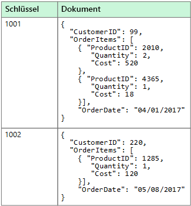

# Nicht relationale Daten und NoSQLNon-relational data and NoSQL

Eine *nicht relationale Datenbank* ist eine Datenbank, die nicht das tabellarische Schema mit Zeilen und Spalten verwendet, das in den meisten herkömmlichen Datenbanksystemen zum Einsatz kommt.A *non-relational database* is a database that does not use the tabular schema of rows and columns found in most traditional database systems. Nicht relationale Daten verwenden stattdessen ein Speichermodell, das für die spezifischen Anforderungen des gespeicherten Datentyps optimiert ist.Instead, non-relational databases use a storage model that is optimized for the specific requirements of the type of data being stored. So können die Daten beispielsweise als einfache Schlüssel-Wert-Paare, als JSON-Dokumente oder als Diagramm mit Edges und Scheitelpunkten gespeichert werden.For example, data may be stored as simple key/value pairs, as JSON documents, or as a graph consisting of edges and vertices. 

Diese Datenspeicher haben alle eins gemeinsam: Sie verwenden kein [relationales Modell](./relational-data.md).What all of these data stores have in common is that they don't use a [relational model](./relational-data.md). Darüber hinaus sind sie für gewöhnlich spezifischer, was die Art der unterstützten Daten und die Vorgehensweise zum Abfragen von Daten angeht.Also, they tend to be more specific in the type of data they support and how data can be queried. So sind Zeitreihen-Datenspeicher beispielsweise für Abfragen über zeitbasierte Sequenzen von Daten optimiert, während Diagrammdatenspeicher für die Untersuchung gewichteter Beziehungen zwischen Entitäten optimiert sind.For example, time series data stores are optimized for queries over time-based sequences of data, while graph data stores are optimized for exploring weighted relationships between entities. Beide Formate eignen sich nicht sonderlich gut für die allgemeine Verwaltung von Transaktionsdaten.Neither format would generalize well to the task of managing transactional data. 

Der Begriff *NoSQL* bezieht sich auf Datenspeicher, die anstelle von SQL andere Programmiersprachen und Konstrukte für Datenabfragen verwenden.The term *NoSQL* refers to data stores that do not use SQL for queries, and instead use other programming languages and constructs to query the data. In der Praxis bedeutet „NoSQL“ so viel wie „nicht relationale Datenbank“, auch wenn viele dieser Datenbanken SQL-kompatible Abfragen unterstützen.In practice, "NoSQL" means "non-relational database," even though many of these databases do support SQL-compatible queries. Die zugrunde liegende Abfrageausführungsstrategie unterscheidet sich jedoch in der Regel deutlich von der Ausführung der gleichen SQL-Abfrage durch ein herkömmliches RDBMS.However, the underlying query execution strategy is usually very different from the way a traditional RDBMS would execute the same SQL query.

In den folgenden Abschnitten werden die Hauptkategorien einer nicht relationalen Datenbank bzw. einer NoSQL-Datenbank beschrieben.The following sections describe the major categories of non-relational or NoSQL database.

## DokumentdatenspeicherDocument data stores
Ein Dokumentdatenspeicher verwaltet einen Satz von benannten Zeichenfolgenfeldern und Objektdatenwerten in einer als *Dokument* bezeichneten Entität.A document data store manages a set of named string fields and object data values in an entity referred to as a *document*. In diesen Datenspeichern werden Daten üblicherweise als JSON-Dokumente gespeichert.These data stores typically store data in the form of JSON documents. Jeder Feldwert kann ein Skalarelement (beispielsweise eine Zahl) oder ein Verbundelement (beispielsweise eine Liste oder eine hierarchische Sammlung) sein.Each field value could be a scalar item, such as a number, or a compound element, such as a list or a parent-child collection. Die Daten in den Feldern eines Dokuments können auf verschiedene Arten (beispielsweise im XML-, YAML-, JSON- oder BSON-Format) codiert oder als einfacher Text gespeichert werden.The data in the fields of a document can be encoded in a variety of ways, including XML, YAML, JSON, BSON, or even stored as plain text. Die Felder in Dokumenten werden für das Speicherverwaltungssystem verfügbar gemacht, sodass eine Anwendung Daten abfragen und filtern kann, indem sie die Werte in diesen Feldern verwendet.The fields within documents are exposed to the storage management system, enabling an application to query and filter data by using the values in these fields.  

Üblicherweise enthält ein Dokument die gesamten Daten einer Entität.Typically, a document contains the entire data for an entity. Die Elemente, aus denen sich eine Entität zusammensetzt, sind anwendungsspezifisch.What items constitute an entity are application specific. Eine Entität kann beispielsweise die Details eines Kunden, eines Auftrags oder einer Kombination aus beidem enthalten.For example, an entity could contain the details of a customer, an order, or a combination of both. Ein einzelnes Dokument kann Informationen enthalten, die bei einem Managementsystem für relationale Datenbanken (Relational Database Management System, RDBMS) auf mehrere relationale Tabellen verteilt wären.A single document might contain information that would be spread across several relational tables in a relational database management system (RDBMS). Ein Dokumentspeicher setzt nicht voraus, dass alle Dokumente die gleiche Struktur haben.A document store does not require that all documents have the same structure. Dieser Konzept der freien Form bietet ein hohes Maß an Flexibilität.This free-form approach provides a great deal of flexibility. Anwendungen können beispielsweise verschiedene Daten in Dokumenten speichern, um auf veränderte Geschäftsanforderungen zu reagieren.For example, applications can store different data in documents in response to a change in business requirements.  

  

Mithilfe des Dokumentschlüssels kann die Anwendung Dokumente abrufen.The application can retrieve documents by using the document key. Dieser Schlüssel ist ein eindeutiger Bezeichner des Dokuments, der häufig einem Hashvorgang unterzogen wird, um eine gleichmäßige Verteilung der Daten zu ermöglichen.This is a unique identifier for the document, which is often hashed, to help distribute data evenly. Einige Dokumentdatenbanken erstellen den Dokumentschlüssel automatisch.Some document databases create the document key automatically. Andere ermöglichen Ihnen, ein Attribut des Dokuments anzugeben, das als Schlüssel verwendet werden soll.Others enable you to specify an attribute of the document to use as the key. Die Anwendung kann auch auf Basis des Werts eines oder mehrerer Felder Dokumente abfragen.The application can also query documents based on the value of one or more fields. Einige Dokumentdatenbanken unterstützen die Indizierung, um eine schnelle Suche nach Dokumenten zu ermöglichen, die auf einem oder mehreren indizierten Feldern basieren.Some document databases support indexing to facilitate fast lookup of documents based on one or more indexed fields.  

Viele Dokumentdatenbanken unterstützen direkte Aktualisierungen, sodass eine Anwendung die Werte bestimmter Felder in einem Dokument ändern kann, ohne das gesamte Dokument neu schreiben zu müssen.Many document databases support in-place updates, enabling an application to modify the values of specific fields in a document without rewriting the entire document. Lese- und Schreibvorgänge in mehreren Feldern eines Dokuments sind in der Regel atomisch.Read and write operations over multiple fields in a single document are usually atomic.

In Frage kommender Azure-Dienst:Relevant Azure service:  

- [Azure Cosmos DBAzure Cosmos DB](https://azure.microsoft.com/services/cosmos-db/)

## Spaltenbasierte DatenspeicherColumnar data stores
Bei einem spaltenbasierten Datenspeicher bzw. einem Spaltenfamilien-Datenspeicher werden Daten in Zeilen und Spalten organisiert.A columnar or column-family data store organizes data into columns and rows. In ihrer einfachsten Form kann ein Spaltenfamilien-Datenspeicher einer relationalen Datenbank sehr ähnlich sein (zumindest konzeptionell).In its simplest form, a column-family data store can appear very similar to a relational database, at least conceptually. Die eigentliche Stärke einer Spaltenfamilien-Datenbank liegt in ihrem denormalisierten Ansatz zur Strukturierung von Daten mit geringer Dichte, der auf den spaltenorientierten Datenspeicherungsansatz zurückgeht.The real power of a column-family database lies in its denormalized approach to structuring sparse data, which stems from the column-oriented approach to storing data.  

Einen Spaltenfamilien-Datenspeicher können Sie sich als eine Datenbank mit tabellarischen Daten in Zeilen und Spalten vorstellen, wobei die Spalten in Gruppen unterteilt sind, die als Spaltenfamilien bezeichnet werden.You can think of a column-family data store as holding tabular data with rows and columns, but the columns are divided into groups known as column families. Jede Spaltenfamilie enthält eine Reihe von Spalten, die logisch miteinander verknüpft sind und typischerweise als Einheit abgerufen oder bearbeitet werden.Each column family holds a set of columns that are logically related and are typically retrieved or manipulated as a unit. Andere Daten, auf die separat zugegriffen wird, können in separaten Spaltenfamilien gespeichert werden.Other data that is accessed separately can be stored in separate column families. Innerhalb einer Spaltenfamilie können neue Spalten dynamisch hinzugefügt werden, und Zeilen müssen nicht für jede Spalte einen Wert aufweisen.Within a column family, new columns can be added dynamically, and rows can be sparse (that is, a row doesn't need to have a value for every column). 

Das folgende Diagramm zeigt ein Beispiel mit zwei Spaltenfamilien, `Identity` und `Contact Info`.The following diagram shows an example with two column families, `Identity` and `Contact Info`. Die Daten für eine einzelne Entität haben in jeder Spaltenfamilie den gleichen Zeilenschlüssel.The data for a single entity has the same row key in each column family. Diese Struktur, bei der die Zeilen für ein beliebiges Objekt in einer Spaltenfamilie dynamisch variieren können, ist ein wichtiger Vorteil des Spaltenfamilienansatzes. Dadurch eignet sich diese Form der Datenspeicherung hervorragend für die Speicherung strukturierter Daten mit variierenden Schemas.This structure, where the rows for any given object in a column family can vary dynamically, is an important benefit of the column-family approach, making this form of data store highly suited for storing data with varying schemas.

Im Gegensatz zu einem Schlüssel-Wert-Speicher oder einer Dokumentendatenbank speichern die meisten Spaltenfamilien-Datenbanken Daten physisch in Schlüsselreihenfolge und nicht durch die Berechnung eines Hashwerts.Unlike a key/value store or a document database, most column-family databases physically store data in key order, rather than by computing a hash. Der Zeilenschlüssel wird als primärer Index betrachtet und ermöglicht den schlüsselbasierten Zugriff über einen bestimmten Schlüssel oder einen Schlüsselbereich.The row key is considered the primary index and enables key-based access via a specific key or a range of keys. Bei einigen Implementierungen können Sie sekundäre Indizes für bestimmte Spalten einer Spaltenfamilie erstellen.Some implementations allow you to create secondary indexes over specific columns in a column family. Mit sekundären Indizes können Daten nach Spaltenwert (anstatt nach Zeilenschlüssel) abgerufen werden.Secondary indexes let you retrieve data by columns value, rather than row key.

Auf dem Datenträger werden alle Spalten innerhalb einer Spaltenfamilie gemeinsam in der gleichen Datei gespeichert – mit einer bestimmten Anzahl von Zeilen pro Datei.On disk, all of the columns within a column family are stored together in the same file, with a certain number of rows in each file. Bei umfangreichen Datasets bietet dieser Ansatz einen Leistungsvorteil, da er die Datenmenge verringert, die vom Datenträger gelesen werden muss, wenn nur einige wenige Spalten abgefragt werden.With large data sets, this approach creates a performance benefit by reducing the amount of data that needs to be read from disk when only a few columns are queried together at a time. 

Lese- und Schreibvorgänge für eine Zeile sind innerhalb einer einzelnen Spaltenfamilie in der Regel atomisch. Einige Implementierungen bieten jedoch Atomarität für die gesamte Zeile und beziehen mehrere Spaltenfamilien mit ein.Read and write operations for a row are usually atomic within a single column family, although some implementations provide atomicity across the entire row, spanning multiple column families.

In Frage kommender Azure-Dienst:Relevant Azure service:  

- [HBase in HDInsightHBase in HDInsight](/azure/hdinsight/hdinsight-hbase-overview)

## Schlüssel-Wert-DatenspeicherKey/value data stores
Ein Schlüssel-Wert-Speicher ist im Wesentlichen eine große Hashtabelle.A key/value store is essentially a large hash table. Sie ordnen jedem Datenwert einen eindeutigen Schlüssel zu. Der Schlüssel-Wert-Speicher verwendet diesen Schlüssel, um die Daten mithilfe einer entsprechenden Hashfunktion zu speichern.You associate each data value with a unique key, and the key/value store uses this key to store the data by using an appropriate hashing function. Die Hashfunktion wird gewählt, um eine gleichmäßige Verteilung der Hash-Schlüssel auf den Datenspeicher zu gewährleisten.The hashing function is selected to provide an even distribution of hashed keys across the data storage.

Die meisten Schlüssel-Wert-Speicher unterstützen nur einfache Abfrage-, Einfüge- und Löschvorgänge.Most key/value stores only support simple query, insert, and delete operations. Um einen Wert (teilweise oder vollständig) zu modifizieren, muss eine Anwendung die vorhandenen Daten für den gesamten Wert überschreiben.To modify a value (either partially or completely), an application must overwrite the existing data for the entire value. Bei den meisten Implementierungen ist das Lesen oder Schreiben eines einzelnen Werts ein atomischer Vorgang.In most implementations, reading or writing a single value is an atomic operation. Wenn der Wert groß ist, kann das Schreiben einige Zeit in Anspruch nehmen.If the value is large, writing may take some time.

Eine Anwendung kann beliebige Daten als eine Menge von Werten speichern, obwohl bei einigen Schlüssel-Wert-Speichern die maximale Größe der Werte begrenzt ist.An application can store arbitrary data as a set of values, although some key/value stores impose limits on the maximum size of values. Die gespeicherten Werte sind für die Speichersystemsoftware nicht transparent.The stored values are opaque to the storage system software. Die Anwendung muss alle Schemainformationen bereitstellen und interpretieren.Any schema information must be provided and interpreted by the application. Im Wesentlichen handelt es sich bei Werten um Blobs, und der Schlüssel-Wert-Speicher ruft den Wert einfach ab oder speichert ihn nach Schlüssel.Essentially, values are blobs and the key/value store simply retrieves or stores the value by key.

Schlüssel-Wert-Speicher sind stark für Anwendungen optimiert, die einfache Nachschlagevorgänge auf der Grundlage des Schlüsselwerts oder eines Schlüsselbereichs durchführen. Sie eignen sich jedoch weniger für Systeme, die Daten in verschiedenen Schlüssel-Wert-Tabellen abfragen müssen, wie es etwa bei tabellenübergreifenden Datenverknüpfungen der Fall ist.Key/value stores are highly optimized for applications performing simple lookups using the value of the key, or by a range of keys, but are less suitable for systems that need to query data across different tables of keys/values, such as joining data across multiple tables. 

Schlüssel-Wert-Speicher sind auch nicht für Szenarien optimiert, in denen die Abfrage oder Filterung auf der Grundlage schlüsselfremder Werte wichtig ist (im Gegensatz zu rein schlüsselbasierten Nachschlagevorgängen).Key/value stores are also not optimized for scenarios where querying or filtering by non-key values is important, rather than performing lookups based only on keys. Bei einer relationalen Datenbank können Sie beispielsweise nach einem Datensatz suchen, indem Sie die schlüsselfremden Spalten mithilfe einer WHERE-Klausel filtern. Bei Schlüssel-Wert-Speichern steht dagegen in der Regel keine solche Nachschlagefunktion für Werte zur Verfügung, oder sie erfordert eine langsame Überprüfung sämtlicher Werte.For example, with a relational database, you can find a record by using a WHERE clause to filter the non-key columns, but key/values stores usually do not have this type of lookup capability for values, or if they do it requires a slow scan of all values.

Ein einziger Schlüssel-Wert-Speicher kann überaus skalierbar sein, da der Datenspeicher Daten problemlos auf mehrere Knoten auf getrennten Computern verteilen kann.A single key/value store can be extremely scalable, as the data store can easily distribute data across multiple nodes on separate machines.

In Frage kommender Azure-Dienst:Relevant Azure services:  
- [Azure Cosmos DB-Tabellen-APIAzure Cosmos DB Table API](/azure/cosmos-db/table-introduction)  
- [Azure Redis CacheAzure Redis Cache](https://azure.microsoft.com/services/cache/)  
- [Azure Table StorageAzure Table Storage](https://azure.microsoft.com/services/storage/tables/)

## DiagrammdatenspeicherGraph data stores
In einem Diagrammdatenspeicher werden zwei Arten von Informationen gespeichert: Knoten und Edges.A graph data store manages two types of information, nodes and edges. Knoten stellen Entitäten dar, Edges geben die Beziehungen zwischen diesen Entitäten an.Nodes represent entities, and edges specify the relationships between these entities. Sowohl Knoten als auch Edges können Eigenschaften haben, die ähnlich wie Spalten in einer Tabelle Informationen zum Knoten oder Edge liefern.Both nodes and edges can have properties that provide information about that node or edge, similar to columns in a table. Edges können auch eine Richtung haben, die die Art der Beziehung angibt.Edges can also have a direction indicating the nature of the relationship.  

Mit einem Diagrammdatenspeicher kann eine Anwendung effiziente Abfragen durchführen, die das Netzwerk von Knoten und Edges durchqueren, sowie die Beziehungen zwischen Entitäten analysieren.The purpose of a graph data store is to allow an application to efficiently perform queries that traverse the network of nodes and edges, and to analyze the relationships between entities. Das folgende Diagramm zeigt die Personaldaten einer Organisation in grafischer Form.The following diagram shows an organization's personnel data structured as a graph. Die Entitäten sind Mitarbeiter und Abteilungen, und die Edges zeigen die Hierarchiebeziehungen und Abteilung der Mitarbeiter.The entities are employees and departments, and the edges indicate reporting relationships and the department in which employees work. In diesem Diagramm zeigen die Pfeile an den Edges die Richtung der Beziehungen an.In this graph, the arrows on the edges show the direction of the relationships.

Diese Struktur macht es einfach, Abfragen wie „Alle Mitarbeiter finden, die Sarah direkt oder indirekt unterstellt sind“ oder „Wer arbeitet in derselben Abteilung wie John?“ auszuführen.This structure makes it straightforward to perform queries such as "Find all employees who report directly or indirectly to Sarah" or "Who works in the same department as John?" Bei großen Diagrammen mit vielen Entitäten und Beziehungen können Sie sehr komplexe Analysen sehr schnell durchführen.For large graphs with lots of entities and relationships, you can perform very complex analyses very quickly. Viele Diagrammdatenbanken bieten eine Abfragesprache, mit der Sie ein Beziehungsnetz effizient durchlaufen können.Many graph databases provide a query language that you can use to traverse a network of relationships efficiently.  

In Frage kommender Azure-Dienst:Relevant Azure service:  
- [Graph-API für Azure Cosmos DBAzure Cosmos DB Graph API](/azure/cosmos-db/graph-introduction)  

## Zeitreihen-DatenspeicherTime series data stores
Bei Zeitreihendaten handelt es sich um eine Gruppe von nach Zeit organisierten Werten. Ein Zeitreihen-Datenspeicher ist für diese Art von Daten optimiert.Time series data is a set of values organized by time, and a time series data store is optimized for this type of data. Zeitreihen-Datenspeicher müssen eine sehr hohe Anzahl von Schreibvorgängen unterstützen, da sie typischerweise große Datenmengen in Echtzeit aus einer großen Anzahl von Quellen sammeln.Time series data stores must support a very high number of writes, as they typically collect large amounts of data in real time from a large number of sources. Zeitreihen-Datenspeicher sind für die Speicherung von Telemetriedaten optimiert.Time series data stores are optimized for storing telemetry data. Einsatzszenarien sind z.B. IoT-Sensoren oder Anwendungs- und Systemleistungsindikatoren.Scenarios include IoT sensors or application/system counters. Aktualisierungen sind selten, und Löschvorgänge erfolgen oft als Massenvorgänge.Updates are rare, and deletes are often done as bulk operations.

Die Datensätze, die in eine Zeitreihen-Datenbank geschrieben werden, sind zwar in der Regel klein, ihre Anzahl ist jedoch häufig groß, sodass die Gesamtdatenmenge schnell zunehmen kann.Although the records written to a time series database are generally small, there are often a large number of records, and total data size can grow rapidly. Zeitreihen-Datenspeicher kümmern sich auch um Daten, die in falscher Reihenfolge oder verspätet eintreffen, sowie um die automatische Indizierung von Datenpunkten und um Optimierungen für Zeitfensterabfragen.Time series data stores also handle out-of-order and late-arriving data, automatic indexing of data points, and optimizations for queries described in terms of windows of time. Das letztgenannte Feature ermöglicht die schnelle Ausführung von Abfragen für Millionen von Datenpunkten und mehrere Datenströme zur Unterstützung von Zeitreihenvisualisierungen (eine verbreitete Nutzung von Zeitreihendaten).This last feature enables queries to run across millions of data points and multiple data streams quickly, in order to support time series visualizations, which is a common way that time series data is consumed. 

Weitere Informationen finden Sie unter [Time series solutions](../scenarios/time-series.md) (Zeitreihenlösungen)For more information, see [Time series solutions](../scenarios/time-series.md)

In Frage kommender Azure-Dienst:Relevant Azure service:  
- [Azure Time Series InsightsAzure Time Series Insights](https://azure.microsoft.com/services/time-series-insights/)  
- [OpenTSDB mit HBase in HDInsightOpenTSDB with HBase on HDInsight](/azure/hdinsight/hdinsight-hbase-overview)

## ObjektdatenspeicherObject data stores
Objektdatenspeicher sind für das Speichern und Abrufen großer binärer Objekte oder Blobs optimiert. Hierzu zählen beispielsweise Bilder, Textdateien, Video- und Audiostreams, große Anwendungsdatenobjekte und -dokumente sowie VM-Datenträgerimages.Object data stores are optimized for storing and retrieving large binary objects or blobs such as images, text files, video and audio streams, large application data objects and documents, and virtual machine disk images. Ein Objekt setzt sich aus den gespeicherten Daten, einigen Metadaten und einer eindeutigen ID für den Objektzugriff zusammen.An object consists of the stored data, some metadata, and a unique ID for accessing the object. Objektspeicher sind für die Unterstützung großer Einzeldateien konzipiert und bieten insgesamt viel Speicherplatz für die Verwaltung aller Dateien.Object stores are designed to support files that are individually very large, as well provide large amounts of total storage to manage all files.  

Einige Objektdatenspeicher replizieren ein Blob über mehrere Serverknoten hinweg und ermöglichen dadurch schnelle parallele Lesevorgänge.Some object data stores replicate a given blob across multiple server nodes, which enables fast parallel reads. Dies ermöglicht wiederum die horizontale Skalierung von Datenabfragen in großen Dateien, da mehrere Prozesse, die üblicherweise auf verschiedenen Servern ausgeführt werden, die große Datendatei parallel abfragen können.This in turn enables the scale-out querying of data contained in large files, because multiple processes, typically running on different servers, can each query the large data file simultaneously.

Ein Sonderfall des Objektdatenspeichers ist die Netzwerkdateifreigabe.One special case of object data stores is the network file share. Die Verwendung von Dateifreigaben ermöglicht den Zugriff auf Dateien in einem Netzwerk unter Verwendung standardmäßiger Netzwerkprotokolle wie SMB (Server Message Block).Using file shares enables files to be accessed across a network using standard networking protocols like server message block (SMB). Eine solche Freigabe von Daten bietet verteilten Diensten einen überaus skalierbaren Datenzugriff für grundlegende, allgemeine Vorgänge wie einfache Lese- und Schreibvorgänge (entsprechende Sicherheits- und Steuerungsmechanismen für den gleichzeitigen Zugriff vorausgesetzt).Given appropriate security and concurrent access control mechanisms, sharing data in this way can enable distributed services to provide highly scalable data access for basic, low level operations such as simple read and write requests.

In Frage kommender Azure-Dienst:Relevant Azure service:   

- [Azure Blob StorageAzure Blob Storage](https://azure.microsoft.com/services/storage/blobs/)  
- [Azure Data Lake StoreAzure Data Lake Store](https://azure.microsoft.com/services/data-lake-store/)  
- [Azure File StorageAzure File Storage](https://azure.microsoft.com/services/storage/files/)  

## Datenspeicher für externe IndizesExternal index data stores

Datenspeicher für externe Indizes ermöglichen die Suche nach Informationen in anderen Datenspeichern und Diensten.External index data stores provide the ability to search for information held in other data stores and services. Ein externer Index fungiert als sekundärer Index für einen beliebigen Datenspeicher und kann verwendet werden, um riesige Datenmengen zu indizieren und nahezu in Echtzeit auf diese Indizes zuzugreifen.An external index acts as a secondary index for any data store, and can be used to index massive volumes of data and provide near real-time access to these indexes. 

Ein Beispiel: Angenommen, Sie haben Textdateien in einem Dateisystem gespeichert.For example, you might have text files stored in a file system. Anhand des Pfads kann eine Datei schnell gefunden werden. Bei einer inhaltsbasierten Suche müssen dagegen alle Dateien überprüft werden, was lange dauert.Finding a file by its file path is quick, but searching based on the contents of the file would require a scan of all of the files, which is slow. Ein externer Index ermöglicht die Erstellung sekundärer Suchindizes, mit deren Hilfe Sie schnell den Pfad der Dateien ermitteln können, die Ihren Kriterien entsprechen.An external index lets you create secondary search indexes and then quickly find the path to the files that match your criteria. Ein externer Index kann aber beispielsweise auch mit Schlüssel-Wert-Speichern verwendet werden, bei denen nur eine Indizierung nach Schlüssel erfolgt.Another example application of an external index is with key/value stores that only index by the key. Sie können einen sekundären Index auf der Grundlage der Werte in den Daten erstellen und schnell den Schlüssel ermitteln, der die übereinstimmenden Elemente jeweils eindeutig identifiziert.You can build a secondary index based on the values in the data, and quickly look up the key that uniquely identifies each matched item. 

Die Indizes werden im Rahmen eines Indizierungsprozesses erstellt.The indexes are created by running an indexing process. Dieser Prozess kann unter Verwendung eines vom Datenspeicher ausgelösten Pullmodells oder unter Verwendung eines durch Anwendungscode initiierten Pushmodells ausgeführt werden.This can be performed using a pull model, triggered by the data store, or using a push model, initiated by application code. Indizes können mehrdimensional sein und Freitextsuchen für große Mengen von Textdaten unterstützen.Indexes can be multidimensional and may support free-text searches across large volumes of text data. 

Datenspeicher für externe Indizes werden häufig zur Unterstützung von Volltextsuchen und webbasierten Suchen verwendet.External index data stores are often used to support full text and web based search. Die Suche kann in diesen Fällen exakt oder unscharf sein.In these cases, searching can be exact or fuzzy. Eine unscharfe Suche findet Dokumente, die mit einer Reihe von Begriffen übereinstimmen, und berechnet, wie genau diese übereinstimmen.A fuzzy search finds documents that match a set of terms and calculates how closely they match. Einige externe Indizes unterstützen auch linguistische Analysen, die Treffer auf der Grundlage von Synonymen, Gattungserweiterungen (etwa von „Hunde“ auf „Haustiere“) und Wortstammerkennung (Beispiel: Suche nach „laufen“ gibt auch „gelaufen“ und „laufend“ zurück) liefern können.Some external indexes also support linguistic analysis that can return matches based on synonyms, genre expansions (for example, matching "dogs" to "pets"), and stemming (for example, searching for "run" also matches "ran" and "running"). 

In Frage kommender Azure-Dienst:Relevant Azure service:  

- [Azure SearchAzure Search](https://azure.microsoft.com/services/search/)

## Typische VoraussetzungenTypical requirements
Nicht relationale Datenspeicher verwenden häufig eine andere Speicherarchitektur als relationale Datenbanken.Non-relational data stores often use a different storage architecture from that used by relational databases. Insbesondere verfügen sie häufig nicht über ein festes Schema.Specifically, they tend towards having no fixed schema. Darüber hinaus unterstützen sie häufig keine Transaktionen oder schränken den Umfang von Transaktionen ein, und bieten aus Gründen der Skalierbarkeit üblicherweise keine sekundären Indizes.Also, they tend not to support transactions, or else restrict the scope of transactions, and they generally don't include secondary indexes for scalability reasons.

Die folgende Tabelle enthält eine Übersicht über die Anforderungen für die einzelnen nicht relationalen Datenspeicher:The following compares the requirements for each of the non-relational data stores:

| AnforderungRequirement | DokumentdatenDocument data | SpaltenfamiliendatenColumn-family data | Schlüssel-Wert-DatenKey/value data | DiagrammdatenGraph data | 
| --- | --- | --- | --- | --- | 
| NormalisierungNormalization | DenormalisiertDenormalized | DenormalisiertDenormalized | DenormalisiertDenormalized | NormalisiertNormalized | 
| SchemaSchema | Schema beim LesenSchema on read | Spaltenfamilien definiert beim Schreiben, Spaltenschema beim LesenColumn families defined on write, column schema on read | Schema beim LesenSchema on read | Schema beim LesenSchema on read | 
| Konsistenz (für gleichzeitige Transaktionen)Consistency (across concurrent transactions) | Anpassbare Konsistenz, Garantien auf DokumentebeneTunable consistency, document-level guarantees | Garantien auf SpaltenfamilienebeneColumn-family&ndash;level guarantees | Garantien auf SchlüsselebeneKey-level guarantees | Garantien auf DiagrammebeneGraph-level guarantees 
| Atomarität (Transaktionsbereich)Atomicity (transaction scope) | SammlungCollection | TableTable | TableTable | GraphGraph | 
| SperrstrategieLocking Strategy | Optimistisch (keine Sperrung)Optimistic (lock free) | Pessimistisch (Sperrungen auf Zeilenebene)Pessimistic (row locks) | Optimistisch (ETag)Optimistic (ETag) | 
| ZugriffsmusterAccess pattern | Wahlfreier ZugriffRandom access | Aggregation für Daten (hoch/breit)Aggregates on tall/wide data | Wahlfreier ZugriffRandom access | Wahlfreier ZugriffRandom access |
| IndizierungIndexing | Primäre und sekundäre IndizesPrimary and secondary indexes | Primäre und sekundäre IndizesPrimary and secondary indexes | Nur primärer IndexPrimary index only | Primäre und sekundäre IndizesPrimary and secondary indexes | 
| DatenformData shape | DokumentDocument | Tabellarisch mit in Spaltenfamilien enthaltenen SpaltenTabular with column families containing columns | Schlüssel und WertKey and value | Diagramm mit Edges und ScheitelpunktenGraph containing edges and vertices | 
| PlatzsparendSparse | JaYes | JaYes | JaYes | Nein No | 
| Breit (viele Spalten/Attribute)Wide (lots of columns/attributes) | JaYes | JaYes | Nein No | Nein No |  
| BezugsgrößeDatum size | Klein (KB) bis mittel (wenige MB)Small (KBs) to medium (low MBs) | Mittel (MB) bis groß (wenige GB)Medium (MBs) to Large (low GBs) | Klein (KB)Small (KBs) | Klein (KB)Small (KBs) | 
| Maximale GesamtskalierungOverall Maximum Scale | Sehr hoch (PB)Very Large (PBs) | Sehr hoch (PB)Very Large (PBs) | Sehr hoch (PB)Very Large (PBs) | Hoch (TB)Large (TBs) | 

| AnforderungRequirement | ZeitreihendatenTime series data | ObjektdatenObject data | Daten für externe IndizesExternal index data |
| --- | --- | --- | --- |
| NormalisierungNormalization | NormalisiertNormalized | DenormalisiertDenormalized | DenormalisiertDenormalized |
| SchemaSchema | Schema beim LesenSchema on read | Schema beim LesenSchema on read | Schema beim SchreibenSchema on write | 
| Konsistenz (für gleichzeitige Transaktionen)Consistency (across concurrent transactions) | N/VN/A | N/VN/A | N/VN/A | 
| Atomarität (Transaktionsbereich)Atomicity (transaction scope) | N/VN/A | ObjektObject | N/VN/A |
| SperrstrategieLocking Strategy | N/VN/A | Pessimistisch (Blobsperren)Pessimistic (blob locks) | N/VN/A |
| ZugriffsmusterAccess pattern | Wahlfreier Zugriff und AggregationRandom access and aggregation | Sequenzieller ZugriffSequential access | Wahlfreier ZugriffRandom access | 
| IndizierungIndexing | Primäre und sekundäre IndizesPrimary and secondary indexes | Nur primärer IndexPrimary index only | N/VN/A |
| DatenformData shape | TabellarischTabular | Blob und MetadatenBlob and metadata | DokumentDocument |
| PlatzsparendSparse | Nein No | N/VN/A | Nein No | 
| Breit (viele Spalten/Attribute)Wide (lots of columns/attributes) |  Nein No | JaYes | JaYes |  
| BezugsgrößeDatum size | Klein (KB)Small (KBs) | Groß (GB) bis sehr groß (TB)Large (GBs) to Very Large (TBs) | Klein (KB)Small (KBs) |
| Maximale GesamtskalierungOverall Maximum Scale | Hoch (wenige TB)Large (low TBs)  | Sehr hoch (PB)Very Large (PBs) | Hoch (wenige TB)Large (low TBs) | 

