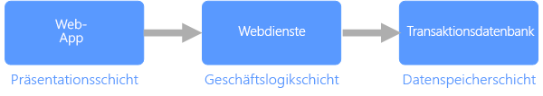

# Transaktionsdaten

Transaktionsdaten sind Informationen, mit denen Interaktionen in Zusammenhang mit den Aktivitäten einer Organisation nachverfolgt werden. Bei diesen Interaktionen handelt es sich in der Regel um Geschäftstransaktionen, etwa von Kunden erhaltene Zahlungen, Zahlungen an Zulieferer, Produkte im Bestand, entgegengenommene Aufträge oder bereitgestellte Dienste. Transaktionsereignisse, die die Transaktionen selbst darstellen, enthalten in der Regel eine Zeitdimension, einige numerische Werte und Verweise auf andere Daten. 

Transaktionen müssen normalweise *unteilbar* und *konsistent* sein. Unteilbarkeit bedeutet, dass eine gesamte Transaktion immer als eine Arbeitseinheit erfolgreich ist oder fehlschlägt und nie in einem halb abgeschlossenen Zustand belassen wird. Wenn eine Transaktion nicht abgeschlossen werden kann, muss das Datenbanksystem einen Rollback für alle Schritte ausführen, die im Rahmen der Transaktion bereits durchgeführt wurden. In einem herkömmlichen RDBMS erfolgt dieser Rollback automatisch, wenn eine Transaktion nicht abgeschlossen werden kann. Konsistenz bedeutet, dass Transaktionen die Daten immer in einem gültigen Zustand hinterlassen. (Hierbei handelt es sich um sehr informelle Beschreibungen von Unteilbarkeit und Konsistenz. Es gibt offiziellere Definitionen für diese Eigenschaften, etwa [ACID](https://en.wikipedia.org/wiki/ACID).)

Transaktionsdatenbanken können mit verschiedenen Sperrstrategien (etwa pessimistisches Sperren) hohe Konsistenz für Transaktionen unterstützen, um eine hohe Konsistenz aller Daten im Unternehmenskontext für alle Benutzer und Prozesse zu gewährleisten. 

Die Datenspeicherebene in einer dreischichtigen Architektur ist die am häufigsten verwendete Bereitstellungsarchitektur, die Transaktionsdaten verwendet. Eine dreischichtige Architektur setzt sich üblicherweise aus einer Präsentationsebene, einer Geschäftslogikebene und einer Datenspeicherebene zusammen. Eine ähnliche Bereitstellungsarchitektur ist die [n-schichtige](/azure/architecture/guide/architecture-styles/n-tier) Architektur, die mehrere mittlere Ebenen für die Verarbeitung von Geschäftslogik enthalten kann.

## Typische Merkmale von Transaktionsdaten

Transaktionsdaten weisen tendenziell die folgenden Merkmale auf:

| Anforderung | BESCHREIBUNG |
| --- | --- |
| Normalisierung | Stark normalisiert |
| Schema | Schema beim Schreiben, strikte Erzwingung|
| Konsistenz | Hohe Konsistenz, ACID-Garantien |
| Integrität | Hohe Integrität |
| Verwendung von Transaktionen | Ja |
| Sperrstrategie | Pessimistisch oder optimistisch|
| Aktualisierbar | Ja |
| Erweiterbar | Ja |
| Workload | Intensive Schreibvorgänge, moderate Lesevorgänge |
| Indizierung | Primäre und sekundäre Indizes |
| Bezugsgröße | Kleine bis mittlere Größe |
| Modell | Relational |
| Datenform | Tabellarisch |
| Abfrageflexibilität | Sehr flexibel |
| Skalieren | Klein (MBs) bis groß (einige TBs) | 

## Siehe auch

[Online Transaction Processing (OLTP)](../scenarios/online-transaction-processing.md) (Onlinetransaktionsverarbeitung)
