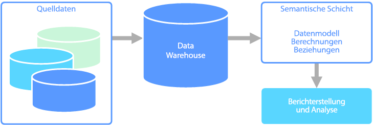

# Analytische Onlineverarbeitung (Online Analytical Processing, OLAP)Online analytical processing (OLAP)

Die analytische Onlineverarbeitung (Online Analytical Processing, OLAP) ist eine Technologie, mit der große Geschäftsdatenbanken organisiert und komplexe Analysen unterstützt werden.Online analytical processing (OLAP) is a technology that organizes large business databases and supports complex analysis. OLAP kann genutzt werden, um komplexe analytische Abfragen durchzuführen, ohne dass Transaktionssysteme negativ beeinträchtigt werden.It can be used to perform complex analytical queries without negatively affecting transactional systems.

Die Datenbanken, die von einem Unternehmen zum Speichern aller Transaktionen und Datensätze verwendet werden, werden als Datenbanken mit [Onlinetransaktionsverarbeitung (Online Transaction Processing, OLTP)](online-transaction-processing.md) bezeichnet.The databases that a business uses to store all its transactions and records are called [online transaction processing (OLTP)](online-transaction-processing.md) databases. Diese Datenbanken enthalten normalerweise Datensätze, die einzeln eingegeben werden.These databases usually have records that are entered one at a time. Häufig befinden sich darin viele Informationen, die nützlich für die Organisation sind.Often they contain a great deal of information that is valuable to the organization. Die Datenbanken, die für OLTP genutzt werden, wurden dagegen nicht für Analysezwecke entworfen.The databases that are used for OLTP, however, were not designed for analysis. Daher ist das Abrufen von Antworten aus diesen Datenbanken sehr zeitintensiv und aufwändig.Therefore, retrieving answers from these databases is costly in terms of time and effort. OLAP-Systeme sind dafür ausgelegt, diese Business Intelligence-Informationen mit hoher Leistung aus den Daten zu extrahieren.OLAP systems were designed to help extract this business intelligence information from the data in a highly performant way. Der Grund ist, dass OLAP-Datenbanken für Workloads mit hohem Lese- und geringem Schreibaufwand optimiert sind.This is because OLAP databases are optimized for heavy read, low write workloads.

 

## Semantische ModellierungSemantic modeling

Ein semantisches Datenmodell ist ein konzeptionelles Modell, mit dem die Bedeutung der darin enthaltenen Datenelemente beschrieben wird.A semantic data model is a conceptual model that describes the meaning of the data elements it contains. In Organisationen werden häufig eigene Begriffe verwendet, bei denen es sich um Synonyme handeln kann oder die für denselben Begriff unterschiedliche Bedeutungen haben.Organizations often have their own terms for things, sometimes with synonyms, or even different meanings for the same term. Beispiel: In einer Bestandsdatenbank wird ein Ausrüstungsteil anhand einer Asset-ID und einer Seriennummer nachverfolgt, während in einer Vertriebsdatenbank die Seriennummer als Asset-ID bezeichnet wird.For example, an inventory database might track a piece of equipment with an asset ID and a serial number, but a sales database might refer to the serial number as the asset ID. Es gibt keine einfache Möglichkeit, diese Werte miteinander in Beziehung zu setzen, ohne dass ein Modell verwendet wird, mit dem die Beziehung beschrieben wird.There is no simple way to relate these values without a model that describes the relationship. 

Die semantische Modellierung ermöglicht ein bestimmtes Maß an Abstraktion für das Datenbankschema, damit Benutzer nicht über die zugrunde liegenden Datenstrukturen informiert sein müssen.Semantic modeling provides a level of abstraction over the database schema, so that users don't need to know the underlying data structures. Dies erleichtert Endbenutzern das Abfragen von Daten ohne Durchführung von Aggregierungs- und Verknüpfungsvorgängen für das zugrunde liegende Schema.This makes it easier for end users to query data without performing aggregates and joins over the underlying schema. Außerdem erhalten Spalten normalerweise benutzerfreundlichere Namen, damit der Kontext und die Bedeutung der Daten besser erkennbar ist.Also, usually columns are renamed to more user-friendly names, so that the context and meaning of the data are more obvious.

Die semantische Modellierung wird hauptsächlich für Szenarien mit hohem Leseaufwand verwendet, z.B. Analytics und Business Intelligence (OLAP), und nicht für die transaktionale Datenverarbeitung (OLTP) mit hohem Schreibaufwand.Semantic modeling is predominately used for read-heavy scenarios, such as analytics and business intelligence (OLAP), as opposed to more write-heavy transactional data processing (OLTP). Dies liegt vor allem an der Art einer typischen semantischen Ebene:This is mostly due to the nature of a typical semantic layer:

- Das Aggregierungsverhalten ist so festgelegt, dass es von Tools für die Berichterstellung richtig angezeigt werden.Aggregation behaviors are set so that reporting tools display them properly.
- Die Geschäftslogik und die Berechnungen sind definiert.Business logic and calculations are defined.
- Zeitabhängige Berechnungen sind enthalten.Time-oriented calculations are included.
- Daten werden häufig aus mehreren Quellen integriert.Data is often integrated from multiple sources. 

Aus diesen Gründen wird die semantische Ebene meist über einem Data Warehouse angeordnet.Traditionally, the semantic layer is placed over a data warehouse for these reasons.

Es gibt zwei Hauptarten von Semantikmodellen:There are two primary types of semantic models:

* **Tabellarisch**:**Tabular**. Hierfür werden Konstrukte der relationalen Modellierung verwendet (Modell, Tabellen, Spalten).Uses relational modeling constructs (model, tables, columns). Intern werden Metadaten von Konstrukten der OLAP-Modellierung geerbt (Cubes, Dimensionen, Measures).Internally, metadata is inherited from OLAP modeling constructs (cubes, dimensions, measures). Für den Code und Skripts werden OLAP-Metadaten genutzt.Code and script use OLAP metadata.
* **Mehrdimensional**:**Multidimensional**. Hierfür werden herkömmliche Konstrukte der OLAP-Modellierung verwendet (Cubes, Dimensionen, Measures).Uses traditional OLAP modeling constructs (cubes, dimensions, measures).

In Frage kommender Azure-Dienst:Relevant Azure service:
- [Azure Analysis ServicesAzure Analysis Services](https://azure.microsoft.com/services/analysis-services/)

## Beispiel eines AnwendungsfallsExample use case

In einer Organisation werden Daten in einer großen Datenbank gespeichert.An organization has data stored in a large database. Diese Daten sollen für geschäftliche Benutzer und Kunden verfügbar gemacht werden, damit diese eigene Berichte erstellen und Analysen durchführen können.It wants to make this data available to business users and customers to create their own reports and do some analysis. Eine Option besteht darin, diesen Benutzern direkten Zugriff auf die Datenbank zu gewähren.One option is just to give those users direct access to the database. Dieser Ansatz ist aber mit mehreren Nachteilen verbunden, z.B. dem Aufwand für die Verwaltung der Sicherheit und Steuerung des Zugriffs.However, there are several drawbacks to doing this, including managing security and controlling access. Außerdem kann das Design der Datenbank, z.B. Namen von Tabellen und Spalten, für Benutzer schwer verständlich sein.Also, the design of the database, including the names of tables and columns, may be hard for a user to understand. Benutzer müssen wissen, welche Tabellen abgefragt werden sollen, wie diese Tabellen verknüpft werden müssen und wie es sich mit der weiteren Geschäftslogik verhält, die angewendet werden muss, um die richtigen Ergebnisse zu erhalten.Users would need to know which tables to query, how those tables should be joined, and other business logic that must be applied to get the correct results. Benutzer müssen sich zudem mit einer Abfragesprache, z.B. SQL, auskennen, um beginnen zu können.Users would also need to know a query language like SQL even to get started. Normalerweise führt dies dazu, dass mehrere Benutzer die gleichen Metriken melden, aber mit unterschiedlichen Ergebnissen.Typically this leads to multiple users reporting the same metrics but with different results.

Eine andere Option besteht darin, alle Informationen, die Benutzer benötigen, in einem Semantikmodell zusammenzufassen.Another option is to encapsulate all of the information that users need into a semantic model. Das Semantikmodell kann von Benutzern mit einem Berichterstellungstool ihrer Wahl einfacher abgefragt werden.The semantic model can be more easily queried by users with a reporting tool of their choice. Die vom Semantikmodell bereitgestellten Daten werden per Pullvorgang aus einem Data Warehouse abgerufen, um sicherzustellen, dass alle Benutzer die einzige und richtige Version angezeigt bekommen.The data provided by the semantic model is pulled from a data warehouse, ensuring that all users see a single version of the truth. Darüber hinaus werden über das Semantikmodell auch Anzeigenamen für Tabellen und Spalten, Beziehungen zwischen Tabellen, Beschreibungen, Berechnungen und die Sicherheit auf Zeilenebene bereitgestellt.The semantic model also provides friendly table and column names, relationships between tables, descriptions, calculations, and row-level security.

## Typische Merkmale der semantischen ModellierungTypical traits of semantic modeling

Für die semantische Modellierung und analytische Verarbeitung gelten in der Regel die folgenden Merkmale:Semantic modeling and analytical processing tends to have the following traits:

| AnforderungRequirement | BESCHREIBUNGDescription |
| --- | --- |
| SchemaSchema | Schema beim Schreiben, strikte ErzwingungSchema on write, strongly enforced|
| Nutzung von TransaktionenUses Transactions | Nein No |
| SperrstrategieLocking Strategy | KeineNone |
| AktualisierbarUpdateable | Nein (normalerweise Neuberechnung des Cubes erforderlich)No (typically requires recomputing cube) |
| ErweiterbarAppendable | Nein (normalerweise Neuberechnung des Cubes erforderlich)No (typically requires recomputing cube) |
| WorkloadWorkload | Hoher Leseaufwand, schreibgeschütztHeavy reads, read-only |
| IndizierungIndexing | Mehrdimensionale IndizierungMultidimensional indexing |
| BezugsgrößeDatum size | Kleine bis mittlere GrößeSmall to medium sized |
| ModellModel | MehrdimensionalMultidimensional |
| Datenform:Data shape:| Cube oder Stern/SchneeflockenschemaCube or star/snowflake schema |
| AbfrageflexibilitätQuery flexibility | Sehr flexibelHighly flexible |
| Skalierung:Scale: | Groß (Dutzende bis mehrere Hundert GB)Large (10s-100s GBs) |

## Verwendung dieser LösungWhen to use this solution

Erwägen Sie in den folgenden Szenarien die Verwendung von OLAP:Consider OLAP in the following scenarios:

- Sie müssen schnell komplexe Analyse- und Ad-hoc-Abfragen durchführen können, ohne dass sich negative Auswirkungen auf Ihre OLTP-Systeme ergeben.You need to execute complex analytical and ad hoc queries rapidly, without negatively affecting your OLTP systems. 
- Sie möchten geschäftlichen Benutzern das einfache Erstellen von Berichten aus Ihren Daten ermöglichen.You want to provide business users with a simple way to generate reports from your data
- Sie möchten eine Reihe von Aggregationen bereitstellen, damit Benutzer schnelle, einheitliche Ergebnisse erhalten.You want to provide a number of aggregations that will allow users to get fast, consistent results. 

OLAP ist besonders nützlich zum Anwenden von Aggregatberechnungen auf große Datenmengen.OLAP is especially useful for applying aggregate calculations over large amounts of data. OLAP-Systeme sind für Szenarien mit hohem Leseaufwand optimiert, z.B. Analytics und Business Intelligence.OLAP systems are optimized for read-heavy scenarios, such as analytics and business intelligence. OLAP ermöglicht Benutzern das Segmentieren von mehrdimensionalen Daten in Slices, die in zwei Dimensionen (z.B. einer PivotTable) angezeigt werden können, oder das Filtern der Daten nach bestimmten Werten.OLAP allows users to segment multi-dimensional data into slices that can be viewed in two dimensions (such as a pivot table) or filter the data by specific values. Dieser Prozess wird im Englischen auch als „Slicing & Dicing“ der Daten bezeichnet und kann unabhängig davon erfolgen, ob die Daten über mehrere Datenquellen hinweg partitioniert sind.This process is sometimes called "slicing and dicing" the data, and can be done regardless of whether the data is partitioned across several data sources. Benutzer können Trends ermitteln, Muster erkennen und die Daten untersuchen, ohne die Details der herkömmlichen Datenanalyse kennen zu müssen.This helps users to find trends, spot patterns, and explore the data without having to know the details of traditional data analysis.

Semantikmodelle können Benutzern als Unterstützung beim Abstrahieren von komplexen Beziehungen dienen und das schnelle Analysieren von Daten vereinfachen.Semantic models can help business users abstract relationship complexities and make it easier to analyze data quickly.

## HerausforderungenChallenges

Neben den vielen Vorteilen von OLAP-Systemen sind auch einige Herausforderungen zu bewältigen:For all the benefits OLAP systems provide, they do produce a few challenges:

- Während Daten in OLTP-Systemen aufgrund der eingehenden Transaktionen aus verschiedenen Quellen ständig aktualisiert werden, werden OLAP-Datenquellen meist in deutlich längeren Abständen aktualisiert. Dies richtet sich nach den geschäftlichen Anforderungen.Whereas data in OLTP systems is constantly updated through transactions flowing in from various sources, OLAP data stores are typically refreshed at a much slower intervals, depending on business needs. OLAP-Systeme sind also besser für strategische Geschäftsentscheidungen und nicht so sehr für direkte Reaktionen auf Veränderungen geeignet.This means OLAP systems are better suited for strategic business decisions, rather than immediate responses to changes. Außerdem muss ein bestimmtes Maß an Bereinigung und Orchestrierung eingeplant werden, um die OLAP-Datenspeicher auf dem neuesten Stand zu halten.Also, some level of data cleansing and orchestration needs to be planned to keep the OLAP data stores up-to-date.
- Im Gegensatz zu herkömmlichen, normalisierten, relationalen Tabellen in OLTP-Systemen sind OLAP-Datenmodelle eher mehrdimensional.Unlike traditional, normalized, relational tables found in OLTP systems, OLAP data models tend to be multidimensional. Hierdurch wird es schwierig oder sogar unmöglich, eine direkte Zuordnung zu Entitätsbeziehungs- oder objektorientierten Modellen vorzunehmen, bei denen jedes Attribut einer Spalte zugeordnet wird.This makes it difficult or impossible to directly map to entity-relationship or object-oriented models, where each attribute is mapped to one column. Für OLAP-Systeme wird anstelle der herkömmlichen Normalisierung stattdessen normalerweise ein Stern- oder Schneeflockenschema verwendet.Instead, OLAP systems typically use a star or snowflake schema in place of traditional normalization.

## OLAP in AzureOLAP in Azure

In Azure werden Daten, die in OLTP-Systemen vorgehalten werden, z.B. Azure SQL-Datenbank, in das OLAP-System kopiert, z.B. [Azure Analysis Services](/azure/analysis-services/analysis-services-overview).In Azure, data held in OLTP systems such as Azure SQL Database is copied into the OLAP system, such as [Azure Analysis Services](/azure/analysis-services/analysis-services-overview). Tools für die Datenuntersuchung und Visualisierung, z.B. [Power BI](https://powerbi.microsoft.com), Excel und Drittanbieteroptionen, stellen eine Verbindung mit Analysis Services-Servern her und ermöglichen Benutzern extrem interaktive und visuell umfassende Einblicke in die modellierten Daten.Data exploration and visualization tools like [Power BI](https://powerbi.microsoft.com), Excel, and third-party options connect to Analysis Services servers and provide users with highly interactive and visually rich insights into the modeled data. Der Datenfluss von OLTP-Daten zu OLAP wird normalerweise über SQL Server Integration Services orchestriert, die mit [Azure Data Factory](/azure/data-factory/concepts-integration-runtime) ausgeführt werden können.The flow of data from OLTP data to OLAP is typically orchestrated using SQL Server Integration Services, which can be executed using [Azure Data Factory](/azure/data-factory/concepts-integration-runtime).

In Azure erfüllen alle folgenden Datenspeicher die grundlegenden Anforderungen für OLAP:In Azure, all of the following data stores will meet the core requirements for OLAP:

- [SQL Server mit Columnstore-IndizesSQL Server with Columnstore indexes](/sql/relational-databases/indexes/get-started-with-columnstore-for-real-time-operational-analytics)
- [Azure Analysis ServicesAzure Analysis Services](/azure/analysis-services/analysis-services-overview)
- [SQL Server Analysis Services (SSAS)SQL Server Analysis Services (SSAS)](/sql/analysis-services/analysis-services)

SQL Server Analysis Services (SSAS) bietet OLAP- und Data Mining-Funktionen für Business Intelligence-Anwendungen.SQL Server Analysis Services (SSAS) offers OLAP and data mining functionality for business intelligence applications. Sie können SSAS auf lokalen Servern installieren oder auf einer VM in Azure hosten.You can either install SSAS on local servers, or host within a virtual machine in Azure. Azure Analysis Services ist ein vollständig verwalteter Dienst, der die gleichen Hauptfunktionen wie SSAS bereitstellt.Azure Analysis Services is a fully managed service that provides the same major features as SSAS. Azure Analysis Services unterstützt das Herstellen von Verbindungen mit [verschiedenen Datenquellen](/azure/analysis-services/analysis-services-datasource) in der Cloud und lokalen Datenquellen in der Organisation.Azure Analysis Services supports connecting to [various data sources](/azure/analysis-services/analysis-services-datasource) in the cloud and on-premises in your organization.

Gruppierte Columnstore-Indizes sind in SQL Server 2014 und höher sowie Azure SQL-Datenbank verfügbar und eignen sich ideal für OLAP-Workloads.Clustered Columnstore indexes are available in SQL Server 2014 and above, as well as Azure SQL Database, and are ideal for OLAP workloads. Ab SQL Server 2016 (einschließlich Azure SQL-Datenbank) können Sie jedoch mithilfe von aktualisierbaren nicht gruppierten Columnstore-Indizes die hybride Verarbeitung von Transaktionen und Analysen (Hybrid Transactional and Analytical Processing, HTAP) nutzen.However, beginning with SQL Server 2016 (including Azure SQL Database), you can take advantage of hybrid transactional/analytics processing (HTAP) through the use of updateable nonclustered columnstore indexes. HTAP ermöglicht Ihnen die OLTP- und OLAP-Verarbeitung auf der gleichen Plattform. Dadurch entfällt die Notwendigkeit, mehrere Kopien Ihrer Daten zu speichern sowie separate OLTP- und OLAP-Systeme zu verwenden.HTAP enables you to perform OLTP and OLAP processing on the same platform, which removes the need to store multiple copies of your data, and eliminates the need for distinct OLTP and OLAP systems. Weitere Informationen finden Sie unter [Erste Schritte mit Columnstore für operative Echtzeitanalyse](/sql/relational-databases/indexes/get-started-with-columnstore-for-real-time-operational-analytics).For more information, see [Get started with Columnstore for real-time operational analytics](/sql/relational-databases/indexes/get-started-with-columnstore-for-real-time-operational-analytics).

## Wichtige AuswahlkriterienKey selection criteria

Beantworten Sie die folgenden Fragen, um die Auswahl einzuschränken:To narrow the choices, start by answering these questions:

- Möchten Sie einen verwalteten Dienst verwenden, anstatt Ihre eigenen Server zu verwalten?Do you want a managed service rather than managing your own servers?

- Benötigen Sie eine sichere Authentifizierung mit Azure Active Directory (Azure AD)?Do you require secure authentication using Azure Active Directory (Azure AD)?

- Möchten Sie Echtzeitanalysen ausführen?Do you want to conduct real-time analytics? Ist dies der Fall, beschränken Sie sich auf die Optionen, die Echtzeitanalysen unterstützten.If so, narrow your options to those that support real-time analytics. 

    *Echtzeitanalyse* bezieht sich in diesem Kontext auf eine einzelne Datenquelle, beispielsweise eine ERP-Anwendung (Enterprise Resource Planning), die sowohl auf einer operativen als auch einer analytischen Workload ausgeführt wird.*Real-time analytics* in this context applies to a single data source, such as an enterprise resource planning (ERP) application, that will run both an operational and an analytics workload. Wenn Sie Daten aus mehreren Quellen integrieren müssen oder eine sehr hohe Analyseleistung durch Verwendung von vorab aggregierten Daten wie Cubes erforderlich ist, benötigen Sie möglicherweise trotzdem ein separates Data Warehouse.If you need to integrate data from multiple sources, or require extreme analytics performance by using pre-aggregated data such as cubes, you might still require a separate data warehouse.

- Müssen Sie vorab aggregierte Daten verwenden, beispielsweise zum Bereitstellen von semantischen Modellen, die Geschäftsbenutzern die Verwendung von Analysen erleichtern?Do you need to use pre-aggregated data, for example to provide semantic models that make analytics more business user friendly? Ist dies der Fall, wählen Sie eine Option aus, die mehrdimensionale Cubes oder tabellarische Semantikmodelle unterstützt.If yes, choose an option that supports multidimensional cubes or tabular semantic models. 

    Die Bereitstellung von Aggregaten kann Benutzern die konsistente Berechnung von Datenaggregaten ermöglichen.Providing aggregates can help users consistently calculate data aggregates. Bei der Arbeit mit mehreren Spalten und vielen Zeilen können vorab aggregierte Daten zudem die Leistung erheblich steigern.Pre-aggregated data can also provide a large performance boost when dealing with several columns across many rows. Daten können in mehrdimensionalen Cubes oder tabellarischen Semantikmodellen vorab aggregiert werden.Data can be pre-aggregated in multidimensional cubes or tabular semantic models.

- Müssen Sie Daten aus mehreren Quellen (abgesehen von Ihrem OLTP-Datenspeicher) integrieren?Do you need to integrate data from several sources, beyond your OLTP data store? Ist dies der Fall, sollten Sie Optionen erwägen, die eine einfache Integration mehrerer Datenquellen ermöglichen.If so, consider options that easily integrate multiple data sources.

## FunktionsmatrixCapability matrix

In den folgenden Tabellen sind die Hauptunterschiede in Bezug auf die Funktionen zusammengefasst.The following tables summarize the key differences in capabilities.

### Allgemeine FunktionenGeneral capabilities

| | Azure Analysis ServicesAzure Analysis Services | SQL Server Analysis ServicesSQL Server Analysis Services | SQL Server mit Columnstore-IndizesSQL Server with Columnstore Indexes | Azure SQL-Datenbank mit Columnstore-IndizesAzure SQL Database with Columnstore Indexes |
| --- | --- | --- | --- | --- |
| Verwalteter DienstIs managed service | JaYes | Nein No | Nein No | JaYes |
| Unterstützung mehrdimensionaler CubesSupports multidimensional cubes | Nein No | JaYes | Nein No | Nein No |
| Unterstützung tabellarischer SemantikmodelleSupports tabular semantic models | JaYes | JaYes | Nein No | Nein No |
| Einfache Integration mehrerer DatenquellenEasily integrate multiple data sources | JaYes | JaYes | Nein 1No 1 | Nein 1No 1 |
| Unterstützung von EchtzeitanalysenSupports real-time analytics | Nein No | Nein No | JaYes | JaYes |
| Prozess zum Kopieren von Daten aus Quellen erforderlichRequires process to copy data from source(s) | JaYes | JaYes | Nein No | Nein No |
| Azure AD-IntegrationAzure AD integration | JaYes | Nein No | Nein2No 2 | JaYes |

[1] Obwohl SQL Server und Azure SQL-Datenbank nicht zum Abfragen und Integrieren mehrerer externer Datenquellen verwendet werden können, können Sie zu diesem Zweck eine Pipeline mit [SSIS](/sql/integration-services/sql-server-integration-services) oder [Azure Data Factory](/azure/data-factory/) erstellen.[1] Although SQL Server and Azure SQL Database cannot be used to query from and integrate multiple external data sources, you can still build a pipeline that does this for you using [SSIS](/sql/integration-services/sql-server-integration-services) or [Azure Data Factory](/azure/data-factory/). Eine auf einer Azure-VM gehostete SQL Server-Instanz bietet zusätzliche Optionen, beispielsweise Verbindungsserver und [PolyBase](/sql/relational-databases/polybase/polybase-guide).SQL Server hosted in an Azure VM has additional options, such as linked servers and [PolyBase](/sql/relational-databases/polybase/polybase-guide). Weitere Informationen finden Sie unter [Pipeline orchestration, control flow, and data movement](../technology-choices/pipeline-orchestration-data-movement.md) (Pipelineorchestrierung, Ablaufsteuerung und Datenverschiebung).For more information, see [Pipeline orchestration, control flow, and data movement](../technology-choices/pipeline-orchestration-data-movement.md).

[2] Das Herstellen einer Verbindung mit einer SQL Server-Instanz, die auf einer Azure-VM ausgeführt wird, wird für ein Azure AD-Konto nicht unterstützt.[2] Connecting to SQL Server running on an Azure Virtual Machine is not supported using an Azure AD account. Verwenden Sie stattdessen ein Active Directory-Domänenkonto.Use a domain Active Directory account instead.

### SkalierbarkeitsfunktionenScalability Capabilities

|                                                  | Azure Analysis ServicesAzure Analysis Services | SQL Server Analysis ServicesSQL Server Analysis Services | SQL Server mit Columnstore-IndizesSQL Server with Columnstore Indexes | Azure SQL-Datenbank mit Columnstore-IndizesAzure SQL Database with Columnstore Indexes |
|--------------------------------------------------|-------------------------|------------------------------|-------------------------------------|---------------------------------------------|
| Redundante regionale Server für HochverfügbarkeitRedundant regional servers for high availability |           JaYes           |              NeinNo              |                 JaYes                 |                     JaYes                     |
|             Unterstützung des horizontalen Hochskalierens von AbfragenSupports query scale out             |           JaYes           |              NeinNo              |                 JaYes                 |                     Nein No                      |
|          Dynamische Skalierbarkeit (zentrales Hochskalieren)Dynamic scalability (scale up)          |           JaYes           |              NeinNo              |                 JaYes                 |                     Nein No                      |

