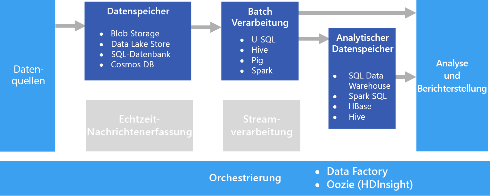

# BatchverarbeitungBatch processing

Ein verbreitetes Big Data-Szenario ist die Batchverarbeitung ruhender Daten.A common big data scenario is batch processing of data at rest. In diesem Szenario werden die Quelldaten in einen Datenspeicher geladen – entweder durch die Quellanwendung selbst oder durch einen Orchestrierungsworkflow.In this scenario, the source data is loaded into data storage, either by the source application itself or by an orchestration workflow. Anschließend werden die Daten direkt durch einen parallelisierten Auftrag verarbeitet. Dieser Auftrag kann ebenfalls durch den Orchestrierungsworkflow initiiert werden.The data is then processed in-place by a parallelized job, which can also be initiated by the orchestration workflow. Die Verarbeitung kann mehrere iterative Schritte umfassen. Die transformierten Ergebnisse werden schließlich in einen Analysedatenspeicher geladen, der von Analyse- und Berichterstellungskomponenten abgefragt werden kann.The processing may include multiple iterative steps before the transformed results are loaded into an analytical data store, which can be queried by analytics and reporting components.

So können beispielsweise die Protokolle eines Webservers in einen Ordner kopiert und über Nacht verarbeitet werden, um tägliche Berichte zur Webaktivität zu generieren.For example, the logs from a web server might be copied to a folder and then processed overnight to generate daily reports of web activity.

## Verwendung dieser LösungWhen to use this solution

Die Batchverarbeitung kommt in verschiedensten Szenarien zum Einsatz – von der einfachen Datentransformation bis hin zur umfassenderen ETL-Pipeline (Extrahieren, Transformieren, Laden).Batch processing is used in a variety of scenarios, from simple data transformations to a more complete ETL (extract-transform-load) pipeline. In einem Big Data-Kontext kann die Batchverarbeitung auf sehr große Datasets angewendet werden, bei denen die Berechnung viel Zeit in Anspruch nimmt.In a big data context, batch processing may operate over very large data sets, where the computation takes significant time. (Weitere Informationen finden Sie beispielsweise unter [Lambda-Architektur](../concepts/big-data.md#lambda-architecture).) Die Batchverarbeitung führt in der Regel zu weiteren interaktiven Untersuchungen, stellt die modellierungsbereiten Daten für Machine Learning bereit oder schreibt die Daten in einen für die Analyse und Visualisierung optimierten Datenspeicher.(For example, see [Lambda architecture](../concepts/big-data.md#lambda-architecture).) Batch processing typically leads to further interactive exploration, provides the modeling-ready data for machine learning, or writes the data to a data store that is optimized for analytics and visualization.

Ein Beispiel für die Batchverarbeitung ist die Transformation zahlreicher teilweise strukturierter CSV- oder JSON-Flatfiles in ein schematisiertes und strukturiertes Format, das für weitere Abfragen genutzt werden kann.One example of batch processing is transforming a large set of flat, semi-structured CSV or JSON files into a schematized and structured format that is ready for further querying. Die Daten werden in der Regel aus den bei der Erfassung verwendeten Rohformaten (beispielsweise CSV) in Binärformate konvertiert, mit denen sich bei Abfragen eine bessere Leistung erzielen lässt, da sie Daten in einem spaltenförmigen Format speichern und häufig Indizes und Inlinestatistiken für die Daten bereitstellen.Typically the data is converted from the raw formats used for ingestion (such as CSV) into binary formats that are more performant for querying because they store data in a columnar format, and often provide indexes and inline statistics about the data.

## HerausforderungenChallenges

- **Datenformat und -codierung**:**Data format and encoding**. Einige der kompliziertesten Probleme treten bei Dateien mit unerwartetem Format oder unerwarteter Codierung auf.Some of the most difficult issues to debug happen when files use an unexpected format or encoding. So können Quelldateien beispielsweise eine Mischung aus UTF-16- und UTF-8-Codierung, unerwartete Trennzeichen (Leerzeichen anstelle von Tabstopps) oder unerwartete Zeichen enthalten.For example, source files might use a mix of UTF-16 and UTF-8 encoding, or contain unexpected delimiters (space versus tab), or include unexpected characters. Ein weiteres Beispiel sind Textfelder mit Tabstopps, Leerzeichen oder Kommas, die als Trennzeichen interpretiert werden.Another common example is text fields that contain tabs, spaces, or commas that are interpreted as delimiters. Die Logik für das Laden und Analysieren der Daten muss über die nötige Flexibilität verfügen, um diese Probleme erkennen und bewältigen zu können.Data loading and parsing logic must be flexible enough to detect and handle these issues.

- **Orchestrieren von Zeitsegmenten**:**Orchestrating time slices.** Quelldaten werden häufig in einer Ordnerhierarchie platziert, die Verarbeitungsfenster darstellt, welche nach Jahr, Monat, Tag, Stunde usw. strukturiert sind.Often source data is placed in a folder hierarchy that reflects processing windows, organized by year, month, day, hour, and so on. Manchmal treffen Daten unter Umständen verspätet ein.In some cases, data may arrive late. Ein Beispiel: Angenommen, ein Webserver fällt aus, und die Protokolle für den 7. März landen erst am 9. März in dem Ordner für die Verarbeitung.For example, suppose that a web server fails, and the logs for March 7th don't end up in the folder for processing until March 9th. Werden sie einfach ignoriert, da sie zu spät eingetroffen sind?Are they just ignored because they're too late? Kommt die Downstreamverarbeitungslogik mit außerordentlichen Datensätzen zurecht?Can the downstream processing logic handle out-of-order records?

## ArchitectureArchitecture

Eine Batchverarbeitungsarchitektur verfügt über folgende logische Komponenten, die auch im obigen Diagramm dargestellt sind:A batch processing architecture has the following logical components, shown in the diagram above.

- **Datenspeicher**:**Data storage.** In der Regel ein verteilter Datenspeicher, der als Repository für zahlreiche große Dateien in verschiedenen Formaten fungieren kann.Typically a distributed file store that can serve as a repository for high volumes of large files in various formats. Diese Art von Speicher wird allgemein häufig als Data Lake bezeichnet.Generically, this kind of store is often referred to as a data lake. 

- **Batchverarbeitung**:**Batch processing.** Aufgrund des großen Umfangs von Big Data müssen Lösungen oftmals Datendateien mithilfe von Batchaufträgen mit langer Ausführungszeit verarbeiten, um die Daten zu filtern, zu aggregieren und anderweitig auf die Analyse vorzubereiten.The high-volume nature of big data often means that solutions must process data files using long-running batch jobs to filter, aggregate, and otherwise prepare the data for analysis. Diese Aufträge beinhalten in der Regel das Lesen von Quelldateien, ihre Verarbeitung und das Schreiben der Ausgabe in neue Dateien.Usually these jobs involve reading source files, processing them, and writing the output to new files. 

- **Analysedatenspeicher**:**Analytical data store.** Viele Big Data-Lösungen bereiten Daten für die Analyse vor und stellen die verarbeiteten Daten dann in einem strukturierten Format bereit, das mithilfe von Analysetools abgefragt werden kann.Many big data solutions are designed to prepare data for analysis and then serve the processed data in a structured format that can be queried using analytical tools. 

- **Analysen und Berichte**:**Analysis and reporting.** Ziel der meisten Big Data-Lösungen ist es, über Analysen und Berichte Einblicke in die Daten zu bieten.The goal of most big data solutions is to provide insights into the data through analysis and reporting. 

- **Orchestrierung**:**Orchestration.** In Verbindung mit der Batchverarbeitung ist in der Regel auch ein gewisses Maß an Orchestrierung erforderlich, um die Daten in Ihren Datenspeicher, in die Batchverarbeitung, in den Analysedatenspeicher und in die Berichterstellungsebenen zu kopieren bzw. zu migrieren.With batch processing, typically some orchestration is required to migrate or copy the data into your data storage, batch processing, analytical data store, and reporting layers.

## Auswahl der TechnologieTechnology choices

Für Batchverarbeitungslösungen in Azure werden folgende Technologien empfohlen:The following technologies are recommended choices for batch processing solutions in Azure.

### DatenspeicherData storage

- **Azure Storage Blob-Container**:**Azure Storage Blob Containers**. Da Azure Blob Storage bereits von vielen Azure-Geschäftsprozessen genutzt wird, ist diese Option eine gute Wahl für einen Big Data-Speicher.Many existing Azure business processes already make use of Azure blob storage, making this a good choice for a big data store.
- **Azure Data Lake Store**.**Azure Data Lake Store**. Der nahezu unbegrenzte Speicher für jegliche Dateigröße sowie umfassende Sicherheitsoptionen machen Azure Data Lake Store zu einer guten Wahl für besonders umfangreiche Big Data-Lösungen, die einen zentralen Speicher für Daten in heterogenen Formaten benötigen.Azure Data Lake Store offers virtually unlimited storage for any size of file, and extensive security options, making it a good choice for extremely large-scale big data solutions that require a centralized store for data in heterogeneous formats.

Weitere Informationen finden Sie im Artikel zur [Datenspeicherung](../technology-choices/data-storage.md).For more information, see [Data storage](../technology-choices/data-storage.md).

### BatchverarbeitungBatch processing

- **U-SQL**:**U-SQL**. U-SQL ist die von Azure Data Lake Analytics verwendete Abfrageverarbeitungssprache.U-SQL is the query processing language used by Azure Data Lake Analytics. Sie kombiniert den deklarativen Charakter von SQL mit der prozeduralen Erweiterbarkeit von C# und den Vorteilen der Parallelität, um eine effiziente Verarbeitung umfangreicher Daten zu ermöglichen.It combines the declarative nature of SQL with the procedural extensibility of C#, and takes advantage of parallelism to enable efficient processing of data at massive scale.
- **Hive**:**Hive**. Hive ist eine SQL-ähnliche Sprache, die von den meisten Hadoop-Distributionen (einschließlich HDInsight) unterstützt wird.Hive is a SQL-like language that is supported in most Hadoop distributions, including HDInsight. Sie kann zum Verarbeiten von Daten aus einem beliebigen HDFS-kompatiblen Speicher (einschließlich Azure Blob Storage und Azure Data Lake Store) verwendet werden.It can be used to process data from any HDFS-compatible store, including Azure blob storage and Azure Data Lake Store.
- **Pig**:**Pig**. Pig ist eine deklarative Big Data-Verarbeitungssprache, die in vielen Hadoop-Distributionen (einschließlich HDInsight) zum Einsatz kommt.Pig is a declarative big data processing language used in many Hadoop distributions, including HDInsight. Sie eignet sich besonders gut für die Verarbeitung unstrukturierter oder teilweise strukturierter Daten.It is particularly useful for processing data that is unstructured or semi-structured.
- **Spark**:**Spark**. Das Spark-Modul unterstützt Batchverarbeitungsprogramme in verschiedenen Programmiersprachen (beispielsweise Python, Java und Scala).The Spark engine supports batch processing programs written in a range of languages, including Java, Scala, and Python. Spark verwendet eine verteilte Architektur, um Daten parallel auf mehreren Workerknoten zu verarbeiten.Spark uses a distributed architecture to process data in parallel across multiple worker nodes.

Weitere Informationen finden Sie im Artikel zur [Batchverarbeitung](../technology-choices/batch-processing.md).For more information, see [Batch processing](../technology-choices/batch-processing.md).

### AnalysedatenspeicherAnalytical data store

- **SQL Data Warehouse**:**SQL Data Warehouse**. Azure SQL Data Warehouse ist ein verwalteter, auf SQL Server-Datenbanktechnologien basierender Dienst und für die Unterstützung umfangreicher Data Warehousing-Workloads optimiert.Azure SQL Data Warehouse is a managed service based on SQL Server database technologies and optimized to support large-scale data warehousing workloads.
- **Spark SQL**:**Spark SQL**. Spark SQL ist eine API, die auf Spark basiert und die Erstellung von Datenrahmen und Tabellen unterstützt, für die das Abfragen per SQL-Syntax möglich ist.Spark SQL is an API built on Spark that supports the creation of dataframes and tables that can be queried using SQL syntax.
- **HBase**:**HBase**. HBase ist ein NoSQL-Datenspeicher mit geringer Wartezeit und einer flexiblen Hochleistungsoption für die Abfrage strukturierter und teilweise strukturierter Daten.HBase is a low-latency NoSQL store that offers a high-performance, flexible option for querying structured and semi-structured data.
- **Hive**:**Hive**. Hive ist nicht nur bei der Batchverarbeitung hilfreich, sondern bietet auch eine Datenbankarchitektur, die ähnlich konzeptioniert ist wie ein typisches Managementsystem für relationale Datenbanken.In addition to being useful for batch processing, Hive offers a database architecture that is conceptually similar to that of a typical relational database management system. Dank Verbesserungen der Hive-Abfrageleistung durch Innovationen wie dem Tez-Modul und der Stinger-Initiative können Hive-Tabellen in einigen Szenarien effektiv als Quellen für analytische Abfragen verwendet werden.Improvements in Hive query performance through innovations like the Tez engine and Stinger initiative mean that Hive tables can be used effectively as sources for analytical queries in some scenarios.

Weitere Informationen finden Sie im Artikel zu [Analysedatenspeichern](../technology-choices/analytical-data-stores.md).For more information, see [Analytical data stores](../technology-choices/analytical-data-stores.md).

### Analysen und BerichteAnalytics and reporting

- **Azure Analysis Services**:**Azure Analysis Services**. Viele Big Data-Lösungen emulieren herkömmliche Business Intelligence-Architekturen für Unternehmen durch die Einbeziehung eines zentralisierten OLAP-Datenmodells (Online Analytical Processing, analytische Onlineverarbeitung; häufig als Cube bezeichnet), das als Grundlage für Berichte, Dashboards und interaktive Analysen („Slice and Dice“) verwendet werden kann.Many big data solutions emulate traditional enterprise business intelligence architectures by including a centralized online analytical processing (OLAP) data model (often referred to as a cube) on which reports, dashboards, and interactive “slice and dice” analysis can be based. Azure Analysis Services unterstützt die Erstellung mehrdimensionaler und tabellarischer Modelle, um diese Anforderung zu erfüllen.Azure Analysis Services supports the creation of multidimensional and tabular models to meet this need.
- **Power BI**:**Power BI**. Mit Power BI können Datenanalysten interaktive Datenvisualisierungen auf der Grundlage von Datenmodellen in einem OLAP-Modell oder direkt auf der Grundlage eines Analysedatenspeichers erstellen.Power BI enables data analysts to create interactive data visualizations based on data models in an OLAP model or directly from an analytical data store.
- **Microsoft Excel**:**Microsoft Excel**. Microsoft Excel ist eine der meistverwendeten Softwareanwendungen der Welt und bietet ein breites Spektrum an Funktionen für die Analyse und Visualisierung von Daten.Microsoft Excel is one of the most widely used software applications in the world, and offers a wealth of data analysis and visualization capabilities. Mit Excel können Datenanalysten Dokumentdatenmodelle auf der Grundlage von Analysedatenspeichern erstellen oder Daten aus OLAP-Datenmodellen in interaktive PivotTables und Diagramme abrufen.Data analysts can use Excel to build document data models from analytical data stores, or to retrieve data from OLAP data models into interactive PivotTables and charts.

Weitere Informationen finden Sie im Artikel zu [Analysen und Berichten](../technology-choices/analysis-visualizations-reporting.md).For more information, see [Analytics and reporting](../technology-choices/analysis-visualizations-reporting.md).

### OrchestrierungOrchestration

- **Azure Data Factory****Azure Data Factory**. Mit Azure Data Factory-Pipelines kann eine Abfolge von Aktivitäten definiert und für wiederkehrende temporale Fenster geplant werden.Azure Data Factory pipelines can be used to define a sequence of activities, scheduled for recurring temporal windows. Diese Aktivitäten können Datenkopiervorgänge sowie Hive-, Pig-, MapReduce- oder Spark-Aufträge in bedarfsgesteuerten HDInsight-Clustern, U-SQL-Aufträge in Azure Data Lake Analytics und gespeicherte Prozeduren in Azure SQL Data Warehouse oder Azure SQL-Datenbank initiieren.These activities can initiate data copy operations as well as Hive, Pig, MapReduce, or Spark jobs in on-demand HDInsight clusters; U-SQL jobs in Azure Date Lake Analytics; and stored procedures in Azure SQL Data Warehouse or Azure SQL Database.
- **Oozie** und **Sqoop**:**Oozie** and **Sqoop**. Oozie ist ein Auftragsautomatisierungsmodul für das Apache Hadoop-Ökosystem und kann verwendet werden, um Datenkopiervorgänge und Hive-, Pig- und MapReduce-Aufträge zum Verarbeiten von Daten sowie Sqoop-Aufträge zum Kopieren von Daten zwischen HDFS und SQL-Datenbanken zu initiieren.Oozie is a job automation engine for the Apache Hadoop ecosystem and can be used to initiate data copy operations as well as Hive, Pig, and MapReduce jobs to process data and Sqoop jobs to copy data between HDFS and SQL databases.

Weitere Informationen finden Sie im Artikel zur [Pipelineorchestrierung](../technology-choices/pipeline-orchestration-data-movement.md).For more information, see [Pipeline orchestration](../technology-choices/pipeline-orchestration-data-movement.md)
