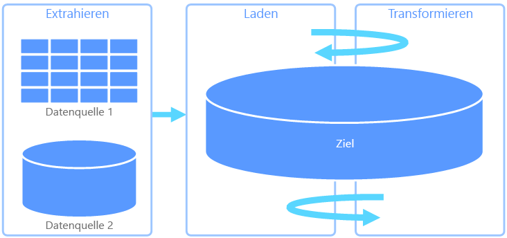
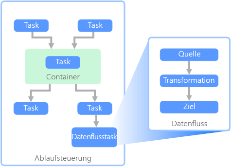

# Extrahieren, Transformieren und Laden (ETL)Extract, transform, and load (ETL)

Viele Organisationen fragen sich, wie sie Daten aus mehreren Datenquellen und in verschiedenen Formaten erfassen und in einzelne oder mehrere Datenspeicher verschieben können.A common problem that organizations face is how to gathering data from multiple sources, in multiple formats, and move it to one or more data stores. Das Ziel ist möglicherweise nicht die gleiche Art von Datenspeicher wie die Quelle, und häufig unterscheidet sich auch das Format, oder die Daten müssen vor dem Laden in das endgültige Ziel strukturiert oder bereinigt werden.The destination may not be the same type of data store as the source, and often the format is different, or the data needs to be shaped or cleaned before loading it into its final destination.

Zur Bewältigung dieser Herausforderungen wurden im Laufe der Jahre verschiedene Tools, Dienste und Prozesse entwickelt.Various tools, services, and processes have been developed over the years to help address these challenges. Unabhängig vom verwendeten Prozess muss im Allgemeinen die Arbeit koordiniert und ein gewisses Maß an Datentransformation innerhalb der Datenpipeline angewendet werden.No matter the process used, there is a common need to coordinate the work and apply some level of data transformation within the data pipeline. In den folgenden Abschnitten werden gängige Methoden für die Durchführung dieser Aufgaben erläutert.The following sections highlight the common methods used to perform these tasks.

## Extrahieren, Transformieren und Laden (ETL)Extract, transform, and load (ETL)

Extrahieren, Transformieren und Laden (ETL) ist eine Datenpipeline und wird verwendet, um Daten aus verschiedenen Quellen zu sammeln, gemäß den Geschäftsregeln zu transformieren und in einen Zieldatenspeicher zu laden.Extract, transform, and load (ETL) is a data pipeline used to collect data from various sources, transform the data according to business rules, and load it into a destination data store. Die Transformation in ETL findet in einem speziellen Modul statt und beinhaltet häufig die Verwendung von Stagingtabellen zur vorübergehenden Speicherung von Daten, während diese transformiert und schließlich in das Ziel geladen werden.The transformation work in ETL takes place in a specialized engine, and often involves using staging tables to temporarily hold data as it is being transformed and ultimately loaded to its destination.

Die durchgeführte Datentransformation umfasst in der Regel verschiedene Vorgänge wie Filtern, Sortieren, Aggregieren, Verknüpfen, Bereinigen, Deduplizieren und Validieren von Daten.The data transformation that takes place usually involves various operations, such as filtering, sorting, aggregating, joining data, cleaning data, deduplicating, and validating data.

Die drei ETL-Phasen werden häufig parallel ausgeführt, um Zeit zu sparen.Often, the three ETL phases are run in parallel to save time. Während der Datenextraktion kann also beispielsweise ein Transformationsprozess für bereits empfangene Daten ausgeführt werden, um die Daten für das Laden vorzubereiten, und ein Ladevorgang kann mit der Arbeit an den vorbereiteten Daten beginnen, anstatt auf den Abschluss des gesamten Extraktionsprozesses zu warten.For example, while data is being extracted, a transformation process could be working on data already received and prepare it for loading, and a loading process can begin working on the prepared data, rather than waiting for the entire extraction process to complete.

In Frage kommender Azure-Dienst:Relevant Azure service:
- [Azure Data Factory v2Azure Data Factory v2](https://azure.microsoft.com/services/data-factory/)

Weitere Tools:Other tools:
- [SQL Server Integration Services (SSIS)SQL Server Integration Services (SSIS)](/sql/integration-services/sql-server-integration-services)

## Extrahieren, Laden und Transformieren (ELT)Extract, load, and transform (ELT)

Extrahieren, Laden und Transformieren (ELT) unterscheidet sich von ETL lediglich darin, an welcher Stelle die Transformation erfolgt.Extract, load, and transform (ELT) differs from ETL solely in where the transformation takes place. In der ELT-Pipeline findet die Transformation im Zieldatenspeicher statt.In the ELT pipeline, the transformation occurs in the target data store. Die Daten werden mithilfe der Verarbeitungsfunktionen des Zieldatenspeichers transformiert, anstatt ein separates Transformationsmodul zu verwenden.Instead of using a separate transformation engine, the processing capabilities of the target data store are used to transform data. Dadurch wird das Transformationsmodul aus der Pipeline entfernt, was die Architektur vereinfacht.This simplifies the architecture by removing the transformation engine from the pipeline. Ein weiterer Vorteil dieses Ansatzes ist, dass durch Skalieren des Zieldatenspeichers auch die Leistung der ELT-Pipeline skaliert wird.Another benefit to this approach is that scaling the target data store also scales the ELT pipeline performance. ELT setzt jedoch voraus, dass das Zielsystem über genügend Leistung verfügt, um die Daten effizient transformieren zu können.However, ELT only works well when the target system is powerful enough to transform the data efficiently.

ELT kommt üblicherweise in Big Data-Szenarien zum Einsatz.Typical use cases for ELT fall within the big data realm. So können Sie beispielsweise zunächst alle Quelldaten in Flatfiles in einem skalierbaren Speicher wie HDFS (Hadoop Distributed File System) oder Azure Data Lake Store extrahieren.For example, you might start by extracting all of the source data to flat files in scalable storage such as Hadoop distributed file system (HDFS) or Azure Data Lake Store. Anschließend können Sie die Quelldaten mit Technologien wie Spark, Hive oder PolyBase abfragen.Technologies such as Spark, Hive, or PolyBase can then be used to query the source data. Entscheidend bei ELT ist, dass der für die Transformation verwendete Datenspeicher der gleiche Datenspeicher ist, in dem die Daten später auch genutzt werden.The key point with ELT is that the data store used to perform the transformation is the same data store where the data is ultimately consumed. Dieser Datenspeicher liest direkt aus dem skalierbaren Speicher, anstatt die Daten in seinen eigenen proprietären Speicher zu laden.This data store reads directly from the scalable storage, instead of loading the data into its own proprietary storage. Bei diesem Ansatz wird also der Datenkopierschritt aus ELT übersprungen, der bei umfangreichen Datasets sehr zeitaufwendig sein kann.This approach skips the data copy step present in ETL, which can be a time consuming operation for large data sets.

In der Praxis ist der Zieldatenspeicher ein [Data Warehouse](./data-warehousing.md) mit einem Hadoop-Cluster (Hive oder Spark) oder ein SQL Data Warehouse.In practice, the target data store is a [data warehouse](./data-warehousing.md) using either a Hadoop cluster (using Hive or Spark) or a SQL Data Warehouse. Im Allgemeinen wird bei der Abfrage ein Schema auf die Flatfiledaten angewendet und als Tabelle gespeichert, wodurch die Daten wie jede andere Tabelle im Datenspeicher abgefragt werden können.In general, a schema is overlaid on the flat file data at query time and stored as a table, enabling the data to be queried like any other table in the data store. Diese Tabellen werden als externe Tabellen bezeichnet, da sich die Daten nicht in dem Speicher befinden, der vom Datenspeicher selbst verwaltet wird, sondern in einem externen skalierbaren Speicher.These are referred to as external tables because the data does not reside in storage managed by the data store itself, but on some external scalable storage. 

Der Datenspeicher verwaltet nur das Schema der Daten und wendet es beim Lesen an.The data store only manages the schema of the data and applies the schema on read. Ein Hadoop-Cluster mit Hive beschreibt beispielsweise eine Hive-Tabelle, in der die Datenquelle im Grunde ein Pfad zu einer Gruppe von Dateien in HDFS ist.For example, a Hadoop cluster using Hive would describe a Hive table where the data source is effectively a path to a set of files in HDFS. In SQL Data Warehouse lässt sich mit PolyBase das gleiche Ergebnis erzielen: Es wird eine Tabelle für Daten erstellt, die außerhalb der eigentlichen Datenbank gespeichert sind.In SQL Data Warehouse, PolyBase can achieve the same result &mdash; creating a table against data stored externally to the database itself. Nach dem Laden der Quelldaten können die in externen Tabellen enthaltenen Daten mithilfe der Funktionen des Datenspeichers verarbeitet werden.Once the source data is loaded, the data present in the external tables can be processed using the capabilities of the data store. In Big Data-Szenarien muss der Datenspeicher für MPP (Massively Parallel Processing) geeignet sein. Dabei werden die Daten in kleinere Blöcke aufgeteilt, die dann parallel von mehreren Computern verarbeitet werden.In big data scenarios, this means the data store must be capable of massively parallel processing (MPP), which breaks the data into smaller chunks and distributes processing of the chunks across multiple machines in parallel.

In der letzten Phase der ELT-Pipeline werden die Quelldaten üblicherweise in ein endgültiges Format transformiert, das besser für die Arten von Abfragen geeignet ist, die unterstützt werden müssen.The final phase of the ELT pipeline is typically to transform the source data into a final format that is more efficient for the types of queries that need to be supported. So können die Daten beispielsweise partitioniert werden.For example, the data may be partitioned. ELT kann außerdem optimierte Speicherformate wie Parquet verwendet, das zeilenorientierte Daten spaltenförmig speichert und eine optimierte Indizierung bietet.Also, ELT might use optimized storage formats like Parquet, which stores row-oriented data in a columnar fashion and providess optimized indexing. 

In Frage kommender Azure-Dienst:Relevant Azure service:

- [Azure SQL Data WarehouseAzure SQL Data Warehouse](/azure/sql-data-warehouse/sql-data-warehouse-overview-what-is)
- [HDInsight mit HiveHDInsight with Hive](/azure/hdinsight/hadoop/hdinsight-use-hive)
- [Azure Data Factory v2Azure Data Factory v2](https://azure.microsoft.com/services/data-factory/)
- [Oozie in HDInsightOozie on HDInsight](/azure/hdinsight/hdinsight-use-oozie-linux-mac)

Weitere Tools:Other tools:

- [SQL Server Integration Services (SSIS)SQL Server Integration Services (SSIS)](/sql/integration-services/sql-server-integration-services)

## Datenfluss und AblaufsteuerungData flow and control flow

Im Datenpipelinekontext sorgt die Ablaufsteuerung für eine geordnete Verarbeitung einer Reihe von Tasks.In the context of data pipelines, the control flow ensures orderly processing of a set of tasks. Zur Erzwingung der korrekten Verarbeitungsreihenfolge dieser Tasks werden Rangfolgeneinschränkungen verwendet.To enforce the correct processing order of these tasks, precedence constraints are used. Diese Einschränkungen können Sie sich als Connectors in einem Workflowdiagramm vorstellen, wie in der folgenden Abbildung zu sehen.You can think of these constraints as connectors in a workflow diagram, as shown in the image below. Jeder Task hat ein Ergebnis wie „Erfolgreich“, „Fehler“ oder „Abschluss“.Each task has an outcome, such as success, failure, or completion. Die Verarbeitung nachfolgender Tasks wird erst initiiert, wenn der vorherige Task mit einem dieser Ergebnisse abgeschlossen wurde.Any subsequent task does not initiate processing until its predecessor has completed with one of these outcomes.

Ablaufsteuerungen führen Datenflüsse als Task aus.Control flows execute data flows as a task. In einem Datenflusstask werden Daten aus einer Quelle extrahiert, transformiert oder in einen Datenspeicher geladen.In a data flow task, data is extracted from a source, transformed, or loaded into a data store. Die Ausgabe eines einzelnen Datenflusstasks kann als Eingabe für den nächsten Datenflusstask verwendet werden, und Datenflüsse können parallel ausgeführt werden.The output of one data flow task can be the input to the next data flow task, and data flowss can run in parallel. Im Gegensatz zu Ablaufsteuerungen können zwischen Tasks in einem Datenfluss keine Einschränkungen hinzugefügt werden.Unlike control flows, you cannot add constraints between tasks in a data flow. Sie können jedoch einen Daten-Viewer hinzufügen, um die Daten zu beobachten, die durch die einzelnen Tasks verarbeitet werden.You can, however, add a data viewer to observe the data as it is processed by each task.

Das obige Diagramm enthält mehrere Tasks innerhalb der Ablaufsteuerung. Einer davon ist ein Datenflusstask.In the diagram above, there are several tasks within the control flow, one of which is a data flow task. Einer der Tasks ist in einen Container geschachtelt.One of the tasks is nested within a container. Container ermöglichen die Strukturierung von Tasks, um eine Arbeitseinheit bereitzustellen.Containers can be used to provide structure to tasks, providing a unit of work. Ein Beispiel wäre etwa die Wiederholung von Elementen in einer Sammlung (beispielsweise Dateien in einem Ordner oder Datenbankanweisungen).One such example is for repeating elements within a collection, such as files in a folder or database statements.

In Frage kommender Azure-Dienst:Relevant Azure service:
- [Azure Data Factory v2Azure Data Factory v2](https://azure.microsoft.com/services/data-factory/)

Weitere Tools:Other tools:
- [SQL Server Integration Services (SSIS)SQL Server Integration Services (SSIS)](/sql/integration-services/sql-server-integration-services)

## Auswahl der TechnologieTechnology choices

- [OLTP-Datenspeicher (Online Transaction Processing)Online Transaction Processing (OLTP) data stores](../technology-choices/oltp-data-stores.md)
- [OLAP-Datenspeicher (Online Analytical Processing)Online Analytical Processing (OLAP) data stores](../technology-choices/olap-data-stores.md)
- [Data WarehousesData warehouses](../technology-choices/data-warehouses.md)
- [PipelineorchestrierungPipeline orchestration](../technology-choices/pipeline-orchestration-data-movement.md)
