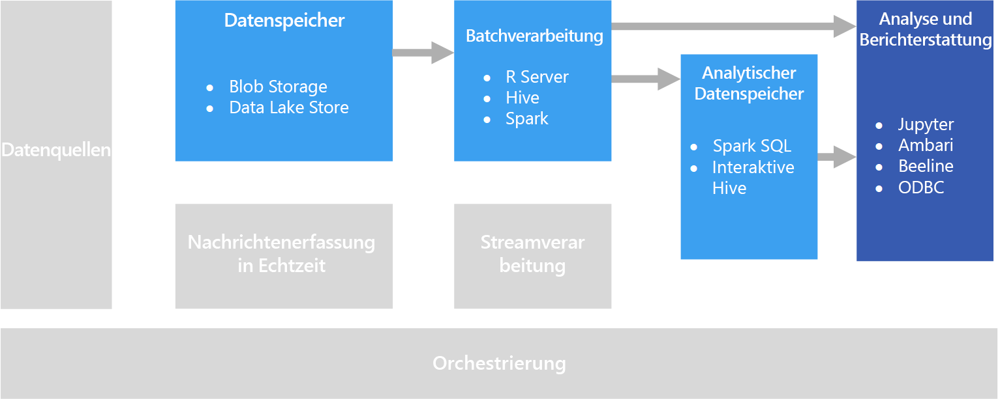

# Interaktive DatenuntersuchungInteractive data exploration

In vielen Business Intelligence-Lösungen (BI) von Unternehmen werden Berichte und Semantikmodelle von BI-Experten erstellt und zentral verwaltet.In many corporate business intelligence (BI) solutions, reports and semantic models are created by BI specialists and managed centrally. Immer häufiger möchten Organisationen es Benutzern aber ermöglichen, datengestützte Entscheidungen zu treffen.Increasingly, however, organizations want to enable users to make data-driven decisions. Außerdem stellen immer mehr Unternehmen *Data Scientists* oder *Datenanalysten* ein, deren Aufgabe darin besteht, Daten interaktiv zu untersuchen und Statistikmodelle und Analyseverfahren anzuwenden, um in den Daten Trends und Muster zu ermitteln.Additionally, a growing number of organizations are hiring *data scientists* or *data analysts*, whose job is to explore data interactively and apply statistical models and analytical techniques to find trends and patterns in the data. Bei der interaktiven Datenuntersuchung sind Tools und Plattformen erforderlich, die für Ad-hoc-Abfragen und Datenvisualisierungen eine Verarbeitung mit kurzen Wartezeiten ermöglichen.Interactive data exploration requires tools and platforms that provide low-latency processing for ad-hoc queries and data visualizations.

## Self-Service-Business IntelligenceSelf-service BI

Self-Service-Business Intelligence (Self-Service-BI) ist die Bezeichnung des modernen Ansatzes zum Treffen von Entscheidungen in Unternehmen, bei dem Benutzer in die Lage versetzt werden, aus Daten gewonnene Erkenntnisse zu ermitteln, zu untersuchen und für das gesamte Unternehmen bereitzustellen.Self-service BI is a name given to a modern approach to business decision making in which users are empowered to find, explore, and share insights from data across the enterprise. Hierfür muss die Datenlösung mehrere Anforderungen erfüllen:To accomplish this, the data solution must support several requirements:

* Ermittlung von Unternehmensdatenquellen über einen DatenkatalogDiscovery of business data sources through a data catalog.
* Masterdatenverwaltung zur Sicherstellung der Einheitlichkeit von Datenentitätsdefinitionen und -wertenMaster data management to ensure consistency of data entity definitions and values.
* Tools für die interaktive Datenmodellierung und Visualisierung für geschäftliche BenutzerInteractive data modeling and visualization tools for business users.

In einer Self-Service-BI-Lösung suchen und verwenden Benutzer normalerweise Datenquellen, die für ihren jeweiligen Geschäftsbereich relevant sind, und nutzen intuitive Tools und Produktivitätsanwendungen zum Definieren von persönlichen Datenmodellen und Berichten, die sie für Kollegen bereitstellen können.In a self-service BI solution, business users typically find and consume data sources that are relevant to their particular area of the business, and use intuitive tools and productivity applications to define personal data models and reports that they can share with their colleagues.

In Frage kommender Azure-Dienst:Relevant Azure services:

- [Azure Data CatalogAzure Data Catalog](/azure/data-catalog/data-catalog-what-is-data-catalog)
- [Microsoft Power BIMicrosoft Power BI](https://powerbi.microsoft.com/)

## Data Science-ExperimenteData science experimentation
Wenn eine Organisation Advanced Analytics und die Vorhersagemodellierung benötigt, wird die anfängliche Vorbereitung normalerweise von Data Science-Experten durchgeführt.When an organization requires advanced analytics and predictive modeling, the initial preparation work is usually undertaken by specialist data scientists. Ein Data Scientist untersucht die Daten und wendet Verfahren der statistischen Analyse an, um Beziehungen zwischen den *Features* der Daten und den gewünschten vorhergesagten *Bezeichnungen* zu ermitteln.A data scientist explores the data and applies statistical analytical techniques to find relationships between data *features* and the desired predicted *labels*. Für die Datenuntersuchung werden meist Programmiersprachen eingesetzt, z.B. Python oder R, die über eine native Unterstützung der statistischen Modellierung und Visualisierung verfügen.Data exploration is typically done using programming languages such as Python or R that natively support statistical modeling and visualization. Die für die Datenuntersuchung verwendeten Skripts werden normalerweise in speziellen Umgebungen gehostet, z.B. Jupyter-Notebooks.The scripts used to explore the data are typically hosted in specialized environments such as Jupyter Notebooks. Mit diesen Tools können Data Scientists die Daten programmgesteuert untersuchen und die gefundenen Erkenntnisse dokumentieren und bereitstellen.These tools enable data scientists to explore the data programmatically while documenting and sharing the insights they find.

In Frage kommender Azure-Dienst:Relevant Azure services:

- [Azure NotebooksAzure Notebooks](https://notebooks.azure.com/)
- [Azure Machine Learning StudioAzure Machine Learning Studio](/azure/machine-learning/studio/what-is-ml-studio)
- [Azure Machine Learning-Experimentieren-DiensteAzure Machine Learning Experimentation Services](/azure/machine-learning/preview/experimentation-service-configuration)
- [Einführung in Azure Data Science Virtual Machine für Linux und WindowsThe Data Science Virtual Machine](/azure/machine-learning/data-science-virtual-machine/overview)

## HerausforderungenChallenges

- **Einhaltung des Datenschutzes:****Data privacy compliance.** Gehen Sie mit Bedacht vor, wenn Sie für Benutzer persönliche Daten für die Self-Service-Analyse und -Berichterstellung bereitstellen.You need to be careful about making personal data available to users for self-service analysis and reporting. Aufgrund von Organisationsrichtlinien und gesetzlichen Bestimmungen können sich hierbei Compliance-Konflikte ergeben.There are likely to be compliance considerations, due to organizational policies and also regulatory issues. 

- **Datenvolumen:****Data volume.** Es kann zwar nützlich sein, Benutzern den Zugriff auf die gesamte Datenquelle zu gewähren, aber dies kann zu Excel- oder Power BI-Vorgängen mit sehr langer Ausführungsdauer oder zu Spark SQL-Abfragen führen, für die sehr viele Clusterressourcen verwendet werden.While it may be useful to give users access to the full data source, it can result in very long-running Excel or Power BI operations, or Spark SQL queries that use a lot of cluster resources.

- **Benutzerwissen:****User knowledge.** Benutzer erstellen ihre eigenen Abfragen und Aggregationen, um fundierte Geschäftsentscheidungen treffen zu können.Users create their own queries and aggregations in order to inform business decisions. Sind Sie sicher, dass die Benutzer über die erforderlichen Analyse- und Abfragefähigkeiten verfügen, die Sie zum Erzielen genauer Ergebnisse benötigen?Are you confident that users have the necessary analytical and querying skills to get accurate results?

- **Freigabe von Ergebnissen:****Sharing results.** Es kann Auswirkungen auf die Sicherheit haben, wenn Benutzer Berichte oder Datenvisualisierungen erstellen und freigeben können.There may be security considerations if users can create and share reports or data visualizations.

## ArchitectureArchitecture

Das Ziel bei diesem Szenario ist zwar die Unterstützung der interaktiven Datenanalyse, aber die Data Science-Aufgaben zur Datenbereinigung, Stichprobenerstellung und Strukturierung umfassen häufig Prozesse mit langer Ausführungsdauer.Although the goal of this scenario is to support interactive data analysis, the data cleansing, sampling, and structuring tasks involved in data science often include long-running processes. Aus diesem Grund ist die Verwendung einer Architektur mit [Batchverarbeitung](../big-data/batch-processing.md) sinnvoll.That makes a [batch processing](../big-data/batch-processing.md) architecture appropriate.

## Auswahl der TechnologieTechnology choices

Die folgenden Technologiekomponenten sind für die interaktive Datenuntersuchung in Azure zu empfehlen.The following technologies are recommended choices for interactive data exploration in Azure.

### DatenspeicherData storage

- **Azure Storage Blob-Container** oder **Azure Data Lake Store**:**Azure Storage Blob Containers** or **Azure Data Lake Store**. Data Scientists arbeiten im Allgemeinen mit Rohquelldaten, um sicherzustellen, dass sie Zugriff auf alle möglichen Features, Ausreißer und Fehler in den Daten haben.Data scientists generally work with raw source data, to ensure they have access to all possible features, outliers, and errors in the data. Bei einem Big Data-Szenario handelt es sich bei diesen Daten normalerweise um Dateien in einem Datenspeicher.In a big data scenario, this data usually takes the form of files in a data store.

Weitere Informationen finden Sie im Artikel zur [Datenspeicherung](../technology-choices/data-storage.md).For more information, see [Data storage](../technology-choices/data-storage.md).

### BatchverarbeitungBatch processing

- **R Server** oder **Spark**:**R Server** or **Spark**. Die meisten Data Scientists nutzen Programmiersprachen mit starker Unterstützung mathematischer und statistischer Pakete, z.B. R oder Python.Most data scientists use programming languages with strong support for mathematical and statistical packages, such as R or Python. Beim Arbeiten mit großen Datenmengen können Sie die Wartezeit reduzieren, indem Sie Plattformen verwenden, mit denen für diese Sprachen die verteilte Verarbeitung möglich ist.When working with large volumes of data, you can reduce latency by using platforms that enable these languages to use distributed processing. R Server kann allein oder zusammen mit Spark verwendet werden, um R-Verarbeitungsfunktionen horizontal hochzuskalieren, und Spark umfasst die native Unterstützung von Python für ähnliche Funktionen für das horizontale Hochskalieren in dieser Sprache.R Server can be used on its own or in conjunction with Spark to scale out R processing functions, and Spark natively supports Python for similar scale-out capabilities in that language.
- **Hive**:**Hive**. Hive ist eine gute Wahl zum Transformieren von Daten mit SQL-ähnlicher Semantik.Hive is a good choice for transforming data using SQL-like semantics. Benutzer können mithilfe von HiveQL-Anweisungen Tabellen erstellen und laden, die in semantischer Hinsicht SQL ähneln.Users can create and load tables using HiveQL statements, which are semantically similar to SQL.

Weitere Informationen finden Sie im Artikel zur [Batchverarbeitung](../technology-choices/batch-processing.md).For more information, see [Batch processing](../technology-choices/batch-processing.md).

### AnalysedatenspeicherAnalytical Data Store

- **Spark SQL**:**Spark SQL**. Spark SQL ist eine API, die auf Spark basiert und die Erstellung von Datenrahmen und Tabellen unterstützt, für die das Abfragen per SQL-Syntax möglich ist.Spark SQL is an API built on Spark that supports the creation of dataframes and tables that can be queried using SQL syntax. Unabhängig davon, ob die zu analysierenden Datendateien Rohquelldateien oder neue Dateien sind, die per Batchprozess bereinigt und vorbereitet wurden, können Benutzer für weitere Abfragen und Analysen Spark SQL-Tabellen dafür definieren.Regardless of whether the data files to be analyzed are raw source files or new files that have been cleaned and prepared by a batch process, users can define Spark SQL tables on them for further querying an analysis. 
- **Hive**:**Hive**. Zusätzlich zur Batchverarbeitung von Rohdaten per Hive können Sie eine Hive-Datenbank erstellen, die Hive-Tabellen und -Ansichten basierend auf den Ordnern enthält, in denen die Daten gespeichert sind. Auf diese Weise werden interaktive Abfragen für Analyse- und Berichterstellungszwecke ermöglicht.In addition to batch processing raw data by using Hive, you can create a Hive database that contains Hive tables and views based on the folders where the data is stored, enabling interactive queries for analysis and reporting. HDInsight enthält einen Interactive Hive-Clustertyp, für den die speicherinterne Zwischenspeicherung verwendet wird, um die Antwortzeiten für Hive-Abfragen zu reduzieren.HDInsight includes an Interactive Hive cluster type that uses in-memory caching to reduce Hive query response times. Benutzer, die sich mit SQL-ähnlicher Syntax auskennen, können Interactive Hive zum Untersuchen von Daten nutzen.Users who are comfortable with SQL-like syntax can use Interactive Hive to explore data.

Weitere Informationen finden Sie unter [Analysedatenspeicher](../technology-choices/analytical-data-stores.md).For more information, see [Analytical data stores](../technology-choices/analytical-data-stores.md).

### Analysen und BerichteAnalytics and reporting

- **Jupyter**:**Jupyter**. Jupyter-Notebooks verfügen über eine browserbasierte Oberfläche zum Ausführen von Code in Sprachen wie R, Python oder Scala.Jupyter Notebooks provides a browser-based interface for running code in languages such as R, Python, or Scala. Bei Verwendung von R Server oder Spark für die Batchverarbeitung von Daten oder von Spark SQL zum Definieren eines Schemas mit Tabellen für Abfragen kann Jupyter eine gute Wahl sein, um Abfragen für die Daten durchzuführen.When using R Server or Spark to batch process data, or when using Spark SQL to define a schema of tables for querying, Jupyter can be a good choice for querying the data. Bei der Nutzung von Spark können Sie die Spark Dataframe-Standard-API oder die Spark SQL-API sowie eingebettete SQL-Anweisungen verwenden, um die Daten abzufragen und Visualisierungen zu erstellen.When using Spark, you can use the standard Spark dataframe API or the Spark SQL API as well as embedded SQL statements to query the data and produce visualizations.
- **Interactive Hive-Clients**:**Interactive Hive Clients**. Bei Verwendung eines Interactive Hive-Clusters zum Abfragen der Daten können Sie die Hive-Ansicht im Ambari-Cluster-Dashboard, das Befehlszeilentool Beeline oder ein beliebiges ODBC-basiertes Tool (mit dem Hive ODBC-Treiber) nutzen, z.B. Microsoft Excel oder Power BI.If you use an Interactive Hive cluster to query the data, you can use the Hive view in the Ambari cluster dashboard, the Beeline command line tool, or any ODBC-based tool (using the Hive ODBC driver), such as Microsoft Excel or Power BI.

Weitere Informationen finden Sie im Artikel zur [Technologie für die Datenanalyse und Berichterstellung](../technology-choices/analysis-visualizations-reporting.md).For more information, see [Data analytics and reporting technology](../technology-choices/analysis-visualizations-reporting.md).