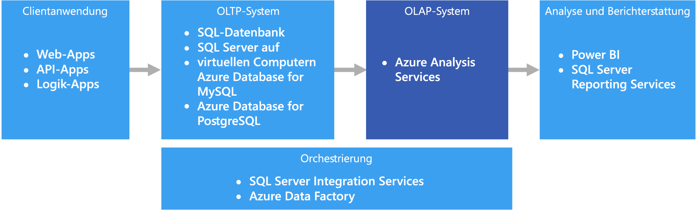

# Analytische Onlineverarbeitung (Online Analytical Processing, OLAP)

Die analytische Onlineverarbeitung (Online Analytical Processing, OLAP) ist eine Technologie, mit der große Geschäftsdatenbanken organisiert und komplexe Analysen unterstützt werden. OLAP kann genutzt werden, um komplexe analytische Abfragen durchzuführen, ohne dass Transaktionssysteme negativ beeinträchtigt werden.

Die Datenbanken, die von einem Unternehmen zum Speichern aller Transaktionen und Datensätze verwendet werden, werden als Datenbanken mit [Onlinetransaktionsverarbeitung (Online Transaction Processing, OLTP)](online-transaction-processing.md) bezeichnet. Diese Datenbanken enthalten normalerweise Datensätze, die einzeln eingegeben werden. Häufig befinden sich darin viele Informationen, die nützlich für die Organisation sind. Die Datenbanken, die für OLTP genutzt werden, wurden dagegen nicht für Analysezwecke entworfen. Daher ist das Abrufen von Antworten aus diesen Datenbanken sehr zeitintensiv und aufwändig. OLAP-Systeme sind dafür ausgelegt, diese Business Intelligence-Informationen mit hoher Leistung aus den Daten zu extrahieren. Der Grund ist, dass OLAP-Datenbanken für Workloads mit hohem Lese- und geringem Schreibaufwand optimiert sind.

 

## Einsatz dieser Lösung

Erwägen Sie in den folgenden Szenarien die Verwendung von OLAP:

- Sie müssen schnell komplexe Analyse- und Ad-hoc-Abfragen durchführen können, ohne dass sich negative Auswirkungen auf Ihre OLTP-Systeme ergeben. 
- Sie möchten geschäftlichen Benutzern das einfache Erstellen von Berichten aus Ihren Daten ermöglichen.
- Sie möchten eine Reihe von Aggregationen bereitstellen, damit Benutzer schnelle, einheitliche Ergebnisse erhalten. 

OLAP ist besonders nützlich zum Anwenden von Aggregatberechnungen auf große Datenmengen. OLAP-Systeme sind für Szenarien mit hohem Leseaufwand optimiert, z.B. Analytics und Business Intelligence. OLAP ermöglicht Benutzern das Segmentieren von mehrdimensionalen Daten in Slices, die in zwei Dimensionen (z.B. einer PivotTable) angezeigt werden können, oder das Filtern der Daten nach bestimmten Werten. Dieser Prozess wird im Englischen auch als „Slicing & Dicing“ der Daten bezeichnet und kann unabhängig davon erfolgen, ob die Daten über mehrere Datenquellen hinweg partitioniert sind. Benutzer können Trends ermitteln, Muster erkennen und die Daten untersuchen, ohne die Details der herkömmlichen Datenanalyse kennen zu müssen.

[Semantikmodelle](../concepts/semantic-modeling.md) können Benutzern als Unterstützung beim Abstrahieren von komplexen Beziehungen dienen und das schnelle Analysieren von Daten vereinfachen.

## Herausforderungen

Neben den vielen Vorteilen von OLAP-Systemen sind auch einige Herausforderungen zu bewältigen:

- Während Daten in OLTP-Systemen aufgrund der eingehenden Transaktionen aus verschiedenen Quellen ständig aktualisiert werden, werden OLAP-Datenquellen meist in deutlich längeren Abständen aktualisiert. Dies richtet sich nach den geschäftlichen Anforderungen. OLAP-Systeme sind also besser für strategische Geschäftsentscheidungen und nicht so sehr für direkte Reaktionen auf Veränderungen geeignet. Außerdem muss ein bestimmtes Maß an Bereinigung und Orchestrierung eingeplant werden, um die OLAP-Datenspeicher auf dem neuesten Stand zu halten.
- Im Gegensatz zu herkömmlichen, normalisierten, relationalen Tabellen in OLTP-Systemen sind OLAP-Datenmodelle eher mehrdimensional. Hierdurch wird es schwierig oder sogar unmöglich, eine direkte Zuordnung zu Entitätsbeziehungs- oder objektorientierten Modellen vorzunehmen, bei denen jedes Attribut einer Spalte zugeordnet wird. Für OLAP-Systeme wird anstelle der herkömmlichen Normalisierung stattdessen normalerweise ein Stern- oder Schneeflockenschema verwendet.

## OLAP in Azure

In Azure werden Daten, die in OLTP-Systemen vorgehalten werden, z.B. Azure SQL-Datenbank, in das OLAP-System kopiert, z.B. [Azure Analysis Services](/azure/analysis-services/analysis-services-overview). Tools für die Datenuntersuchung und Visualisierung, z.B. [Power BI](https://powerbi.microsoft.com), Excel und Drittanbieteroptionen, stellen eine Verbindung mit Analysis Services-Servern her und ermöglichen Benutzern extrem interaktive und visuell umfassende Einblicke in die modellierten Daten. Der Datenfluss von OLTP-Daten zu OLAP wird normalerweise über SQL Server Integration Services orchestriert, die mit [Azure Data Factory](/azure/data-factory/concepts-integration-runtime) ausgeführt werden können.

## Auswahl der Technologie

- [OLAP-Datenspeicher (Online Analytical Processing)](../technology-choices/olap-data-stores.md)

