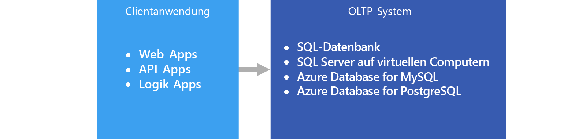

# Onlinetransaktionsverarbeitung (OLTP)Online transaction processing (OLTP)

Die Verwaltung von [Transaktionsdaten](../concepts/transactional-data.md) mithilfe von Computersystemen wird als Onlinetransaktionsverarbeitung (Online Transaction Processing, OLTP) bezeichnet.The management of [transactional data](../concepts/transactional-data.md) using computer systems is referred to as Online Transaction Processing (OLTP). OLTP-Systeme zeichnen Geschäftsinteraktionen auf, die im täglichen Betrieb der Organisation bzw. des Unternehmens stattfinden, und unterstützen das Abfragen dieser Daten, um Rückschlüsse zu ziehen.OLTP systems record business interactions as they occur in the day-to-day operation of the organization, and support querying of this data to make inferences.

## Verwendung dieser LösungWhen to use this solution

OLTP ist die geeignete Wahl, wenn Sie Geschäftstransaktionen effizient verarbeiten und speichern und sofort auf konsistente Weise für Clientanwendungen verfügbar machen müssen.Choose OLTP when you need to efficiently process and store business transactions and immediately make them available to client applications in a consistent way. Verwenden Sie diese Architektur, wenn sich spürbare Verzögerungen bei der Verarbeitung negativ auf den täglichen Betrieb des Unternehmens auswirken würden.Use this architecture when any tangible delay in processing would have a negative impact on the day-to-day operations of the business.

OLTP-Systeme sind zur effizienten Verarbeitung und Speicherung von Transaktionen sowie zum effizienten Abfragen von Transaktionsdaten konzipiert.OLTP systems are designed to efficiently process and store transactions, as well as query transactional data. Die effiziente Verarbeitung und Speicherung einzelner Transaktionen durch ein OLTP-System wird zum Teil durch Datennormalisierung erzielt, d. h. die Aufteilung der Daten in kleinere weniger redundante Blöcke.The goal of efficiently processing and storing individual transactions by an OLTP system is partly accomplished by data normalization &mdash; that is, breaking the data up into smaller chunks that are less redundant. Dies steigert die Effizienz, da das OLTP-System so eine große Anzahl von Transaktionen unabhängig voneinander verarbeiten kann und die zusätzliche Verarbeitung entfällt, die zum Aufrechterhalten der Datenintegrität erforderlich ist, wenn redundante Daten vorhanden sind.This supports efficiency because it enables the OLTP system to process large numbers of transactions independently, and avoids extra processing needed to maintain data integrity in the presence of redundant data.

## HerausforderungenChallenges
Die Implementierung und Verwendung eines OLTP-Systems kann einige Herausforderungen mit sich bringen:Implementing and using an OLTP system can create a few challenges:

- OLTP-Systeme eignen sich nicht immer gut zum Verarbeiten von Aggregaten für große Datenmengen, es gibt jedoch Ausnahmen, beispielsweise eine sorgfältig geplante SQL Server-basierte Lösung.OLTP systems are not always good for handling aggregates over large amounts of data, although there are exceptions, such as a well-planned SQL Server-based solution. Analysen der Daten, die auf Aggregatberechnungen für Millionen einzelner Transaktionen beruhen, sind für ein OLTP-System sehr ressourcenintensiv.Analytics against the data, that rely on aggregate calculations over millions of individual transactions, are very resource intensive for an OLTP system. Ihre Ausführung kann viel Zeit in Anspruch nehmen und andere Transaktionen in der Datenbank verlangsamen oder blockieren.They can be slow to execute and can cause a slow-down by blocking other transactions in the database.
- Bei der Ausführung von Analysen und Erstellung von Berichten für stark normalisierte Daten sind die Abfragen in der Regel komplex, da die meisten Abfragen die Daten mithilfe von Verknüpfungen denormalisieren müssen.When conducting analytics and reporting on data that is highly normalized, the queries tend to be complex, because most queries need to de-normalize the data by using joins. Zudem erfordern die Namenskonventionen für Datenbankobjekte in OLTP-Systemen oft sehr kurze und prägnante Namen.Also, naming conventions for database objects in OLTP systems tend to be terse and succinct. Die stärkere Normalisierung in Verbindung mit diesen Namenskonventionen macht es für Geschäftsbenutzer schwierig, OLTP-Systeme ohne die Hilfe eines Datenbankadministrators oder Datenentwicklers abzufragen.The increased normalization coupled with terse naming conventions makes OLTP systems difficult for business users to query, without the help of a DBA or data developer.
- Das unbegrenzte Speichern des Verlaufs von Transaktionen und das Speichern von zu vielen Daten in einer Tabelle können je nach Anzahl gespeicherter Transaktionen die Abfrageleistung beeinträchtigen.Storing the history of transactions indefinitely and storing too much data in any one table can lead to slow query performance, depending on the number of transactions stored. Die allgemeine Lösung besteht darin, ein relevantes Zeitfenster (z. B. das aktuelle Geschäftsjahr) im OLTP-System zu verwalten und historische Daten in andere Systeme auszulagern, beispielsweise in einen Data Mart oder ein [Data Warehouse](../technology-choices/data-warehouses.md).The common solution is to maintain a relevant window of time (such as the current fiscal year) in the OLTP system and offload historical data to other systems, such as a data mart or [data warehouse](../technology-choices/data-warehouses.md).

## OLTP in AzureOLTP in Azure

Anwendungen wie in [App Service-Web-Apps](/azure/app-service/app-service-web-overview) gehostete Websites, in App Service ausgeführte REST-APIs, mobile Anwendungen oder Desktopanwendungen kommunizieren in der Regel über eine REST-API-Zwischenstufe mit dem OLTP-System.Applications such as websites hosted in [App Service Web Apps](/azure/app-service/app-service-web-overview), REST APIs running in App Service, or mobile or desktop applications communicate with the OLTP system, typically via a REST API intermediary.

In der Praxis sind die meisten Workloads keine reinen OLTP-Workloads.In practice, most workloads are not purely OLTP. Meist gibt es auch eine [analytische Komponente](../scenarios/online-analytical-processing.md).There tends to be an [analytical component](../scenarios/online-analytical-processing.md) as well. Darüber hinaus besteht ein zunehmender Bedarf an Funktionen zur Echtzeit-Berichterstellung, beispielsweise zur Ausführung von Berichten für das Betriebssystem.In addition, there is an increasing demand for real-time reporting, such as running reports against the operational system. Dies wird auch als HTAP (Hybrid Transactional and Analytical Processing, hybride Verarbeitung von Transaktionen und Analysen) bezeichnet.This is also referred to as HTAP (Hybrid Transactional and Analytical Processing). Weitere Informationen finden Sie unter [Auswählen eines OLAP-Datenspeichers in Azure](../technology-choices/olap-data-stores.md).For more information, see [Online Analytical Processing (OLAP) data stores](../technology-choices/olap-data-stores.md).

## Auswahl der TechnologieTechnology choices

Datenspeicher:Data storage:

- [Azure SQL-DatenbankAzure SQL Database](/azure/sql-database/)
- [SQL Server auf einer Azure-VMSQL Server in an Azure VM](/azure/virtual-machines/windows/sql/virtual-machines-windows-sql-server-iaas-overview?toc=%2Fazure%2Fvirtual-machines%2Fwindows%2Ftoc.json)
- [Azure Database for MySQLAzure Database for MySQL](/azure/mysql/)
- [Azure-Datenbank für PostgreSQLAzure Database for PostgreSQL](/azure/postgresql/)

Weitere Informationen finden Sie unter [Auswählen eines OLTP-Datenspeichers in Azure](../technology-choices/oltp-data-stores.md).For more information, see [Choosing an OLTP data store](../technology-choices/oltp-data-stores.md)

Datenquellen:Data sources:

- [App ServiceApp service](/azure/app-service/)
- [Mobile AppsMobile Apps](/azure/app-service-mobile/)

