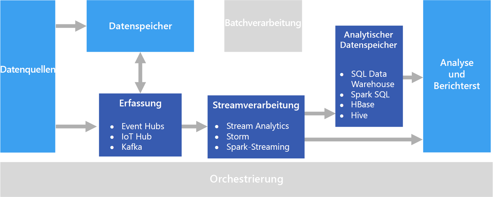

# Verarbeitung in Echtzeit

Bei der Verarbeitung in Echtzeit geht es um Datenströme, die in Echtzeit erfasst und mit minimaler Wartezeit verarbeitet werden, um Berichte oder automatisierte Antworten in Echtzeit (bzw. nahezu in Echtzeit) zu erstellen. Für eine Lösung zur Echtzeitüberwachung von Datenverkehr werden unter Umständen Sensordaten zum Erkennen von hohen Datenverkehrsvolumen eingesetzt. Diese Daten können genutzt werden, um eine Karte dynamisch zu aktualisieren und Staus anzuzeigen oder Fahrgemeinschaftsspuren oder andere Verkehrsleitsysteme automatisch zu initiieren.

Die Echtzeitverarbeitung ist als die Verarbeitung eines ungebundenen Eingabedatenstroms definiert, dessen Daten mit sehr kurzen Wartezeiten verarbeitet werden müssen (im Millisekunden- oder Sekundenbereich). Diese eingehenden Daten liegen meist in einem unstrukturierten oder halbstrukturierten Format vor, z.B. JSON, und es gelten die gleichen Verarbeitungsanforderungen wie bei der [Batchverarbeitung](./batch-processing.md), aber mit kürzeren Dauern, um die Nutzung in Echtzeit zu unterstützen.

Verarbeitete Daten werden häufig in einen Analysedatenspeicher geschrieben, der für Analytics- und Visualisierungszwecke optimiert ist. Die verarbeiteten Daten können zur Analyse auch direkt auf der Analytics- und Berichterstellungsebene erfasst werden, um Analysen, Business Intelligence-Vorgänge und die Echtzeitvisualisierung im Dashboard durchzuführen.

## Herausforderungen

Eine der größten Herausforderungen von Lösungen für die Echtzeitverarbeitung ist das Erfassen, Verarbeiten und Speichern von Nachrichten in Echtzeit, vor allem bei großen Mengen. Die Verarbeitung muss so erfolgen, dass die Erfassungspipeline nicht blockiert wird. Der Datenspeicher muss Schreibvorgänge mit hohem Volumen unterstützen. Eine weitere Herausforderung ist die Ermöglichung einer schnellen Reaktion auf die Daten, z.B. das Generieren von Warnungen in Echtzeit oder das Anzeigen der Daten in einem Echtzeit-Dashboard (bzw. nahezu in Echtzeit).

## Architektur

Eine Architektur für die Echtzeitverarbeitung verfügt über die folgenden logischen Komponenten.

- **Echtzeiterfassung von Nachrichten:** Die Architektur muss eine Möglichkeit zum Erfassen und Speichern von Echtzeitnachrichten enthalten, um von einem Consumer für die Datenstromverarbeitung genutzt werden zu können. In einfachen Fällen kann dieser Dienst als einfacher Datenspeicher implementiert werden, in dem neue Nachrichten in einem Ordner aufbewahrt werden. Häufig ist für die Lösung aber ein Nachrichtenbroker erforderlich, z.B. Azure Event Hubs, der als Puffer für die Nachrichten fungiert. Der Nachrichtenbroker sollte die Verarbeitung der horizontalen Skalierung und die zuverlässige Übermittlung unterstützen.

- **Datenstromverarbeitung:** Die erfassten Echtzeitnachrichten müssen von der Lösung verarbeitet werden, indem die Daten gefiltert, aggregiert und anderweitig auf die Analyse vorbereitet werden.

- **Analysedatenspeicher:** Viele Big Data-Lösungen sind so konzipiert, dass Daten für die Analyse vorbereitet und die verarbeiteten Daten dann in einem strukturierten Format bereitgestellt werden, das mithilfe von Analysetools abgefragt werden kann. 

- **Analysen und Berichte:** Ziel der meisten Big Data-Lösungen ist es, über Analysen und Berichte Einblicke in die Daten zu gewinnen. 

## Auswahl der Technologie

Die folgende Technologie wird für Lösungen für die Echtzeitverarbeitung in Azure empfohlen.

### Echtzeiterfassung von Nachrichten

- **Azure Event Hubs**: Azure Event Hubs ist eine Message Queuing-Lösung zum Erfassen von Millionen von Ereignismeldungen pro Sekunde. Die erfassten Ereignisdaten können von mehreren Consumern parallel verarbeitet werden.
- **Azure IoT Hub**: Azure IoT Hub ermöglicht die bidirektionale Kommunikation zwischen Geräten mit Internetverbindung und stellt eine skalierbare Nachrichtenwarteschlange bereit, mit der Millionen von gleichzeitig verbundenen Geräten verarbeitet werden können.
- **Apache Kafka**: Kafka ist eine Open-Source-Anwendung für Message Queuing und Datenstromverarbeitung, die skaliert werden kann, um Millionen von Nachrichten pro Sekunde von mehreren Nachrichtenproducern zu verarbeiten und an mehrere Consumer zu leiten. Kafka ist in Azure als HDInsight-Clustertyp verfügbar.

Weitere Informationen finden Sie unter [Echtzeiterfassung von Nachrichten](../technology-choices/real-time-ingestion.md).

### Datenspeicher

- **Azure Storage Blob-Container** oder **Azure Data Lake Store**. Eingehende Echtzeitdaten werden normalerweise in einem Nachrichtenbroker erfasst (siehe oben). In einigen Szenarien kann es aber sinnvoll sein, einen Ordner auf neue Dateien zu überwachen und diese zu verarbeiten, wenn sie erstellt oder aktualisiert werden. Außerdem werden in vielen Lösungen für die Echtzeitverarbeitung Streamingdaten mit statischen Referenzdaten kombiniert, die in einem Dateispeicher gespeichert werden können. Zudem kann der Dateispeicher auch als Ausgabeziel für erfasste Echtzeitdaten zur Archivierung oder für die weitere Batchverarbeitung in einer [Lambda-Architektur](../concepts/big-data.md#lambda-architecture) verwendet werden.

Weitere Informationen finden Sie unter [Datenspeicher](../technology-choices/data-storage.md).

### Datenstromverarbeitung

- **Azure Stream Analytics**: Mit Azure Stream Analytics können für einen ungebundenen Datenstrom unbefristete Abfragen ausgeführt werden. Diese Abfragen nutzen Datenströme von Speicher oder Nachrichtenbrokern, filtern und aggregieren die Daten basierend auf temporalen Fenstern und schreiben die Ergebnisse in Senken, z.B. Speicher, Datenbanken oder direkt in Berichte in Power BI.
- **Storm**: Apache Storm ist ein Open-Source-Framework für die Datenstromverarbeitung, bei dem eine Topologie mit so genannten Spouts und Bolts verwendet wird, um die Ergebnisse der Datenquellen von Echtzeitdatenströmen zu nutzen, zu verarbeiten und auszugeben. Sie können Storm in einem Azure HDInsight-Cluster bereitstellen und eine Topologie in Java oder C# implementieren.
- **Spark Streaming**: Apache Spark ist eine verteilte Open-Source-Plattform für die allgemeine Datenverarbeitung. Spark stellt die Spark Streaming-API bereit, in der Sie Code in allen unterstützten Spark-Sprachen schreiben können, z.B. Java, Scala und Python. Mit Spark 2.0 wurde die Spark Structured Streaming-API eingeführt, die über ein einfacheres und einheitlicheres Programmiermodell verfügt. Spark 2.0 ist in einem Azure HDInsight-Cluster verfügbar.

Weitere Informationen finden Sie unter [Streamverarbeitung](../technology-choices/stream-processing.md).

### Analysedatenspeicher

- **SQL Data Warehouse**, **HBase**, **Spark** oder **Hive**. Verarbeitete Echtzeitdaten können in einer relationalen Datenbank, z.B. Azure SQL Data Warehouse, einem NoSQL-Speicher, z.B. HBase, oder als Dateien in einem verteilten Speicher gespeichert werden, für den Spark- oder Hive-Tabellen definiert und abgefragt werden können.

Weitere Informationen finden Sie unter [Analysedatenspeicher](../technology-choices/analytical-data-stores.md).

### Analysen und Berichte

- **Azure Analysis Services**, **Power BI** und **Microsoft Excel**. Verarbeitete Echtzeitdaten, die sich in einem Analysedatenspeicher befinden, können auf die gleiche Weise wie Batchverarbeitungsdaten für die Verlaufsberichterstellung und Analyse genutzt werden. Außerdem kann Power BI verwendet werden, um Echtzeitberichte und -visualisierungen (bzw. nahezu in Echtzeit) aus Analysedatenquellen zu veröffentlichen, für die die Wartezeit ausreichend kurz ist, oder in einigen Fällen auch direkt aus der Ausgabe der Datenstromverarbeitung.

Weitere Informationen finden Sie unter [Analysen und Berichte](../technology-choices/analysis-visualizations-reporting.md).

In einer reinen Echtzeitlösung wird der Großteil der Verarbeitungsorchestrierung von den Komponenten für die Nachrichtenerfassung und Datenstromverarbeitung verwaltet. Bei einer Lambda -Architektur, in der Batch- und Echtzeitverarbeitung kombiniert sind, müssen Sie ggf. ein Orchestrierungsframework wie Azure Data Factory oder Apache Oozie und Sqoop verwenden, um Batchworkflows für erfasste Echtzeitdaten zu verwalten.

