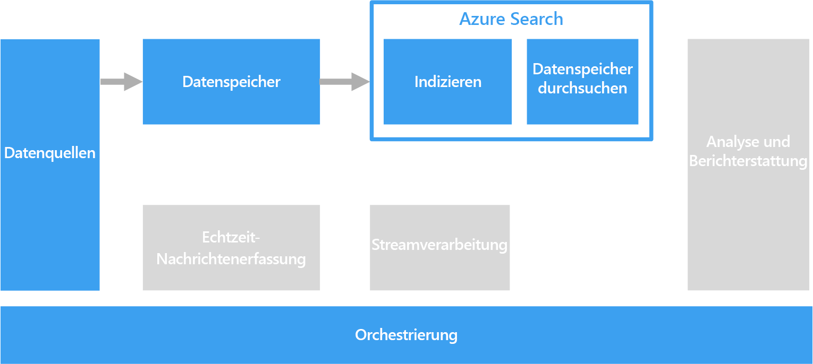

# Verarbeiten von Freitext für die Suche

Zur Unterstützung der Suche kann für Dokumente, die Textabschnitte enthalten, eine Freitextverarbeitung ausgeführt werden.

Die Textsuche erstellt einen speziellen Index, der anhand einer Sammlung von Dokumenten vorausberechnet wird. Eine Clientanwendung sendet eine Abfrage, die die Suchbegriffe enthält. Die Abfrage gibt als Resultset eine Liste von Dokumenten zurück, die nach der Übereinstimmung der einzelnen Dokumente mit den Suchkriterien sortiert ist. Das Resultset kann auch den Kontext enthalten, in dem das Dokument den Kriterien entspricht, sodass die Anwendung den übereinstimmenden Ausdruck im Dokument hervorheben kann. 

Die Freitextverarbeitung kann aus großen Mengen von Textdaten, die viele irrelevante Informationen enthalten, nützliche, handlungsrelevante Daten erzeugen. Die Ergebnisse können unstrukturierte Dokumente sowie eine klar definierte und abfragbare Struktur liefern.

## Herausforderungen

- Die Verarbeitung einer Sammlung von Freitextdokumenten ist in der Regel sowohl rechen- als auch zeitintensiv.
- Um eine effektive Suche in Freitext zu ermöglichen, muss der Suchindex die Fuzzysuche anhand von Begriffen mit ähnlicher Struktur unterstützen. Suchindizes werden beispielsweise mit Lemmatisierung und Wortstammerkennung erstellt, sodass bei Abfragen nach „ausführen“ Dokumente gefunden werden, die „ausgeführt“ und „Ausführung“ enthalten.

## Architecture

In den meisten Szenarien werden die Quelltextdokumente in den Objektspeicher geladen, beispielsweise Azure Storage oder Azure Data Lake Store. Eine Ausnahme ist die Verwendung der Volltextsuche in SQL Server oder Azure SQL-Datenbank. In diesem Fall werden die Dokumentdaten in Tabellen geladen, die von der Datenbank verwaltet werden. Nach dem Speichern werden die Dokumente in einem Batch verarbeitet, um den Index zu erstellen.

## Auswahl der Technologie

Zu den Optionen für die Erstellung eines Suchindex zählen Azure Search, Elasticsearch und HDInsight mit Solr. Jede dieser Technologien kann einen Suchindex aus einer Sammlung von Dokumenten auffüllen. Azure Search bietet Indexer, die den Index für unterschiedlichste Dokumente automatisch auffüllen können, angefangen bei Nur-Text in Excel bis hin zu PDF-Formaten. Für HDInsight kann Apache Solr Binärdateien vieler Typen indizieren, einschließlich Nur-Text-, Word- und PDF-Dateien. Nachdem der Index erstellt wurde, können Clients über eine REST-API auf die Suchschnittstelle zugreifen. 

Falls Ihre Textdaten in SQL Server oder Azure SQL-Datenbank gespeichert sind, können Sie die integrierte Volltextsuche der Datenbank verwenden. Die Datenbank füllt den Index aus Text-, Binär- oder XML-Daten auf, die in derselben Datenbank gespeichert sind. Clients führen die Suche mithilfe von T-SQL-Abfragen durch. 

Weitere Informationen finden Sie unter [Search data stores](../technology-choices/search-options.md) (Datenspeicher für die Suche).
