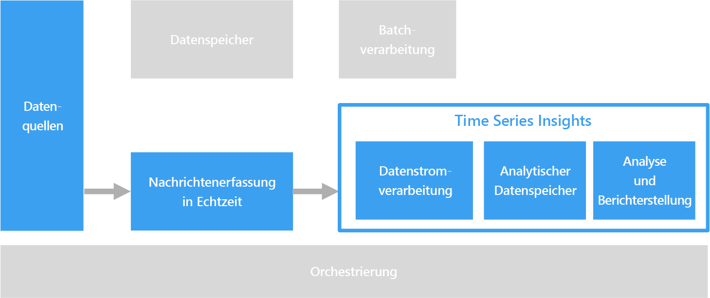

# ZeitreihenlösungenTime series solutions

Bei Zeitreihendaten handelt es sich um eine nach Zeit strukturierte Gruppe von Werten.Time series data is a set of values organized by time. Beispiele für Zeitreihendaten sind Sensordaten, Aktienkurse, Clickstreamdaten und Anwendungstelemetriedaten.Examples of time series data include sensor data, stock prices, click stream data, and application telemetry. Durch die Analyse von Zeitreihendaten können historische Trends ermittelt, Warnungen in Echtzeit generiert oder Vorhersagemodelle erstellt werden.Time series data can be analyzed for historical trends, real-time alerts, or predictive modeling.

 

Zeitreihendaten stellen dar, wie eine Ressource oder ein Prozess sich im Zeitablauf ändert.Time series data represents how an asset or process changes over time. Die Daten besitzen einen Zeitstempel, und Zeit ist die aussagekräftigste Achse für die Betrachtung oder Analyse der Daten.The data has a timestamp, but more importantly, time is the most meaningful axis for viewing or analyzing the data. Zeitreihendaten gehen normalerweise in zeitlich korrekter Reihenfolge ein und werden in der Regel als Einfügung und nicht als Aktualisierung der Datenbank behandelt.Time series data typically arrives in order of time and is usually treated as an insert rather than an update to your database. Veränderungen werden also im Zeitverlauf gemessen, wodurch Sie sich die Daten aus der Vergangenheit ansehen und zukünftige Veränderungen vorhersagen können.Because of this, change is measured over time, enabling you to look backward and to predict future change. Zeitreihendaten lassen sich somit am besten mit Punkt- oder Liniendiagrammen visualisieren.As such, time series data is best visualized with scatter or line charts.

Im Anschluss folgen einige Beispiele für Zeitreihendaten:Some examples of time series data are:

- Im Zeitverlauf erfasste Aktienkurse zur Erkennung von TrendsStock prices captured over time to detect trends.
- Serverleistung wie CPU-Auslastung, E/A-Last, Arbeitsspeicherauslastung und Auslastung der NetzwerkbandbreiteServer performance, such as CPU usage, I/O load, memory usage, and network bandwidth consumption.
- Telemetriedaten von Sensoren an Industriemaschinen zur Erkennung eines bevorstehenden Ausfalls und Auslösung von WarnbenachrichtigungenTelemetry from sensors on industrial equipment, which can be used to detect pending equipment failure and trigger alert notifications.
- Echtzeittelemetriedaten eines Fahrzeugs wie Geschwindigkeit, Bremsen und Beschleunigen über einen bestimmen Zeitraum, um eine aggregierte Risikobewertung für den Fahrer zu erzeugenReal-time car telemetry data including speed, braking, and acceleration over a time window to produce an aggregate risk score for the driver.

Wie Sie sehen, ist in jedem dieser Fälle Zeit die sinnvollste Achse.In each of these cases, you can see how time is most meaningful as an axis. Die Darstellung der Ereignisse in der Reihenfolge ihres Eintreffens ist ein zentrales Merkmal von Zeitreihendaten, da sich dadurch eine natürliche zeitliche Sortierung ergibt.Displaying the events in the order in which they arrived is a key characteristic of time series data, as there is a natural temporal ordering. Dies unterscheidet sich von Daten, die für OLTP-Standarddatenpipelines erfasst werden. Dort können die Daten in beliebiger Reihenfolge eingefügt und jederzeit aktualisiert werden.This differs from data captured for standard OLTP data pipelines where data can be entered in any order, and updated at any time.

## Verwendung dieser LösungWhen to use this solution

Entscheiden Sie sich für eine Zeitreihenlösung, wenn Sie Daten erfassen müssen, deren strategischer Nutzen auf Veränderungen im Zeitverlauf zurückgeht, und Sie hauptsächlich neue Daten einfügen und nur ganz selten Aktualisierungen vornehmen (wenn überhaupt).Choose a time series solution when you need to ingest data whose strategic value is centered around changes over a period of time, and you are primarily inserting new data and rarely updating, if at all. Auf der Grundlage dieser Informationen können Sie unter anderem Anomalien erkennen, Trends visualisieren und aktuelle Daten mit historischen Daten vergleichen.You can use this information to detect anomalies, visualize trends, and compare current data to historical data, among other things. Diese Art von Architektur eignet sich zudem am besten für Vorhersagemodelle und Ergebnisprognosen, da Sie über einen Änderungsverlauf verfügen, der in verschiedensten Vorhersagemodellen genutzt werden kann.This type of architecture is also best suited for predictive modeling and forecasting results, because you have the historical record of changes over time, which can be applied to any number of forecasting models. 

Die Verwendung von Zeitreihen bietet folgende Vorteile:Using time series offers the following benefits:

* Eindeutige Darstellung der Veränderungen einer Ressource oder eines Prozesses im ZeitverlaufClearly represents how an asset or process changes over time.
* Schnelle Erkennung von Veränderungen für eine Reihe verwandter Quellen, wodurch Anomalien und sich entwickelnde Trends deutlich sichtbar werdenHelps you quickly detect changes to a number of related sources, making anomalies and emerging trends clearly stand out.
* Beste Option für Vorhersagemodelle und PrognosenBest suited for predictive modeling and forecasting.

### Internet der Dinge (IoT, Internet of Things)Internet of Things (IoT)

Von IoT-Geräten gesammelte Daten eignen sich bestens für die Speicherung und Analyse von Zeitreihendaten.Data collected by IoT devices is a natural fit for time series storage and analysis. Die eingehenden Daten werden eingefügt und selten aktualisiert (wenn überhaupt).The incoming data is inserted and rarely, if ever, updated. Die Daten werden mit einem Zeitstempel versehen und in der Reihenfolge eingefügt, in der sie empfangen wurden. Darüber hinaus werden diese Daten üblicherweise in chronologischer Reihenfolge angezeigt, sodass Benutzer Trends erkennen, Anomalien entdecken und die Informationen für Vorhersageanalysen verwenden können.The data is time stamped and inserted in the order it was received, and this data is typically displayed in chronological order, enabling users to discover trends, spot anomalies, and use the information for predictive analysis.

Weitere Informationen finden Sie im Artikel zum [Internet der Dinge](../big-data/index.md#internet-of-things-iot).For more information, see [Internet of Things](../big-data/index.md#internet-of-things-iot).

### EchtzeitanalysenReal-time analytics

Zeitreihendaten sind oftmals zeitkritisch. Das bedeutet, sie müssen zeitnah verarbeitet werden, um Trends in Echtzeit erkennen zu können oder Warnungen zu generieren.Time series data is often time sensitive &mdash; that is, it must be acted on quickly, to spot trends in real time or generate alerts. In diesen Szenarien kann jede verspätete Erkenntnis zu Ausfällen führen und negative Auswirkungen auf das Unternehmen haben.In these scenarios, any delay in insights can cause downtime and business impact. Darüber hinaus müssen häufig Daten aus verschiedensten Quellen (beispielsweise von Sensoren) korreliert werden.In addition, there is often a need to correlate data from a variety of different sources, such as sensors.

Im Idealfall verfügen Sie über eine Streamverarbeitungsebene, die die eingehenden Daten in Echtzeit behandelt und sämtliche Daten mit hoher Präzision und Granularität verarbeitet.Ideally, you would have a stream processing layer that can handle the incoming data in real time and process all of it with high precision and high granularity. Je nach Streamingarchitektur und den Komponenten Ihrer Ebenen für Streampufferung und Streamverarbeitung ist dies jedoch nicht immer möglich.This isn't always possible, depending on your streaming architecture and the components of your stream buffering and stream processing layers. Gegebenenfalls müssen die Zeitreihendaten reduziert und gewisse Abstriche bei der Präzision gemacht werden.You may need to sacrifice some precision of the time series data by reducing it. Zu diesem Zweck werden gleitende Zeitfenster (beispielsweise mehrere Sekunden) verarbeitet, damit die Verarbeitungsebene die Berechnungen zeitnah ausführen kann.This is done by processing sliding time windows (several seconds, for example), allowing the processing layer to perform calculations in a timely manner. Bei der Darstellung größerer Zeiträume ist unter Umständen auch ein Downsampling oder eine Aggregation der Daten erforderlich – etwa beim Zoomen der Ansicht, um die erfassten Daten mehrerer Monate anzuzeigen.You may also need to downsample and aggregate your data when displaying longer periods of time, such as zooming to display data captured over several months.

## HerausforderungenChallenges

* Zeitreihendaten sind häufig äußerst umfangreich. Das gilt besonders in IoT-Szenarien.Time series data is often very high volume, especially in IoT scenarios. Die Speicherung, Indizierung, Abfrage, Analyse und Visualisierung von Zeitreihendaten kann sich als Herausforderung erweisen.Storing, indexing, querying, analyzing, and visualizing time series data can be challenging. 
* Es ist nicht immer einfach, die richtige Kombination aus Hochgeschwindigkeitsspeicher und leistungsstarken Computevorgängen für die Arbeit mit Echtzeitanalysen zu finden und gleichzeitig die Markteinführungszeit und die Gesamtkosten für Investitionen zu minimieren.It can be challenging to find the right combination of high-speed storage and powerful compute operations for handling real-time analytics, while minimizing time to market and overall cost investment.

## ArchitectureArchitecture

In vielen Szenarien mit Zeitreihendaten (beispielsweise IoT) werden die Daten in Echtzeit erfasst.In many scenarios that involve time series data, such as IoT, the data is captured in real time. Daher ist eine Architektur mit [Echtzeitverarbeitung](../big-data/real-time-processing.md) angebracht.As such, a [real-time processing](../big-data/real-time-processing.md) architecture is appropriate. 

Daten aus einzelnen oder mehreren Datenquellen werden durch [IoT Hub](/azure/iot-hub/), [Event Hubs](/azure/event-hubs/) oder [Kafka in HDInsight](/azure/hdinsight/kafka/apache-kafka-introduction) auf der Streampufferungsebene erfasst.Data from one or more data sources is ingested into the stream buffering layer by [IoT Hub](/azure/iot-hub/), [Event Hubs](/azure/event-hubs/), or [Kafka on HDInsight](/azure/hdinsight/kafka/apache-kafka-introduction). Als Nächstes werden die Daten auf der Streamverarbeitungsebene verarbeitet und optional für Vorhersageanalysen an einen Machine Learning-Dienst weitergegeben.Next, the data is processed in the stream processing layer that can optionally hand off the processed data to a machine learning service for predictive analytics. Die verarbeiteten Daten werden in einem Analysedatenspeicher wie [HBase](/azure/hdinsight/hbase/apache-hbase-overview), [Azure Cosmos DB](/azure/cosmos-db/), Azure Data Lake oder Blob Storage gespeichert.The processed data is stored in an analytical data store, such as [HBase](/azure/hdinsight/hbase/apache-hbase-overview), [Azure Cosmos DB](/azure/cosmos-db/), Azure Data Lake, or Blob Storage. Zur Analyse können die Zeitreihendaten mit einer Analyse- und Berichtsanwendung oder einem entsprechenden Dienst angezeigt werden. Beispiele wären etwa Power BI und OpenTSDB (sofern in HBase gespeichert).An analytics and reporting application or service, like Power BI or OpenTSDB (if stored in HBase) can be used to display the time series data for analysis.

Eine weitere Option ist die Verwendung von [Azure Time Series Insights](/azure/time-series-insights/).Another option is to use [Azure Time Series Insights](/azure/time-series-insights/). Time Series Insights ist ein vollständig verwalteter Dienst für Zeitreihendaten.Time Series Insights is a fully managed service for time series data. In dieser Architektur wird Time Series Insights für die Streamverarbeitung, als Datenspeicher und für Analysen und Berichte verwendet.In this architecture, Time Series Insights performs the roles of stream processing, data store, and analytics and reporting. Der Dienst akzeptiert Streamingdaten von IoT Hub oder Event Hubs, speichert, verarbeitet und analysiert sie und zeigt sie nahezu in Echtzeit an.It accepts streaming data from either IoT Hub or Event Hubs and stores, processes, analyzes, and displays the data in near real time. Er aggregiert die Daten nicht vorab, sondern speichert die Rohereignisse.It does not pre-aggregate the data, but stores the raw events.

Time Series Insights kann an ein Schema angepasst werden, sodass Sie Insights ganz ohne vorherige Datenvorbereitung gewinnen können.Time Series Insights is schema adaptive, which means that you do not have to do any data preparation to start deriving insights. Dadurch lassen sich nahtlos verschiedenste Datenquellen erkunden, vergleichen und korrelieren.This enables you to explore, compare, and correlate a variety of data sources seamlessly. Darüber hinaus bietet der Dienst SQL-ähnliche Filter und Aggregate, die Möglichkeit zum Erstellen, Visualisieren, Vergleichen und Überlagern verschiedener Zeitreihenmuster und Wärmebilder sowie die Möglichkeit zum Speichern und Weitergeben von Abfragen.It also provides SQL-like filters and aggregates, ability to construct, visualize, compare, and overlay various time series patterns, heat maps, and the ability to save and share queries. 

## Auswahl der TechnologieTechnology choices

- [DatenspeicherData Storage](../technology-choices/data-storage.md)
- [Analysen, Visualisierungen und BerichteAnalysis, visualizations, and reporting](../technology-choices/analysis-visualizations-reporting.md)
- [AnalysedatenspeicherAnalytical Data Stores](../technology-choices/analytical-data-stores.md)
- [StreamverarbeitungStream processing](../technology-choices/stream-processing.md)