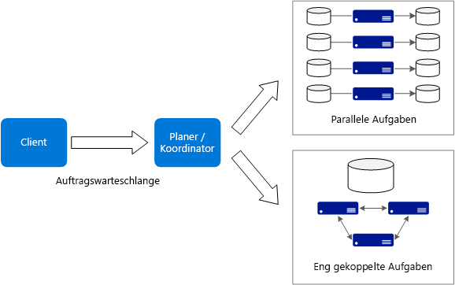
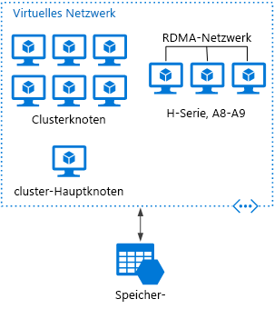

# Big Compute-Architekturstil

Mit dem Begriff *Big Compute* werden umfangreiche Workloads beschrieben, für die eine große Anzahl von Kernen erforderlich ist (häufig Hunderte oder Tausende). Zu den Szenarien gehören unter anderem Bildrendering, Fluiddynamik, Modellierung von finanziellen Risiken, Erdölsuche, Arzneimittelentwicklung und Belastungsanalysen im Maschinenbau.

Hier sind einige typische Merkmale von Big Compute-Anwendungen aufgeführt:

- Die Arbeit kann in einzelne Aufgaben unterteilt werden, die dann gleichzeitig auf vielen Kernen ausgeführt werden können.
- Jede Aufgabe ist endlich. Es ist eine Eingabe erforderlich, anschließend erfolgt die Verarbeitung, und zuletzt wird die Ausgabe erstellt. Die gesamte Anwendung wird über einen endlichen Zeitraum ausgeführt (Minuten bis Tage). Ein häufiges Muster ist die Bereitstellung einer großen Anzahl von Kernen in einem Burstvorgang und das anschließende Herunterfahren auf null, nachdem die Anwendung beendet wurde. 
- Die Anwendung muss nicht rund um die Uhr aktiv sein. Das System muss aber Knotenfehler oder Anwendungsabstürze verarbeiten können.
- Bei einigen Anwendungen sind Aufgaben unabhängig voneinander und können parallel ausgeführt werden. In anderen Fällen sind Aufgaben eng verknüpft und müssen ggf. interagieren oder Zwischenergebnisse austauschen. Hierfür kann die Nutzung von Hochgeschwindigkeits-Netzwerktechnologie ratsam sein, z.B. InfiniBand und Remotezugriff auf den direkten Speicher (Remote Direct Memory Access, RDMA). 
- Je nach Workload kann auch der Einsatz von rechenintensiven VM-Größen (H16r, H16mr und A9) ratsam sein.

## Einsatzmöglichkeiten für diese Architektur

- Rechenintensive Vorgänge, z.B. Simulation und Zahlenverarbeitung.
- Simulationen, die rechenintensiv sind und auf CPUs mehrerer Computer (10 bis mehrere Tausend) aufgeteilt werden müssen.
- Simulationen, für die zu viel Arbeitsspeicher für einen Computer erforderlich ist und die auf mehrere Computer aufgeteilt werden müssen.
- Rechenvorgänge mit langer Ausführungsdauer, die auf einem einzelnen Computer zu lange dauern würden.
- Kleinere Rechenvorgänge, die mehrere hundert oder tausend Mal ausgeführt werden müssen, z.B. Monte Carlo-Simulationen.

## Vorteile

- Hohe Leistung mit „[hochgradig paralleler][embarrassingly-parallel]“ Verarbeitung.
- Es können Hunderte oder Tausende von Computerprozessorkernen genutzt werden, um komplexe Probleme schneller zu lösen.
- Zugriff auf spezialisierte Hochleistungs-Hardware mit dedizierten InfiniBand-Hochgeschwindigkeitsnetzwerken.
- Sie können VMs je nach Bedarf für Arbeitsschritte bereitstellen und dann wieder aussondern. 

## Herausforderungen

- Die Verwaltung der VM-Infrastruktur.
- Die Verwaltung des Umfangs der Zahlenverarbeitung. 
- Die rechtzeitige Bereitstellung von Tausenden von Kernen.
- Für eng verknüpfte Aufgaben kann das Hinzufügen von mehr Kernen auch negative Auswirkungen haben. Unter Umständen müssen Sie etwas experimentieren, um die optimale Anzahl von Kernen zu ermitteln.

## Big Compute per Azure Batch

[Azure Batch][batch] ist ein verwalteter Dienst zum Ausführen von umfassenden HPC-Anwendungen (High-Performance Computing).

Mit Azure Batch konfigurieren Sie einen VM-Pool und laden die Anwendungen und Datendateien hoch. Anschließend stellt der Batch-Dienst die VMs bereit, weist den VMs Aufgaben zu, führt die Aufgaben aus und überwacht den Fortschritt. Batch kann die VMs als Reaktion auf die Workload automatisch horizontal hochskalieren. Batch ermöglicht auch eine Auftragsplanung.

 

## Big Compute auf virtuellen Computern

Sie können [Microsoft HPC Pack][hpc-pack] verwenden, um einen Cluster mit VMs zu verwalten und HPC-Aufträge zu planen und zu überwachen. Bei diesem Ansatz müssen Sie die VMs und die Netzwerkinfrastruktur bereitstellen und verwalten. Erwägen Sie diesen Ansatz, wenn Sie über vorhandene HPC-Workloads verfügen und einige oder alle nach Azure verschieben möchten. Sie können den gesamten HPC-Cluster nach Azure verschieben oder Ihren HPC-Cluster weiter lokal nutzen und Azure für Burstkapazität-Zwecke verwenden. Weitere Informationen finden Sie unter [HPC-, Batch- und Big Compute-Lösungen, mit Azure-VMs][batch-hpc-solutions].

### Bereitstellung von HPC Pack in Azure

Bei diesem Szenario wird der HPC-Cluster vollständig in Azure erstellt.

 
 
Der Hauptknoten stellt Verwaltungs- und Auftragsplanungsdienste für den Cluster bereit. Verwenden Sie für eng verknüpfte Aufgaben ein RDMA-Netzwerk, das zwischen VMs eine Kommunikation mit sehr hoher Bandbreite und geringer Wartezeit ermöglicht. Weitere Informationen finden Sie unter [Bereitstellen eines HPC Pack 2016-Clusters in Azure][deploy-hpc-azure].

### Burst eines HPC-Clusters in Azure

Bei diesem Szenario wird HPC Pack in einer Organisation lokal ausgeführt, und Azure-VMs werden für Burstkapazitäts-Zwecke genutzt. Der Hauptknoten des Clusters ist lokal angeordnet. Per ExpressRoute oder VPN Gateway wird für das lokale Netzwerk eine Verbindung mit dem Azure-VNet hergestellt.

 

[batch]: /azure/batch/
[batch-hpc-solutions]: /azure/batch/batch-hpc-solutions
[deploy-hpc-azure]: /azure/virtual-machines/windows/hpcpack-2016-cluster
[embarrassingly-parallel]: https://en.wikipedia.org/wiki/Embarrassingly_parallel
[hpc-pack]: https://technet.microsoft.com/library/cc514029

 
