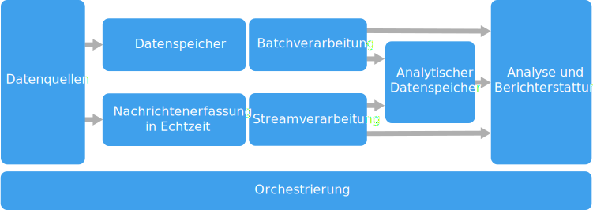

# Architekturstil für Big Data

Eine Big Data-Architektur ist für die Erfassung, Verarbeitung und Analyse von Daten konzipiert, die für herkömmliche Datenbanksysteme zu groß oder zu komplex sind.

 Big Data-Lösungen umfassen üblicherweise mindestens einen der folgenden Workloadtypen:

- Batchverarbeitung von ruhenden Big Data-Quellen
- Echtzeitverarbeitung von Big Data während der Übertragung
- Interaktive Erkundung von Big Data.
- Predictive Analytics und Machine Learning

Die meisten Big Data-Architekturen enthalten einige oder alle der folgenden Komponenten:

- **Datenquellen**. Alle Big Data-Lösungen beginnen mit mindestens einer Datenquelle. Beispiele:

    - Anwendungsdatenspeicher wie z.B. relationale Datenbanken
    - Von Anwendungen erzeugte statische Dateien, z.B. Webserver-Protokolldateien
    - Echtzeitdatenquellen wie z.B. IoT-Geräte

- **Datenspeicher**. Daten für die Batchverarbeitung werden in der Regel in einem verteilten Dateispeicher gespeichert, der große Mengen umfangreicher Dateien in verschiedenen Formaten aufnehmen kann. Diese Art Speicher wird häufig als *Data Lake* bezeichnet. Ein solcher Speicher lässt sich beispielsweise über Azure Data Lake Store oder Blobcontainer in Azure Storage implementieren. 

- **Batchverarbeitung**. Da die Datasets so umfangreich sind, muss eine Big Data-Lösung Datendateien mithilfe von Batchaufträgen mit langer Ausführungszeit verarbeiten, um die Daten zu filtern, zu aggregieren und auch anderweitig auf die Analyse vorzubereiten. Diese Aufträge beinhalten in der Regel das Lesen von Quelldateien, ihre Verarbeitung und das Schreiben der Ausgabe in neue Dateien. Zu den Optionen gehört z.B. Folgendes: die Ausführung von U-SQL-Aufträgen in Azure Data Lake Analytics, die Verwendung von Hive-, Pig- oder benutzerdefinierten MapReduce-Aufträgen in einem HDInsight Hadoop-Cluster oder die Verwendung von Java-, Scala- oder Python-Programmen in einem HDInsight Spark-Cluster.

- **Echtzeiterfassung von Nachrichten**. Wenn die Lösung Echtzeitquellen umfasst, muss die Architektur eine Möglichkeit bieten, Echtzeitnachrichten für die Verarbeitung des Datenstroms zu erfassen und zu speichern. Hierbei kann es sich um einen einfachen Datenspeicher handeln, in dem eingehende Nachrichten zur Verarbeitung in einem Ordner abgelegt werden. Viele Lösungen benötigen jedoch einen Speicher für die Erfassung von Nachrichten, der als Puffer für Nachrichten fungiert. Der Speicher muss zudem die Verarbeitung der horizontalen Skalierung, eine zuverlässige Übermittlung sowie weitere Semantik für das Nachrichtenqueuing unterstützen. Zu den Optionen gehören Azure Event Hubs, Azure IoT Hubs und Kafka.

- **Datenstromverarbeitung**. Nach dem Erfassen von Echtzeitnachrichten muss die Lösung diese verarbeiten, indem die Daten gefiltert, aggregiert und auch anderweitig auf die Analyse vorbereitet werden. Die verarbeiteten Daten aus dem Datenstrom werden dann in eine Ausgabesenke geschrieben. Azure Stream Analytics stellt einen verwalteten Dienst für die Datenstromverarbeitung bereit, basierend auf kontinuierlich ausgeführten SQ-Abfragen, die in ungebundenen Datenströmen arbeiten. Sie können auch Open Source-Apache-Streamingtechnologien wie Storm und Spark Streaming in einem HDInsight-Cluster verwenden.

- **Analysedatenspeicher**: Viele Big Data-Lösungen bereiten Daten für die Analyse vor und stellen die verarbeiteten Daten dann in einem strukturierten Format bereit, das mithilfe von Analysetools abgefragt werden kann. Der Analysedatenspeicher, in dem diese Abfragen ausgeführt werden, kann ein relationales Data Warehouse im Kimball-Stil sein, wie es in den meisten herkömmlichen BI-Lösungen (Business Intelligence) zu finden ist. Alternativ dazu können die Daten auch über eine NoSQL-Technologie mit niedriger Latenz bereitgestellt werden, wie z.B. HBase. Eine weitere Möglichkeit ist eine interaktive Hive-Datenbank, die eine Metadatenabstraktion der Datendateien in einem verteilten Datenspeicher bereitstellt. Azure SQL Data Warehouse bietet einen verwalteten Dienst für umfangreiches cloudbasiertes Data Warehousing. HDInsight unterstützt Interactive Hive, HBase und Spark SQL – diese Module können auch zum Bereitstellen von Daten für die Analyse verwendet werden.

- **Analysen und Berichte**. Ziel der meisten Big Data-Lösungen ist es, über Analysen und Berichte Einblicke in die Daten zu bieten. Um Benutzer die Datenanalyse zu ermöglichen, kann die Architektur eine Datenmodellierungsschicht umfassen, wie z.B. einen multidimensionalen OLAP-Cube oder ein Tabellendatenmodell in Azure Analysis Services. Sie kann auch Self-Service-BI unterstützen – hierbei kommen die Modellierungs- und Visualisierungstechnologien von Microsoft Power BI oder Microsoft Excel zum Einsatz. Analysen und Berichterstellung können auch in Form einer interaktiven Datenerkundung durch Data Scientists oder Data Analysts erfolgen. Für diese Szenarios unterstützen viele Azure-Dienste Analysenotebooks, z.B. Jupyter, sodass diese Benutzer ihre vorhandenen Kenntnisse von Python oder R nutzen können. Zum Erkunden sehr umfangreicher Daten können Sie Microsoft R Server als eigenständige Lösung oder zusammen mit Spark verwenden.

- **Orchestrierung**. Die meisten Big Data-Lösungen bestehen aus wiederholten Datenverarbeitungsvorgängen, die in Workflows gekapselt sind. Diese Vorgänge transformieren Quelldaten, verschieben Daten zwischen mehreren Quellen und Senken, laden die verarbeiteten Daten in einen Analysedatenspeicher oder übermitteln die Ergebnisse direkt in einen Bericht oder auf ein Dashboard. Um diese Workflows zu automatisieren, können Sie eine Orchestrierungstechnologie wie such Azure Data Factory oder Apache Oozie und Sqoop verwenden.

Azure bietet eine Vielzahl von Diensten, die in einer Big Data-Architektur verwendet werden können. Sie lassen sich in zwei Kategorien unterteilen:

- Verwaltete Dienste, einschließlich Azure Data Lake Store, Azure Data Lake Analytics, Azure Data Warehouse, Azure Stream Analytics, Azure Event Hub, Azure IoT Hub und Azure Data Factory.
- Auf der Apache Hadoop-Plattform basierende Open Source-Technologien, einschließlich HDFS, HBase, Hive, Pig, Spark, Storm, Oozie, Sqoop und Kafka. Diese Technologien sind in Azure im Azure HDInsight-Dienst verfügbar.

Diese Optionen schließen sich nicht gegenseitig aus, und viele Lösungen kombinieren Open Source-Technologien mit Azure-Diensten.

## Einsatzmöglichkeiten für diese Architektur

Ziehen Sie diese Art von Architektur in folgenden Fällen in Betracht:

- Sie möchten Daten in Mengen speichern und verarbeiten, die für eine herkömmliche Datenbank zu groß sind.
- Sie möchten unstrukturierte Daten zum Zweck der Analyse und Berichterstellung transformieren.
- Sie möchten ungebundene Datenströme in Echtzeit oder mit geringer Latenz erfassen, verarbeiten und analysieren.
- Sie möchten Azure Machine Learning oder Microsoft Cognitive Services verwenden.

## Vorteile

- **Auswahlmöglichkeiten bei der Technologie**. Sie können verwaltete Azure-Dienste und Apache-Technologien gemeinsam in HDInsight-Clustern einsetzen, um vorhandene Kenntnisse und Technologieinvestitionen optimal auszuschöpfen.
- **Bessere Leistung durch Parallelität**. Big Data-Lösungen profitieren von Parallelität, die hochleistungsfähige Lösungen ermöglicht, die sich auf sehr große Datenmengen skalieren lassen.
- **Elastische Skalierung**. Alle Komponenten der Big Data-Architektur unterstützen die horizontale Skalierung, sodass Sie Ihre Lösung auf kleine oder große Workloads ausrichten können und nur für die Ressourcen bezahlen, die Sie tatsächlich nutzen.
- **Interoperabilität mit vorhandenen Lösungen**. Die Komponenten der Big Data-Architektur werden auch für die IoT-Verarbeitung und BI-Unternehmenslösungen verwendet, sodass Sie eine integrierte Lösung für alle Datenworkloads erstellen können.

## Herausforderungen

- **Komplexität**. Big Data-Lösungen können sehr komplex sein und eine Vielzahl von Komponenten umfassen, um die aus unterschiedlichsten Datenquellen erfassten Daten zu verarbeiten. Erstellung, Testing und Problembehebung können bei Big Data-Prozessen eine große Herausforderung darstellen. Darüber hinaus gibt es wahrscheinlich sehr viele Konfigurationseinstellungen über mehrere Systeme hinweg, die zum Optimieren der Leistung verwendet werden müssen.
- **Kompetenz**. Viele Big Data-Technologien sind in hohem Maß spezialisiert und arbeiten mit Frameworks und Sprachen, die in allgemeineren Anwendungsarchitekturen in der Regel nicht verwendet werden. Andererseits entstehen durch Big Data-Technologien neue APIs, die auf etablierteren Sprachen basieren. Die Sprache U-SQL in Azure Data Lake Analytics beispielsweise basiert auf einer Kombination aus Transact-SQL und C#. Ebenso sind SQL-basierte APIs für Hive, HBase und Spark verfügbar.
- **Reife der Technologie**. Viele der für Big Data verwendeten Technologien sind noch nicht vollständig ausgereift. Während die Kerntechnologien für Hadoop – wie etwa Hive und Pig – bereits stabil sind, führen aufkommende Technologien wie Spark mit jedem neuen Release umfassende Änderungen und Erweiterungen ein. Verwaltete Dienste wie Azure Data Lake Analytics und Azure Data Factory sind im Vergleich zu anderen Azure-Diensten verhältnismäßig jung und werden sich wahrscheinlich im Lauf der Zeit weiterentwickeln.
- **Sicherheit**. Big Data-Lösungen speichern in der Regel alle statischen Daten in einem zentralen Data Lake. Die Sicherung des Zugriffs auf diese Daten kann eine Herausforderung darstellen, insbesondere dann, wenn die Daten von mehreren Anwendungen und Plattformen erfasst und genutzt werden müssen.

## Bewährte Methoden

- **Parallelität nutzen**. Die meisten Technologien zur Verarbeitung von Big Data verteilen die Workload auf mehrere Verarbeitungseinheiten. Dazu müssen die statischen Datendateien in einem teilbaren Format erstellt und gespeichert werden. Verteilte Dateisysteme wie HDFS können die Lese- und Schreibleistung optimieren, und die tatsächliche Verarbeitung wird von mehreren Clusterknoten parallel ausgeführt, wodurch die Auftragsdauer insgesamt reduziert wird.

- **Daten partitionieren**. Die Batchverarbeitung folgt üblicherweise einem wiederholten Zeitplan – z.B. wöchentlich oder monatlich. Partitionieren Sie die Datendateien und Datenstrukturen, wie beispielsweise Tabellen, basierend auf Zeiträumen, die dem Verarbeitungszeitplan entsprechen. So können Sie die Datenerfassung, Auftragsplanung und Problembehebung vereinfachen. Durch die Partitionierung von Tabellen, die in Hive-, U-SQL- oder SQL-Abfragen verwendet werden, lässt sich die Abfrageleistung erheblich verbessern.

- **Schema-on-Read-Semantik anwenden**. Mit einem Data Lake können Sie die Speicherung von Dateien in verschiedenen Formaten kombinieren – unabhängig davon, ob die Dateien strukturiert, semistrukturiert oder unstrukturiert vorliegen. Verwenden Sie die *Schema-on-Read*-Semantik, die bei der Verarbeitung der Daten – nicht beim Speichern der Daten – ein Schema auf die Daten projiziert. So erreichen Sie mehr Flexibilität für die Lösung und verhindern Engpässe während der Datenerfassung, die durch die Daten- und Typüberprüfung entstehen.

- **Daten an Ort und Stelle verarbeiten**. Herkömmliche BI-Lösungen verwenden oft einen ETL-Prozess (Extrahieren, Transformieren und Laden), um Daten in ein Data Warehouse zu verschieben. Big Data-Lösungen verarbeiten größere Datenmengen und eine größere Vielfalt an Formaten und verwenden im Allgemeinen ETL-Varianten, z.B. Transformieren, Extrahieren und Laden (TEL). Bei diesem Ansatz werden die Daten innerhalb des verteilten Datenspeichers verarbeitet und dabei in die erforderliche Struktur transformiert, bevor die transformierten Daten in einen Analysedatenspeicher verschoben werden.

- **Die richtige Balance zwischen Nutzung und Kosten für den Zeitaufwand**. Bei Batchverarbeitungsaufträgen müssen zwei Faktoren berücksichtigt werden: die Kosten pro Einheit für die Computeknoten und die Kosten pro Minute für die Verwendung dieser Knoten, um den Auftrag abzuschließen. Ein Beispiel: Die Ausführung eines Batchauftrags mit vier Clusterknoten dauert acht Stunden. Nun kann es sein, dass der Auftrag nur während der ersten beiden Stunden alle vier Knoten nutzt und danach nur noch zwei Knoten benötigt. In diesem Fall würde die Ausführung des gesamten Auftrags auf nur zwei Knoten die Gesamtauftragsdauer zwar verlängern, aber nicht verdoppeln, sodass die Gesamtkosten niedriger wären. In einigen Geschäftsszenarien ist eine längere Verarbeitungszeit möglicherweise den höheren Kosten für unzureichend genutzte Clusterressourcen vorzuziehen.

- **Clusterressourcen trennen**. Bei HDInsight-Clustern erzielen Sie in der Regel eine bessere Leistung, wenn Sie für jeden Workloadtyp separate Clusterressourcen bereitstellen. Ein Beispiel: Spark-Cluster beinhalten zwar Hive, aber wenn Sie eine umfangreiche Verarbeitung sowohl mit Hive als auch mit Spark ausführen müssen, sollten Sie in Betracht ziehen, separate, dedizierte Spark- und Hadoop-Cluster bereitzustellen. Gleiches gilt, wenn Sie HBase und Storm für die Datenstromverarbeitung mit niedriger Latenz und Hive für die Batchverarbeitung verwenden: Erwägen Sie separate Cluster für Storm, HBase und Hadoop.

- **Datenerfassung orchestrieren**. In einigen Fällen schreiben vorhandene Geschäftsanwendungen Datendateien für die Batchverarbeitung möglicherweise direkt in Azure Storage-Blobcontainer, wo sie von HDInsight oder Azure Data Lake Analytics genutzt werden können. Sie werden jedoch häufig die Erfassung von Daten aus lokalen oder externen Datenquelle in den Data Lake orchestrieren müssen. Verwenden Sie einen Orchestrierungsworkflow oder eine Orchestrierungspipeline – z.B. diejenigen, die von Azure Data Factory oder Oozie unterstützt werden –, um dieses Ziel auf vorhersehbare und kontrollierbare Weise zu erreichen.

- **Vertrauliche Daten frühzeitig bereinigen**. Der Workflow für die Datenerfassung sollte vertrauliche Daten frühzeitig im Prozess bereinigen, um zu verhindern, dass diese im Data Lake gespeichert werden.
