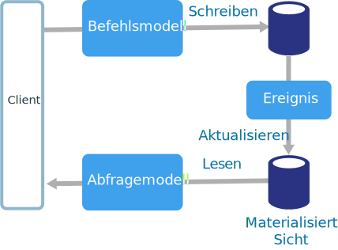
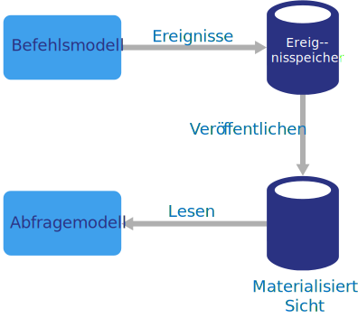

# Architekturstil „CQRS“

CQRS (Command and Query Responsibility Segregation, Befehlsabfrage-Zuständigkeitstrennung) ist ein Architekturstil, bei dem Lesevorgänge von Schreibvorgängen getrennt werden. 

In herkömmlichen Architekturen wird zum Abfragen und Aktualisieren einer Datenbank das gleiche Datenmodell verwendet. Dies ist eine einfache Vorgehensweise, die für grundlegende CRUD-Vorgänge gut geeignet ist. Bei komplexeren Anwendungen kann dieser Ansatz aber zu Problemen führen. Beispielsweise werden von der Anwendung auf Leseseite unter Umständen unterschiedliche Abfragen durchgeführt und Datenübertragungsobjekte (Data Transfer Objects, DTOs) mit uneinheitlichen Formen zurückgegeben. Die Objektzuordnung kann kompliziert werden. Auf der Schreibseite werden für das Modell ggf. eine komplexe Überprüfung und Geschäftslogik implementiert. Hieraus kann sich ein Modell mit zu hoher Komplexität ergeben, das überdimensioniert ist.

Ein anderes potenzielles Problem ist, dass Lese- und Schreibworkloads häufig asymmetrisch sind und über sehr unterschiedliche Leistungs- und Skalierungsanforderungen verfügen. 

CQRS löst diese Probleme, indem Lese- und Schreibvorgänge in separate Modelle unterteilt werden. Hierfür werden **Befehle** zum Aktualisieren von Daten und **Abfragen** zum Lesen von Daten verwendet.

- Die Befehle sollten nicht datenzentriert, sondern aufgabenbasiert sein. (Beispiel: „Hotelzimmer buchen“, nicht „Reservierungsstatus auf ‚Reserviert‘ festlegen“.) Befehle können in eine Warteschlange für die asynchrone Verarbeitung eingereiht werden, anstatt synchron verarbeitet zu werden.

- Mit Abfragen wird die Datenbank niemals geändert. Eine Abfrage gibt ein DTO zurück, in dem kein Domänenwissen gekapselt ist.

Eine stärkere Isolation erzielen Sie, indem Sie die Lesedaten physisch von den Schreibdaten trennen. In diesem Fall kann die Lesedatenbank ihr eigenes Datenschema verwenden, das für Abfragen optimiert ist. Beispielsweise kann eine [materialisierte Sicht][materialized-view] der Daten gespeichert werden, um komplexe Verknüpfungen oder O/RM-Zuordnungen zu vermeiden. Es kann sogar ein anderer Typ von Datenspeicher verwendet werden. Die Schreibdatenbank kann beispielsweise relational sein, während es sich bei der Lesedatenbank um eine Dokumentdatenbank handelt.

Wenn separate Lese- und Schreibdatenbanken verwendet werden, müssen sie synchron gehalten werden. Dies wird normalerweise erreicht, indem das Schreibmodell jeweils ein Ereignis veröffentlicht, wenn es die Datenbank aktualisiert. Die Aktualisierung der Datenbank und die Veröffentlichung des Ereignisses müssen in einer einzelnen Transaktion durchgeführt werden. 

Für einige Implementierungen von CQRS wird das [Muster für die Ereignisherkunftsermittlung][event-sourcing] verwendet. Bei diesem Muster wird der Anwendungsstatus als Ereignissequenz gespeichert. Jedes Ereignis umfasst eine Reihe von Änderungen der Daten. Der aktuelle Zustand wird hergestellt, indem die Ereignisse erneut durchgeführt werden. In einem CQRS-Kontext besteht ein Vorteil der Ereignisherkunftsermittlung darin, dass dieselben Ereignisse verwendet werden können, um andere Komponenten zu benachrichtigen, z.B. vor allem das Lesemodell. Im Lesemodell werden die Ereignisse genutzt, um eine Momentaufnahme des aktuellen Zustands zu erstellen, da dies für Abfragen effizienter ist. Mit der Ereignisherkunftsermittlung erhöht sich aber auch die Komplexität des Designs.

## Einsatzmöglichkeiten für diese Architektur

Erwägen Sie den Einsatz von CQRS für Kollaborationsdomänen, in denen viele Benutzer auf die gleichen Daten zugreifen – vor allem, wenn die Lese- und Schreibworkloads asymmetrisch sind.

CQRS ist keine Architektur der obersten Ebene, die für ein gesamtes System gilt. Wenden Sie CQRS nur auf die Subsysteme an, wenn das Trennen von Lese- und Schreibvorgängen einen eindeutigen Nutzen hat. Andernfalls erhöhen Sie die Komplexität, ohne dass sich daraus ein Vorteil ergibt.

## Vorteile

- **Unabhängige Skalierung**: CQRS ermöglicht das unabhängige Skalieren der Lese- und Schreibworkloads und kann zu einer Verringerung von Sperrkonflikten führen.
- **Optimierte Datenschemas**:  Auf der Leseseite kann ein Schema verwendet werden, das für Abfragen optimiert ist, während auf der Schreibseite ein Schema verwendet wird, das für Updates optimiert ist.  
- **Sicherheit**. Es ist einfacher sicherzustellen, dass nur die richtigen Domänenentitäten Schreibvorgänge für die Daten durchführen.
- **Trennung von Zuständigkeiten**: Das Trennen der Lese- und Schreibseite kann zu Modellen führen, die besser gewartet werden können und flexibler sind. Der größte Teil der komplexen Geschäftslogik betrifft das Schreibmodell. Das Lesemodell kann relativ einfach gestaltet sein.
- **Einfachere Abfragen**: Indem eine materialisierte Sicht in der Lesedatenbank gespeichert wird, kann die Anwendung beim Durchführen von Abfragen komplexe Verknüpfungen vermeiden.

## Herausforderungen

- **Komplexität**: Die Grundidee von CQRS ist einfach. Es kann sich aber auch ein komplexeres Anwendungsdesign ergeben, z.B. bei Verwendung des Musters für die Ereignisherkunftsermittlung.

- **Messaging**: Für CQRS wird zwar kein Messaging benötigt, aber es wird trotzdem häufig genutzt, um Befehle zu verarbeiten und Aktualisierungsereignisse zu veröffentlichen. In diesem Fall muss die Anwendung Nachrichtenfehler oder doppelte Nachrichten verarbeiten können. 

- **Letztliche Konsistenz**: Wenn Sie die Lese- und Schreibdatenbanken trennen, kann es sein, dass die Lesedaten veraltet sind. 

## Bewährte Methoden

- Weitere Informationen zur Implementierung von CQRS finden Sie unter [CQRS-Muster][cqrs-pattern].

- Erwägen Sie die Verwendung des Musters für die [Ereignisherkunftsermittlung][event-sourcing], um Aktualisierungskonflikte zu vermeiden.

- Erwägen Sie die Verwendung des [Musters für materialisierte Sichten][materialized-view] für das Lesemodell, um das Schema für Abfragen zu optimieren.

## CQRS in Microservices

CQRS kann in einer [Microservices-Architektur][microservices] besonders nützlich sein. Eines der Grundprinzipien von Microservices ist, dass ein Dienst nicht direkt auf den Datenspeicher eines anderen Diensts zugreifen kann.

Im folgenden Diagramm schreibt Dienst A in einen Datenspeicher, und Dienst B erstellt eine materialisierte Sicht der Daten. Dienst A veröffentlicht jeweils ein Ereignis, wenn ein Schreibvorgang in den Datenspeicher durchgeführt wird. Dienst B abonniert das Ereignis.

<!-- links -->

[cqrs-pattern]: ../../patterns/cqrs.md
[event-sourcing]: ../../patterns/event-sourcing.md
[materialized-view]: ../../patterns/materialized-view.md
[microservices]: ./microservices.md
