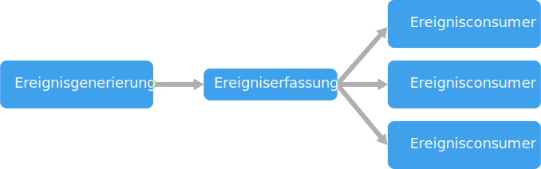

# Ereignisgesteuerter ArchitekturstilEvent-driven architecture style

Eine ereignisgesteuerte Architektur besteht aus **Ereignisproducern**, die einen Ereignisstrom generieren, und **Ereignisconsumern**, die auf die Ereignisse lauschen.An event-driven architecture consists of **event producers** that generate a stream of events, and **event consumers** that listen for the events. 

Ereignisse werden nahezu in Echtzeit übermittelt, sodass Consumer unmittelbar nach dem Auftreten des Ereignisses reagieren können.Events are delivered in near real time, so consumers can respond immediately to events as they occur. Producer sind von Consumern entkoppelt – ein Producer weiß nicht, welche Consumer lauschen.Producers are decoupled from consumers &mdash; a producer doesn't know which consumers are listening. Consumer sind auch voneinander entkoppelt, und jeder Consumer sieht alle Ereignisse.Consumers are also decoupled from each other, and every consumer sees all of the events. Dies ist ein Unterschied zum Muster der [konkurrierenden Consumer][competing-consumers], in dem Consumer Nachrichten aus einer Warteschlange abrufen und eine Nachricht nur einmal verarbeitet wird (vorausgesetzt, dass sie fehlerfrei ist).This differs from a [Competing Consumers][competing-consumers] pattern, where consumers pull messages from a queue and a message is processed just once (assuming no errors). In einigen Systemen, z.B. dem Internet der Dinge (Internet of Things, IoT), müssen Ereignisse in sehr großen Mengen erfasst werden.In some systems, such as IoT, events must be ingested at very high volumes.

Eine ereignisgesteuerte Architektur kann ein Veröffentlichungs-/Abonnementmodell oder eine Ereignisstrommodell verwenden.An event driven architecture can use a pub/sub model or an event stream model. 

- **Veröffentlichung/Abonnement**: Die Messaginginfrastruktur verfolgt die Abonnements nach.**Pub/sub**: The messaging infrastructure keeps track of subscriptions. Wenn ein Ereignis veröffentlicht wird, sendet die Infrastruktur das Ereignis an jeden Abonnenten.When an event is published, it sends the event to each subscriber. Nachdem ein Ereignis empfangen wurde, kann es nicht wiedergegeben werden, und für neue Abonnenten wird es nicht angezeigt.After an event is received, it cannot be replayed, and new subscribers do not see the event. 

- **Ereignisströme**: Ereignisse werden in ein Protokoll geschrieben.**Event streaming**: Events are written to a log. Ereignisse unterliegen einer strikten Reihenfolge (innerhalb einer Partition) und sind dauerhaft.Events are strictly ordered (within a partition) and durable. Clients abonnieren den Ereignisstrom nicht, stattdessen kann ein Client in jedem Teil des Ereignisstroms Lesevorgänge ausführen.Clients don't subscribe to the stream, instead a client can read from any part of the stream. Der Client ist dafür zuständig, im Ereignisstrom vorzurücken.The client is responsible for advancing its position in the stream. Das bedeutet, dass ein Client jederzeit beitreten und Ereignisse wiedergeben kann.That means a client can join at any time, and can replay events.

Auf Consumerseite gibt es einige gängige Variationen:On the consumer side, there are some common variations:

- **Einfache Ereignisverarbeitung**.**Simple event processing**. Ein Ereignis löst unmittelbar eine Aktion im Consumer aus.An event immediately triggers an action in the consumer. Sie können z.B. Azure Functions mit einem Service Bus-Trigger verwenden, sodass eine Funktion ausgeführt wird, sobald eine Nachricht in einem Service Bus-Thema veröffentlicht wurde.For example, you could use Azure Functions with a Service Bus trigger, so that a function executes whenever a message is published to a Service Bus topic.

- **Komplexe Ereignisverarbeitung**.**Complex event processing**. Ein Consumer verarbeitet eine Reihe von Ereignissen und sucht dabei mithilfe von Technologien wie Azure Stream Analytics oder Apache Storm nach Mustern in den Ereignisdaten.A consumer processes a series of events, looking for patterns in the event data, using a technology such as Azure Stream Analytics or Apache Storm. Sie können z.B. Messergebnisse eines eingebetteten Geräts für ein bestimmtes Zeitfenster aggregieren und eine Nachricht generieren, wenn der gleitende Durchschnitt einen bestimmten Schwellenwert überschreitet.For example, you could aggregate readings from an embedded device over a time window, and generate a notification if the moving average crosses a certain threshold. 

- **Ereignisstromverarbeitung**.**Event stream processing**. Verwenden Sie eine Plattform zur Verarbeitung von Datenströmen wie z.B. Azure IoT Hub oder Apache Kafka als Pipeline zum Erfassen von Ereignissen und Weiterleiten der Ereignisse an Datenstromprozessoren.Use a data streaming platform, such as Azure IoT Hub or Apache Kafka, as a pipeline to ingest events and feed them to stream processors. Die Datenstromprozessoren verarbeiten oder transformieren den Datenstrom.The stream processors act to process or transform the stream. Es können mehrere Datenstromprozessoren für verschiedene Subsysteme der Anwendung vorhanden sein.There may be multiple stream processors for different subsystems of the application. Dieser Ansatz eignet sich gut für IoT-Workloads.This approach is a good fit for IoT workloads.

Die Quelle der Ereignisse befindet sich möglicherweise außerhalb des Systems – z.B. physische Geräte in einer IoT-Lösung.The source of the events may be external to the system, such as physical devices in an IoT solution. In diesem Fall muss das System in der Lage sein, die Daten mit der Kapazität hinsichtlich Umfang und Durchsatz zu erfassen, die für die Datenquelle erforderlich ist.In that case, the system must be able to ingest the data at the volume and throughput that is required by the data source.

In dem logischen Diagramm oben wird jeder Consumertyp als einzelnes Feld angezeigt.In the logical diagram above, each type of consumer is shown as a single box. In der Praxis werden meist mehrere Instanzen eines Consumers bereitgestellt, damit der Consumer nicht zum Single Point of Failure im System wird.In practice, it's common to have multiple instances of a consumer, to avoid having the consumer become a single point of failure in system. Mehrere Instanzen sind möglicherweise auch erforderlich, um die Menge und Häufigkeit von Ereignissen zu bewältigen.Multiple instances might also be necessary to handle the volume and frequency of events. Auch verarbeitet ein einzelner Consumer Ereignisse möglicherweise in mehreren Threads.Also, a single consumer might process events on multiple threads. Das kann eine Herausforderung darstellen, wenn Ereignisse in einer bestimmten Reihenfolge verarbeitet werden müssen oder eine „Exactly-Once“-Semantik erfordern.This can create challenges if events must be processed in order, or require exactly-once semantics. Weitere Informationen finden Sie unter [Minimieren der Koordination][minimize-coordination].See [Minimize Coordination][minimize-coordination]. 

## Einsatzmöglichkeiten für diese ArchitekturWhen to use this architecture

- Mehrere Subsysteme, die die gleichen Ereignisse verarbeiten müssenMultiple subsystems must process the same events. 
- Echtzeitverarbeitung mit minimaler zeitlicher VerzögerungReal-time processing with minimum time lag.
- Komplexe Ereignisverarbeitung, z.B. Musterabgleich oder Aggregation über bestimmte Zeitfenster hinwegComplex event processing, such as pattern matching or aggregation over time windows.
- Große Mengen und hohe Datengeschwindigkeit, z.B. in IoT-SystemenHigh volume and high velocity of data, such as IoT.

## VorteileBenefits

- Producer und Consumer sind entkoppelt.Producers and consumers are decoupled.
- Keine Punkt-zu-Punkt-Integrationen.No point-to point-integrations. Neue Consumer lassen sich problemlos zum System hinzufügen.It's easy to add new consumers to the system.
- Consumer können sofort auf Ereignisse reagieren, sobald diese eingehen.Consumers can respond to events immediately as they arrive. 
- In hohem Maß skalierbar und verteilt.Highly scalable and distributed. 
- Subsysteme weisen unabhängige Perspektiven des Ereignisstroms auf.Subsystems have independent views of the event stream.

## HerausforderungenChallenges

- Garantierte Übermittlung.Guaranteed delivery. In manchen Systemen – insbesondere in IoT-Szenarien – ist es von entscheidender Bedeutung, sicherstellen zu können, dass Ereignisse übermittelt werden.In some systems, especially in IoT scenarios, it's crucial to guarantee that events are delivered.
- Verarbeitung der Ereignisse in einer bestimmten Reihenfolge oder genau einmal.Processing events in order or exactly once. Jeder Consumertyp wird aus Gründen der Resilienz und Skalierbarkeit in der Regel in mehreren Instanzen ausgeführt.Each consumer type typically runs in multiple instances, for resiliency and scalability. Dies kann zu einer Herausforderung werden, wenn die Ereignisse (innerhalb eines Consumertyps) in einer bestimmten Reihenfolge verarbeitet werden müssen oder die Verarbeitungslogik nicht idempotent ist.This can create a challenge if the events must be processed in order (within a consumer type), or if the processing logic is not idempotent.

## IoT-ArchitekturIoT architecture

Ereignisgesteuerte Architekturen sind von zentraler Bedeutung für IoT-Lösungen.Event-driven architectures are central to IoT solutions. Das folgende Diagramm zeigt eine mögliche logische Architektur für IoT.The following diagram shows a possible logical architecture for IoT. Das Diagramm veranschaulicht die Komponenten der Architektur, die Ereignisströme verarbeiten.The diagram emphasizes the event-streaming components of the architecture.

Das **Cloudgateway** erfasst Geräteereignisse an der Cloudgrenze mithilfe eines zuverlässigen Messagingsystems mit niedriger Latenz.The **cloud gateway** ingests device events at the cloud boundary, using a reliable, low latency messaging system.

Geräte können Ereignisse direkt an das Cloudgateway oder über ein **Bereichsgateway**.Devices might send events directly to the cloud gateway, or through a **field gateway**. Ein Bereichsgateway ist ein spezialisiertes Gerät oder Softwareprogramm, das sich üblicherweise am gleichen Ort befindet wie die Geräte. Es empfängt Ereignisse und leitet sie an das Cloudgateway weiter.A field gateway is a specialized device or software, usually colocated with the devices, that receives events and forwards them to the cloud gateway. Das Bereichsgateway kann auch Vorverarbeitungsfunktionen für die Geräteereignisse ausführen, z.B. Filtern, Aggregation oder Protokolltransformation.The field gateway might also preprocess the raw device events, performing functions such as filtering, aggregation, or protocol transformation.

Nach dem Erfassen durchlaufen Ereignisse einen oder mehrere **Datenstromprozessoren**, die die Daten weiterleiten (z.B. zum Speicher) oder Analyse- oder andere Verarbeitungsfunktionen ausführen.After ingestion, events go through one or more **stream processors** that can route the data (for example, to storage) or perform analytics and other processing.

Nachfolgend finden Sie einige häufige Verarbeitungsarten.The following are some common types of processing. (Diese Liste ist sicherlich nicht vollständig.)(This list is certainly not exhaustive.)

- Schreiben von Ereignisdaten in einen Cold Storage zur Archivierung oder Batchanalyse.Writing event data to cold storage, for archiving or batch analytics.

- Analyse des langsamsten Pfads – der Ereignisstrom wird (nahezu) in Echtzeit analysiert, um Anomalien zu erkennen, Muster in rollierenden Zeitfenstern zu ermitteln oder Warnungen auszulösen, wenn eine bestimmte Bedingung im Ereignisstrom auftritt.Hot path analytics, analyzing the event stream in (near) real time, to detect anomalies, recognize patterns over rolling time windows, or trigger alerts when a specific condition occurs in the stream. 

- Verarbeitung bestimmter Arten von nicht telemetriebezogenen Nachrichten von Geräten, z.B. Benachrichtigungen und Warnungen.Handling special types of non-telemetry messages from devices, such as notifications and alarms. 

- Machine Learning.Machine learning.

Die grauen Felder stehen für Komponenten eines IoT-Systems, die nicht in direktem Zusammenhang mit der Ereignisstromverarbeitung stehen, sondern der Vollständigkeit halber hier mit aufgeführt werden.The boxes that are shaded gray show components of an IoT system that are not directly related to event streaming, but are included here for completeness.

- Die **Geräteregistrierung** ist eine Datenbank der bereitgestellten Geräte und enthält die Geräte-IDs sowie üblicherweise einige Metadaten zu den Geräten, beispielsweise den Standort.The **device registry** is a database of the provisioned devices, including the device IDs and usually device metadata, such as location.

- Die **Bereitstellungs-API** ist eine allgemeine externe Schnittstelle für die Bereitstellung und Registrierung neuer Geräte.The **provisioning API** is a common external interface for provisioning and registering new devices.

- In einigen IoT-Lösungen können **Nachrichten mit Befehlen und Steuerungsinformationen** an die Geräte gesendet werden.Some IoT solutions allow **command and control messages** to be sent to devices.

> Dieser Abschnitt stellt eine sehr allgemeine Übersicht über IoT dar, und es gibt eine Vielzahl von Feinheiten und Herausforderungen, die es in diesem Bereich zu berücksichtigen gilt.This section has presented a very high-level view of IoT, and there are many subtleties and challenges to consider. Weitere Informationen und Details finden Sie in der als PDF-Download verfügbaren [Microsoft Azure IoT Reference Architecture][iot-ref-arch] (Referenzarchitektur zu Microsoft Azure IoT).For a more detailed reference architecture and discussion, see the [Microsoft Azure IoT Reference Architecture][iot-ref-arch] (PDF download).

 <!-- links -->

[competing-consumers]: ../../patterns/competing-consumers.md
[iot-ref-arch]: https://azure.microsoft.com/en-us/updates/microsoft-azure-iot-reference-architecture-available/
[minimize-coordination]: ../design-principles/minimize-coordination.md

