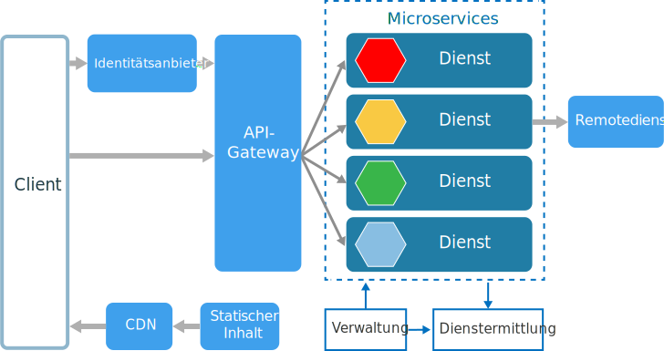
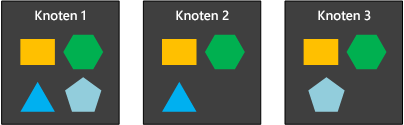
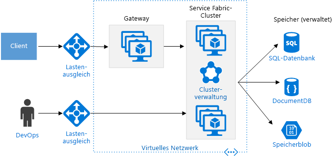

# Architekturstil für Microservices

Eine Microservicearchitektur besteht aus einer Sammlung kleiner, autonomer Dienste. Jeder Dienst ist eigenständig und sollte eine einzige Geschäftsfunktion implementieren. 

 
Auf gewisse Weise sind Microservices die natürliche Weiterentwicklung von serviceorientierten Architekturen (SOAs), es gibt jedoch einige Unterschiede zwischen Microservices und SOAs. Im Folgenden finden Sie einige definierende Merkmale eines Microservice:

- In einer Microservicearchitektur sind die Dienste klein, unabhängig und lose gekoppelt.

- Jeder Dienst stellt eine separate Codebasis dar, die von einem kleinen Entwicklungsteam verwaltet werden kann.

- Die Dienste können unabhängig voneinander bereitgestellt werden. Ein Team kann einen vorhandenen Dienst aktualisieren, ohne die gesamte Anwendung neu erstellen und erneut bereitstellen zu müssen.

- Die Dienste sind dafür zuständig, ihre eigenen Daten und ihren externen Zustand beizubehalten. Dies ist ein Unterschied zum herkömmlichen Modell, in dem eine separate Datenschicht die Datenpersistenz verwaltet.

- Dienste kommunizieren über klar definierte APIs miteinander. Die internen Implementierungsdetails jedes Diensts werden für andere Dienste verborgen.

- Dienste müssen nicht den gleichen Technologiestapel, die gleichen Bibliotheken oder die gleichen Frameworks verwenden.

Abgesehen von den Diensten selbst gibt es in einer typischen Architektur für Microservices noch einige weitere Komponenten:

**Verwaltung**. Die Verwaltungskomponente ist dafür zuständig, Dienste auf Knoten zu platzieren, Fehler zu ermitteln, die Dienste auf Knoten zu verteilen usw.  

**Dienstermittlung**.  Diese Komponente verwaltet eine Liste der Dienste und der Knoten, auf denen sich die Dienste befinden. Sie ermöglicht eine Dienstsuche, um den Endpunkt für einen Dienst zu finden. 

**API-Gateway**. Das API-Gateway ist der Einstiegspunkt für Clients. Clients rufen Dienste nicht direkt auf. Stattdessen rufen sie das API-Gateway auf, das den Aufruf an die geeigneten Dienste im Back-End weiterleitet. Das API-Gateway kann die Antworten mehrerer Dienste aggregieren und die aggregierte Antwort zurückgeben. 

Ein API-Gateway bietet u.a. folgende Vorteile:

- Es entkoppelt die Clients von den Diensten. Für Dienste kann eine Versionierung oder Umgestaltung durchgeführt werden, ohne dass sämtliche Clients aktualisiert werden müssen.

-  Dienste können nicht webfähige Messagingprotokolle verwenden, z.B. AMQP.

- Das API-Gateway kann weitere übergreifende Funktionen ausführen, beispielsweise Authentifizierung, Protokollierung, SSL-Terminierung und Lastenausgleich.

## Einsatzmöglichkeiten für diese Architektur

Ziehen Sie diese Art von Architektur in folgenden Fällen in Betracht:

- Große Anwendungen mit hoher Releaserate

- Komplexe Anwendungen, die ein hohes Maß an Skalierbarkeit aufweisen müssen

- Anwendungen mit umfangreichen Domänen oder einer Vielzahl von Unterdomänen

- Eine Organisation, die aus vielen kleinen Entwicklungsteams besteht

## Vorteile 

- **Unabhängige Bereitstellungen**. Sie können einen Dienst aktualisieren, ohne die gesamte Anwendung erneut bereitstellen zu müssen, und einen Rollback oder Rollforward für ein Update ausführen, falls ein Problem auftritt. Fehlerbehebungen und Featurereleases lassen sich besser verwalten und bergen weniger Risiken.

- **Unabhängige Entwicklung**. Ein einziges Entwicklungsteam kann einen Dienst erstellen, testen und bereitstellen. Dies fördert kontinuierliche Innovationen und einen schnelleren Releaserhythmus. 

- **Kleine, fokussierte Teams**. Teams können sich auf einen Dienst konzentrieren. Dank des geringeren Umfangs der einzelnen Services ist die Codebasis einfacher zu verstehen, und neue Teammitglieder können schneller eingearbeitet werden.

- **Fehlerisolation**. Wenn ein Dienst ausfällt, ist nicht gleich die gesamte Anwendung betroffen. Das bedeutet aber nicht, dass Sie kostenlos Resilienz erhalten. Sie müssen weiterhin bewährte Methoden und Entwurfsmuster für die Resilienz befolgen. Weitere Informationen finden Sie unter [Entwerfen robuster Anwendungen für Azure][resiliency-overview].

- **Verschiedene Technologiestapel**. Teams können die Technologie auswählen, die sich für ihren Dienst am besten eignet. 

- **Genau abgestimmte Skalierung**. Die Dienste können unabhängig voneinander skaliert werden. Gleichzeitig bedeutet die höhere Dienstdichte pro virtuellem Computer, dass die Ressourcen der virtuellen Computer vollständig genutzt werden. Mithilfe von Platzierungseinschränkungen kann ein Dienst auf das Profil eines virtuellen Computers abgestimmt werden (hohe CPU-Leistung, viel Arbeitsspeicher usw.).

## Herausforderungen

- **Komplexität**. Eine Microserviceanwendung verfügt über mehr bewegliche Teile als die entsprechende monolithische Anwendung. Jeder Dienst für sich genommen ist einfacher, aber das System als Ganzes ist komplexer.

- **Entwicklung und Test**. Das Entwickeln im Hinblick auf Dienstabhängigkeiten erfordert eine andere Herangehensweise. Vorhandene Tools sind nicht unbedingt auf die Arbeit mit Dienstabhängigkeiten ausgelegt. Eine Umgestaltung über Dienstgrenzen hinweg kann schwierig sein. Das Testen von Dienstabhängigkeiten kann ebenfalls eine Herausforderung darstellen, insbesondere dann, wenn sich die Anwendung schnell weiterentwickelt.

- **Unzureichende Governance**. Der dezentralisierte Ansatz für die Erstellung von Microservices bietet einige Vorteile, kann jedoch auch zu Problemen führen. Es kann passieren, dass so viele verschiedene Sprachen und Frameworks verwendet werden, dass die Verwaltung der Anwendung schwierig wird. Es empfiehlt sich möglicherweise, einige für das gesamte Projekt gültige Standards zu etablieren, ohne die Flexibilität der Teams zu sehr einzuschränken. Dies gilt insbesondere für übergreifende Funktionen wie die Protokollierung.

- **Netzwerkkonflikte und -latenz**. Die Verwendung vieler kleiner, genau abgestimmter Dienste kann zu einer vermehrten Kommunikation zwischen den Diensten führen. Wenn die Kette der Dienstabhängigkeiten zu lang wird (Dienst A ruft B auf, der wiederum C aufruft...), kann die zusätzliche Latenz zu einem Problem werden. Beim Entwurf der APIs sollten Sie größte Umsicht walten lassen. Vermeiden Sie überladene APIs, denken Sie über Serialisierungsformate nach, und suchen Sie nach Stellen, an denen Sie asynchrone Kommunikationsmuster verwenden können.

- **Datenintegrität**. Jeder Microservice ist für die eigene Datenpersistenz zuständig. Dadurch kann die Sicherstellung der Datenkonsistenz zu einer Herausforderung werden. Implementieren Sie die letztliche Konsistenz, wo immer möglich.

- **Verwaltung**. Für den erfolgreichen Einsatz von Microservices ist eine ausgereifte DevOps-Kultur erforderlich. Die korrelierte Protokollierung über Dienste hinweg kann eine Herausforderung sein. In der Regel muss die Protokollierung mehrere Dienstaufrufe für einen einzigen Benutzervorgang korrelieren.

- **Versionsverwaltung**. Dienstupdates dürfen nicht zu Unterbrechungen bei abhängigen Diensten führen. Dienste können jederzeit aktualisiert werden, daher könnten ohne sorgfältigen Entwurf Probleme mit der Abwärts- oder Aufwärtskompatibilität entstehen.

- **Kompetenz**. Microservices sind Systeme mit einem hohen Maß an Verteilung. Beurteilen Sie sehr genau, ob das Team über die notwendige Kompetenz und Erfahrung verfügt, erfolgreiche Arbeit zu leisten.

## Bewährte Methoden

- Modellieren Sie Dienste rund um die geschäftliche Domäne. 

- Dezentralisieren Sie alles. Einzelne Teams sind für den Entwurf und die Erstellung von Diensten verantwortlich. Vermeiden Sie die gemeinsame Nutzung von Code oder Datenschemas. 

- Die Datenspeicherung sollte ausschließlich in dem Dienst erfolgen, der die Daten besitzt. Verwenden Sie den optimalen Speicher für jeden Dienst- und Datentyp. 

- Dienste kommunizieren über sorgfältig entworfene APIs. Vermeiden Sie die Weitergabe von Implementierungsdetails. APIs sollten die Domäne modellieren, nicht die interne Implementierung des Diensts.

- Vermeiden Sie eine Kopplung zwischen Diensten. Kopplung kann durch gemeinsam genutzte Datenbankschemas oder starre Kommunikationsprotokolle entstehen.

- Lagern Sie übergreifende Funktionen wie Authentifizierung und SSL-Terminierung an das Gateway aus.

- Informationen über die Domäne haben im Gateway nichts zu suchen. Das Gateway sollte Clientanforderungen ohne Kenntnis der Geschäftsregeln oder Domänenlogik verarbeiten und weiterleiten. Andernfalls wird das Gateway zu einer Abhängigkeit und kann zu Kopplung zwischen den Diensten führen.

- Dienste sollten eine lose Kopplung und eine hohe funktionale Kohäsion aufweisen. Funktionen, die wahrscheinlich zusammen geändert werden, sollten auch zusammen gepackt und bereitgestellt werden. Wenn sie sich in verschiedenen Diensten befinden, sind diese Dienste letztlich eng gekoppelt, da eine Änderung in einem Dienst ein Update des anderen Diensts erfordert. Eine übermäßige Kommunikation zwischen zwei Diensten kann ein Symptom für enge Kopplung und geringe Kohäsion sein. 

- Isolieren Sie Fehler. Nutzen Sie Resilienzstrategien, um zu verhindern, dass Fehler in einem Dienst kaskadieren. Weitere Informationen finden Sie unter [Resilienzmuster][resiliency-patterns] und [Entwerfen resilienter Anwendungen][resiliency-overview].

## Microservices unter Verwendung von Azure Container Service 

Sie können Azure Container Service verwenden, um einen Docker-Cluster zu konfigurieren und bereitzustellen. Azure Container Service unterstützt verschiedene beliebte Containerorchestratoren wie Kubernetes, DC/OS und Docker Swarm.

 
**Öffentliche Knoten**. Diese Knoten sind über einen öffentlichen Lastenausgleich erreichbar. Das API-Gateway wird auf diesen Knoten gehostet.

**Back-End-Knoten**. Diese Knoten führen Dienste aus, die Clients über das API-Gateway erreichen. Diese Knoten empfangen keinen direkten Datenverkehr aus dem Internet. Die Back-End-Knoten umfassen möglicherweise mehr als einen Pool aus virtuellen Computern, von denen jeder über ein anderes Hardwareprofil verfügt. Sie können z.B. separate Pools für allgemeine Computeworkloads, hohe CPU-Workloads und hohe Arbeitsspeicherworkloads erstellen. 

**Virtuelle Verwaltungscomputer**. Diese virtuellen Computer führen die Masterknoten für den Containerorchestrator aus. 

**Netzwerk**. Die öffentlichen Knoten, die Back-End-Knoten und die virtuellen Verwaltungscomputer befinden sich in verschiedenen Subnetzen im gleichen virtuellen Netzwerk (VNet). 

**Lastenausgleichsmodule**.  Vor den öffentlichen Knoten befindet sich ein externes Lastenausgleichsmodul. Dieses Modul verteilt Internetanforderungen auf die öffentlichen Knoten. Vor den virtuellen Verwaltungscomputern befindet sich ein weiteres Lastenausgleichsmodul, das mithilfe von NAT-Regeln SSH-Datenverkehr (Secure Shell) an die virtuellen Verwaltungscomputer weiterleitet.

Um Verfügbarkeit und Skalierbarkeit sicherzustellen, wird jeder Dienst auf mehrere virtuelle Computer repliziert. Da die Dienste zudem relativ schlank sind (im Vergleich mit einer monolithischen Anwendung), werden üblicherweise mehrere Dienste in einen einzigen virtuellen Computer gepackt. Eine höhere Dichte ermöglicht eine bessere Ressourcennutzung. Wenn ein bestimmter Dienst nur wenige Ressourcen benötigt, müssen Sie nicht einen vollständigen virtuellen Computer nur für die Ausführung dieses Diensts einrichten.

Das folgende Diagramm zeigt drei Knoten, die vier verschiedene Dienste ausführen (zu erkennen an den unterschiedlichen Formen). Beachten Sie, dass jeder Dienst über mindestens zwei Instanzen verfügt. 
 

## Microservices unter Verwendung von Azure Service Fabric

Das folgende Diagramm zeigt eine Microservicearchitektur, die Azure Service Fabric verwendet.

Der Service Fabric-Cluster wurde in mindestens einer VM-Skalierungsgruppe bereitgestellt. Sie können mehrere VM-Skalierungsgruppen im Cluster einrichten, um eine Kombination aus verschiedenen Arten virtueller Computer zu nutzen. Ein API-Gateway wird vor dem Service Fabric-Cluster platziert, und ein externer Lastenausgleich empfängt Clientanforderungen.

Die Service Fabric-Runtime führt Clusterverwaltungsfunktionen aus, einschließlich Dienstplatzierung, Knotenfailover und Integritätsüberwachung. Die Runtime wurde auf den Knoten selbst bereitgestellt. Es gibt keinen separaten Satz virtueller Computer für die Clusterverwaltung.

Dienste kommunizieren über den in Service Fabric integrierten Reverseproxy miteinander. Service Fabric stellt einen Ermittlungsdienst bereit, der den Endpunkt für einen benannten Dienst auflösen kann.

<!-- links -->

[resiliency-overview]: ../../resiliency/index.md
[resiliency-patterns]: ../../patterns/category/resiliency.md

