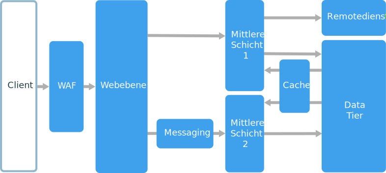
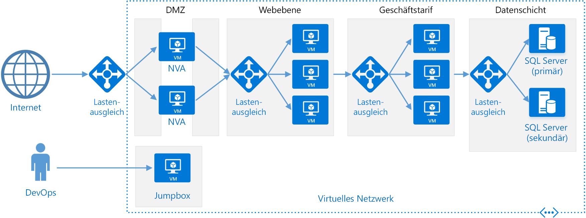

# Architekturstil für n-schichtige Anwendungen

Eine n-schichtige Architektur unterteilt eine Anwendung in **logische Ebenen** und **physische Schichten**. 

Ebenen sind eine Möglichkeit, Zuständigkeiten zu trennen und Abhängigkeiten zu verwalten. Jede Ebene ist mit einer bestimmten Zuständigkeit verknüpft. Eine höhere Ebene kann Dienste in einer niedrigeren Ebene verwenden, nicht jedoch umgekehrt. 

Schichten sind physisch getrennt und befinden sich auf verschiedenen Computern. Eine Schicht kann eine andere Schicht direkt aufrufen oder asynchrones Messaging verwenden (Nachrichtenwarteschlange). Jede Ebene kann auf einer eigenen Schicht gehostet werden, dies ist jedoch nicht erforderlich. Verschiedene Ebenen können auf der gleichen Schicht gehostet werden. Die physische Trennung der Schichten verbessert die Skalierbarkeit und Resilienz, erhöht jedoch aufgrund der zusätzlichen Netzwerkkommunikation die Latenz. 

Eine herkömmliche dreischichtige Anwendung besteht aus einer Präsentationsschicht, einer Logikschicht und einer Datenschicht. Die Logikschicht ist optional. Komplexere Anwendungen können mehr als drei Schichten aufweisen. Das Diagramm oben zeigt eine Anwendung mit zwei Logikschichten, die verschiedene Funktionalitätsbereiche kapseln. 

Eine n-schichtige Anwendung kann auf einer **Architektur mit geschlossenen Ebenen** oder einer **Architektur mit offenen Ebenen** basieren:

- In einer Architektur mit geschlossenen Ebenen kann eine Ebene nur die direkt darunter liegende Ebene aufrufen. 
- In einer Architektur mit offenen Ebenen kann eine Ebene jede darunter liegende Ebene aufrufen. 

Eine Architektur mit geschlossenen Ebenen begrenzt die Abhängigkeiten zwischen den Ebenen. Sie kann jedoch unnötigen Netzwerkdatenverkehr verursachen, wenn eine Ebene Anforderungen einfach nur an die nächste Ebene übergibt. 

## Einsatzmöglichkeiten für diese Architektur

N-schichtige Architekturen werden in der Regel als IaaS-Anwendungen (Infrastructure-as-a-Service) implementiert, und jede Schicht wird auf einem separaten Satz virtueller Computer ausgeführt. Eine n-schichtige Anwendung muss jedoch nicht ausschließlich auf IaaS basieren. Häufig ist es von Vorteil, für einige Teile der Architektur verwaltete Dienste zu verwenden – dies gilt insbesondere für Caching, Messaging und Datenspeicherung.

Eine n-schichtige Architektur eignet sich gut für folgende Zwecke:

- Einfache Webanwendungen 
- Migrieren einer lokalen Anwendung zu Azure mit minimalem Umgestaltungsaufwand
- Einheitliche Entwicklung lokaler und cloudbasierter Anwendungen

N-schichtige Architekturen sind bei herkömmlichen lokalen Anwendungen sehr häufig anzutreffen und eignen sich daher ideal für die Migration vorhandener Workloads zu Azure.

## Vorteile

- Portierbarkeit zwischen cloudbasierten und lokalen Umgebungen sowie zwischen Cloudplattformen
- Geringer Lernaufwand für die meisten Entwickler
- Natürliche Weiterentwicklung des herkömmlichen Anwendungsmodells
- Offen für heterogene Umgebungen (Windows/Linux)

## Herausforderungen

- Es passiert nur allzu leicht, dass eine Logikschicht verwendet wird, die nur CRUD-Vorgänge in der Datenbank ausführt und damit die Latenz erhöht, ohne wirklich nützliche Aufgaben zu erledigen. 
- Das monolithische Design verhindert die unabhängige Bereitstellung von Features.
- Die Verwaltung einer IaaS-Anwendung verursacht mehr Arbeit als eine Anwendung, die nur verwaltete Dienste verwendet. 
- Die Verwaltung der Netzwerksicherheit in einem umfangreichen System kann schwierig sein.

## Bewährte Methoden

- Verwenden Sie die automatische Skalierung, um Änderungen der Last zu verarbeiten. Weitere Informationen finden Sie unter [Automatische Skalierung][autoscaling].
- Verwenden Sie asynchrones Messaging, um Schichten zu entkoppeln.
- Speichern Sie halbstatische Daten zwischen. Weitere Informationen finden Sie unter [Caching][caching].
- Konfigurieren Sie die Datenbankschicht mithilfe einer Lösung wie z.B. [SQL Server-Always On-Verfügbarkeitsgruppen][sql-always-on] für die Hochverfügbarkeit.
- Platzieren Sie eine Web Application Firewall (WAF) zwischen Front-End und Internet.
- Platzieren Sie jede Schicht in einem eigenen Subnetz, und verwenden Sie das Subnetz als Sicherheitsgrenze. 
- Beschränken Sie den Zugriff auf die Datenschicht, indem Sie Anforderungen nur aus den Logikschichten zulassen.

## N-schichtige Architektur auf virtuellen Computern

In diesem Abschnitt wird eine empfohlene n-schichtige Architektur beschrieben, die auf virtuellen Computern ausgeführt wird. 

Jede Schicht besteht aus mindestens zwei virtuellen Computern, die sich in einer Verfügbarkeitsgruppe oder einer VM-Skalierungsgruppe befinden. Mehrere virtuelle Computer sorgen für Resilienz, falls ein virtueller Computer ausfällt. Für die Verteilung von Anforderungen auf die virtuellen Computer in einer Schicht werden Lastenausgleichsmodule verwendet. Eine Schicht kann durch Hinzufügen weiterer virtueller Computer zum Pool horizontal skaliert werden. 

Jede Schicht wurde zudem in einem eigenen Subnetz platziert, sodass sich die internen IP-Adressen innerhalb des gleichen Adressbereichs befinden. So lassen sich Regeln und Routingtabellen für Netzwerksicherheitsgruppen problemlos auf einzelne Schichten anwenden.

Die Web- und die Businessschicht sind zustandslos. Jeder virtuelle Computer kann jede Anforderung für diese Schicht verarbeitet. Die Datenschicht sollte aus einer replizierten Datenbank bestehen. Unter Windows empfiehlt sich SQL Server sowie die Verwendung von Always On-Verfügbarkeitsgruppen, um Hochverfügbarkeit zu erzielen. Unter Linux wählen Sie eine Datenbank aus, die Replikation unterstützt, z.B. Apache Cassandra. 

Netzwerksicherheitsgruppen beschränken den Zugriff auf jede Schicht. Die Datenbankschicht z.B. gestattet nur den Zugriff aus der Businessschicht.

Weitere Informationen und eine Resource Manager-Vorlage, die sich direkt bereitstellen lässt, finden Sie in den folgenden Referenzarchitekturen:

- [Ausführen von Windows-VMs für eine n-schichtige Anwendung][n-tier-windows]
- [Ausführen von Linux-VMs für eine n-schichtige Anwendung][n-tier-linux]

### Zusätzliche Überlegungen

- N-schichtige Architekturen sind nicht auf drei Schichten beschränkt. Bei komplexeren Anwendungen ist es üblich, mehrere Schichten zu verwenden. Ziehen Sie in diesem Fall ein Layer-7-Routing in Betracht, um Anforderungen an eine bestimmte Schicht weiterzuleiten.

- Schichten sind die Grenzen für Skalierbarkeit, Resilienz und Sicherheit. Ziehen Sie in Betracht, separate Schichten für Dienste mit unterschiedlichen Anforderungen in diesen Bereichen einzurichten.

- Verwenden Sie VM-Skalierungsgruppen für die automatische Skalierung.

- Suchen Sie nach Stellen in der Architektur, an denen Sie ohne größere Umgestaltung einen verwalteten Dienst verwenden können. Untersuchen Sie in diesem Zusammenhang insbesondere die Bereiche Caching, Messaging, Speicher und Datenbanken. 

- Um die Sicherheit zu erhöhen, platzieren Sie eine Netzwerk-DMU vor der Anwendung. Die DMZ umfasst virtuelle Netzwerkgeräte (Network Virtual Appliances, NVAs), die Sicherheitsfunktionen wie z.B. Firewalls und Paketüberprüfung implementieren. Weitere Informationen finden Sie in der [Referenzarchitektur für Netzwerk-DMZs][dmz].

- Um Hochverfügbarkeit zu erreichen, platzieren Sie mindestens zwei NVAs in einer Verfügbarkeitsgruppe, und richten Sie ein externes Lastenausgleichsmodul ein, um Internetanforderungen auf die Instanzen zu verteilen. Weitere Informationen finden Sie unter [Bereitstellen hochverfügbarer virtueller Netzwerkgeräte][ha-nva].

- Lassen Sie keinen direkten RDP- oder SSH-Zugriff auf virtuelle Computer zu, die Anwendungscode ausführen. Operatoren sollten sich stattdessen bei einer Jumpbox anmelden, die auch als „Bastion Host“ bezeichnet wird. Dies ist ein virtueller Computer im Netzwerk, über den Administratoren eine Verbindung mit anderen virtuellen Computern herstellen. Die Jumpbox verfügt über eine Netzwerksicherheitsgruppe, die RDP- oder SSH-Zugriff nur von zugelassenen öffentlichen IP-Adressen gestattet.

- Sie können das virtuelle Azure-Netzwerk auf Ihr lokales Netzwerk ausweiten. Verwenden Sie hierfür ein Site-to-Site-VPN (Virtual Private Network) oder Azure ExpressRoute. Weitere Informationen finden Sie in der [Referenzarchitektur für hybride Netzwerke][hybrid-network].

- Wenn Ihre Organisation Active Directory für die Identitätsverwaltung verwendet, empfiehlt es sich möglicherweise, die Active Directory-Umgebung auf das Azure-VNET auszuweiten. Weitere Informationen finden Sie in der [Referenzarchitektur zur Identitätsverwaltung][identity].

- Wenn Sie eine höhere Verfügbarkeit benötigen, als die Azure-SLA für virtuelle Computer bietet, replizieren Sie die Anwendung in zwei Regionen, und verwenden Sie für das Failover den Azure Traffic Manager. Weitere Informationen finden Sie unter [Ausführen von Windows-VMs in mehreren Regionen][multiregion-windows] oder [Ausführen von Linux-VMs in mehreren Regionen][multiregion-linux].

[autoscaling]: ../../best-practices/auto-scaling.md
[caching]: ../../best-practices/caching.md
[dmz]: ../../reference-architectures/dmz/index.md
[ha-nva]: ../../reference-architectures/dmz/nva-ha.md
[hybrid-network]: ../../reference-architectures/hybrid-networking/index.md
[identity]: ../../reference-architectures/identity/index.md
[multiregion-linux]: ../../reference-architectures/virtual-machines-linux/multi-region-application.md
[multiregion-windows]: ../../reference-architectures/virtual-machines-windows/multi-region-application.md
[n-tier-linux]: ../../reference-architectures/virtual-machines-linux/n-tier.md
[n-tier-windows]: ../../reference-architectures/virtual-machines-windows/n-tier.md
[sql-always-on]: /sql/database-engine/availability-groups/windows/always-on-availability-groups-sql-server