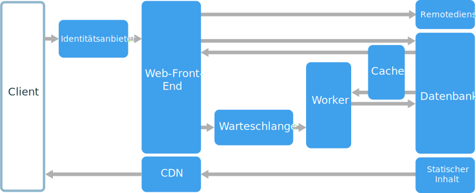
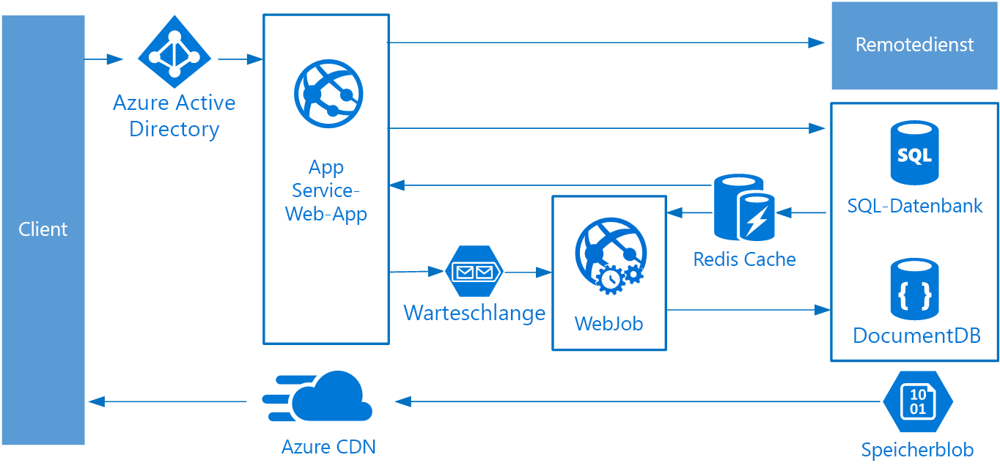

# Architekturstil „Web-Warteschlange-Worker“

Die Hauptkomponenten dieser Architektur sind ein **Web-Front-End**, mit dem Clientanforderungen bereitgestellt werden, und ein **Worker**, der ressourcenintensive Aufgaben, Workflows mit langer Ausführungsdauer oder Batchaufträge durchführt.  Das Web-Front-End kommuniziert mit dem Worker über eine **Nachrichtenwarteschlange**.  

Andere Komponenten, die häufig in diese Architektur eingebunden werden, sind:

- Eine oder mehrere Datenbanken 
- Ein Cache zum Speichern von Werten aus der Datenbank, um schnelle Lesevorgänge zu ermöglichen
- CDN zur Bereitstellung von statischem Inhalt
- Remotedienste, z.B. E-Mail- oder SMS-Dienst (häufig von Drittanbietern bereitgestellt)
- Identitätsanbieter für die Authentifizierung

Web und Worker sind jeweils zustandslos. Der Sitzungsstatus kann in einem verteilten Cache zwischengespeichert werden. Alle Vorgänge mit langer Ausführungsdauer werden asynchron vom Worker durchgeführt. Der Worker kann über Nachrichten in der Warteschlange ausgelöst oder nach einem Zeitplan für die Batchverarbeitung ausgeführt werden. Der Worker ist eine optionale Komponente. Wenn keine Vorgänge mit langer Ausführungsdauer vorhanden sind, kann der Worker weggelassen werden.  

Das Front-End kann aus einer Web-API bestehen. Auf Clientseite kann die Web-API von einer Single-Page-Anwendung, die AJAX-Aufrufe durchführt, oder von einer nativen Clientanwendung genutzt werden.

## Einsatzmöglichkeiten für diese Architektur

Die Architektur „Web-Warteschlange-Worker“ wird häufig mit verwalteten Computediensten implementiert (entweder Azure App Service oder Azure Cloud Services). 

Ziehen Sie diese Art von Architektur in folgenden Fällen in Betracht:

- Anwendungen mit einer relativ einfachen Domäne
- Anwendungen mit Workflows mit langer Ausführungsdauer oder Batchvorgängen
- Bei Verwendung von verwalteten Diensten anstelle von IaaS (Infrastructure-as-a-Service).

## Vorteile

- Relativ einfache Architektur, die leicht zu verstehen ist
- Einfache Bereitstellung und Verwaltung
- Klare Trennung von Zuständigkeiten
- Das Front-End ist vom Worker per asynchronem Messaging entkoppelt
- Front-End und Worker können unabhängig voneinander skaliert werden

## Herausforderungen

- Ohne eine sorgfältige Vorgehensweise beim Entwerfen können das Front-End und der Worker zu großen, monolithischen Komponenten werden, die schwierig zu verwalten und zu aktualisieren sind.
- Es können versteckte Abhängigkeiten vorhanden sein, wenn das Front-End und der Worker Datenschemas oder Codemodule gemeinsam nutzen. 

## Bewährte Methoden

- Machen Sie für den Client eine sorgfältig entworfene API verfügbar. Siehe [API-Design][api-design].
- Führen Sie die automatische Skalierung durch, um Änderungen der Last zu bewältigen. Siehe [Autoscaling][autoscaling] (Automatische Skalierung).
- Speichern Sie halbstatische Daten zwischen. Siehe [Caching][caching].
- Verwenden Sie ein CDN zum Hosten von statischem Inhalt. Siehe [Content Delivery Network][cdn].
- Verwenden Sie „Polyglot Persistence“, falls zutreffend. Siehe [Use the best data store for the job][polyglot] (Verwenden des besten Datenspeichers für den Auftrag).
- Partitionieren Sie Daten, um die Skalierbarkeit zu verbessern, Konflikte zu reduzieren und die Leistung zu optimieren. Siehe [Data partitioning][data-partition] (Datenpartitionierung).

## Web-Warteschlange-Worker in Azure App Service

In diesem Abschnitt wird eine empfohlene Architektur vom Typ „Web-Warteschlange-Worker“ beschrieben, für die Azure App Service verwendet wird. 

Das Front-End wird als Azure App Service-Web-App implementiert, und der Worker wird als WebJob implementiert. Die Web-App und der WebJob werden beide einem App Service-Plan zugeordnet, über den die VM-Instanzen bereitgestellt werden. 

Sie können entweder Azure Service Bus- oder Azure Storage-Warteschlangen als Nachrichtenwarteschlange verwenden. (Im Diagramm ist eine Azure Storage-Warteschlange dargestellt.)

Bei Azure Redis Cache werden der Sitzungszustand und andere Daten gespeichert, für die der Zugriff mit geringer Wartezeit erforderlich ist.

Azure CDN wird verwendet, um statischen Inhalt zwischenzuspeichern, z.B. Images, CSS oder HTML.

Wählen Sie für die Speicherung die Speichertechnologie aus, mit der die Anforderungen der Anwendung am besten erfüllt werden. Sie können auch mehrere Speichertechnologien („Polyglot Persistence“) verwenden. Zur Verdeutlichung sind im Diagramm die Komponenten Azure SQL-Datenbank und Azure Cosmos DB dargestellt.  

Weitere Informationen finden Sie unter [Improve scalability in a web application][scalable-web-app] (Verbessern der Skalierbarkeit in einer Webanwendung).

### Zusätzliche Überlegungen

- Nicht jede Transaktion muss über die Warteschlange und den Worker in den Speicher verlaufen. Das Web-Front-End kann einfache Lese- und Schreibvorgänge direkt durchführen. Worker sind für ressourcenintensive Aufgaben oder Workflows mit langer Ausführungsdauer ausgelegt. In einigen Fällen benötigen Sie unter Umständen gar keinen Worker.

- Verwenden Sie die integrierte App Service-Funktion für die automatische Skalierung, um für die Anzahl von VM-Instanzen das horizontale Hochskalieren durchzuführen. Verwenden Sie die automatische Skalierung nach Zeitplan, wenn die Last der Anwendung vorhersagbaren Mustern folgt. Falls die Last nicht vorhersagbar ist, sollten Sie auf Metriken basierende Regeln für die automatische Skalierung nutzen.      

- Erwägen Sie, die Web-App und den WebJob in separaten App Service-Plänen anzuordnen. Auf diese Weise werden sie auf separaten VM-Instanzen gehostet und können unabhängig voneinander skaliert werden. 

- Verwenden Sie separate App Service-Pläne für die Produktion und für das Testen. Wenn Sie denselben Plan verwenden, bedeutet dies sonst, dass Ihre Tests auf den VMs für die Produktion durchgeführt werden.

- Verwenden Sie Bereitstellungsslots, um die Bereitstellungen zu verwalten. So können Sie eine aktualisierte Version in einem Stagingslot bereitstellen und dann zur neuen Version wechseln. Außerdem können Sie zurück zur vorherigen Version wechseln, falls ein Problem mit dem Update auftritt.

<!-- links -->

[api-design]: ../../best-practices/api-design.md
[autoscaling]: ../../best-practices/auto-scaling.md
[caching]: ../../best-practices/caching.md
[cdn]: ../../best-practices/cdn.md
[data-partition]: ../../best-practices/data-partitioning.md
[polyglot]: ../design-principles/use-the-best-data-store.md
[scalable-web-app]: ../../reference-architectures/app-service-web-app/scalable-web-app.md