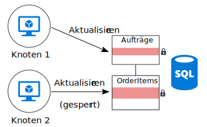
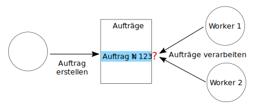

# Minimieren der Koordination 

## Minimieren Sie die Koordination zwischen Anwendungsdiensten, um Skalierbarkeit zu erzielen.

Die meisten Cloudanwendungen bestehen aus mehreren Anwendungsdiensten – Web-Front-Ends, Datenbanken, Geschäftsprozessen, Bericht- und Analysefunktionen und vielem mehr. Um Skalierbarkeit und Zuverlässigkeit zu erzielen, sollte jeder dieser Dienste auf mehreren Instanzen ausgeführt werden. 

Was passiert, wenn zwei Instanzen versuchen, gleichzeitige Vorgänge auszuführen, die einen gemeinsamen Status betreffen? In einigen Fällen muss eine Koordination zwischen den Knoten stattfinden, um beispielsweise die Einhaltung von ACID-Garantien (Atomarität, Konsistenz, Isolation, Dauerhaftigkeit) sicherzustellen. In diesem Diagramm wartet `Node2` auf `Node1`, um eine Datenbanksperre aufzuheben:

Die Koordination schränkt die Vorteile der horizontalen Skalierung ein und verursacht Engpässe. In diesem Beispiel werden Sie vermehrt Sperrkonflikte bemerken, wenn Sie die Anwendung horizontal hochskalieren und weitere Instanzen hinzufügen. Im schlimmsten Fall warten die Front-End-Instanzen den größten Teil ihrer Zeit auf Sperren.

Eine „Exactly-Once“-Semantik ist eine weitere häufige Quelle der Koordination. Ein Beispiel: Ein Auftrag muss genau einmal verarbeitet werden. Zwei Worker lauschen auf neue Aufträge. `Worker1` nimmt einen Auftrag zur Verarbeitung an. Die Anwendung muss sicherstellen, dass einerseits `Worker2` keine doppelte Arbeit verrichtet und dass andererseits der Auftrag nicht verworfen wird, wenn `Worker1` abstürzt.

Sie können ein Muster wie [Scheduler-Agent-Supervisor][sas-pattern] verwenden, um die Koordination zwischen den Workern sicherzustellen. In diesem Fall wäre allerdings eine Partitionierung der Aufgaben vermutlich der bessere Ansatz. Jedem Worker wird ein bestimmter Auftragsbereich zugewiesen (beispielsweise getrennt nach Abrechnungsregion). Wenn ein Worker abstürzt, nimmt eine neue Instanz die Verarbeitung an der Stelle auf, an der die vorherige Instanz aufgehört hat, aber es entstehen keine Konflikte durch mehrere Instanzen.

## Empfehlungen

**Implementieren Sie die letztliche Konsistenz**. Wenn Daten verteilt sind, ist Koordination erforderlich, um Garantien für hohe Konsistenz zu erzwingen. Ein Beispiel: Ein Vorgang aktualisiert zwei Datenbanken. Anstatt den Vorgang in einem einzelnen Transaktionsbereich zu platzieren, ist es besser, wenn das System für letztliche Konsistenz sorgen kann – eventuell durch Verwendung des Musters [Ausgleichende Transaktion][compensating-transaction] –, um nach einem Fehler logisch ein Rollback ausführen zu können.

**Verwenden Sie Domänenereignisse, um den Zustand zu synchronisieren**. Ein [Domänenereignis][domain-event] ist ein Ereignis, das für die Domäne relevante Vorkommnisse aufzeichnet. Interessierte Dienste können auf das Ereignis lauschen, anstatt eine globale Transaktion zu verwenden, um für die Koordination zwischen mehreren Diensten zu sorgen. Bei diesem Ansatz muss das System die letztliche Konsistenz tolerieren (siehe vorherigen Punkt). 

**Berücksichtigen Sie Muster wie CQRS (Command Query Responsibility Segregation) und Event Sourcing**. Diese beiden Muster können dazu beitragen, Konflikte zwischen Lese- und Schreibworkloads zu reduzieren. 

- Das [CQRS-Muster][cqrs-pattern] trennt Lesevorgänge von Schreibvorgängen. In einigen Implementierungen sind die Lesedaten physisch von den Schreibdaten getrennt. 

- Beim [Event Sourcing-Muster][event-sourcing] werden Zustandsänderungen als eine Reihe von Ereignissen in einem nur zum Anfügen vorgesehenen Datenspeicher aufgezeichnet. Das Anfügen eines Ereignisses an den Datenstrom ist ein atomischer Vorgang, der nur eine minimale Sperre erfordert. 

Diese beiden Muster ergänzen sich. Wenn der lesegeschützte Speicher im CQRS-Muster das Event Sourcing verwendet, kann der schreibgeschützte Speicher auf die gleichen Ereignisse lauschen, um eine lesbare, für Abfragen optimierte Momentaufnahme des aktuellen Zustands zu erstellen. Bevor Sie CQRS oder Event Sourcing implementieren, sollten Sie sich jedoch über die Herausforderungen dieses Ansatzes im Klaren sein. Weitere Informationen finden Sie unter [Architekturstil für CQRS][cqrs-style].

**Partitionieren Sie Daten**.  Vermeiden Sie es, all Ihre Daten in ein Datenschema zu platzieren, das von vielen Anwendungsdiensten gemeinsam genutzt wird. Eine Microservicearchitektur unterstreicht dieses Prinzip, indem jeder Dienst für den eigenen Datenspeicher zuständig ist. Innerhalb einer Datenbank kann das Partitionieren von Daten in Shards die Parallelität verbessern, da ein Dienst, der Daten in einen Shard schreibt, sich nicht auf einen Dienst auswirkt, der Daten in einen anderen Shard schreibt.

**Entwerfen Sie idempotente Vorgänge**. Entwerfen Sie Vorgänge nach Möglichkeit idempotent. Auf diese Weise können sie mit einer „Least-Once“-Semantik verarbeitet werden. Sie können z.B. Arbeitselemente in eine Warteschlange einreihen. Wenn ein Worker während eines Vorgangs abstürzt, kann ein anderer Worker das Arbeitselement ganz einfach übernehmen.

**Verwenden Sie asynchrone parallele Verarbeitung**. Wenn ein Vorgang mehrere Schritte erfordert, die asynchron ausgeführt werden (z.B. Remotedienstaufrufe), können Sie diese möglicherweise parallel aufrufen und die Ergebnisse aggregieren. Bei diesem Ansatz wird davon ausgegangen, dass kein Schritt von den Ergebnissen des vorherigen Schritts abhängig ist.   

**Verwenden Sie nach Möglichkeit die optimistische Parallelität**. Bei der pessimistischen Parallelität werden Datenbanksperren verwendet, um Konflikte zu verhindern. Dies kann zu eine unzureichenden Leistung führen und die Verfügbarkeit verringern. Bei der optimistischen Parallelität ändert jede Transaktion eine Kopie oder Momentaufnahme der Daten. Wenn ein Commit für die Transaktion ausgeführt wird, überprüft die Datenbank-Engine die Transaktion und lehnt sie ab, wenn sie die Datenbankkonsistenz beeinträchtigen würde. 

Azure SQL-Datenbank und SQL Server unterstützen die optimistische Parallelität durch [Momentaufnahmenisolation][sql-snapshot-isolation]. Einige Azure-Speicherdienste unterstützen die optimistische Parallelität durch die Verwendung von ETags, z.B. [Azure Cosmos DB][cosmosdb-faq] und [Azure Storage][storage-concurrency].

**Ziehen Sie MapReduce oder andere parallele, verteilte Algorithmen in Betracht**. Je nach Daten und der Art der auszuführenden Aufgaben können Sie die Aufgaben möglicherweise in unabhängige Tasks aufteilen, die von mehreren Knoten parallel ausgeführt werden können. Weitere Informationen dazu finden Sie unter [Big Compute-Architekturstil][big-compute].

**Verwenden Sie die Auswahl einer übergeordneten Instanz für die Koordination**. In Fällen, in denen Sie Vorgänge koordinieren müssen, stellen Sie sicher, dass die koordinierende Instanz nicht zu einem Single Point of Failure in der Anwendung wird. Bei Verwendung des [Musters für die Auswahl einer übergeordneten Instanz][leader-election] ist eine Instanz zu jedem Zeitpunkt übergeordnet und agiert als Koordinator. Wenn die übergeordnete Instanz ausfällt, wird eine neue Instanz als übergeordnete Instanz ausgewählt. 
 

<!-- links -->

[big-compute]: ../architecture-styles/big-compute.md
[compensating-transaction]: ../../patterns/compensating-transaction.md
[cqrs-style]: ../architecture-styles/cqrs.md
[cqrs-pattern]: ../../patterns/cqrs.md
[cosmosdb-faq]: /azure/cosmos-db/faq
[domain-event]: https://martinfowler.com/eaaDev/DomainEvent.html
[event-sourcing]: ../../patterns/event-sourcing.md
[leader-election]: ../../patterns/leader-election.md
[sas-pattern]: ../../patterns/scheduler-agent-supervisor.md
[sql-snapshot-isolation]: /sql/t-sql/statements/set-transaction-isolation-level-transact-sql
[storage-concurrency]: https://azure.microsoft.com/blog/managing-concurrency-in-microsoft-azure-storage-2/