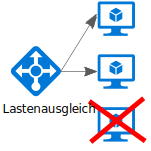
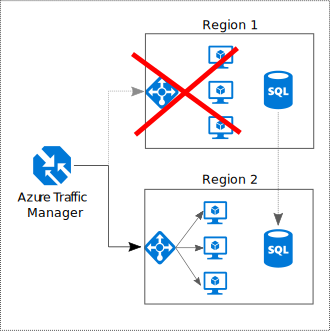

# Herstellen von Redundanz für alle Anwendungskomponenten

## Schaffen von Redundanz in Ihrer Anwendung, um Ausfälle einzelner Komponenten zu verhindern

In einer robusten Anwendung werden Ausfälle umgangen. Identifizieren Sie die kritischen Pfade in Ihrer Anwendung. Ist die Redundanz an jedem Punkt des Pfads gewährleistet? Wird für die Anwendung ein Failover durchgeführt, wenn ein Subsystem ausfällt?

## Empfehlungen 

**Berücksichtigen Sie die geschäftlichen Anforderungen.** Der Umfang der Redundanz, die in ein System integriert ist, kann sich sowohl auf die Kosten als auch auf die Komplexität auswirken. Ihre Architektur sollte an Ihren geschäftlichen Anforderungen ausgerichtet sein, z.B. der Recovery Time Objective (RTO). Eine Bereitstellung in mehreren Regionen ist beispielsweise teurer als in nur einer Region und außerdem komplizierter zu verwalten. Sie benötigen Verfahren zur Durchführung der Failover- und Failbackprozesse. Die zusätzlichen Kosten und die höhere Komplexität sind für einige Geschäftsszenarien ggf. gerechtfertigt, während dies für andere nicht der Fall ist.

**Ordnen Sie VMs hinter einem Lastenausgleichsmodul an.** Verwenden Sie für unternehmenskritische Workloads keine einzelnen VMs. Ordnen Sie stattdessen mehrere VMs hinter einem Lastenausgleichsmodul an. Wenn eine VM nicht mehr verfügbar ist, verteilt der Lastenausgleich den Datenverkehr auf die restlichen intakten VMs. Informationen zur Bereitstellung dieser Konfiguration finden Sie unter [Run load-balanced VMs for scalability and availability][multi-vm-blueprint] (Ausführen von VMs mit Lastenausgleich zur Sicherstellung der Skalierbarkeit und Verfügbarkeit).

**Replizieren Sie Datenbanken.** Bei Azure SQL-Datenbank und Cosmos DB werden die Daten automatisch in einer Region repliziert, und Sie können die Georeplikation regionsübergreifend aktivieren. Wählen Sie bei Verwendung einer IaaS-Datenbanklösung die Lösung, für die Replikation und Failover unterstützt werden, z.B. [Always On-Verfügbarkeitsgruppen (SQL Server)][sql-always-on]. 

**Aktivieren Sie die Georeplikation.** Bei der Georeplikation für [Azure SQL-Datenbank][sql-geo-replication] und [Cosmos DB][docdb-geo-replication] werden sekundäre lesbare Replikate Ihrer Daten in einer oder mehreren Regionen erstellt. Bei einem Ausfall kann die Datenbank für Schreibvorgänge ein Failover in die sekundäre Region durchführen.

**Nutzen Sie die Partitionierung, um die Verfügbarkeit sicherzustellen.** Die Datenbankpartitionierung wird häufig verwendet, um die Skalierbarkeit zu verbessern, aber auch die Verfügbarkeit kann damit verbessert werden. Wenn ein Shard ausfällt, sind die anderen Shards weiterhin erreichbar. Ein Ausfall in einem Shard führt nur zu einer Störung einer Teilmenge der gesamten Transaktionen. 

**Führen Sie die Bereitstellung in mehr als einer Region durch.** Die höchste Verfügbarkeit erzielen Sie, indem Sie die Anwendung in mehr als einer Region bereitstellen. Für den seltenen Fall, dass ein Problem eine gesamte Region betrifft, kann für die Anwendung dann ein Failover in eine andere Region erfolgen. Im folgenden Diagramm ist eine in mehreren Regionen angeordnete Anwendung dargestellt, für die Azure Traffic Manager zur Durchführung von Failovern verwendet wird.

**Synchronisieren Sie Front-End- und Back-End-Failover.** Nutzen Sie Azure Traffic Manager für das Failover des Front-Ends. Wenn das Front-End in einer Region nicht mehr erreichbar ist, leitet Traffic Manager neue Anforderungen an die sekundäre Region weiter. Je nach Datenbanklösung müssen Sie das Failover für die Datenbank ggf. koordinieren. 

**Verwenden Sie automatische Failover und manuelle Failbacks.** Nutzen Sie Traffic Manager für automatische Failover, aber nicht für automatische Failbacks. Beim automatischen Failback besteht das Risiko, dass Sie zur primären Region wechseln, bevor die Region vollständig fehlerfrei ist. Überprüfen Sie vor einem manuellen Failback stattdessen, ob alle Subsysteme der Anwendung fehlerfrei sind. Je nach Datenbank müssen Sie vor einem Failback unter Umständen auch die Datenkonsistenz prüfen.

**Stellen Sie für Traffic Manager die Redundanz sicher.** Traffic Manager ist ein möglicher Fehlerpunkt. In der Vereinbarung zum Servicelevel (SLA) für Traffic Manager erfahren Sie, ob Ihre geschäftlichen Anforderungen für Hochverfügbarkeit mit Traffic Manager allein erfüllt werden. Wenn dies nicht der Fall ist, sollten Sie als Failback eine andere Verwaltungslösung für den Datenverkehr erwägen. Wenn der Azure Traffic Manager-Dienst fehlerhaft ist, ändern Sie die CNAME-Einträge im DNS so, dass diese auf die andere Verwaltungslösung für den Datenverkehr verweisen.

<!-- links -->

[multi-vm-blueprint]: ../../reference-architectures/virtual-machines-windows/multi-vm.md

[cassandra]: http://cassandra.apache.org/
[docdb-geo-replication]: /azure/documentdb/documentdb-distribute-data-globally
[sql-always-on]: https://msdn.microsoft.com/library/hh510230.aspx
[sql-geo-replication]: /azure/sql-database/sql-database-geo-replication-overview
