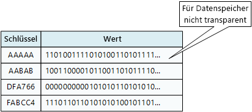
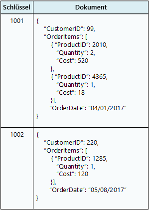
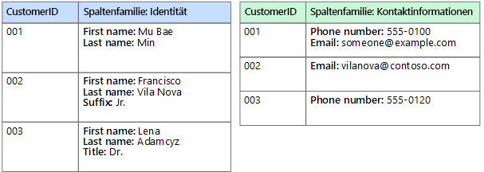

# Auswählen des richtigen Datenspeichers

Moderne Geschäftssysteme müssen mit immer mehr Daten zurechtkommen. Daten können aus externen Diensten stammen, vom System selbst generiert oder von Benutzern erstellt werden. Diese Datenmengen können sehr unterschiedliche Eigenschaften und Verarbeitungsanforderungen haben. Unternehmen nutzen Daten, um Trends zu bewerten, Geschäftsprozesse auszulösen, ihre Abläufe zu überprüfen, das Kundenverhalten zu analysieren und vieles mehr. 

Diese Vielschichtigkeit bedeutet, dass ein einzelner Datenspeicher in der Regel nicht die beste Wahl ist. Stattdessen ist es oft besser, verschiedene Arten von Daten in verschiedenen Datenspeichern abzulegen, die jeweils auf eine bestimmte Workload oder ein bestimmtes Nutzungsmuster abgestimmt sind. Der Begriff *Polyglot Persistence* (automatisierte Verwendung verschiedener Datenbanksysteme) wird verwendet, um Lösungen zu beschreiben, die eine Mischung aus Datenspeichertechnologien nutzen.

Die Wahl des richtigen Datenspeichers für Ihre Anforderungen ist eine wichtige Entwurfsentscheidung. Es gibt buchstäblich Hunderte von Implementierungen, aus denen Sie unter SQL- und NoSQL-Datenbanken wählen können. Datenspeicher werden häufig nach der Strukturierung von Daten und den von ihnen unterstützten Betriebsarten kategorisiert. In diesem Artikel werden einige der gängigsten Speichermodelle beschrieben. Beachten Sie, dass eine bestimmte Datenspeichertechnologie mehrere Speichermodelle unterstützen kann. Beispielsweise kann ein Managementsystem für relationale Datenbanken (RDBMS) auch die Speicherung von Schlüsseln/Werten oder Diagrammen unterstützen. Tatsächlich gibt es einen allgemeinen Trend zur sogenannten *Multimodell*-Unterstützung, bei der ein einziges Datenbanksystem mehrere Modelle unterstützt. Aber dennoch ist es sinnvoll, mit verschiedenen Modelle allgemein vertraut zu sein. 

Nicht alle Datenspeicher in einer bestimmten Kategorie bieten den gleichen Funktionsumfang. Die meisten Datenspeicher bieten serverseitige Funktionalität zur Abfrage und Verarbeitung von Daten. In einigen Fällen ist diese Funktionalität in das Datenspeichermodul integriert. In anderen Fällen sind die Funktionen zur Datenspeicherung und -verarbeitung getrennt, und es gibt möglicherweise mehrere Optionen für Verarbeitung und Analyse. Datenspeicher unterstützen auch verschiedene programmgesteuerte und Verwaltungsschnittstellen. 

Grundsätzlich sollten Sie sich zunächst überlegen, welches Speichermodell für Ihre Anforderungen am besten geeignet ist. Ziehen Sie anschließend basierend auf Faktoren wie Funktionsumfang, Kosten und Verwaltbarkeit einen bestimmten Datenspeicher innerhalb dieser Kategorie in Betracht.

## Managementsysteme für relationale Datenbanken (RDBMS)

In relationalen Datenbanken werden Daten als eine Reihe zweidimensionaler Tabellen mit Zeilen und Spalten organisiert. Jede Tabelle hat ihre eigenen Spalten, und jede Zeile einer Tabelle hat den gleichen Satz von Spalten. Dieses Modell ist mathematisch begründet, und die meisten Anbieter bieten eine SQL-Variante (Structured Query Language) zum Abrufen und Verwalten von Daten. Ein RDBMS implementiert typischerweise einen transaktionskonsistenten Mechanismus, der dem ACID-Modell (Atomic, Consistent, Isolated, Durable [Atomarität, Konsistenz, Isolation, Dauerhaftigkeit]) zur Aktualisierung von Informationen entspricht. 

Ein RDBMS unterstützt üblicherweise ein Schema-on-Write-Modell, bei dem die Datenstruktur vorab definiert wird und alle Lese- oder Schreibvorgänge das Schema verwenden müssen. Dies steht im Gegensatz zu den meisten NoSQL-Datenspeichern, insbesondere Schlüssel-Wert-Typen. Hier geht das Schema-on-Read-Modell davon aus, dass der Client ein eigenes interpretierendes Schema für die aus der Datenbank kommenden Daten festlegt und das zu schreibende Datenformat dabei nicht berücksichtigt.

Ein RDBMS ist sehr nützlich, wenn strenge Konsistenzgarantien wichtig sind, wo alle Änderungen atomar sind, und Transaktionen die Daten immer in einem konsistenten Zustand belassen. Die zugrunde liegenden Strukturen eignen sich jedoch nicht für eine horizontale Skalierung durch eine computerübergreifende Verteilung von Speicher- und Verarbeitungsfunktionen. Darüber hinaus müssen Informationen, die in einem RDBMS gespeichert sind, in eine relationale Struktur gebracht werden, indem der Normalisierungsprozess befolgt wird. Obwohl dieser Prozess verständlich ist, kann er zu Effizienzproblemen führen, da logische Entitäten in Zeilen in separaten Tabellen zerlegt und die Daten bei der Ausführung von Abfragen wieder zusammengesetzt werden müssen. 

In Frage kommender Azure-Dienst: 

- [Azure SQL-Datenbank][sql-db]
- [Azure Database for MySQL][mysql]
- [Azure Database for PostgreSQL][postgres]

## Schlüssel-Wert-Speicher

Ein Schlüssel-Wert-Speicher ist im Wesentlichen eine große Hashtabelle. Sie ordnen jedem Datenwert einen eindeutigen Schlüssel zu. Der Schlüssel-Wert-Speicher verwendet diesen Schlüssel, um die Daten mithilfe einer entsprechenden Hashfunktion zu speichern. Die Hashfunktion wird gewählt, um eine gleichmäßige Verteilung der Hash-Schlüssel auf den Datenspeicher zu gewährleisten. 

Die meisten Schlüssel-Wert-Speicher unterstützen nur einfache Abfrage-, Einfüge- und Löschvorgänge. Um einen Wert (teilweise oder vollständig) zu modifizieren, muss eine Anwendung die vorhandenen Daten für den gesamten Wert überschreiben. Bei den meisten Implementierungen ist das Lesen oder Schreiben eines einzelnen Werts ein atomischer Vorgang. Wenn der Wert groß ist, kann das Schreiben einige Zeit in Anspruch nehmen. 

Eine Anwendung kann beliebige Daten als eine Menge von Werten speichern, obwohl bei einigen Schlüssel-Wert-Speichern die maximale Größe der Werte begrenzt ist. Die gespeicherten Werte sind für die Speichersystemsoftware nicht transparent. Die Anwendung muss alle Schemainformationen bereitstellen und interpretieren. Im Wesentlichen handelt es sich bei Werten um Blobs, und der Schlüssel-Wert-Speicher ruft den Wert einfach ab oder speichert ihn nach Schlüssel. 

Schlüssel-Wert-Speicher sind in hohem Maß für Anwendungen optimiert, die einfache Nachschlagevorgänge durchführen, jedoch weniger für Systeme geeignet, die Daten in verschiedenen Schlüssel-Wert-Speichern abfragen müssen. Schlüssel-Wert-Speicher sind auch nicht für Szenarien optimiert, in denen die Abfrage nach Wert wichtig ist, anstatt Nachschlagevorgänge nur auf der Basis von Schlüsseln durchzuführen. Beispielsweise können Sie bei einer relationalen Datenbank einen Datensatz mithilfe einer WHERE-Klausel finden, doch Schlüssel-Wert-Speicher bieten in der Regel keine solche Nachschlagefunktion für Werte.

Ein einziger Schlüssel-Wert-Speicher kann überaus skalierbar sein, da der Datenspeicher Daten problemlos auf mehrere Knoten auf getrennten Computern verteilen kann. 

In Frage kommender Azure-Dienst: 

- [Cosmos DB][cosmosdb]
- [Azure Redis Cache][redis-cache]

## Dokumentdatenbanken

Eine Dokumentdatenbank ähnelt im Prinzip einem Schlüssel-Wert-Speicher mit dem Unterschied, dass in ihr eine Sammlung benannter Felder und Daten (sog. Dokumente) gespeichert wird. Diese können einfache skalare Elemente oder zusammengesetzte Elemente wie Listen und untergeordnete Sammlungen sein. Die Daten in den Feldern eines Dokuments können auf verschiedene Arten codiert sein, z.B. als XML, YAML, JSON und BSON, oder auch als einfacher Text gespeichert werden. Im Gegensatz zu Schlüssel-Wert-Speichern werden die Felder in Dokumenten dem Speicherverwaltungssystem verfügbar gemacht, sodass eine Anwendung Daten abfragen und filtern kann, indem sie die Werte in diesen Feldern verwendet. 

Üblicherweise enthält ein Dokument die gesamten Daten einer Entität. Die Elemente, aus denen sich eine Entität zusammensetzt, sind anwendungsspezifisch. Eine Entität kann beispielsweise die Details eines Kunden, eines Auftrags oder einer Kombination aus beidem enthalten. Ein einzelnes Dokument kann Informationen enthalten, die auf mehrere relationale Tabellen in einem RDBMS verteilt sind. 

Ein Dokumentspeicher setzt nicht voraus, dass alle Dokumente die gleiche Struktur haben. Dieser Konzept der freien Form bietet ein hohes Maß an Flexibilität. Anwendungen können unterschiedliche Daten in Dokumenten speichern, wenn sich die Geschäftsanforderungen ändern.

Mithilfe des Dokumentschlüssels kann die Anwendung Dokumente abrufen. Dieser Schlüssel ist ein eindeutiger Bezeichner des Dokuments, der häufig einem Hashvorgang unterzogen wird, um eine gleichmäßige Verteilung der Daten zu ermöglichen. Einige Dokumentdatenbanken erstellen den Dokumentschlüssel automatisch. Andere ermöglichen Ihnen, ein Attribut des Dokuments anzugeben, das als Schlüssel verwendet werden soll. Die Anwendung kann auch auf Basis des Werts eines oder mehrerer Felder Dokumente abfragen. Einige Dokumentdatenbanken unterstützen die Indizierung, um eine schnelle Suche nach Dokumenten zu ermöglichen, die auf einem oder mehreren indizierten Feldern basieren. 

Viele Dokumentdatenbanken unterstützen direkte Aktualisierungen, sodass eine Anwendung die Werte bestimmter Felder in einem Dokument ändern kann, ohne das gesamte Dokument neu schreiben zu müssen. Lese- und Schreibvorgänge in mehreren Feldern eines Dokuments sind in der Regel atomisch.

In Frage kommender Azure-Dienst: [Cosmos DB][cosmosdb]

## Diagrammdatenbanken

In einer Diagrammdatenbank werden zwei Arten von Informationen gespeichert: Knoten und Edges. Sie können sich Knoten als Entitäten vorstellen. Edges geben die Beziehungen zwischen Knoten an. Sowohl Knoten als auch Edges können Eigenschaften haben, die ähnlich wie Spalten in einer Tabelle Informationen zum Knoten oder Edge liefern. Edges können auch eine Richtung haben, die die Art der Beziehung angibt.

Der Zweck einer Diagrammdatenbank ist es, einer Anwendung zu ermöglichen, effizient Abfragen durchzuführen, die das Netzwerk von Knoten und Edges durchqueren, und die Beziehungen zwischen Entitäten zu analysieren. Das folgende Diagramm zeigt die Personaldatenbank einer Organisation in grafischer Form. Die Entitäten sind Mitarbeiter und Abteilungen, und die Edges zeigen die Hierarchiebeziehungen und Abteilung der Mitarbeiter. In diesem Diagramm zeigen die Pfeile an den Edges die Richtung der Beziehungen an.
 

Diese Struktur macht es einfach, Abfragen wie „Alle Mitarbeiter finden, die Sarah direkt oder indirekt unterstellt sind“ oder „Wer arbeitet in derselben Abteilung wie John?“ auszuführen. Bei großen Diagrammen mit vielen Entitäten und Beziehungen können Sie sehr komplexe Analysen sehr schnell durchführen. Viele Diagrammdatenbanken bieten eine Abfragesprache, mit der Sie ein Beziehungsnetz effizient durchlaufen können. 

In Frage kommender Azure-Dienst: [Cosmos DB][cosmosdb]

## Spaltenfamilien-Datenbanken

In einer Spaltenfamilien-Datenbank sind Daten in Zeilen und Spalten organisiert. In ihrer einfachsten Form kann eine Spaltenfamilien-Datenbank zumindest konzeptionell einer relationalen Datenbank sehr ähnlich erscheinen. Die eigentliche Stärke einer SpaltenfamilienFamily-Datenbank liegt in ihrem denormalisierten Ansatz zur Strukturierung von Daten mit geringer Dichte. 

Sie können sich eine Spaltenfamilien-Datenbank als eine Datenbank mit tabellarischen Daten in Zeilen und Spalten vorstellen, wobei die Spalten in Gruppen unterteilt sind, die als *Spaltenfamilien* bezeichnet werden. Jede Spaltenfamilie enthält eine Reihe von Spalten, die logisch miteinander verknüpft sind und typischerweise als Einheit abgerufen oder bearbeitet werden. Andere Daten, auf die separat zugegriffen wird, können in separaten Spaltenfamilien gespeichert werden. Innerhalb einer Spaltenfamilie können neue Spalten dynamisch hinzugefügt werden, und Zeilen müssen nicht für jede Spalte einen Wert aufweisen.

Das folgende Diagramm zeigt ein Beispiel mit zwei Spaltenfamilien, `Identity` und `Contact Info`. Die Daten für eine einzelne Entität haben in jeder Spaltenfamilie den gleichen Zeilenschlüssel. Diese Struktur, bei der die Zeilen für ein beliebiges Objekt in einer Spaltenfamilie dynamisch variieren können, ist ein wichtiger Vorteil des Spaltenfamilienansatzes. Dadurch eignet sich diese Form der Datenspeicherung hervorragend für die Speicherung strukturierter, flüchtiger Daten.

 

Im Gegensatz zu einem Schlüssel-Wert-Speicher oder einer Dokumentendatenbank speichern die meisten Spaltenfamilien-Datenbanken Daten in Schlüsselreihenfolge und nicht durch die Berechnung eines Hashwerts. Viele Implementierungen erlauben, Indizes über bestimmte Spalten einer Spaltenfamilien zu erstellen. Indizes ermöglichen Ihnen, Daten nach Spaltenwert statt nach Zeilenschlüssel abzurufen.

Lese- und Schreibvorgänge für eine Zeile sind in der Regel mit einer einzigen Spaltenfamilien atomisch, obwohl einige Implementierungen Atomarität über die gesamte Zeile bieten und mehrere Spaltenfamilien umfassen.

In Frage kommender Azure-Dienst: [HBase in HDInsight][hbase]

## Datenanalysen

Datenanalysespeicher bieten massiv parallele Lösungen für die Erfassung, Speicherung und Analyse von Daten. Diese Daten werden auf mehrere Server verteilt, wobei eine Share-Nothing-Architektur verwendet wird, um die Skalierbarkeit zu maximieren und Abhängigkeiten zu minimieren. Die Daten sind wahrscheinlich nicht statisch, weshalb diese Speicher in der Lage sein müssen, große Mengen von Informationen zu verarbeiten, die in einer Vielzahl von Formaten aus mehreren Datenströmen eingehen, und gleichzeitig neue Abfragen weiter verarbeiten. 

In Frage kommender Azure-Dienst:

- [SQL Data Warehouse][sql-dw]
- [Azure Data Lake][data-lake]

## Suchmaschinen-Datenbanken  

Eine Suchmaschinen-Datenbank unterstützt die Suche nach Informationen, die sich in externen Datenspeichern und Diensten befinden. Eine Suchmaschinen-Datenbank kann verwendet werden, um riesige Datenmengen zu indizieren und einen Zugriff in nahezu Echtzeit auf diese Indizes zu ermöglichen. Obwohl Suchmaschinen-Datenbanken gemeinhin als Synonym für das Web gelten, werden sie von vielen großen Systemen verwendet, um strukturierte und spontane Suchfunktionen zusätzlich zu ihren eigenen Datenbanken bereitzustellen.

Die Hauptmerkmale einer Suchmaschinen-Datenbank sind die Fähigkeit, Informationen sehr schnell zu speichern und zu indizieren und schnelle Antwortzeiten für Suchanfragen zu bieten. Indizes können mehrdimensional sein und Freitextsuchen über große Mengen von Textdaten unterstützen. Die Indizierung kann mithilfe eines Pullmodells erfolgen, das von der Suchmaschinen-Datenbank ausgelöst wird, oder mit Hilfe eines Pushmodells, das durch externen Anwendungscode ausgelöst wird. 

Suchen können genau oder unscharf sein. Eine unscharfe Suche findet Dokumente, die mit einer Reihe von Begriffen übereinstimmen, und berechnet, wie genau diese übereinstimmen. Einige Suchmaschinen unterstützen auch linguistische Analysen, die Treffer auf der Basis von Synonymen, Gattungserweiterungen (z.B. Abgleich von `dogs` mit `pets`) und Wortstammerkennung (Abgleich von Wörtern mit demselben Wortstamm) liefern können. 

In Frage kommender Azure-Dienst: [Azure Search][search]

## Zeitreihen-Datenbanken

Zeitreihendaten sind eine Menge von Werten, die nach Zeit organisiert sind. Eine Zeitreihendatenbank ist eine Datenbank, die für diese Art von Daten optimiert ist. Zeitreihen-Datenbanken müssen eine sehr hohe Anzahl von Schreibvorgängen unterstützen, da sie typischerweise große Datenmengen in Echtzeit aus einer großen Anzahl von Quellen sammeln. Aktualisierungen sind selten, und Löschvorgänge erfolgen oft als Massenvorgänge. Obwohl die Datensätze, die in eine Zeitreihen-Datenbank geschrieben werden, im Allgemeinen klein sind, gibt es oft eine große Anzahl von Datensätzen, und die Gesamtdatenmenge kann schnell wachsen.

Zeitreihen-Datenbanken eignen sich besonders zur Speicherung von Telemetriedaten. Einsatzszenarien sind z.B. IoT-Sensoren oder Anwendungs- und Systemleistungsindikatoren.

In Frage kommender Azure-Dienst: [Time Series Insights][time-series]

## Objektspeicher  

Ein Objektspeicher ist optimiert für das Speichern und Abrufen großer binärer Objekte (Bilder, Dateien, Video- und Audiostreams, große Anwendungsdatenobjekte und -dokumente, VM-Datenträgerimages). Objekte in diesen Speichertypen setzen sich aus den gespeicherten Daten, einigen Metadaten und einer eindeutigen ID für den Objektzugriff zusammen. Objektspeicher ermöglichen die Verwaltung extrem großer Mengen unstrukturierter Daten.  

In Frage kommender Azure-Dienst: [Blob Storage][blob]

## Freigegebene Dateien   

Mitunter kann die Verwendung einfacher Flatfiles das effektivste Mittel zum Speichern und Abrufen von Informationen sein. Der Einsatz von Dateifreigaben ermöglicht den Zugriff auf Dateien über ein Netzwerk. Bei entsprechenden Sicherheits- und Kontrollmechanismen für den gleichzeitigen Zugriff kann die gemeinsame Nutzung von Daten auf diese Weise verteilten Diensten Folgendes ermöglichen: einen überaus skalierbaren Datenzugriff zur Durchführung grundlegender, allgemeiner Vorgänge wie beispielsweise einfacher Lese- und Schreibvorgänge.

In Frage kommender Azure-Dienst: [File Storage][file-storage]

<!-- links -->

[blob]: https://azure.microsoft.com/services/storage/blobs/
[cosmosdb]: https://azure.microsoft.com/services/cosmos-db/
[data-lake]: https://azure.microsoft.com/solutions/data-lake/
[file-storage]: https://azure.microsoft.com/services/storage/files/
[hbase]: /azure/hdinsight/hdinsight-hbase-overview
[mysql]: https://azure.microsoft.com/services/mysql/
[postgres]: https://azure.microsoft.com/services/postgresql/
[redis-cache]: https://azure.microsoft.com/services/cache/
[search]: https://azure.microsoft.com/services/search/
[sql-db]: https://azure.microsoft.com/services/sql-database
[sql-dw]: https://azure.microsoft.com/services/sql-data-warehouse/
[time-series]: https://azure.microsoft.com/services/time-series-insights/