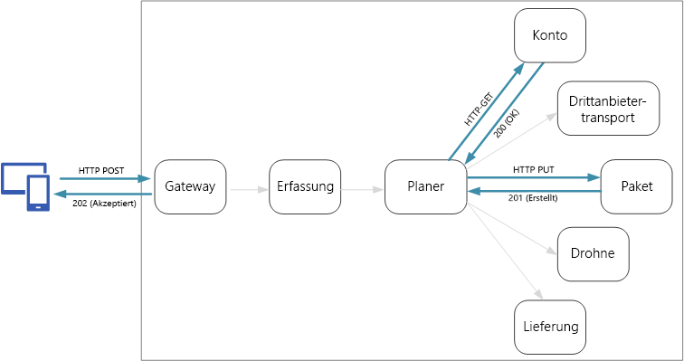
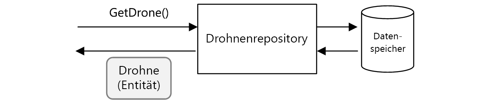
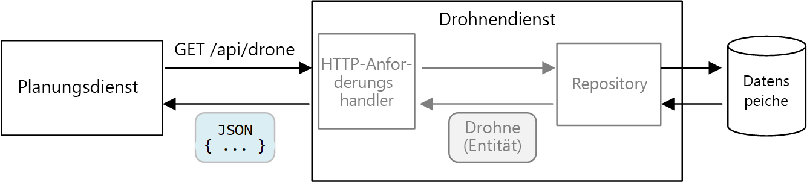
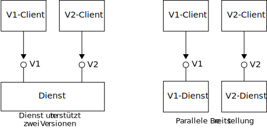

# <a name="designing-microservices-api-design"></a>Entwerfen von Microservices: API-Design

Ein gutes API-Design ist ein wichtiger Aspekt einer Microservices-Architektur, da der gesamte Datenaustausch zwischen Diensten entweder über Nachrichten oder über API-Aufrufe abgewickelt wird. APIs müssen effizient gestaltet sein, um [zu viele E/A-Vorgänge](../antipatterns/chatty-io/index.md) zu vermeiden. Da Dienste von unabhängigen Teams entworfen werden, müssen APIs über eine klar definierte Semantik und über klar definierte Versionsschemas verfügen, damit andere Dienste nicht durch Updates beeinträchtigt werden.



Es ist wichtig, zwischen zwei Arten von APIs zu unterscheiden:

- Öffentliche APIs, die von Clientanwendungen aufgerufen werden 
- Back-End-APIs, die für die Kommunikation zwischen Diensten verwendet werden

Diese beiden Anwendungsfälle haben unterschiedliche Anforderungen. Eine öffentliche API muss mit Clientanwendungen kompatibel sein. Dabei handelt es sich in der Regel um Browseranwendungen oder native mobile Anwendungen. In den meisten Fällen verwendet die öffentliche API hierzu REST über HTTP. Bei den Back-End-APIs ist hingegen die Netzwerkleistung zu berücksichtigen. Abhängig von der Granularität Ihrer Dienste kann die Kommunikation zwischen Diensten zu einem hohen Datenverkehrsaufkommen im Netzwerk führen. Dienste können schnell E/A-gebunden werden. Aspekte wie Serialisierungsgeschwindigkeit und Nutzlastgröße werden dadurch noch wichtiger. Beliebte Alternativen zur Verwendung von REST über HTTP sind gRPC, Apache Avro und Apache Thrift. Diese Protokolle unterstützen die binäre Serialisierung und sind generell effizienter als HTTP.

## <a name="considerations"></a>Überlegungen

Im Anschluss finden Sie einige Punkte, die Sie bei der Implementierung einer API berücksichtigen sollten.

**REST oder RPC:** Wägen Sie die Vor- und Nachteile einer REST-basierten Schnittstelle gegen die Vor- und Nachteile einer RPC-basierten Schnittstelle ab.

- REST modelliert Ressourcen, wodurch sich Ihr Domänenmodell unter Umständen auf natürliche Weise ausdrücken lässt. REST definiert eine einheitliche Schnittstelle auf der Grundlage von HTTP-Verben, was der Evolvierbarkeit zugute kommt. Die Semantik ist im Hinblick auf Idempotenz, Nebenwirkungen und Antwortcodes klar definiert. Außerdem erzwingt REST eine zustandslose Kommunikation, was die Skalierbarkeit verbessert. 

- Bei RPC stehen eher Vorgänge und Befehle im Mittelpunkt. Die Ähnlichkeit zwischen RPC-Schnittstellen und lokalen Methodenaufrufen führt unter Umständen dazu, dass Sie APIs mit übermäßiger Kommunikation entwickeln. Das bedeutet aber nicht, dass die Verwendung von RPC zwingend zu übermäßiger Kommunikation führt. Die Schnittstelle muss lediglich sorgfältig entworfen werden.

Bei einer RESTful-Schnittstelle fällt die Wahl üblicherweise auf REST über HTTP mit JSON. Für eine RPC-basierte Schnittstelle stehen mehrere beliebte Frameworks wie gRPC, Apache Avro und Apache Thrift zur Verfügung.

**Effizienz:** Die Effizienz hängt von der Geschwindigkeit, dem Arbeitsspeicher und der Nutzlastgröße ab. Eine gRPC-basierte Schnittstelle ist üblicherweise schneller als REST über HTTP.

**Interface Definition Language (IDL):** Eine IDL dient zum Definieren der Methoden, Parameter und Rückgabewerte einer API. Mit einer IDL können Sie Clientcode, Serialisierungscode und die API-Dokumentation generieren. IDLs können auch von API-Testtools wie Postman genutzt werden. Frameworks wie gRPC, Avro und Thrift definieren ihre eigenen IDL-Spezifikationen. REST über HTTP verfügt zwar nicht über ein IDL-Standardformat, eine gängige Option ist jedoch OpenAPI (ehemals Swagger). Sie können auch eine HTTP-REST-API ohne formale Definitionssprache erstellen, dadurch verlieren Sie aber die Vorteile von Codegenerierung und Tests.

**Serialisierung:** Wie werden Objekte bei der Übertragung serialisiert? Zur Verfügung stehen textbasierte Formate (hauptsächlich JSON) sowie binäre Formate wie etwa Protokollpuffer. Binäre Formate sind im Allgemeinen schneller als textbasierte Formate. JSON bietet jedoch Vorteile bei der Interoperabilität, da die meisten Sprachen und Frameworks die JSON-Serialisierung unterstützen. Einige Serialisierungsformate benötigen ein festes Schema, und einige erfordern die Kompilierung einer Schemadefinitionsdatei. In diesem Fall müssen Sie diesen Schritt in Ihren Buildprozess integrieren. 

**Framework- und Sprachunterstützung:** HTTP wird in nahezu jedem Framework und in fast jeder Sprache unterstützt. gRPC, Avro und Thrift verfügen jeweils über Bibliotheken für C++, C#, Java und Python. Thrift und gRPC unterstützen auch Go. 

**Kompatibilität und Interoperabilität:** Wenn Sie sich für ein Protokoll wie gRPC entscheiden, benötigen Sie unter Umständen eine Protokollübersetzungsebene zwischen der öffentlichen API und dem Back-End. Diese Funktion kann von einem [Gateway](./gateway.md) übernommen werden. Überlegen Sie sich bei Verwendung eines Dienstnetzes, welche Protokolle mit dem Dienstnetz kompatibel sind. Linkerd verfügt beispielsweise über integrierte Unterstützung für HTTP, Thrift und gRPC. 

Grundsätzlich empfiehlt es sich, REST über HTTP zu verwenden – es sei denn, Sie benötigen die Leistungsvorteile eines Binärprotokolls. Für REST über HTTP sind keine speziellen Bibliotheken erforderlich. Auch die Kopplung hält sich in Grenzen, da Aufrufer für die Kommunikation mit dem Dienst keinen Client-Stub benötigen. Zur Unterstützung von Schemadefinitionen, Tests und der Überwachung von RESTful-HTTP-Endpunkten steht ein umfangreiches Angebot an Tools zur Verfügung. Außerdem ist HTTP mit Browserclients kompatibel, sodass keine Protokollübersetzungsebene zwischen Client und Back-End benötigt wird. 

Wenn Sie sich für REST über HTTP entscheiden, sollten Sie sich allerdings bereits in einer frühen Phase des Entwicklungsprozesses mittels Leistungs- und Auslastungstests vergewissern, dass diese Variante für Ihr Szenario geeignet ist.

## <a name="restful-api-design"></a>RESTful-API-Design

Für das Entwerfen von RESTful-APIs stehen zahlreiche Ressourcen zur Verfügung. Eine kleine Auswahl:

- [API-Design](../best-practices/api-design.md) 

- [API-Implementierung](../best-practices/api-implementation.md) 

- [Microsoft REST API Guidelines](https://github.com/Microsoft/api-guidelines) (REST-API-Richtlinien von Microsoft)

Im Anschluss folgen einige Punkte, die Sie berücksichtigen sollten.

- Achten Sie auf APIs, die interne Implementierungsdetails offenlegen oder einfach ein internes Datenbankschema widerspiegeln. Die API sollte die Domäne modellieren. Sie ist ein Vertrag zwischen Diensten und sollte sich im Idealfall nur ändern, wenn neue Funktionen hinzukommen – nicht, weil Sie Code umgestaltet oder eine Datenbanktabelle normalisiert haben. 

- Unterschiedliche Arten von Clients (etwa mobile Anwendungen und Desktop-Webbrowser) erfordern unter Umständen unterschiedliche Nutzlastgrößen oder Interaktionsmuster. Erstellen Sie ggf. unter Verwendung des Musters [Back-Ends für Front-Ends](../patterns/backends-for-frontends.md) separate Back-Ends für die einzelnen Clients, die eine optimale Schnittstelle für den jeweiligen Client verfügbar machen.

- Machen Sie Vorgänge mit Nebenwirkungen ggf. idempotent, und implementieren Sie sie als PUT-Methoden. Das ermöglicht sichere Wiederholungen und kann die Resilienz verbessern. Dieser Aspekt wird in den Themen [Erfassung und Workflow](./ingestion-workflow.md#idempotent-vs-non-idempotent-operations) und [Kommunikation zwischen Diensten](./interservice-communication.md) ausführlicher behandelt.

- HTTP-Methoden können über asynchrone Semantik verfügen, sodass die Methode zwar umgehend eine Antwort zurückgibt, der Dienst den Vorgang aber asynchron ausführt. In diesem Fall sollte die Methode den Antwortcode [HTTP 202](https://www.w3.org/Protocols/rfc2616/rfc2616-sec10.html) zurückgeben. Dieser Code gibt an, dass die Anforderung zur Verarbeitung akzeptiert wurde, die Verarbeitung aber noch nicht abgeschlossen ist.

## <a name="mapping-rest-to-ddd-patterns"></a>Zuordnen von REST zu DDD-Mustern

Muster wie Entität, Aggregat und Wertobjekt dienen dazu, bestimmte Einschränkungen auf die Objekte in Ihrem Domänenmodell anzuwenden. In vielen DDD-Diskussionen werden die Muster mithilfe objektorientierter Sprachkonzepte wie Konstruktoren oder Getter-/Setter-Elementen für Eigenschaften modelliert. Ein Beispiel: *Wertobjekte* müssen unveränderlich sein. In einer objektorientierten Programmiersprache wird dies erzwungen, indem die Werte im Konstruktor zugewiesen und die Eigenschaften schreibgeschützt werden:

```ts
export class Location {
    readonly latitude: number;
    readonly longitude: number;

    constructor(latitude: number, longitude: number) {
        if (latitude < -90 || latitude > 90) {
            throw new RangeError('latitude must be between -90 and 90');
        }
        if (longitude < -180 || longitude > 180) {
            throw new RangeError('longitude must be between -180 and 180');
        }
        this.latitude = latitude;
        this.longitude = longitude;
    }
}
```

Solche Programmiermethoden sind besonders bei der Erstellung einer herkömmlichen monolithischen Anwendung wichtig. Bei einer umfangreichen Codebasis wird das Objekt `Location` unter Umständen von vielen Subsystemen verwendet. Daher ist es für das Objekt wichtig, das korrekte Verhalten zu erzwingen. 

Ein weiteres Beispiel ist das Repository-Muster, das sicherstellt, dass andere Teile der Anwendung nicht direkt aus dem Datenspeicher lesen oder direkt in den Datenspeicher schreiben:



In einer Microservices-Architektur verwenden Dienste jedoch nicht die gleiche Codebasis und teilen sich keine Datenspeicher. Stattdessen kommunizieren sie über APIs. Ein Beispiel: Angenommen, der Dienst „Scheduler“ (Planung) fordert vom Dienst „Drone“ (Drohne) Informationen zu einer Drohne an. Der Drohnendienst verfügt über ein durch Code ausgedrücktes Modell einer Drohne. Dieses steht dem Planungsdienst jedoch nicht zur Verfügung. Stattdessen wird an ihn eine *Darstellung* der Drohnenentität zurückgegeben – beispielsweise als JSON-Objekt in einer HTTP-Antwort.



Der Planungsdienst kann die internen Modelle des Drohnendiensts nicht ändern oder Code in den Datenspeicher des Drohnendiensts schreiben. Das bedeutet, der Code, der den Drohnendienst implementiert, hat im Vergleich zu einer herkömmlichen monolithischen Anwendung eine kompaktere verfügbare Oberfläche. Wenn der Drohnendienst eine Klasse vom Typ „Location“ (Position) definiert, ist der Geltungsbereich dieser Klasse eingeschränkt, sodass die Klasse von keinem anderen Dienst direkt genutzt werden kann. 

Aus diesen Gründen gehen wir in diesem Leitfaden nicht weiter auf Programmiermethoden ein, die sich auf die taktischen DDD-Muster beziehen. Es stellt sich jedoch heraus, dass Sie viele der DDD-Muster auch über REST-APIs modellieren können. 

Beispiel: 

- Aggregate lassen sich auf natürliche Weise *Ressourcen* in REST zuordnen. So wird beispielsweise das Aggregat „Delivery“ (Lieferung) durch die Delivery-API als Ressource verfügbar gemacht.

- Aggregate sind Konsistenzgrenzen. Aggregatvorgänge dürfen niemals dazu führen, dass sich ein Aggregat in einem inkonsistenten Zustand befindet. Daher sollten Sie keine APIs erstellen, über die ein Client den internen Zustand eines Aggregats ändern kann. Verwenden Sie stattdessen undifferenzierte APIs, die Aggregate als Ressourcen verfügbar machen.

- Entitäten verfügen über eindeutige Identitäten. In REST besitzen Ressourcen eindeutige Bezeichner in Form von URLs. Erstellen Sie Ressourcen-URLs, die der Domänenidentität einer Entität entsprechen. Die Zuordnung von URLs zu Domänenidentitäten muss für den Client nicht transparent sein.

- Untergeordnete Entitäten eines Aggregats sind per Navigation über die Stammentität erreichbar. Wenn Sie sich an die [HATEOAS](https://en.wikipedia.org/wiki/HATEOAS)-Prinzipien halten, sind untergeordnete Entitäten über Links in der Darstellung der übergeordneten Entität erreichbar. 

- Da Wertobjekte unveränderlich sind, wird zur Aktualisierung das gesamte Wertobjekt ersetzt. In REST werden Aktualisierungen über PUT oder PATCH-Anforderungen implementiert. 

- Ein Repository ermöglicht es Clients, Objekte in einer Sammlung abzufragen sowie Objekte zu einer Sammlung hinzuzufügen oder daraus zu entfernen, wobei die Details des zugrunde liegenden Datenspeichers abstrahiert werden. In REST kann eine Sammlung eine eigenständige Ressource sein – mit Methoden zum Abfragen der Sammlung oder zum Hinzufügen neuer Entitäten.

Berücksichtigen Sie beim Entwerfen Ihrer APIs, dass diese nicht nur die Daten innerhalb des Modells, sondern das Domänenmodell an sich sowie die geschäftlichen Abläufe und die Einschränkungen für die Daten ausdrücken.

| DDD-Konzept | REST-Entsprechung | Beispiel | 
|-------------|-----------------|---------|
| Aggregat | Ressource | `{ "1":1234, "status":"pending"... }` | 
| Identität | URL | `http://delivery-service/deliveries/1` |
| Untergeordnete Entitäten | Links | `{ "href": "/deliveries/1/confirmation" }` |
| Aktualisierung von Wertobjekten | PUT oder PATCH | `PUT http://delivery-service/deliveries/1/dropoff` |
| Repository | Sammlung | `http://delivery-service/deliveries?status=pending` |


## <a name="api-versioning"></a>API-Versionsverwaltung

Eine API ist ein Vertrag zwischen einem Dienst und den Clients oder Consumern dieses Diensts. Wenn sich eine API ändert, besteht die Gefahr, dass Clients, die von der API abhängig sind, nicht mehr funktionieren. Dabei spielt es keine Rolle, ob es sich bei diesen Clients um externe Clients oder um andere Microservices handelt. Es empfiehlt sich daher, möglichst selten API-Änderungen vorzunehmen. Änderungen an der zugrunde liegenden Implementierung erfordern häufig keine Änderung der API. Irgendwann möchten Sie aber vermutlich neue Features oder Funktionen hinzufügen, die die Änderung einer vorhandenen API erfordern.

API-Änderungen sollten nach Möglichkeit abwärtskompatibel sein. Vermeiden Sie es beispielsweise, ein Feld aus einem Modell zu entfernen, da dies dazu führen kann, dass Clients, die dieses Feld erwarten, nicht mehr funktionieren. Das Hinzufügen eines Felds hat keine negativen Auswirkungen auf die Kompatibilität, da Clients Felder, die sie in einer Antwort nicht verstehen, grundsätzlich ignorieren sollten. Der Dienst muss jedoch den Fall behandeln, dass das neue Feld von einem älteren Client in einer Anforderung übergangen wird. 

Unterstützen Sie die Versionsverwaltung in Ihrem API-Vertrag. Wenn Sie eine grundlegende API-Änderung einführen, verbinden Sie dies mit der Einführung einer neuen API-Version. Unterstützen Sie die vorherige Version weiter, und lassen Sie Clients die Wahl, welche Version sie aufrufen möchten. Dies kann auf unterschiedliche Weise erreicht werden. Sie können beispielsweise einfach beide Versionen im gleichen Dienst verfügbar machen. Eine andere Möglichkeit besteht darin, zwei Versionen des Diensts parallel auszuführen und Anforderungen auf der Grundlage von HTTP-Routingregeln an eine der Versionen weiterzuleiten. 



Die Unterstützung mehrerer Versionen ist mit zusätzlicher Entwicklungszeit, zusätzlichen Tests und zusätzlichem Aufwand beim Betrieb verbunden. Es empfiehlt sich daher, alte Versionen schnellstmöglich auszumustern. Bei internen APIs kann das für die API zuständige Team mit anderen Teams zusammenarbeiten, um sie bei der Migration zu der neuen Version zu unterstützen. Hier ist ein teamübergreifender Governance-Prozess hilfreich. Bei externen (öffentlichen) APIs kann die Ausmusterung einer API-Version schwieriger sein – insbesondere, wenn die API von Drittanbietern oder von nativen Clientanwendungen genutzt wird. 

Wenn sich eine Dienstimplementierung ändert, ist es hilfreich, die Änderung mit einer Version zu kennzeichnen. Die Version liefert wichtige Informationen für die Fehlerbehandlung. Bei der Ursachenanalyse kann es überaus hilfreich sein, genau zu wissen, welche Dienstversion aufgerufen wurde. Erwägen Sie bei Dienstversionen die Anwendung von [Semantic Versioning](https://semver.org/) (semantische Versionierung). Die semantische Versionierung verwendet das Format *HAUPTVERSION.NEBENVERSION.PATCH*. Clients sollten eine API jedoch nur anhand der Hauptversionsnummer auswählen – oder ggf. anhand der Nebenversion, sofern zwischen Nebenversionen wesentliche Änderungen vorgenommen wurden, die allerdings nicht zu einer Beeinträchtigung führen dürfen. Anders ausgedrückt: Für Clients ist es sinnvoll, zwischen Version 1 und Version 2 einer API zu wählen. Die Wahl der Version 2.1.3 ist hingegen nicht sinnvoll. Bei einer solchen Granularität besteht die Gefahr, dass Sie mehr und mehr Versionen unterstützen müssen. 

Weitere Informationen zur API-Versionsverwaltung finden Sie unter [Versionsverwaltung einer RESTful-Web-API](../best-practices/api-design.md#versioning-a-restful-web-api).

> [!div class="nextstepaction"]
> [Erfassung und Workflow](./ingestion-workflow.md)