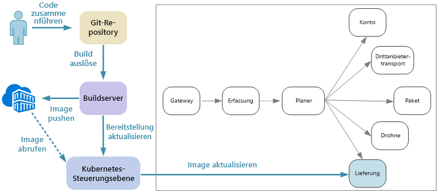
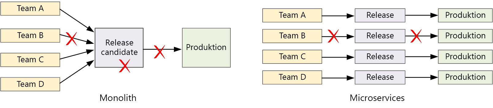

# Entwerfen von Microservices: Continuous IntegrationDesigning microservices: Continuous integration

Continuous Integration und Continuous Delivery (CI/CD) sind eine wichtige Voraussetzung für die erfolgreiche Verwendung von Microservices.Continuous integration and continuous delivery (CI/CD) are a key requirement for achieving success with microservices. Die Agilität, die von Microservices erwartet wird, lässt sich nur mit einem zuverlässigen CI/CD-Prozess erreichen.Without a good CI/CD process, you will not achieve the agility that microservices promise. Einige der CI/CD-bedingten Herausforderungen für Microservices sind auf die Verwendung mehrerer Codebasen und heterogener Buildumgebungen für die verschiedenen Dienste zurückzuführen.Some of the CI/CD challenges for microservices arise from having multiple code bases and heterogenous build environments for the various services. In diesem Kapitel werden die Herausforderungen und einige Lösungsansätze für das Problem beschrieben.This chapter describes the challenges and recommends some approaches to the problem.

Einer der Hauptgründe für die Implementierung einer Microservices-Architektur sind kürzere Versionszyklen.Faster release cycles are one of the biggest reasons to adopt a microservices architecture. 

In einer rein monolithischen Anwendung gibt es eine einzelne Buildpipeline, die die ausführbare Datei der Anwendung ausgibt.In a purely monolithic application, there is a single build pipeline whose output is the application executable. Sämtliche Entwicklungsarbeiten werden dieser Pipeline zugeführt.All development work feeds into this pipeline. Bei einem Fehler mit hoher Priorität muss eine Korrektur integriert, getestet und veröffentlicht werden, was die Veröffentlichung neuer Features verzögern kann.If a high-priority bug is found, a fix must be integrated, tested, and published, which can delay the release of new features. Diese Probleme lassen sich durch eine sorgfältige Modulgestaltung sowie durch die Verwendung von Featurebranches behandeln, die die Auswirkungen von Codeänderungen minimieren.It's true that you can mitigate these problems by having well-factored modules and using feature branches to minimize the impact of code changes. Mit zunehmender Komplexität und wachsendem Funktionsumfang einer monolithischen Anwendung nimmt jedoch häufig auch die Fehleranfälligkeit des Releaseprozesses zu.But as the application grows more complex, and more features are added, the release process for a monolith tends to become more brittle and likely to break. 

Die Microservices-Philosophie sieht kein langwieriges Releaseverfahren vor, in das sich die einzelnen Teams einreihen müssen.Following the microservices philosophy, there should never be a long release train where every team has to get in line. Das Team, das den Dienst „A“ erstellt, kann jederzeit ein Update veröffentlichen und muss nicht warten, bis Änderungen für den Dienst „B“ zusammengeführt, getestet und bereitgestellt wurden.The team that builds service "A" can release an update at any time, without waiting for changes in service "B" to be merged, tested, and deployed. Hierfür ist der CI/CD-Prozess unerlässlich.The CI/CD process is critical to making this possible. Ihre Releasepipeline muss automatisiert und äußerst zuverlässig sein, um die Risiken von Updatebereitstellungen zu minimieren.Your release pipeline must be automated and highly reliable, so that the risks of deploying updates are minimized. Bei täglich oder mehrmals täglich durchgeführten Veröffentlichungen in der Produktionsumgebung darf es nur ganz selten zu Regressionen oder Dienstausfällen kommen.If you are releasing to production daily or multiple times a day, regressions or service disruptions must be very rare. Sollte doch einmal ein fehlerhaftes Update bereitgestellt werden, müssen Sie schnell und zuverlässig einen Rollback oder Rollforward auf eine frühere Dienstversion ausführen können.At the same time, if a bad update does get deployed, you must have a reliable way to quickly roll back or roll forward to a previous version of a service.

CI/CD umfasst eigentlich mehrere verwandte Prozesse: Continuous Integration, Continuous Delivery und Continuous Deployment.When we talk about CI/CD, we are really talking about several related processes: Continuous integration, continuous delivery, and continuous deployment.

- Continuous Integration bedeutet, dass Änderungen am Code häufig in der Hauptverzweigung zusammengeführt werden. Durch automatisierte Build- und Testprozesse wird sichergestellt, dass der Code in der Hauptverzweigung immer die nötige Qualität für die Produktionsumgebung hat.Continuous integration means that code changes are frequently merged into the main branch, using automated build and test processes to ensure that  code in the main branch is always production-quality.

- Continuous Delivery bedeutet, dass Codeänderungen, die den CI-Prozess durchlaufen haben, automatisch in einer produktionsähnlichen Umgebung veröffentlicht werden.Continuous delivery means that code changes that pass the CI process are automatically published to a production-like environment. Für die Bereitstellung in der aktiven Produktionsumgebung ist unter Umständen eine manuelle Freigabe erforderlich, ansonsten ist der Prozess jedoch automatisiert.Deployment into the live production environment may require manual approval, but is otherwise automated. Dadurch soll erreicht werden, dass Ihr Code stets für die Bereitstellung in der Produktionsumgebung *bereit* ist.The goal is that your code should always be *ready* to deploy into production.

- Continuous Deployment bedeutet, dass Codeänderungen, die den CI/CD-Prozess durchlaufen haben, automatisch in der Produktionsumgebung bereitgestellt werden.Continuous deployment means that code changes that pass the CI/CD process are automatically deployed into production.

Im Kontext von Kubernetes und Microservices werden in der CI-Phase Containerimages erstellt, getestet und mithilfe von Push in eine Containerregistrierung übertragen.In the context of Kubernetes and microservices, the CI stage is concerned with building and testing container images, and pushing those images to a container registry. In der Bereitstellungsphase werden Pod-Spezifikationen aktualisiert, um das neueste Produktionsimage zu übernehmen.In the deployment stage, pod specs are updated to pick up the latest production image.

## HerausforderungenChallenges

- **Zahlreiche kompakte und unabhängige Codebasen:****Many small independent code bases**. Jedes Team ist für die Erstellung seines eigenen Diensts verantwortlich und verfügt über eine eigene Buildpipeline.Each team is responsible for building its own service, with its own build pipeline. In einigen Organisationen verwenden die Teams unter Umständen separate Coderepositorys.In some organizations, teams may use separate code repositories. Dies kann dazu führen, dass das Know-how für die Erstellung des Systems auf mehrere Teams verteilt ist und niemand in der Organisation weiß, wie die gesamte Anwendung bereitgestellt wird.This could lead to a situation where the knowledge of how to build the system is spread across teams, and nobody in the organization knows how to deploy the entire application. Was passiert beispielsweise in einem Notfallwiederherstellungsszenario, wenn Sie schnell eine Bereitstellung in einem neuen Cluster durchführen müssen?For example, what happens in a disaster recovery scenario, if you need to quickly deploy to a new cluster?   

- **Mehrere Sprachen und Frameworks:****Multiple languages and frameworks**. Wenn jedes Team seinen eigenen Technologie-Mix verwendet, kann es schwierig sein, einen einzelnen Buildprozess zu erstellen, der für die gesamte Organisation geeignet ist.With each team using its own mix of technologies, it can be difficult to create a single build process that works across the organization. Der Buildprozess muss so flexibel sein, dass jedes Team ihn für die gewählte Sprache oder das gewählte Framework anpassen kann.The build process must be flexible enough that every team can adapt it for their choice of language or framework. 

- **Integration und Auslastungstests:****Integration and load testing**. Wenn Teams Updates nach ihrem eigenen Zeitplan veröffentlichen, kann die Entwicklung zuverlässiger End-to-End-Tests zur Herausforderung werden – insbesondere, wenn Dienste von anderen Diensten abhängen.With teams releasing updates at their own pace, it can be challenging to design robust end-to-end testing, especially when services have dependencies on other services. Darüber hinaus kann der Betrieb eines vollwertigen Produktionsclusters teuer sein, weshalb es unwahrscheinlich ist, dass jedes Team allein zu Testzwecken einen eigenen vollwertigen Cluster auf Produktionsniveau betreiben kann.Moreover, running a full production cluster can be expensive, so it's unlikely that every team will be able to run its own full cluster at production scales, just for testing. 

- **Releaseverwaltung:****Release management**. Jedes Team sollte die Möglichkeit haben, ein Update in der Produktionsumgebung bereitzustellen.Every team should have the ability to deploy an update to production. Das bedeutet nicht, dass jedes einzelne Teammitglied über entsprechende Berechtigungen verfügt.That doesn't mean that every team member has permissions to do so. Durch eine zentrale Release-Manager-Rolle werden Bereitstellungen jedoch unter Umständen ausgebremst.But having a centralized Release Manager role can reduce the velocity of deployments. Je zuverlässiger und stärker automatisiert Ihr CI/CD-Prozess ist, desto weniger Bedarf besteht für eine zentrale Instanz.The more that your CI/CD process is automated and reliable, the less there should be a need for a central authority. Für die Veröffentlichung wichtiger Featureupdates und kleinerer Fehlerbehebung können jeweils unterschiedliche Richtlinien gelten.That said, you might have different policies for releasing major feature updates versus minor bug fixes. Die Verwendung eines dezentralen Konzepts darf jedoch nicht als Verzicht auf jegliche Art von Governance missverstanden werden.Being decentralized does not mean there should be zero governance.

- **Versionsverwaltung für Containerimages:****Container image versioning**. Im Rahmen des Entwicklungs- und Testzyklus erstellt der CI/CD-Prozess zahlreiche Containerimages.During the development and test cycle, the CI/CD process will build many container images. Nicht alle dieser Images kommen für die Veröffentlichung in Frage, und nur einige der so genannten Release Candidates werden mithilfe von Push in die Produktionsumgebung übertragen.Only some of those are candidates for release, and then only some of those release candidates will get pushed into production. Entwickeln Sie eine klare Versionsverwaltungsstrategie, damit Sie wissen, welche Images derzeit in der Produktionsumgebung bereitgestellt sind, und bei Bedarf einen Rollback auf eine vorherige Version ausführen können.You should have a clear versioning strategy, so that you know which images are currently deployed to production, and can roll back to a previous version if necessary. 

- **Dienstupdates:****Service updates**. Wenn Sie einen Dienst auf eine neue Version aktualisieren, dürfen dadurch keine anderen Dienste beeinträchtigt werden, die von diesem Dienst abhängen.When you update a service to a new version, it shouldn't break other services that depend on it. Bei einem parallelen Update werden vorübergehend verschiedene Versionen ausgeführt.If you do a rolling update, there will be a period of time when a mix of versions is running. 
 
Diese Herausforderungen spiegeln ein grundlegendes Dilemma wider:These challenges reflect a fundamental tension. Einerseits müssen Teams so unabhängig wie möglich arbeiten können.On the one hand, teams need to work as independently as possible. Andererseits ist eine gewisse Koordinierung erforderlich, damit eine einzelne Person beispielsweise einen Integrationstest durchführen, die gesamte Lösung in einem neuen Cluster erneut bereitstellen oder im Falle eines fehlerhaften Updates einen Rollback ausführen kann.On the other hand, some coordination is needed so that a single person can do tasks like running an integration test, redeploying the entire solution to a new cluster, or rolling back a bad update. 
 
## CI/CD-Ansätze für MicroservicesCI/CD approaches for microservices

Jedes Dienstteam sollte seine Buildumgebung in einem eigenen Container platzieren.It's a good practice for every service team to containerize their build environment. Dieser Container muss über sämtliche Buildtools verfügen, die zum Erstellen der Codeartefakte für den jeweiligen Dienst erforderlich sind.This container should have all of the build tools necessary to build the code artifacts for their service. Häufig steht ein offizielles Docker-Image für Ihre Kombination aus Sprache und Framework zur Verfügung.Often you can find an official Docker image for your language and framework. Anschließend können Sie den Build mithilfe von `docker run` oder Docker Compose ausführen.Then you can use `docker run` or Docker Compose to run the build. 

Mit diesem Ansatz ist die Einrichtung einer neuen Buildumgebung ein Kinderspiel.With this approach, it's trivial to set up a new build environment. Ein Entwickler, der Ihren Code erstellen möchte, muss nicht erst eine Reihe von Buildtools installieren, sondern einfach nur das Containerimage ausführen.A developer who wants to build your code doesn't need to install a set of build tools, but simply runs the container image. Vielleicht sogar noch wichtiger: Auch Ihr Buildserver kann für diese Aufgabe konfiguriert werden.Perhaps more importantly, your build server can be configured to do the same thing. Dadurch müssen Sie die Tools nicht auf dem Buildserver installieren oder sich mit Toolversionskonflikten beschäftigen.That way, you don't need to install those tools onto the build server, or manage conflicting versions of tools. 

Führen Sie den Dienst bei lokalen Entwicklungs- und Testaufgaben mithilfe von Docker innerhalb eines Containers aus.For local development and testing, use Docker to run the service inside a container. Im Zuge dieses Prozesses müssen Sie unter Umständen weitere Container mit Pseudodiensten oder Testdatenbanken ausführen, die für lokale Tests benötigt werden.As part of this process, you may need to run other containers that have mock services or test databases needed for local testing. Sie können diese Container mithilfe von Docker Compose koordinieren oder Kubernetes mithilfe von Minikube lokal ausführen.You could use Docker Compose to coordinate these containers, or use Minikube to run Kubernetes locally. 

Wenn der Code bereit ist, öffnen Sie eine Pull-Anforderung, und führen Sie ihn zu einem Master zusammen.When the code is ready, open a pull request and merge into master. Dadurch wird auf dem Buildserver ein Auftrag gestartet, der Folgendes umfasst:This will start a job on the build server:

1. Erstellen der CodeobjekteBuild the code assets. 
2. Ausführen von Komponententests für den CodeRun unit tests against the code.
3. Erstellen des ContainerimagesBuild the container image.
4. Testen des Containerimages durch Ausführen von Funktionstests in einem aktiven Container.Test the container image by running functional tests on a running container. Dieser Schritt dient zur Erkennung von Fehlern in der Docker-Datei (beispielsweise ein fehlerhafter Einstiegspunkt).This step can catch errors in the Docker file, such as a bad entry point.
5. Übertragen des Images an eine Containerregistrierung mithilfe von PushPush the image to a container registry.
6. Aktualisieren des Testclusters mit dem neuen Image zur Ausführung von IntegrationstestsUpdate the test cluster with the new image to run integration tests.

Wenn das Image für die Produktionsumgebung bereit ist, aktualisieren Sie die Bereitstellungsdateien nach Bedarf, um das neueste Image anzugeben (einschließlich möglicher Kubernetes-Konfigurationsdateien).When the image is ready to go into production, update the deployment files as needed to specify the latest image, including any Kubernetes configuration files. Wenden Sie dann das Update auf den Produktionscluster an.Then apply the update to the production cluster.

Im Anschluss folgen einige Empfehlungen zur Verbesserung der Zuverlässigkeit von Bereitstellungen:Here are some recommendations for making deployments more reliable:
 
- Definieren Sie organisationsweite Konventionen für Containertags und für die Versionsverwaltung sowie Namenskonventionen für im Cluster bereitgestellte Ressourcen (Pods, Dienste und Ähnliches).Define organization-wide conventions for container tags, versioning, and naming conventions for resources deployed to the cluster (pods, services, and so on). Dies kann die Diagnose von Bereitstellungsproblemen vereinfachen.That can make it easier to diagnose deployment issues. 

- Erstellen Sie zwei separate Containerregistrierungen: eine für Entwicklungs-/Testaufgaben und eine für die Produktion.Create two separate container registries, one for development/testing and one for production. Übertragen Sie ein Image erst dann mithilfe von Push in die Produktionsregistrierung, wenn Sie bereit sind, es in der Produktionsumgebung bereitzustellen.Don't push an image to the production registry until you're ready to deploy it into production. Wenn Sie diese Vorgehensweise mit der semantischen Versionsverwaltung von Containerimages kombinieren, verringert sich die Wahrscheinlichkeit, dass Sie versehentlich eine Version bereitstellen, die nicht für die Veröffentlichung freigegeben wurde.If you combine this practice with semantic versioning of container images, it can reduce the chance of accidentally deploying a version that wasn't approved for release.

## Aktualisieren von DienstenUpdating services

Für die Aktualisierung eines Diensts, der sich bereits in Produktion befindet, gibt es verschiedene Strategien.There are various strategies for updating a service that's already in production. Hier werden drei gängige Optionen erläutert: paralleles Update, Blaugrün-Bereitstellung und Canary-Release.Here we discuss three common options: Rolling update, blue-green deployment, and canary release.

### Paralleles UpdateRolling update 

Bei einem parallelen Update stellen Sie neue Instanzen eines Diensts bereit, und diese neuen Instanzen nehmen sofort Anforderungen entgegen.In a rolling update, you deploy new instances of a service, and the new instances start receiving requests right away. Wenn die neuen Instanzen online geschaltet werden, werden die vorherigen Instanzen entfernt.As the new instances come up, the previous instances are removed.

Parallele Updates sind das Standardverhalten in Kubernetes, wenn Sie die Pod-Spezifikation für eine Bereitstellung aktualisieren.Rolling updates are the default behavior in Kubernetes when you update the pod spec for a Deployment. Der Bereitstellungscontroller erstellt eine neue Replikatgruppe (ReplicaSet) für die aktualisierten Pods.The Deployment controller creates a new ReplicaSet for the updated pods. Anschließend wird die neue Replikatgruppe zentral hoch- und die alte Gruppe zentral herunterskaliert, sodass die gewünschte Replikatanzahl erhalten bleibt.Then it scales up the new ReplicaSet while scaling down the old one, to maintain the desired replica count. Alte Pods werden erst gelöscht, wenn die neuen Pods bereit sind.It doesn't delete old pods until the new ones are ready. Kubernetes protokolliert den Verlauf des Updates, damit Sie bei Bedarf mithilfe von kubectl einen Rollback für das Update ausführen können.Kubernetes keeps a history of the update, so you can use kubectl to roll back an update if needed. 

Falls Ihr Dienst eine langwierige Startaufgabe ausführt, können Sie einen Bereitschaftstest definieren.If your service performs a long startup task, you can define a readiness probe. Der Bereitschaftstest meldet, wenn der Container für den Empfang von Datenverkehr bereit ist.The readiness probe reports when the container is ready to start receiving traffic. Kubernetes sendet erst dann Datenverkehr an den Pod, wenn der Test eine Erfolgsmeldung zurückgibt.Kubernetes won't send traffic to the pod until the probe reports success. 

Eine der Herausforderungen bei parallelen Updates besteht darin, dass während der Aktualisierung eine Mischung aus alten und neuen Versionen ausgeführt wird und Datenverkehr empfängt.One challenge of rolling updates is that during the update process, a mix of old and new versions are running and receiving traffic. Während dieser Zeit können Anforderungen jeweils an eine der beiden Versionen weitergeleitet werden.During this period, any request could get routed to either of the two versions. Dies kann abhängig vom Umfang der Änderungen zwischen den beiden Versionen zu Problemen führen.That may or may not cause problems, depending on the scope of the changes between the two versions. 

### Blaugrün-BereitstellungBlue-green deployment

Bei einer Blaugrün-Bereitstellung stellen Sie die neue Version zusammen mit der vorherigen Version bereit.In a blue-green deployment, you deploy the new version alongside the previous version. Nach der Überprüfung der neuen Version leiten Sie sämtlichen Datenverkehr von der vorherigen Version zur neuen Version um.After you validate the new version, you switch all traffic at once from the previous version to the new version. Anschließend überwachen Sie die Anwendung auf mögliche Probleme.After the switch, you monitor the application for any problems. Im Problemfall können Sie zur alten Version zurückkehren.If something goes wrong, you can swap back to the old version. Liegen keine Probleme, können Sie die alte Version löschen.Assuming there are no problems, you can delete the old version.

Bei einer eher traditionellen monolithischen oder n-schichtigen Anwendung war eine Blaugrün-Bereitstellung in der Regel mit der Bereitstellung zweier identischer Umgebungen verbunden.With a more traditional monolithic or N-tier application, blue-green deployment generally meant provisioning two identical environments. Dabei musste die neue Version in einer Stagingumgebung bereitgestellt und der Clientdatenverkehr anschließend an die Stagingumgebung umgeleitet werden (beispielsweise durch Austauschen der VIP-Adressen).You would deploy the new version to a staging environment, then redirect client traffic to the staging environment &mdash; for example, by swapping VIP addresses.

In Kubernetes müssen Sie für eine Blaugrün-Bereitstellung keinen separaten Cluster bereitstellen.In Kubernetes, you don't need to provision a separate cluster to do blue-green deployments. Stattdessen können Sie Selektoren nutzen.Instead, you can take advantage of selectors. Erstellen Sie eine neue Bereitstellungsressource mit einer neuen Pod-Spezifikation und einem anderen Satz von Bezeichnungen.Create a new Deployment resource with a new pod spec and a different set of labels. Erstellen Sie diese Bereitstellung, ohne die vorherige Bereitstellung zu löschen oder den Dienst zu ändern, der darauf verweist.Create this deployment, without deleting the previous deployment or modifying the service that points to it. Wenn die neuen Pods aktiv sind, können Sie den Selektor des Diensts auf die neue Bereitstellung aktualisieren.Once the new pods are running, you can update the service's selector to match the new deployment. 

Ein Vorteil von Blaugrün Bereitstellungen ist, dass alle Pods gleichzeitig gewechselt werden.An advantage of blue-green deployments is that the service switches all the pods at the same time. Nach der Aktualisierung des Diensts werden alle neuen Anforderungen an die neue Version weitergeleitet.After the service is updated, all new requests get routed to the new version. Ein Nachteil ist, dass während der Aktualisierung doppelt so viele Pods für den Dienst (aktuelle und neue Version) aktiv sind.One drawback is that during the update, you are running twice as many pods for the service (current and next). Wenn die Pods einen hohen Bedarf an CPU- oder Arbeitsspeicherressourcen haben, müssen Sie den Cluster zur Bewältigung des Ressourcenbedarfs möglicherweise vorübergehend horizontal hochskalieren.If the pods require a lot of CPU or memory resources, you may need to scale out the cluster temporarily to handle the resource consumption. 

### Canary-ReleaseCanary release

Bei einem Canary-Release führen Sie eine aktualisierte Version für eine geringe Anzahl von Clients ein.In a canary release, you roll out an updated version to a small number of clients. Anschließend überwachen Sie das Verhalten des neuen Diensts, bevor Sie ihn für alle Clients einführen.Then you monitor the behavior of the new service before rolling it out to all clients. Dies ermöglicht eine langsame, kontrollierte Einführung, die Beobachtung echter Daten und die Erkennung von Problemen, bevor alle Kunden betroffen sind.This lets you do a slow rollout in a controlled fashion, observe real data, and spot problems before all customers are affected.

Die Verwaltung eines Canary-Release ist im Vergleich zu einer Blaugrün-Bereitstellung oder einem parallelen Update komplexer, da Anforderungen dynamisch an verschiedene Versionen des Diensts weitergeleitet werden müssen.A canary release is more complex to manage than either blue-green or rolling update, because you must dynamically route requests to different versions of the service. In Kubernetes können Sie einen Dienst so konfigurieren, dass er sich über zwei Replikatgruppen (einen für jede Version) erstreckt, und die Replikatanzahl manuell anpassen.In Kubernetes, you can configure a Service to span two replica sets (one for each version) and adjust the replica counts manually. Aufgrund des von Kubernetes verwendeten Lastenausgleichs zwischen Pods ist dieser Ansatz jedoch nicht sehr präzise.However, this approach is rather coarse-grained, because of the way Kubernetes load balances across pods. Ein Beispiel: Wenn Sie insgesamt über zehn Replikate verfügen, können Sie Datenverkehr nur in Zehn-Prozent-Schritten verlagern.For example, if you have a total of ten replicas, you can only shift traffic in 10% increments. Bei Verwendung eines Dienstnetzes können Sie mithilfe der entsprechenden Routingregeln eine komplexere Canary-Release-Strategie implementieren.If you are using a service mesh, you can use the service mesh routing rules to implement a more sophisticated canary release strategy. Im Anschluss finden Sie einige hilfreiche Ressourcen:Here are some resources that may be helpful:

- Kubernetes ohne Dienstnetz: [Canary-Bereitstellungen](https://kubernetes.io/docs/concepts/cluster-administration/manage-deployment/#canary-deployments)Kubernetes without service mesh: [Canary deployments](https://kubernetes.io/docs/concepts/cluster-administration/manage-deployment/#canary-deployments)
- Linkerd: [Dynamic request routing](https://linkerd.io/features/routing/) (Dynamisches Anforderungsrouting)Linkerd: [Dynamic request routing](https://linkerd.io/features/routing/)
- Istio: [Canary Deployments using Istio](https://istio.io/blog/canary-deployments-using-istio.html) (Canary-Bereitstellungen mit Istio)Istio: [Canary Deployments using Istio](https://istio.io/blog/canary-deployments-using-istio.html)

## ZusammenfassungConclusion

In den letzten Jahren hat in der Branche ein grundlegender Wandel stattgefunden – weg vom *System of Record* hin zum *System of Engagement*.In recent years, there has been a sea change in the industry, a movement from building *systems of record* to building *systems of engagement*.

Bei einem System of Record handelt es sich um herkömmliche Backoffice-Datenverwaltungsanwendungen.Systems of record are traditional back-office data management applications. Den Kern dieser Systeme bildet meist ein RDBMS, das die alleingültige Quelle darstellt.At the heart of these systems there often sits an RDBMS that is the single source of truth. Der Begriff „System of Engagement“ wird Geoffrey Moore zugeschrieben, der ihn 2011 in seiner Arbeit *Systems of Engagement and the Future of Enterprise IT* verwendet hat.The term "system of engagement" is credited to Geoffrey Moore, in his 2011 paper *Systems of Engagement and the Future of Enterprise IT*. Bei einem System of Engagement handelt es sich um Anwendungen, deren Schwerpunkt auf Kommunikation und Zusammenarbeit liegt.Systems of engagement are applications focused on communication and collaboration. Sie verbinden Benutzer in Echtzeit.They connect people in real time. Sie müssen rund um die Uhr verfügbar sein.They must be available 24/7. Neue Features werden regelmäßig eingeführt, ohne die Anwendung offline zu schalten.New features are introduced regularly without taking the application offline. Benutzer haben höhere Ansprüche und weniger Verständnis für unerwartete Verzögerungen oder Ausfälle.Users expect more and are less patient of unexpected delays or downtime.

Im Verbraucherbereich kann eine höhere Benutzerfreundlichkeit einen messbaren geschäftlichen Nutzen haben.In the consumer space, a better user experience can have measurable business value. Die Zeit, die ein Benutzer mit einer Anwendung verbringt, führt ggf. direkt zu Umsätzen.The amount of time that a user engages with an application may translate directly into revenue. Und im Bereich geschäftlicher Systeme haben sich die Erwartungen der Benutzer verändert.And in the realm of business systems, users' expectations have changed. Wenn diese Systeme die Kommunikation und Zusammenarbeit fördern sollen, müssen sie sich ein Beispiel an kundenorientierten Anwendungen nehmen.If these systems aim to foster communication and collaboration, they must take their cue from consumer-facing applications.

Microservices sind eine Reaktion auf diese Veränderungen.Microservices are a response to this changing landscape. Durch die Aufspaltung einer monolithischen Anwendung in eine Reihe lose gekoppelter Dienste können wir den Releasezyklus der einzelnen Dienste steuern und häufige Updates ohne Ausfallzeiten oder beeinträchtigende Änderungen ermöglichen.By decomposing a monolithic application into a group of loosely coupled services, we can control the release cycle of each service, and enable frequent updates without downtime or breaking changes. Microservices tragen auch zur besseren Skalierbarkeit, Fehlerisolation und Resilienz bei.Microservices also help with scalability, failure isolation, and resiliency. Inzwischen vereinfachen Cloudplattformen die Erstellung und Ausführung von Microservices mit automatisierter Bereitstellung von Computeressourcen, Containerorchestratoren als Dienst und ereignisgesteuerten serverlosen Umgebungen.Meanwhile, cloud platforms are making it easier to build and run microservices, with automated provisioning of compute resources, container orchestrators as a service, and event-driven serverless environments.

Andererseits sind Microservices-Architekturen auch mit zahlreichen Herausforderungen verbunden.But as we've seen, microservices architectures also being a lot of challenges. Entscheidend ist ein solides Design.To succeed, you must start from a solid design. Gehen Sie bei der Analyse der Domäne, bei der Wahl der Technologien, bei der Modellierung der Daten, bei der Gestaltung der APIs sowie beim Aufbau einer ausgereiften DevOps-Kultur mit der nötigen Sorgfalt vor.You must put careful thought into analyzing the domain, choosing technologies, modeling data, designing APIs, and building a mature DevOps culture. Wir hoffen, wir konnten Ihnen mit diesem Leitfaden und der dazugehörigen [Referenzimplementierung](https://github.com/mspnp/microservices-reference-implementation) weiterhelfen.We hope that this guide, and the accompanying [reference implementation](https://github.com/mspnp/microservices-reference-implementation), has helped to illuminate the journey. 

