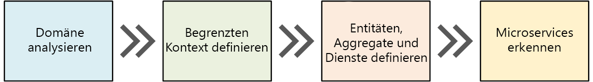
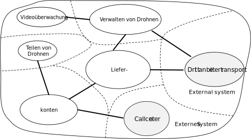
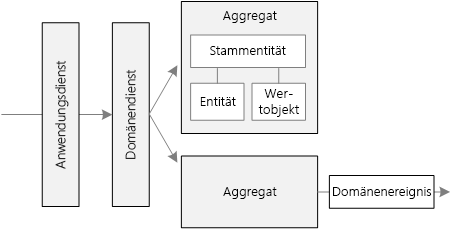
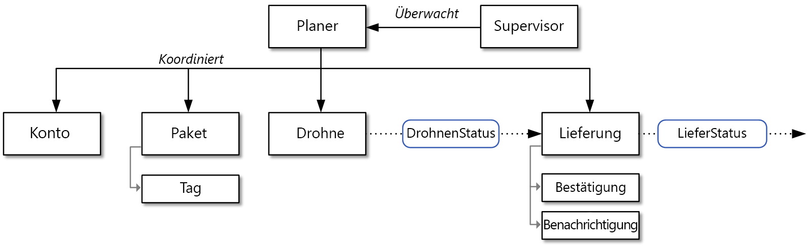

# Entwerfen von Microservices: DomänenanalyseDesigning microservices: Domain analysis 

Eine der größten Herausforderungen in Bezug auf Microservices besteht darin, die Grenzen der einzelnen Dienste zu definieren.One of the biggest challenges of microservices is to define the boundaries of individual services. Eine allgemeine Regel besagt, dass ein Dienst nur einem Zweck dienen soll. Die Umsetzung dieser Regel in die Praxis bedarf jedoch sorgfältiger Überlegung.The general rule is that a service should do "one thing" &mdash; but putting that rule into practice requires careful thought. Es gibt keinen mechanischen Prozess, mit dem das „richtige“ Design erzielt werden kann.There is no mechanical process that will produce the "right" design. Es ist erforderlich, dass Sie sich eingehend mit Ihrer Geschäftsdomäne und den dazugehörigen Anforderungen und Zielen beschäftigen.You have to think deeply about your business domain, requirements, and goals. Andernfalls erhalten Sie unter Umständen ein planloses Design mit einigen unerwünschten Merkmalen, z.B. versteckten Abhängigkeiten zwischen Diensten, zu enger Kopplung oder schlecht entworfenen Schnittstellen.Otherwise, you can end up with a haphazard design that exhibits some undesirable characteristics, such as hidden dependencies between services, tight coupling, or poorly designed interfaces. In diesem Kapitel verwenden wir einen am Geschäftsbereich ausgerichteten Ansatz für den Entwurf von Microservices.In this chapter, we take a domain-driven approach to designing microservices. 

Microservices sollten basierend auf den geschäftlichen Funktionen entworfen werden, nicht auf horizontalen Ebenen wie dem Datenzugriff oder Messaging.Microservices should be designed around business capabilities, not horizontal layers such as data access or messaging. Außerdem sollten sie eine lose Kopplung und eine hohe funktionsbezogene Kohäsion aufweisen.In addition, they should have loose coupling and high functional cohesion. Microservices sind *lose gekoppelt*, wenn Sie einen Dienst ändern können, ohne dass gleichzeitig andere Dienste aktualisiert werden müssen.Microservices are *loosely coupled* if you can change one service without requiring other services to be updated at the same time. Ein Microservice ist *kohäsiv*, wenn er einem einzelnen, klar definierten Zweck dient, z.B. der Verwaltung von Benutzerkonten oder der Nachverfolgung des Lieferverlaufs.A microservice is *cohesive* if it has a single, well-defined purpose, such as managing user accounts or tracking delivery history. Ein Dienst sollte das Wissen des Geschäftsbereichs umfassen und dieses Wissen von den Clients abstrahieren.A service should encapsulate domain knowledge and abstract that knowledge from clients. Ein Client sollte beispielsweise dazu in der Lage sein, eine Drohne zu planen, ohne die Details des Planungsalgorithmus oder der Drohnenflottenverwaltung zu kennen.For example, a client should be able to schedule a drone without knowing the details of the scheduling algorithm or how the drone fleet is managed.

Bei dem am Geschäftsbereich ausgerichteten Entwurf (Domain-Driven Design, DDD) wird ein Framework bereitgestellt, mit dem Sie die meisten Voraussetzungen auf dem Weg zu einem guten Entwurf der Microservices bereits erfüllen können.Domain-driven design (DDD) provides a framework that can get you most of the way to a set of well-designed microservices. DDD verfügt über zwei separate Phasen: eine strategische und eine taktische Phase.DDD has two distinct phases, strategic and tactical. In der strategischen DDD-Phase definieren Sie die übergeordnete Struktur des Systems.In strategic DDD, you are defining the large-scale structure of the system. In dieser Phase können Sie sicherstellen, dass Ihre Architektur klar auf die geschäftlichen Funktionen ausgerichtet ist.Strategic DDD helps to ensure that your architecture remains focused on business capabilities. In der taktischen DDD-Phase wird eine Gruppe von Entwurfsmustern bereitgestellt, die Sie zum Erstellen des Domänenmodells verwenden können.Tactical DDD provides a set of design patterns that you can use to create the domain model. Zu diesen Mustern gehören Entitäten, Aggregate und Domänendienste.These patterns include entities, aggregates, and domain services. Diese taktischen Muster sind hilfreich beim Entwerfen von Microservices, die sowohl lose gekoppelt als auch kohäsiv sind.These tactical patterns will help you to design microservices that are both loosely coupled and cohesive.

In diesem und im nächsten Kapitel werden die folgenden Schritte beschrieben und auf die Anwendung für die Drohnenlieferung (Drone Delivery) angewendet:In this chapter and the next, we'll walk through the following steps, applying them to the Drone Delivery application: 

1. Zunächst analysieren wir die Geschäftsdomäne, um die funktionsbezogenen Anforderungen der Anwendung zu verstehen.Start by analyzing the business domain to understand the application's functional requirements. Das Ergebnis dieses Schritts ist eine informelle Beschreibung des Geschäftsbereichs, die zu einer formelleren Gruppe von Domänenmodellen verfeinert werden kann.The output of this step is an informal description of the domain, which can be refined into a more formal set of domain models. 

2. Als Nächstes definieren wir die *Kontextgrenzen* der Domäne.Next, define the *bounded contexts* of the domain. Jeder Kontextgrenzenbereich enthält ein Domänenmodell, das eine bestimmte Unterdomäne der übergeordneten Anwendung darstellt.Each bounded context contains a domain model that represents a particular subdomain of the larger application. 

3. Wenden Sie innerhalb einer Kontextgrenze taktische DDD-Muster an, um Entitäten, Aggregate und Domänendienste zu definieren.Within a bounded context, apply tactical DDD patterns to define entities, aggregates, and domain services. 
 
4. Verwenden Sie die Ergebnisse des vorherigen Schritts, um die Microservices Ihrer Anwendung zu identifizieren.Use the results from the previous step to identify the microservices in your application.

In diesem Kapitel werden die ersten drei Schritte behandelt, in denen es hauptsächlich um DDD geht.In this chapter, we cover the first three steps, which are primarily concerned with DDD. Im nächsten Kapitel identifizieren wir dann die Microservices.In the next chapter, we will identify the microservices. Hierbei sollte aber unbedingt beachtet werden, dass DDD ein iterativer, fortlaufender Prozess ist.However, it's important to remember that DDD is an iterative, ongoing process. Dienstgrenzen sind nicht in Stein gemeißelt.Service boundaries aren't fixed in stone. Wenn sich eine Anwendung weiterentwickelt, treffen Sie unter Umständen die Entscheidung, dass ein Dienst in mehrere kleinere Dienste unterteilt werden soll.As an application evolves, you may decide to break apart a service into several smaller services.

> [!NOTE]
> In diesem Kapitel soll keine vollständige und umfassende Domänenanalyse bereitgestellt werden.This chapter is not meant to show a complete and comprehensive domain analysis. Wir haben das Beispiel absichtlich kurz gehalten, um die wichtigsten Punkte besser verdeutlichen zu können.We deliberately kept the example brief, in order to illustrate the main points. Weitere Hintergrundinformationen zu DDD finden Sie im Buch *Domain-Driven Design* von Eric Evans, in dem dieser Begriff zuerst verwendet wurde.For more background on DDD, we recommend Eric Evans' *Domain-Driven Design*, the book that first introduced the term. Eine andere gute Quelle ist *Implementing Domain-Driven Design* von Vaughn Vernon.Another good reference is *Implementing Domain-Driven Design* by Vaughn Vernon. 

## Analysieren der DomäneAnalyze the domain

Bei der Nutzung eines DDD-Ansatzes können Sie Microservices so entwerfen, dass jeder Dienst auf natürliche Weise zu einer funktionsbezogenen Geschäftsanforderung passt.Using a DDD approach will help you to design microservices so that every service forms a natural fit to a functional business requirement. Auf diese Weise können Sie es vermeiden, dass Ihr Entwurf durch organisatorische Grenzen oder die ausgewählte Technologie bestimmt wird.It can help you to avoid the trap of letting organizational boundaries or technology choices dictate your design.

Bevor Sie Code schreiben, müssen Sie sich einen allgemeinen Überblick über das zu erstellende System verschaffen.Before writing any code, you need a bird's eye view of the system that you are creating. Beim DDD-Ansatz wird zuerst die Geschäftsdomäne modelliert und ein *Domänenmodell* erstellt.DDD starts by modeling the business domain and creating a *domain model*. Das Domänenmodell ist ein abstraktes Modell der Geschäftsdomäne.The domain model is an abstract model of the business domain. Hiermit wird das Domänenwissen zusammengefasst und organisiert und eine gemeinsame Sprache für Entwickler und Domänenexperten gefunden.It distills and organizes domain knowledge, and provides a common language for developers and domain experts. 

Beginnen Sie, indem Sie alle Geschäftsfunktionen und ihre Verbindungen zuordnen.Start by mapping all of the business functions and their connections. Dies ist normalerweise ein Vorgang, der von Domänenexperten, Softwarearchitekten und anderen Projektbeteiligten gemeinsam durchgeführt wird.This will likely be a collaborative effort that involves domain experts, software architects, and other stakeholders. Es muss kein bestimmter Formalismus eingehalten werden.You don't need to use any particular formalism.  Skizzieren Sie ein Diagramm, oder verwenden Sie ein Whiteboard.Sketch a diagram or draw on whiteboard.

Beim Erstellen des Diagramms können Sie damit beginnen, einzelne Unterdomänen zu identifizieren.As you fill in the diagram, you may start to identify discrete subdomains. Welche Funktionen sind eng verwandt?Which functions are closely related? Welche Funktionen sind für das Geschäft besonders wichtig, und welche Funktionen erfüllen Hilfszwecke?Which functions are core to the business, and which provide ancillary services? Was ist das Abhängigkeitsdiagramm?What is the dependency graph? Während dieser ersten Phase geht es nicht um Technologien oder Implementierungsdetails.During this initial phase, you aren't concerned with technologies or implementation details. Sie sollten sich aber darüber bewusst sein, an welchen Stellen die Anwendung in externe Systeme integriert werden muss, z.B. Systeme für CRM, Zahlungsverarbeitung oder Abrechnung.That said, you should note the place where the application will need to integrate with external systems, such as CRM, payment processing, or billing systems. 

## Drohnenlieferung: Analysieren der GeschäftsdomäneDrone Delivery: Analyzing the business domain.

Nach der ersten Domänenanalyse hat das Fabrikam-Team eine grobe Skizze erstellt, in der die Domäne der Drohnenlieferung dargestellt ist.After some initial domain analysis, the Fabrikam team came up with a rough sketch that depicts the Drone Delivery domain.

 

- **Lieferung** ist in der Mitte des Diagramms angeordnet, weil dies der Kern des Geschäfts ist.**Shipping** is placed in the center of the diagram, because it's core to the business. Alle anderen Elemente des Diagramms dienen der Ermöglichung dieser Funktionalität.Everything else in the diagram exists to enable this functionality.
- Die **Drohnenverwaltung** ist auch ein wichtiger Teil des Geschäfts.**Drone management** is also core to the business. Funktionen, die eng mit der Drohnenverwaltung verbunden sind, sind die **Drohnenreparatur** und der Einsatz von **Predictive Analysis**, um vorherzusagen, wann für Drohnen Wartungsarbeiten durchgeführt werden müssen.Functionality that is closely related to drone management includes **drone repair** and using **predictive analysis** to predict when drones need servicing and maintenance. 
- Mit der **ETA-Analyse** werden Schätzungen für den Zeitpunkt der Abholung und Lieferung bereitgestellt.**ETA analysis** provides time estimates for pickup and delivery. 
- Mit dem **Drittanbietertransport** wird die Anwendung in die Lage versetzt, alternative Transportmethoden zu planen, falls ein Paket nicht vollständig per Drohne ausgeliefert werden kann.**Third-party transportation** will enable the application to schedule alternative transportation methods if a package cannot be shipped entirely by drone.
- Die **Drohnenvermietung** ist eine mögliche Erweiterung des Kerngeschäfts.**Drone sharing** is a possible extension of the core business. Unter Umständen verfügt das Unternehmen zu bestimmten Zeiten über überschüssige Drohnenkapazität, sodass Drohnen vermietet werden können, die andernfalls ungenutzt bleiben würden.The company may have excess drone capacity during certain hours, and could rent out drones that would otherwise be idle. Dieses Feature ist nicht Teil der ersten Releaseversion.This feature will not be in the initial release.
- Die **Videoüberwachung** ist ein weiterer Bereich, in den das Unternehmen später expandieren kann.**Video surveillance** is another area that the company might expand into later.
- **Benutzerkonten**, **Rechnungsstellung** und **Callcenter** sind Unterdomänen zur Unterstützung des Kerngeschäfts.**User accounts**, **Invoicing**, and **Call center** are subdomains that support the core business.
 
Beachten Sie, dass wir an diesem Punkt des Prozesses noch keinerlei Entscheidungen zur Implementierung oder zur Technologie getroffen haben.Notice that at this point in the process, we haven't made any decisions about implementation or technologies. Einige Untersysteme können externe Softwaresysteme oder Drittanbieterdienste betreffen.Some of the subsystems may involve external software systems or third-party services. Trotzdem muss die Anwendung mit diesen Systemen und Diensten interagieren, und es ist wichtig, sie in das Domänenmodell einzubinden.Even so, the application needs to interact with these systems and services, so it's important to include them in the domain model. 

> [!NOTE]
> Wenn eine Anwendung von einem externen System abhängig ist, besteht das Risiko, dass das Datenschema oder die API des externen Systems in Ihre Anwendung hineinreicht und letztendlich den Entwurf der Architektur kompromittiert.When an application depends on an external system, there is a risk that the external system's data schema or API will leak into your application, ultimately compromising the architectural design. Dies gilt besonders für ältere Systeme, bei denen ggf. keine modernen bewährten Methoden befolgt und verworrene Datenschemas oder veraltete APIs verwendet werden.This is particularly true with legacy systems that may not follow modern best practices, and may use convoluted data schemas or obsolete APIs. In diesem Fall ist es wichtig, eine klar definierte Grenze zwischen diesen externen Systemen und der Anwendung einzurichten.In that case, it's important to have a well-defined boundary between these external systems and the application. Erwägen Sie zu diesem Zweck die Verwendung des [Einschnürungsmusters](../patterns/strangler.md) oder des [Musters „Antibeschädigungsebene“](../patterns/anti-corruption-layer.md).Consider using the [Strangler Pattern](../patterns/strangler.md) or the [Anti-Corruption Layer Pattern](../patterns/anti-corruption-layer.md) for this purpose.

## Definieren von KontextgrenzenDefine bounded contexts

Das Domänenmodell enthält Darstellungen von realen Dingen: Benutzer, Drohnen, Pakete usw.The domain model will include representations of real things in the world &mdash; users, drones, packages, and so forth. Dies bedeutet aber nicht, dass jeder Teil des Systems für dieselben Dinge die gleichen Darstellungen verwenden muss.But that doesn't mean that every part of the system needs to use the same representations for the same things. 

Beispielsweise müssen Subsysteme, die für die Drohnenreparatur und Predictive Analytics zuständig sind, viele physische Merkmale von Drohnen darstellen, z.B. den Wartungsverlauf, Kilometerleistung, Alter, Modellnummer, Leistungsmerkmale usw.For example, subsystems that handle drone repair and predictive analysis will need to represent many physical characteristics drones, such as their maintenance history, mileage, age, model number, performance characteristics, and so on. Wenn es aber um die Planung einer Lieferung geht, kümmern wir uns nicht um diese Dinge.But when it's time to schedule a delivery, we don't care about those things. Das Subsystem für die Planung muss nur wissen, ob eine Drohne verfügbar ist und welcher geschätzte Zeitpunkt für die Abholung und die Lieferung gilt.The scheduling subsystem only needs to know whether a drone is available, and the ETA for pickup and delivery. 

Wenn wir versuchen würden, ein gemeinsames Modell für beide Subsysteme zu erstellen, wäre dies ein unnötig komplexer Vorgang.If we tried to create a single model for both of these subsystems, it would be unnecessarily complex. Außerdem wäre es schwieriger, das Modell im Laufe der Zeit weiterzuentwickeln, da alle Änderungen die Zustimmung mehrerer Teams erhalten müssen, die an separaten Subsystemen arbeiten.It would also become harder for the model to evolve over time, because any changes will need to satisfy multiple teams working on separate subsystems. Daher ist es häufig besser, separate Modelle zu entwerfen, bei denen die gleiche reale Entität (in diesem Fall eine Drohne) in zwei unterschiedlichen Kontexten dargestellt wird.Therefore, it's often better to design separate models that represent the same real-world entity (in this case, a drone) in two different contexts. Jedes Modell enthält nur die Features und Attribute, die im jeweiligen Kontext relevant sind.Each model contains only the features and attributes that are relevant within its particular context.

An dieser Stelle wird auf das DDD-Konzept der *Kontextgrenzen* zurückgegriffen.This is where the DDD concept of *bounded contexts* comes into play. Eine Kontextgrenze bezeichnet einfach den abgegrenzten Bereich innerhalb einer Domäne, in dem ein bestimmtes Domänenmodell gilt.A bounded context is simply the boundary within a domain where a particular domain model applies. Wenn wir uns das obige Diagramm ansehen, können wir die Funktionalität danach gruppieren, ob von den einzelnen Funktionen ein Domänenmodell gemeinsam genutzt wird.Looking at the previous diagram, we can group functionality according to whether various functions will share a single domain model. 

 
 
Kontextgrenzen bedeuten nicht unbedingt, dass Kontexte voneinander isoliert sind.Bounded contexts are not necessarily isolated from one another. In diesem Diagramm zeigen die durchgehenden Verbindungslinien zwischen den Kontextgrenzen die Stellen an, an denen die Kontexte zweier Kontextgrenzen interagieren.In this diagram, the solid lines connecting the bounded contexts represent places where two bounded contexts interact. Beispielsweise ist „Lieferung“ von „Benutzerkonten“ abhängig, um Informationen zu Kunden zu erhalten, und von „Drohnenverwaltung“, um die Drohnen der Flotte einplanen zu können.For example, Shipping depends on User Accounts to get information about customers, and on Drone Management to schedule drones from the fleet.

In seinem Buch *Domain Driven Design* beschreibt Eric Evans mehrere Muster zur Wahrung der Integrität eines Domänenmodells, wenn es mit dem Kontext einer anderen Kontextgrenze interagiert.In the book *Domain Driven Design*, Eric Evans describes several patterns for maintaining the integrity of a domain model when it interacts with another bounded context. Eines der wichtigsten Prinzipien von Microservices ist die Kommunikation der Dienste über klar definierte APIs.One of the main principles of microservices is that services communicate through well-defined APIs. Dieser Ansatz entspricht zwei Mustern, die von Eric Evans als „Open Host Service“ (Offener Hostdienst) und „Published Language“ (Veröffentlichte Sprache) bezeichnet werden.This approach corresponds to two patterns that Evans calls Open Host Service and Published Language. Bei „Open Host Service“ definiert ein Subsystem ein formelles Protokoll (API) für die Kommunikation mit anderen Subsystemen.The idea of Open Host Service is that a subsystem defines a formal protocol (API) for other subsystems to communicate with it. Mit „Published Language“ wird dieser Ansatz erweitert, indem die API in einer Form veröffentlicht wird, die von anderen Teams zum Schreiben von Clients genutzt werden kann.Published Language extends this idea by publishing the API in a form that other teams can use to write clients. Im Kapitel zum [API-Design](./api-design.md) wird die Verwendung der [OpenAPI-Spezifikation](https://www.openapis.org/specification/repo) (früher als Swagger bezeichnet) beschrieben. Sie wird zum Definieren von sprachunabhängigen Schnittstellenbeschreibungen für REST-APIs genutzt, die im JSON- oder YAML-Format ausgedrückt werden.In the chapter on [API Design](./api-design.md), we discuss using [OpenAPI Specification](https://www.openapis.org/specification/repo) (formerly known as Swagger) to define language-agnostic interface descriptions for REST APIs, expressed in JSON or YAML format.

Im restlichen Teil dieser Vorgehensweise konzentrieren wir uns auf die Kontextgrenze „Lieferung“.For the rest of this journey, we will focus on the Shipping bounded context. 

## Taktische DDD-PhaseTactical DDD

Während der strategischen DDD-Phase entwerfen Sie die Geschäftsdomäne und definieren Kontextgrenzen für Ihre Domänenmodelle.During the strategic phase of DDD, you are mapping out the business domain and defining bounded contexts for your domain models. In der taktischen DDD-Phase definieren Sie Ihre Domänenmodelle mit größerer Genauigkeit.Tactical DDD is when you define your domain models with more precision. Die taktischen Muster werden nur in einem Kontextgrenzenbereich angewendet.The tactical patterns are applied within a single bounded context. Bei einer Microservices-Architektur sind wir vor allem an den Entitäts- und Aggregatmustern interessiert.In a microservices architecture, we are particularly interested in the entity and aggregate patterns. Die Anwendung dieser Muster hilft uns dabei, natürliche Grenzen für die Dienste in unserer Anwendung zu identifizieren (siehe [nächste Kapitel](./microservice-boundaries.md)).Applying these patterns will help us to identify natural boundaries for the services in our application (see [next chapter](./microservice-boundaries.md)). Es gilt das allgemeine Prinzip, dass ein Microservice nicht kleiner als ein Aggregat und nicht größer als eine Kontextgrenze sein sollte.As a general principle, a microservice should be no smaller than an aggregate, and no larger than a bounded context. Zuerst überprüfen wir die taktischen Muster.First, we'll review the tactical patterns. Anschließend wenden wir sie auf die Kontextgrenze „Lieferung“ in der Anwendung für die Drohnenlieferung an.Then we'll apply them to the Shipping bounded context in the Drone Delivery application. 

### Übersicht über die taktischen MusterOverview of the tactical patterns

Dieser Abschnitt enthält eine kurze Zusammenfassung der taktischen DDD-Muster. Unter Umständen können Sie diesen Abschnitt also überspringen, falls Sie mit DDD bereits vertraut sind.This section provides a brief summary of the tactical DDD patterns, so if you are already familiar with DDD, you can probably skip this section. Die Muster werden im Buch von Eric Evans (Kapitel 5 und 6) und in *Implementing Domain-Driven Design* von Vaughn Vernon ausführlicher beschrieben.The patterns are described in more detail in chapters 5 &ndash; 6 of Eric Evans' book, and in *Implementing Domain-Driven Design* by Vaughn Vernon. 

**Entitäten**:**Entities**. Eine Entität ist ein Objekt mit einer eindeutigen Identität, die bestehen bleibt.An entity is an object with a unique identity that persists over time. In einer Anwendung für Bankgeschäfte sind Kunden und Konten beispielsweise Entitäten.For example, in a banking application, customers and accounts would be entities. 

- Eine Entität verfügt im System über einen eindeutigen Bezeichner, mit dem die Entität nachgeschlagen bzw. abgerufen werden kann.An entity has a unique identifier in the system, which can be used to look up or retrieve the entity. Dies bedeutet nicht, dass der Bezeichner immer direkt für Benutzer verfügbar gemacht wird.That doesn't mean the identifier is always exposed directly to users. Es kann sich um eine GUID oder einen Primärschlüssel in einer Datenbank handeln.It could be a GUID or a primary key in a database. 
- Eine Identität kann übergreifend für mehrere Kontextgrenzenbereiche gelten und auch über die Lebensdauer der Anwendung hinaus beibehalten werden.An identity may span multiple bounded contexts, and may endure beyond the lifetime of the application. Beispielsweise sind Bankkontonummern oder von Behörden ausgestellte IDs nicht an die Lebensdauer einer bestimmten Anwendung gebunden.For example, bank account numbers or government-issued IDs are not tied to the lifetime of a particular application.
- Die Attribute einer Entität können sich im Laufe der Zeit ändern.The attributes of an entity may change over time. Beispielsweise können sich Name oder Adresse einer Person ändern, während sich die Person nicht ändert.For example, a person's name or address might change, but they are still the same person. 
- Eine Entität kann Verweise auf andere Entitäten enthalten.An entity can hold references to other entities.
 
**Wertobjekte**:**Value objects**. Ein Wertobjekt hat keine Identität.A value object has no identity. Es wird allein durch die Werte seiner Attribute definiert.It is defined only by the values of its attributes. Außerdem sind Wertobjekte unveränderlich.Value objects are also immutable. Für die Aktualisierung eines Wertobjekts erstellen Sie immer eine neue Instanz, um die alte zu ersetzen.To update a value object, you always create a new instance to replace the old one. Wertobjekte können über Methoden verfügen, in denen die Domänenlogik gekapselt ist, aber diese Methoden sollten nicht mit Nebenwirkungen in Bezug auf den Status des Objekts verbunden sein.Value objects can have methods that encapsulate domain logic, but those methods should have no side-effects on the object's state. Typische Beispiele für Wertobjekte sind Farben, Datum und Uhrzeit und Währungswerte.Typical examples of value objects include colors, dates and times, and currency values. 

**Aggregate**:**Aggregates**. Ein Aggregat definiert eine Konsistenzgrenze für eine oder mehrere Entitäten.An aggregate defines a consistency boundary around one or more entities. Eine bestimmte Entität in einem Aggregat ist die Stammentität.Exactly one entity in an aggregate is the root. Die Suche wird anhand des Bezeichners der Stammentität durchgeführt.Lookup is done using the root entity's identifier. Alle anderen Entitäten im Aggregat sind untergeordnete Elemente der Stammentität, und es wird darauf verwiesen, indem den Zeigern der Stammentität gefolgt wird.Any other entities in the aggregate are children of the root, and are referenced by following pointers from the root. 

Der Zweck eines Aggregats ist die Modellierung von Transaktionsinvarianten.The purpose of an aggregate is to model transactional invariants. Reale Dinge weisen komplexe Beziehungsgeflechte auf.Things in the real world have complex webs of relationships. Kunden geben Bestellungen auf, Bestellungen enthalten Produkte, Produkte haben Lieferanten usw.Customers create orders, orders contain products, products have suppliers, and so on. Wenn von der Anwendung mehrere zusammengehörige Objekte geändert werden, wie kann dann die Konsistenz gewährleistet werden?If the application modifies several related objects, how does it guarantee consistency? Wie können Invarianten nachverfolgt und erzwungen werden?How do we keep track of invariants and enforce them?  

In herkömmlichen Anwendungen wurden häufig Datenbanktransaktionen eingesetzt, um Konsistenz zu erzwingen.Traditional applications have often used database transactions to enforce consistency. In einer verteilten Anwendung ist dies aber oftmals nicht möglich.In a distributed application, however, that's often not feasible. Eine einzelne Geschäftstransaktion kann sich unter Umständen über mehrere Datenspeicher erstrecken, eine lange Ausführungsdauer aufweisen oder Drittanbieterdienste umfassen.A single business transaction may span multiple data stores, or may be long running, or may involve third-party services. Letztendlich liegt es an der Anwendung und nicht an der Datenschicht, die für die Domäne erforderlichen Invarianten zu erzwingen.Ultimately it's up to the application, not the data layer, to enforce the invariants required for the domain. Für die Durchführung dieser Modellierung sind Aggregate bestimmt.That's what aggregates are meant to model.

> [!NOTE]
> Ein Aggregat kann ggf. aus einer einzelnen Entität ohne untergeordnete Entitäten bestehen.An aggregate might consist of a single entity, without child entities. Durch die Transaktionsgrenze wird dies zu einem Aggregat.What makes it an aggregate is the transactional boundary.

**Domänen- und Anwendungsdienste**:**Domain and application services**. In der DDD-Terminologie ist ein Dienst ein Objekt, mit dem Logik implementiert wird, ohne dass ein Zustand vorgehalten wird.In DDD terminology, a service is an object that implements some logic without holding any state. Evans unterscheidet zwischen *Domänendiensten*, in denen die Domänenlogik gekapselt ist, und *Anwendungsdiensten*, mit denen die technische Funktionalität bereitgestellt wird, z.B. die Benutzerauthentifizierung oder das Senden einer SMS-Nachricht.Evans distinguishes between *domain services*, which encapsulate domain logic, and *application services*, which provide technical functionality, such as user authentication or sending an SMS message. Domänendienste werden häufig zum Modellieren von Verhalten verwendet, das mehrere Entitäten umfasst.Domain services are often used to model behavior that spans multiple entities. 

> [!NOTE]
> Der Begriff *Dienst* ist im Bereich der Softwareentwicklung mehrfach besetzt.The term *service* is overloaded in software development. Die Definition bezieht sich in diesem Fall nicht direkt auf Microservices.The definition here is not directly related to microservices.

**Domänenereignisse**:**Domain events**. Domänenereignisse können verwendet werden, um andere Teile des Systems zu benachrichtigen, wenn etwas passiert.Domain events can be used to notify other parts of the system when something happens. Wie der Name bereits vermuten lässt, sollten Domänenereignisse eine bestimmte Bedeutung innerhalb der Domäne haben.As the name suggests, domain events should mean something within the domain. Der Vorgang „Datensatz wurde in eine Tabelle eingefügt“ ist beispielsweise kein Domänenereignis.For example, "a record was inserted into a table" is not a domain event. Der Vorgang „Lieferung wurde storniert“ ist ein Domänenereignis."A delivery was cancelled" is a domain event. Domänenereignisse sind besonders in einer Microservices-Architektur relevant.Domain events are especially relevant in a microservices architecture. Da Microservices verteilt vorliegen und keine Datenspeicher gemeinsam nutzen, stellen Domänenereignisse eine Möglichkeit dar, wie sich Microservices untereinander koordinieren können.Because microservices are distributed and don't share data stores, domain events provide a way for microservices to coordinate with each other. Im Kapitel zur [Kommunikation zwischen Diensten](./interservice-communication.md) wird das asynchrone Messaging ausführlicher beschrieben.The chapter [Interservice communication](./interservice-communication.md) discusses asynchronous messaging in more detail.
 
Es gibt noch einige andere DDD-Muster, die hier nicht aufgeführt sind, z.B. Factorys, Repositorys und Module.There are a few other DDD patterns not listed here, including factories, repositories, and modules. Dies können nützliche Muster für die Implementierung eines Microservice sein, aber sie sind weniger relevant, wenn es um das Entwerfen von Grenzen zwischen Microservices geht.These can be useful patterns for when you are implementing a microservice, but they are less relevant when designing the boundaries between microservice.

## Drohnenlieferung: Anwenden der MusterDrone delivery: Applying the patterns

Wir beginnen mit den Szenarien, die vom Kontextgrenzenbereich „Lieferung“ verarbeitet werden müssen.We start with the scenarios that the Shipping bounded context must handle.

- Ein Kunde kann eine Drohne anfordern, um Waren von einem Unternehmen abzuholen, das beim Dienst für die Drohnenlieferung registriert ist.A customer can request a drone to pick up goods from a business that is registered with the drone delivery service.
- Der Absender generiert eine Kennzeichnung per Tag (Strichcode oder RFID) für das Paket.The sender generates a tag (barcode or RFID) to put on the package. 
- Eine Drohne holt ein Paket ab und liefert es vom Ausgangsort an den Zielort.A drone will pick up and deliver a package from the source location to the destination location.
- Wenn ein Kunde eine Lieferung plant, wird vom System eine geschätzte Ankunftszeit angegeben, die auf den Routeninformationen, Wetterbedingungen und Verlaufsdaten basiert.When a customer schedules a delivery, the system provides an ETA based on route information, weather conditions, and historical data. 
- Wenn eine Drohne in der Luft ist, kann ein Benutzer den aktuellen Standort und die zuletzt ermittelte geschätzte Ankunftszeit nachverfolgen.When the drone is in flight, a user can track the current location and the latest ETA. 
- Der Kunde kann eine Lieferung stornieren, bis eine Drohne das Paket abgeholt hat.Until a drone has picked up the package, the customer can cancel a delivery.
- Der Kunde wird benachrichtigt, wenn die Lieferung abgeschlossen ist.The customer is notified when the delivery is completed.
- Der Absender kann vom Kunden eine Bestätigung der Lieferung in Form einer Signatur oder eines Fingerabdrucks anfordern.The sender can request delivery confirmation from the customer, in the form of a signature or finger print.
- Benutzer können den Verlauf einer abgeschlossenen Lieferung anzeigen.Users can look up the history of a completed delivery.

Anhand dieser Szenarien hat das Entwicklungsteam die folgenden **Entitäten** identifiziert.From these scenarios, the development team identified the following **entities**.

- LieferungDelivery
- PaketPackage
- DrohneDrone
- KontoAccount
- BestätigungConfirmation
- Benachrichtig.Notification
- KategorieTag

Die ersten vier Entitäten (Lieferung, Paket, Drohne und Konto) sind allesamt **Aggregate**, die für die Grenzen der Transaktionskonsistenz stehen.The first four, Delivery, Package, Drone, and Account, are all **aggregates** that represent transactional consistency boundaries. Bestätigungen und Benachrichtigungen sind untergeordnete Elemente von Lieferungen, und Tags sind untergeordnete Elemente von Paketen.Confirmations and Notifications are child entities of Deliveries, and Tags are child entities of Packages. 

Zu den **Wertobjekten** dieses Entwurfs gehören Standort, geschätzte Ankunftszeit, Paketgewicht und Paketgröße (Location, ETA, PackageWeight und PackageSize).The **value objects** in this design include Location, ETA, PackageWeight, and PackageSize. 

Zur besseren Veranschaulichung ist hier ein UML-Diagramm des Aggregats für die Lieferung (Delivery) angegeben.To illustrate, here is a UML diagram of the Delivery aggregate. Beachten Sie, dass es Verweise auf andere Aggregate enthält, z.B. Konto (Account), Paket (Package) und Drohne (Drone).Notice that it holds references to other aggregates, including Account, Package, and Drone.

Es sind zwei Domänenereignisse vorhanden:There are two domain events:

- Während eine Drohne in der Luft ist, sendet die Drone-Entität DroneStatus-Ereignisse, mit denen der Standort und Status (Flug, Gelandet) der Drohne beschrieben werden.While a drone is in flight, the Drone entity sends DroneStatus events that describe the drone's location and status (in-flight, landed).

- Die Delivery-Entität sendet jeweils DeliveryTracking-Ereignisse, wenn sich die Phase einer Lieferung ändert.The Delivery entity sends DeliveryTracking events whenever the stage of a delivery changes. Beispiele hierfür sind DeliveryCreated, DeliveryRescheduled, DeliveryHeadedToDropoff und DeliveryCompleted.These include DeliveryCreated, DeliveryRescheduled, DeliveryHeadedToDropoff, and DeliveryCompleted. 

Beachten Sie, dass diese Ereignisse Dinge beschreiben, die innerhalb des Domänenmodells eine Bedeutung haben.Notice that these events describe things that are meaningful within the domain model. Sie beschreiben einen Aspekt der Domäne und sind nicht an ein Konstrukt einer bestimmten Programmiersprache gebunden.They describe something about the domain, and aren't tied to a particular programming language construct.

Das Entwicklungsteam hat noch einen weiteren Funktionalitätsbereich identifiziert, der nicht ohne Weiteres einer der bisher beschriebenen Entitäten zugeordnet werden kann.The development team identified one more area of functionality, which doesn't fit neatly into any of the entities described so far. Ein Teil des Systems muss alle Schritte koordinieren, die an der Planung oder Aktualisierung einer Lieferung beteiligt sind.Some part of the system must coordinate all of the steps involved in scheduling or updating a delivery. Aus diesem Grund hat das Entwicklungsteam dem Entwurf zwei **Domänendienste** hinzugefügt: einen *Scheduler* zum Koordinieren der Schritte und einen *Supervisor*, mit dem der Status der einzelnen Schritte überwacht und erkannt werden soll, ob für Schritte ein Fehler oder eine Zeitüberschreitung aufgetreten ist. Dies ist eine Variante des [Musters „Scheduler-Agent-Supervisor“](../patterns/scheduler-agent-supervisor.md).Therefore, the development team added two **domain services** to the design: a *Scheduler* that coordinates the steps, and a *Supervisor* that monitors the status of each step, in order to detect whether any steps have failed or timed out. This is a variation of the [Scheduler Agent Supervisor pattern](../patterns/scheduler-agent-supervisor.md).

> [!div class="nextstepaction"]
> [Identifizieren von Microservice-GrenzenIdentifying microservice boundaries](./microservice-boundaries.md)
