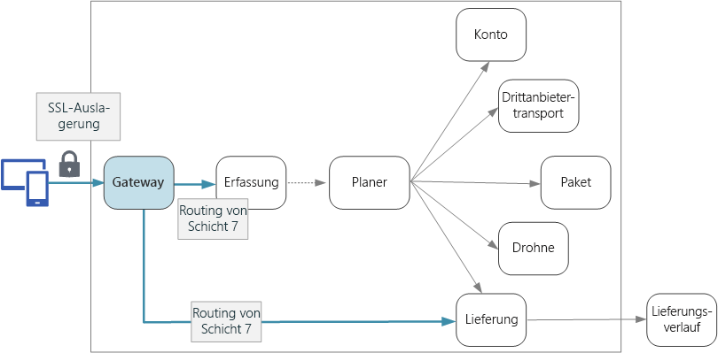

# Entwerfen von Microservices: API-GatewaysDesigning microservices: API gateways

In einer Microservices-Architektur interagiert ein Client ggf. mit mehreren Front-End-Diensten.In a microservices architecture, a client might interact with more than one front-end service. Woher weiß ein Client aber, welche Endpunkte er aufrufen soll?Given this fact, how does a client know what endpoints to call? Was passiert, wenn neue Dienste eingeführt oder vorhandene Dienste umgestaltet werden?What happens when new services are introduced, or existing services are refactored? Wie behandeln Dienste SSL-Beendigung, Authentifizierung und andere Anliegen?How do services handle SSL termination, authentication, and other concerns? Hier kann ein *API-Gateway* hilfreich sein.An *API gateway* can help to address these challenges. 

## Was ist ein API-Gateway?What is an API gateway?

Ein API-Gateway befindet sich zwischen Clients und Diensten.An API gateway sits between clients and services. Es fungiert als Reverseproxy und leitet Anforderungen von Clients an Dienste weiter.It acts as a reverse proxy, routing requests from clients to services. Darüber hinaus kann es verschiedene übergreifende Aufgaben wie Authentifizierung, SSL-Beendigung und Ratenbegrenzung übernehmen.It may also perform various cross-cutting tasks such as authentication, SSL termination, and rate limiting. Wenn Sie kein Gateway bereitstellen, müssen Clients Anforderungen direkt an Front-End-Dienste senden.If you don't deploy a gateway, clients must send requests directly to front-end services. Der direkte Kontakt zwischen Diensten und Clients kann jedoch problematisch sein:However, there are some potential problems with exposing services directly to clients:

- Er kann zu komplexem Clientcode führen.It can result in complex client code. Der Client muss den Überblick über mehrere Endpunkte behalten und über eine robuste Fehlerbehandlung verfügen.The client must keep track of multiple endpoints, and handle failures in a resilient way. 
- Er führt zu einer Kopplung zwischen Client und Back-End.It creates coupling between the client and the backend. Der Client benötigt Informationen zur Aufspaltung der einzelnen Dienste.The client needs to know how the individual services are decomposed. Dies erschwert die Verwaltung des Clients sowie die Umgestaltung von Diensten.That makes it harder to maintain the client and also harder to refactor services.
- Für einen einzelnen Vorgang müssen möglicherweise mehrere Dienste aufgerufen werden.A single operation might require calls to multiple services. Dies kann mehrere Netzwerkroundtrips zwischen Client und Server erforderlich machen und die Wartezeit erheblich erhöhen.That can result in multiple network round trips between the client and the server, adding significant latency. 
- Jeder öffentliche Dienst muss Aspekte wie Authentifizierung, SSL und Clientratenbegrenzung behandeln.Each public-facing service must handle concerns such as authentication, SSL, and client rate limiting. 
- Dienste müssen ein clientfreundliches Protokoll wie HTTP oder WebSocket verfügbar machen.Services must expose a client-friendly protocol such as HTTP or WebSocket. Dies schränkt die in Frage kommenden [Kommunikationsprotokolle](./interservice-communication.md) ein.This limits the choice of [communication protocols](./interservice-communication.md). 
- Dienste mit öffentlichen Endpunkten stellen ein potenzielles Angriffsziel dar und müssen gehärtet werden.Services with public endpoints are a potential attack surface, and must be hardened.

Ein Gateway trägt zur Bewältigung dieser Herausforderungen bei, indem es Clients von Diensten entkoppelt.A gateway helps to address these issues by decoupling clients from services. Gateways können eine ganze Reihe unterschiedlicher Funktionen übernehmen, die Sie möglicherweise gar nicht alle benötigen.Gateways can perform a number of different functions, and you may not need all of them. Die Funktionen lassen sich in folgende Entwurfsmuster unterteilen:The functions can be grouped into the following design patterns:

[Gatewayrouting:](../patterns/gateway-routing.md)[Gateway Routing](../patterns/gateway-routing.md). Verwenden Sie das Gateway als Reverseproxy, um Anforderungen mittels Layer-7-Routing an Back-End-Dienste weiterzuleiten.Use the gateway as a reverse proxy to route requests to one or more backend services, using layer 7 routing. Das Gateway stellt einen einzelnen Endpunkt für Clients bereit und trägt zur Entkopplung von Clients und Diensten bei.The gateway provides a single endpoint for clients, and helps to decouple clients from services. 

[Gatewayaggregation:](../patterns/gateway-aggregation.md)[Gateway Aggregation](../patterns/gateway-aggregation.md). Aggregieren Sie mehrere Anforderungen mithilfe des Gateways in einer einzelnen Anforderung.Use the gateway to aggregate multiple individual requests into a single request. Dieses Muster kommt zur Anwendung, wenn für einen einzelnen Vorgang mehrere Back-End-Dienste aufgerufen werden müssen.This pattern applies when a single operation requires calls to multiple backend services. Der Client sendet eine einzelne Anforderung an das Gateway.The client sends one request to the gateway. Das Gateway sendet Anforderungen an die verschiedenen Back-End-Systeme, aggregiert die Ergebnisse und gibt sie an den Client zurück.The gateway dispatches requests to the various backend services, and then aggregates the results and sends them back to the client. Dadurch verringert sich die Kommunikation zwischen Client Back-End.This helps to reduce chattiness between the client and the backend. 

[Gatewayabladung:](../patterns/gateway-offloading.md)[Gateway Offloading](../patterns/gateway-offloading.md). Nutzen Sie das Gateway, um Funktionen einzelner Dienste (insbesondere übergreifende Aspekte) an das Gateway auszulagern.Use the gateway to offload functionality from individual services to the gateway, particularly cross-cutting concerns. Es kann hilfreich sein, diese Funktionen an einem zentralen Ort zusammenzufassen, anstatt ihre Implementierung den einzelnen Diensten zu überlassen.It can be useful to consolidate these functions into one place, rather than making every service responsible for implementing them. Das gilt insbesondere für Features wie Authentifizierung und Autorisierung, deren korrekte Implementierung spezielles Fachwissen voraussetzt.This is particularly true for features that requires specialized skills to implement correctly, such as authentication and authorization. 

Folgende Funktionen können beispielsweise an ein Gateway ausgelagert werden:Here are some examples of functionality that could be offloaded to a gateway:

- SSL-BeendigungSSL termination
- AuthentifizierungAuthentication
- IP-WhitelistingIP whitelisting
- Clientratenbegrenzung (Drosselung)Client rate limiting (throttling)
- Protokollierung und ÜberwachungLogging and monitoring
- Zwischenspeicherung von AntwortenResponse caching
- Web Application FirewallWeb application firewall
- GZIP-KomprimierungGZIP compression
- Wartung statischer InhalteServicing static content

## Wählen einer GatewaytechnologieChoosing a gateway technology

In diesem Abschnitt finden Sie einige Optionen für die Implementierung eines API-Gateways in Ihrer Anwendung.Here are some options for implementing an API gateway in your application.

- **Reverseproxyserver:****Reverse proxy server**. Nginx und HAProxy sind gängige Reverseproxyserver, die Features wie Lastenausgleich, SSL und Layer-7-Routing unterstützen.Nginx and HAProxy are popular reverse proxy servers that support features such as load balancing, SSL, and layer 7 routing. Beides sind kostenlose Open-Source-Produkte, die auch als kostenpflichtige Editionen mit zusätzlichen Features und Unterstützungsoptionen erhältlich sind.They are both free, open-source products, with paid editions that provide additional features and support options. Nginx und HAProxy sind ausgereifte, leistungsfähige Produkte mit großem Funktionsumfang.Nginx and HAProxy are both mature products with rich feature sets and high performance. Sie können mit Drittanbietermodulen oder benutzerdefinierten Lua-Skripts erweitert werden.You can extend them with third-party modules or by writing custom scripts in Lua. Nginx unterstützt auch ein JavaScript-basiertes Skripterstellungsmodul namens NginScript.Nginx also supports a JavaScript-based scripting module called NginScript.

- **Dienstnetz-Eingangscontroller:****Service mesh ingress controller**. Ziehen Sie bei Verwendung eines Dienstnetzes wie linkerd oder Istio die Features in Erwägung, die vom Eingangscontroller für das Dienstnetz bereitgestellt werden.If you are using a service mesh such as linkerd or Istio, consider the features that are provided by the ingress controller for that service mesh. Der Istio-Eingangscontroller unterstützt beispielsweise Layer-7-Routing, HTTP-Umleitungen, Wiederholungen und andere Features.For example, the Istio ingress controller supports layer 7 routing, HTTP redirects, retries, and other features. 

- [Azure Application Gateway:](/azure/application-gateway/)[Azure Application Gateway](/azure/application-gateway/). Application Gateway ist ein verwalteter Lastenausgleichsdienst, der für Layer-7-Routing und SSL-Beendigung geeignet ist.Application Gateway is a managed load balancing service that can perform layer-7 routing and SSL termination. Darüber hinaus verfügt er über eine Web Application Firewall (WAF).It also provides a web application firewall (WAF).

- [Azure API Management:](/azure/api-management/)[Azure API Management](/azure/api-management/). API Management ist eine sofort einsatzbereite Lösung zum Veröffentlichen von APIs für externe und interne Kunden.API Management is a turnkey solution for publishing APIs to external and internal customers. Sie bietet hilfreiche Features für die Verwaltung einer öffentlichen API wie Ratenbeschränkung, IP-Whitelisting und Authentifizierung mit Azure Active Directory oder anderen Identitätsanbietern.It provides features that are useful for managing a public-facing API, including rate limiting, IP white listing, and authentication using Azure Active Directory or other identity providers. Da API Management über keinen Lastenausgleich verfügt, sollte die Lösung mit einem Lastenausgleich wie Application Gateway oder einem Reverseproxy kombiniert werden.API Management doesn't perform any load balancing, so it should be used in conjunction with a load balancer such as Application Gateway or a reverse proxy.

Berücksichtigen Sie bei der Wahl einer Gatewaytechnologie Folgendes:When choosing a gateway technology, consider the following:

**Features:****Features**. Die oben aufgeführten Optionen unterstützen alle Layer-7-Routing. Die Unterstützung anderer Features variiert.The options listed above all support layer 7 routing, but support for other features will vary. Je nach benötigten Features können Sie mehrere Gateways bereitstellen.Depending on the features that you need, you might deploy more than one gateway. 

**Bereitstellung:****Deployment**. Azure Application Gateway und API Management sind verwaltete Dienste.Azure Application Gateway and API Management are managed services. Nginx und HAProxy werden in der Regel in Containern innerhalb des Clusters ausgeführt, können aber auch auf dedizierten virtuellen Computern außerhalb des Clusters bereitgestellt werden.Nginx and HAProxy will typically run in containers inside the cluster, but can also be deployed to dedicated VMs outside of the cluster. Dadurch wird das Gateway vom Rest der Workload isoliert, verursacht aber auch einen höheren Verwaltungsaufwand.This isolates the gateway from the rest of the workload, but incurs higher management overhead.

**Verwaltung:****Management**. Wenn Dienste aktualisiert oder neue Dienste hinzugefügt werden, müssen ggf. die Gatewayroutingregeln aktualisiert werden.When services are updated or new services are added, the gateway routing rules may need to be updated. Überlegen Sie sich, wie dieser Prozess gehandhabt werden soll.Consider how this process will be managed. Ähnliche Überlegungen müssen für den Umgang mit SSL-Zertifikaten, IP-Whitelists und anderen Konfigurationsaspekten angestellt werden.Similar considerations apply to managing SSL certificates, IP whitelists, and other aspects of configuration.

## Überlegungen zur BereitstellungDeployment considerations

### Bereitstellen von Nginx oder HAProxy für KubernetesDeploying Nginx or HAProxy to Kubernetes

Sie können Nginx oder HAProxy für Kubernetes als [ReplicaSet](https://kubernetes.io/docs/concepts/workloads/controllers/replicaset/) oder [DaemonSet](https://kubernetes.io/docs/concepts/workloads/controllers/daemonset/) bereitstellen, das das Nginx- oder HAProxy-Containerimage angibt.You can deploy Nginx or HAProxy to Kubernetes as a [ReplicaSet](https://kubernetes.io/docs/concepts/workloads/controllers/replicaset/) or [DaemonSet](https://kubernetes.io/docs/concepts/workloads/controllers/daemonset/) that specifies the Nginx or HAProxy container image. Speichern Sie die Konfigurationsdatei für den Proxy mithilfe eines ConfigMap-Elements, und binden Sie dieses als Volume ein.Use a ConfigMap to store the configuration file for the proxy, and mount the ConfigMap as a volume. Erstellen Sie einen LoadBalancer-Dienst, um das Gateway über einen Azure Load Balancer verfügbar zu machen.Create a service of type LoadBalancer to expose the gateway through an Azure Load Balancer. 

<!-- - Configure a readiness probe that serves a static file from the gateway (rather than routing to another service). -->

Alternativ können Sie auch einen Eingangscontroller erstellen.An alternative is to create an Ingress Controller. Ein Eingangscontroller ist eine Kubernetes-Ressource, die einen Lastenausgleich oder Reverseproxyserver bereitstellt.An Ingress Controller is a Kubernetes resource that deploys a load balancer or reverse proxy server. Hierfür stehen mehrere Implementierungen (unter anderem Nginx und HAProxy) zur Verfügung.Several implementations exist, including Nginx and HAProxy. Eine separate Ressource namens „Ingress“ (Eingang) definiert die Einstellungen für den Eingangscontroller (beispielsweise Routingregeln und TLS-Zertifikate).A separate resource called an Ingress defines settings for the Ingress Controller, such as routing rules and TLS certificates. Dadurch müssen Sie keine komplexen spezifischen Konfigurationsdateien für eine bestimmte Proxyservertechnologie verwalten.That way, you don't need to manage complex configuration files that are specific to a particular proxy server technology. Eingangscontroller von Kubernetes befinden sich zum Zeitpunkt der Artikelerstellung noch in der Betaphase. Ihre Entwicklung ist also noch nicht abgeschlossen.Ingress Controllers are still a beta feature of Kubernetes at the time of this writing, and the feature will continue to evolve.

Das Gateway ist ein potenzieller Engpass oder Single Point of Failure des Systems. Stellen Sie daher immer mindestens zwei Replikate bereit, um eine hohe Verfügbarkeit zu gewährleisten.The gateway is a potential bottleneck or single point of failure in the system, so always deploy at least two replicas for high availability. Abhängig von der Last müssen die Replikate ggf. weiter horizontal hochskaliert werden.You may need to scale out the replicas further, depending on the load. 

Unter Umständen empfiehlt es sich auch, das Gateway auf einer dedizierten Gruppe von Knoten im Cluster auszuführen.Also consider running the gateway on a dedicated set of nodes in the cluster. Dieser Ansatz bietet folgende Vorteile:Benefits to this approach include:

- Isolation:Isolation. Sämtlicher eingehender Datenverkehr geht an eine feste Gruppe von Knoten, die von Back-End-Diensten isoliert werden können.All inbound traffic goes to a fixed set of nodes, which can be isolated from backend services.

- Stabile Konfiguration:Stable configuration. Im Falle einer falschen Gatewaykonfiguration ist möglicherweise die gesamte Anwendung nicht verfügbar.If the gateway is misconfigured, the entire application may become unavailable. 

- Leistung:Performance. Aus Leistungsgründen empfiehlt sich unter Umständen die Verwendung einer bestimmten VM-Konfiguration für das Gateway.You may want to use a specific VM configuration for the gateway for performance reasons.

<!-- - Load balancing. You can configure the external load balancer so that requests always go to a gateway node. That can save a network hop, which would otherwise happen whenever a request lands on a node that isn't running a gateway pod. This consideration applies mainly to large clusters, where the gateway runs on a relatively small fraction of the total nodes. In Azure Container Service (ACS), this approach currently requires [ACS Engine](https://github.com/Azure/acs-engine)) which allows you to create multiple agent pools. Then you can deploy the gateway as a DaemonSet to the front-end pool. -->

### Azure Application GatewayAzure Application Gateway

So verbinden Sie Application Gateway mit einem Kubernetes-Cluster in Azure:To connect Application Gateway to a Kubernetes cluster in Azure:

1. Erstellen Sie im Cluster-VNet ein leeres Subnetz.Create an empty subnet in the cluster VNet.
2. Stellen Sie Application Gateway bereit.Deploy Application Gateway.
3. Erstellen Sie einen Kubernetes-Dienst vom Typ [NodePort](https://kubernetes.io/docs/concepts/services-networking/service/#type-nodeport).Create a Kubernetes service with type=[NodePort](https://kubernetes.io/docs/concepts/services-networking/service/#type-nodeport). Dadurch wird der Dienst auf jedem Knoten verfügbar gemacht, sodass er von außerhalb des Clusters erreichbar ist.This exposes the service on each node so that it can be reached from outside the cluster. Ein Lastenausgleich wird nicht erstellt.It does not create a load balancer.
5. Rufen Sie die zugewiesene Portnummer für den Dienst ab.Get the assigned port number for the service.
6. Fügen Sie eine Application Gateway-Regel hinzu, die folgende Kriterien erfüllt:Add an Application Gateway rule where:
    - Der Back-End-Adresspool enthält die virtuellen Agent-Computer.The backend pool contains the agent VMs.
    - Die HTTP-Einstellung gibt die Dienstportnummer an.The HTTP setting specifies the service port number.
    - Der Gatewaylistener lauscht an den Ports 80/443.The gateway listener listens on ports 80/443
    
Legen Sie die Instanzanzahl mindestens auf „2“ fest, um für hohe Verfügbarkeit zu sorgen.Set the instance count to 2 or more for high availability.

### Azure API ManagementAzure API Management 

So verbinden Sie API Management mit einem Kubernetes-Cluster in Azure:To connect API Management to a Kubernetes cluster in Azure:

1. Erstellen Sie im Cluster-VNet ein leeres Subnetz.Create an empty subnet in the cluster VNet.
2. Stellen Sie in diesem Subnetz API Management bereit.Deploy API Management to that subnet.
3. Erstellen Sie einen Kubernetes-Dienst vom Typ „LoadBalancer“.Create a Kubernetes service of type LoadBalancer. Verwenden Sie die [Anmerkung für einen internen Lastenausgleich](https://kubernetes.io/docs/concepts/services-networking/service/#internal-load-balancer), um anstelle des standardmäßigen Lastenausgleichs mit Internetzugriff einen internen Lastenausgleich zu erstellen.Use the [internal load balancer](https://kubernetes.io/docs/concepts/services-networking/service/#internal-load-balancer) annotation to create an internal load balancer, instead of an Internet-facing load balancer, which is the default.
4. Ermitteln Sie mithilfe von kubectl oder der Azure-Befehlszeilenschnittstelle die private IP-Adresse des internen Lastenausgleichs.Find the private IP of the internal load balancer, using kubectl or the Azure CLI.
5. Erstellen Sie mithilfe von API Management eine API für die Weiterleitung an die private IP-Adresse des Lastenausgleichs.Use API Management to create an API that directs to the private IP address of the load balancer.

Kombinieren Sie API Management ggf. mit einem Reverseproxy (Nginx, HAProxy oder Azure Application Gateway).Consider combining API Management with a reverse proxy, whether Nginx, HAProxy, or Azure Application Gateway. Informationen zur Verwendung von API Management mit Application Gateway finden Sie unter [Integrieren von API Management in ein internes VNET mit Application Gateway](/azure/api-management/api-management-howto-integrate-internal-vnet-appgateway).For information about using API Management with Application Gateway, see [Integrate API Management in an internal VNET with Application Gateway](/azure/api-management/api-management-howto-integrate-internal-vnet-appgateway).

> [!div class="nextstepaction"]
> [Protokollierung und ÜberwachungLogging and monitoring](./logging-monitoring.md)
