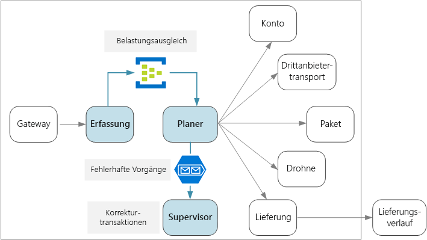
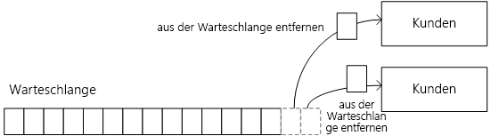
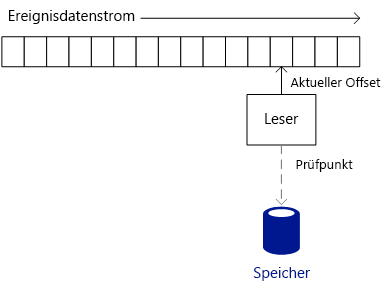
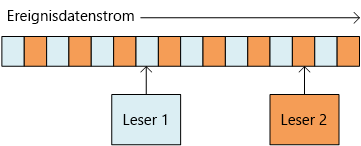
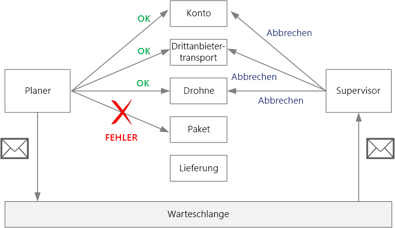

# <a name="designing-microservices-ingestion-and-workflow"></a><span data-ttu-id="641e9-103">Entwerfen von Microservices: Erfassung und Workflow</span><span class="sxs-lookup"><span data-stu-id="641e9-103">Designing microservices: Ingestion and workflow</span></span>

<span data-ttu-id="641e9-104">Microservices verfügen häufig über einen Workflow, der für eine einzelne Transaktion über mehrere Dienste reicht.</span><span class="sxs-lookup"><span data-stu-id="641e9-104">Microservices often have a workflow that spans multiple services for a single transaction.</span></span> <span data-ttu-id="641e9-105">Der Workflow muss zuverlässig sein, und es darf nicht zu einem Verlust oder zu einem Teilabschluss von Transaktionen kommen.</span><span class="sxs-lookup"><span data-stu-id="641e9-105">The workflow must be reliable; it can't lose transactions or leave them in a partially completed state.</span></span> <span data-ttu-id="641e9-106">Außerdem ist es sehr wichtig, die Erfassungsrate für eingehende Anforderungen zu steuern.</span><span class="sxs-lookup"><span data-stu-id="641e9-106">It's also critical to control the ingestion rate of incoming requests.</span></span> <span data-ttu-id="641e9-107">Wenn viele kleinere Dienste miteinander kommunizieren, kann eine Welle von eingehenden Anforderungen zu einer Überlastung der Kommunikation zwischen den Diensten führen.</span><span class="sxs-lookup"><span data-stu-id="641e9-107">With many small services communicating with each other, a burst of incoming requests can overwhelm the interservice communication.</span></span> 



## <a name="the-drone-delivery-workflow"></a><span data-ttu-id="641e9-108">Workflow für Drohnenlieferung</span><span class="sxs-lookup"><span data-stu-id="641e9-108">The drone delivery workflow</span></span>

<span data-ttu-id="641e9-109">In der Anwendung für die Drohnenlieferung (Drone Delivery) müssen die folgenden Vorgänge durchgeführt werden, um eine Lieferung zu planen:</span><span class="sxs-lookup"><span data-stu-id="641e9-109">In the Drone Delivery application, the following operations must be performed to schedule a delivery:</span></span>

1. <span data-ttu-id="641e9-110">Überprüfen des Status des Kundenkontos (Kontodienst (Account))</span><span class="sxs-lookup"><span data-stu-id="641e9-110">Check the status of the customer's account (Account service).</span></span>
2. <span data-ttu-id="641e9-111">Erstellen einer neuen Paketidentität (Paketdienst (Package))</span><span class="sxs-lookup"><span data-stu-id="641e9-111">Create a new package entity (Package service).</span></span>
3. <span data-ttu-id="641e9-112">Überprüfen anhand der Abhol- und Lieferorte (Drittanbieter-Transportdienst (Third-party Transportation)), ob für die Lieferung ein Transport durch Dritte erforderlich ist</span><span class="sxs-lookup"><span data-stu-id="641e9-112">Check whether any third-party transportation is required for this delivery, based on the pickup and delivery locations (Third-party Transportation service).</span></span>
4. <span data-ttu-id="641e9-113">Planen einer Drohne für die Abholung (Drohnendienst (Drone))</span><span class="sxs-lookup"><span data-stu-id="641e9-113">Schedule a drone for pickup (Drone service).</span></span>
5. <span data-ttu-id="641e9-114">Erstellen einer neuen Lieferentität (Lieferdienst (Delivery))</span><span class="sxs-lookup"><span data-stu-id="641e9-114">Create a new delivery entity (Delivery service).</span></span>

<span data-ttu-id="641e9-115">Dies ist der Kern der gesamten Anwendung, und der End-to-End-Prozess muss eine hohe Leistung und Zuverlässigkeit aufweisen.</span><span class="sxs-lookup"><span data-stu-id="641e9-115">This is the core of the entire application, so the end-to-end process must be performant as well as reliable.</span></span> <span data-ttu-id="641e9-116">Es müssen einige besondere Anforderungen erfüllt werden:</span><span class="sxs-lookup"><span data-stu-id="641e9-116">Some particular challenges must be addressed:</span></span>

- <span data-ttu-id="641e9-117">**Belastungsausgleich**:</span><span class="sxs-lookup"><span data-stu-id="641e9-117">**Load leveling**.</span></span> <span data-ttu-id="641e9-118">Zu viele Clientanforderungen können dazu führen, dass das System mit dem Netzwerkdatenverkehr zwischen den Diensten überlastet wird.</span><span class="sxs-lookup"><span data-stu-id="641e9-118">Too many client requests can overwhelm the system with interservice network traffic.</span></span> <span data-ttu-id="641e9-119">Außerdem kann es auch für abhängige Back-End-Komponenten, z.B. Speicher- oder Remotedienste, zu einer Überlastung kommen.</span><span class="sxs-lookup"><span data-stu-id="641e9-119">It can also overwhelm backend dependencies such as storage or remote services.</span></span> <span data-ttu-id="641e9-120">Als Reaktion darauf werden ggf. die aufrufenden Dienste gedrosselt, sodass im System Rückstaus entstehen.</span><span class="sxs-lookup"><span data-stu-id="641e9-120">These may react by throttling the services calling them, creating backpressure in the system.</span></span> <span data-ttu-id="641e9-121">Daher ist es wichtig, für die eingehenden Anforderungen des Systems einen Belastungsausgleich durchzuführen, indem diese zur Verarbeitung in einem Puffer oder einer Warteschlange angeordnet werden.</span><span class="sxs-lookup"><span data-stu-id="641e9-121">Therefore, it's important to load level the requests coming into the system, by putting them into a buffer or queue for processing.</span></span> 

- <span data-ttu-id="641e9-122">**Garantierte Übermittlung**:</span><span class="sxs-lookup"><span data-stu-id="641e9-122">**Guaranteed delivery**.</span></span> <span data-ttu-id="641e9-123">Um zu verhindern, dass Clientanforderungen verloren gehen, muss für die Erfassungskomponente eine einmalige Zustellung garantiert sein.</span><span class="sxs-lookup"><span data-stu-id="641e9-123">To avoid dropping any client requests, the ingestion component must guarantee at-least-once delivery of messages.</span></span> 

- <span data-ttu-id="641e9-124">**Fehlerbehandlung**:</span><span class="sxs-lookup"><span data-stu-id="641e9-124">**Error handling**.</span></span> <span data-ttu-id="641e9-125">Wenn für einen Dienst ein Fehlercode oder ein nicht vorübergehender Fehler auftritt, kann die Zustellung nicht geplant werden.</span><span class="sxs-lookup"><span data-stu-id="641e9-125">If any of the services returns an error code or experiences a non-transient failure, the delivery cannot be scheduled.</span></span> <span data-ttu-id="641e9-126">Ein Fehlercode kann auf einen erwarteten Fehlerzustand (z.B. die Aussetzung des Kundenkontos) oder einen unerwarteten Serverfehler (HTTP 5xx) hinweisen.</span><span class="sxs-lookup"><span data-stu-id="641e9-126">An error code might indicate an expected error condition (for example, the customer's account is suspended) or an unexpected server error (HTTP 5xx).</span></span> <span data-ttu-id="641e9-127">Ein Dienst kann auch ggf. nicht verfügbar sein, sodass es für den Netzwerkaufruf zu einer Zeitüberschreitung kommt.</span><span class="sxs-lookup"><span data-stu-id="641e9-127">A service might also be unavailable, causing the network call to time out.</span></span> 

<span data-ttu-id="641e9-128">Zuerst sehen wir uns die Erfassungsseite der Gleichung an, also wie das System eingehende Benutzeranforderungen bei hohem Durchsatz erfassen kann.</span><span class="sxs-lookup"><span data-stu-id="641e9-128">First we'll look at the ingestion side of the equation &mdash; how the system can ingest incoming user requests at high throughput.</span></span> <span data-ttu-id="641e9-129">Anschließend beschäftigen wir uns damit, wie mit der Anwendung für die Drohnenlieferung ein zuverlässiger Workflow implementiert werden kann.</span><span class="sxs-lookup"><span data-stu-id="641e9-129">Then we'll consider how the drone delivery application can implement a reliable workflow.</span></span> <span data-ttu-id="641e9-130">Wir kommen zu der Erkenntnis, dass sich der Entwurf des Subsystems für die Erfassung auf das Workflow-Back-End auswirkt.</span><span class="sxs-lookup"><span data-stu-id="641e9-130">It turns out that the design of the ingestion subsystem affects the workflow backend.</span></span> 

## <a name="ingestion"></a><span data-ttu-id="641e9-131">Erfassung</span><span class="sxs-lookup"><span data-stu-id="641e9-131">Ingestion</span></span>

<span data-ttu-id="641e9-132">Basierend auf den geschäftlichen Anforderungen hat das Entwicklungsteam die folgenden nicht funktionsbezogenen Anforderungen für die Erfassung identifiziert:</span><span class="sxs-lookup"><span data-stu-id="641e9-132">Based on business requirements, the development team identified the following non-functional requirements for ingestion:</span></span>

- <span data-ttu-id="641e9-133">Dauerhafter Durchsatz von 10.000 Anforderungen/Sekunde</span><span class="sxs-lookup"><span data-stu-id="641e9-133">Sustained throughput of 10K requests/sec.</span></span>
- <span data-ttu-id="641e9-134">Fähigkeit zur Verarbeitung von Spitzen im Bereich von bis zu 50.000 Anforderungen/Sekunde ohne Verlust von Clientanforderungen oder Zeitüberschreitung</span><span class="sxs-lookup"><span data-stu-id="641e9-134">Able to handle spikes of up to 50K/sec without dropping client requests or timing out.</span></span>
- <span data-ttu-id="641e9-135">Wartezeit von weniger als 500 ms im 99. Perzentil</span><span class="sxs-lookup"><span data-stu-id="641e9-135">Less than 500ms latency in the 99th percentile.</span></span>

<span data-ttu-id="641e9-136">Die Anforderung zur Verarbeitung von gelegentlichen Datenverkehrsspitzen führt zu einer besonderen Entwurfsanforderung.</span><span class="sxs-lookup"><span data-stu-id="641e9-136">The requirement to handle occasional spikes in traffic presents a design challenge.</span></span> <span data-ttu-id="641e9-137">Theoretisch kann das System horizontal hochskaliert werden, um den maximal zu erwartenden Datenverkehr verarbeiten zu können.</span><span class="sxs-lookup"><span data-stu-id="641e9-137">In theory, the system could be scaled out to handle the maximum expected traffic.</span></span> <span data-ttu-id="641e9-138">Bei dieser Art der Bereitstellung wären aber viele Ressourcen sehr ineffizient.</span><span class="sxs-lookup"><span data-stu-id="641e9-138">However, provisioning that many resources would be very inefficient.</span></span> <span data-ttu-id="641e9-139">Da die Anwendung in den meisten Fällen nicht so viel Kapazität benötigt, befinden sich Kerne im Leerlauf. Dies kostet Geld, ohne dass sich ein Nutzen daraus ergibt.</span><span class="sxs-lookup"><span data-stu-id="641e9-139">Most of the time, the application will not need that much capacity, so there would be idle cores, costing money without adding value.</span></span>

<span data-ttu-id="641e9-140">Ein besserer Ansatz besteht darin, die eingehenden Anforderungen in einem Puffer anzuordnen und den Puffer als Komponente für den Belastungsausgleich einzusetzen.</span><span class="sxs-lookup"><span data-stu-id="641e9-140">A better approach is to put the incoming requests into a buffer, and let the buffer act as a load leveler.</span></span> <span data-ttu-id="641e9-141">Bei diesem Entwurf muss der Erfassungsdienst die maximale Erfassungsrate über kurze Zeiträume hinweg verarbeiten können, während die Back-End-Dienste nur die maximale dauerhafte Belastung bewältigen müssen.</span><span class="sxs-lookup"><span data-stu-id="641e9-141">With this design, the Ingestion service must be able to handle the maximum ingestion rate over short periods, but the backend services only need to handle the maximum sustained load.</span></span> <span data-ttu-id="641e9-142">Durch die Pufferung am Front-End ist es normalerweise nicht erforderlich, dass die Back-End-Dienste hohe Datenverkehrsspitzen verarbeiten.</span><span class="sxs-lookup"><span data-stu-id="641e9-142">By buffering at the front end, the backend services shouldn't need to handle large spikes in traffic.</span></span> <span data-ttu-id="641e9-143">Auf der Skalierungsebene, die für die Anwendung für die Drohnenlieferung benötigt wird, ist [Azure Event Hubs](/azure/event-hubs/) eine gute Wahl für den Belastungsausgleich.</span><span class="sxs-lookup"><span data-stu-id="641e9-143">At the scale required for the Drone Delivery application, [Azure Event Hubs](/azure/event-hubs/) is a good choice for load leveling.</span></span> <span data-ttu-id="641e9-144">Event Hubs ermöglicht geringe Wartezeiten und einen hohen Durchsatz sowie eine kostengünstige Lösung bei hohen Erfassungsvolumen.</span><span class="sxs-lookup"><span data-stu-id="641e9-144">Event Hubs offers low latency and high throughput, and is a cost effective solution at high ingestion volumes.</span></span> 

<span data-ttu-id="641e9-145">Für unsere Tests haben wir einen Event Hub der Standard-Ebene mit 32 Partitionen und 100 Durchsatzeinheiten verwendet.</span><span class="sxs-lookup"><span data-stu-id="641e9-145">For our testing, we used a Standard tier event hub with 32 partitions and 100 throughput units.</span></span> <span data-ttu-id="641e9-146">Hierbei konnten wir eine Erfassung von ca. 32.000 Ereignissen pro Sekunde mit einer Latenz von ca. 90 ms beobachten.</span><span class="sxs-lookup"><span data-stu-id="641e9-146">We observed about 32K events / second ingestion, with latency around 90ms.</span></span> <span data-ttu-id="641e9-147">Das Standardlimit beträgt derzeit 20 Durchsatzeinheiten, aber Azure-Kunden können weitere Durchsatzeinheiten anfordern, indem Sie eine Supportanfrage erstellen.</span><span class="sxs-lookup"><span data-stu-id="641e9-147">Currently the default limit is 20 throughput units, but Azure customers can request additional throughput units by filing a support request.</span></span> <span data-ttu-id="641e9-148">Weitere Informationen finden Sie unter [Event Hubs-Kontingente](/azure/event-hubs/event-hubs-quotas).</span><span class="sxs-lookup"><span data-stu-id="641e9-148">See [Event Hubs quotas](/azure/event-hubs/event-hubs-quotas) for more information.</span></span> <span data-ttu-id="641e9-149">Wie bei allen Leistungsmetriken können sich viele Faktoren auf die Leistung auswirken, z.B. die Größe der Nachrichtennutzlast. Diese Zahlen sollten also nicht als Benchmark-Werte interpretiert werden.</span><span class="sxs-lookup"><span data-stu-id="641e9-149">As with all performance metrics, many factors can affect performance, such as message payload size, so don't interpret these numbers as a benchmark.</span></span> <span data-ttu-id="641e9-150">Wenn ein höherer Durchsatz benötigt wird, kann der Erfassungsdienst per Sharding über mehr als einen Event Hub verteilt werden.</span><span class="sxs-lookup"><span data-stu-id="641e9-150">If more throughput is needed, the Ingestion service can shard across more than one event hub.</span></span> <span data-ttu-id="641e9-151">Falls noch höhere Durchsatzraten erforderlich sind, sind mit [Event Hubs Dedicated](/azure/event-hubs/event-hubs-dedicated-overview) Bereitstellungen mit Einzelmandant möglich, bei denen über 2 Millionen Ereignisse pro Sekunde eingehen können.</span><span class="sxs-lookup"><span data-stu-id="641e9-151">For even higher throughput rates, [Event Hubs Dedicated](/azure/event-hubs/event-hubs-dedicated-overview) offers single-tenant deployments that can ingress over 2 million events per second.</span></span>

<span data-ttu-id="641e9-152">Es ist wichtig zu verstehen, wie für Event Hubs ein solch hoher Durchsatz erzielt werden kann, da sich dies darauf auswirkt, wie ein Client Nachrichten von Event Hubs nutzen sollte.</span><span class="sxs-lookup"><span data-stu-id="641e9-152">It's important to understand how Event Hubs can achieve such high throughput, because that affects how a client should consume messages from Event Hubs.</span></span> <span data-ttu-id="641e9-153">Bei Event Hubs wird keine *Warteschlange* implementiert.</span><span class="sxs-lookup"><span data-stu-id="641e9-153">Event Hubs does not implement a *queue*.</span></span> <span data-ttu-id="641e9-154">Stattdessen wird ein *Ereignisdatenstrom* implementiert.</span><span class="sxs-lookup"><span data-stu-id="641e9-154">Rather, it implements an *event stream*.</span></span> 

<span data-ttu-id="641e9-155">Mit einer Warteschlange kann ein einzelner Consumer eine Nachricht aus der Warteschlange entfernen, sodass der nächste Consumer diese Nachricht nicht sieht.</span><span class="sxs-lookup"><span data-stu-id="641e9-155">With a queue, an individual consumer can remove a message from the queue, and the next consumer won't see that message.</span></span> <span data-ttu-id="641e9-156">Bei Warteschlangen können Sie daher ein [Muster „Konkurrierende Consumer“](../patterns/competing-consumers.md) verwenden, um Nachrichten parallel zu verarbeiten und die Skalierbarkeit zu verbessern.</span><span class="sxs-lookup"><span data-stu-id="641e9-156">Queues therefore allow you to use a [Competing Consumers pattern](../patterns/competing-consumers.md) to process messages in parallel and improve scalability.</span></span> <span data-ttu-id="641e9-157">Zur Erhöhung der Resilienz sperrt der Consumer die Nachricht und hebt die Sperre auf, wenn er die Verarbeitung der Nachricht abgeschlossen hat.</span><span class="sxs-lookup"><span data-stu-id="641e9-157">For greater resiliency, the consumer holds a lock on the message and releases the lock when it's done processing the message.</span></span> <span data-ttu-id="641e9-158">Falls für den Consumer ein Fehler auftritt – z.B. der zugrunde liegende Knoten abstürzt –, tritt für die Sperre eine Zeitüberschreitung auf, und die Nachricht wird wieder in die Warteschlange eingereiht.</span><span class="sxs-lookup"><span data-stu-id="641e9-158">If the consumer fails &mdash; for example, the node it's running on crashes &mdash; the lock times out and the message goes back onto the queue.</span></span> 



<span data-ttu-id="641e9-159">Für Event Hubs wird dagegen eine Streamingsemantik genutzt.</span><span class="sxs-lookup"><span data-stu-id="641e9-159">Event Hubs, on the other hand, uses streaming semantics.</span></span> <span data-ttu-id="641e9-160">Consumer lesen den Datenstrom unabhängig mit ihrer eigenen Geschwindigkeit.</span><span class="sxs-lookup"><span data-stu-id="641e9-160">Consumers read the stream independently at their own pace.</span></span> <span data-ttu-id="641e9-161">Jeder Consumer ist dafür verantwortlich, seine aktuelle Position im Datenstrom nachzuverfolgen.</span><span class="sxs-lookup"><span data-stu-id="641e9-161">Each consumer is responsible for keeping track of its current position in the stream.</span></span> <span data-ttu-id="641e9-162">Ein Consumer sollte seine aktuelle Position in vordefinierten Intervallen in einen beständigen Speicher schreiben.</span><span class="sxs-lookup"><span data-stu-id="641e9-162">A consumer should write its current position to persistent storage at some predefined interval.</span></span> <span data-ttu-id="641e9-163">Falls für den Consumer ein Fehler auftritt (z.B. ein Absturz des Consumers oder Ausfall des Hosts), kann eine neue Instanz das Lesen des Datenstroms dann ab der zuletzt aufgezeichneten Position fortsetzen.</span><span class="sxs-lookup"><span data-stu-id="641e9-163">That way, if the consumer experiences a fault (for example, the consumer crashes, or the host fails), then a new instance can resume reading the stream from the last recorded position.</span></span> <span data-ttu-id="641e9-164">Dieser Prozess wird als *Setzen von Prüfpunkten* bezeichnet.</span><span class="sxs-lookup"><span data-stu-id="641e9-164">This process is called *checkpointing*.</span></span> 

<span data-ttu-id="641e9-165">Aus Leistungsgründen führt ein Consumer das Setzen von Prüfpunkten nicht nach jeder Nachricht durch.</span><span class="sxs-lookup"><span data-stu-id="641e9-165">For performance reasons, a consumer generally doesn't checkpoint after each message.</span></span> <span data-ttu-id="641e9-166">Stattdessen erfolgt dies in festen Intervallen, z.B. nach der Verarbeitung von *n* Nachrichten oder alle *n* Sekunden.</span><span class="sxs-lookup"><span data-stu-id="641e9-166">Instead, it checkpoints at some fixed interval, for example after processing *n* messages, or every *n* seconds.</span></span> <span data-ttu-id="641e9-167">Aus diesem Grund werden einige Ereignisse bei einem Ausfall eines Consumers ggf. zweimal verarbeitet, da eine neue Instanz den Vorgang immer ab dem letzten Prüfpunkt fortsetzt.</span><span class="sxs-lookup"><span data-stu-id="641e9-167">As a consequence, if a consumer fails, some events may get processed twice, because a new instance always picks up from the last checkpoint.</span></span> <span data-ttu-id="641e9-168">Dies ist mit einem Nachteil verbunden: Häufige Prüfpunkte können die Leistung beeinträchtigen, und eine geringe Zahl von Prüfpunkten bedeutet, dass Sie nach einem Fehler mehr Ereignisse wiederholen müssen.</span><span class="sxs-lookup"><span data-stu-id="641e9-168">There is a tradeoff: Frequent checkpoints can hurt performance, but sparse checkpoints mean you will replay more events after a failure.</span></span>  


 
<span data-ttu-id="641e9-169">Event Hubs ist nicht für konkurrierende Consumer ausgelegt.</span><span class="sxs-lookup"><span data-stu-id="641e9-169">Event Hubs is not designed for competing consumers.</span></span> <span data-ttu-id="641e9-170">Es können zwar mehrere Consumer einen Datenstrom lesen, aber jeder durchläuft den Datenstrom unabhängig von den anderen.</span><span class="sxs-lookup"><span data-stu-id="641e9-170">Although multiple consumers can read a stream, each traverses the stream independently.</span></span> <span data-ttu-id="641e9-171">Stattdessen wird für Event Hubs das Muster „Partitionierter Consumer“ verwendet.</span><span class="sxs-lookup"><span data-stu-id="641e9-171">Instead, Event Hubs uses a partitioned consumer pattern.</span></span> <span data-ttu-id="641e9-172">Ein Event Hub verfügt über bis zu 32 Partitionen.</span><span class="sxs-lookup"><span data-stu-id="641e9-172">An event hub has up to 32 partitions.</span></span> <span data-ttu-id="641e9-173">Die horizontale Skalierung wird erzielt, indem jeder Partition ein separater Consumer zugewiesen wird.</span><span class="sxs-lookup"><span data-stu-id="641e9-173">Horizontal scale is achieved by assigning a separate consumer to each partition.</span></span>

<span data-ttu-id="641e9-174">Was bedeutet dies für den Workflow für die Drohnenlieferung?</span><span class="sxs-lookup"><span data-stu-id="641e9-174">What does this mean for the drone delivery workflow?</span></span> <span data-ttu-id="641e9-175">Damit sich der volle Nutzen von Event Hubs entfaltet, kann der Scheduler für die Lieferung nicht warten, bis jede Nachricht verarbeitet wurde, bevor mit der nächsten Nachricht fortgefahren wird.</span><span class="sxs-lookup"><span data-stu-id="641e9-175">To get the full benefit of Event Hubs, the Delivery Scheduler cannot wait for each message to be processed before moving onto the next.</span></span> <span data-ttu-id="641e9-176">Falls diese Vorgehensweise gewählt wird, verbringt der Scheduler einen Großteil seiner Zeit mit dem Warten auf den Abschluss von Netzwerkaufrufen.</span><span class="sxs-lookup"><span data-stu-id="641e9-176">If it does that, it will spend most of its time waiting for network calls to complete.</span></span> <span data-ttu-id="641e9-177">Stattdessen müssen Batches mit Nachrichten parallel verarbeitet werden, indem asynchrone Aufrufe der Back-End-Dienste durchgeführt werden.</span><span class="sxs-lookup"><span data-stu-id="641e9-177">Instead, it needs to process batches of messages in parallel, using asynchronous calls to the backend services.</span></span> <span data-ttu-id="641e9-178">Wie wir sehen werden, ist auch die Auswahl der richtigen Strategie für das Setzen von Prüfpunkten wichtig.</span><span class="sxs-lookup"><span data-stu-id="641e9-178">As we'll see, choosing the right checkpointing strategy is also important.</span></span>  

## <a name="workflow"></a><span data-ttu-id="641e9-179">Workflow</span><span class="sxs-lookup"><span data-stu-id="641e9-179">Workflow</span></span>

<span data-ttu-id="641e9-180">Wir haben uns drei Optionen zum Lesen und Verarbeiten der Nachrichten angesehen: Ereignisprozessorhost, Service Bus-Warteschlangen und die IoTHub React-Bibliothek.</span><span class="sxs-lookup"><span data-stu-id="641e9-180">We looked at three options for reading and processing the messages: Event Processor Host, Service Bus queues, and the IoTHub React library.</span></span> <span data-ttu-id="641e9-181">Wir haben IoTHub React gewählt, beginnen aber mit dem Ereignisprozessorhost, um diese Wahl zu verdeutlichen.</span><span class="sxs-lookup"><span data-stu-id="641e9-181">We chose IoTHub React, but to understand why, it helps to start with Event Processor Host.</span></span> 

### <a name="event-processor-host"></a><span data-ttu-id="641e9-182">Ereignisprozessorhost</span><span class="sxs-lookup"><span data-stu-id="641e9-182">Event Processor Host</span></span>

<span data-ttu-id="641e9-183">Der Ereignisprozessorhost ist für die Batchverarbeitung von Nachrichten ausgelegt.</span><span class="sxs-lookup"><span data-stu-id="641e9-183">Event Processor Host is designed for message batching.</span></span> <span data-ttu-id="641e9-184">Die Anwendung implementiert die `IEventProcessor`-Schnittstelle, und der Prozessorhost erstellt eine Ereignisprozessorinstanz für jede Partition im Event Hub.</span><span class="sxs-lookup"><span data-stu-id="641e9-184">The application implements the `IEventProcessor` interface, and the Processor Host creates one event processor instance for each partition in the event hub.</span></span> <span data-ttu-id="641e9-185">Der Ereignisprozessorhost ruft dann jede `ProcessEventsAsync`-Methode des Ereignisprozessors mit Batches von Ereignisnachrichten auf.</span><span class="sxs-lookup"><span data-stu-id="641e9-185">The Event Processor Host then calls each event processor's `ProcessEventsAsync` method with batches of event messages.</span></span> <span data-ttu-id="641e9-186">Die Anwendung steuert, wann in der `ProcessEventsAsync`-Methode Prüfpunkte gesetzt werden, und der Ereignisprozessorhost schreibt die Prüfpunkte in den Azure-Speicher.</span><span class="sxs-lookup"><span data-stu-id="641e9-186">The application controls when to checkpoint inside the `ProcessEventsAsync` method, and the Event Processor Host writes the checkpoints to Azure storage.</span></span> 

<span data-ttu-id="641e9-187">Innerhalb einer Partition wartet der Ereignisprozessorhost darauf, dass `ProcessEventsAsync` zurückgegeben wird, bevor der Aufruf mit dem nächsten Batch erneut durchgeführt wird.</span><span class="sxs-lookup"><span data-stu-id="641e9-187">Within a partition, Event Processor Host waits for `ProcessEventsAsync` to return before calling again with the next batch.</span></span> <span data-ttu-id="641e9-188">Mit diesem Ansatz wird das Programmiermodell vereinfacht, weil Ihr Ereignisverarbeitungscode nicht eintrittsinvariant sein muss.</span><span class="sxs-lookup"><span data-stu-id="641e9-188">This approach simplifies the programming model, because your event processing code doesn't need to be reentrant.</span></span> <span data-ttu-id="641e9-189">Dies bedeutet aber auch, dass der Ereignisprozessor jeweils nur einen Batch verarbeitet, und dies wirkt sich negativ auf die Geschwindigkeit aus, mit der der Prozessorhost Nachrichten senden kann.</span><span class="sxs-lookup"><span data-stu-id="641e9-189">However, it also means that the event processor handles one batch at a time, and this gates the speed at which the Processor Host can pump messages.</span></span>

> [!NOTE] 
> <span data-ttu-id="641e9-190">Der Prozessorhost muss hierbei nicht tatsächlich (im Sinne einer Thread-Blockierung) *warten*.</span><span class="sxs-lookup"><span data-stu-id="641e9-190">The Processor Host doesn't actually *wait* in the sense of blocking a thread.</span></span> <span data-ttu-id="641e9-191">Da die `ProcessEventsAsync`-Methode asynchron ist, können vom Prozessorhost andere Arbeitsschritte ausgeführt werden, während die Verarbeitung der Methode abgeschlossen wird.</span><span class="sxs-lookup"><span data-stu-id="641e9-191">The `ProcessEventsAsync` method is asynchronous, so the Processor Host can do other work while the method is completing.</span></span> <span data-ttu-id="641e9-192">Für diese Partition wird aber kein weiterer Batch mit Nachrichten bereitgestellt, bis die Methode zurückgegeben wurde.</span><span class="sxs-lookup"><span data-stu-id="641e9-192">But it won't deliver another batch of messages for that partition until the method returns.</span></span> 

<span data-ttu-id="641e9-193">In der Drohnenanwendung kann ein Batch mit Nachrichten parallel verarbeitet werden.</span><span class="sxs-lookup"><span data-stu-id="641e9-193">In the drone application, a batch of messages can be processed in parallel.</span></span> <span data-ttu-id="641e9-194">Das Warten auf den Abschluss der Verarbeitung des gesamten Batchs kann aber trotzdem zu einem Engpass führen.</span><span class="sxs-lookup"><span data-stu-id="641e9-194">But waiting for the whole batch to complete can still cause a bottleneck.</span></span> <span data-ttu-id="641e9-195">Die Verarbeitung kann nur so schnell wie die langsamste Nachricht im Batch erfolgen.</span><span class="sxs-lookup"><span data-stu-id="641e9-195">Processing can only be as fast as the slowest message within a batch.</span></span> <span data-ttu-id="641e9-196">Jegliche Abweichung bei den Antwortzeiten kann zu einem „Long Tail“-Zustand führen, bei dem einige langsame Antworten das gesamte System beeinträchtigen.</span><span class="sxs-lookup"><span data-stu-id="641e9-196">Any variation in response times can create a "long tail," where a few slow responses drag down the entire system.</span></span> <span data-ttu-id="641e9-197">Unsere Leistungstests haben ergeben, dass wir mit diesem Ansatz unseren Zieldurchsatz nicht erreichen konnten.</span><span class="sxs-lookup"><span data-stu-id="641e9-197">Our performance tests showed that we did not achieve our target throughput using this approach.</span></span> <span data-ttu-id="641e9-198">Dies bedeutet *nicht*, dass Sie die Verwendung des Ereignisprozessorhosts vermeiden sollten.</span><span class="sxs-lookup"><span data-stu-id="641e9-198">This does *not* mean that you should avoid using Event Processor Host.</span></span> <span data-ttu-id="641e9-199">Vermeiden Sie in der `ProcesssEventsAsync`-Methode aber Aufgaben mit langer Ausführungsdauer, um einen hohen Durchsatz zu erzielen.</span><span class="sxs-lookup"><span data-stu-id="641e9-199">But for high throughput, avoid doing any long-running tasks inside the `ProcesssEventsAsync` method.</span></span> <span data-ttu-id="641e9-200">Sorgen Sie dafür, dass jeder Batch schnell verarbeitet wird.</span><span class="sxs-lookup"><span data-stu-id="641e9-200">Process each batch quickly.</span></span>

### <a name="iothub-react"></a><span data-ttu-id="641e9-201">IotHub React</span><span class="sxs-lookup"><span data-stu-id="641e9-201">IotHub React</span></span> 

<span data-ttu-id="641e9-202">[IotHub React](https://github.com/Azure/toketi-iothubreact) ist eine Akka Streams-Bibliothek zum Lesen von Ereignissen aus Event Hub.</span><span class="sxs-lookup"><span data-stu-id="641e9-202">[IotHub React](https://github.com/Azure/toketi-iothubreact) is an Akka Streams library for reading events from Event Hub.</span></span> <span data-ttu-id="641e9-203">Akka Streams ist ein datenstrombasiertes Programmierframework, mit dem die [Reactive Streams](http://www.reactive-streams.org/)-Spezifikation implementiert wird.</span><span class="sxs-lookup"><span data-stu-id="641e9-203">Akka Streams is a stream-based programming framework that implements the [Reactive Streams](http://www.reactive-streams.org/) specification.</span></span> <span data-ttu-id="641e9-204">Es ermöglicht die Erstellung von effizienten Streamingpipelines, bei denen alle Streamingvorgänge asynchron durchgeführt werden und die Pipeline Rückstaus korrekt verarbeiten kann.</span><span class="sxs-lookup"><span data-stu-id="641e9-204">It provides a way to build efficient streaming pipelines, where all streaming operations are performed asynchronously, and the pipeline gracefully handles backpressure.</span></span> <span data-ttu-id="641e9-205">Zu Rückstaus kommt es, wenn eine Ereignisquelle Ereignisse schneller produziert, als diese von nachgeschalteten Consumern empfangen werden können. Dies ist genau die Situation, in der für das System für die Drohnenlieferung eine Datenverkehrsspitze auftritt.</span><span class="sxs-lookup"><span data-stu-id="641e9-205">Backpressure occurs when an event source produces events at a faster rate than the downstream consumers can receive them &mdash; which is exactly the situation when the drone delivery system has a spike in traffic.</span></span> <span data-ttu-id="641e9-206">Wenn sich die Back-End-Dienste verlangsamen, gilt dies auch für IoTHub React.</span><span class="sxs-lookup"><span data-stu-id="641e9-206">If backend services go slower, IoTHub React will slow down.</span></span> <span data-ttu-id="641e9-207">Wenn die Kapazität erhöht wird, sendet IoTHub React mehr Nachrichten über die Pipeline.</span><span class="sxs-lookup"><span data-stu-id="641e9-207">If capacity is increased, IoTHub React will push more messages through the pipeline.</span></span>

<span data-ttu-id="641e9-208">Akka Streams ist außerdem ein außerordentlich natürliches Programmiermodell zum Streamen von Ereignissen aus Event Hubs.</span><span class="sxs-lookup"><span data-stu-id="641e9-208">Akka Streams is also a very natural programming model for streaming events from Event Hubs.</span></span> <span data-ttu-id="641e9-209">Anstatt eine Schleife durch einen Batch mit Ereignissen durchzuführen, definieren Sie eine Gruppe von Vorgängen, die auf jedes Ereignis angewendet werden, und überlassen Akka Streams das Streaming.</span><span class="sxs-lookup"><span data-stu-id="641e9-209">Instead of looping through a batch of events, you define a set of operations that will be applied to each event, and let Akka Streams handle the streaming.</span></span> <span data-ttu-id="641e9-210">Von Akka Streams wird eine Streamingpipeline basierend auf *Quellen*, *Datenflüssen* und *Senken* definiert.</span><span class="sxs-lookup"><span data-stu-id="641e9-210">Akka Streams defines a streaming pipeline in terms of *Sources*, *Flows*, and *Sinks*.</span></span> <span data-ttu-id="641e9-211">Eine Quelle generiert einen Ausgabestream, ein Datenfluss verarbeitet einen Eingabestream und erstellt einen Ausgabestream, und eine Senke nutzt einen Datenstrom, ohne eine Ausgabe zu produzieren.</span><span class="sxs-lookup"><span data-stu-id="641e9-211">A source generates an output stream, a flow processes an input stream and produces an output stream, and a sink consumes a stream without producing any output.</span></span>

<span data-ttu-id="641e9-212">Hier ist der Code des Scheduler-Diensts angegeben, mit dem die Akka Streams-Pipeline eingerichtet wird:</span><span class="sxs-lookup"><span data-stu-id="641e9-212">Here is the code in the Scheduler service that sets up the Akka Streams pipeline:</span></span>

```java
IoTHub iotHub = new IoTHub();
Source<MessageFromDevice, NotUsed> messages = iotHub.source(options);

messages.map(msg -> DeliveryRequestEventProcessor.parseDeliveryRequest(msg))
        .filter(ad -> ad.getDelivery() != null).via(deliveryProcessor()).to(iotHub.checkpointSink())
        .run(streamMaterializer);
```

<span data-ttu-id="641e9-213">Mit diesem Code wird Event Hubs als Quelle konfiguriert.</span><span class="sxs-lookup"><span data-stu-id="641e9-213">This code configures Event Hubs as a source.</span></span> <span data-ttu-id="641e9-214">Mit der `map`-Anweisung wird jede Ereignisnachricht in eine Java-Klasse deserialisiert, die für eine Lieferanforderung steht.</span><span class="sxs-lookup"><span data-stu-id="641e9-214">The `map` statement deserializes each event message into a Java class that represents a delivery request.</span></span> <span data-ttu-id="641e9-215">Die `filter`-Anweisung entfernt alle `null`-Objekte aus dem Datenstrom. Dies dient als Schutz vor einem Fall, in dem eine Nachricht nicht deserialisiert werden kann.</span><span class="sxs-lookup"><span data-stu-id="641e9-215">The `filter` statement removes any `null` objects from the stream; this guards against the case where a message can't be deserialized.</span></span> <span data-ttu-id="641e9-216">Die `via`-Anweisung verknüpft die Quelle mit einem Datenfluss, bei dem jede Lieferanforderung verarbeitet wird.</span><span class="sxs-lookup"><span data-stu-id="641e9-216">The `via` statement joins the source to a flow that processes each delivery request.</span></span> <span data-ttu-id="641e9-217">Die `to`-Methode verknüpft den Datenfluss mit der Prüfpunktsenke, die in IoTHub React integriert ist.</span><span class="sxs-lookup"><span data-stu-id="641e9-217">The `to` method joins the flow to the checkpoint sink, which is built into IoTHub React.</span></span>

<span data-ttu-id="641e9-218">Für IoTHub React wird eine andere Strategie für das Setzen von Prüfpunkten als für den Ereignisprozessorhost verwendet.</span><span class="sxs-lookup"><span data-stu-id="641e9-218">IoTHub React uses a different checkpointing strategy than Event Host Processor.</span></span> <span data-ttu-id="641e9-219">Prüfpunkte werden von der Prüfpunktsenke geschrieben, also der abschließenden Phase in der Pipeline.</span><span class="sxs-lookup"><span data-stu-id="641e9-219">Checkpoints are written by the checkpoint sink, which is the terminating stage in the pipeline.</span></span> <span data-ttu-id="641e9-220">Das Design von Akka Streams ermöglicht der Pipeline das Fortsetzen des Datenstromvorgangs, während die Senke den Prüfpunkt schreibt.</span><span class="sxs-lookup"><span data-stu-id="641e9-220">The design of Akka Streams allows the pipeline to continue streaming data while the sink is writing the checkpoint.</span></span> <span data-ttu-id="641e9-221">Dies bedeutet, dass die Upstream-Verarbeitungsphasen nicht warten müssen, bis das Setzen von Prüfpunkten durchgeführt wird.</span><span class="sxs-lookup"><span data-stu-id="641e9-221">That means the upstream processing stages don't need to wait for checkpointing to happen.</span></span> <span data-ttu-id="641e9-222">Sie können konfigurieren, dass das Setzen von Prüfpunkten nach einer Zeitüberschreitung oder nach der Verarbeitung einer bestimmten Anzahl von Nachrichten erfolgt.</span><span class="sxs-lookup"><span data-stu-id="641e9-222">You can configure checkpointing to occur after a timeout or after a certain number of messages have been processed.</span></span>

<span data-ttu-id="641e9-223">Mit der `deliveryProcessor`-Methode wird der Akka Streams-Datenfluss erstellt:</span><span class="sxs-lookup"><span data-stu-id="641e9-223">The `deliveryProcessor` method creates the Akka Streams flow:</span></span>  

```java
private static Flow<AkkaDelivery, MessageFromDevice, NotUsed> deliveryProcessor() {
    return Flow.of(AkkaDelivery.class).map(delivery -> {
        CompletableFuture<DeliverySchedule> completableSchedule = DeliveryRequestEventProcessor
                .processDeliveryRequestAsync(delivery.getDelivery(), 
                        delivery.getMessageFromDevice().properties());
        
        completableSchedule.whenComplete((deliverySchedule,error) -> {
            if (error!=null){
                Log.info("failed delivery" + error.getStackTrace());
            }
            else{
                Log.info("Completed Delivery",deliverySchedule.toString());
            }
                                
        });
        completableSchedule = null;
        return delivery.getMessageFromDevice();
    });
}
```

<span data-ttu-id="641e9-224">Der Datenfluss ruft eine statische `processDeliveryRequestAsync`-Methode auf, mit der die eigentliche Arbeit zur Verarbeitung jeder Nachricht durchgeführt wird.</span><span class="sxs-lookup"><span data-stu-id="641e9-224">The flow calls a static `processDeliveryRequestAsync` method that does the actual work of processing each message.</span></span>

### <a name="scaling-with-iothub-react"></a><span data-ttu-id="641e9-225">Skalieren mit IoTHub React</span><span class="sxs-lookup"><span data-stu-id="641e9-225">Scaling with IoTHub React</span></span>

<span data-ttu-id="641e9-226">Der Scheduler-Dienst ist so konzipiert, dass jede Containerinstanz von einer einzelnen Partition liest.</span><span class="sxs-lookup"><span data-stu-id="641e9-226">The Scheduler service is designed so that each container instance reads from a single partition.</span></span> <span data-ttu-id="641e9-227">Wenn die Event Hub-Instanz beispielsweise über 32 Partitionen verfügt, wird der Scheduler-Dienst mit 32 Replikaten bereitgestellt.</span><span class="sxs-lookup"><span data-stu-id="641e9-227">For example, if the Event Hub has 32 partitions, the Scheduler service is deployed with 32 replicas.</span></span> <span data-ttu-id="641e9-228">Dies ermöglicht in Bezug auf die horizontale Skalierung eine hohe Flexibilität.</span><span class="sxs-lookup"><span data-stu-id="641e9-228">This allows for a lot of flexibility in terms of horizontal scaling.</span></span> 

<span data-ttu-id="641e9-229">Je nach Größe des Clusters kann auf einem Knoten im Cluster mehr als ein Scheduler-Dienstpod ausgeführt werden.</span><span class="sxs-lookup"><span data-stu-id="641e9-229">Depending on the size of the cluster, a node in the cluster might have more than one Scheduler service pod running on it.</span></span> <span data-ttu-id="641e9-230">Falls der Scheduler-Dienst mehr Ressourcen benötigen sollte, kann der Cluster aber horizontal hochskaliert werden, um die Pods auf mehr Knoten zu verteilen.</span><span class="sxs-lookup"><span data-stu-id="641e9-230">But if the Scheduler service needs more resources, the cluster can be scaled out, in order to distribute the pods across more nodes.</span></span> <span data-ttu-id="641e9-231">Unsere Leistungstests haben ergeben, dass der Scheduler-Dienst speicher- und threadgebunden ist, sodass die Leistung stark von der VM-Größe und der Anzahl von Pods pro Knoten abhängig war.</span><span class="sxs-lookup"><span data-stu-id="641e9-231">Our performance tests showed that the Scheduler service is memory- and thread-bound, so performance depended greatly on the VM size and the number of pods per node.</span></span>

<span data-ttu-id="641e9-232">Jede Instanz muss über die Informationen dazu verfügen, von welcher Event Hubs-Partition gelesen werden soll.</span><span class="sxs-lookup"><span data-stu-id="641e9-232">Each instance needs to know which Event Hubs partition to read from.</span></span> <span data-ttu-id="641e9-233">Zum Konfigurieren der Partitionsnummer haben wir den Ressourcentyp [StatefulSet](https://kubernetes.io/docs/concepts/workloads/controllers/statefulset/) in Kubernetes genutzt.</span><span class="sxs-lookup"><span data-stu-id="641e9-233">To configure the partition number, we took advantage of the [StatefulSet](https://kubernetes.io/docs/concepts/workloads/controllers/statefulset/) resource type in Kubernetes.</span></span> <span data-ttu-id="641e9-234">Pods in einem StatefulSet verfügen über einen beständigen Bezeichner, der einen numerischen Index enthält.</span><span class="sxs-lookup"><span data-stu-id="641e9-234">Pods in a StatefulSet have a persistent identifier that includes a numeric index.</span></span> <span data-ttu-id="641e9-235">Der genaue Podname lautet `<statefulset name>-<index>`, und dieser Wert ist über die [Downward-API](https://kubernetes.io/docs/tasks/inject-data-application/downward-api-volume-expose-pod-information/) von Kubernetes für den Container verfügbar.</span><span class="sxs-lookup"><span data-stu-id="641e9-235">Specifically, the pod name is `<statefulset name>-<index>`, and this value is available to the container through the Kubernetes [Downward API](https://kubernetes.io/docs/tasks/inject-data-application/downward-api-volume-expose-pod-information/).</span></span> <span data-ttu-id="641e9-236">Zur Laufzeit liest der Scheduler-Dienst den Podnamen und verwendet den Podindex als Partitions-ID.</span><span class="sxs-lookup"><span data-stu-id="641e9-236">At run time, the Scheduler services reads the pod name and uses the pod index as the partition ID.</span></span>

<span data-ttu-id="641e9-237">Falls Sie den Scheduler-Dienst noch stärker horizontal hochskalieren müssen, können Sie mehr als einen Pod pro Event Hub-Partition zuweisen, damit mehrere Pods die einzelnen Partitionen lesen.</span><span class="sxs-lookup"><span data-stu-id="641e9-237">If you needed to scale out the Scheduler service even further, you could assign more than one pod per event hub partition, so that multiple pods are reading each partition.</span></span> <span data-ttu-id="641e9-238">In diesem Fall liest aber jede Instanz alle Ereignisse in der zugewiesenen Partition.</span><span class="sxs-lookup"><span data-stu-id="641e9-238">However, in that case, each instance would read all of the events in the assigned partition.</span></span> <span data-ttu-id="641e9-239">Zur Vermeidung einer doppelten Verarbeitung müssten Sie einen Hashalgorithmus verwenden, damit jede Instanz einen Teil der Nachrichten überspringt.</span><span class="sxs-lookup"><span data-stu-id="641e9-239">To avoid duplicate processing, you would need to use a hashing algorithm, so that each instance skips over a portion of the messages.</span></span> <span data-ttu-id="641e9-240">Auf diese Weise können mehrere Leser den Datenstrom nutzen, aber jede Nachricht wird nur von einer Instanz verarbeitet.</span><span class="sxs-lookup"><span data-stu-id="641e9-240">That way, multiple readers can consume the stream, but every message is processed by only one instance.</span></span> 
 


### <a name="service-bus-queues"></a><span data-ttu-id="641e9-241">Service Bus-Warteschlangen</span><span class="sxs-lookup"><span data-stu-id="641e9-241">Service Bus queues</span></span>

<span data-ttu-id="641e9-242">Die dritte von uns erwogene Option war das Kopieren von Nachrichten von Event Hubs in eine Service Bus-Warteschlange und das anschließende Lesen der Nachrichten aus Service Bus durch den Scheduler.</span><span class="sxs-lookup"><span data-stu-id="641e9-242">A third option that we considered was to copy messages from Event Hubs into a Service Bus queue, and then have the Scheduler service read the messages from Service Bus.</span></span> <span data-ttu-id="641e9-243">Es kann ungewöhnlich erscheinen, die eingehenden Anforderungen in Event Hubs nur zu schreiben, um sie in Service Bus zu kopieren.</span><span class="sxs-lookup"><span data-stu-id="641e9-243">It might seem strange to writing the incoming requests into Event Hubs only to copy them in Service Bus.</span></span>  <span data-ttu-id="641e9-244">Die Idee bestand aber darin, die unterschiedlichen Stärken der einzelnen Dienste zu nutzen: Verwendung von Event Hubs zum Absorbieren von hohen Datenverkehrsspitzen, während die Warteschlangensemantik in Service Bus verwendet wird, um die Workload nach dem Muster „Konkurrierende Consumer“ zu verarbeiten.</span><span class="sxs-lookup"><span data-stu-id="641e9-244">However, the idea was to leverage the different strengths of each service: Use Event Hubs to absorb spikes of heavy traffic, while taking advantage of the queue semantics in Service Bus to process the workload with a competing consumers pattern.</span></span> <span data-ttu-id="641e9-245">Bedenken Sie, dass unser Ziel für den dauerhaften Durchsatz unterhalb unserer erwarteten Spitzenlast liegt. Die Service Bus-Warteschlange muss also nicht so schnell wie die Erfassung von Nachrichten sein.</span><span class="sxs-lookup"><span data-stu-id="641e9-245">Remember that our target for sustained throughput is less than our expected peak load, so processing the Service Bus queue would not need to be as fast the message ingestion.</span></span>
 
<span data-ttu-id="641e9-246">Bei diesem Ansatz wurden für unsere Proof of Concept-Implementierung eine Menge von ca. 4.000 Vorgängen pro Sekunde erzielt.</span><span class="sxs-lookup"><span data-stu-id="641e9-246">With this approach, our proof-of-concept implementation achieved about 4K operations per second.</span></span> <span data-ttu-id="641e9-247">Für diese Tests wurden Back-End-Pseudodienste verwendet, mit denen keine richtigen Arbeitsschritte ausgeführt wurden, sondern nur eine feste Menge von Wartezeit pro Dienst hinzugefügt wurde.</span><span class="sxs-lookup"><span data-stu-id="641e9-247">These tests used mock backend services that did not do any real work, but simply added a fixed amount of latency per service.</span></span> <span data-ttu-id="641e9-248">Beachten Sie hierbei, dass unsere Leistungszahlen deutlich unterhalb des theoretisch möglichen Höchstwerts für Service Bus lagen.</span><span class="sxs-lookup"><span data-stu-id="641e9-248">Note that our performance numbers were much less than the theoretical maximum for Service Bus.</span></span> <span data-ttu-id="641e9-249">Mögliche Gründe für die Abweichung sind:</span><span class="sxs-lookup"><span data-stu-id="641e9-249">Possible reasons for the discrepancy include:</span></span>

- <span data-ttu-id="641e9-250">Fehlen von optimalen Werten für verschiedene Clientparameter, z.B. Grenzwert für den Verbindungspool, Parallelitätsgrad, Vorabrufanzahl und Batchgröße</span><span class="sxs-lookup"><span data-stu-id="641e9-250">Not having optimal values for various client parameters, such as the connection pool limit, the degree of parallelization, the prefetch count, and the batch size.</span></span>

- <span data-ttu-id="641e9-251">Netzwerk-E/A-Engpässe</span><span class="sxs-lookup"><span data-stu-id="641e9-251">Network I/O bottlenecks.</span></span>

- <span data-ttu-id="641e9-252">Verwendung des [PeekLock](/rest/api/servicebus/peek-lock-message-non-destructive-read)-Modus anstelle von [ReceiveAndDelete](/rest/api/servicebus/receive-and-delete-message-destructive-read), der zur Sicherstellung der mindestens einmaligen Zustellung von Nachrichten benötigt wurde</span><span class="sxs-lookup"><span data-stu-id="641e9-252">Use of [PeekLock](/rest/api/servicebus/peek-lock-message-non-destructive-read) mode rather than [ReceiveAndDelete](/rest/api/servicebus/receive-and-delete-message-destructive-read), which was needed to ensure at-least-once delivery of messages.</span></span>

<span data-ttu-id="641e9-253">Weitere Leistungstests hätten uns ggf. zur Grundursache geführt und es uns ermöglicht, diese Probleme zu lösen.</span><span class="sxs-lookup"><span data-stu-id="641e9-253">Further performance tests might have discovered the root cause and allowed us to resolve these issues.</span></span> <span data-ttu-id="641e9-254">Da mit IotHub React aber unser Leistungsziel erreicht wurde, haben wir uns für diese Option entschieden.</span><span class="sxs-lookup"><span data-stu-id="641e9-254">However, IotHub React met our performance target, so we chose that option.</span></span> <span data-ttu-id="641e9-255">Service Bus ist jedoch ebenfalls eine sinnvolle Option für dieses Szenario.</span><span class="sxs-lookup"><span data-stu-id="641e9-255">That said, Service Bus is a viable option for this scenario.</span></span>

## <a name="handling-failures"></a><span data-ttu-id="641e9-256">Behandeln von Fehlern</span><span class="sxs-lookup"><span data-stu-id="641e9-256">Handling failures</span></span> 

<span data-ttu-id="641e9-257">Es gibt drei allgemeine Fehlerklassen, die berücksichtigt werden müssen.</span><span class="sxs-lookup"><span data-stu-id="641e9-257">There are three general classes of failure to consider.</span></span>

1. <span data-ttu-id="641e9-258">Ein nachgeschalteter Dienst kann unter Umständen einen nicht vorübergehenden Fehler aufweisen. Dies ist jeder Fehler, der normalerweise nicht von selbst wieder behoben werden kann.</span><span class="sxs-lookup"><span data-stu-id="641e9-258">A downstream service may have a non-transient failure, which is any failure that's unlikely to go away by itself.</span></span> <span data-ttu-id="641e9-259">Zu den nicht vorübergehenden Fehlern gehören auch normale Fehlerbedingungen, z.B. die ungültige Eingabe in eine Methode.</span><span class="sxs-lookup"><span data-stu-id="641e9-259">Non-transient failures include normal error conditions, such as invalid input to a method.</span></span> <span data-ttu-id="641e9-260">Außerdem gehören dazu nicht behandelte Ausnahmen im Anwendungscode oder ein Prozessabsturz.</span><span class="sxs-lookup"><span data-stu-id="641e9-260">They also include unhandled exceptions in application code or a process crashing.</span></span> <span data-ttu-id="641e9-261">Wenn diese Art von Fehler auftritt, muss die gesamte geschäftliche Transaktion als Fehler gekennzeichnet werden.</span><span class="sxs-lookup"><span data-stu-id="641e9-261">If this type of error occurs, the entire business transaction must be marked as a failure.</span></span> <span data-ttu-id="641e9-262">Es kann erforderlich sein, andere Schritte in derselben Transaktion rückgängig zu machen, die bereits erfolgreich durchgeführt wurden.</span><span class="sxs-lookup"><span data-stu-id="641e9-262">It may be necessary to undo other steps in the same transaction that already succeeded.</span></span> <span data-ttu-id="641e9-263">(Siehe „Kompensierende Transaktionen“ weiter unten.)</span><span class="sxs-lookup"><span data-stu-id="641e9-263">(See Compensating Transactions, below.)</span></span>
 
2. <span data-ttu-id="641e9-264">Für einen nachgeschalteten Dienst kann es zu einem vorübergehenden Fehler kommen, z.B. zu einer Netzwerkzeitüberschreitung.</span><span class="sxs-lookup"><span data-stu-id="641e9-264">A downstream service may experience a transient failure such as a network timeout.</span></span> <span data-ttu-id="641e9-265">Diese Fehler können häufig einfach dadurch behoben werden, indem der Aufruf wiederholt wird.</span><span class="sxs-lookup"><span data-stu-id="641e9-265">These errors can often be resolved simply by retrying the call.</span></span> <span data-ttu-id="641e9-266">Wenn der Vorgang nach einer bestimmten Anzahl von Versuchen weiterhin nicht erfolgreich ist, wird dies als nicht vorübergehender Fehler eingestuft.</span><span class="sxs-lookup"><span data-stu-id="641e9-266">If the operation still fails after a certain number of attempts, it's considered a non-transient failure.</span></span> 

3. <span data-ttu-id="641e9-267">Der Scheduler-Dienst selbst kann einen Fehler aufweisen (z.B. aufgrund eines Knotenabsturzes).</span><span class="sxs-lookup"><span data-stu-id="641e9-267">The Scheduler service itself might fault (for example, because a node crashes).</span></span> <span data-ttu-id="641e9-268">In diesem Fall startet Kubernetes eine neue Instanz des Diensts.</span><span class="sxs-lookup"><span data-stu-id="641e9-268">In that case, Kubernetes will bring up a new instance of the service.</span></span> <span data-ttu-id="641e9-269">Alle Transaktionen, die bereits in Bearbeitung waren, müssen jedoch fortgesetzt werden.</span><span class="sxs-lookup"><span data-stu-id="641e9-269">However, any transactions that were already in progress must be resumed.</span></span> 

## <a name="compensating-transactions"></a><span data-ttu-id="641e9-270">Kompensierende Transaktionen</span><span class="sxs-lookup"><span data-stu-id="641e9-270">Compensating transactions</span></span>

<span data-ttu-id="641e9-271">Wenn ein nicht vorübergehender Fehler auftritt, kann sich die aktuelle Transaktion im Zustand *Teilweise fehlgeschlagen* befinden, in dem mindestens ein Schritt bereits erfolgreich durchgeführt wurde.</span><span class="sxs-lookup"><span data-stu-id="641e9-271">If a non-transient failure happens, the current transaction might be in a *partially failed* state, where one or more steps already completed successfully.</span></span> <span data-ttu-id="641e9-272">Falls vom Drohnendienst beispielsweise bereits eine Drohne eingeplant wurde, muss die Drohne storniert werden.</span><span class="sxs-lookup"><span data-stu-id="641e9-272">For example, if the Drone service already scheduled a drone, the drone must be canceled.</span></span> <span data-ttu-id="641e9-273">In diesem Fall muss die Anwendung die erfolgreichen Schritte rückgängig machen, indem eine [kompensierende Transaktion](../patterns/compensating-transaction.md) verwendet wird.</span><span class="sxs-lookup"><span data-stu-id="641e9-273">In that case, the application needs to undo the steps that succeeded, by using a [Compensating Transaction](../patterns/compensating-transaction.md).</span></span> <span data-ttu-id="641e9-274">Es kann vorkommen, dass dies mit einem externen System oder sogar manuell durchgeführt werden muss.</span><span class="sxs-lookup"><span data-stu-id="641e9-274">In some cases, this must be done by an external system or even by a manual process.</span></span> 

<span data-ttu-id="641e9-275">Wenn die Logik für die kompensierenden Transaktionen komplex ist, können Sie die Erstellung eines separaten Diensts erwägen, der für diesen Prozess zuständig ist.</span><span class="sxs-lookup"><span data-stu-id="641e9-275">If the logic for compensating transactions is complex, consider creating a separate service that is responsible for this process.</span></span> <span data-ttu-id="641e9-276">In der Anwendung für die Drohnenlieferung reiht der Scheduler-Dienst fehlgeschlagene Vorgänge in eine dedizierte Warteschlange ein.</span><span class="sxs-lookup"><span data-stu-id="641e9-276">In the Drone Delivery application, the Scheduler service puts failed operations onto a dedicated queue.</span></span> <span data-ttu-id="641e9-277">Ein separater Microservice, der als „Supervisor“ bezeichnet wird, liest aus dieser Warteschlange und ruft eine Stornierungs-API für die Dienste auf, die kompensiert werden müssen.</span><span class="sxs-lookup"><span data-stu-id="641e9-277">A separate microservice, called the Supervisor, reads from this queue and calls a cancellation API on the services that need to compensate.</span></span> <span data-ttu-id="641e9-278">Dies ist eine Variante des [Musters „Scheduler-Agent-Supervisor“][scheduler-agent-supervisor].</span><span class="sxs-lookup"><span data-stu-id="641e9-278">This is a variation of the [Scheduler Agent Supervisor pattern][scheduler-agent-supervisor].</span></span> <span data-ttu-id="641e9-279">Der Supervisor-Dienst kann auch andere Aktionen durchführen, z.B. das Benachrichtigen des Benutzers per SMS oder E-Mail oder das Senden einer Warnung an ein Dashboard für Vorgänge.</span><span class="sxs-lookup"><span data-stu-id="641e9-279">The Supervisor service might take other actions as well, such as notify the user by text or email, or send an alert to an operations dashboard.</span></span> 



## <a name="idempotent-vs-non-idempotent-operations"></a><span data-ttu-id="641e9-280">Idempotente und nicht idempotente Vorgänge</span><span class="sxs-lookup"><span data-stu-id="641e9-280">Idempotent vs non-idempotent operations</span></span>

<span data-ttu-id="641e9-281">Um den Verlust von Anforderungen zu verhindern, muss vom Scheduler-Dienst garantiert werden, dass alle Nachrichten mindestens einmal verarbeitet werden.</span><span class="sxs-lookup"><span data-stu-id="641e9-281">To avoid losing any requests, the Scheduler service must guarantee that all messages are processed at least once.</span></span> <span data-ttu-id="641e9-282">Event Hubs können eine mindestens einmalige Zustellung garantieren, wenn die Prüfpunkte vom Client richtig gesetzt werden.</span><span class="sxs-lookup"><span data-stu-id="641e9-282">Event Hubs can guarantee at-least-once delivery if the client checkpoints correctly.</span></span>

<span data-ttu-id="641e9-283">Wenn der Scheduler-Dienst abstürzt, kann dies während der Verarbeitung von einer oder mehreren Clientanforderungen passieren.</span><span class="sxs-lookup"><span data-stu-id="641e9-283">If the Scheduler service crashes, it may be in the middle of processing one or more client requests.</span></span> <span data-ttu-id="641e9-284">Diese Nachrichten werden von einer anderen Instanz des Schedulers übernommen und erneut verarbeitet.</span><span class="sxs-lookup"><span data-stu-id="641e9-284">Those messages will be picked up by another instance of the Scheduler and reprocessed.</span></span> <span data-ttu-id="641e9-285">Was passiert, wenn eine Anforderung zweimal verarbeitet wird?</span><span class="sxs-lookup"><span data-stu-id="641e9-285">What happens if a request is processed twice?</span></span> <span data-ttu-id="641e9-286">Es ist wichtig, die doppelte Durchführung von Arbeitsschritten zu vermeiden.</span><span class="sxs-lookup"><span data-stu-id="641e9-286">It's important to avoid duplicating any work.</span></span> <span data-ttu-id="641e9-287">Es soll schließlich verhindert werden, dass vom System zwei Drohnen für dasselbe Paket losgeschickt werden.</span><span class="sxs-lookup"><span data-stu-id="641e9-287">After all, we don't want the system to send two drones for the same package.</span></span>

<span data-ttu-id="641e9-288">Ein Ansatz besteht darin, alle Vorgänge so zu entwerfen, dass sie idempotent sind.</span><span class="sxs-lookup"><span data-stu-id="641e9-288">One approach is to design all operations to be idempotent.</span></span> <span data-ttu-id="641e9-289">Ein Vorgang ist idempotent, wenn er mehrere Male aufgerufen werden kann, ohne dass es nach dem ersten Aufruf zu Nebenwirkungen kommt.</span><span class="sxs-lookup"><span data-stu-id="641e9-289">An operation is idempotent if it can be called multiple times without producing additional side-effects after the first call.</span></span> <span data-ttu-id="641e9-290">Anders ausgedrückt: Das Ergebnis ist unabhängig davon, ob ein Client den Vorgang einmal, zweimal oder viele Male aufruft, immer gleich.</span><span class="sxs-lookup"><span data-stu-id="641e9-290">In other words, a client can invoke the operation once, twice, or many times, and the result will be the same.</span></span> <span data-ttu-id="641e9-291">Im Wesentlichen sollten doppelte Aufrufe vom Dienst ignoriert werden.</span><span class="sxs-lookup"><span data-stu-id="641e9-291">Essentially, the service should ignore duplicate calls.</span></span> <span data-ttu-id="641e9-292">Damit eine Methode mit Nebenwirkungen idempotent ist, muss der Dienst doppelte Aufrufe erkennen können.</span><span class="sxs-lookup"><span data-stu-id="641e9-292">For a method with side effects to be idempotent, the service must be able to detect duplicate calls.</span></span> <span data-ttu-id="641e9-293">Beispielsweise können Sie festlegen, dass der Aufrufer die ID zuweist, anstatt vom Dienst eine neue ID generieren zu lassen.</span><span class="sxs-lookup"><span data-stu-id="641e9-293">For example, you can have the caller assign the ID, rather than having the service generate a new ID.</span></span> <span data-ttu-id="641e9-294">Der Dienst kann dann eine Überprüfung auf doppelte IDs durchführen.</span><span class="sxs-lookup"><span data-stu-id="641e9-294">The service can then check for duplicate IDs.</span></span>

> [!NOTE]
> <span data-ttu-id="641e9-295">In der HTTP-Spezifikation ist angegeben, dass GET-, PUT- und DELETE-Methoden idempotent sein müssen.</span><span class="sxs-lookup"><span data-stu-id="641e9-295">The HTTP specification states that GET, PUT, and DELETE methods must be idempotent.</span></span> <span data-ttu-id="641e9-296">Für POST-Methoden besteht keine Garantie für Idempotenz.</span><span class="sxs-lookup"><span data-stu-id="641e9-296">POST methods are not guaranteed to be idempotent.</span></span> <span data-ttu-id="641e9-297">Wenn eine POST-Methode eine neue Ressource erstellt, ist im Allgemeinen nicht garantiert, dass dieser Vorgang idempotent ist.</span><span class="sxs-lookup"><span data-stu-id="641e9-297">If a POST method creates a new resource, there is generally no guarantee that this operation is idempotent.</span></span> 

<span data-ttu-id="641e9-298">Es ist nicht immer einfach, idempotente Methoden zu schreiben.</span><span class="sxs-lookup"><span data-stu-id="641e9-298">It's not always straightforward to write idempotent method.</span></span> <span data-ttu-id="641e9-299">Eine weitere Option ist, dass der Scheduler den Status jeder Transaktion in einem permanenten Speicher nachverfolgt.</span><span class="sxs-lookup"><span data-stu-id="641e9-299">Another option is for the Scheduler to track the progress of every transaction in a durable store.</span></span> <span data-ttu-id="641e9-300">Bei jeder Verarbeitung einer Nachricht wird hierbei der Status im permanenten Speicher geprüft.</span><span class="sxs-lookup"><span data-stu-id="641e9-300">Whenever it processes a message, it would look up the state in the durable store.</span></span> <span data-ttu-id="641e9-301">Nach jedem Schritt wird das Ergebnis in den Speicher geschrieben.</span><span class="sxs-lookup"><span data-stu-id="641e9-301">After each step, it would write the result to the store.</span></span> <span data-ttu-id="641e9-302">Dieser Ansatz kann mit Leistungsbeeinträchtigungen verbunden sein.</span><span class="sxs-lookup"><span data-stu-id="641e9-302">There may be performance implications to this approach.</span></span>

## <a name="example-idempotent-operations"></a><span data-ttu-id="641e9-303">Beispiel: Idempotente Vorgänge</span><span class="sxs-lookup"><span data-stu-id="641e9-303">Example: Idempotent operations</span></span>

<span data-ttu-id="641e9-304">In der HTTP-Spezifikation ist angegeben, dass PUT-Methoden idempotent sein müssen.</span><span class="sxs-lookup"><span data-stu-id="641e9-304">The HTTP specification states that PUT methods must be idempotent.</span></span> <span data-ttu-id="641e9-305">In der Spezifikation ist Idempotenz wie folgt definiert:</span><span class="sxs-lookup"><span data-stu-id="641e9-305">The specification defines idempotent this way:</span></span>

>  <span data-ttu-id="641e9-306">Eine Anforderungsmethode wird als „idempotent“ angesehen, wenn die beabsichtigte Auswirkung mehrerer identischer Anforderungen mit dieser Methode auf den Server der Auswirkung für eine einzelne Anforderung dieser Art entspricht.</span><span class="sxs-lookup"><span data-stu-id="641e9-306">A request method is considered "idempotent" if the intended effect on the server of multiple identical requests with that method is the   same as the effect for a single such request.</span></span> <span data-ttu-id="641e9-307">([RFC 7231](https://tools.ietf.org/html/rfc7231#section-4))</span><span class="sxs-lookup"><span data-stu-id="641e9-307">([RFC 7231](https://tools.ietf.org/html/rfc7231#section-4))</span></span>

<span data-ttu-id="641e9-308">Es ist wichtig, beim Erstellen einer neuen Entität den Unterschied zwischen der PUT- und POST-Semantik zu verstehen.</span><span class="sxs-lookup"><span data-stu-id="641e9-308">It's important to understand the difference between PUT and POST semantics when creating a new entity.</span></span> <span data-ttu-id="641e9-309">In beiden Fällen sendet der Client im Anforderungstext eine Darstellung einer Entität.</span><span class="sxs-lookup"><span data-stu-id="641e9-309">In both cases, the client sends a representation of an entity in the request body.</span></span> <span data-ttu-id="641e9-310">Aber die Bedeutung des URI unterscheidet sich.</span><span class="sxs-lookup"><span data-stu-id="641e9-310">But the meaning of the URI is different.</span></span>

- <span data-ttu-id="641e9-311">Für eine POST-Methode stellt der URI eine übergeordnete Ressource der neuen Entität dar, z.B. eine Sammlung.</span><span class="sxs-lookup"><span data-stu-id="641e9-311">For a POST method, the URI represents a parent resource of the new entity, such as a collection.</span></span> <span data-ttu-id="641e9-312">Zur Erstellung einer neuen Lieferung kann der URI beispielsweise `/api/deliveries` lauten.</span><span class="sxs-lookup"><span data-stu-id="641e9-312">For example, to create a new delivery, the URI might be `/api/deliveries`.</span></span> <span data-ttu-id="641e9-313">Der Server erstellt die Entität und weist sie als neuen URI zu, z.B. `/api/deliveries/39660`.</span><span class="sxs-lookup"><span data-stu-id="641e9-313">The server creates the entity and assigns it a new URI, such as `/api/deliveries/39660`.</span></span> <span data-ttu-id="641e9-314">Dieser URI wird im Adressheader der Antwort zurückgegeben.</span><span class="sxs-lookup"><span data-stu-id="641e9-314">This URI is returned in the Location header of the response.</span></span> <span data-ttu-id="641e9-315">Jedes Mal, wenn der Client eine Anforderung sendet, erstellt der Server eine neue Entität mit einem neuen URI.</span><span class="sxs-lookup"><span data-stu-id="641e9-315">Each time the client sends a request, the server will create a new entity with a new URI.</span></span>

- <span data-ttu-id="641e9-316">Für eine PUT-Methode identifiziert der URI die Entität.</span><span class="sxs-lookup"><span data-stu-id="641e9-316">For a PUT method, the URI identifies the entity.</span></span> <span data-ttu-id="641e9-317">Falls bereits eine Entität mit diesem URI vorhanden ist, ersetzt der Server die vorhandene Entität durch die Version in der Anforderung.</span><span class="sxs-lookup"><span data-stu-id="641e9-317">If there already exists an entity with that URI, the server replaces the existing entity with the version in the request.</span></span> <span data-ttu-id="641e9-318">Wenn keine Entität mit diesem URI vorhanden ist, wird sie vom Server erstellt.</span><span class="sxs-lookup"><span data-stu-id="641e9-318">If no entity exists with that URI, the server creates one.</span></span> <span data-ttu-id="641e9-319">Angenommen, der Client sendet eine PUT-Anforderung an `api/deliveries/39660`.</span><span class="sxs-lookup"><span data-stu-id="641e9-319">For example, suppose the client sends a PUT request to `api/deliveries/39660`.</span></span> <span data-ttu-id="641e9-320">Es besteht die Annahme, dass keine Lieferung mit diesem URI vorhanden ist, und der Server erstellt eine neue Lieferung.</span><span class="sxs-lookup"><span data-stu-id="641e9-320">Assuming there is no delivery with that URI, the server creates a new one.</span></span> <span data-ttu-id="641e9-321">Wenn der Client dann die gleiche Anforderung erneut sendet, ersetzt der Server die vorhandene Entität.</span><span class="sxs-lookup"><span data-stu-id="641e9-321">Now if the client sends the same request again, the server will replace the existing entity.</span></span>

<span data-ttu-id="641e9-322">Hier ist die Implementierung der PUT-Methode durch den Delivery-Dienst angegeben.</span><span class="sxs-lookup"><span data-stu-id="641e9-322">Here is the Delivery service's implementation of the PUT method.</span></span> 

```csharp
[HttpPut("{id}")]
[ProducesResponseType(typeof(Delivery), 201)]
[ProducesResponseType(typeof(void), 204)]
public async Task<IActionResult> Put([FromBody]Delivery delivery, string id)
{
    logger.LogInformation("In Put action with delivery {Id}: {@DeliveryInfo}", id, delivery.ToLogInfo());
    try
    {
        var internalDelivery = delivery.ToInternal();

        // Create the new delivery entity.
        await deliveryRepository.CreateAsync(internalDelivery);

        // Create a delivery status event.
        var deliveryStatusEvent = new DeliveryStatusEvent { DeliveryId = delivery.Id, Stage = DeliveryEventType.Created };
        await deliveryStatusEventRepository.AddAsync(deliveryStatusEvent);

        // Return HTTP 201 (Created)
        return CreatedAtRoute("GetDelivery", new { id= delivery.Id }, delivery);
    }
    catch (DuplicateResourceException)
    {
        // This method is mainly used to create deliveries. If the delivery already exists then update it.
        logger.LogInformation("Updating resource with delivery id: {DeliveryId}", id);

        var internalDelivery = delivery.ToInternal();
        await deliveryRepository.UpdateAsync(id, internalDelivery);

        // Return HTTP 204 (No Content)
        return NoContent();
    }
}
```

<span data-ttu-id="641e9-323">Es wird erwartet, dass die meisten Anforderungen eine neue Entität erstellen. Die Methode ruft also optimistischerweise `CreateAsync` für das Repositoryobjekt auf und verarbeitet dann alle Ausnahmen aufgrund doppelter Ressourcen, indem stattdessen die Ressource aktualisiert wird.</span><span class="sxs-lookup"><span data-stu-id="641e9-323">It's expected that most requests will create a new entity, so the method optimistically calls `CreateAsync` on the repository object, and then handles any duplicate-resource exceptions by updating the resource instead.</span></span> 

> [!div class="nextstepaction"]
> [<span data-ttu-id="641e9-324">API-Gateways</span><span class="sxs-lookup"><span data-stu-id="641e9-324">API gateways</span></span>](./gateway.md)

<!-- links -->

[scheduler-agent-supervisor]: ../patterns/scheduler-agent-supervisor.md