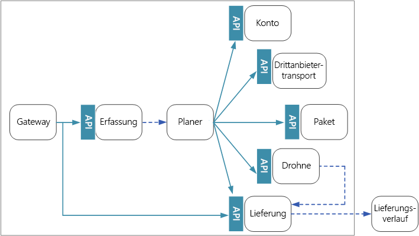
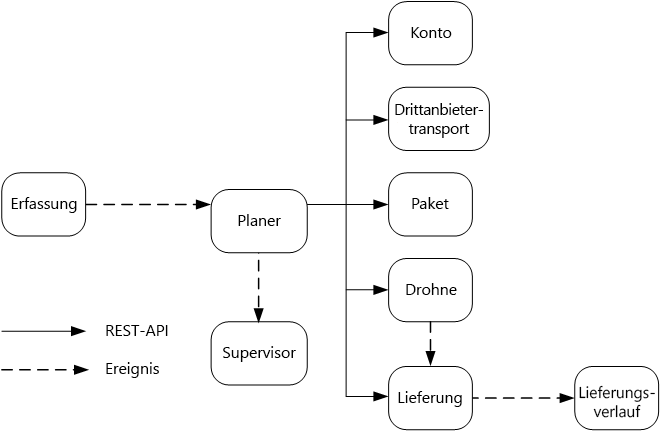

# Entwerfen von Microservices: Kommunikation zwischen Diensten

Die Kommunikation zwischen Microservices muss effizient und stabil sein. Wenn zahlreiche kompakte Dienste miteinander interagieren, um eine einzelne Transaktion abzuwickeln, kann sich das als Herausforderung erweisen. In diesem Kapitel gehen wir auf die Unterschiede zwischen asynchronem Messaging und synchronen APIs ein. Anschließend beschäftigen wir uns mit einigen Herausforderungen beim Entwerfen einer robusten Kommunikation zwischen Diensten, und Sie erfahren, welche Rolle ein Dienstnetz dabei spielen kann.

## Herausforderungen 

Im Anschluss finden Sie einige der größten Herausforderungen im Zusammenhang mit der Kommunikation zwischen Diensten. Viele dieser Herausforderungen lassen sich mit den weiter unten beschriebenen Dienstnetzen in den Griff bekommen.

**Resilienz:** Von einem Microservice können Dutzende oder sogar Hunderte von Instanzen vorhanden sein. Eine Instanz kann aus verschiedensten Gründen ausfallen. Ein Ausfall kann auf der Knotenebene auftreten – beispielsweise aufgrund eines Hardwarefehlers oder durch den Neustart eines virtuellen Computers. Es kann vorkommen, dass eine Instanz abstürzt oder die Menge an eingehenden Anforderungen nicht mehr bewältigen und somit keine neuen Anforderungen verarbeiten kann. Jedes dieser Ereignisse kann dazu führen, dass ein Netzwerkaufruf nicht erfolgreich ist. Es gibt zwei Entwurfsmuster, mit denen sich die Resilienz von Netzwerkaufrufen zwischen Diensten verbessern lässt:

- **[Wiederholung:](../patterns/retry.md)** Das Scheitern eines Netzwerkaufrufs kann eine vorübergehende Ursache haben, die sich von selbst erledigt. Der Aufrufer sollte den Vorgang daher mehrmals oder bis zum Erreichen eines Timeouts wiederholen, damit nicht sofort ein Fehler auftritt. Bei nicht idempotenten Vorgängen können Wiederholungen allerdings unerwünschte Nebenwirkungen haben. Es kann vorkommen, dass der ursprüngliche Aufruf erfolgreich ist, der Aufrufer aber keine Antwort erhält. Bei einer Wiederholung wird der Vorgang dann unter Umständen zweimal aufgerufen. Grundsätzlich ist die Wiederholung von POST- oder PATCH-Methoden unsicher, da sie nicht unbedingt idempotent sind.

- **[Trennschalter:](../patterns/circuit-breaker.md)** Zu viele erfolglose Anforderungen können zu einem Engpass führen, wenn sich ausstehende Anforderungen in der Warteschlange ansammeln. Diese blockierten Anforderungen können kritische Systemressourcen belegen, z.B. Arbeitsspeicher, Threads, Datenbankverbindungen usw., sodass es zu kaskadierenden Fehlern kommen kann. Mit einem Muster vom Typ „Trennschalter“ kann verhindert werden, dass ein Dienst wiederholt versucht, einen Vorgang mit geringen Erfolgsaussichten auszuführen. 

**Lastenausgleich:** Wenn Dienst „A“ Dienst „B“ aufruft, muss die Anforderung eine aktive Instanz von Dienst „B“ erreichen. In Kubernetes stellt der Ressourcentyp `Service` eine stabile IP-Adresse für eine Gruppe von Pods bereit. An die IP-Adresse des Diensts gesendeter Netzwerkdatenverkehr wird über iptable-Regeln an einen Pod weitergeleitet. Standardmäßig wird ein Pod nach dem Zufallsprinzip ausgewählt. Ein Dienstnetz (siehe weiter unten) bietet intelligentere Lastenausgleichsalgorithmen, die auf der ermittelten Wartezeit oder auf anderen Metriken basieren.

**Verteilte Ablaufverfolgung:** Eine einzelne Transaktion kann mehrere Dienste umfassen. Dies kann die Überwachung der Gesamtleistung und der Integrität des Systems erschweren. Selbst wenn jeder Dienst Protokolle und Metriken generiert, müssen diese irgendwie miteinander verknüpft werden, da sie sonst nur begrenzt hilfreich sind. Im Kapitel [Protokollierung und Überwachung](./logging-monitoring.md) finden Sie weitere Informationen zur verteilten Ablaufverfolgung, die hier der Vollständigkeit halber als Herausforderung erwähnt wird.

**Dienstversionsverwaltung:** Wenn ein Team eine neue Version eines Diensts bereitstellt, muss es darauf achten, dass dadurch keine anderen Dienste oder externen Clients beeinträchtigt werden, die von diesem Dienst abhängig sind. Darüber hinaus empfiehlt es sich unter Umständen, mehrere Versionen eines Diensts parallel auszuführen und Anforderungen an eine bestimmte Version weiterzuleiten. Weitere Informationen zu diesem Thema finden Sie unter [API-Versionsverwaltung](./api-design.md#api-versioning).

**TLS-Verschlüsselung und gegenseitige TLS-Authentifizierung:** Aus Sicherheitsgründen kann es sinnvoll sein, Datenverkehr zwischen Diensten mit TLS zu verschlüsseln und Aufrufer mittels gegenseitiger TLS-Authentifizierung zu authentifizieren.

## Gegenüberstellung von synchronem und asynchronem Messaging

Für die Kommunikation mit anderen Microservices stehen zwei grundlegende Messagingmuster zur Verfügung. 

1. Synchrone Kommunikation: Bei diesem Muster ruft ein Dienst unter Verwendung eines Protokolls wie HTTP oder gRPC eine von einem anderen Dienst verfügbar gemachte API auf. Diese Option ist ein synchrones Messagingmuster, da der Aufrufer auf eine Antwort des Empfängers wartet. 

2. Asynchrone Nachrichtenübergabe: Bei diesem Muster sendet ein Dienst eine Nachricht, ohne auf eine Antwort zu warten, und die Nachricht wird asynchron von einem oder mehreren Diensten verarbeitet.

Es ist wichtig, zwischen asynchronen E/A-Vorgängen und einem asynchronen Protokoll zu unterscheiden. Bei einem asynchronen E/A-Vorgang wird der aufrufende Thread während der Durchführung des E/A-Vorgangs nicht blockiert. Dies ist ein zwar wichtiger Leistungsaspekt, im Hinblick auf die Architektur aber ein Implementierungsdetail. Bei einem asynchronen Protokoll wartet der Absender nicht auf eine Antwort. HTTP ist ein synchrones Protokoll, beim Senden einer Anforderung kann ein HTTP-Client aber einen asynchronen E/A-Vorgang verwenden. 

Jedes Muster hat seine Vor- und Nachteile. Anforderung/Antwort ist ein leicht nachvollziehbares Muster, sodass das Entwerfen einer API möglicherweise natürlicher wirkt als das Entwerfen eines Messagingsystems. Asynchrones Messaging hat jedoch einige Vorteile, die insbesondere in einer Microservices-Architektur hilfreich sein können:

- **Geringere Kopplung:** Der Absender der Nachricht benötigt keine Informationen zum Consumer. 

- **Mehrere Abonnenten:** Bei Verwendung eines Pub/Sub-Modells können mehrere Consumer Ereignisse über ein Abonnement empfangen. Weitere Informationen finden Sie unter [Ereignisgesteuerter Architekturstil](/azure/architecture/guide/architecture-styles/event-driven).

- **Fehlerisolation:** Wenn ein Consumer ausfällt, kann der Absender weiterhin Nachrichten senden. Die Nachrichten werden abgeholt, wenn der Consumer wieder verfügbar ist. Dies ist besonders in einer Microservices-Architektur von Vorteil, da jeder Dienst einen eigenen Lebenszyklus hat. Ein Dienst kann jederzeit nicht mehr verfügbar sein oder durch eine neuere Version ersetzt werden. Bei asynchronem Messaging sind vorübergehende Ausfälle kein Problem. Bei synchronen APIs muss der Downstreamdienst hingegen verfügbar sein, da der Vorgang ansonsten nicht erfolgreich ist. 
 
- **Reaktionsfähigkeit:** Ein Upstreamdienst kann schneller antworten, wenn er nicht auf Downstreamdienste wartet. Dies ist besonders in einer Microservices-Architektur nützlich. Bei einer Kette von Dienstabhängigkeiten (Dienst A ruft Dienst B auf, der wiederum Dienst C aufruft, usw.) kann das Warten auf synchrone Aufrufe zu inakzeptablen Wartezeiten führen.

- **Belastungsausgleich:** Eine Warteschlange kann als Puffer für den Belastungsausgleich fungieren, sodass Empfänger Nachrichten jeweils mit ihrer eigenen Geschwindigkeit verarbeiten können. 

- **Workflows:** Ein Workflow kann mithilfe von Warteschlangen verwaltet werden, indem Sie die Nachricht nach jedem Workflowschritt mithilfe eines Prüfpunkts überprüfen.

Die effektive Verwendung von asynchronem Messaging ist jedoch auch mit gewissen Herausforderungen verbunden.

- **Kopplung an die Messaginginfrastruktur:** Die Verwendung einer bestimmten Messaginginfrastruktur kann eine enge Kopplung an diese Infrastruktur zur Folge haben. Dies erschwert ggf. den späteren Umstieg auf eine andere Messaginginfrastruktur.

- **Wartezeit:** Bei einem Vorgang kann es zu einer hohen End-to-End-Wartezeit kommen, wenn sich Nachrichten in den entsprechenden Warteschlangen ansammeln.  

- **Kosten:** Bei hohem Durchsatz können durch die Messaginginfrastruktur erhebliche Kosten entstehen.

- **Komplexität:** Der Umgang mit asynchronem Messaging ist keine leichte Aufgabe. So müssen Sie beispielsweise duplizierte Nachrichten behandeln – entweder mittels Deduplizierung oder durch Verwendung idempotenter Vorgänge. Auch ist es mit asynchronem Messaging nicht ganz einfach, eine Anforderung/Antwort-Semantik zu implementieren. Sie benötigen eine weitere Warteschlange zum Senden einer Antwort sowie eine Möglichkeit zum Korrelieren von Anforderungs- und Antwortnachrichten.

- **Durchsatz:** Wenn Nachrichten eine *Warteschlangensemantik* erfordern, kann sich die Warteschlange zu einem Engpass im System entwickeln. Für jede Nachricht ist mindestens ein Vorgang zum Hinzufügen in die Warteschlange und ein Vorgang zum Entfernen aus der Warteschlange erforderlich. Darüber hinaus wird für eine Warteschlangensemantik in der Regel eine Art von Sperre in der Messaginginfrastruktur benötigt. Wenn es sich bei der Warteschlange um einen verwalteten Dienst handelt, ist unter Umständen mit einer höheren Wartezeit zu rechnen, da sich die Warteschlange außerhalb des virtuellen Netzwerks des Clusters befindet. Als Gegenmaßnahme für diese Probleme können Sie Nachrichten zu Batches zusammenfassen. Dies macht den Code jedoch komplizierter. Wenn die Nachrichten keine Warteschlangensemantik erfordern, können Sie anstelle einer Warteschlange ggf. einen *Stream* für Ereignisse verwenden. Weitere Informationen finden Sie unter [Ereignisgesteuerter Architekturstil](../guide/architecture-styles/event-driven.md).  

## Drohnenlieferung: Auswählen des Messagingmusters

Auf der Grundlage dieser Überlegungen hat das Entwicklungsteam folgende Designentscheidungen für die Drohnenlieferungsangwendung getroffen:

- Der Dienst „Ingestion“ (Erfassung) macht eine öffentliche REST-API verfügbar, die von Clientanwendungen zum Planen, Aktualisieren oder Stornieren von Lieferungen verwendet wird.

- Der Erfassungsdienst verwendet Event Hubs, um asynchrone Nachrichten an den Dienst „Scheduler“ (Planung) zu senden. Asynchrone Nachrichten sind erforderlich, um den für die Erfassung benötigten Belastungsausgleich zu implementieren. Ausführliche Informationen zur Interaktion der Dienste „Ingestion“ und „Scheduler“ finden Sie unter [Erfassung und Workflow][ingestion-workflow].

- Die Dienste „Account“ (Konto), „Delivery“ (Lieferung), „Package“ (Paket), „Drone“ (Drohne) und „3rd Party Transport“ (Drittanbietertransport) machen jeweils interne REST-APIs verfügbar. Der Dienst „Scheduler“ ruft diese APIs auf, um eine Benutzeranforderung auszuführen. Für die Verwendung synchroner APIs spricht unter anderem, dass der Dienst „Scheduler“ auf eine Antwort der einzelnen Downstreamdienste angewiesen ist. Bei einem Fehler in einem der Downstreamdienste ist der gesamte Vorgang nicht erfolgreich. Das Aufrufen der Back-End-Dienste führt jedoch möglicherweise zu problematischen Wartezeiten. 

- Sollte für einen Downstreamdienst ein dauerhafter Fehler vorliegen, muss die gesamte Transaktion als nicht erfolgreich gekennzeichnet werden. In diesem Fall sendet der Dienst „Scheduler“ eine asynchrone Nachricht an den Supervisor, damit dieser kompensierende Transaktionen planen kann, wie im Kapitel [Erfassung und Workflow][ingestion-workflow] beschrieben.   

- Der Dienst „Delivery“ macht eine öffentliche API verfügbar, über die Clients den Status einer Lieferung abrufen können. Im Kapitel [API-Gateway](./gateway.md) erfahren Sie, wie ein API-Gateway die zugrunde liegenden Dienste vor dem Client verbergen kann, damit der Client nicht wissen muss, von welchen Diensten welche APIs verfügbar gemacht werden. 

- Wenn eine Drohne unterwegs ist, sendet der Dienst „Drone“ Ereignisse mit der aktuellen Position und dem Status der Drohne. Der Dienst „Delivery“ lauscht auf diese Ereignisse, um den Status einer Lieferung nachzuverfolgen.

- Bei einer Änderung des Lieferstatus sendet der Dienst „Delivery“ ein Lieferstatusereignis wie `DeliveryCreated` oder `DeliveryCompleted`. Diese Ereignisse können von jedem beliebigen Dienst abonniert werden. Im aktuellen Entwurf ist der Dienst „Delivery“ der einzige Abonnent, später können jedoch noch weitere Abonnenten hinzukommen. So können die Ereignisse beispielsweise an einen Echtzeitanalysedienst übermittelt werden. Da der Dienst „Scheduler“ nicht auf eine Antwort warten muss, hat das Hinzufügen weiterer Abonnenten keine Auswirkungen auf den Pfad des Hauptworkflows.

Beachten Sie, dass Lieferstatusereignisse von Drohnenpositionsereignissen abgeleitet werden. Wenn eine Drohne also beispielsweise einen Lieferort erreicht und ein Paket zustellt, übersetzt der Dienst „Delivery“ dies in ein DeliveryCompleted-Ereignis. Hierbei handelt es sich um ein Beispiel für domänenmodellorientiertes Denken. Die Drohnenverwaltung gehört, wie bereits beschrieben, zu einer separaten Kontextgrenze. Die Drohnenereignisse geben Aufschluss über die physische Position einer Drohne. Die Lieferereignisse stellen hingegen Änderungen beim Status einer Lieferung dar. Dabei handelt es sich um eine andere Geschäftseinheit.

## Verwenden eines Dienstnetzes

Ein *Dienstnetz* ist eine Softwareschicht für die Kommunikation zwischen Diensten. Dienstnetze ermöglichen die Behandlung vieler Probleme aus dem vorherigen Abschnitt und verlagern die Zuständigkeit für diese Probleme von den Microservices auf eine gemeinsame Schicht. Das Dienstnetz fungiert als Proxy, der die Netzwerkkommunikation zwischen Microservices im Cluster abfängt. 

> [!NOTE]
> Ein Dienstnetz ist ein Beispiel für das [Botschaftermuster](../patterns/ambassador.md) – ein Hilfsdienst, der Netzwerkanforderungen im Auftrag der Anwendung sendet. 

Als Dienstnetzoptionen stehen in Kubernetes momentan hauptsächlich [linkerd](https://linkerd.io/) und [Istio](https://istio.io/) zur Verfügung. Beide Technologien entwickeln sich rasant weiter. Als dieser Leitfaden erstellt wurde, war gerade die Istio-Version 0.2 aktuell. Es handelt sich also noch um eine sehr neue Technologie. Linkerd und Istio haben jedoch unter anderem folgende Features gemeinsam: 

- Lastenausgleich auf Sitzungsebene – basierend auf den ermittelten Wartezeiten oder der Anzahl ausstehender Anforderungen. Dies kann die Leistung über den von Kubernetes bereitgestellten Layer-4-Lastenausgleich verbessern. 

- Layer-7-Routing auf der Grundlage von URL-Pfad, Hostheader, API-Version oder anderen Regeln auf Anwendungsebene.

- Wiederholung nicht erfolgreicher Anforderungen. Ein Dienstnetz kann HTTP-Fehlercodes interpretieren und nicht erfolgreiche Anforderungen automatisch wiederholen. Sie können die maximal zulässige Anzahl von Wiederholungen sowie ein Zeitlimit konfigurieren, um die maximale Wartezeit einzugrenzen. 

- Verbindungsunterbrechung. Falls Anforderungen bei einer Instanz kontinuierlich fehlschlagen, wird die Instanz vorübergehend als nicht verfügbar gekennzeichnet. Nach einer Backoff-Zeit wird erneut versucht, die Instanz zu verwenden. Die Verbindungsunterbrechung kann auf der Grundlage verschiedener Kriterien (beispielsweise der Anzahl aufeinanderfolgender Fehler) konfiguriert werden.  

- Das Dienstnetz erfasst Metriken zu Aufrufen zwischen Diensten. Hierzu zählen beispielsweise das Anforderungsvolumen, die Wartezeit, Fehler- und Erfolgsraten sowie Antwortgrößen. Das Dienstnetz ermöglicht zudem eine verteilte Ablaufverfolgung durch Hinzufügen von Korrelationsinformationen für jeden Hop in einer Anforderung.

- Gegenseitige TLS-Authentifizierung für Aufrufe zwischen Diensten.

Benötigen Sie ein Dienstnetz? Der Zusatznutzen für verteilte Systeme ist sicherlich verlockend. Ohne Dienstnetz müssen Sie sich Gedanken über jede der weiter oben aufgeführten Herausforderungen machen. Probleme wie Wiederholung, Verbindungsunterbrechung und verteilte Ablaufverfolgung lassen sich zwar auch ohne Dienstnetz lösen, ein Dienstnetz verlagert diese Aspekte jedoch von den einzelnen Diensten auf eine dedizierte Schicht. Auf der anderen Seite handelt es sich bei Dienstnetzen um eine relativ neue Technologie, die sich immer noch in der Entwicklung befindet. Durch die Bereitstellung eines Dienstnetzes erhöht sich die Komplexität bei der Einrichtung und Konfiguration des Clusters. Unter Umständen wirkt sich die Bereitstellung auch auf die Leistung aus, da Anforderungen nun über den Dienstnetzproxy geleitet und auf jedem Knoten im Cluster zusätzliche Dienste ausgeführt werden. Führen Sie daher umfassende Leistungs- und Auslastungstests durch, bevor Sie ein Dienstnetz in der Produktionsumgebung bereitstellen.

> [!div class="nextstepaction"]
> [API-Design](./api-design.md)

<!-- links -->

[ingestion-workflow]: ./ingestion-workflow.md
