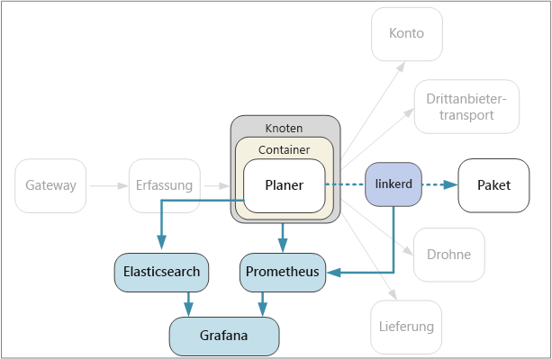

# <a name="designing-microservices-logging-and-monitoring"></a>Entwerfen von Microservices: Protokollieren und Überwachen

In jeder komplexen Anwendung geht irgendwann etwas schief. In einer Microserviceanwendung ist es erforderlich, dass Sie nachverfolgen, was für Dutzende oder sogar Hunderte von Diensten passiert. Die Protokollierung und die Überwachung sind von entscheidender Bedeutung, damit Sie sich einen ganzheitlichen Überblick über das System verschaffen können. 



In einer Microservices-Architektur kann es eine besondere Herausforderung darstellen, die genaue Ursache von Fehlern oder Leistungsengpässen zu ermitteln. Ein einzelner Benutzervorgang kann mehrere Dienste betreffen. Dienste können im Cluster an Netzwerk-E/A-Grenzen stoßen. Eine Kette von übergreifenden Aufrufen für Dienste kann im System zu Rückstaus und somit zu langen Wartezeiten oder kaskadierenden Fehlern führen. Außerdem wissen Sie im Allgemeinen nicht, auf welchem Knoten ein bestimmter Container ausgeführt wird. Container, die auf demselben Knoten angeordnet sind, konkurrieren ggf. um begrenzte CPU- oder Arbeitsspeicherkapazität. 

Damit ermittelt werden kann, was vor sich geht, muss die Anwendung Telemetrieereignisse ausgeben. Sie können für diese Ereignisse eine Kategorisierung in Metriken und textbasierte Protokolle vornehmen. 

*Metriken* sind numerische Werte, die analysiert werden können. Sie können sie verwenden, um das System in Echtzeit (bzw. nahezu in Echtzeit) zu beobachten oder Leistungstrends im Zeitverlauf zu analysieren. Beispiele für Metriken:

- Systemmetriken auf Knotenebene, z.B. Auslastung von CPU, Arbeitsspeicher, Netzwerk, Datenträger und Dateisystem. Systemmetriken fördern das Verständnis der Ressourcenzuteilung für die einzelnen Knoten im Cluster und ermöglichen die Problembehandlung bei Ausreißern.
 
- Kubernetes-Metriken: Da Dienste in Containern ausgeführt werden, müssen Sie Metriken nicht nur auf der VM-Ebene, sondern auch auf der Containerebene sammeln. In Kubernetes ist „cAdvisor“ (Container Advisor) der Agent, mit dem Statistiken zu CPU, Arbeitsspeicher, Dateisystem und Netzwerkressourcen jedes Containers gesammelt werden. Mit dem Kubelet-Daemon werden Ressourcenstatistiken von cAdvisor gesammelt und per REST-API verfügbar gemacht.
   
- Anwendungsmetriken: Hierzu gehören alle Metriken, die für das Verständnis des Verhaltens eines Diensts relevant sind. Beispiele hierfür sind die Anzahl von in die Warteschlange eingereihten eingehenden HTTP-Anforderungen, die Anforderungswartezeit, Länge der Nachrichtenwarteschlange oder Anzahl von verarbeiteten Transaktionen pro Sekunde.

- Metriken abhängiger Dienste: Dienste innerhalb des Clusters rufen ggf. externe Dienste auf, die sich außerhalb des Clusters befinden, z.B. verwaltete PaaS-Dienste. Sie können Azure-Dienste überwachen, indem Sie [Azure Monitor](/azure/monitoring-and-diagnostics/monitoring-overview) verwenden. Von Drittanbieterdiensten werden Metriken bereitgestellt oder auch nicht. Falls nicht, müssen Sie Ihre eigenen Anwendungsmetriken verwenden, um Statistiken in Bezug auf die Wartezeit und Fehlerrate nachzuverfolgen.

*Protokolle* sind Datensätze mit Ereignissen, die eintreten, während die Anwendung ausgeführt wird. Sie enthalten Dinge wie Anwendungsprotokolle (Überwachungsanweisungen) oder Webserverprotokolle. Protokolle sind hauptsächlich für forensische Zwecke und die Analyse der Grundursache hilfreich. 

## <a name="considerations"></a>Überlegungen

Im Artikel [Überwachung und Diagnose](../best-practices/monitoring.md) werden allgemeine Methoden zur Überwachung einer Anwendung beschrieben. Im Folgenden sind einige Aspekte aufgeführt, die im Zusammenhang mit einer Microservices-Architektur bedacht werden sollten.

**Konfiguration und Verwaltung**: Verwenden Sie einen verwalteten Dienst für die Protokollierung und Überwachung, oder stellen Sie Protokollierungs- und Überwachungskomponenten als Container im Cluster bereit? Eine nähere Beschreibung dieser Optionen finden Sie unten im Abschnitt [Technologieoptionen](#technology-options).

**Erfassungsrate**: Wie hoch ist der Durchsatz, mit dem das System Telemetrieereignisse erfassen kann? Was passiert, wenn diese Rate überschritten wird? Vom System können beispielsweise Clients gedrosselt werden, sodass Telemetriedaten verloren gehen, oder für die Daten kann das Downsampling durchgeführt werden. In einigen Fällen können Sie dieses Problem lösen, indem Sie die gesammelte Datenmenge reduzieren:

  - Aggregieren Sie Metriken, indem Sie Statistiken berechnen, z.B. die mittlere und die Standardabweichung, und diese statistischen Daten an das Überwachungssystem senden.  

  - Führen Sie für die Daten das Downsampling durch – verarbeiten Sie also nur einen bestimmten Prozentsatz der Daten.

  - Ordnen Sie die Daten in Batches an, um die Anzahl von Netzwerkaufrufen des Überwachungsdiensts zu reduzieren.

**Kosten**: Die Kosten für das Erfassen und Speichern von Telemetriedaten können, vor allem bei hohen Volumen, hoch sein. Manchmal kann dies sogar die Kosten für die Ausführung der Anwendung übersteigen. In diesem Fall müssen Sie das Telemetrievolumen unter Umständen verringern, indem Sie für die Daten wie oben beschrieben eine Aggregierung, das Downsampling oder die Anordnung in Batches durchführen. 
        
**Datengenauigkeit**: Wie genau sind die Metriken? Durchschnittswerte können Ausreißer überdecken, vor allem bei einem größeren Umfang. Wenn die Rate für die Stichprobenentnahme zu niedrig ist, kann dies zu einer Glättung von Fluktuationen in den Daten führen. Unter Umständen entsteht so der Eindruck, dass alle Anforderungen über die gleiche End-to-End-Wartezeit verfügen, während ein signifikanter Teil der Anforderungen tatsächlich deutlich mehr Zeit benötigt. 

**Wartezeit**: Zur Ermöglichung von Überwachung und Warnungen in Echtzeit sollten Telemetriedaten schnell verfügbar sein. Wie nah an der Echtzeit sind die Daten, die im Dashboard für die Überwachung angezeigt werden? Sind sie einige Sekunden alt? Mehr als eine Minute?

**Speicher**: Für Protokolle ist es ggf. am effizientesten, die Protokollereignisse im Cluster in flüchtigen Speicher zu schreiben und einen Agent zu konfigurieren, mit dem die Protokolldateien in beständigeren Speicher übertragen werden.  Daten sollten letztendlich in langfristigen Speicher verschoben werden, damit sie für retrospektive Analysen verfügbar sind. Da in einer Microservices-Architektur ein hohes Volumen von Telemetriedaten generiert werden kann, stellen die Kosten für die Speicherung dieser Daten einen wichtigen Aspekt dar. Berücksichtigen Sie auch, wie die Daten abgefragt werden sollen. 

**Dashboard und Visualisierung**: Können Sie sich einen ganzheitlichen Überblick über das System und alle Dienste verschaffen – sowohl im Cluster als auch für externe Dienste? Können im Dashboard alle Daten angezeigt und korreliert werden, wenn Sie Telemetriedaten und Protokolle an mehr als einem Speicherort schreiben? Im Dashboard für die Überwachung sollten mindestens die folgenden Informationen angezeigt werden:

- Allgemeine Ressourcenzuteilung in Bezug auf Kapazität und Wachstum. Dies umfasst die Zuteilung der Anzahl von Containern, der Dateisystemmetriken, des Netzwerks und der Kerne.
- Auf Dienstebene korrelierte Containermetriken
- Mit Containern korrelierte Systemmetriken
- Dienstfehler und Ausreißer
    

## <a name="distributed-tracing"></a>Verteilte Ablaufverfolgung

Wie bereits erwähnt, besteht bei Microservices eine Herausforderung darin, den Fluss der Ereignisse über Dienste hinweg zu verstehen. Ein einzelner Vorgang bzw. eine Transaktion kann Aufrufe mehrerer Dienste umfassen. Um die gesamte Schrittsequenz neu zu erstellen, sollte jeder Dienst eine *Korrelations-ID* verteilen, die als eindeutiger Bezeichner für diesen Vorgang dient. Die Korrelations-ID ermöglicht die [verteilte Ablaufverfolgung](http://microservices.io/patterns/observability/distributed-tracing.html) über Dienste hinweg.

Der erste Dienst, der eine Clientanforderung empfängt, sollte die Korrelations-ID generieren. Wenn der Dienst einen HTTP-Aufruf eines anderen Diensts durchführt, wird die Korrelations-ID in einem Anforderungsheader angeordnet. Entsprechend wird die Korrelations-ID in die Nachricht eingefügt, falls der Dienst eine asynchrone Nachricht sendet. Nachgeschaltete Dienste setzen die Verteilung der Korrelations-ID fort, sodass diese im gesamten System weitergegeben wird. Außerdem sollte der gesamte Code, mit dem Anwendungsmetriken oder Protokollereignisse geschrieben werden, die Korrelations-ID enthalten.

Wenn Dienstaufrufe korreliert werden, können Sie betriebsbezogene Metriken berechnen, z.B. die End-to-End-Wartezeit bis zum Abschluss einer Transaktion, die Anzahl von erfolgreichen Transaktionen pro Sekunde und den Prozentsatz fehlgeschlagener Transaktionen. Das Einfügen von Korrelations-IDs in Anwendungsprotokolle ermöglicht die Durchführung einer Analyse der Grundursache. Wenn ein Vorgang fehlschlägt, können Sie die Protokollanweisungen für alle Dienstaufrufe ermitteln, die Teil desselben Vorgangs waren. 

Hier sind einige Aspekte aufgeführt, die für die Implementierung der verteilten Ablaufverfolgung wichtig sind:

- Derzeit ist kein HTTP-Standardheader für Korrelations-IDs vorhanden. Ihr Team sollte standardmäßig einen benutzerdefinierten Headerwert verwenden. Treffen Sie die Wahl basierend auf Ihrem Framework für die Protokollierung bzw. Überwachung oder anhand Ihres Dienstnetzes.

- Falls Ihre Messaginginfrastruktur das Hinzufügen von Metadaten zu Nachrichten unterstützt, sollten Sie die Korrelations-ID für asynchrone Nachrichten in Form von Metadaten einbinden. Fügen Sie sie andernfalls als Teil des Nachrichtenschemas ein.

- Anstelle eines einzelnen Opaque-Bezeichners können Sie auch einen *Korrelationskontext* mit umfassenderen Informationen senden, z.B. Beziehungen zwischen Aufrufer und Aufgerufenem. 

- Mit dem Azure Application Insights-SDK wird automatisch Korrelationskontext in HTTP-Header und die Korrelations-ID in Application Insights-Protokolle eingefügt. Wenn Sie sich dafür entscheiden, die in Application Insights integrierten Korrelationsfeatures zu verwenden, müssen einige Dienste je nach den genutzten Bibliotheken die Korrelationsheader trotzdem noch explizit verteilen. Weitere Informationen finden Sie unter [Telemetriekorrelation in Application Insights](/azure/application-insights/application-insights-correlation).
   
- Wenn Sie Istio oder linkerd als Dienstnetz verwenden, generieren diese Technologien automatisch Korrelationsheader, wenn HTTP-Aufrufe über die Dienstnetzproxys weitergeleitet werden. Von den Diensten sollten jeweils die relevanten Header weitergeleitet werden. 

    - Istio: [Distributed Request Tracing](https://istio-releases.github.io/v0.1/docs/tasks/zipkin-tracing.html) (Verteilte Ablaufverfolgung von Anforderungen)
    
    - linkerd: [Context Headers](https://linkerd.io/config/1.3.0/linkerd/index.html#http-headers) (Kontextheader)
    
- Überlegen Sie sich, wie Protokolle aggregiert werden sollen. Es kann ratsam sein, die Vorgehensweise beim Einbinden von Korrelations-IDs in Protokolle für alle Teams zu standardisieren. Verwenden Sie ein strukturiertes oder halbstrukturiertes Format, z.B. JSON, und definieren Sie ein gemeinsames Feld für die Korrelations-ID.

## <a name="technology-options"></a>Technologieoptionen

**Application Insights** ist ein verwalteter Dienst in Azure, mit dem Telemetriedaten erfasst und gespeichert und Tools zum Analysieren von und Suchen nach Daten bereitgestellt werden. Für die Nutzung von Application Insights installieren Sie in Ihrer Anwendung ein Instrumentierungspaket. Dieses Paket überwacht die App und sendet Telemetriedaten an den Application Insights-Dienst. Außerdem können hiermit per Pullvorgang Telemetriedaten aus der Hostumgebung abgerufen werden. Application Insights verfügt über eine integrierte Korrelations- und Abhängigkeitsnachverfolgung. Sie können Systemmetriken, Anwendungsmetriken und Azure-Dienstmetriken zentral an einem Ort nachverfolgen.

Beachten Sie, dass Application Insights gedrosselt wird, wenn die Datenrate einen bestimmten Höchstwert überschreitet. Ausführliche Informationen hierzu finden Sie unter [Application Insights-Grenzwerte](/azure/azure-subscription-service-limits#application-insights-limits). Ein einzelner Vorgang kann mehrere Telemetrieereignisse generieren, sodass die Anwendung wahrscheinlich gedrosselt wird, wenn die Menge an Datenverkehr sehr hoch ist. Zur Lösung dieses Problems können Sie den Telemetriedatenverkehr durch die Erstellung von Stichproben reduzieren. Der Nachteil hierbei ist, dass Ihre Metriken weniger genau sind. Weitere Informationen finden Sie unter [Erstellen von Stichproben in Application Insights](/azure/application-insights/app-insights-sampling). Sie können das Datenvolumen auch reduzieren, indem Sie Metriken vorab aggregieren. Hierzu berechnen Sie statistische Werte, z.B. die mittlere und die Standardabweichung, und senden diese Werte anstelle der Telemetrie-Rohdaten. Im folgenden Blogbeitrag wird ein Ansatz für die bedarfsabhängige Nutzung von Application Insights beschrieben: [Azure Monitoring and Analytics at Scale](https://blogs.msdn.microsoft.com/azurecat/2017/05/11/azure-monitoring-and-analytics-at-scale/) (Bedarfsabhängige Nutzung der Azure-Überwachung und von Analytics).

Stellen Sie außerdem sicher, dass Sie das Preismodell für Application Insights verstehen, da die Gebühren basierend auf dem Datenvolumen berechnet werden. Weitere Informationen finden Sie unter [Verwalten von Preisen und Datenvolumen in Application Insights](/azure/application-insights/app-insights-pricing). Falls Ihre Anwendung eine große Menge an Telemetriedaten generiert und Sie keine Stichprobenentnahme oder Aggregation der Daten durchführen möchten, ist Application Insights unter Umständen nicht die richtige Wahl. 

Hier sind einige Vorschläge für Ansätze mit beliebten Open-Source-Technologien aufgeführt, falls Application Insights Ihre Anforderungen nicht erfüllt.

Für System- und Containermetriken könne Sie erwägen, die Metriken in eine Zeitreihen-Datenbank zu exportieren, z.B. **Prometheus** oder **InfluxDB**, die im Cluster ausgeführt wird.

- InfluxDB ist ein Push-basiertes System. Die Metriken müssen von einem Agent per Pushvorgang übertragen werden. Sie können den Dienst [Heapster][heapster] nutzen, bei dem im gesamten Cluster Metriken von Kubelet gesammelt und die Daten aggregiert und per Pushvorgang an InfluxDB oder andere Zeitreihen-Speicherlösungen übertragen werden. Von Azure Container Service wird Heapster im Rahmen des Clustersetups bereitgestellt. Eine weitere Option ist [Telegraf](https://www.influxdata.com/time-series-platform/telegraf/), wobei es sich um einen Agent zu Sammeln und Melden von Metriken handelt. 

- Prometheus ist ein Pull-basiertes System. Hierbei werden Metriken per „Scraping“ regelmäßig von konfigurierten Speicherorten abgerufen. Mit Prometheus können Metriken abgerufen werden, die mit cAdvisor oder kube-state-metrics generiert werden. [kube-state-metrics][kube-state-metrics] ist ein Dienst, mit dem Metriken vom Kubernetes-API-Server gesammelt und für Prometheus (oder einen Scraper, der mit einem Prometheus-Clientendpunkt kompatibel ist) zur Verfügung gestellt werden. Während mit Heapster von Kubernetes generierte Metriken aggregiert und an eine Senke weitergeleitet werden, erstellt kube-state-metrics seine eigenen Metriken und stellt sie über einen Endpunkt für das Scraping bereit. Verwenden Sie für Systemmetriken den [Node Exporter](https://github.com/prometheus/node_exporter). Dies ist ein Prometheus-Exportprogramm für Systemmetriken. Prometheus unterstützt Gleitkommadaten, aber keine Zeichenfolgendaten, und ist daher nicht für Protokolle geeignet, sondern nur für Systemmetriken.

- Nutzen Sie ein Dashboardtool wie **Kibana** oder **Grafana**, um die Daten zu visualisieren und zu überwachen. Der Dashboarddienst kann auch in einem Container im Cluster ausgeführt werden.

Erwägen Sie für Anwendungsprotokolle die Verwendung von **Fluentd** und **Elasticsearch**. Fluentd ist ein Open-Source-Datensammler, und Elasticsearch ist eine Dokumentdatenbank, die für den Einsatz als Suchmodul optimiert ist. Bei dieser Vorgehensweise sendet jeder Dienst Protokolle an `stdout` und `stderr`, und Kubernetes schreibt diese Datenströme in das lokale Dateisystem. Fluentd sammelt die Protokolle, erweitert sie optional um zusätzliche Metadaten aus Kubernetes und sendet die Protokolle an Elasticsearch. Verwenden Sie Kibana, Grafana oder ein ähnliches Tool, um ein Dashboard für Elasticsearch zu erstellen. Fluentd wird als Daemonset im Cluster ausgeführt, um sicherzustellen, dass jedem Knoten ein Fluentd-Pod zugewiesen ist. Sie können Fluentd so konfigurieren, dass sowohl Kubelet-Protokolle als auch Containerprotokolle gesammelt werden. Bei hohen Volumen kann das Schreiben von Protokollen in das lokale Dateisystem zu einem Leistungsengpass führen. Dies gilt vor allem, wenn mehrere Dienste auf demselben Knoten ausgeführt werden. Überwachen Sie die Datenträgerwartezeit und Dateisystemauslastung in der Produktion.

Ein Vorteil bei Verwendung von Fluentd mit Elasticsearch für Protokolle besteht darin, dass für Dienste keine zusätzlichen Bibliotheksabhängigkeiten erforderlich sind. Jeder Dienst schreibt nur in `stdout` und `stderr`, und Fluentd übernimmt den Export der Protokolle in Elasticsearch. Außerdem müssen sich die Teams, die die Dienste schreiben, nicht mit dem Konfigurieren der Protokollierungsinfrastruktur auskennen. Eine Herausforderung besteht darin, den Elasticsearch-Cluster für eine Produktionsbereitstellung so zu konfigurieren, dass er für die Verarbeitung Ihres Datenverkehrs skaliert werden kann. 

Eine andere Möglichkeit ist das Senden von Protokollen an Operations Management Suite (OMS) Log Analytics. Der [Log Analytics][log-analytics]-Dienst sammelt Protokolldaten in einem zentralen Repository und kann außerdem Daten anderer Azure-Dienste zusammenfassen, die von Ihrer Anwendung verwendet werden. Weitere Informationen finden Sie unter [Überwachen eines Azure Container Service-Clusters mit Microsoft Operations Management Suite (OMS)][k8s-to-oms].

## <a name="example-logging-with-correlation-ids"></a>Beispiel: Protokollierung mit Korrelations-IDs

Hier ist ein erweitertes Beispiel dafür angegeben, wie die Protokollierung vom Paketdienst implementiert wird, um einige in diesem Kapitel beschriebene Punkte zu verdeutlichen. Der Paketdienst wurde in TypeScript geschrieben und nutzt das [Koa](http://koajs.com/)-Webframework für Node.js. Sie können zwischen mehreren Node.js-Protokollierungsbibliotheken wählen. Wir haben uns für [Winston](https://github.com/winstonjs/winston) entschieden. Dies ist eine beliebte Protokollierungsbibliothek, die beim Testen unsere Leistungsanforderungen erfüllt hat.

Zum Kapseln der Implementierungsdetails haben wir eine abstrakte `ILogger`-Schnittstelle definiert:

```ts
export interface ILogger {
    log(level: string, msg: string, meta?: any)
    debug(msg: string, meta?: any)
    info(msg: string, meta?: any)
    warn(msg: string, meta?: any)
    error(msg: string, meta?: any)
}
```

Hier ist eine `ILogger`-Implementierung angegeben, bei der die Winston-Bibliothek eingeschlossen wird. Die Korrelations-ID wird als Konstruktorparameter verwendet und in jede Protokollnachricht eingefügt. 

```ts
class WinstonLogger implements ILogger {
    constructor(private correlationId: string) {}
    log(level: string, msg: string, payload?: any) {
        var meta : any = {};
        if (payload) { meta.payload = payload };
        if (this.correlationId) { meta.correlationId = this.correlationId }
        winston.log(level, msg, meta)
    }
  
    info(msg: string, payload?: any) {
        this.log('info', msg, payload);
    }
    debug(msg: string, payload?: any) {
        this.log('debug', msg, payload);
    }
    warn(msg: string, payload?: any) {
        this.log('warn', msg, payload);
    }
    error(msg: string, payload?: any) {
        this.log('error', msg, payload);
    }
}
```

Der Paketdienst muss die Korrelations-ID aus der HTTP-Anforderung extrahieren. Wenn Sie linkerd nutzen, befindet sich die Korrelations-ID beispielsweise im `l5d-ctx-trace`-Header. In Koa wird die HTTP-Anforderung in einem Context-Objekt gespeichert, das über die Pipeline für die Anforderungsverarbeitung übergeben wird. Wir können eine Middleware-Funktion definieren, um die Korrelations-ID aus dem Context-Objekt abzurufen und die Protokollierung zu initialisieren. (Eine Middleware-Funktion in Koa ist lediglich eine Funktion, die für jede Anforderung ausgeführt wird.)

```ts
export type CorrelationIdFn = (ctx: Context) => string;

export function logger(level: string, getCorrelationId: CorrelationIdFn) {
    winston.configure({ 
        level: level,
        transports: [new (winston.transports.Console)()]
        });
    return async function(ctx: any, next: any) {
        ctx.state.logger = new WinstonLogger(getCorrelationId(ctx));
        await next();
    }
}
```

Über diese Middleware wird eine vom Aufrufer definierte Funktion (`getCorrelationId`) aufgerufen, um die Korrelations-ID abzurufen. Anschließend wird eine Instanz der Protokollierung erstellt und in `ctx.state` dafür dann ein Stash ausgeführt. Dies ist ein Schlüssel-Wert-Wörterbuch, das in Koa zum Übergeben von Informationen über die Pipeline verwendet wird. 

Die Middleware der Protokollierung wird der Pipeline beim Starten hinzugefügt:

```ts
app.use(logger(Settings.logLevel(), function (ctx) {
    return ctx.headers[Settings.correlationHeader()];  
}));
```

Nachdem alles konfiguriert wurde, ist das Hinzufügen von Protokollierungsanweisungen zum Code ein einfacher Vorgang. Hier ist beispielsweise die Methode angegeben, mit der nach einem Paket gesucht wird. Es werden zwei Aufrufe der `ILogger.info`-Methode durchgeführt.

```ts
async getById(ctx: any, next: any) {
  var logger : ILogger = ctx.state.logger;
  var packageId = ctx.params.packageId;
  logger.info('Entering getById, packageId = %s', packageId);

  await next();

  let pkg = await this.repository.findPackage(ctx.params.packageId)

  if (pkg == null) {
    logger.info(`getById: %s not found`, packageId);
    ctx.response.status= 404;
    return;
  }

  ctx.response.status = 200;
  ctx.response.body = this.mapPackageDbToApi(pkg);
}
```

Es ist nicht erforderlich, die Korrelations-ID in die Protokollierungsanweisungen einzufügen, da dies automatisch von der Middleware-Funktion durchgeführt wird. So ist der Code für die Protokollierung weniger komplex, und es ist weniger wahrscheinlich, dass ein Entwickler das Einfügen der Korrelations-ID vergisst. Und da für alle Protokollierungsanweisungen die abstrakte `ILogger`-Schnittstelle verwendet wird, ist es einfach, die Implementierung der Protokollierung zu einem späteren Zeitpunkt auszutauschen.

> [!div class="nextstepaction"]
> [Continuous Integration und Continuous Delivery](./ci-cd.md)

<!-- links -->

[app-insights]: /azure/application-insights/app-insights-overview
[heapster]: https://github.com/kubernetes/heapster
[kube-state-metrics]: https://github.com/kubernetes/kube-state-metrics
[k8s-to-oms]: /azure/container-service/kubernetes/container-service-kubernetes-oms
[log-analytics]: /azure/log-analytics/