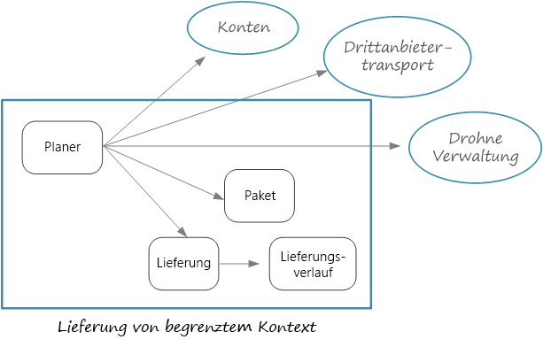
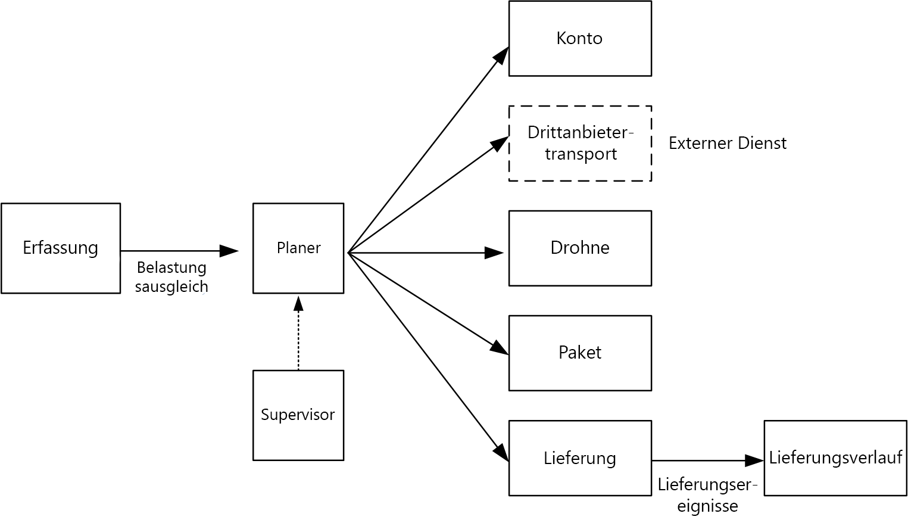

# Entwerfen von Microservices: Identifizieren von Microservice-Grenzen

Was ist die richtige Größe für einen Microservice? Diese Frage wird häufig mit „nicht zu groß und nicht zu klein“ beantwortet. Das ist zwar richtig, aber nicht sonderlich hilfreich. Auf der Grundlage eines sorgfältig entworfenen Domänenmodells lassen sich Microservices viel leichter besprechen.

## Vom Domänenmodell zu Microservices

Im [vorherigen Kapitel](./domain-analysis.md) haben wir eine Reihe von Kontextgrenzen für die Drohnenlieferungsanwendung definiert. Anschließend haben wir uns eingehender mit einer dieser Kontextgrenzen (dem Versandkontext) befasst und eine Reihe von Entitäten, Aggregaten und Domänendiensten für diese Kontextgrenze identifiziert.

Nun sind wir bereit für den Schritt vom Domänenmodell zum Anwendungsentwurf. Mit dem folgenden Ansatz können Sie Microservices vom Domänenmodell ableiten.

1. Beginnen Sie mit einer Kontextgrenze. Grundsätzlich sollte die Funktion in einem Microservice nicht mehrere Kontextgrenzen umfassen. Eine Kontextgrenze markiert definitionsgemäß die Grenze eines bestimmten Domänenmodells. Falls ein Microservice verschiedene Domänenmodelle miteinander vermischt, sollten Sie ggf. wieder zur Domänenanalyse zurückkehren und diese optimieren.

2. Betrachten Sie als Nächstes die Aggregate in Ihrem Domänenmodell. Aggregate sind häufig gute Kandidaten für Microservices. Ein sorgfältig entworfenes Aggregat weist viele Merkmale eines sorgfältig entworfenen Microservice auf:

    - Einem Aggregat liegen geschäftliche Anforderungen zugrunde, keine technischen Aspekte wie Datenzugriff oder Messaging.  
    - Ein Aggregat sollte über eine hohe funktionale Kohäsion verfügen.
    - Ein Aggregat ist eine Persistenzgrenze.
    - Aggregate sollten lose gekoppelt sein. 
    
3. Auch Domänendienste sind gute Kandidaten für Microservices. Domänendienste sind zustandslose, aggregatübergreifende Vorgänge. Ein typisches Beispiel ist ein Workflow, der mehrere Microservices umfasst. Die Drohnenlieferungsanwendung enthält ein entsprechendes Beispiel.

4. Berücksichtigen Sie außerdem nicht funktionsbezogene Anforderungen. Betrachten Sie Faktoren wie Teamgröße, Datentypen und Technologien sowie Skalierbarkeits-, Verfügbarkeits- und Sicherheitsanforderungen. Auf der Grundlage dieser Faktoren können Sie einen Microservice ggf. in mehrere kompaktere Dienste aufspalten oder aber mehrere Microservices zu einem einzelnen Dienst zusammenfassen. 

Nachdem Sie die Microservices in Ihrer Anwendung identifiziert haben, überprüfen Sie Ihren Entwurf anhand folgender Kriterien:

- Jeder Dienst hat eine einzelne Aufgabe.
- Zwischen Diensten findet keine übermäßige Kommunikation statt. Falls die Aufspaltung von Funktionen in zwei Dienste zu übermäßiger Kommunikation zwischen den Diensten führt, kann dies ein Indiz dafür sein, dass die Funktionen in einen einzelnen Dienst gehören.
- Jeder Dienst ist so kompakt, dass er von einem kleinen unabhängigen Team erstellt werden kann.
- Es bestehen keine gegenseitigen Abhängigkeiten, die eine Abstimmung bei der Bereitstellung mehrerer Dienste erforderlich machen. Die Bereitstellung eines Diensts muss immer ohne erneute Bereitstellung anderer Dienste möglich sein.
- Dienste sind nicht eng gekoppelt und können unabhängig voneinander weiterentwickelt werden.
- Ihre Dienstgrenzen führen nicht zu Problemen mit der Datenkonsistenz oder -integrität. Manchmal ist es wichtig, die Datenkonsistenz zu wahren, indem Funktionen in einem einzelnen Microservice platziert werden. Nichtsdestotrotz sollten Sie sich überlegen, ob Sie wirklich eine starke Konsistenz benötigt. Es gibt Strategien für die Implementierung von letztlicher Konsistenz in einem verteilten System, und die Vorteile einer Zerlegung der Dienste überwiegen häufig die Herausforderungen der Verwendung von letztlicher Konsistenz.

Am wichtigsten ist jedoch: Seien Sie pragmatisch, und denken Sie daran, dass DDD (Domain-Driven Design) ein iterativer Prozess ist. Beginnen Sie im Zweifelsfall mit undifferenzierteren Microservices. Die Aufspaltung eines Microservice in zwei kompaktere Dienste ist einfacher als ein Refactoring mehrerer vorhandener Microservices.
  
## Drohnenlieferung: Definieren der Microservices

Das Entwicklungsteam hatte ja die vier Aggregate „Delivery“ (Lieferung), „Package“ (Paket), „Drone“ (Drohne) und „Account“ (Konto) sowie die beiden Domänendienste „Scheduler“ (Planung) und „Supervisor“ identifiziert. 

„Delivery“ und „Package“ sind offensichtliche Kandidaten für Microservices. „Scheduler“ und „Supervisor“ koordinieren die Aktivitäten anderer Microservices, weshalb es sinnvoll ist, diese Domänendienste als Microservices zu implementieren.  

„Drone“ und „Account“ sind interessant, da sie zu anderen Kontextgrenzen gehören. Eine Möglichkeit wäre, dass „Scheduler“ die Kontextgrenzen „Drone“ und „Account“ direkt aufruft. Eine andere Möglichkeit besteht darin, die Microservices „Drone“ und „Account“ innerhalb der Kontextgrenze „Shipping“ (Versand) zu erstellen. Diese Microservices würden dann als Vermittler zwischen den Kontextgrenzen fungieren, indem sie APIs oder Datenschemas verfügbar machen, die besser für den Versandkontext geeignet sind.

Da wir in diesem Leitfaden nicht weiter auf die Details der Kontextgrenzen „Drone“ und „Account“ eingehen, haben wir in unserer Referenzimplementierung entsprechende Pseudodienste erstellt. Hier sind jedoch einige Faktoren, die Sie in dieser Situation berücksichtigen sollten:

- Wie hoch ist der zusätzliche Netzwerkaufwand, der durch direkte Aufrufe an die andere Kontextgrenze entsteht? 

- Eignet sich das Datenschema der anderen Kontextgrenze für diesen Kontext, oder ist es besser, ein Schema zu verwenden, das speziell auf diese Kontextgrenze zugeschnitten ist? 

- Handelt es sich bei der anderen Kontextgrenze um ein Legacysystem? In diesem Fall können Sie einen Dienst erstellen, der als [Antibeschädigungsebene](../patterns/anti-corruption-layer.md) fungiert und zwischen dem Legacysystem und der modernen Anwendung vermittelt. 

- Welche Teamstruktur wird verwendet? Kann problemlos mit dem Team kommuniziert werden, das für die andere Kontextgrenze zuständig ist? Falls nicht, kann es hilfreich sein, einen Dienst als Vermittler zwischen den beiden Kontexten zu erstellen, um die Kosten für die teamübergreifende Kommunikation zu senken.

Bislang haben wir noch keine nicht funktionsbezogenen Anforderungen berücksichtigt. Angesichts der Durchsatzanforderungen der Anwendung hat das Entwicklungsteam beschlossen, einen separaten Microservice namens „Ingestion“ (Erfassung) zu erstellen, der für die Erfassung von Clientanforderungen zuständig ist. Dieser Microservice implementiert einen [Belastungsausgleich](../patterns/queue-based-load-leveling.md), indem er eingehende Anforderungen zur Verarbeitung in einem Puffer platziert. „Scheduler“ liest die Anforderungen aus dem Puffer und führt den Workflow aus. 

Nicht funktionsbezogene Anforderungen haben das Team zur Erstellung eines zusätzlichen Diensts veranlasst. Bislang ging es bei allen Diensten um die Zeitplanung und Auslieferung von Paketen in Echtzeit. Für die Datenanalyse muss das System jedoch auch den Verlauf jeder Lieferung in einem langfristigen Speicher speichern. Das Team hat erwogen, diese Funktion dem Dienst „Delivery“ zuzuordnen. Die Datenspeicheranforderungen für die Analyse von Verlaufsdaten unterscheiden sich jedoch deutlich von den Anforderungen für laufende Vorgänge. (Weitere Informationen finden Sie unter [Überlegungen zu Daten](./data-considerations.md)). Aus diesem Grund hat sich das Team dazu entschieden, einen separaten Dienst namens „Delivery History“ (Lieferverlauf) zu erstellen, der auf DeliveryTracking-Ereignisse des Diensts „Delivery“ lauscht und die Ereignisse in einen langfristigen Speicher schreibt.

Das folgende Diagramm zeigt den aktuellen Stand des Designs:
 

## Wählen einer Computeoption

Der Begriff *Compute* bezieht sich auf das Hostingmodell für die Computeressourcen, auf denen Ihre Anwendung ausgeführt wird. Bei einer Microservices-Architektur werden bevorzugt die beiden folgenden Ansätze verwendet:

- Ein Dienstorchestrator, der Dienste auf dedizierten Knoten (virtuellen Computern) verwaltet
- Eine serverlose Architektur mit Funktionen als Dienst (Functions-as-a-Service, FaaS) 

Dies sind zwar nicht die einzigen Optionen, sie haben sich aber bei der Erstellung von Microservices bewährt. Eine Anwendung kann beide Ansätze umfassen.

### Dienstorchestratoren

Ein Orchestrator bewältigt Aufgaben im Zusammenhang mit der Bereitstellung und Verwaltung einer Gruppe von Diensten. Diese Aufgaben umfassen das Platzieren von Diensten auf Knoten, das Überwachen der Integrität von Diensten, das Neustarten fehlerhafter Dienste, das Durchführen eines Lastenausgleichs für den Netzwerkdatenverkehr der Dienstinstanzen, das Ermitteln von Diensten, das Skalieren der Anzahl von Dienstinstanzen sowie das Anwenden von Konfigurationsaktualisierungen. Beliebte Orchestratoren sind Kubernetes, DC/OS, Docker Swarm und Service Fabric. 

- [Azure Container Service](/azure/container-service/) (ACS) ist ein Azure-Dienst, mit dem Sie schnell einen produktionsbereiten Kubernetes-, DC/OS- oder Docker Swarm-Cluster bereitstellen können.

- [AKS (Azure Container Service)](/azure/aks/) ist ein verwalteter Kubernetes-Dienst. AKS stellt Kubernetes bereit und macht die Kubernetes-API-Endpunkte verfügbar, hostet und verwaltet aber die Kubernetes-Steuerungsebene und führt somit automatisch Upgrade-, Patch- und andere Verwaltungsaufgaben durch. AKS können Sie sich als „Kubernetes-APIs als Dienst“ vorstellen. Zum Zeitpunkt der Erstellung dieses Artikels befindet sich AKS noch in der Vorschauphase. Es ist allerdings davon auszugehen, dass sich AKS zur bevorzugten Methode für die Verwendung von Kubernetes in Azure entwickelt. 

- [Service Fabric](/azure/service-fabric/) ist eine Plattform für verteilte Systeme, mit der Microservices gepackt, bereitgestellt und verwaltet werden können. Microservices können in Service Fabric als Container, als binäre ausführbare Dateien oder als [Reliable Services](/azure/service-fabric/service-fabric-reliable-services-introduction) bereitgestellt werden. Mit dem Reliable Services-Programmiermodell können Dienste direkt über Service Fabric-APIs das System abfragen, die Integrität melden, Benachrichtigungen zu Konfigurations- und Codeänderungen empfangen sowie andere Dienste ermitteln. Ein zentraler Unterschied von Service Fabric ist der starke Fokus auf die Erstellung zustandsbehafteter Dienste mit [Reliable Collections](/azure/service-fabric/service-fabric-reliable-services-reliable-collections).

### Container

Container und Microservices werden gelegentlich in einen Topf geworfen. Das ist allerdings nicht angebracht: Für die Erstellung von Microservices werden keine Container benötigt. Container bieten jedoch einige Vorteile, die besonders für Microservices relevant sind:

- **Übertragbarkeit:** Ein Containerimage ist ein eigenständiges Paket, für dessen Ausführung weder Bibliotheken noch andere Abhängigkeiten installiert werden müssen. Dadurch lassen sie sich ganz einfach bereitstellen. Container können schnell gestartet und beendet werden, um bei Knotenausfällen oder zur Bewältigung einer höheren Last neue Instanzen zu aktivieren. 

- **Dichte:** Im Vergleich zur Ausführung eines virtuellen Computers weisen Container eine geringere Dichte auf, da sie Betriebssystemressourcen gemeinsam nutzen. Dadurch können sich mehrere Container auf einem einzelnen Knoten befinden, was besonders hilfreich ist, wenn sich die Anwendung aus vielen kompakten Diensten zusammensetzt.

- **Ressourcenisolierung:** Sie können die verfügbare Arbeitsspeicher- und CPU-Kapazität für einen Container einschränken, um zu verhindern, dass ein außer Kontrolle geratener Prozess sämtliche Hostressourcen beansprucht. Weitere Informationen finden Sie unter [Bulkhead-Muster](../patterns/bulkhead.md).

### Serverlos (Funktionen als Dienst)

Bei einer serverlosen Architektur verwalten Sie nicht die virtuellen Computer oder die virtuelle Netzwerkinfrastruktur. Stattdessen stellen Sie Code bereit, der dann durch den Hostingdienst auf einem virtuellen Computer platziert und ausgeführt wird. Dieser Ansatz bevorzugt eher kompakte, präzise Funktionen, die mithilfe ereignisbasierter Trigger koordiniert werden. So kann beispielsweise eine Nachricht, die in einer Warteschlange platziert wird, eine Funktion auslösen, die die Nachricht aus der Warteschlange liest und sie verarbeitet.

[Azure Functions][functions] ist ein serverloser Computedienst, der verschiedenen Funktionstrigger wie etwa HTTP-Anforderungen, Service Bus-Warteschlangen und Event Hubs-Ereignisse unterstützt. Eine vollständige Liste finden Sie unter [Konzepte für Azure Functions-Trigger und -Bindungen][functions-triggers]. Erwägen Sie außerdem die Verwendung von [Azure Event Grid][event-grid] – ein verwalteter Ereignisroutingdienst in Azure.

### Orchestrator oder serverlos?

Im Anschluss finden Sie einige Faktoren, die Sie bei der Wahl eines Orchestratoransatzes oder eines serverlosen Ansatzes berücksichtigen sollten.

**Verwaltbarkeit:** Eine serverlose Anwendung lässt sich einfach verwalten, da Ihnen die Plattform die Verwaltung sämtlicher Computeressourcen abnimmt. Ein Orchestrator abstrahiert zwar einige Aspekte der Clusterverwaltung und -konfiguration, kann die zugrunde liegenden virtuellen Computer jedoch nicht vollständig verbergen. Bei Verwendung eines Orchestrators müssen Sie sich mit Aspekten wie Lastenausgleich, CPU-/Arbeitsspeicherauslastung und Netzwerk auseinandersetzen.

**Flexibilität und Steuerung:** Ein Orchestrator bietet umfangreiche Steuerungsmöglichkeiten für die Konfiguration und Verwaltung Ihrer Dienste und des Clusters. Dafür müssen Sie jedoch eine höhere Komplexität in Kauf nehmen. Bei einer serverlosen Architektur geben Sie ein gewisses Maß an Kontrolle auf, da diese Details abstrahiert werden.

**Übertragbarkeit:** Alle hier aufgeführten Orchestratoren (Kubernetes, DC/OS, Docker Swarm und Service Fabric) können lokal oder in mehreren öffentlichen Clouds ausgeführt werden. 

**Anwendungsintegration:** Die Erstellung einer komplexen Anwendung mit einer serverlosen Architektur ist unter Umständen nicht ganz einfach. Eine Option in Azure ist die Koordinierung einer Gruppe von Azure-Funktionen mit [Azure Logic Apps](/azure/logic-apps/). Ein Beispiel für diese Methode finden Sie unter [Erstellen einer Funktion, die in Azure Logic Apps integriert ist](/azure/azure-functions/functions-twitter-email.).

**Kosten:** Bei Verwendung eines Orchestrators bezahlen Sie für die virtuellen Computer, die im Cluster ausgeführt werden. Bei einer serverlosen Anwendung bezahlen Sie nur für die tatsächlich genutzten Serverressourcen. In beiden Fällen müssen Sie die Kosten für zusätzliche Dienste wie Speicher, Datenbanken und Messaging berücksichtigen.

**Skalierbarkeit:** Azure Functions wird auf der Grundlage der Anzahl eingehender Ereignisse automatisch nach Bedarf skaliert. Bei Verwendung eines Orchestrators können Sie horizontal hochskalieren, indem Sie die Anzahl der im Cluster ausgeführten Dienstinstanzen erhöhen. Darüber hinaus können Sie dem Cluster zur Skalierung weitere virtuelle Computer hinzufügen.

In unserer Referenzimplementierung setzen wir in erster Linie auf Kubernetes. Für den Dienst „Delivery History“ haben wir allerdings Azure Functions verwendet. Aufgrund der ereignisgesteuerten Workload eignet sich Azure Functions gut für diesen speziellen Dienst. Da die Funktion über einen Event Hubs-Trigger aufgerufen wird, war für den Dienst nur sehr wenig Code erforderlich. Der Dienst „Delivery History“ gehört außerdem nicht zum Hauptworkflow, sodass die Ausführung außerhalb des Kubernetes-Clusters keine Auswirkungen auf die End-to-End-Wartezeit der von Benutzern initiierten Vorgänge hat. 

> [!div class="nextstepaction"]
> [Überlegungen zu Daten](./data-considerations.md)

<!-- links -->

[acs-engine]: https://github.com/Azure/acs-engine
[acs-faq]: /azure/container-service/dcos-swarm/container-service-faq
[event-grid]: /azure/event-grid/
[functions]: /azure/azure-functions/functions-overview
[functions-triggers]: /azure/azure-functions/functions-triggers-bindings
