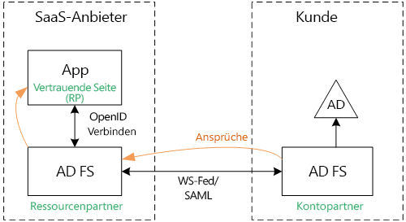
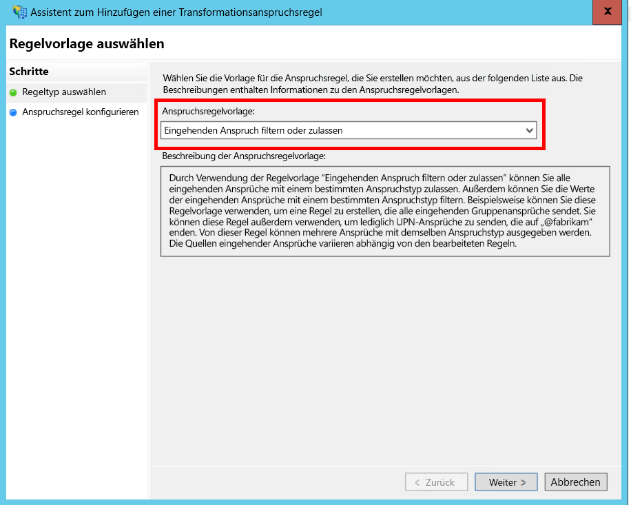
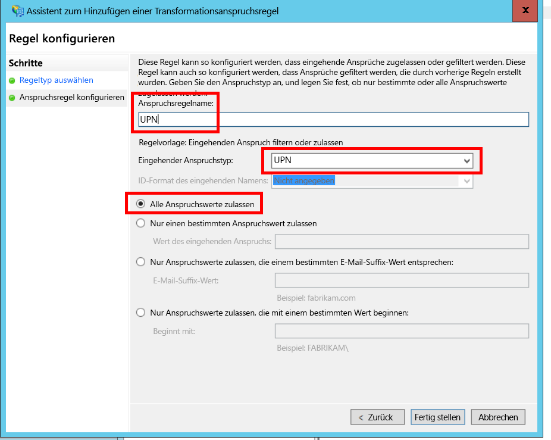
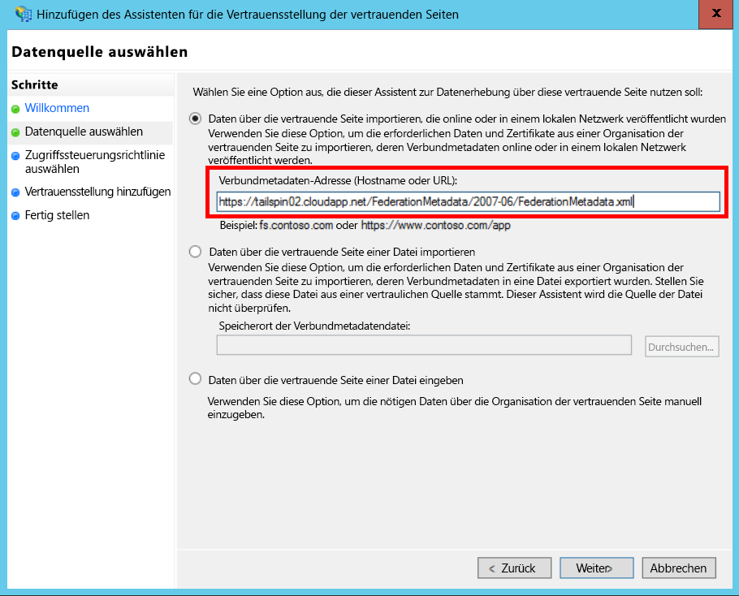
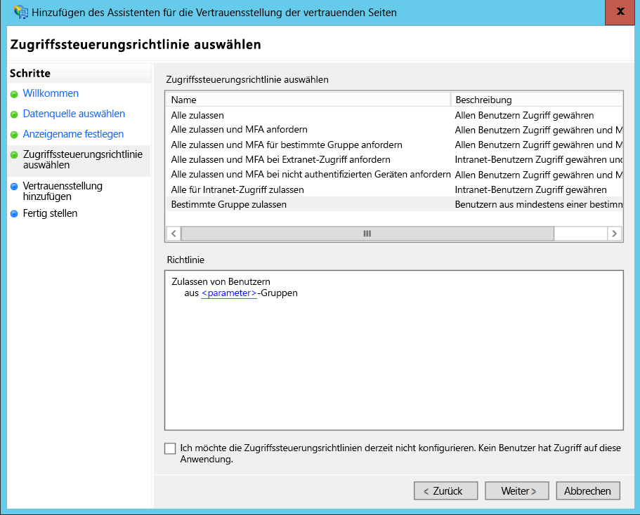
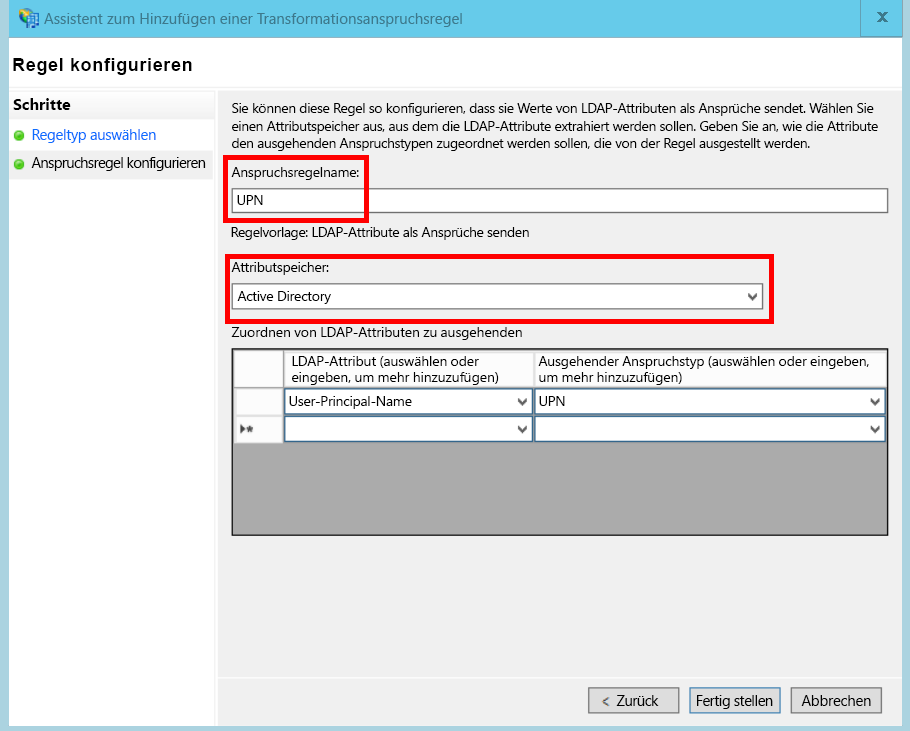
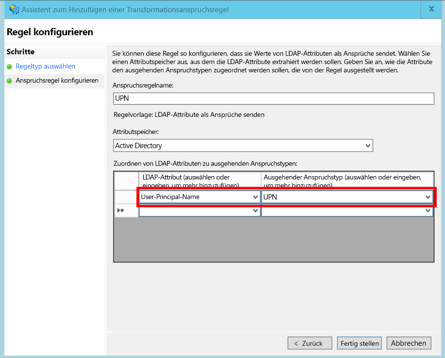

# <a name="federate-with-a-customers-ad-fs"></a><span data-ttu-id="cd6ba-103">Einrichten eines Verbunds mit der AD FS-Instanz eines Kunden</span><span class="sxs-lookup"><span data-stu-id="cd6ba-103">Federate with a customer's AD FS</span></span>

<span data-ttu-id="cd6ba-104">In diesem Artikel wird beschrieben, wie eine SaaS-Anwendung mit mehreren Mandanten eine Authentifizierung über Active Directory-Verbunddienste (AD FS) unterstützen kann, um einen Verbund mit den AD FS eines Kunden einzugehen.</span><span class="sxs-lookup"><span data-stu-id="cd6ba-104">This article describes how a multi-tenant SaaS application can support authentication via Active Directory Federation Services (AD FS), in order to federate with a customer's AD FS.</span></span>

## <a name="overview"></a><span data-ttu-id="cd6ba-105">Übersicht</span><span class="sxs-lookup"><span data-stu-id="cd6ba-105">Overview</span></span>
<span data-ttu-id="cd6ba-106">Azure Active Directory (Azure AD) vereinfacht das Anmelden von Benutzern von Azure AD-Mandanten sowie Kunden von Office 365 und Dynamics CRM Online.</span><span class="sxs-lookup"><span data-stu-id="cd6ba-106">Azure Active Directory (Azure AD) makes it easy to sign in users from Azure AD tenants, including Office365 and Dynamics CRM Online customers.</span></span> <span data-ttu-id="cd6ba-107">Doch wie sieht es mit Kunden aus, die ein lokales Active Directory in einem Unternehmensintranet nutzen?</span><span class="sxs-lookup"><span data-stu-id="cd6ba-107">But what about customers who use on-premise Active Directory on a corporate intranet?</span></span>

<span data-ttu-id="cd6ba-108">Eine Möglichkeit für diese Kunden ist die Synchronisierung ihres lokalen AD mit Azure AD unter Verwendung von [Azure AD Connect].</span><span class="sxs-lookup"><span data-stu-id="cd6ba-108">One option is for these customers to sync their on-premise AD with Azure AD, using [Azure AD Connect].</span></span> <span data-ttu-id="cd6ba-109">Einigen Kunden ist es eventuell aufgrund IT-Unternehmensrichtlinien oder anderen Gründen nicht möglich, diese Methode zu nutzen.</span><span class="sxs-lookup"><span data-stu-id="cd6ba-109">However, some customers may be unable to use this approach, due to corporate IT policy or other reasons.</span></span> <span data-ttu-id="cd6ba-110">In diesem Fall wäre eine weitere Möglichkeit, einen Verbund über Active Directory-Verbunddienste (AD FS) einzurichten.</span><span class="sxs-lookup"><span data-stu-id="cd6ba-110">In that case, another option is to federate through Active Directory Federation Services (AD FS).</span></span>

<span data-ttu-id="cd6ba-111">Aktivieren dieses Szenarios:</span><span class="sxs-lookup"><span data-stu-id="cd6ba-111">To enable this scenario:</span></span>

* <span data-ttu-id="cd6ba-112">Der Kunde muss eine AD FS-Farm mit Internetanbindung besitzen.</span><span class="sxs-lookup"><span data-stu-id="cd6ba-112">The customer must have an Internet-facing AD FS farm.</span></span>
* <span data-ttu-id="cd6ba-113">Der SaaS-Anbieter stellt seine eigene AD FS-Farm bereit.</span><span class="sxs-lookup"><span data-stu-id="cd6ba-113">The SaaS provider deploys their own AD FS farm.</span></span>
* <span data-ttu-id="cd6ba-114">Der Kunde und der SaaS-Anbieter müssen eine [Verbundvertrauensstellung]einrichten.</span><span class="sxs-lookup"><span data-stu-id="cd6ba-114">The customer and the SaaS provider must set up [federation trust].</span></span> <span data-ttu-id="cd6ba-115">Dies ist ein manueller Prozess.</span><span class="sxs-lookup"><span data-stu-id="cd6ba-115">This is a manual process.</span></span>

<span data-ttu-id="cd6ba-116">Die Vertrauensbeziehung umfasst drei wichtige Rollen:</span><span class="sxs-lookup"><span data-stu-id="cd6ba-116">There are three main roles in the trust relation:</span></span>

* <span data-ttu-id="cd6ba-117">Die AD FS des Kunden sind der [Kontopartner], der für die Authentifizierung der Benutzer aus dem Active Directory des Kunden und die Erstellung von Sicherheitstoken mit Benutzeransprüchen zuständig ist.</span><span class="sxs-lookup"><span data-stu-id="cd6ba-117">The customer's AD FS is the [account partner], responsible for authenticating users from the customer's AD, and creating security tokens with user claims.</span></span>
* <span data-ttu-id="cd6ba-118">Der AD FS des SaaS-Anbieters sind die [Ressourcenpartner], die den Kontopartnern vertrauen und die Benutzeransprüche empfangen.</span><span class="sxs-lookup"><span data-stu-id="cd6ba-118">The SaaS provider's AD FS is the [resource partner], which trusts the account partner and receives the user claims.</span></span>
* <span data-ttu-id="cd6ba-119">Die Anwendung wird als eine vertrauende Seite (RP) in den AD FS des SaaS-Anbieters konfiguriert.</span><span class="sxs-lookup"><span data-stu-id="cd6ba-119">The application is configured as a relying party (RP) in the SaaS provider's AD FS.</span></span>
  
  

> [!NOTE]
> <span data-ttu-id="cd6ba-121">In diesem Artikel wird davon ausgegangen, dass die Anwendung OpenID Connect als Authentifizierungsprotokoll verwendet.</span><span class="sxs-lookup"><span data-stu-id="cd6ba-121">In this article, we assume the application uses OpenID connect as the authentication protocol.</span></span> <span data-ttu-id="cd6ba-122">Eine andere Möglichkeit ist die Verwendung von WS-Verbund.</span><span class="sxs-lookup"><span data-stu-id="cd6ba-122">Another option is to use WS-Federation.</span></span>
> 
> <span data-ttu-id="cd6ba-123">Für OpenID Connect muss der SaaS-Anbieter AD FS 2016 unter Windows Server 2016 verwenden.</span><span class="sxs-lookup"><span data-stu-id="cd6ba-123">For OpenID Connect, the SaaS provider must use AD FS 2016, running in Windows Server 2016.</span></span> <span data-ttu-id="cd6ba-124">OpenID Connect wird von AD FS 3.0 nicht unterstützt.</span><span class="sxs-lookup"><span data-stu-id="cd6ba-124">AD FS 3.0 does not support OpenID Connect.</span></span>
> 
> <span data-ttu-id="cd6ba-125">ASP.NET Core bietet keine integrierte Unterstützung für WS-Verbund.</span><span class="sxs-lookup"><span data-stu-id="cd6ba-125">ASP.NET Core does not include out-of-the-box support for WS-Federation.</span></span>
> 
> 

<span data-ttu-id="cd6ba-126">Eine Beispielverwendung von WS-Verbund mit ASP.NET 4 finden Sie im Beispiel [active-directory-dotnet-webapp-wsfederation][active-directory-dotnet-webapp-wsfederation].</span><span class="sxs-lookup"><span data-stu-id="cd6ba-126">For an example of using WS-Federation with ASP.NET 4, see the [active-directory-dotnet-webapp-wsfederation sample][active-directory-dotnet-webapp-wsfederation].</span></span>

## <a name="authentication-flow"></a><span data-ttu-id="cd6ba-127">Authentifizierungsfluss</span><span class="sxs-lookup"><span data-stu-id="cd6ba-127">Authentication flow</span></span>
1. <span data-ttu-id="cd6ba-128">Klickt der Benutzer auf „Anmelden“, leitet die Anwendung diesen an einen OpenID Connect-Endpunkt der AD FS des SaaS-Anbieters weiter.</span><span class="sxs-lookup"><span data-stu-id="cd6ba-128">When the user clicks "sign in", the application redirects to an OpenID Connect endpoint on the SaaS provider's AD FS.</span></span>
2. <span data-ttu-id="cd6ba-129">Der Benutzer/die Benutzerin gibt seinen/ihren Organisationsbenutzernamen ein („`alice@corp.contoso.com`“).</span><span class="sxs-lookup"><span data-stu-id="cd6ba-129">The user enters his or her organizational user name ("`alice@corp.contoso.com`").</span></span> <span data-ttu-id="cd6ba-130">AD FS verwenden Startbereichserkennung, um zu den AD FS des Kunden umzuleiten, wo Benutzer ihre Anmeldeinformationen eingeben.</span><span class="sxs-lookup"><span data-stu-id="cd6ba-130">AD FS uses home realm discovery to redirect to the customer's AD FS, where the user enters their credentials.</span></span>
3. <span data-ttu-id="cd6ba-131">Die AD FS des Kunden senden mithilfe des WF-Verbunds (oder SAML) Benutzeransprüche an die AD FS des SaaS-Anbieters.</span><span class="sxs-lookup"><span data-stu-id="cd6ba-131">The customer's AD FS sends user claims to the SaaS provider's AD FS, using WF-Federation (or SAML).</span></span>
4. <span data-ttu-id="cd6ba-132">Ansprüche werden von den AD FS mithilfe von OpenID Connect an die App übertragen.</span><span class="sxs-lookup"><span data-stu-id="cd6ba-132">Claims flow from AD FS to the app, using OpenID Connect.</span></span> <span data-ttu-id="cd6ba-133">Dies erfordert einen Protokollübergang von WS-Verbund.</span><span class="sxs-lookup"><span data-stu-id="cd6ba-133">This requires a protocol transition from WS-Federation.</span></span>

## <a name="limitations"></a><span data-ttu-id="cd6ba-134">Einschränkungen</span><span class="sxs-lookup"><span data-stu-id="cd6ba-134">Limitations</span></span>
<span data-ttu-id="cd6ba-135">Standardmäßig empfängt die Anwendung der vertrauenden Seite nur einen festgelegten Satz an Ansprüchen, der in „id_token“ verfügbar ist, wie in der folgenden Tabelle gezeigt.</span><span class="sxs-lookup"><span data-stu-id="cd6ba-135">By default, the relying party application receives only a fixed set of claims available in the id_token, shown in the following table.</span></span> <span data-ttu-id="cd6ba-136">In AD FS 2016 können Sie „id_token“ in OpenID Connect-Szenarien anpassen.</span><span class="sxs-lookup"><span data-stu-id="cd6ba-136">With AD FS 2016, you can customize the id_token in OpenID Connect scenarios.</span></span> <span data-ttu-id="cd6ba-137">Weitere Informationen finden Sie unter [Benutzerdefinierte ID-Token in AD FS](/windows-server/identity/ad-fs/development/customize-id-token-ad-fs-2016).</span><span class="sxs-lookup"><span data-stu-id="cd6ba-137">For more information, see [Custom ID Tokens in AD FS](/windows-server/identity/ad-fs/development/customize-id-token-ad-fs-2016).</span></span>

| <span data-ttu-id="cd6ba-138">Anspruch</span><span class="sxs-lookup"><span data-stu-id="cd6ba-138">Claim</span></span> | <span data-ttu-id="cd6ba-139">BESCHREIBUNG</span><span class="sxs-lookup"><span data-stu-id="cd6ba-139">Description</span></span> |
| --- | --- |
| <span data-ttu-id="cd6ba-140">aud</span><span class="sxs-lookup"><span data-stu-id="cd6ba-140">aud</span></span> |<span data-ttu-id="cd6ba-141">Zielgruppe.</span><span class="sxs-lookup"><span data-stu-id="cd6ba-141">Audience.</span></span> <span data-ttu-id="cd6ba-142">Die Anwendung, für die die Ansprüche ausgegeben wurden</span><span class="sxs-lookup"><span data-stu-id="cd6ba-142">The application for which the claims were issued.</span></span> |
| <span data-ttu-id="cd6ba-143">authenticationinstant</span><span class="sxs-lookup"><span data-stu-id="cd6ba-143">authenticationinstant</span></span> |<span data-ttu-id="cd6ba-144">[Authentifizierungszeitpunkt].</span><span class="sxs-lookup"><span data-stu-id="cd6ba-144">[Authentication instant].</span></span> <span data-ttu-id="cd6ba-145">Der Zeitpunkt, zu dem die Authentifizierung erfolgt ist.</span><span class="sxs-lookup"><span data-stu-id="cd6ba-145">The time at which authentication occurred.</span></span> |
| <span data-ttu-id="cd6ba-146">c_hash</span><span class="sxs-lookup"><span data-stu-id="cd6ba-146">c_hash</span></span> |<span data-ttu-id="cd6ba-147">Codehashwert.</span><span class="sxs-lookup"><span data-stu-id="cd6ba-147">Code hash value.</span></span> <span data-ttu-id="cd6ba-148">Dies ist ein Hash der Tokeninhalte.</span><span class="sxs-lookup"><span data-stu-id="cd6ba-148">This is a hash of the token contents.</span></span> |
| <span data-ttu-id="cd6ba-149">exp</span><span class="sxs-lookup"><span data-stu-id="cd6ba-149">exp</span></span> |<span data-ttu-id="cd6ba-150">[Ablaufzeit].</span><span class="sxs-lookup"><span data-stu-id="cd6ba-150">[Expiration time].</span></span> <span data-ttu-id="cd6ba-151">Der Zeitpunkt, nach dem das Token nicht mehr akzeptiert wird.</span><span class="sxs-lookup"><span data-stu-id="cd6ba-151">The time after which the token will no longer be accepted.</span></span> |
| <span data-ttu-id="cd6ba-152">iat</span><span class="sxs-lookup"><span data-stu-id="cd6ba-152">iat</span></span> |<span data-ttu-id="cd6ba-153">Ausgestellt um.</span><span class="sxs-lookup"><span data-stu-id="cd6ba-153">Issued at.</span></span> <span data-ttu-id="cd6ba-154">Der Zeitpunkt, zu dem das Token ausgestellt wurde.</span><span class="sxs-lookup"><span data-stu-id="cd6ba-154">The time when the token was issued.</span></span> |
| <span data-ttu-id="cd6ba-155">iss</span><span class="sxs-lookup"><span data-stu-id="cd6ba-155">iss</span></span> |<span data-ttu-id="cd6ba-156">Aussteller.</span><span class="sxs-lookup"><span data-stu-id="cd6ba-156">Issuer.</span></span> <span data-ttu-id="cd6ba-157">Der Wert dieses Anspruchs ist immer die AD FS-Instanz des Ressourcenpartners.</span><span class="sxs-lookup"><span data-stu-id="cd6ba-157">The value of this claim is always the resource partner's AD FS.</span></span> |
| <span data-ttu-id="cd6ba-158">name</span><span class="sxs-lookup"><span data-stu-id="cd6ba-158">name</span></span> |<span data-ttu-id="cd6ba-159">Benutzername.</span><span class="sxs-lookup"><span data-stu-id="cd6ba-159">User name.</span></span> <span data-ttu-id="cd6ba-160">Beispiel: `john@corp.fabrikam.com`.</span><span class="sxs-lookup"><span data-stu-id="cd6ba-160">Example: `john@corp.fabrikam.com`.</span></span> |
| <span data-ttu-id="cd6ba-161">nameidentifier</span><span class="sxs-lookup"><span data-stu-id="cd6ba-161">nameidentifier</span></span> |<span data-ttu-id="cd6ba-162">[Namensbezeichner].</span><span class="sxs-lookup"><span data-stu-id="cd6ba-162">[Name identifier].</span></span> <span data-ttu-id="cd6ba-163">Der Bezeichner für den Namen der Entität, für die das Token ausgestellt wurde.</span><span class="sxs-lookup"><span data-stu-id="cd6ba-163">The identifier for the name of the entity for which the token was issued.</span></span> |
| <span data-ttu-id="cd6ba-164">nonce</span><span class="sxs-lookup"><span data-stu-id="cd6ba-164">nonce</span></span> |<span data-ttu-id="cd6ba-165">Sitzungsnonce.</span><span class="sxs-lookup"><span data-stu-id="cd6ba-165">Session nonce.</span></span> <span data-ttu-id="cd6ba-166">Ein eindeutiger Wert, der von AD FS generiert wird, um Replayangriffe zu verhindern.</span><span class="sxs-lookup"><span data-stu-id="cd6ba-166">A unique value generated by AD FS to help prevent replay attacks.</span></span> |
| <span data-ttu-id="cd6ba-167">upn</span><span class="sxs-lookup"><span data-stu-id="cd6ba-167">upn</span></span> |<span data-ttu-id="cd6ba-168">Benutzerprinzipalname (User Principal Name, UPN).</span><span class="sxs-lookup"><span data-stu-id="cd6ba-168">User principal name (UPN).</span></span> <span data-ttu-id="cd6ba-169">Beispiel: john@corp.fabrikam.com</span><span class="sxs-lookup"><span data-stu-id="cd6ba-169">Example: john@corp.fabrikam.com</span></span> |
| <span data-ttu-id="cd6ba-170">pwd_exp</span><span class="sxs-lookup"><span data-stu-id="cd6ba-170">pwd_exp</span></span> |<span data-ttu-id="cd6ba-171">Ablaufzeitraum für Kennwort.</span><span class="sxs-lookup"><span data-stu-id="cd6ba-171">Password expiration period.</span></span> <span data-ttu-id="cd6ba-172">Die Anzahl von Sekunden, bis das Kennwort oder ein entsprechendes Authentifizierungsgeheimnis – z.B. eine PIN – des Benutzers</span><span class="sxs-lookup"><span data-stu-id="cd6ba-172">The number of seconds until the user's password or a similar authentication secret, such as a PIN.</span></span> <span data-ttu-id="cd6ba-173">abläuft.</span><span class="sxs-lookup"><span data-stu-id="cd6ba-173">expires.</span></span> |

> [!NOTE]
> <span data-ttu-id="cd6ba-174">Der Anspruch „iss“ enthält die AD FS des Partners (dieser Anspruch identifiziert typischerweise den SaaS-Anbieter als Aussteller).</span><span class="sxs-lookup"><span data-stu-id="cd6ba-174">The "iss" claim contains the AD FS of the partner (typically, this claim will identify the SaaS provider as the issuer).</span></span> <span data-ttu-id="cd6ba-175">Er identifiziert nicht die AD FS des Kunden.</span><span class="sxs-lookup"><span data-stu-id="cd6ba-175">It does not identify the customer's AD FS.</span></span> <span data-ttu-id="cd6ba-176">Die Domäne des Kunden ist Bestandteil des Benutzerprinzipalnamens.</span><span class="sxs-lookup"><span data-stu-id="cd6ba-176">You can find the customer's domain as part of the UPN.</span></span>
> 
> 

<span data-ttu-id="cd6ba-177">Im restlichen Artikel wird das Einrichten der Vertrauensstellung zwischen der Anwendung der RP (der App) und dem Kontopartner (dem Kunden) beschrieben.</span><span class="sxs-lookup"><span data-stu-id="cd6ba-177">The rest of this article describes how to set up the trust relationship between the RP (the app) and the account partner (the customer).</span></span>

## <a name="ad-fs-deployment"></a><span data-ttu-id="cd6ba-178">AD FS-Bereitstellung</span><span class="sxs-lookup"><span data-stu-id="cd6ba-178">AD FS deployment</span></span>
<span data-ttu-id="cd6ba-179">Der SaaS-Anbieter kann AD FS lokal oder auf Azure-VMs bereitstellen.</span><span class="sxs-lookup"><span data-stu-id="cd6ba-179">The SaaS provider can deploy AD FS either on-premise or on Azure VMs.</span></span> <span data-ttu-id="cd6ba-180">Für die Sicherheit und Verfügbarkeit sind die folgenden Richtlinien zu beachten:</span><span class="sxs-lookup"><span data-stu-id="cd6ba-180">For security and availability, the following guidelines are important:</span></span>

* <span data-ttu-id="cd6ba-181">Stellen Sie mindestens zwei AD FS-Server und zwei AD FS-Proxyserver bereit, um die beste Verfügbarkeit der Active Directory-Verbunddienste zu gewährleisten.</span><span class="sxs-lookup"><span data-stu-id="cd6ba-181">Deploy at least two AD FS servers and two AD FS proxy servers to achieve the best availability of the AD FS service.</span></span>
* <span data-ttu-id="cd6ba-182">Domänencontroller und AD FS-Server sollten nie direkt mit dem Internet verbunden sein, und sie sollten sich in einem virtuellem Netzwerk mit direktem Zugriff auf diese befinden.</span><span class="sxs-lookup"><span data-stu-id="cd6ba-182">Domain controllers and AD FS servers should never be exposed directly to the Internet and should be in a virtual network with direct access to them.</span></span>
* <span data-ttu-id="cd6ba-183">Webanwendungsproxys (zuvor AD FS-Proxys) müssen verwendet werden, um AD FS-Server im Internet zu veröffentlichen.</span><span class="sxs-lookup"><span data-stu-id="cd6ba-183">Web application proxies (previously AD FS proxies) must be used to publish AD FS servers to the Internet.</span></span>

<span data-ttu-id="cd6ba-184">Das Einrichten einer ähnlichen Topologie in Azure erfordert die Verwendung von virtuellen Netzwerken, NSGs, Azure VMs und Verfügbarkeitsgruppen.</span><span class="sxs-lookup"><span data-stu-id="cd6ba-184">To set up a similar topology in Azure requires the use of Virtual networks, NSG’s, azure VM’s and availability sets.</span></span> <span data-ttu-id="cd6ba-185">Weitere Informationen finden Sie unter [Richtlinien für die Bereitstellung von Windows Server Active Directory auf virtuellen Computern in Azure][active-directory-on-azure].</span><span class="sxs-lookup"><span data-stu-id="cd6ba-185">For more details, see [Guidelines for Deploying Windows Server Active Directory on Azure Virtual Machines][active-directory-on-azure].</span></span>

## <a name="configure-openid-connect-authentication-with-ad-fs"></a><span data-ttu-id="cd6ba-186">Konfigurieren der OpenID Connect-Authentifizierung mit AD FS</span><span class="sxs-lookup"><span data-stu-id="cd6ba-186">Configure OpenID Connect authentication with AD FS</span></span>
<span data-ttu-id="cd6ba-187">Der SaaS-Anbieter muss OpenID Connect zwischen der Anwendung und den AD FS aktivieren.</span><span class="sxs-lookup"><span data-stu-id="cd6ba-187">The SaaS provider must enable OpenID Connect between the application and AD FS.</span></span> <span data-ttu-id="cd6ba-188">Fügen Sie zu diesem Zweck in AD FS eine Anwendungsgruppe hinzu.</span><span class="sxs-lookup"><span data-stu-id="cd6ba-188">To do so, add an application group in AD FS.</span></span>  <span data-ttu-id="cd6ba-189">Detaillierte Anweisungen dazu finden Sie in diesem [Blogbeitrag] unter „Setting up a Web App for OpenId Connect sign in AD FS“ (Einrichten einer Web-App für die OpenID Connect-Anmeldung über AD FS).</span><span class="sxs-lookup"><span data-stu-id="cd6ba-189">You can find detailed instructions in this [blog post], under " Setting up a Web App for OpenId Connect sign in AD FS."</span></span> 

<span data-ttu-id="cd6ba-190">Konfigurieren Sie als Nächstes die OpenID Connect-Middleware.</span><span class="sxs-lookup"><span data-stu-id="cd6ba-190">Next, configure the OpenID Connect middleware.</span></span> <span data-ttu-id="cd6ba-191">Der Metadatenendpunkt lautet `https://domain/adfs/.well-known/openid-configuration`, wobei „domain“ die AD FS-Domäne des SaaS-Anbieters ist.</span><span class="sxs-lookup"><span data-stu-id="cd6ba-191">The metadata endpoint is `https://domain/adfs/.well-known/openid-configuration`, where domain is the SaaS provider's AD FS domain.</span></span>

<span data-ttu-id="cd6ba-192">In der Regel kombinieren Sie dies mit anderen OpenID Connect-Endpunkten (wie z.B. AAD).</span><span class="sxs-lookup"><span data-stu-id="cd6ba-192">Typically you might combine this with other OpenID Connect endpoints (such as AAD).</span></span> <span data-ttu-id="cd6ba-193">Sie benötigen zwei verschiedene Anmeldeschaltflächen oder eine andere Möglichkeit, die Anmeldungen zu unterscheiden, damit der Benutzer an den richtigen Authentifizierungsendpunkt weitergeleitet wird.</span><span class="sxs-lookup"><span data-stu-id="cd6ba-193">You'll need two different sign-in buttons or some other way to distinguish them, so that the user is sent to the correct authentication endpoint.</span></span>

## <a name="configure-the-ad-fs-resource-partner"></a><span data-ttu-id="cd6ba-194">Konfigurieren des AD FS-Ressourcenpartners</span><span class="sxs-lookup"><span data-stu-id="cd6ba-194">Configure the AD FS Resource Partner</span></span>
<span data-ttu-id="cd6ba-195">Der SaaS-Anbieter muss für jeden Kunden folgende Schritte ausführen, wenn dieser über AD FS eine Verbindung herstellen möchte:</span><span class="sxs-lookup"><span data-stu-id="cd6ba-195">The SaaS provider must do the following for each customer that wants to connect via ADFS:</span></span>

1. <span data-ttu-id="cd6ba-196">Fügen Sie eine Vertrauensstellung für Anspruchsanbieter hinzu.</span><span class="sxs-lookup"><span data-stu-id="cd6ba-196">Add a claims provider trust.</span></span>
2. <span data-ttu-id="cd6ba-197">Fügen Sie Anspruchsregeln hinzu.</span><span class="sxs-lookup"><span data-stu-id="cd6ba-197">Add claims rules.</span></span>
3. <span data-ttu-id="cd6ba-198">Aktivieren Sie eine Startbereichsermittlung.</span><span class="sxs-lookup"><span data-stu-id="cd6ba-198">Enable home-realm discovery.</span></span>

<span data-ttu-id="cd6ba-199">Hier werden die Schritte im Detail veranschaulicht.</span><span class="sxs-lookup"><span data-stu-id="cd6ba-199">Here are the steps in more detail.</span></span>

### <a name="add-the-claims-provider-trust"></a><span data-ttu-id="cd6ba-200">Fügen Sie die Anspruchsanbieter-Vertrauensstellung hinzu.</span><span class="sxs-lookup"><span data-stu-id="cd6ba-200">Add the claims provider trust</span></span>
1. <span data-ttu-id="cd6ba-201">Klicken Sie im Server-Manager auf **Tools**, und wählen Sie **AD FS-Verwaltung** aus.</span><span class="sxs-lookup"><span data-stu-id="cd6ba-201">In Server Manager, click **Tools**, and then select **AD FS Management**.</span></span>
2. <span data-ttu-id="cd6ba-202">Klicken Sie in der Konsolenstruktur unter **AD FS** mit der rechten Maustaste auf **Anspruchsanbieter-Vertrauensstellungen**.</span><span class="sxs-lookup"><span data-stu-id="cd6ba-202">In the console tree, under **AD FS**, right click **Claims Provider Trusts**.</span></span> <span data-ttu-id="cd6ba-203">Wählen Sie **Anspruchsanbieter-Vertrauensstellung hinzufügen**.</span><span class="sxs-lookup"><span data-stu-id="cd6ba-203">Select **Add Claims Provider Trust**.</span></span>
3. <span data-ttu-id="cd6ba-204">Klicken Sie auf **Starten** , um den Assistenten zu starten.</span><span class="sxs-lookup"><span data-stu-id="cd6ba-204">Click **Start** to start the wizard.</span></span>
4. <span data-ttu-id="cd6ba-205">Wählen Sie die Option „Online oder in einem lokalen Netzwerk veröffentlichte Daten über den Anspruchsanbieter importieren“ aus.</span><span class="sxs-lookup"><span data-stu-id="cd6ba-205">Select the option "Import data about the claims provider published online or on a local network".</span></span> <span data-ttu-id="cd6ba-206">Geben Sie den URI des Verbundmetadaten-Endpunkts des Kunden an.</span><span class="sxs-lookup"><span data-stu-id="cd6ba-206">Enter the URI of the customer's federation metadata endpoint.</span></span> <span data-ttu-id="cd6ba-207">(Beispiel: `https://contoso.com/FederationMetadata/2007-06/FederationMetadata.xml`). Diese Informationen muss der Kunde bereitstellen.</span><span class="sxs-lookup"><span data-stu-id="cd6ba-207">(Example: `https://contoso.com/FederationMetadata/2007-06/FederationMetadata.xml`.) You will need to get this from the customer.</span></span>
5. <span data-ttu-id="cd6ba-208">Schließen Sie den Assistenten unter Verwendung der angegebenen Standardoptionen ab.</span><span class="sxs-lookup"><span data-stu-id="cd6ba-208">Complete the wizard using the default options.</span></span>

### <a name="edit-claims-rules"></a><span data-ttu-id="cd6ba-209">Anspruchsregeln bearbeiten.</span><span class="sxs-lookup"><span data-stu-id="cd6ba-209">Edit claims rules</span></span>
1. <span data-ttu-id="cd6ba-210">Führen Sie einen Rechtsklick auf die neu hinzugefügte Anspruchsanbieter-Vertrauensstellung aus, und wählen Sie **Anspruchsregeln bearbeiten**.</span><span class="sxs-lookup"><span data-stu-id="cd6ba-210">Right-click the newly added claims provider trust, and select **Edit Claims Rules**.</span></span>
2. <span data-ttu-id="cd6ba-211">Klicken Sie auf **Regel hinzufügen**.</span><span class="sxs-lookup"><span data-stu-id="cd6ba-211">Click **Add Rule**.</span></span>
3. <span data-ttu-id="cd6ba-212">Wählen Sie „Eingehenden Anspruch filtern oder zulassen“, und klicken Sie auf **Weiter**.</span><span class="sxs-lookup"><span data-stu-id="cd6ba-212">Select "Pass Through or Filter an Incoming Claim" and click **Next**.</span></span>
   <span data-ttu-id="cd6ba-213"></span><span class="sxs-lookup"><span data-stu-id="cd6ba-213"></span></span>
4. <span data-ttu-id="cd6ba-214">Geben Sie einen Namen für die Regel ein.</span><span class="sxs-lookup"><span data-stu-id="cd6ba-214">Enter a name for the rule.</span></span>
5. <span data-ttu-id="cd6ba-215">Wählen Sie unter „Eingehender Anspruchstyp“ **UPN**.</span><span class="sxs-lookup"><span data-stu-id="cd6ba-215">Under "Incoming claim type", select **UPN**.</span></span>
6. <span data-ttu-id="cd6ba-216">Wählen Sie „Durchlauf aller Anspruchswerte“.</span><span class="sxs-lookup"><span data-stu-id="cd6ba-216">Select "Pass through all claim values".</span></span>
   <span data-ttu-id="cd6ba-217"></span><span class="sxs-lookup"><span data-stu-id="cd6ba-217"></span></span>
7. <span data-ttu-id="cd6ba-218">Klicken Sie auf **Fertig stellen**.</span><span class="sxs-lookup"><span data-stu-id="cd6ba-218">Click **Finish**.</span></span>
8. <span data-ttu-id="cd6ba-219">Wiederholen Sie die Schritte 2 bis 7, und geben Sie **Anker Anspruchstyp** für den eingehenden Anspruchstyp an.</span><span class="sxs-lookup"><span data-stu-id="cd6ba-219">Repeat steps 2 - 7, and specify **Anchor Claim Type** for the incoming claim type.</span></span>
9. <span data-ttu-id="cd6ba-220">Klicken Sie auf **OK** , um den Assistenten abzuschließen.</span><span class="sxs-lookup"><span data-stu-id="cd6ba-220">Click **OK** to complete the wizard.</span></span>

### <a name="enable-home-realm-discovery"></a><span data-ttu-id="cd6ba-221">Aktivierung der Startbereichsermittlung</span><span class="sxs-lookup"><span data-stu-id="cd6ba-221">Enable home-realm discovery</span></span>
<span data-ttu-id="cd6ba-222">Führen Sie das folgende PowerShell-Skript aus:</span><span class="sxs-lookup"><span data-stu-id="cd6ba-222">Run the following PowerShell script:</span></span>

```
Set-ADFSClaimsProviderTrust -TargetName "name" -OrganizationalAccountSuffix @("suffix")
```

<span data-ttu-id="cd6ba-223">Bei „name“ handelt es sich um den Anzeigenamen des Anspruchsanbieters, „suffix“ ist das UPN-Suffix für die Anwendungsdomäne des Kunden (z.B. „corp.fabrikam.com“).</span><span class="sxs-lookup"><span data-stu-id="cd6ba-223">where "name" is the friendly name of the claims provider trust, and "suffix" is the UPN suffix for the customer's AD (example, "corp.fabrikam.com").</span></span>

<span data-ttu-id="cd6ba-224">Mit dieser Konfiguration können Endbenutzer ihr Organisationskonto eingeben, und AD FS wählen automatisch den entsprechenden Anspruchsanbieter aus.</span><span class="sxs-lookup"><span data-stu-id="cd6ba-224">With this configuration, end users can type in their organizational account, and AD FS automatically selects the corresponding claims provider.</span></span> <span data-ttu-id="cd6ba-225">Siehe unter [Anpassen der AD FS-Sign-in-Webseiten]den Abschnitt „Konfigurieren von Identitätsanbietern, um bestimmte E-Mail-Suffixe zu verwenden“.</span><span class="sxs-lookup"><span data-stu-id="cd6ba-225">See [Customizing the AD FS Sign-in Pages], under the section "Configure Identity Provider to use certain email suffixes".</span></span>

## <a name="configure-the-ad-fs-account-partner"></a><span data-ttu-id="cd6ba-226">Konfigurieren des AD FS-Kontopartners</span><span class="sxs-lookup"><span data-stu-id="cd6ba-226">Configure the AD FS Account Partner</span></span>
<span data-ttu-id="cd6ba-227">Kunden müssen wie folgt vorgehen:</span><span class="sxs-lookup"><span data-stu-id="cd6ba-227">The customer must do the following:</span></span>

1. <span data-ttu-id="cd6ba-228">Eine Vertrauensstellung der vertrauenden Seite (RP) hinzufügen.</span><span class="sxs-lookup"><span data-stu-id="cd6ba-228">Add a relying party (RP) trust.</span></span>
2. <span data-ttu-id="cd6ba-229">Anspruchsregeln hinzufügen.</span><span class="sxs-lookup"><span data-stu-id="cd6ba-229">Adds claims rules.</span></span>

### <a name="add-the-rp-trust"></a><span data-ttu-id="cd6ba-230">Die RP-Vertrauensstellung hinzufügen.</span><span class="sxs-lookup"><span data-stu-id="cd6ba-230">Add the RP trust</span></span>
1. <span data-ttu-id="cd6ba-231">Klicken Sie im Server-Manager auf **Tools**, und wählen Sie **AD FS-Verwaltung** aus.</span><span class="sxs-lookup"><span data-stu-id="cd6ba-231">In Server Manager, click **Tools**, and then select **AD FS Management**.</span></span>
2. <span data-ttu-id="cd6ba-232">Klicken Sie in der Konsolenstruktur unter **AD FS** mit der rechten Maustaste auf **Vertrauensstellungen der vertrauenden Seite**.</span><span class="sxs-lookup"><span data-stu-id="cd6ba-232">In the console tree, under **AD FS**, right click **Relying Party Trusts**.</span></span> <span data-ttu-id="cd6ba-233">Wählen Sie **Hinzufügen der Vertrauensstellung der vertrauenden Seite**.</span><span class="sxs-lookup"><span data-stu-id="cd6ba-233">Select **Add Relying Party Trust**.</span></span>
3. <span data-ttu-id="cd6ba-234">Wählen Sie **Ansprüche unterstützend** aus, und klicken Sie auf **Start**.</span><span class="sxs-lookup"><span data-stu-id="cd6ba-234">Select **Claims Aware** and click **Start**.</span></span>
4. <span data-ttu-id="cd6ba-235">Wählen Sie auf der Seite **Auswählen von Datenquellen** die Option „Daten über den Anspruchsanbieter online oder über ein lokales Netzwerk importieren“.</span><span class="sxs-lookup"><span data-stu-id="cd6ba-235">On the **Select Data Source** page, select the option "Import data about the claims provider published online or on a local network".</span></span> <span data-ttu-id="cd6ba-236">Geben Sie den URI des Verbundmetadaten-Endpunkts des SaaS-Anbieters an.</span><span class="sxs-lookup"><span data-stu-id="cd6ba-236">Enter the URI of the SaaS provider's federation metadata endpoint.</span></span>
   <span data-ttu-id="cd6ba-237"></span><span class="sxs-lookup"><span data-stu-id="cd6ba-237"></span></span>
5. <span data-ttu-id="cd6ba-238">Geben Sie auf der Seite **Anzeigename angeben** einen beliebigen Namen ein.</span><span class="sxs-lookup"><span data-stu-id="cd6ba-238">On the **Specify Display Name** page, enter any name.</span></span>
6. <span data-ttu-id="cd6ba-239">Wählen Sie auf der Seite **Zugriffssteuerungsrichtlinien wählen** eine Richtlinie.</span><span class="sxs-lookup"><span data-stu-id="cd6ba-239">On the **Choose Access Control Policy** page, choose a policy.</span></span> <span data-ttu-id="cd6ba-240">Sie können jede Person im Unternehmen zulassen oder eine bestimmte Sicherheitsgruppe wählen.</span><span class="sxs-lookup"><span data-stu-id="cd6ba-240">You could permit everyone in the organization, or choose a specific security group.</span></span>
   <span data-ttu-id="cd6ba-241"></span><span class="sxs-lookup"><span data-stu-id="cd6ba-241"></span></span>
7. <span data-ttu-id="cd6ba-242">Geben Sie im Feld **Richtlinie** die erforderlichen Parameter ein.</span><span class="sxs-lookup"><span data-stu-id="cd6ba-242">Enter any parameters required in the **Policy** box.</span></span>
8. <span data-ttu-id="cd6ba-243">Klicken Sie auf **Weiter** , um den Assistenten abzuschließen.</span><span class="sxs-lookup"><span data-stu-id="cd6ba-243">Click **Next** to complete the wizard.</span></span>

### <a name="add-claims-rules"></a><span data-ttu-id="cd6ba-244">Fügen Sie Anspruchsregeln hinzu</span><span class="sxs-lookup"><span data-stu-id="cd6ba-244">Add claims rules</span></span>
1. <span data-ttu-id="cd6ba-245">Klicken Sie mit der rechten Maustaste auf die neu hinzugefügte Vertrauensstellung der vertrauenden Seite, und wählen Sie **Anspruchsausstellungsrichtlinie bearbeiten**.</span><span class="sxs-lookup"><span data-stu-id="cd6ba-245">Right-click the newly added relying party trust, and select **Edit Claim Issuance Policy**.</span></span>
2. <span data-ttu-id="cd6ba-246">Klicken Sie auf **Regel hinzufügen**.</span><span class="sxs-lookup"><span data-stu-id="cd6ba-246">Click **Add Rule**.</span></span>
3. <span data-ttu-id="cd6ba-247">Wählen Sie „Senden von LDAP-Attributen als Ansprüche“, und klicken Sie auf **Weiter**.</span><span class="sxs-lookup"><span data-stu-id="cd6ba-247">Select "Send LDAP Attributes as Claims" and click **Next**.</span></span>
4. <span data-ttu-id="cd6ba-248">Geben Sie einen Namen für die Regel ein, z.B. „UPN“.</span><span class="sxs-lookup"><span data-stu-id="cd6ba-248">Enter a name for the rule, such as "UPN".</span></span>
5. <span data-ttu-id="cd6ba-249">Wählen Sie unter **Attributspeicher** den Eintrag **Active Directory** aus.</span><span class="sxs-lookup"><span data-stu-id="cd6ba-249">Under **Attribute store**, select **Active Directory**.</span></span>
   <span data-ttu-id="cd6ba-250"></span><span class="sxs-lookup"><span data-stu-id="cd6ba-250"></span></span>
6. <span data-ttu-id="cd6ba-251">Im Abschnitt **Zuordnung der LDAP-Attribute** :</span><span class="sxs-lookup"><span data-stu-id="cd6ba-251">In the **Mapping of LDAP attributes** section:</span></span>
   * <span data-ttu-id="cd6ba-252">Wählen Sie unter **LDAP-Attribut** den Eintrag **User-Principal-Name**.</span><span class="sxs-lookup"><span data-stu-id="cd6ba-252">Under **LDAP Attribute**, select **User-Principal-Name**.</span></span>
   * <span data-ttu-id="cd6ba-253">Wählen Sie unter **Typ des ausgehenden Anspruchs** den Eintrag **UPN**.</span><span class="sxs-lookup"><span data-stu-id="cd6ba-253">Under **Outgoing Claim Type**, select **UPN**.</span></span>
     <span data-ttu-id="cd6ba-254"></span><span class="sxs-lookup"><span data-stu-id="cd6ba-254"></span></span>
7. <span data-ttu-id="cd6ba-255">Klicken Sie auf **Fertig stellen**.</span><span class="sxs-lookup"><span data-stu-id="cd6ba-255">Click **Finish**.</span></span>
8. <span data-ttu-id="cd6ba-256">Klicken Sie erneut auf **Regel hinzufügen** .</span><span class="sxs-lookup"><span data-stu-id="cd6ba-256">Click **Add Rule** again.</span></span>
9. <span data-ttu-id="cd6ba-257">Wählen Sie „Ansprüche per benutzerdefinierter Regel senden“, und klicken Sie auf **Weiter**.</span><span class="sxs-lookup"><span data-stu-id="cd6ba-257">Select "Send Claims Using a Custom Rule" and click **Next**.</span></span>
10. <span data-ttu-id="cd6ba-258">Geben Sie einen Namen für die Regel ein, z.B. „Ankeranspruchstyp“.</span><span class="sxs-lookup"><span data-stu-id="cd6ba-258">Enter a name for the rule, such as "Anchor Claim Type".</span></span>
11. <span data-ttu-id="cd6ba-259">Geben Sie Folgendes unter **Benutzerdefinierte Regel**ein:</span><span class="sxs-lookup"><span data-stu-id="cd6ba-259">Under **Custom rule**, enter the following:</span></span>
    
    ```
    EXISTS([Type == "http://schemas.microsoft.com/ws/2014/01/identity/claims/anchorclaimtype"])=>
    issue (Type = "http://schemas.microsoft.com/ws/2014/01/identity/claims/anchorclaimtype",
          Value = "http://schemas.xmlsoap.org/ws/2005/05/identity/claims/upn");
    ```
    
    <span data-ttu-id="cd6ba-260">Diese Regel gibt einen Anspruch vom Typ `anchorclaimtype` aus.</span><span class="sxs-lookup"><span data-stu-id="cd6ba-260">This rule issues a claim of type `anchorclaimtype`.</span></span> <span data-ttu-id="cd6ba-261">Der Anspruch informiert die vertrauende Seite darüber, dass der UPN als unveränderliche ID des Benutzers verwendet werden soll.</span><span class="sxs-lookup"><span data-stu-id="cd6ba-261">The claim tells the relying party to use UPN as the user's immutable ID.</span></span>
12. <span data-ttu-id="cd6ba-262">Klicken Sie auf **Fertig stellen**.</span><span class="sxs-lookup"><span data-stu-id="cd6ba-262">Click **Finish**.</span></span>
13. <span data-ttu-id="cd6ba-263">Klicken Sie auf **OK** , um den Assistenten abzuschließen.</span><span class="sxs-lookup"><span data-stu-id="cd6ba-263">Click **OK** to complete the wizard.</span></span>


<!-- Links -->
[Azure AD Connect]: /azure/active-directory/active-directory-aadconnect/
[Verbundvertrauensstellung]: https://technet.microsoft.com/library/cc770993(v=ws.11).aspx
[Kontopartner]: https://technet.microsoft.com/library/cc731141(v=ws.11).aspx
[Ressourcenpartner]: https://technet.microsoft.com/library/cc731141(v=ws.11).aspx
[Authentifizierungszeitpunkt]: https://msdn.microsoft.com/library/system.security.claims.claimtypes.authenticationinstant%28v=vs.110%29.aspx
[Ablaufzeit]: http://tools.ietf.org/html/draft-ietf-oauth-json-web-token-25#section-4.1.
[Namensbezeichner]: https://msdn.microsoft.com/library/system.security.claims.claimtypes.nameidentifier(v=vs.110).aspx
[active-directory-on-azure]: https://msdn.microsoft.com/library/azure/jj156090.aspx
[Blogbeitrag]: http://www.cloudidentity.com/blog/2015/08/21/OPENID-CONNECT-WEB-SIGN-ON-WITH-ADFS-IN-WINDOWS-SERVER-2016-TP3/
[Anpassen der AD FS-Sign-in-Webseiten]: https://technet.microsoft.com/library/dn280950.aspx
[sample application]: https://github.com/mspnp/multitenant-saas-guidance
[client assertion]: client-assertion.md
[active-directory-dotnet-webapp-wsfederation]: https://github.com/Azure-Samples/active-directory-dotnet-webapp-wsfederation
