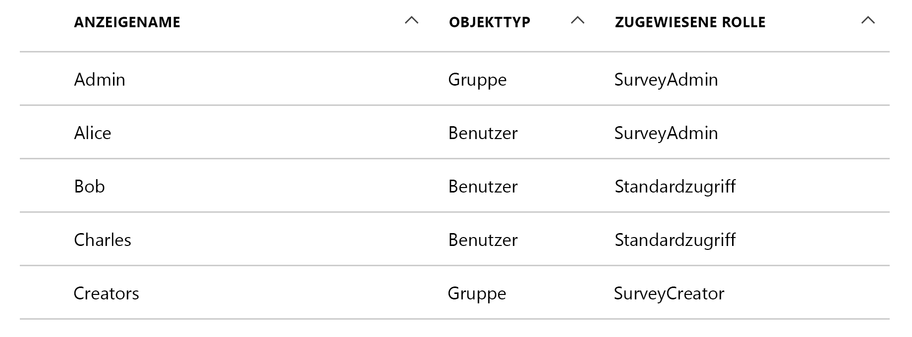
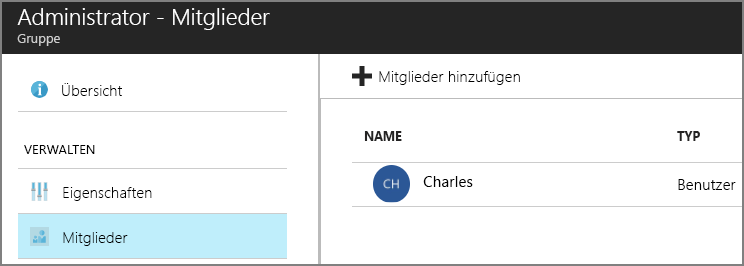

# <a name="application-roles"></a>Anwendungsrollen

[-Beispielcode][sample application]

Anwendungsrollen werden verwendet, um Benutzern Berechtigungen zuzuweisen. Die [Tailspin Surveys][Tailspin]-Anwendung definiert beispielsweise die folgenden Rollen:

* Administrator. Kann alle Erstellungs-, Lese-, Aktualisierungs- und Löschaktionen auf alle Umfragen anwenden, die zu diesem Mandanten gehören.
* Creator (Ersteller). Kann neue Umfragen erstellen.
* Reader (Leser). Kann alle Umfragen lesen, die zu diesem Mandanten gehören.

Sie sehen, dass Rollen während der [Autorisierung]in Berechtigungen übersetzt werden. Doch zuerst stellt sich die Frage, wie Rollen zugewiesen und verwaltet werden. Es gibt im Wesentlichen drei Möglichkeiten:

* [Azure AD-App-Rollen](#roles-using-azure-ad-app-roles)
* [Azure AD-Sicherheitsgruppen](#roles-using-azure-ad-security-groups)
* [Anwendungsrollen-Manager](#roles-using-an-application-role-manager)

## <a name="roles-using-azure-ad-app-roles"></a>Rollen auf Grundlage von Azure AD-App-Rollen
Dies ist der Ansatz, den wir für die Tailspin-App „Surveys“ gewählt haben.

Bei diesem Ansatz legt der SaaS-Anbieter Anwendungsrollen fest, indem diese dem Anwendungsmanifest hinzugefügt werden. Nachdem sich ein Kunde registriert hat, werden Benutzern von einem Administrator des AD-Verzeichnisses Rollen zugewiesen. Wenn sich ein Benutzer anmeldet, werden die dem Benutzer zugewiesenen Rollen als Ansprüche gesendet.

> [!NOTE]
> Wenn der Kunde über Azure AD Premium verfügt, kann der Administrator eine Sicherheitsgruppe zu einer Rolle zuweisen, und die Mitglieder der Gruppe erben die App-Rolle. Dies ist eine praktische Möglichkeit, Rollen zu verwalten, da der Gruppenbesitzer kein AD-Administrator sein muss.
> 
> 

Vorteile dieses Ansatzes:

* Einfaches Programmiermodell.
* Rollen sind anwendungsspezifisch. Die Rollenansprüche für eine Anwendung werden nicht an eine andere Anwendung gesendet.
* Wenn der Kunde die Anwendung aus seinem AD-Mandanten entfernt, werden die Rollen entfernt.
* Die Anwendung benötigt keinen zusätzlichen Active Directory-Berechtigungen außer der Leseberechtigung für das Profil des Benutzers.

Nachteile:

* Kunden ohne Azure AD Premium können Rollen keine Sicherheitsgruppen zuweisen. Für diese Kunden müssen alle Benutzerzuweisungen durch einen AD-Administrator erfolgen.
* Wenn Sie eine Back-End-Web-API haben, die von der Web-App getrennt ist, gelten die Rollenzuweisungen für die Web-App nicht für die Web-API. Informationen zu diesem Punkt finden Sie unter [Schützen einer Back-End-Web-API].

### <a name="implementation"></a>Implementierung
**Definieren der Rollen.** Der SaaS-Anbieter deklariert die App-Rollen im [Anwendungsmanifest]. Hier ein Beispiel des Manifesteintrags für die App „Surveys“.

```
"appRoles": [
  {
    "allowedMemberTypes": [
      "User"
    ],
    "description": "Creators can create Surveys",
    "displayName": "SurveyCreator",
    "id": "1b4f816e-5eaf-48b9-8613-7923830595ad",
    "isEnabled": true,
    "value": "SurveyCreator"
  },
  {
    "allowedMemberTypes": [
      "User"
    ],
    "description": "Administrators can manage the Surveys in their tenant",
    "displayName": "SurveyAdmin",
    "id": "c20e145e-5459-4a6c-a074-b942bbd4cfe1",
    "isEnabled": true,
    "value": "SurveyAdmin"
  }
],
```

Die `value`-Eigenschaft wird im Rollenanspruch angezeigt. Die `id` -Eigenschaft ist der eindeutige Bezeichner der definierten Rolle. Generieren Sie für `id`immer einen neuen GUID-Wert.

**Benutzer zuweisen**. Wenn sich ein neuer Kunde registriert, wird die Anwendung im AD-Mandanten des Kunden registriert. An diesem Punkt kann ein AD-Administrator für diesen Mandanten Benutzer Rollen zuweisen.

> [!NOTE]
> Wie zuvor erwähnt, können Kunden mit Azure AD Premium Sicherheitsgruppen zu Rollen zuweisen.
> 
> 

Der folgende Screenshot aus dem Azure-Portal zeigt Benutzer und Gruppen für die Survey-Anwendung. „Admin“ und „Creator“ sind Gruppen, die den Rollen SurveyAdmin bzw. SurveyCreator zugewiesen wurden. Alice ist eine Benutzerin, die direkt der SurveyAdmin-Rolle zugewiesen wurde. Bob und Charles sind Benutzer, die noch nicht direkt einer Rolle zugewiesen wurden.



Wie im folgenden Screenshot gezeigt, gehört Charles zur Gruppe „Admin“ und erbt daher die SurveyAdmin-Rolle. Bob wurde noch keiner Rolle zugewiesen.




> [!NOTE]
> Ein alternativer Ansatz besteht darin, dass die Anwendung Rollen programmgesteuert über die Azure AD-Graph-API zuweist. Dazu muss die Anwendung jedoch Schreibberechtigungen für das AD-Verzeichnis des Kunden erhalten. Eine Anwendung mit solchen Berechtigungen könnte eine Menge Unheil anrichten – der Kunde muss darauf vertrauen, dass die App keinen Schaden im Verzeichnis verursacht. Viele Kunden werden einen Zugriff auf dieser Ebene nicht gewähren.
> 

**Rollenansprüche abrufen**. Wenn sich ein Benutzer anmeldet, empfängt die Anwendung die dem Benutzer zugewiesenen Rollen in einem Anspruch des Typs `http://schemas.microsoft.com/ws/2008/06/identity/claims/role`.  

Ein Benutzer kann mehrere Rollen oder keine Rolle haben. Setzen Sie in Ihrem Autorisierungscode nicht voraus, dass der Benutzer genau einen Rollenanspruch aufweist. Schreiben Sie stattdessen Code, der prüft, ob ein bestimmter Anspruchswert vorhanden ist:

```csharp
if (context.User.HasClaim(ClaimTypes.Role, "Admin")) { ... }
```

## <a name="roles-using-azure-ad-security-groups"></a>Rollen auf Grundlage von Azure AD-Sicherheitsgruppen
Bei diesem Ansatz werden Rollen als AD-Sicherheitsgruppen dargestellt. Die Anwendung weist Berechtigungen für Benutzer anhand ihrer Mitgliedschaft in Sicherheitsgruppen zu.

Vorteile:

* Kunden ohne Azure AD Premium ermöglicht dieser Ansatz das Verwenden von Sicherheitsgruppen zum Verwalten von Rollenzuweisungen.

Nachteile:

* Komplexität. Da jeder Mandant verschiedene Gruppenansprüche sendet, muss die App für jeden Mandanten nachverfolgen, welche Sicherheitsgruppen zu welchen Anwendungsrollen gehören.
* Wenn der Kunde die Anwendung aus seinem AD-Mandanten entfernt, verbleiben die Sicherheitsgruppen in seinem AD-Verzeichnis.

### <a name="implementation"></a>Implementierung
Legen Sie im Anwendungsmanifest die `groupMembershipClaims` -Eigenschaft auf „SecurityGroup“ fest. Dies ist erforderlich, um Ansprüche von Gruppenmitgliedschaften aus AAD abzurufen.

```
{
   // ...
   "groupMembershipClaims": "SecurityGroup",
}
```

Wenn sich ein neuer Kunde registriert, weist die Anwendung den Kunden an, Sicherheitsgruppen für die Rollen zu erstellen, die von der Anwendung benötigt werden. Der Kunde muss anschließend die Gruppenobjekt-IDs in die Anwendung eingeben. Die Anwendung speichert diese in einer Tabelle, die Gruppen-IDs Anwendungsrollen mandantenbezogen zuordnet.

> [!NOTE]
> Alternativ dazu könnte die Anwendung die Gruppen über die Azure AD-Graph-API programmgesteuert erstellen.  Dieses Verfahren wäre weniger fehleranfällig. Dazu muss die Anwendung jedoch Lese- und Schreibberechtigungen für alle Gruppen für das AD-Verzeichnis des Kunden erhalten. Viele Kunden werden einen Zugriff auf dieser Ebene nicht gewähren.
> 
> 

Wenn sich ein Benutzer anmeldet:

1. Die Anwendung empfängt die Gruppen des Benutzers als Ansprüche. Der Wert jedes Anspruchs ist die Objekt-ID einer Gruppe.
2. Azure AD schränkt die Anzahl der Gruppen ein, die im Token gesendet werden. Wenn die Anzahl der Gruppen diesen Grenzwert überschreitet, sendet Azure AD einen speziellen „Überschreitungsanspruch“. Wenn diesen Anspruch vorhanden ist, muss die Anwendung die Azure AD Graph-API abfragen, um alle Gruppen abzurufen, denen der Benutzer angehört. Weitere Informationen finden Sie unter [Autorisierung in Cloudanwendungen mit AD-Gruppen] im Abschnitt „Gruppenanspruchsüberschreitung“.
3. Die Anwendung schlägt die Objekt-IDs in ihrer eigenen Datenbank nach, um die entsprechenden Anwendungsrollen zu suchen, die dem Benutzer zuzuweisen sind.
4. Die Anwendung fügt dem Benutzerprinzipal einen benutzerdefinierten Anspruchswert hinzu, der die Anwendungsrolle ausdrückt. Beispiel: `survey_role` = „SurveyAdmin“.

Autorisierungsrichtlinien müssen den benutzerdefinierten Rollenanspruch und nicht den Gruppenanspruch verwenden.

## <a name="roles-using-an-application-role-manager"></a>Rollen auf Grundlage eines Anwendungsrollen-Managers
Bei diesem Ansatz werden Anwendungsrollen überhaupt nicht in Azure AD gespeichert. Stattdessen speichert die Anwendung die Rollenzuweisungen für jeden Benutzer in der eigenen Datenbank, z.B. über die **RoleManager**-Klasse in ASP.NET Identity.

Vorteile:

* Die App hat die vollständige Kontrolle über die Rollen und Benutzerzuweisungen.

Nachteile:

* Komplexer, schwieriger zu verwalten.
* AD-Sicherheitsgruppen können nicht zum Verwalten von Rollenzuweisungen verwendet werden.
* Benutzerinformationen werden in der Anwendungsdatenbank gespeichert und können die Synchronität mit dem AD-Verzeichnis des Mandanten verlieren, wenn Benutzer hinzugefügt oder entfernt werden.   


[**Weiter**][Autorisierung]

<!-- Links -->
[Tailspin]: tailspin.md

[Autorisierung]: authorize.md
[Schützen einer Back-End-Web-API]: web-api.md
[Anwendungsmanifest]: /azure/active-directory/active-directory-application-manifest/
[sample application]: https://github.com/mspnp/multitenant-saas-guidance
