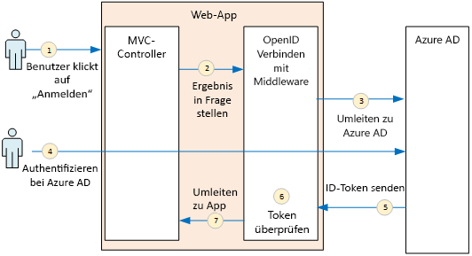
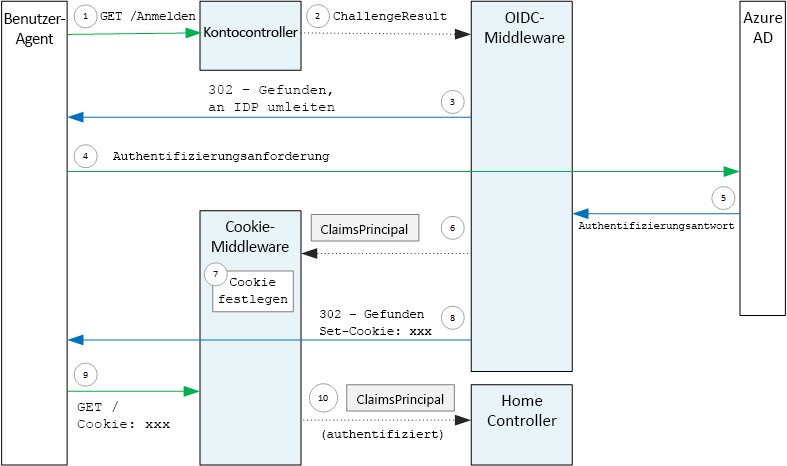

# <a name="authenticate-using-azure-ad-and-openid-connect"></a><span data-ttu-id="065da-103">Authentifizieren mithilfe von Azure AD und OpenID Connect</span><span class="sxs-lookup"><span data-stu-id="065da-103">Authenticate using Azure AD and OpenID Connect</span></span>

<span data-ttu-id="065da-104">[-Beispielcode][sample application]</span><span class="sxs-lookup"><span data-stu-id="065da-104">[ Sample code][sample application]</span></span>

<span data-ttu-id="065da-105">Die Surveys-Anwendung verwendet das OIDC-Protokoll (OpenID Connect), um Benutzer bei Azure Active Directory (Azure AD) zu authentifizieren.</span><span class="sxs-lookup"><span data-stu-id="065da-105">The Surveys application uses the OpenID Connect (OIDC) protocol to authenticate users with Azure Active Directory (Azure AD).</span></span> <span data-ttu-id="065da-106">Die Surveys-Anwendung verwendet ASP.NET Core, das über integrierte Middleware für OIDC verfügt.</span><span class="sxs-lookup"><span data-stu-id="065da-106">The Surveys application uses ASP.NET Core, which has built-in middleware for OIDC.</span></span> <span data-ttu-id="065da-107">Im folgenden Diagramm wird dargestellt, was geschieht, wenn sich der Benutzer auf übergeordneter Ebene anmeldet.</span><span class="sxs-lookup"><span data-stu-id="065da-107">The following diagram shows what happens when the user signs in, at a high level.</span></span>



1. <span data-ttu-id="065da-109">Der Benutzer klickt in der App auf die Schaltfläche „Anmelden“.</span><span class="sxs-lookup"><span data-stu-id="065da-109">The user clicks the "sign in" button in the app.</span></span> <span data-ttu-id="065da-110">Diese Aktion wird von einem MVC-Controller bearbeitet.</span><span class="sxs-lookup"><span data-stu-id="065da-110">This action is handled by an MVC controller.</span></span>
2. <span data-ttu-id="065da-111">Der MVC-Controller gibt eine **ChallengeResult** -Aktion zurück.</span><span class="sxs-lookup"><span data-stu-id="065da-111">The MVC controller returns a **ChallengeResult** action.</span></span>
3. <span data-ttu-id="065da-112">Die Middleware fängt die **ChallengeResult** -Aktion ab, und erstellt eine 302-Antwort, die den Benutzer auf die Azure AD-Anmeldeseite umleitet.</span><span class="sxs-lookup"><span data-stu-id="065da-112">The middleware intercepts the **ChallengeResult** and creates a 302 response, which redirects the user to the Azure AD sign-in page.</span></span>
4. <span data-ttu-id="065da-113">Der Benutzer authentifiziert sich mit Azure AD.</span><span class="sxs-lookup"><span data-stu-id="065da-113">The user authenticates with Azure AD.</span></span>
5. <span data-ttu-id="065da-114">Azure AD sendet ein ID-Token an die Anwendung.</span><span class="sxs-lookup"><span data-stu-id="065da-114">Azure AD sends an ID token to the application.</span></span>
6. <span data-ttu-id="065da-115">Die Middleware überprüft das ID-Token.</span><span class="sxs-lookup"><span data-stu-id="065da-115">The middleware validates the ID token.</span></span> <span data-ttu-id="065da-116">Der Benutzer ist jetzt in der Anwendung authentifiziert.</span><span class="sxs-lookup"><span data-stu-id="065da-116">At this point, the user is now authenticated inside the application.</span></span>
7. <span data-ttu-id="065da-117">Die Middleware leitet den Benutzer zur Anwendung zurück.</span><span class="sxs-lookup"><span data-stu-id="065da-117">The middleware redirects the user back to application.</span></span>

## <a name="register-the-app-with-azure-ad"></a><span data-ttu-id="065da-118">Registrieren der App bei Azure AD</span><span class="sxs-lookup"><span data-stu-id="065da-118">Register the app with Azure AD</span></span>
<span data-ttu-id="065da-119">Um OpenID Connect zu aktivieren, registriert der SaaS-Anbieter die Anwendung in seinen eigenen Azure AD-Mandanten.</span><span class="sxs-lookup"><span data-stu-id="065da-119">To enable OpenID Connect, the SaaS provider registers the application inside their own Azure AD tenant.</span></span>

<span data-ttu-id="065da-120">Um die Anwendung zu registrieren, führen Sie die Schritte im Abschnitt [Hinzufügen einer Anwendung](/azure/active-directory/active-directory-integrating-applications/#adding-an-application) des Artikels [Integrieren von Anwendungen in Azure Active Directory](/azure/active-directory/active-directory-integrating-applications/) aus.</span><span class="sxs-lookup"><span data-stu-id="065da-120">To register the application, follow the steps in [Integrating Applications with Azure Active Directory](/azure/active-directory/active-directory-integrating-applications/), in the section [Adding an Application](/azure/active-directory/active-directory-integrating-applications/#adding-an-application).</span></span>

<span data-ttu-id="065da-121">Die spezifischen Schritte für die Surveys-Anwendung finden Sie unter [Ausführen der Surveys-Anwendung](./run-the-app.md).</span><span class="sxs-lookup"><span data-stu-id="065da-121">See [Run the Surveys application](./run-the-app.md) for the specific steps for the Surveys application.</span></span> <span data-ttu-id="065da-122">Beachten Sie Folgendes:</span><span class="sxs-lookup"><span data-stu-id="065da-122">Note the following:</span></span>

- <span data-ttu-id="065da-123">In einer mehrinstanzenfähigen Anwendung müssen Sie die Mehrinstanzenfähigkeit explizit konfigurieren.</span><span class="sxs-lookup"><span data-stu-id="065da-123">For a multitenant application, you must configure the multi-tenanted option explicitly.</span></span> <span data-ttu-id="065da-124">Dies ermöglicht anderen Organisationen den Zugriff auf die Anwendung.</span><span class="sxs-lookup"><span data-stu-id="065da-124">This enables other organizations to to access the application.</span></span>

- <span data-ttu-id="065da-125">Bei der Antwort-URL handelt es sich um die URL, an die Azure AD OAuth 2.0-Antworten sendet.</span><span class="sxs-lookup"><span data-stu-id="065da-125">The reply URL is the URL where Azure AD will send OAuth 2.0 responses.</span></span> <span data-ttu-id="065da-126">Bei Verwendung von ASP.NET Core muss dieser Wert dem Pfad entsprechen, den Sie in der Authentifizierungsmiddleware konfigurieren (siehe nächster Abschnitt),</span><span class="sxs-lookup"><span data-stu-id="065da-126">When using the ASP.NET Core, this needs to match the path that you configure in the authentication middleware (see next section),</span></span> 

## <a name="configure-the-auth-middleware"></a><span data-ttu-id="065da-127">Konfigurieren der Authentifizierungsmiddleware</span><span class="sxs-lookup"><span data-stu-id="065da-127">Configure the auth middleware</span></span>
<span data-ttu-id="065da-128">Dieser Abschnitt beschreibt, wie die Authentifizierungsmiddleware in ASP.NET Core für die Authentifizierung mehrerer Mandanten mit OpenID Connect konfiguriert wird.</span><span class="sxs-lookup"><span data-stu-id="065da-128">This section describes how to configure the authentication middleware in ASP.NET Core for multitenant authentication with OpenID Connect.</span></span>

<span data-ttu-id="065da-129">Fügen Sie in Ihrer [Startklasse](/aspnet/core/fundamentals/startup) die OpenID Connect-Middleware hinzu:</span><span class="sxs-lookup"><span data-stu-id="065da-129">In your [startup class](/aspnet/core/fundamentals/startup), add the OpenID Connect middleware:</span></span>

```csharp
app.UseOpenIdConnectAuthentication(new OpenIdConnectOptions {
    ClientId = configOptions.AzureAd.ClientId,
    ClientSecret = configOptions.AzureAd.ClientSecret, // for code flow
    Authority = Constants.AuthEndpointPrefix,
    ResponseType = OpenIdConnectResponseType.CodeIdToken,
    PostLogoutRedirectUri = configOptions.AzureAd.PostLogoutRedirectUri,
    SignInScheme = CookieAuthenticationDefaults.AuthenticationScheme,
    TokenValidationParameters = new TokenValidationParameters { ValidateIssuer = false },
    Events = new SurveyAuthenticationEvents(configOptions.AzureAd, loggerFactory),
});
```

<span data-ttu-id="065da-130">Beachten Sie, dass einige der Einstellungen aus Optionen der Laufzeitkonfiguration entnommen werden.</span><span class="sxs-lookup"><span data-stu-id="065da-130">Notice that some of the settings are taken from runtime configuration options.</span></span> <span data-ttu-id="065da-131">Die Middlewareoptionen bedeuten Folgendes:</span><span class="sxs-lookup"><span data-stu-id="065da-131">Here's what the middleware options mean:</span></span>

* <span data-ttu-id="065da-132">**ClientId**.</span><span class="sxs-lookup"><span data-stu-id="065da-132">**ClientId**.</span></span> <span data-ttu-id="065da-133">Dies ist die Client-ID der Anwendung, die Sie erhalten haben, als Sie die Anwendung in Azure AD registriert haben.</span><span class="sxs-lookup"><span data-stu-id="065da-133">The application's client ID, which you got when you registered the application in Azure AD.</span></span>
* <span data-ttu-id="065da-134">**Authority**.</span><span class="sxs-lookup"><span data-stu-id="065da-134">**Authority**.</span></span> <span data-ttu-id="065da-135">Legen Sie diese Einstellung für eine mehrinstanzenfähige Anwendung auf `https://login.microsoftonline.com/common/` fest.</span><span class="sxs-lookup"><span data-stu-id="065da-135">For a multitenant application, set this to `https://login.microsoftonline.com/common/`.</span></span> <span data-ttu-id="065da-136">Dies ist die URL für den gemeinsamen Azure AD-Endpunkt, über den sich Benutzer aller Azure AD-Mandanten anmelden können.</span><span class="sxs-lookup"><span data-stu-id="065da-136">This is the URL for the Azure AD common endpoint, which enables users from any Azure AD tenant to sign in.</span></span> <span data-ttu-id="065da-137">Weitere Informationen über den gemeinsamen Endpunkt finden Sie in diesem [Blogbeitrag](http://www.cloudidentity.com/blog/2014/08/26/the-common-endpoint-walks-like-a-tenant-talks-like-a-tenant-but-is-not-a-tenant/).</span><span class="sxs-lookup"><span data-stu-id="065da-137">For more information about the common endpoint, see [this blog post](http://www.cloudidentity.com/blog/2014/08/26/the-common-endpoint-walks-like-a-tenant-talks-like-a-tenant-but-is-not-a-tenant/).</span></span>
* <span data-ttu-id="065da-138">Legen Sie unter **TokenValidationParameters** den Parameter **ValidateIssuer** auf „false“ fest.</span><span class="sxs-lookup"><span data-stu-id="065da-138">In **TokenValidationParameters**, set **ValidateIssuer** to false.</span></span> <span data-ttu-id="065da-139">Dies bedeutet, dass die App für die Überprüfung des Ausstellerwerts im ID-Token zuständig ist.</span><span class="sxs-lookup"><span data-stu-id="065da-139">That means the app will be responsible for validating the issuer value in the ID token.</span></span> <span data-ttu-id="065da-140">(Die Middleware überprüft das Token weiterhin selbst.) Weitere Informationen zum Überprüfen des Ausstellers finden Sie unter [Überprüfung des Ausstellers](claims.md#issuer-validation).</span><span class="sxs-lookup"><span data-stu-id="065da-140">(The middleware still validates the token itself.) For more information about validating the issuer, see [Issuer validation](claims.md#issuer-validation).</span></span>
* <span data-ttu-id="065da-141">**PostLogoutRedirectUri**.</span><span class="sxs-lookup"><span data-stu-id="065da-141">**PostLogoutRedirectUri**.</span></span> <span data-ttu-id="065da-142">Geben Sie eine URL an, an die Benutzer nach dem Abmelden weitergeleitet werden. Hierbei sollte es sich um eine Seite handeln, die anonyme Anforderungen zulässt – typischerweise die Startseite.</span><span class="sxs-lookup"><span data-stu-id="065da-142">Specify a URL to redirect users after the sign out. This should be a page that allows anonymous requests &mdash; typically the home page.</span></span>
* <span data-ttu-id="065da-143">**SignInScheme**.</span><span class="sxs-lookup"><span data-stu-id="065da-143">**SignInScheme**.</span></span> <span data-ttu-id="065da-144">Legen Sie diesen Eintrag auf `CookieAuthenticationDefaults.AuthenticationScheme`fest.</span><span class="sxs-lookup"><span data-stu-id="065da-144">Set this to `CookieAuthenticationDefaults.AuthenticationScheme`.</span></span> <span data-ttu-id="065da-145">Diese Einstellung bedeutet, dass die Benutzeransprüche nach der Authentifizierung des Benutzers lokal in einem Cookie gespeichert werden.</span><span class="sxs-lookup"><span data-stu-id="065da-145">This setting means that after the user is authenticated, the user claims are stored locally in a cookie.</span></span> <span data-ttu-id="065da-146">Dieses Cookie legt fest, wie der Benutzer während der Browsersitzung angemeldet bleibt.</span><span class="sxs-lookup"><span data-stu-id="065da-146">This cookie is how the user stays logged in during the browser session.</span></span>
* <span data-ttu-id="065da-147">**Ereignisse.**</span><span class="sxs-lookup"><span data-stu-id="065da-147">**Events.**</span></span> <span data-ttu-id="065da-148">Ereignisrückrufe: siehe [Authentifizierungsereignisse](#authentication-events).</span><span class="sxs-lookup"><span data-stu-id="065da-148">Event callbacks; see [Authentication events](#authentication-events).</span></span>

<span data-ttu-id="065da-149">Fügen Sie außerdem die Middleware für die Cookie-Authentifizierung zur Pipeline hinzu.</span><span class="sxs-lookup"><span data-stu-id="065da-149">Also add the Cookie Authentication middleware to the pipeline.</span></span> <span data-ttu-id="065da-150">Diese Middleware ist dafür verantwortlich, die Benutzeransprüche in ein Cookie zu schreiben, und es im Anschluss aus einem Cookie auszulesen, während Seiten geladen werden.</span><span class="sxs-lookup"><span data-stu-id="065da-150">This middleware is responsible for writing the user claims to a cookie, and then reading the cookie during subsequent page loads.</span></span>

```csharp
app.UseCookieAuthentication(new CookieAuthenticationOptions {
    AutomaticAuthenticate = true,
    AutomaticChallenge = true,
    AccessDeniedPath = "/Home/Forbidden",
    CookieSecure = CookieSecurePolicy.Always,

    // The default setting for cookie expiration is 14 days. SlidingExpiration is set to true by default
    ExpireTimeSpan = TimeSpan.FromHours(1),
    SlidingExpiration = true
});
```

## <a name="initiate-the-authentication-flow"></a><span data-ttu-id="065da-151">Initiieren des Authentifizierungsflusses</span><span class="sxs-lookup"><span data-stu-id="065da-151">Initiate the authentication flow</span></span>
<span data-ttu-id="065da-152">Zum Starten des Authentifizierungsflusses in ASP.NET MVC geben Sie ein **ChallengeResult** aus dem Controller zurück:</span><span class="sxs-lookup"><span data-stu-id="065da-152">To start the authentication flow in ASP.NET MVC, return a **ChallengeResult** from the contoller:</span></span>

```csharp
[AllowAnonymous]
public IActionResult SignIn()
{
    return new ChallengeResult(
        OpenIdConnectDefaults.AuthenticationScheme,
        new AuthenticationProperties
        {
            IsPersistent = true,
            RedirectUri = Url.Action("SignInCallback", "Account")
        });
}
```

<span data-ttu-id="065da-153">Dies bewirkt, dass die Middleware eine 302 (Found)-Antwort zurückgibt, mit der zum Authentifizierungsendpunkt weitergeleitet wird.</span><span class="sxs-lookup"><span data-stu-id="065da-153">This causes the middleware to return a 302 (Found) response that redirects to the authentication endpoint.</span></span>

## <a name="user-login-sessions"></a><span data-ttu-id="065da-154">Benutzeranmeldesitzungen</span><span class="sxs-lookup"><span data-stu-id="065da-154">User login sessions</span></span>
<span data-ttu-id="065da-155">Wie bereits erwähnt, schreibt die Middleware für die Cookie-Authentifizierung die Benutzeransprüche in ein Cookie, wenn sich der Benutzer zum ersten Mal anmeldet.</span><span class="sxs-lookup"><span data-stu-id="065da-155">As mentioned, when the user first signs in, the Cookie Authentication middleware writes the user claims to a cookie.</span></span> <span data-ttu-id="065da-156">Danach werden HTTP-Anforderungen authentifiziert, indem das Cookie gelesen wird.</span><span class="sxs-lookup"><span data-stu-id="065da-156">After that, HTTP requests are authenticated by reading the cookie.</span></span>

<span data-ttu-id="065da-157">Standardmäßig schreibt die Cookiemiddleware ein [Sitzungscookie][session-cookie], das gelöscht wird, sobald der Benutzer den Browser schließt.</span><span class="sxs-lookup"><span data-stu-id="065da-157">By default, the cookie middleware writes a [session cookie][session-cookie], which gets deleted once the user closes the browser.</span></span> <span data-ttu-id="065da-158">Wenn der Benutzer die Seite das nächste Mal besucht, muss er sich erneut anmelden.</span><span class="sxs-lookup"><span data-stu-id="065da-158">The next time the user next visits the site, they will have to sign in again.</span></span> <span data-ttu-id="065da-159">Wenn Sie jedoch den Parameter **IsPersistent** in **ChallengeResult** auf „true“ festlegen, schreibt die Middleware ein dauerhaftes Cookie, sodass der Benutzer auch nach Schließen des Browsers angemeldet bleibt.</span><span class="sxs-lookup"><span data-stu-id="065da-159">However, if you set **IsPersistent** to true in the **ChallengeResult**, the middleware writes a persistent cookie, so the user stays logged in after closing the browser.</span></span> <span data-ttu-id="065da-160">Sie können den Ablauf der Cookies konfigurieren. Informationen dazu finden Sie unter [Steuern von Cookieoptionen][cookie-options].</span><span class="sxs-lookup"><span data-stu-id="065da-160">You can configure the cookie expiration; see [Controlling cookie options][cookie-options].</span></span> <span data-ttu-id="065da-161">Dauerhafte Cookies sind praktischer für die Benutzer, aber für einige Anwendungen ungeeignet, bei denen sich die Benutzer jedes Mal erneut anmelden sollen (beispielsweise eine Bankinganwendung).</span><span class="sxs-lookup"><span data-stu-id="065da-161">Persistent cookies are more convenient for the user, but may be inappropriate for some applications (say, a banking application) where you want the user to sign in every time.</span></span>

## <a name="about-the-openid-connect-middleware"></a><span data-ttu-id="065da-162">Informationen über die OpenID Connect-Middleware</span><span class="sxs-lookup"><span data-stu-id="065da-162">About the OpenID Connect middleware</span></span>
<span data-ttu-id="065da-163">Die OpenID Connect-Middleware in ASP.NET verbirgt die meisten Protokolldetails.</span><span class="sxs-lookup"><span data-stu-id="065da-163">The OpenID Connect middleware in ASP.NET hides most of the protocol details.</span></span> <span data-ttu-id="065da-164">Dieser Abschnitt enthält einige Hinweise zur Implementierung, die für das Verständnis des Protokollflusses nützlich sein können.</span><span class="sxs-lookup"><span data-stu-id="065da-164">This section contains some notes about the implementation, that may be useful for understanding the protocol flow.</span></span>

<span data-ttu-id="065da-165">Zunächst sehen wir uns den Authentifizierungsablauf in Bezug auf ASP.NET an (dabei ignorieren wir die Details des Protokollflusses von OIDC zwischen der App und Azure AD).</span><span class="sxs-lookup"><span data-stu-id="065da-165">First, let's examine the authentication flow in terms of ASP.NET (ignoring the details of the OIDC protocol flow between the app and Azure AD).</span></span> <span data-ttu-id="065da-166">Im folgenden Diagramm wird der Prozess veranschaulicht.</span><span class="sxs-lookup"><span data-stu-id="065da-166">The following diagram shows the process.</span></span>



<span data-ttu-id="065da-168">In diesem Diagramm gibt es zwei MVC-Controller.</span><span class="sxs-lookup"><span data-stu-id="065da-168">In this diagram, there are two MVC controllers.</span></span> <span data-ttu-id="065da-169">Der Kontocontroller verarbeitet Anmeldeanforderungen, und der Home-Controller verarbeitet die Homepage.</span><span class="sxs-lookup"><span data-stu-id="065da-169">The Account controller handles sign-in requests, and the Home controller serves up the home page.</span></span>

<span data-ttu-id="065da-170">So verläuft der Authentifizierungsprozess:</span><span class="sxs-lookup"><span data-stu-id="065da-170">Here is the authentication process:</span></span>

1. <span data-ttu-id="065da-171">Der Benutzer klickt auf die Schaltfläche „Anmelden“, und der Browser sendet eine GET-Anforderung.</span><span class="sxs-lookup"><span data-stu-id="065da-171">The user clicks the "Sign in" button, and the browser sends a GET request.</span></span> <span data-ttu-id="065da-172">Beispiel: `GET /Account/SignIn/`.</span><span class="sxs-lookup"><span data-stu-id="065da-172">For example: `GET /Account/SignIn/`.</span></span>
2. <span data-ttu-id="065da-173">Der Kontocontroller gibt ein `ChallengeResult`zurück</span><span class="sxs-lookup"><span data-stu-id="065da-173">The account controller returns a `ChallengeResult`.</span></span>
3. <span data-ttu-id="065da-174">Die OIDC-Middleware gibt eine HTTP 302-Antwort zurück, die zu Azure AD umleitet.</span><span class="sxs-lookup"><span data-stu-id="065da-174">The OIDC middleware returns an HTTP 302 response, redirecting to Azure AD.</span></span>
4. <span data-ttu-id="065da-175">Der Browser sendet die Authentifizierungsanforderung an Azure AD.</span><span class="sxs-lookup"><span data-stu-id="065da-175">The browser sends the authentication request to Azure AD</span></span>
5. <span data-ttu-id="065da-176">Der Benutzer meldet sich bei Azure AD an, und Azure AD sendet eine Authentifizierungsantwort zurück.</span><span class="sxs-lookup"><span data-stu-id="065da-176">The user signs in to Azure AD, and Azure AD sends back an authentication response.</span></span>
6. <span data-ttu-id="065da-177">Die OIDC-Middleware erstellt einen Anforderungsprinzipal und übergibt diesen der Middleware zur Cookie-Authentifizierung.</span><span class="sxs-lookup"><span data-stu-id="065da-177">The OIDC middleware creates a claims principal and passes it to the Cookie Authentication middleware.</span></span>
7. <span data-ttu-id="065da-178">Die Cookie-Middleware serialisiert den Anforderungsprinzipal und setzt ein Cookie.</span><span class="sxs-lookup"><span data-stu-id="065da-178">The cookie middleware serializes the claims principal and sets a cookie.</span></span>
8. <span data-ttu-id="065da-179">Die OIDC-Middleware leitet an die Rückruf-URL der Anwendung zurück.</span><span class="sxs-lookup"><span data-stu-id="065da-179">The OIDC middleware redirects to the application's callback URL.</span></span>
9. <span data-ttu-id="065da-180">Der Browser folgt der Umleitung, und sendet das Cookie in der Anforderung.</span><span class="sxs-lookup"><span data-stu-id="065da-180">The browser follows the redirect, sending the cookie in the request.</span></span>
10. <span data-ttu-id="065da-181">Die Cookie-Middleware deserialisiert das Cookie in einen Anforderungsprinzipal und setzt `HttpContext.User` mit dem Anforderungsprinzipal gleich.</span><span class="sxs-lookup"><span data-stu-id="065da-181">The cookie middleware deserializes the cookie to a claims principal and sets `HttpContext.User` equal to the claims principal.</span></span> <span data-ttu-id="065da-182">Die Anforderung wird an einen MVC-Controller weitergeleitet.</span><span class="sxs-lookup"><span data-stu-id="065da-182">The request is routed to an MVC controller.</span></span>

### <a name="authentication-ticket"></a><span data-ttu-id="065da-183">Authentifizierungsticket</span><span class="sxs-lookup"><span data-stu-id="065da-183">Authentication ticket</span></span>
<span data-ttu-id="065da-184">Wenn die Authentifizierung erfolgreich ist, erstellt die OIDC-Middleware ein Authentifizierungsticket mit einem Anspruchsprinzipal, der die Ansprüche des Benutzers enthält.</span><span class="sxs-lookup"><span data-stu-id="065da-184">If authentication succeeds, the OIDC middleware creates an authentication ticket, which contains a claims principal that holds the user's claims.</span></span> <span data-ttu-id="065da-185">Sie können im **AuthenticationValidated**- oder **TicketReceived**-Ereignis auf das Ticket zugreifen.</span><span class="sxs-lookup"><span data-stu-id="065da-185">You can access the ticket inside the **AuthenticationValidated** or **TicketReceived** event.</span></span>

> [!NOTE]
> <span data-ttu-id="065da-186">Bis der Authentifizierungsfluss vollständig abgeschlossen ist, enthält `HttpContext.User` weiterhin einen anonymen Prinzipal, *nicht* den authentifizierten Benutzer.</span><span class="sxs-lookup"><span data-stu-id="065da-186">Until the entire authentication flow is completed, `HttpContext.User` still holds an anonymous principal,  *not* the authenticated user.</span></span> <span data-ttu-id="065da-187">Der anonyme Prinzipal hat eine leere Auflistung von Ansprüchen.</span><span class="sxs-lookup"><span data-stu-id="065da-187">The anonymous principal has an empty claims collection.</span></span> <span data-ttu-id="065da-188">Wenn die Authentifizierung abgeschlossen ist, und die App weiterleitet, deserialisiert die Cookie-Middleware das Authentifizierungscookie und legt `HttpContext.User` auf einen Anspruchsprinzipal fest, der den authentifizierten Benutzer darstellt.</span><span class="sxs-lookup"><span data-stu-id="065da-188">After authentication completes and the app redirects, the cookie middleware deserializes the authentication cookie and sets `HttpContext.User` to a claims principal that represents the authenticated user.</span></span>
> 
> 

### <a name="authentication-events"></a><span data-ttu-id="065da-189">Authentifizierungsereignisse</span><span class="sxs-lookup"><span data-stu-id="065da-189">Authentication events</span></span>
<span data-ttu-id="065da-190">Während des Authentifizierungsvorgangs löst die OpenID Connect-Middleware eine Reihe von Ereignissen aus:</span><span class="sxs-lookup"><span data-stu-id="065da-190">During the authentication process, the OpenID Connect middleware raises a series of events:</span></span>

* <span data-ttu-id="065da-191">**RedirectToIdentityProvider**.</span><span class="sxs-lookup"><span data-stu-id="065da-191">**RedirectToIdentityProvider**.</span></span> <span data-ttu-id="065da-192">Wird aufgerufen, unmittelbar bevor die Middleware an den Authentifizierungsendpunkt umleitet.</span><span class="sxs-lookup"><span data-stu-id="065da-192">Called right before the middleware redirects to the authentication endpoint.</span></span> <span data-ttu-id="065da-193">Sie können dieses Ereignis verwenden, um die Umleitungs-URL zu ändern und beispielsweise Anforderungsparameter hinzuzufügen.</span><span class="sxs-lookup"><span data-stu-id="065da-193">You can use this event to modify the redirect URL; for example, to add request parameters.</span></span> <span data-ttu-id="065da-194">Ein Beispiel finden Sie unter [Hinzufügen der Aufforderung zur Administratorzustimmung](signup.md#adding-the-admin-consent-prompt).</span><span class="sxs-lookup"><span data-stu-id="065da-194">See [Adding the admin consent prompt](signup.md#adding-the-admin-consent-prompt) for an example.</span></span>
* <span data-ttu-id="065da-195">**AuthorizationCodeReceived**.</span><span class="sxs-lookup"><span data-stu-id="065da-195">**AuthorizationCodeReceived**.</span></span> <span data-ttu-id="065da-196">Wird mit dem Autorisierungscode aufgerufen.</span><span class="sxs-lookup"><span data-stu-id="065da-196">Called with the authorization code.</span></span>
* <span data-ttu-id="065da-197">**TokenResponseReceived**.</span><span class="sxs-lookup"><span data-stu-id="065da-197">**TokenResponseReceived**.</span></span> <span data-ttu-id="065da-198">Wird aufgerufen, nachdem die Middleware ein Zugriffstoken vom Identitätsanbieter erhält, aber bevor es überprüft wird.</span><span class="sxs-lookup"><span data-stu-id="065da-198">Called after the middleware gets an access token from the IDP, but before it is validated.</span></span> <span data-ttu-id="065da-199">Gilt nur für den Autorisierungscodefluss.</span><span class="sxs-lookup"><span data-stu-id="065da-199">Applies only to authorization code flow.</span></span>
* <span data-ttu-id="065da-200">**TokenValidated**.</span><span class="sxs-lookup"><span data-stu-id="065da-200">**TokenValidated**.</span></span> <span data-ttu-id="065da-201">Wird aufgerufen, nachdem die Middleware das ID-Token überprüft hat.</span><span class="sxs-lookup"><span data-stu-id="065da-201">Called after the middleware validates the ID token.</span></span> <span data-ttu-id="065da-202">An diesem Punkt besitzt die Anwendung bereits einen Satz überprüfter Ansprüche zum Benutzer.</span><span class="sxs-lookup"><span data-stu-id="065da-202">At this point, the application has a set of validated claims about the user.</span></span> <span data-ttu-id="065da-203">Sie können dieses Ereignis verwenden, um zusätzliche Überprüfungen der Ansprüche durchzuführen oder diese zu transformieren.</span><span class="sxs-lookup"><span data-stu-id="065da-203">You can use this event to perform additional validation on the claims, or to transform claims.</span></span> <span data-ttu-id="065da-204">Weitere Informationen finden Sie unter [Arbeiten mit Ansprüchen](claims.md).</span><span class="sxs-lookup"><span data-stu-id="065da-204">See [Working with claims](claims.md).</span></span>
* <span data-ttu-id="065da-205">**UserInformationReceived**.</span><span class="sxs-lookup"><span data-stu-id="065da-205">**UserInformationReceived**.</span></span> <span data-ttu-id="065da-206">Wird aufgerufen, wenn die Middleware ein Benutzerprofil vom Userinfo-Endpoint erhält.</span><span class="sxs-lookup"><span data-stu-id="065da-206">Called if the middleware gets the user profile from the user info endpoint.</span></span> <span data-ttu-id="065da-207">Gilt nur für die Autorisierung eines Codeflusses, und auch nur dann, wenn die Middleware-Optionen `GetClaimsFromUserInfoEndpoint = true` entsprechen.</span><span class="sxs-lookup"><span data-stu-id="065da-207">Applies only to authorization code flow, and only when `GetClaimsFromUserInfoEndpoint = true` in the middleware options.</span></span>
* <span data-ttu-id="065da-208">**TicketReceived**.</span><span class="sxs-lookup"><span data-stu-id="065da-208">**TicketReceived**.</span></span> <span data-ttu-id="065da-209">Wird aufgerufen, wenn die Authentifizierung abgeschlossen ist.</span><span class="sxs-lookup"><span data-stu-id="065da-209">Called when authentication is completed.</span></span> <span data-ttu-id="065da-210">Dies ist das letzte Ereignis, vorausgesetzt, die Authentifizierung wurde erfolgreich ausgeführt.</span><span class="sxs-lookup"><span data-stu-id="065da-210">This is the last event, assuming that authentication succeeds.</span></span> <span data-ttu-id="065da-211">Nachdem dieses Ereignis ausgeführt wurde, wird der Benutzer in der App angemeldet.</span><span class="sxs-lookup"><span data-stu-id="065da-211">After this event is handled, the user is signed into the app.</span></span>
* <span data-ttu-id="065da-212">**AuthenticationFailed**.</span><span class="sxs-lookup"><span data-stu-id="065da-212">**AuthenticationFailed**.</span></span> <span data-ttu-id="065da-213">Wird aufgerufen, wenn die Authentifizierung nicht erfolgreich ist.</span><span class="sxs-lookup"><span data-stu-id="065da-213">Called if authentication fails.</span></span> <span data-ttu-id="065da-214">Verwenden Sie dieses Ereignis zum Verarbeiten von Authentifizierungsfehlern – z.B. durch Weiterleiten an eine Fehlerseite.</span><span class="sxs-lookup"><span data-stu-id="065da-214">Use this event to handle authentication failures &mdash; for example, by redirecting to an error page.</span></span>

<span data-ttu-id="065da-215">Um Rückrufe für diese Ereignisse zu erhalten, richten Sie die Option **Ereignisse** auf der Middleware ein.</span><span class="sxs-lookup"><span data-stu-id="065da-215">To provide callbacks for these events, set the **Events** option on the middleware.</span></span> <span data-ttu-id="065da-216">Es gibt zwei Möglichkeiten, die Ereignishandler zu bestimmen: Inline mit Lambda-Ausdrücken oder in einer Klasse, die von **OpenIdConnectEvents**abgeleitet ist.</span><span class="sxs-lookup"><span data-stu-id="065da-216">There are two different ways to declare the event handlers: Inline with lambdas, or in a class that derives from **OpenIdConnectEvents**.</span></span> <span data-ttu-id="065da-217">Der zweite Ansatz empfiehlt sich, wenn Ihre Ereignisrückrufe wesentliche Logik enthalten, und diese damit Ihre Startklasse nicht überlasten.</span><span class="sxs-lookup"><span data-stu-id="065da-217">The second approach is recommended if your event callbacks have any substantial logic, so they don't clutter your startup class.</span></span> <span data-ttu-id="065da-218">Unsere Referenzimplementierung verwendet diesen Ansatz.</span><span class="sxs-lookup"><span data-stu-id="065da-218">Our reference implementation uses this approach.</span></span>

### <a name="openid-connect-endpoints"></a><span data-ttu-id="065da-219">OpenID Connect-Endpunkte</span><span class="sxs-lookup"><span data-stu-id="065da-219">OpenID connect endpoints</span></span>
<span data-ttu-id="065da-220">Azure AD unterstützt [OpenID Connect Discovery](https://openid.net/specs/openid-connect-discovery-1_0.html) – hierbei gibt der Identitätsanbieter (IDP) ein JSON-Metadatendokument von einem [bekannten Endpunkt](https://openid.net/specs/openid-connect-discovery-1_0.html#ProviderConfig) („.well-known“) zurück.</span><span class="sxs-lookup"><span data-stu-id="065da-220">Azure AD supports [OpenID Connect Discovery](https://openid.net/specs/openid-connect-discovery-1_0.html), wherein the identity provider (IDP) returns a JSON metadata document from a [well-known endpoint](https://openid.net/specs/openid-connect-discovery-1_0.html#ProviderConfig).</span></span> <span data-ttu-id="065da-221">Das Metadatendokument enthält Informationen wie die folgenden:</span><span class="sxs-lookup"><span data-stu-id="065da-221">The metadata document contains information such as:</span></span>

* <span data-ttu-id="065da-222">Die URL des Autorisierungsendpunkts.</span><span class="sxs-lookup"><span data-stu-id="065da-222">The URL of the authorization endpoint.</span></span> <span data-ttu-id="065da-223">An diese URL leitet die App weiter, um den Benutzer zu authentifizieren.</span><span class="sxs-lookup"><span data-stu-id="065da-223">This is where the app redirects to authenticate the user.</span></span>
* <span data-ttu-id="065da-224">Die URL des Endpunkts „Sitzung beenden“, an dem die App den Benutzers abmeldet.</span><span class="sxs-lookup"><span data-stu-id="065da-224">The URL of the "end session" endpoint, where the app goes to log out the user.</span></span>
* <span data-ttu-id="065da-225">Die URL zum Abrufen der Signaturschlüssel, die der Client zum Überprüfen der vom IDP empfangenen OIDC-Token verwendet.</span><span class="sxs-lookup"><span data-stu-id="065da-225">The URL to get the signing keys, which the client uses to validate the OIDC tokens that it gets from the IDP.</span></span>

<span data-ttu-id="065da-226">Die OIDC-Middleware weiß automatisch, wie diese Metadaten abzurufen sind.</span><span class="sxs-lookup"><span data-stu-id="065da-226">By default, the OIDC middleware knows how to fetch this metadata.</span></span> <span data-ttu-id="065da-227">Richten Sie die Option **Authority** in der Middleware ein, und die Middleware erstellt die URL für die Metadaten.</span><span class="sxs-lookup"><span data-stu-id="065da-227">Set the **Authority** option in the middleware, and the middleware constructs the URL for the metadata.</span></span> <span data-ttu-id="065da-228">(Sie können die Metadaten-URL überschreiben, indem Sie die Option **MetadataAddress** einrichten.)</span><span class="sxs-lookup"><span data-stu-id="065da-228">(You can override the metadata URL by setting the **MetadataAddress** option.)</span></span>

### <a name="openid-connect-flows"></a><span data-ttu-id="065da-229">OpenID Connect-Abläufe</span><span class="sxs-lookup"><span data-stu-id="065da-229">OpenID connect flows</span></span>
<span data-ttu-id="065da-230">Standardmäßig verwendet die OIDC-Middleware einen hybriden Flow mit Formularbereitstellungs-Antwortmodus.</span><span class="sxs-lookup"><span data-stu-id="065da-230">By default, the OIDC middleware uses hybrid flow with form post response mode.</span></span>

* <span data-ttu-id="065da-231">*Hybrider Flow* bedeutet, dass der Client ein ID-Token und einen Autorisierungscode im gleichen Roundtrip an den Autorisierungsserver übermitteln kann.</span><span class="sxs-lookup"><span data-stu-id="065da-231">*Hybrid flow* means the client can get an ID token and an authorization code in the same round-trip to the authorization server.</span></span>
* <span data-ttu-id="065da-232">*Formularbereitstellungs-Antwortmodus* bedeutet, dass der Autorisierungsserver eine HTTP POST-Anforderung verwendet, um das ID-Token und den Autorisierungscode an die App zu senden.</span><span class="sxs-lookup"><span data-stu-id="065da-232">*Form post reponse mode* means the authorization server uses an HTTP POST request to send the ID token and authorization code to the app.</span></span> <span data-ttu-id="065da-233">Die Werte sind Formular-URL-codiert (content type = „application/X-www-form-urlencoded“).</span><span class="sxs-lookup"><span data-stu-id="065da-233">The values are form-urlencoded (content type = "application/x-www-form-urlencoded").</span></span>

<span data-ttu-id="065da-234">Wenn die OIDC-Middleware an den Autorisierungsendpunkt umleitet, enthält die Umleitungs-URL alle Abfragezeichenfolgen-Parameter, die OIDC benötigt.</span><span class="sxs-lookup"><span data-stu-id="065da-234">When the OIDC middleware redirects to the authorization endpoint, the redirect URL includes all of the query string parameters needed by OIDC.</span></span> <span data-ttu-id="065da-235">Für den Hybriddatenfluss:</span><span class="sxs-lookup"><span data-stu-id="065da-235">For hybrid flow:</span></span>

* <span data-ttu-id="065da-236">client_id.</span><span class="sxs-lookup"><span data-stu-id="065da-236">client_id.</span></span> <span data-ttu-id="065da-237">Dieser Wert wird in der Option **ClientId** festgelegt.</span><span class="sxs-lookup"><span data-stu-id="065da-237">This value is set in the **ClientId** option</span></span>
* <span data-ttu-id="065da-238">scope = „openid profile“. Das bedeutet, dass es sich um eine OIDC-Anforderung handelt und das Benutzerprofil verwendet werden soll.</span><span class="sxs-lookup"><span data-stu-id="065da-238">scope = "openid profile", which means it's an OIDC request and we want the user's profile.</span></span>
* <span data-ttu-id="065da-239">response_type = „code id_token“.</span><span class="sxs-lookup"><span data-stu-id="065da-239">response_type  = "code id_token".</span></span> <span data-ttu-id="065da-240">Dies gibt den Hybridflow an.</span><span class="sxs-lookup"><span data-stu-id="065da-240">This specifies hybrid flow.</span></span>
* <span data-ttu-id="065da-241">response_mode = „form_post“.</span><span class="sxs-lookup"><span data-stu-id="065da-241">response_mode = "form_post".</span></span> <span data-ttu-id="065da-242">Dies gibt die Formularbereitstellungsantwort an.</span><span class="sxs-lookup"><span data-stu-id="065da-242">This specifies form post response.</span></span>

<span data-ttu-id="065da-243">Um einen anderen Datenfluss anzugeben, bestimmen Sie die Eigenschaft **ResponseType** in den Optionen.</span><span class="sxs-lookup"><span data-stu-id="065da-243">To specify a different flow, set the **ResponseType** property on the options.</span></span> <span data-ttu-id="065da-244">Beispiel:</span><span class="sxs-lookup"><span data-stu-id="065da-244">For example:</span></span>

```csharp
app.UseOpenIdConnectAuthentication(options =>
{
    options.ResponseType = "code"; // Authorization code flow

    // Other options
}
```

<span data-ttu-id="065da-245">[**Weiter**][claims]</span><span class="sxs-lookup"><span data-stu-id="065da-245">[**Next**][claims]</span></span>

[claims]: claims.md
[cookie-options]: /aspnet/core/security/authentication/cookie#controlling-cookie-options
[session-cookie]: https://en.wikipedia.org/wiki/HTTP_cookie#Session_cookie
[sample application]: https://github.com/mspnp/multitenant-saas-guidance
