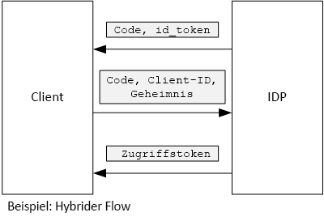

# <a name="use-client-assertion-to-get-access-tokens-from-azure-ad"></a><span data-ttu-id="fd3b0-103">Abrufen von Zugriffstoken aus Azure AD mithilfe der Clientassertion</span><span class="sxs-lookup"><span data-stu-id="fd3b0-103">Use client assertion to get access tokens from Azure AD</span></span>

<span data-ttu-id="fd3b0-104">[-Beispielcode][sample application]</span><span class="sxs-lookup"><span data-stu-id="fd3b0-104">[ Sample code][sample application]</span></span>

## <a name="background"></a><span data-ttu-id="fd3b0-105">Hintergrund</span><span class="sxs-lookup"><span data-stu-id="fd3b0-105">Background</span></span>
<span data-ttu-id="fd3b0-106">Bei Verwendung des Autorisierungscode- oder Hybridvorgangs in OpenID Connect tauscht der Client einen Autorisierungscode gegen ein Zugriffstoken.</span><span class="sxs-lookup"><span data-stu-id="fd3b0-106">When using authorization code flow or hybrid flow in OpenID Connect, the client exchanges an authorization code for an access token.</span></span> <span data-ttu-id="fd3b0-107">In diesem Schritt muss der Client sich beim Server authentifizieren.</span><span class="sxs-lookup"><span data-stu-id="fd3b0-107">During this step, the client has to authenticate itself to the server.</span></span>



<span data-ttu-id="fd3b0-109">Eine Möglichkeit zum Authentifizieren des Clients bietet ein geheimer Clientschlüssel.</span><span class="sxs-lookup"><span data-stu-id="fd3b0-109">One way to authenticate the client is by using a client secret.</span></span> <span data-ttu-id="fd3b0-110">So ist die [Tailspin Surveys][Surveys]-Anwendung standardmäßig konfiguriert.</span><span class="sxs-lookup"><span data-stu-id="fd3b0-110">That's how the [Tailspin Surveys][Surveys] application is configured by default.</span></span>

<span data-ttu-id="fd3b0-111">In dieser Beispielanforderung fordert der Client vom Identitätsanbieter ein Zugriffstoken an.</span><span class="sxs-lookup"><span data-stu-id="fd3b0-111">Here is an example request from the client to the IDP, requesting an access token.</span></span> <span data-ttu-id="fd3b0-112">Beachten Sie den `client_secret` -Parameter.</span><span class="sxs-lookup"><span data-stu-id="fd3b0-112">Note the `client_secret` parameter.</span></span>

```
POST https://login.microsoftonline.com/b9bd2162xxx/oauth2/token HTTP/1.1
Content-Type: application/x-www-form-urlencoded

resource=https://tailspin.onmicrosoft.com/surveys.webapi
  &client_id=87df91dc-63de-4765-8701-b59cc8bd9e11
  &client_secret=i3Bf12Dn...
  &grant_type=authorization_code
  &code=PG8wJG6Y...
```

<span data-ttu-id="fd3b0-113">Der geheime Schlüssel ist nur eine Zeichenfolge, Sie müssen also sicherstellen, dass der Wert nicht versehentlich in falsche Hände gerät.</span><span class="sxs-lookup"><span data-stu-id="fd3b0-113">The secret is just a string, so you have to make sure not to leak the value.</span></span> <span data-ttu-id="fd3b0-114">Die beste Methode ist es, den geheimen Clientschlüssel aus der Quellcodeverwaltung herauszuhalten.</span><span class="sxs-lookup"><span data-stu-id="fd3b0-114">The best practice is to keep the client secret out of source control.</span></span> <span data-ttu-id="fd3b0-115">Wenn Sie die App für Azure bereitstellen, speichern Sie den geheimen Schlüssel in einer [App-Einstellung][configure-web-app].</span><span class="sxs-lookup"><span data-stu-id="fd3b0-115">When you deploy to Azure, store the secret in an [app setting][configure-web-app].</span></span>

<span data-ttu-id="fd3b0-116">Allerdings kann jeder Benutzer mit Zugriff auf das Azure-Abonnement die App-Einstellungen anzeigen.</span><span class="sxs-lookup"><span data-stu-id="fd3b0-116">However, anyone with access to the Azure subscription can view the app settings.</span></span> <span data-ttu-id="fd3b0-117">Und es gibt immer die Versuchung, geheime Schlüssel in der Quellcodeverwaltung zu verwenden (z.B. in Bereitstellungsskripts), per E-Mail weiterzugeben usw.</span><span class="sxs-lookup"><span data-stu-id="fd3b0-117">Further, there is always a temptation to check secrets into source control (e.g., in deployment scripts), share them by email, and so on.</span></span>

<span data-ttu-id="fd3b0-118">Um die Sicherheit zu erhöhen, können Sie die [Clientassertion] anstelle eines geheimen Clientschlüssels verwenden.</span><span class="sxs-lookup"><span data-stu-id="fd3b0-118">For additional security, you can use [client assertion] instead of a client secret.</span></span> <span data-ttu-id="fd3b0-119">Bei der Clientassertion verwendet der Client ein X.509-Zertifikat zum Nachweis, dass die Anforderung des Tokens vom Client stammt.</span><span class="sxs-lookup"><span data-stu-id="fd3b0-119">With client assertion, the client uses an X.509 certificate to prove the token request came from the client.</span></span> <span data-ttu-id="fd3b0-120">Das Clientzertifikat ist auf dem Webserver installiert.</span><span class="sxs-lookup"><span data-stu-id="fd3b0-120">The client certificate is installed on the web server.</span></span> <span data-ttu-id="fd3b0-121">Im Allgemeinen ist es einfacher, den Zugriff auf das Zertifikat zu beschränken, anstatt sicherzustellen, dass niemand versehentlich einen geheimen Clientschlüssel preisgibt.</span><span class="sxs-lookup"><span data-stu-id="fd3b0-121">Generally, it will be easier to restrict access to the certificate, than to ensure that nobody inadvertently reveals a client secret.</span></span> <span data-ttu-id="fd3b0-122">Weitere Informationen zum Konfigurieren von Zertifikaten in einer Web-App finden Sie unter [Using Certificates in Azure Websites Applications][using-certs-in-websites] (Verwenden von Zertifikaten in Azure Websites-Anwendungen).</span><span class="sxs-lookup"><span data-stu-id="fd3b0-122">For more information about configuring certificates in a web app, see [Using Certificates in Azure Websites Applications][using-certs-in-websites]</span></span>

<span data-ttu-id="fd3b0-123">Hier eine Tokenanforderung mit Clientassertion:</span><span class="sxs-lookup"><span data-stu-id="fd3b0-123">Here is a token request using client assertion:</span></span>

```
POST https://login.microsoftonline.com/b9bd2162xxx/oauth2/token HTTP/1.1
Content-Type: application/x-www-form-urlencoded

resource=https://tailspin.onmicrosoft.com/surveys.webapi
  &client_id=87df91dc-63de-4765-8701-b59cc8bd9e11
  &client_assertion_type=urn:ietf:params:oauth:client-assertion-type:jwt-bearer
  &client_assertion=eyJhbGci...
  &grant_type=authorization_code
  &code= PG8wJG6Y...
```

<span data-ttu-id="fd3b0-124">Beachten Sie, dass der Parameter `client_secret` nicht mehr verwendet wird.</span><span class="sxs-lookup"><span data-stu-id="fd3b0-124">Notice that the `client_secret` parameter is no longer used.</span></span> <span data-ttu-id="fd3b0-125">Stattdessen enthält der Parameter `client_assertion` ein JWT-Token, das mithilfe des Clientzertifikats signiert wurde.</span><span class="sxs-lookup"><span data-stu-id="fd3b0-125">Instead, the `client_assertion` parameter contains a JWT token that was signed using the client certificate.</span></span> <span data-ttu-id="fd3b0-126">Der Parameter `client_assertion_type` gibt den Typ der Assertion an – in diesen Fall ein JWT-Token.</span><span class="sxs-lookup"><span data-stu-id="fd3b0-126">The `client_assertion_type` parameter specifies the type of assertion &mdash; in this case, JWT token.</span></span> <span data-ttu-id="fd3b0-127">Der Server überprüft das JWT-Token.</span><span class="sxs-lookup"><span data-stu-id="fd3b0-127">The server validates the JWT token.</span></span> <span data-ttu-id="fd3b0-128">Wenn das JWT-Token ungültig ist, gibt die Tokenanforderung einen Fehler zurück.</span><span class="sxs-lookup"><span data-stu-id="fd3b0-128">If the JWT token is invalid, the token request returns an error.</span></span>

> [!NOTE]
> <span data-ttu-id="fd3b0-129">X.509-Zertifikate sind nicht die einzige Form der Clientassertion, aber wir konzentrieren uns an dieser Stelle darauf, weil diese Zertifikate von Azure AD unterstützt werden.</span><span class="sxs-lookup"><span data-stu-id="fd3b0-129">X.509 certificates are not the only form of client assertion; we focus on it here because it is supported by Azure AD.</span></span>
> 
> 

<span data-ttu-id="fd3b0-130">Zur Laufzeit liest die Webanwendung das Zertifikat aus dem Zertifikatspeicher.</span><span class="sxs-lookup"><span data-stu-id="fd3b0-130">At run time, the web application reads the certificate from the certificate store.</span></span> <span data-ttu-id="fd3b0-131">Das Zertifikat muss auf dem gleichen Computer wie die Web-App installiert sein.</span><span class="sxs-lookup"><span data-stu-id="fd3b0-131">The certificate must be installed on the same machine as the web app.</span></span>

<span data-ttu-id="fd3b0-132">Die Surveys-Anwendung enthält eine Hilfsklasse, die ein [ClientAssertionCertificate](/dotnet/api/microsoft.identitymodel.clients.activedirectory.clientassertioncertificate) erstellt, das Sie an die [AuthenticationContext.AcquireTokenSilentAsync](/dotnet/api/microsoft.identitymodel.clients.activedirectory.authenticationcontext.acquiretokensilentasync)-Methode übergeben können, um ein Token aus Azure AD abzurufen.</span><span class="sxs-lookup"><span data-stu-id="fd3b0-132">The Surveys application includes a helper class that creates a [ClientAssertionCertificate](/dotnet/api/microsoft.identitymodel.clients.activedirectory.clientassertioncertificate) that you can pass to the [AuthenticationContext.AcquireTokenSilentAsync](/dotnet/api/microsoft.identitymodel.clients.activedirectory.authenticationcontext.acquiretokensilentasync) method to acquire a token from Azure AD.</span></span>

```csharp
public class CertificateCredentialService : ICredentialService
{
    private Lazy<Task<AdalCredential>> _credential;

    public CertificateCredentialService(IOptions<ConfigurationOptions> options)
    {
        var aadOptions = options.Value?.AzureAd;
        _credential = new Lazy<Task<AdalCredential>>(() =>
        {
            X509Certificate2 cert = CertificateUtility.FindCertificateByThumbprint(
                aadOptions.Asymmetric.StoreName,
                aadOptions.Asymmetric.StoreLocation,
                aadOptions.Asymmetric.CertificateThumbprint,
                aadOptions.Asymmetric.ValidationRequired);
            string password = null;
            var certBytes = CertificateUtility.ExportCertificateWithPrivateKey(cert, out password);
            return Task.FromResult(new AdalCredential(new ClientAssertionCertificate(aadOptions.ClientId, new X509Certificate2(certBytes, password))));
        });
    }

    public async Task<AdalCredential> GetCredentialsAsync()
    {
        return await _credential.Value;
    }
}
```

<span data-ttu-id="fd3b0-133">Informationen zum Einrichten einer Clientassertion in der Surveys-Anwendung finden Sie unter [Verwenden von Azure Key Vault zum Schützen von Anwendungsgeheimnissen][key vault].</span><span class="sxs-lookup"><span data-stu-id="fd3b0-133">For information about setting up client assertion in the Surveys application, see [Use Azure Key Vault to protect application secrets ][key vault].</span></span>

<span data-ttu-id="fd3b0-134">[**Weiter**][key vault]</span><span class="sxs-lookup"><span data-stu-id="fd3b0-134">[**Next**][key vault]</span></span>

<!-- Links -->
[configure-web-app]: /azure/app-service-web/web-sites-configure/
[azure-management-portal]: https://portal.azure.com
[Clientassertion]: https://tools.ietf.org/html/rfc7521
[key vault]: key-vault.md
[Setup-KeyVault]: https://github.com/mspnp/multitenant-saas-guidance/blob/master/scripts/Setup-KeyVault.ps1
[Surveys]: tailspin.md
[using-certs-in-websites]: https://azure.microsoft.com/blog/using-certificates-in-azure-websites-applications/

[sample application]: https://github.com/mspnp/multitenant-saas-guidance
