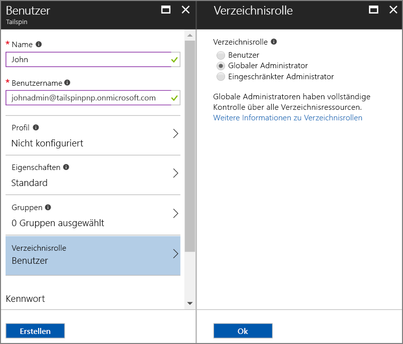
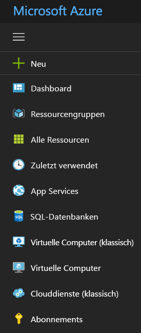

# <a name="use-azure-key-vault-to-protect-application-secrets"></a>Verwenden von Azure Key Vault zum Schützen von Anwendungsgeheimnissen

[-Beispielcode][sample application]

Es kommt häufig vor, dass Anwendungseinstellungen vertraulich sind und geschützt werden müssen. Hierzu gehört z.B. Folgendes:

* Datenbankverbindungszeichenfolgen
* Kennwörter
* Kryptografische Schlüssel

Aus Sicherheitsgründen sollten Sie diese vertraulichen Daten niemals in der Quellcodeverwaltung speichern. Sie gelangen nur allzu leicht in fremde Hände – auch wenn Ihr Quellcoderepository privat ist. Es geht aber nicht nur darum, geheime Daten vor Fremden zu schützen. Bei größeren Projekten möchten Sie vielleicht einschränken, welche Entwickler und Operatoren Zugriff auf die Produktionsgeheimnisse haben. (Die Einstellungen für Test- und Entwicklungsumgebungen weichen ab.)

Eine sicherere Option ist es, diese Geheimnisse in [Azure Key Vault][KeyVault] zu speichern. Key Vault ist ein in der Cloud gehosteter Dienst für die Verwaltung von kryptografischen Schlüsseln und anderer geheimer Schlüssel. Dieser Artikel zeigt, wie Key Vault verwendet wird, um Konfigurationseinstellungen für Ihre App zu speichern.

In der [Tailspin Surveys][Surveys]-Anwendung sind folgende Einstellungen vertraulich:

* Die Datenbankverbindungszeichenfolge
* Die Redis-Datenbankverbindungszeichenfolge
* Der geheime Clientschlüssel für die Webanwendung

Die Surveys-Anwendung lädt die Konfigurationseinstellungen aus den folgenden Quellen:

* Aus der Datei „appsettings.json“
* Aus dem [Speicher für Benutzergeheimnisse][user-secrets] (nur in Entwicklungsumgebungen, zu Testzwecken)
* Aus der Hostingumgebung (App-Einstellungen in Azure-Web-Apps)
* Aus Key Vault (wenn aktiviert)

Jeder dieser Einstellungen setzt die vorherige außer Kraft, daher haben in Key Vault gespeicherte Einstellungen Vorrang.

> [!NOTE]
> Standardmäßig ist der Key Vault-Konfigurationsanbieter deaktiviert. Er ist nicht erforderlich, um die Anwendung lokal auszuführen. Sie müssten ihn in einer Produktionsbereitstellung aktivieren.

Beim Start liest die Anwendung die Einstellungen aller registrierten Konfigurationsanbieter, und verwendet diese zum Auffüllen eines stark typisierten Optionenobjekts. Weitere Informationen finden Sie unter [Using Options and configuration objects][options] (Verwenden von Optionen und Konfigurationsobjekten).

## <a name="setting-up-key-vault-in-the-surveys-app"></a>Einrichten von Key Vault in der Surveys-App
Voraussetzungen:

* Installieren Sie die [Azure Resource Manager-Cmdlets][azure-rm-cmdlets].
* Konfigurieren Sie die Surveys-Anwendung so, wie unter [Ausführen der Surveys-Anwendung][readme] beschrieben.

Allgemeine Schritte:

1. Richten Sie einen Benutzer mit Administratorrechten im Mandanten ein.
2. Richten Sie ein Clientzertifikat ein.
3. Erstellen eines Schlüsseltresors
4. Fügen Sie Ihrem Schlüsseltresor Konfigurationseinstellungen hinzu.
5. Entfernen Sie den Code, der den Schlüsseltresor aktiviert.
6. Aktualisieren Sie die geheimen Benutzerschlüssel der Anwendung.

### <a name="set-up-an-admin-user"></a>Richten Sie einen Benutzer mit Administratorrechten ein.
> [!NOTE]
> Um einen Schlüsseltresor zu erstellen, müssen Sie ein Konto verwenden, das Ihr Azure-Abonnement verwalten kann. Jede Anwendung, der Sie erlauben, Daten aus dem Schlüsseltresor zu lesen, muss im gleichen Mandanten wie dieses Konto registriert sein.
> 
> 

In diesem Schritt stellen Sie sicher, dass Sie einen Schlüsseltresor erstellen können, während Sie als Benutzer im Mandanten angemeldet sind, in dem auch die Surveys-App registriert ist.

Erstellen Sie einen Administratorbenutzer in dem Azure AD-Mandanten, in dem die Surveys-Anwendung registriert ist.

1. Melden Sie sich beim [Azure-Portal][azure-portal] an.
2. Wählen Sie den Azure AD-Mandanten, in dem Ihre Anwendung gespeichert ist.
3. Klicken Sie auf **Weitere Dienste** > **SICHERHEIT + IDENTITÄT** > **Azure Active Directory** > **Benutzer und Gruppen** > **Alle Benutzer**.
4. Klicken Sie oben im Portal auf **Neuer Benutzer**.
5. Füllen Sie die Felder aus, und weisen Sie den Benutzer zur Verzeichnisrolle **Globaler Administrator** hinzu.
6. Klicken Sie auf **Erstellen**.



Weisen Sie diesen Benutzer jetzt als Abonnementbesitzer zu.

1. Wählen Sie im Menü „Hub“ die Option **Abonnements** aus.

    

2. Wählen Sie das Abonnement aus, auf das der Administrator zugreifen soll.
3. Wählen Sie auf dem Blatt „Abonnement“ die Option **Zugriffssteuerung (IAM)**.
4. Klicken Sie auf **Hinzufügen**.
4. Wählen Sie unter **Rolle** die Option **Besitzer** aus.
5. Geben Sie die E-Mail-Adresse des Benutzers ein, den Sie als Besitzer hinzufügen möchten.
6. Wählen Sie den Benutzer aus, und klicken Sie auf **Speichern**.

### <a name="set-up-a-client-certificate"></a>Einrichten eines Clientzertifikats
1. Führen Sie das PowerShell-Skript [/Scripts/Setup-KeyVault.ps1][Setup-KeyVault] folgendermaßen aus:
   
    ```
    .\Setup-KeyVault.ps1 -Subject <<subject>>
    ```
    Geben Sie für den Parameter `Subject` einen beliebigen Namen ein, z.B. „surveysapp“. Das Skript generiert ein selbstsigniertes Zertifikat und speichert es im Zertifikatspeicher „Aktueller Benutzer/Eigene Zertifikate“. Die Ausgabe des Skripts ist ein JSON-Fragment. Kopieren Sie diesen Wert.

2. Wechseln Sie im [Azure-Portal][azure-portal] zu dem Verzeichnis, in dem die Surveys-Anwendung registriert ist. Wählen Sie dazu in der rechten oberen Ecke des Portals Ihr Konto aus.

3. Klicken Sie auf **Azure Active Directory** > **App-Registrierungen** > Surveys.

4.  Klicken Sie auf **Manifest** und dann auf **Bearbeiten**.

5.  Fügen Sie die Ausgabe des Skripts in die Eigenschaft `keyCredentials` ein. Es sollte in etwa wie folgt aussehen:
        
    ```json
    "keyCredentials": [
        {
        "type": "AsymmetricX509Cert",
        "usage": "Verify",
        "keyId": "29d4f7db-0539-455e-b708-....",
        "customKeyIdentifier": "ZEPpP/+KJe2fVDBNaPNOTDoJMac=",
        "value": "MIIDAjCCAeqgAwIBAgIQFxeRiU59eL.....
        }
    ],
    ```          

6. Klicken Sie auf **Speichern**.  

7. Wiederholen Sie die Schritte 3 bis 6, um dasselbe JSON-Fragment zum Anwendungsmanifest der Web-API (Surveys.WebAPI) hinzuzufügen.

8. Führen Sie im PowerShell-Fenster den folgenden Befehl aus, um den Fingerabdruck des Zertifikats abzurufen.
   
    ```
    certutil -store -user my [subject]
    ```
    
    Verwenden Sie für `[subject]` den Wert, den Sie im PowerShell-Skript als Antragsteller angegeben haben. Der Fingerabdruck wird unter „Cert Hash(sha1)“ aufgeführt. Kopieren Sie diesen Wert. Sie werden den Fingerabdruck später benötigen.

### <a name="create-a-key-vault"></a>Erstellen eines Schlüsseltresors
1. Führen Sie das PowerShell-Skript [/Scripts/Setup-KeyVault.ps1][Setup-KeyVault] folgendermaßen aus:
   
    ```
    .\Setup-KeyVault.ps1 -KeyVaultName <<key vault name>> -ResourceGroupName <<resource group name>> -Location <<location>>
    ```
   
    Wenn Sie zur Eingabe von Anmeldeinformationen aufgefordert werden, melden Sie sich mit den Informationen des Azure AD-Benutzers an, die Sie zuvor erstellt haben. Das Skript erstellt eine neue Ressourcengruppe und einen neuen Schlüsseltresor innerhalb dieser Ressourcengruppe. 
   
2. Führen Sie „SetupKeyVault.ps“ erneut wie folgt aus:
   
    ```
    .\Setup-KeyVault.ps1 -KeyVaultName <<key vault name>> -ApplicationIds @("<<Surveys app id>>", "<<Surveys.WebAPI app ID>>")
    ```
   
    Legen Sie die folgenden Parameterwerte fest:
   
       * Schlüsseltresorname = der Name, den Sie dem Schlüsseltresor im vorherigen Schritt zugewiesen haben
       * Surveys-App-ID = die Anwendungs-ID für die Surveys-Webanwendung
       * Surveys.WebApi-ID = die Anwendungs-ID für die Surveys.WebAPI-Anwendung
         
    Beispiel:
     
    ```
     .\Setup-KeyVault.ps1 -KeyVaultName tailspinkv -ApplicationIds @("f84df9d1-91cc-4603-b662-302db51f1031", "8871a4c2-2a23-4650-8b46-0625ff3928a6")
    ```
    
    Dieses Skript autorisiert die Web-App und die Web-API, geheime Schlüssel aus Ihrem Schlüsseltresor abzurufen. Weitere Informationen finden Sie unter [Erste Schritte mit Azure Key Vault](/azure/key-vault/key-vault-get-started/).

### <a name="add-configuration-settings-to-your-key-vault"></a>Hinzufügen von Konfigurationseinstellungen zu Ihrem Schlüsseltresor
1. Führen Sie „SetupKeyVault.ps“ wie folgt aus:
   
    ```
    .\Setup-KeyVault.ps1 -KeyVaultName <<key vault name> -KeyName Redis--Configuration -KeyValue "<<Redis DNS name>>.redis.cache.windows.net,password=<<Redis access key>>,ssl=true" 
    ```
    ,wobei 
   
   * Schlüsseltresorname = der Name, den Sie dem Schlüsseltresor im vorherigen Schritt zugewiesen haben
   * Redis-DNS-Name = der DNS-Name Ihrer Redis Cache-Instanz
   * Redis-Zugriffsschlüssel = der Zugriffsschlüssel für Ihre Redis Cache-Instanz
     
2. Jetzt sollten Sie überprüfen, ob die geheimen Schlüssel erfolgreich im Schlüsseltresor gespeichert wurden. Führen Sie den folgenden PowerShell-Befehl aus:
   
    ```
    Get-AzureKeyVaultSecret <<key vault name>> Redis--Configuration | Select-Object *
    ```

3. Führen Sie „SetupKeyVault.ps“ erneut aus, um die Datenbankverbindungszeichenfolge hinzufügen:
   
    ```
    .\Setup-KeyVault.ps1 -KeyVaultName <<key vault name> -KeyName Data--SurveysConnectionString -KeyValue <<DB connection string>> -ConfigName "Data:SurveysConnectionString"
    ```
   
    wobei `<<DB connection string>>` der Wert der Datenbankverbindungszeichenfolge ist.
   
    Für Tests mit der lokalen Datenbank kopieren Sie die Verbindungszeichenfolge aus der Datei „Tailspin.Surveys.Web/appsettings.json“. Ändern Sie dabei den doppelten umgekehrten Schrägstrich („\\\\“) in einen einfachen umgekehrten Schrägstrich. Der doppelte umgekehrte Schrägstrich ist ein Escapezeichen in der JSON-Datei.
   
    Beispiel:
   
    ```
    .\Setup-KeyVault.ps1 -KeyVaultName mykeyvault -KeyName Data--SurveysConnectionString -KeyValue "Server=(localdb)\MSSQLLocalDB;Database=Tailspin.SurveysDB;Trusted_Connection=True;MultipleActiveResultSets=true" 
    ```

### <a name="uncomment-the-code-that-enables-key-vault"></a>Entfernen Sie den Code, der Key Vault aktiviert.
1. Öffnen Sie die Projektmappe „Tailspin.Surveys“.
2. Suchen Sie in „Tailspin.Surveys.Web/Startup.cs“ den folgenden Codeblock, und heben Sie die Auskommentierung auf.
   
    ```csharp
    //var config = builder.Build();
    //builder.AddAzureKeyVault(
    //    $"https://{config["KeyVault:Name"]}.vault.azure.net/",
    //    config["AzureAd:ClientId"],
    //    config["AzureAd:ClientSecret"]);
    ```
3. Suchen Sie in „Tailspin.Surveys.Web/Startup.cs“ den Code, der den `ICredentialService` registriert. Heben Sie Auskommentierungen für die Zeile mit `CertificateCredentialService` und die Zeile mit `ClientCredentialService` auf:
   
    ```csharp
    // Uncomment this:
    services.AddSingleton<ICredentialService, CertificateCredentialService>();
    // Comment out this:
    //services.AddSingleton<ICredentialService, ClientCredentialService>();
    ```
   
    Dieser Änderung ermöglicht es der Web-App, die [Clientassertion][client-assertion] zu verwenden, um OAuth-Zugriffstoken abzurufen. Wenn Sie die Clientassertion verwenden, benötigen Sie keine geheimen OAuth-Clientschlüssel. Alternativ dazu können Sie den geheimen Clientschlüssel im Schlüsseltresor speichern. Sowohl der Schlüsseltresor als auch die Clientassertion verwenden jedoch ein Clientzertifikat. Wenn Sie also den Schlüsseltresor aktivieren, empfiehlt es sich, auch die Clientassertion zu aktivieren.

### <a name="update-the-user-secrets"></a>Aktualisierung der geheimen Benutzerschlüssel
Klicken Sie im Projektmappen-Explorer mit der rechten Maustaste auf das Tailspin.Surveys.Web-Projekt, und wählen Sie **Benutzerschlüssel verwalten**. Löschen Sie in der Datei „secrets.json“ die vorhandene JSON-Datei, und fügen Sie Folgendes hinzu:

    ```
    {
      "AzureAd": {
        "ClientId": "[Surveys web app client ID]",
        "ClientSecret": "[Surveys web app client secret]",
        "PostLogoutRedirectUri": "https://localhost:44300/",
        "WebApiResourceId": "[App ID URI of your Surveys.WebAPI application]",
        "Asymmetric": {
          "CertificateThumbprint": "[certificate thumbprint. Example: 105b2ff3bc842c53582661716db1b7cdc6b43ec9]",
          "StoreName": "My",
          "StoreLocation": "CurrentUser",
          "ValidationRequired": "false"
        }
      },
      "KeyVault": {
        "Name": "[key vault name]"
      }
    }
    ```

Ersetzen Sie die Einträge in [eckigen Klammern] durch die korrekten Werte.

* `AzureAd:ClientId`: die Client-ID der Surveys-App
* `AzureAd:ClientSecret`: der Schlüssel, der generiert wurde, als Sie die Surveys-Anwendung in Azure AD registriert haben
* `AzureAd:WebApiResourceId`: der App-ID-URI, den Sie angegeben haben, als Sie die Surveys.WebAPI-Anwendung in Azure AD erstellt haben
* `Asymmetric:CertificateThumbprint`: der Fingerabdruck des Zertifikats, den Sie erhalten haben, als Sie das Clientzertifikat erstellt haben
* `KeyVault:Name`: der Name des Ihres Schlüsseltresors

> [!NOTE]
> `Asymmetric:ValidationRequired` ist „false“, da das Zertifikat, das Sie zuvor erstellt haben, nicht von einer Stammzertifizierungsstelle signiert wurde. Verwenden Sie in Produktionsumgebungen ein Zertifikat, das von einer Stammzertifizierungsstelle signiert wurde, und legen Sie `ValidationRequired` auf „true“ fest.
> 
> 

Speichern Sie die aktualisierte secrets.json-Datei.

Klicken Sie als nächstes im Projektmappen-Explorer mit der rechten Maustaste auf das Tailspin.Surveys.WebApi-Projekt, und wählen Sie **Geheime Benutzerschlüssel verwalten**. Löschen Sie die vorhandene JSON-Datei, und fügen Sie Folgendes hinzu:

```
{
  "AzureAd": {
    "ClientId": "[Surveys.WebAPI client ID]",
    "WebApiResourceId": "https://tailspin5.onmicrosoft.com/surveys.webapi",
    "Asymmetric": {
      "CertificateThumbprint": "[certificate thumbprint]",
      "StoreName": "My",
      "StoreLocation": "CurrentUser",
      "ValidationRequired": "false"
    }
  },
  "KeyVault": {
    "Name": "[key vault name]"
  }
}
```

Ersetzen Sie die Einträge in [eckigen Klammern], und speichern Sie die Datei „secrets.json“.

> [!NOTE]
> Stellen Sie für die Web-API sicher, dass Sie die Client-ID für die Surveys.WebAPI-Anwendung verwenden, und nicht für die Surveys-Anwendung.
> 
> 

[**Weiter**][adfs]

<!-- Links -->
[adfs]: ./adfs.md
[authorize-app]: /azure/key-vault/key-vault-get-started//#authorize
[azure-portal]: https://portal.azure.com
[azure-rm-cmdlets]: https://msdn.microsoft.com/library/mt125356.aspx
[client-assertion]: client-assertion.md
[configuration]: /aspnet/core/fundamentals/configuration
[KeyVault]: https://azure.microsoft.com/services/key-vault/
[key-tags]: https://msdn.microsoft.com/library/azure/dn903623.aspx#BKMK_Keytags
[Microsoft.Azure.KeyVault]: https://www.nuget.org/packages/Microsoft.Azure.KeyVault/
[options]: /aspnet/core/fundamentals/configuration#using-options-and-configuration-objects
[readme]: ./run-the-app.md
[Setup-KeyVault]: https://github.com/mspnp/multitenant-saas-guidance/blob/master/scripts/Setup-KeyVault.ps1
[Surveys]: tailspin.md
[user-secrets]: http://go.microsoft.com/fwlink/?LinkID=532709
[sample application]: https://github.com/mspnp/multitenant-saas-guidance
