# <a name="run-the-surveys-application"></a>Ausführen der Surveys-Anwendung

In diesem Artikel wird beschrieben, wie Sie die Anwendung [Tailspin Surveys](./tailspin.md) über Visual Studio lokal ausführen. In diesen Schritten wird die Anwendung nicht in Azure bereitgestellt. Sie müssen jedoch einige Azure-Ressourcen erstellen: ein Azure AD-Verzeichnis (Azure Active Directory) und einen Redis Cache.

Zusammenfassung der Schritte:

1. Erstellen Sie ein Azure AD-Verzeichnis (Mandant) für das fiktive Unternehmen Tailspin.
2. Registrieren Sie die Surveys-Anwendung und die Back-End-Web-API bei Azure AD.
3. Erstellen Sie eine Instanz von Azure Redis Cache.
4. Konfigurieren Sie die Anwendungseinstellungen, und erstellen Sie eine lokale Datenbank.
5. Führen Sie die Anwendung aus, und registrieren Sie einen neuen Mandanten.
6. Fügen Sie Benutzern Anwendungsrollen hinzu.

## <a name="prerequisites"></a>Voraussetzungen
-   [Visual Studio 2017][VS2017]
-   [Microsoft Azure](https://azure.microsoft.com)-Konto

## <a name="create-the-tailspin-tenant"></a>Erstellen des Tailspin-Mandanten

Tailspin ist das fiktive Unternehmen, das die Surveys-Anwendung hostet. Tailspin verwendet Azure AD, um anderen Mandanten das Registrieren bei der App zu ermöglichen. Diese Kunden können sich dann mit ihren Azure AD-Anmeldeinformationen bei der App registrieren.

In diesem Schritt erstellen Sie ein Azure AD-Verzeichnis für Tailspin.

1. Melden Sie sich beim [Azure-Portal][portal] an.

2. Klicken Sie auf **Neu** > **Sicherheit und Identität** > **Azure Active Directory**.

3. Geben Sie für den Organisationsnamen `Tailspin` ein, und geben Sie einen Domänennamen ein. Der Domänenname hat das Format `xxxx.onmicrosoft.com` und muss global eindeutig sein. 

    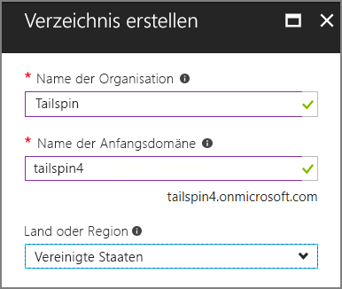

4. Klicken Sie auf **Erstellen**. Die Erstellung des neuen Verzeichnisses kann einige Minuten dauern.

Zum Abschließen des End-to-End-Szenarios benötigen Sie ein zweites Azure AD-Verzeichnis, das einen Kunden darstellt, der sich für die Anwendung registriert. Sie können Ihr Azure AD-Standardverzeichnis (nicht Tailspin) verwenden oder für diesen Zweck ein neues Verzeichnis erstellen. In den Beispielen verwenden wir als fiktiven Kunden Contoso.

## <a name="register-the-surveys-web-api"></a>Registrieren der Surveys-Web-API 

1. Wechseln Sie im [Azure-Portal][portal] zu dem neuen Tailspin-Verzeichnis, indem Sie in der rechten oberen Ecke des Portals Ihr Konto auswählen.

2. Wählen Sie im linken Navigationsbereich **Azure Active Directory** aus. 

3. Klicken Sie auf **App-Registrierungen** > **Registrierung einer neuen Anwendung**.

4.  Geben Sie auf dem Blatt **Erstellen** die folgenden Informationen ein:

  - **Name**: `Surveys.WebAPI`

  - **Anwendungstyp:**: `Web app / API`

  - **Anmelde-URL**: `https://localhost:44301/`
   
  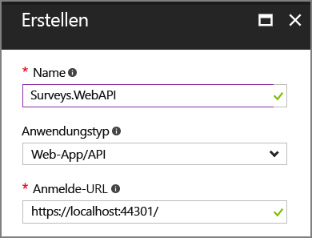 

5. Klicken Sie auf **Erstellen**.

6. Wählen Sie im Blatt **App-Registrierungen** die neue Anwendung **Surveys.WebAPI** aus.
 
7. Klicken Sie auf **Eigenschaften**.

8. Geben Sie im Bearbeitungsfeld **App-ID-URI** `https://<domain>/surveys.webapi` ein, wobei `<domain>` der Domänenname des Verzeichnisses ist. Beispiel: `https://tailspin.onmicrosoft.com/surveys.webapi`

    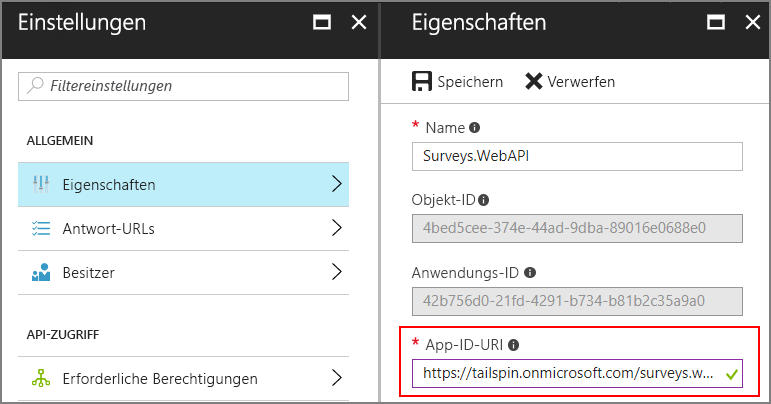

9. Legen Sie **Mehrinstanzenfähig** auf **JA** fest.

10. Klicken Sie auf **Speichern**.

## <a name="register-the-surveys-web-app"></a>Registrieren der Surveys-Web-App 

1.  Kehren Sie zum Blatt **App-Registrierungen** zurück, und klicken Sie auf **Registrierung einer neuen Anwendung**.

2.  Geben Sie auf dem Blatt **Erstellen** die folgenden Informationen ein:

  - **Name**: `Surveys`
  - **Anwendungstyp:**: `Web app / API`
  - **Anmelde-URL**: `https://localhost:44300/`
   
    Beachten Sie, dass die Anmelde-URL eine andere Portnummer als die `Surveys.WebAPI`-App im vorherigen Schritt enthält.

3. Klicken Sie auf **Erstellen**.
 
4. Wählen Sie im Blatt **App-Registrierungen** die neue Anwendung **Surveys** aus.
 
5. Kopieren Sie die Anwendungs-ID. Sie benötigen sie später.

    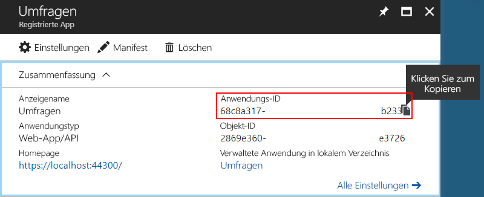

6. Klicken Sie auf **Eigenschaften**.

7. Geben Sie im Bearbeitungsfeld **App-ID-URI** `https://<domain>/surveys` ein, wobei `<domain>` der Domänenname des Verzeichnisses ist. 

    

8. Legen Sie **Mehrinstanzenfähig** auf **JA** fest.

9. Klicken Sie auf **Speichern**.

10. Klicken Sie auf dem Blatt **Einstellungen** auf **Antwort-URLs**.
 
11. Fügen Sie die folgende Antwort-URL hinzu: `https://localhost:44300/signin-oidc`.

12. Klicken Sie auf **Speichern**.

13. Klicken Sie unter **API-ZUGRIFF** auf **Schlüssel**.

14. Geben Sie eine Beschreibung ein, z.B. `client secret`.

15. Wählen Sie in der Dropdownliste **Dauer auswählen** den Eintrag **1 Jahr** aus. 

16. Klicken Sie auf **Speichern**. Beim Speichern wird der Schlüssel generiert.

17. Bevor Sie dieses Blatt verlassen, kopieren Sie den Wert des Schlüssels.

    > [!NOTE] 
    > Nachdem Sie das Blatt verlassen haben, wird der Schlüssel nicht mehr angezeigt. 

18. Klicken Sie unter **API-ZUGRIFF** auf **Erforderliche Berechtigungen**.

19. Klicken Sie auf **Hinzufügen** > **Hiermit wählen Sie eine API aus**.

20. Suchen Sie im Suchfeld nach `Surveys.WebAPI`.

    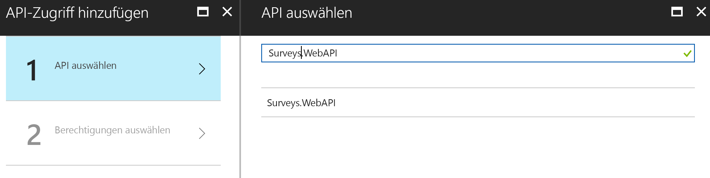

21. Wählen Sie `Surveys.WebAPI` aus, und klicken Sie auf **Auswählen**.

22. Aktivieren Sie unter **Delegierte Berechtigungen** das Kontrollkästchen **Auf Surveys.WebAPI zugreifen**.

    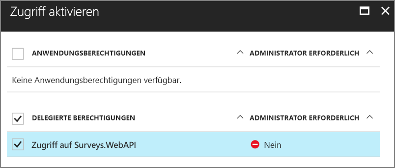

23. Klicken Sie auf **Auswählen** > **Fertig**.


## <a name="update-the-application-manifests"></a>Aktualisieren des Anwendungsmanifests

1. Kehren Sie zum Blatt **Einstellungen** für die `Surveys.WebAPI`-App zurück.

2. Klicken Sie auf **Manifest** > **Bearbeiten**.

    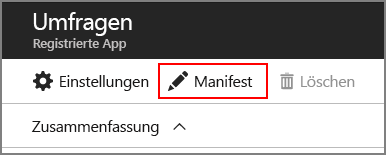
 
3.  Fügen Sie dem `appRoles`-Element den folgenden JSON-Code hinzu. Generieren Sie für die `id`-Eigenschaften neue GUIDs.

    ```json
    {
      "allowedMemberTypes": ["User"],
      "description": "Creators can create surveys",
      "displayName": "SurveyCreator",
      "id": "<Generate a new GUID. Example: 1b4f816e-5eaf-48b9-8613-7923830595ad>",
      "isEnabled": true,
      "value": "SurveyCreator"
    },
    {
      "allowedMemberTypes": ["User"],
      "description": "Administrators can manage the surveys in their tenant",
      "displayName": "SurveyAdmin",
      "id": "<Generate a new GUID>",  
      "isEnabled": true,
      "value": "SurveyAdmin"
    }
    ```

5.  Fügen Sie in der `knownClientApplications`-Eigenschaft die Anwendungs-ID für die Surveys-Webanwendung hinzu, die Sie zuvor beim Registrieren der Surveys-Anwendung erhalten haben. Beispiel:

  ```json
  "knownClientApplications": ["be2cea23-aa0e-4e98-8b21-2963d494912e"],
  ```

  Durch diese Einstellung wird die Surveys-App der Liste der Clients hinzugefügt, die zum Aufrufen der Web-API berechtigt sind.

6.  Klicken Sie auf **Speichern**.

Wiederholen Sie jetzt die gleichen Schritte für die Surveys-App, fügen Sie jedoch keinen Eintrag für `knownClientApplications` hinzu. Verwenden Sie die gleichen Rollendefinitionen, generieren Sie jedoch für die IDs neue GUIDs.

## <a name="create-a-new-redis-cache-instance"></a>Erstellen einer neuen Instanz von Redis Cache

Die Surveys-Anwendung verwendet zum Zwischenspeichern von OAuth 2-Zugriffstoken Redis. So erstellen Sie den Cache:

1.  Wechseln Sie zum [Azure-Portal](https://portal.azure.com), und klicken Sie auf **Neu** > **Datenbanken** > **Redis Cache**.

2.  Geben Sie die erforderlichen Informationen, einschließlich DNS-Name, Ressourcengruppe, Standort und Tarif, ein. Sie können eine neue Ressourcengruppe erstellen oder eine vorhandene Ressourcengruppe verwenden.

3. Klicken Sie auf **Erstellen**.

4. Nachdem der Redis Cache erstellt wurde, navigieren Sie zu der Ressource im Portal.

5. Klicken Sie auf **Zugriffsschlüssel**, und kopieren Sie den Primärschlüssel.

Weitere Informationen über das Erstellen eines Redis Cache finden Sie unter [Verwenden von Azure Redis Cache](/azure/redis-cache/cache-dotnet-how-to-use-azure-redis-cache).

## <a name="set-application-secrets"></a>Festlegen von Anwendungsgeheimnissen

1.  Öffnen Sie in Visual Studio die Projektmappe „Tailspin.Surveys“.

2.  Klicken Sie im Projektmappen-Explorer mit der rechten Maustaste auf das Tailspin.Surveys.Web-Projekt, und wählen Sie **Benutzerschlüssel verwalten**.

3.  Fügen Sie in der Datei „secrets.json“ Folgendes ein:
    
    ```json
    {
      "AzureAd": {
        "ClientId": "<Surveys application ID>",
        "ClientSecret": "<Surveys app client secret>",
        "PostLogoutRedirectUri": "https://localhost:44300/",
        "WebApiResourceId": "<Surveys.WebAPI app ID URI>"
      },
      "Redis": {
        "Configuration": "<Redis DNS name>.redis.cache.windows.net,password=<Redis primary key>,ssl=true"
      }
    }
    ```
   
    Ersetzen Sie die Elemente in spitzen Klammern wie folgt:

    - `AzureAd:ClientId`: Die Anwendungs-ID der Surveys-App.
    - `AzureAd:ClientSecret`: Der Schlüssel, der generiert wurde, als Sie die Surveys-Anwendung in Azure AD registriert haben.
    - `AzureAd:WebApiResourceId`: der App-ID-URI, den Sie angegeben haben, als Sie die Surveys.WebAPI-Anwendung in Azure AD erstellt haben Er muss das Format `https://<directory>.onmicrosoft.com/surveys.webapi` aufweisen.
    - `Redis:Configuration`: Erstellen Sie diese Zeichenfolge aus dem DNS-Namen des Redis Cache und dem primären Zugriffsschlüssel. Beispiel: „tailspin.redis.cache.windows.net,password=2h5tBxxx,ssl=true“.

4.  Speichern Sie die aktualisierte secrets.json-Datei.

5.  Wiederholen Sie diese Schritte für das Projekt „Tailspin.Surveys.WebAPI“, fügen Sie jedoch in „secrets.json“ den folgenden Code ein. Ersetzen Sie wie zuvor die Elemente in spitzen Klammern.

    ```json
    {
      "AzureAd": {
        "WebApiResourceId": "<Surveys.WebAPI app ID URI>"
      },
      "Redis": {
        "Configuration": "<Redis DNS name>.redis.cache.windows.net,password=<Redis primary key>,ssl=true"
      }
    }
    ```

## <a name="initialize-the-database"></a>Initialisieren der Datenbank

In diesem Schritt verwenden Sie Entity Framework 7, um mithilfe von LocalDB eine lokale SQL-Datenbank zu erstellen.

1.  Öffnen Sie ein Befehlsfenster.

2.  Navigieren Sie zum Projekt „Tailspin.Surveys.Data“.

3.  Führen Sie den folgenden Befehl aus:

    ```
    dotnet ef database update --startup-project ..\Tailspin.Surveys.Web
    ```
    
## <a name="run-the-application"></a>Ausführen der Anwendung

Starten Sie zum Ausführen der Anwendung die Projekte „Tailspin.Surveys.Web“ und „Tailspin.Surveys.WebAPI“.

Sie können in Visual Studio wie folgt festlegen, dass durch Drücken von F5 beide Projekte automatisch ausgeführt werden:

1.  Klicken Sie im Projektmappen-Explorer mit der rechten Maustaste auf die Projektmappe, und klicken Sie auf **Startprojekte festlegen**.
2.  Wählen Sie **Mehrere Startprojekte** aus.
3.  Legen Sie für die Projekte „Tailspin.Surveys.Web“ und „Tailspin.Surveys.WebAPI“ **Aktion** = **Starten** fest.

## <a name="sign-up-a-new-tenant"></a>Registrieren eines neuen Mandanten

Da Sie beim Starten der Anwendung nicht angemeldet sind, wird die Homepage angezeigt:

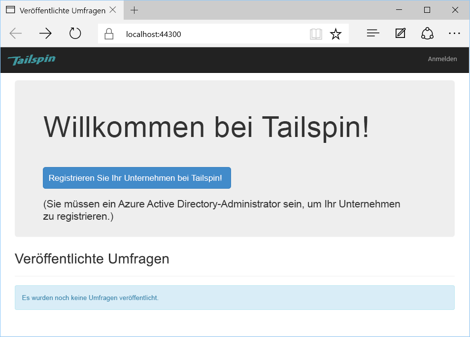

So registrieren Sie eine Organisation:

1. Klicken Sie auf **Enroll your company in Tailspin** (Registrieren Sie Ihr Unternehmen in Tailspin).
2. Melden Sie sich mit der Surveys-App bei dem Azure AD-Verzeichnis an, das die Organisation darstellt. Sie müssen sich als Administratorbenutzer anmelden.
3. Stimmen Sie der Zustimmungsaufforderung zu.

Die Anwendung registriert den Mandanten, und anschließend werden Sie abgemeldet. Sie werden von der App abgemeldet, da Sie vor dem Verwenden der Anwendung die Anwendungsrollen in Azure AD einrichten müssen.

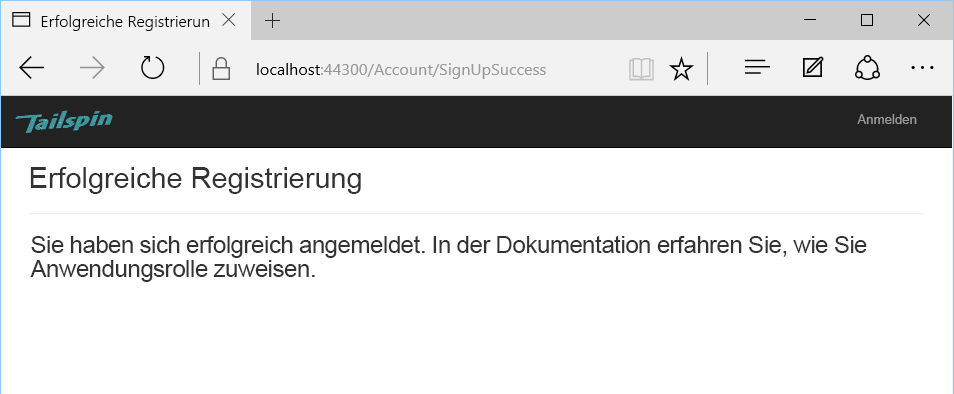

## <a name="assign-application-roles"></a>Zuweisen von Anwendungsrollen

Wenn sich ein Mandant registriert, muss ein AD-Administrator für den Mandanten Benutzern Anwendungsrollen zuweisen.


1. Wechseln Sie im [Azure-Portal][portal] zu dem Azure AD-Verzeichnis, das Sie zum Registrieren für die Surveys-App verwendet haben. 

2. Wählen Sie im linken Navigationsbereich **Azure Active Directory** aus. 

3. Klicken Sie auf **Unternehmensanwendungen** > **Alle Anwendungen**. Im Portal werden `Survey` und `Survey.WebAPI` aufgelistet. Wenn dies nicht der Fall ist, stellen Sie sicher, dass Sie den Registrierungsvorgang abgeschlossen haben.

4.  Klicken Sie auf die Surveys-Anwendung.

5.  Klicken Sie auf **Benutzer und Gruppen**.

4.  Klicken Sie auf **Benutzer hinzufügen**.

5.  Wenn Sie über Azure AD Premium verfügen, klicken Sie auf **Benutzer und Gruppen**. Klicken Sie andernfalls auf **Benutzer**. (Zum Zuweisen einer Rolle zu einer Gruppe ist Azure AD Premium erforderlich.)

6. Wählen Sie einen oder mehrere Benutzer aus, und klicken Sie auf **Auswählen**.

    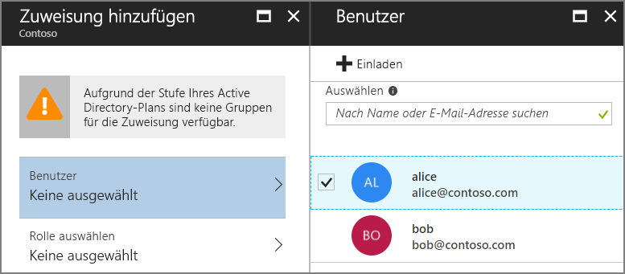

6.  Wählen Sie die Rolle aus, und klicken Sie auf **Auswählen**.

    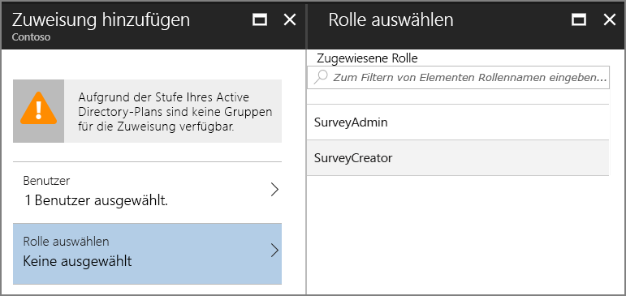

7.  Klicken Sie auf **Zuweisen**.

Wiederholen Sie die gleichen Schritte, um Rollen für die Survey.WebAPI-Anwendung zuzuweisen.

> Wichtig: Ein Benutzer sollte in der Survey-Anwendung und der Survey.WebAPI-Anwendung immer über die gleichen Rollen verfügen. Andernfalls verfügt der Benutzer über nicht übereinstimmende Berechtigungen, was zur Ausgabe des Fehlers 403 (Verboten) durch die Web-API führen kann.

Kehren Sie jetzt zur App zurück, und melden Sie sich erneut an. Klicken Sie auf **My Surveys** (Meine Umfragen). Wenn der Benutzer der Rolle SurveyAdmin oder SurveyCreator zugewiesen ist, wird die Schaltfläche **Create Survey** (Umfrage erstellen) angezeigt. Dies bedeutet, dass der Benutzer über Berechtigungen zum Erstellen einer neuen Umfrage verfügt.

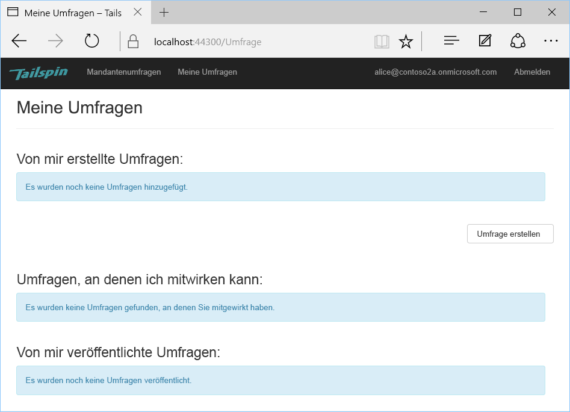


<!-- links -->

[portal]: https://portal.azure.com
[VS2017]: https://www.visualstudio.com/vs/
