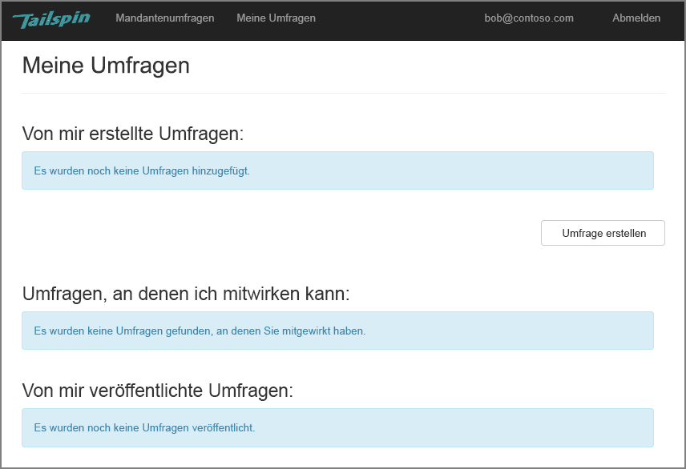
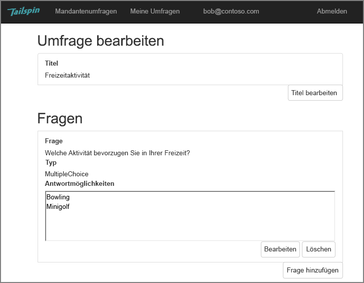
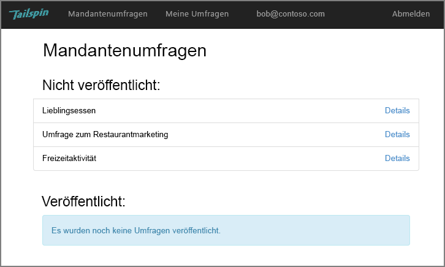
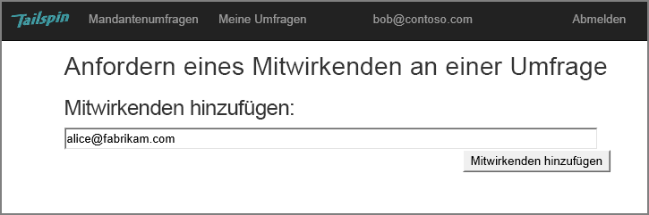
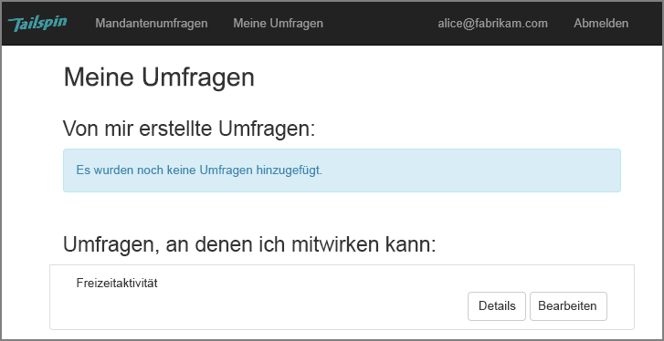
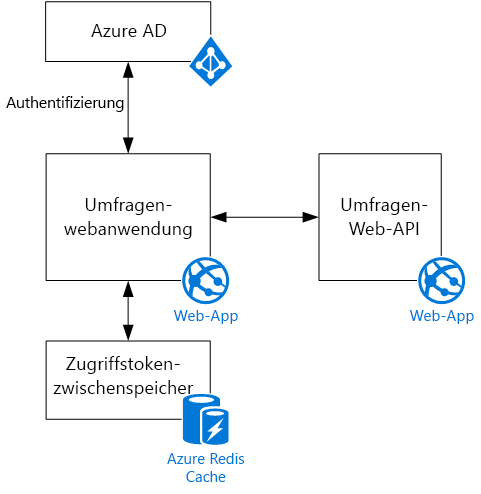

# Das Tailspin-Szenario

[-Beispielcode][sample application]

Tailspin ist ein fiktives Unternehmen, das eine SaaS-Anwendung mit dem Namen „Surveys“ entwickelt. Diese Anwendung ermöglicht Organisationen das Erstellen und Veröffentlichen von Online-Umfragen.

* Eine Organisation kann sich für die Anwendung registrieren.
* Nach der Registrierung der Organisation können sich Benutzer bei der Anwendung mit ihren Organisationsanmeldeinformationen anmelden.
* Benutzer können Umfragen erstellen, bearbeiten und veröffentlichen.

> [!NOTE]
> Informationen zu den ersten Schritten mit der Anwendung finden Sie unter [Ausführen der Surveys-Anwendung].
> 
> 

## Benutzer können Umfragen erstellen, bearbeiten und anzeigen
Ein authentifizierter Benutzer kann alle Umfragen anzeigen, die er erstellt hat oder für die er über Rechte vom Typ „Mitwirkender“ besitzt, und neue Umfragen erstellen. Beachten Sie, dass der Benutzer mit seiner Organisationsidentität angemeldet ist: `bob@contoso.com`.

Dieser Screenshot zeigt die Seite „Edit Survey“:

Benutzer können innerhalb desselben Mandanten auch alle von anderen Benutzern erstellten Umfragen anzeigen.

## Besitzer von Umfragen können Mitwirkende einladen
Wenn ein Benutzer eine Umfrage erstellt, kann er andere Personen als Teilnehmer zur Umfrage einladen. Teilnehmer können die Umfrage bearbeiten, sie aber nicht löschen oder bereitstellen.  

Ein Benutzer kann Teilnehmer aus anderen Mandanten hinzufügen, was die mandantenübergreifende Freigabe von Ressourcen ermöglicht. In diesem Screenshot fügt Bob (`bob@contoso.com`) die Benutzerin Alice (`alice@fabrikam.com`) einer von Bob erstellten Umfrage als Mitwirkende hinzu.

Wenn sich Alice anmeldet, sieht sie die Umfrage unter „Surveys I can contribute to“.

Beachten Sie, dass sich Alice an Ihrem eigenen Mandanten und nicht als Gast des Contoso-Mandanten anmeldet. Alice verfügt nur für diese Umfrage über eine Berechtigung vom Typ „Mitwirkender“ und kann keine anderen Umfragen des Contoso-Mandanten anzeigen.

## Architektur
Die Anwendung „Surveys“ besteht aus einem Web-Front-End und einem Web-API-Back-End. Beide werden mit [ASP.NET Core] implementiert.

Die Webanwendung nutzt Azure Active Directory (Azure AD) zum Authentifizieren von Benutzern. Die Webanwendung ruft auch Azure AD auf, um OAuth 2-Zugriffstoken für die Web-API zu erhalten. Zugriffstoken werden im Azure Redis Cache zwischengespeichert. Mit diesem Cache können mehrere Instanzen denselben Tokencache gemeinsam nutzen (z.B. in einer Serverfarm).

[**Weiter**][authentication]

<!-- Links -->

[authentication]: authenticate.md

[Ausführen der Surveys-Anwendung]: ./run-the-app.md
[ASP.NET Core]: /aspnet/core
[sample application]: https://github.com/mspnp/multitenant-saas-guidance
