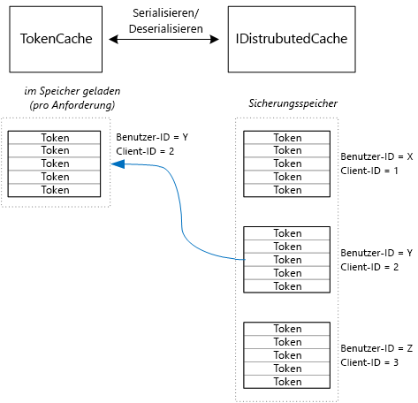

# <a name="cache-access-tokens"></a>Zwischenspeichern von Zugriffstoken

[-Beispielcode][sample application]

Es ist relativ aufwendig, ein OAuth-Zugriffstokens abzurufen, da dafür eine HTTP-Anforderung an den Tokenendpunkt erforderlich ist. Daher ist es ratsam, Token nach Möglichkeit in einem Cache zwischenzuspeichern. In der [Azure AD Authentication Library][ADAL] (ADAL) werden aus Azure AD abgerufene Token, einschließlich Aktualisierungstoken, automatisch zwischengespeichert.

Die ADAL bietet eine Standardimplementierung eines Tokencaches. Doch dieser Tokencache ist für native Client-Apps vorgesehen und für Web-Apps **nicht** geeignet:

* Es handelt sich um eine statische Instanz, die nicht threadsicher ist.
* Eine Skalierung auf eine große Anzahl von Benutzern ist nicht möglich, da Token aller Benutzer in dasselbe Verzeichnis übertragen werden.
* Eine gemeinsame Nutzung auf den Webservern einer Farm ist ebenfalls nicht möglich.

Stattdessen müssen Sie einen benutzerdefinierten Tokencache implementieren, der von der ADAL-Klasse `TokenCache` abgeleitet ist, sich aber für eine Serverumgebung eignet und den gewünschten Grad an Isolation zwischen Token verschiedener Benutzer bietet.

Die `TokenCache`-Klasse speichert ein Tokenwörterbuch, das nach Aussteller, Ressource, Client-ID und Benutzer indiziert ist. Ein benutzerdefinierter Tokencache sollte dieses Wörterbuch in einen Sicherungsspeicher, z.B. in Redis Cache, schreiben.

In der Tailspin-Anwendung „Surveys“ implementiert die `DistributedTokenCache` -Klasse den Tokencache. In dieser Implementierung wird die [IDistributedCache][distributed-cache]-Abstraktion aus ASP.NET Core verwendet. Deshalb können alle `IDistributedCache` -Implementierungen als Sicherungsspeicher verwendet werden.

* Standardmäßig verwendet die App „Surveys“ einen Redis-Cache.
* Bei einem Einzelinstanz-Webserver können Sie den [In-Memory-Cache][in-memory-cache] von ASP.NET Core verwenden. (Dies ist auch eine gute Wahl für die lokale Ausführung der App während der Entwicklung.)

`DistributedTokenCache` speichert die Cachedaten als Schlüssel-Wert-Paare im Sicherungsspeicher. Der Schlüssel besteht aus Benutzer-ID und Client-ID, damit der Sicherungsspeicher separate Cachedaten für jede eindeutige Benutzer-Client-Kombination enthält.



Der Sicherungsspeicher ist nach Benutzer partitioniert. Für jede HTTP-Anforderung werden die Token für den Benutzer aus dem Sicherungsspeicher gelesen und in das `TokenCache`-Wörterbuch geladen. Wenn Redis als Sicherungsspeicher verwendet wird, liest/schreibt jede Serverinstanz in einer Serverfarm in den gleichen Cache bzw. aus dem gleichen Cache, und dieser Ansatz wird auf viele Benutzer skaliert.

## <a name="encrypting-cached-tokens"></a>Verschlüsseln zwischengespeicherter Token
Token sind vertrauliche Daten, da sie den Zugriff auf Ressourcen eines Benutzers gewähren. (Sie können zudem, im Gegensatz zum Kennwort eines Benutzers, nicht einfach den Hash eines Tokens speichern.) Deshalb müssen Token unbedingt vor Gefährdung geschützt werden. Doch wenn sich jemand das Kennwort verschafft, können alle zwischengespeicherten Zugriffstoken abgerufen werden. Aus diesem Grund verschlüsselt der `DistributedTokenCache` alle Elemente, die in den Sicherungsspeicher geschrieben werden. Die Verschlüsselung erfolgt mithilfe der [Datenschutz][data-protection]-APIs von ASP.NET Core.

> [!NOTE]
> Wenn die Bereitstellung auf Azure-Websites erfolgt, werden die Verschlüsselungsschlüssel im Netzwerkspeicher gesichert und auf allen Computern synchronisiert (siehe [Schlüsselverwaltung und Lebensdauer][key-management]). Bei der Ausführung auf Azure-Websites werden Schlüssel standardmäßig nicht verschlüsselt. Sie können jedoch [die Verschlüsselung mit einem X.509-Zertifikat aktivieren][x509-cert-encryption].
> 
> 

## <a name="distributedtokencache-implementation"></a>„DistributedTokenCache“-Implementierung
Die `DistributedTokenCache`-Klasse wird von der ADAL-[TokenCache][tokencache-class]-Klasse abgeleitet.

Im Konstruktor erstellt die `DistributedTokenCache` -Klasse einen Schlüssel für den aktuellen Benutzer und lädt den Cache aus dem Sicherungsspeicher:

```csharp
public DistributedTokenCache(
    ClaimsPrincipal claimsPrincipal,
    IDistributedCache distributedCache,
    ILoggerFactory loggerFactory,
    IDataProtectionProvider dataProtectionProvider)
    : base()
{
    _claimsPrincipal = claimsPrincipal;
    _cacheKey = BuildCacheKey(_claimsPrincipal);
    _distributedCache = distributedCache;
    _logger = loggerFactory.CreateLogger<DistributedTokenCache>();
    _protector = dataProtectionProvider.CreateProtector(typeof(DistributedTokenCache).FullName);
    AfterAccess = AfterAccessNotification;
    LoadFromCache();
}
```

Der Schlüssel wird durch Verkettung von Benutzer-ID und Client-ID erstellt. Beide Angaben stammen aus den Ansprüchen im `ClaimsPrincipal`des Benutzers:

```csharp
private static string BuildCacheKey(ClaimsPrincipal claimsPrincipal)
{
    string clientId = claimsPrincipal.FindFirstValue("aud", true);
    return string.Format(
        "UserId:{0}::ClientId:{1}",
        claimsPrincipal.GetObjectIdentifierValue(),
        clientId);
}
```

Um zwischengespeicherte Daten zu laden, lesen Sie das serialisierte Blob aus dem Sicherungsspeicher und rufen `TokenCache.Deserialize` zum Konvertieren des Blobs in Cachedaten auf.

```csharp
private void LoadFromCache()
{
    byte[] cacheData = _distributedCache.Get(_cacheKey);
    if (cacheData != null)
    {
        this.Deserialize(_protector.Unprotect(cacheData));
    }
}
```

Wenn die ADAL auf den Cache zugreift, wird ein `AfterAccess` -Ereignis ausgelöst. Wenn sich die Daten im Cache geändert haben, ist die `HasStateChanged` -Eigenschaft „true“. Aktualisieren Sie in diesem Fall den Sicherungsspeicher, um die Änderung zu übernehmen, und legen Sie dann `HasStateChanged` auf „false“ fest.

```csharp
public void AfterAccessNotification(TokenCacheNotificationArgs args)
{
    if (this.HasStateChanged)
    {
        try
        {
            if (this.Count > 0)
            {
                _distributedCache.Set(_cacheKey, _protector.Protect(this.Serialize()));
            }
            else
            {
                // There are no tokens for this user/client, so remove the item from the cache.
                _distributedCache.Remove(_cacheKey);
            }
            this.HasStateChanged = false;
        }
        catch (Exception exp)
        {
            _logger.WriteToCacheFailed(exp);
            throw;
        }
    }
}
```

„TokenCache“ sendet zwei weitere Ereignisse:

* `BeforeWrite`. Wird aufgerufen, unmittelbar bevor die ADAL Daten in den Cache schreibt. Es dient zum Implementieren einer Strategie für Parallelität.
* `BeforeAccess`. Wird aufgerufen, unmittelbar bevor ADAL Daten aus dem Cache liest. Hier können Sie den Cache erneut laden, um die neueste Version abzurufen.

In unserem Fall haben wir entschieden, diese beiden Ereignisse nicht zu behandeln.

* Hinsichtlich der Parallelität hat der letzte Schreibzugriff Priorität. Das ist in Ordnung, da Token für jeden Benutzer und Client eigenständig gespeichert werden und somit nur ein Konflikt auftritt, wenn für einen Benutzer zwei gleichzeitige Anmeldesitzungen vorhanden sind.
* Für Lesevorgänge wird der Cache bei jeder Anforderung geladen. Anforderungen sind kurzlebig. Wenn der Cache in diesem Zeitraum geändert wird, wählt die nächste Anforderung den neuen Wert.

[**Weiter**][client-assertion]

<!-- links -->
[ADAL]: https://msdn.microsoft.com/library/azure/jj573266.aspx
[client-assertion]: ./client-assertion.md
[data-protection]: /aspnet/core/security/data-protection/
[distributed-cache]: /aspnet/core/performance/caching/distributed
[key-management]: /aspnet/core/security/data-protection/configuration/default-settings
[in-memory-cache]: /aspnet/core/performance/caching/memory
[tokencache-class]: https://msdn.microsoft.com/library/azure/microsoft.identitymodel.clients.activedirectory.tokencache.aspx
[x509-cert-encryption]: /aspnet/core/security/data-protection/implementation/key-encryption-at-rest#x509-certificate
[sample application]: https://github.com/mspnp/multitenant-saas-guidance
