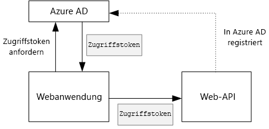
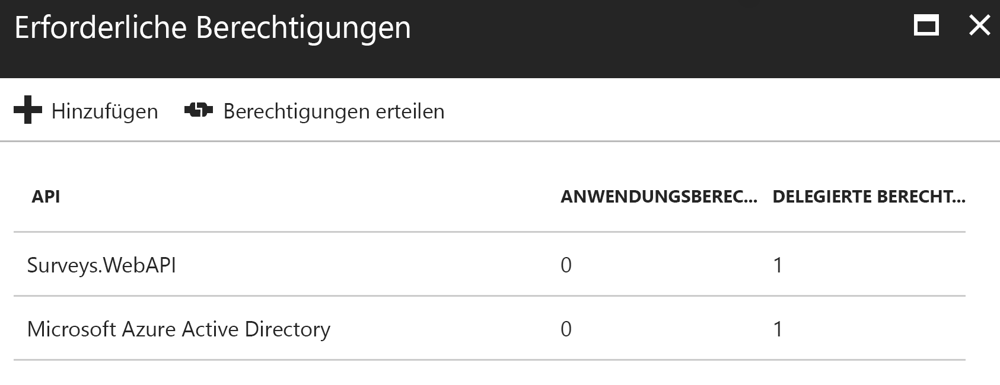

# <a name="secure-a-backend-web-api"></a>Schützen einer Back-End-Web-API

[-Beispielcode][sample application]

Die Anwendung [Tailspin Surveys] verwendet eine Back-End-Web-API zum Verwalten von CRUD-Vorgängen für Umfragen. Klickt ein Benutzer beispielsweise auf „My Surveys“, sendet die Webanwendung eine HTTP-Anforderung an die Web-API:

```
GET /users/{userId}/surveys
```

Die Web-API gibt ein JSON-Objekt zurück:

```
{
  "Published":[],
  "Own":[
    {"Id":1,"Title":"Survey 1"},
    {"Id":3,"Title":"Survey 3"},
    ],
  "Contribute": [{"Id":8,"Title":"My survey"}]
}
```

Die Web-API lässt keine anonymen Anforderungen zu, sodass sich die Web-App mithilfe von OAuth2-Bearertoken selbst authentifizieren muss.

> [!NOTE]
> Dies ist ein Szenario zwischen Servern. Die Anwendung richtet aus dem Browserclient keine AJAX-Aufrufe an die API.
> 
> 

Sie können zwischen zwei Ansätzen wählen:

* Delegierte Benutzeridentität. Die Webanwendung authentifiziert sich mit der Identität des Benutzers.
* Anwendungsidentität. Die Webanwendung authentifiziert sich mit Ihrer Client-ID bei Befolgen des OAuth2-Ablaufs für Clientanmeldeinformationen.

Die Tailspin-Anwendung implementiert die delegierte Benutzeridentität. Im Folgenden werden die Hauptunterschiede erläutert:

**Delegierte Benutzeridentität**

* Das an die Web-API gesendete Bearertoken enthält die Identität des Benutzers.
* Die Web-API trifft Autorisierungsentscheidungen basierend auf der Identität des Benutzers.
* Die Webanwendung muss von der Web-API eingehende Fehler des Typs „403 (Verboten)“ behandeln, wenn der Benutzer für das Ausführen einer Aktion nicht autorisiert ist.
* Zumeist trifft die Webanwendung weiterhin einige sich auf die Benutzeroberfläche beziehende Autorisierungsentscheidungen (wie das Ein- und Ausblenden von Benutzeroberflächenelementen).
* Die Web-API kann möglicherweise von nicht vertrauenswürdigen Clients verwendet werden, z. B. einer JavaScript-Anwendung oder einer systemeigenen Clientanwendung.

**Anwendungsidentität**

* Die Web-API ruft keine Informationen zum Benutzer ab.
* Die Web-API kann keine Autorisierung anhand der Identität des Benutzers vornehmen. Alle Autorisierungsentscheidungen werden von der Webanwendung getroffen.  
* Die Web-API kann nicht von einem nicht vertrauenswürdigen Client (JavaScript oder native Clientanwendung) verwendet werden.
* Dieser Ansatz ist möglicherweise etwas einfacher zu implementieren, da keine Autorisierungslogik in der Web-API vorhanden ist.

Bei beiden Ansätzen muss die Webanwendung ein Zugriffstoken als Anmeldeinformation erhalten, die für das Aufrufen der Web-API erforderlich ist.

* Für die delegierte Benutzeridentität muss das Token vom Identitätsanbieter stammen, der ein Token für den Benutzer ausstellen kann.
* Für Clientanmeldeinformationen kann eine Anwendung das Token vom Identitätsanbieter abrufen oder einen eigenen Tokenserver hosten. (Schreiben Sie aber keinen Tokenserver von Grund auf neu, sondern verwenden Sie ein sorgfältig getestetes Framework, z. B. [IdentityServer3].) Beim Authentifizieren mit Azure AD wird dringend empfohlen, das Zugriffstoken auch beim Vorgang mit Clientanmeldeinformationen aus Azure AD abzurufen.

Im Rest dieses Artikels wird davon ausgegangen, dass die Anwendung mithilfe von Azure AD authentifiziert wird.



## <a name="register-the-web-api-in-azure-ad"></a>Registrieren der Web-API in Azure AD
Damit Azure AD ein Bearertoken für die Web-API ausstellen kann, müssen in Azure AD verschiedene Einstellungen konfiguriert werden.

1. Registrieren Sie die Web-API in Azure AD.

2. Fügen Sie dem Anwendungsmanifest der Web-API in der `knownClientApplications` -Eigenschaft die Client-ID der Web-App hinzu. Siehe [Aktualisieren des Anwendungsmanifests].

3. Erteilen Sie der Webanwendung Berechtigungen zum Aufrufen der Web-API. Im Azure-Verwaltungsportal können Sie zwei Arten von Berechtigungen festlegen: „Anwendungsberechtigungen“ für die Anwendungsidentität (Vorgang mit Clientanmeldeinformationen) oder „Delegierte Berechtigungen“ für die delegierte Benutzeridentität.
   
   

## <a name="getting-an-access-token"></a>Abrufen eines Zugriffstokens
Vor dem Aufruf der Web-API ruft die Webanwendung ein Zugriffstoken aus Azure AD ab. Verwenden Sie in einer .NET-Anwendung die [Azure AD-Authentifizierungsbibliothek (ADAL) für .NET][ADAL].

Beim Vorgang mit OAuth 2-Autorisierungscode tauscht die Anwendung einen Autorisierungscode gegen ein Zugriffstoken. Der folgende Code verwendet die ADAL, um das Zugriffstoken abzurufen. Dieser Code wird während des `AuthorizationCodeReceived` -Ereignisses abgerufen.

```csharp
// The OpenID Connect middleware sends this event when it gets the authorization code.   
public override async Task AuthorizationCodeReceived(AuthorizationCodeReceivedContext context)
{
    string authorizationCode = context.ProtocolMessage.Code;
    string authority = "https://login.microsoftonline.com/" + tenantID
    string resourceID = "https://tailspin.onmicrosoft.com/surveys.webapi" // App ID URI
    ClientCredential credential = new ClientCredential(clientId, clientSecret);

    AuthenticationContext authContext = new AuthenticationContext(authority, tokenCache);
    AuthenticationResult authResult = await authContext.AcquireTokenByAuthorizationCodeAsync(
        authorizationCode, new Uri(redirectUri), credential, resourceID);

    // If successful, the token is in authResult.AccessToken
}
```

Hier die verschiedenen erforderlichen Parameter:

* `authority`. Von der Mandanten-ID des angemeldeten Benutzers abgeleitet. (Nicht die Mandanten-ID des SaaS-Anbieters)  
* `authorizationCode`. Der Autorisierungscode, den Sie vom Identitätsanbieter erhalten haben.
* `clientId`. Die Client-ID der Webanwendung.
* `clientSecret`. Der geheime Clientschlüssel der Webanwendung.
* `redirectUri`. Der Umleitung-URI, den Sie für OpenID Connect festgelegt haben. Hier folgt der Rückruf des Identitätsanbieters mit dem Token.
* `resourceID`. Die App-ID-URI der Web-API, die Sie bei der Registrierung der Web-API in Azure AD erstellt haben.
* `tokenCache`. Ein Objekt, das die Zugriffstoken zwischengespeichert. Siehe [Tokencaching].

Wenn `AcquireTokenByAuthorizationCodeAsync` erfolgreich ist, speichert die ADAL das Token zwischen. Später können Sie das Token durch Aufrufen von „AcquireTokenSilentAsync“ aus dem Cache abrufen:

```csharp
AuthenticationContext authContext = new AuthenticationContext(authority, tokenCache);
var result = await authContext.AcquireTokenSilentAsync(resourceID, credential, new UserIdentifier(userId, UserIdentifierType.UniqueId));
```

Hierbei ist `userId` die Objekt-ID des Benutzers, die sich im Anspruch `http://schemas.microsoft.com/identity/claims/objectidentifier` befindet.

## <a name="using-the-access-token-to-call-the-web-api"></a>Aufrufen der Web-API mithilfe des Zugriffstokens
Sobald Sie das Token haben, senden Sie es im „Authorization“-Header der HTTP-Anforderungen an die Web-API.

```
Authorization: Bearer xxxxxxxxxx
```

Die folgende Erweiterungsmethode aus der Anwendung „Surveys“ legt den „Authorization“-Header unter Verwendung der **HttpClient** -Klasse auf eine HTTP-Anforderung fest.

```csharp
public static async Task<HttpResponseMessage> SendRequestWithBearerTokenAsync(this HttpClient httpClient, HttpMethod method, string path, object requestBody, string accessToken, CancellationToken ct)
{
    var request = new HttpRequestMessage(method, path);
    if (requestBody != null)
    {
        var json = JsonConvert.SerializeObject(requestBody, Formatting.None);
        var content = new StringContent(json, Encoding.UTF8, "application/json");
        request.Content = content;
    }

    request.Headers.Authorization = new AuthenticationHeaderValue("Bearer", accessToken);
    request.Headers.Accept.Add(new MediaTypeWithQualityHeaderValue("application/json"));

    var response = await httpClient.SendAsync(request, ct);
    return response;
}
```

## <a name="authenticating-in-the-web-api"></a>Authentifizierung in der Web-API
Die Web-API muss das Bearertoken authentifizieren. In ASP.NET Core, können Sie das Paket [Microsoft.AspNet.Authentication.JwtBearer][JwtBearer] verwenden. Dieses Paket enthält Middleware, die der Anwendung das Empfangen von OpenID Connect-Bearertoken ermöglicht.

Registrieren Sie die Middleware in Ihrer Web-API-Klasse `Startup` .

```csharp
public void Configure(IApplicationBuilder app, IHostingEnvironment env, ApplicationDbContext dbContext, ILoggerFactory loggerFactory)
{
    // ...

    app.UseJwtBearerAuthentication(new JwtBearerOptions {
        Audience = configOptions.AzureAd.WebApiResourceId,
        Authority = Constants.AuthEndpointPrefix,
        TokenValidationParameters = new TokenValidationParameters {
            ValidateIssuer = false
        },
        Events= new SurveysJwtBearerEvents(loggerFactory.CreateLogger<SurveysJwtBearerEvents>())
    });
    
    // ...
}
```

* **Audience**. Legen Sie diese Einstellung auf die App-ID-URI der Web-API fest, die Sie bei der Registrierung der Web-API in Azure AD erstellt haben.
* **Authority**. Legen Sie diese Einstellung für eine mehrinstanzenfähige Anwendung auf `https://login.microsoftonline.com/common/` fest.
* **TokenValidationParameters**. Legen Sie für eine mehrinstanzenfähige Anwendung **ValidateIssuer** auf „false“ fest. Das bedeutet, dass die Anwendung den Aussteller überprüft.
* **Events** ist eine von **JwtBearerEvents** abgeleitete Klasse.

### <a name="issuer-validation"></a>Überprüfung des Ausstellers
Überprüfen Sie den Aussteller des Tokens im **JwtBearerEvents.TokenValidated**-Ereignis. Der Aussteller wird im Anspruch „iss“ gesendet.

In der Anwendung „Surveys“ wird die [Mandantenanmeldung]nicht von der Web-API verarbeitet. Daher wird nur überprüft, ob der Aussteller bereits in der Anwendungsdatenbank vorhanden ist. Falls nicht, wird eine Ausnahme ausgelöst, die einen Authentifizierungsfehler verursacht.

```csharp
public override async Task TokenValidated(TokenValidatedContext context)
{
    var principal = context.Ticket.Principal;
    var tenantManager = context.HttpContext.RequestServices.GetService<TenantManager>();
    var userManager = context.HttpContext.RequestServices.GetService<UserManager>();
    var issuerValue = principal.GetIssuerValue();
    var tenant = await tenantManager.FindByIssuerValueAsync(issuerValue);

    if (tenant == null)
    {
        // The caller was not from a trusted issuer. Throw to block the authentication flow.
        throw new SecurityTokenValidationException();
    }

    var identity = principal.Identities.First();

    // Add new claim for survey_userid
    var registeredUser = await userManager.FindByObjectIdentifier(principal.GetObjectIdentifierValue());
    identity.AddClaim(new Claim(SurveyClaimTypes.SurveyUserIdClaimType, registeredUser.Id.ToString()));
    identity.AddClaim(new Claim(SurveyClaimTypes.SurveyTenantIdClaimType, registeredUser.TenantId.ToString()));

    // Add new claim for Email
    var email = principal.FindFirst(ClaimTypes.Upn)?.Value;
    if (!string.IsNullOrWhiteSpace(email))
    {
        identity.AddClaim(new Claim(ClaimTypes.Email, email));
    }
}
```

Wie dieses Beispiel zeigt, können Sie auch das **TokenValidated**-Ereignis zum Ändern der Ansprüche verwenden. Denken Sie daran, dass die Ansprüche direkt von Azure AD stammen. Wenn die Webanwendung die abgerufenen Ansprüche ändert, werden diese Änderungen nicht in dem von der Web-API empfangenen Bearertoken angezeigt. Weitere Informationen finden Sie unter [Transformationen von Ansprüchen][claims-transformation].

## <a name="authorization"></a>Autorisierung
Eine allgemeine Erörterung der Autorisierung finden Sie unter [Rollenbasierte und ressourcenbasierte Autorisierung][Authorization]. 

Die JwtBearer-Middleware verarbeitet die Autorisierungsantworten. Wenn Sie z. B. eine Controlleraktion auf authentifizierte Benutzer beschränken möchten, verwenden Sie das Attribut **[Authorize]**, und geben Sie **JwtBearerDefaults.AuthenticationScheme** als Authentifizierungsschema an:

```csharp
[Authorize(ActiveAuthenticationSchemes = JwtBearerDefaults.AuthenticationScheme)]
```

Dies gibt den Statuscode 401 zurück, wenn der Benutzer nicht authentifiziert ist.

Soll eine Controlleraktion mithilfe einer Autorisierungsrichtlinie beschränkt werden, geben Sie den Richtliniennamen im Attribut **[Authorize]** an:

```csharp
[Authorize(Policy = PolicyNames.RequireSurveyCreator)]
```

Dies gibt den Statuscode 401 zurück, wenn der Benutzer nicht authentifiziert ist, und 403, wenn der Benutzer authentifiziert, aber nicht autorisiert ist. Registrieren Sie die Richtlinie beim Start:

```csharp
public void ConfigureServices(IServiceCollection services)
{
    services.AddAuthorization(options =>
    {
        options.AddPolicy(PolicyNames.RequireSurveyCreator,
            policy =>
            {
                policy.AddRequirements(new SurveyCreatorRequirement());
                policy.RequireAuthenticatedUser(); // Adds DenyAnonymousAuthorizationRequirement 
                policy.AddAuthenticationSchemes(JwtBearerDefaults.AuthenticationScheme);
            });
        options.AddPolicy(PolicyNames.RequireSurveyAdmin,
            policy =>
            {
                policy.AddRequirements(new SurveyAdminRequirement());
                policy.RequireAuthenticatedUser(); // Adds DenyAnonymousAuthorizationRequirement 
                policy.AddAuthenticationSchemes(JwtBearerDefaults.AuthenticationScheme);
            });
    });
    
    // ...
}
```

[**Weiter**][token cache]

<!-- links -->
[ADAL]: https://msdn.microsoft.com/library/azure/jj573266.aspx
[JwtBearer]: https://www.nuget.org/packages/Microsoft.AspNet.Authentication.JwtBearer

[Tailspin Surveys]: tailspin.md
[IdentityServer3]: https://github.com/IdentityServer/IdentityServer3
[Aktualisieren des Anwendungsmanifests]: ./run-the-app.md#update-the-application-manifests
[Tokencaching]: token-cache.md
[Mandantenanmeldung]: signup.md
[claims-transformation]: claims.md#claims-transformations
[Authorization]: authorize.md
[sample application]: https://github.com/mspnp/multitenant-saas-guidance
[token cache]: token-cache.md
