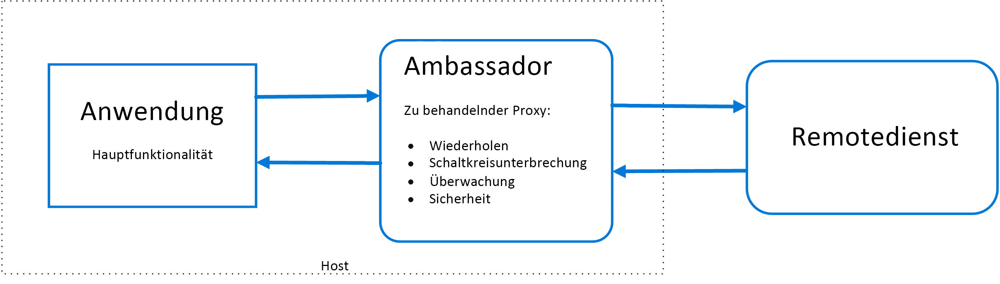
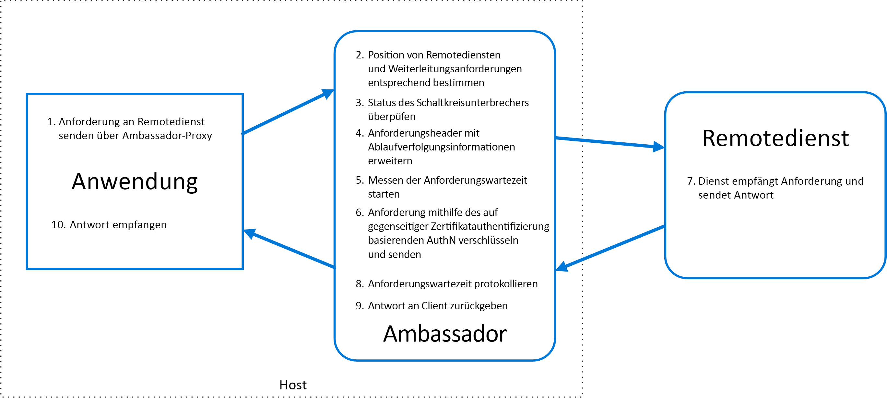

# BotschaftermusterAmbassador pattern

Erstellen Sie Hilfsdienste, die im Auftrag von Consumerdiensten oder -anwendungen Netzwerkanforderungen senden.Create helper services that send network requests on behalf of a consumer service or application. Ein Botschafterdienst ist ein Proxy außerhalb eines Prozesses, der sich am gleichen Ort befindet wie der Client.An ambassador service can be thought of as an out-of-process proxy that is co-located with the client.

Dieses Muster kann hilfreich sein, um allgemeine Clientkonnektivitätstasks sprachunabhängig auszulagern, beispielsweise Überwachung, Protokollierung, Routing, Sicherheit (z.B. TLS) sowie [Resilienzmuster][resiliency-patterns].This pattern can be useful for offloading common client connectivity tasks such as monitoring, logging, routing, security (such as TLS), and [resiliency patterns][resiliency-patterns] in a language agnostic way. Es wird häufig mit älteren Anwendungen oder anderen Anwendungen verwendet, die sich nicht einfach ändern lassen, um die Netzwerkfunktionen dieser Anwendungen zu erweitern.It is often used with legacy applications, or other applications that are difficult to modify, in order to extend their networking capabilities. Es kann es einem Spezialistenteam auch ermöglichen, diese Features zu implementieren.It can also enable a specialized team to implement those features.

## Kontext und ProblemContext and problem

Resiliente cloudbasierte Anwendungen erfordern Features wie [Sicherung][circuit-breaker], Routing, Messung und Überwachung sowie die Fähigkeit, netzwerkbezogene Konfigurationsupdates durchzuführen.Resilient cloud-based applications require features such as [circuit breaking][circuit-breaker], routing, metering and monitoring, and the ability to make network-related configuration updates. Es kann schwierig oder sogar unmöglich sein, ältere Anwendungen oder vorhandene Codebibliotheken zu aktualisieren und diese Features hinzuzufügen, weil der Code nicht mehr verwaltet wird oder durch das Entwicklungsteam nicht einfach geändert werden kann.It may be difficult or impossible to update legacy applications or existing code libraries to add these features, because the code is no longer maintained or can't be easily modified by the development team.

Netzwerkaufrufe erfordern möglicherweise auch einen hohen Konfigurationsaufwand hinsichtlich Verbindung, Authentifizierung und Autorisierung.Network calls may also require substantial configuration for connection, authentication, and authorization. Wenn diese Aufrufe über mehrere Anwendungen hinweg verwendet werden, die mit verschiedenen Sprachen und Frameworks erstellt wurden, müssen die Aufrufe für jede dieser Instanzen konfiguriert werden.If these calls are used across multiple applications, built using multiple languages and frameworks, the calls must be configured for each of these instances. Darüber hinaus müssen möglicherweise Netzwerk- und Sicherheitsfunktionen durch ein zentrales Team in Ihrer Organisation verwaltet werden.In addition, network and security functionality may need to be managed by a central team within your organization. Bei einer umfangreichen Codebasis kann es riskant sein, wenn das Team Anwendungscode aktualisieren soll, mit dem es nicht vertraut ist.With a large code base, it can be risky for that team to update application code they aren't familiar with.

## LösungSolution

Platzieren Sie Clientframeworks und -bibliotheken in einen externen Prozess, der als Proxy zwischen Ihrer Anwendung und externen Diensten fungiert.Put client frameworks and libraries into an external process that acts as a proxy between your application and external services. Stellen Sie den Proxy in der gleichen Hostumgebung bereit wie Ihre Anwendung, um Routing-, Resilienz- und Sicherheitsfeatures steuern zu können und um Zugriffseinschränkungen aufgrund des Hosts zu verhindern.Deploy the proxy on the same host environment as your application to allow control over routing, resiliency, security features, and to avoid any host-related access restrictions. Sie können das Botschaftermuster auch zum Standardisieren und Erweitern der Instrumentierung verwenden.You can also use the ambassador pattern to standardize and extend instrumentation. Der Proxy kann Leistungsmetriken wie Latenz und Ressourcennutzung überwachen. Diese Überwachung erfolgt in der gleichen Hostumgebung, in der sich auch die Anwendung befindet.The proxy can monitor performance metrics such as latency or resource usage, and this monitoring happens in the same host environment as the application.

Features, die in den Botschafter ausgelagert werden, können unabhängig von der Anwendung verwaltet werden.Features that are offloaded to the ambassador can be managed independently of the application. Sie können den Botschafter aktualisieren und ändern, ohne die Legacyfunktionen der Anwendung zu beeinträchtigen.You can update and modify the ambassador without disturbing the application's legacy functionality. Das Muster ermöglicht es separaten Spezialistenteams auch, Sicherheits-, Netzwerk- oder Authentifizierungsfeatures zu implementieren und zu verwalten, die in den Botschafter verschoben wurden.It also allows for separate, specialized teams to implement and maintain security, networking, or authentication features that have been moved to the ambassador.

Botschafterdienste können als [Sidecar][sidecar] bereitgestellt werden, um den Lebenszyklus einer konsumierenden Anwendung oder eines konsumierenden Diensts zu begleiten.Ambassador services can be deployed as a [sidecar][sidecar] to accompany the lifecycle of a consuming application or service. Alternativ dazu kann ein Botschafter auch als Daemon oder Windows-Dienst bereitgestellt werden, wenn er von mehreren separaten Prozessen auf einem gemeinsamen Host verwendet wird.Alternatively, if an ambassador is shared by multiple separate processes on a common host, it can be deployed as a daemon or Windows service. Wenn der konsumierende Dienst in Form von Containern bereitgestellt wurde, sollte der Botschafter als separater Container auf dem gleichen Host erstellt werden. Für die Kommunikation müssen die geeigneten Links konfiguriert werden.If the consuming service is containerized, the ambassador should be created as a separate container on the same host, with the appropriate links configured for communication.

## Probleme und ÜberlegungenIssues and considerations

- Durch den Proxy entsteht ein gewisser Latenzoverhead.The proxy adds some latency overhead. Überlegen Sie, ob eine Clientbibliothek, die direkt von der Anwendung aufgerufen wird, möglicherweise ein besserer Ansatz ist.Consider whether a client library, invoked directly by the application, is a better approach.
- Berücksichtigen Sie die möglichen Auswirkungen der Einbindung von generalisierten Features in den Proxy.Consider the possible impact of including generalized features in the proxy. Der Botschafter kann z.B. Wiederholungsversuche verarbeiten, dies ist aber möglicherweise keine sichere Vorgehensweise, sofern nicht alle Vorgänge idempotent sind.For example, the ambassador could handle retries, but that might not be safe unless all operations are idempotent.
- Ziehen Sie einen Mechanismus in Betracht, mit dem ein bestimmter Kontext vom Client an den Proxy und zurück an den Client übergeben werden kann.Consider a mechanism to allow the client to pass some context to the proxy, as well as back to the client. Schließen Sie z.B. HTTP-Anforderungsheader ein, um Wiederholungen zu deaktivieren oder die maximale Anzahl von Wiederholungsversuchen anzugeben.For example, include HTTP request headers to opt out of retry or specify the maximum number of times to retry.
- Planen Sie, wie Sie den Proxy packen und bereitstellen werden.Consider how you will package and deploy the proxy.
- Entscheiden Sie, ob Sie eine einzige, gemeinsam genutzte Instanz für alle Clients oder eine Instanz pro Client verwenden möchten.Consider whether to use a single shared instance for all clients or an instance for each client.

## Verwendung dieses MustersWhen to use this pattern

Verwenden Sie dieses Muster in folgenden Fällen:Use this pattern when you:

- Sie müssen einen gemeinsamen Satz von Konnektivitätsfeatures für mehrere Sprachen oder Frameworks erstellen.Need to build a common set of client connectivity features for multiple languages or frameworks.
- Sie müssen übergreifende Fragen der Clientkonnektivität an Infrastrukturentwickler oder andere Spezialistenteams auslagern.Need to offload cross-cutting client connectivity concerns to infrastructure developers or other more specialized teams.
- Sie müssen Anforderungen an die Cloud- oder Clusterkonnektivität in einer älteren oder schwer zu ändernden Anwendung unterstützen.Need to support cloud or cluster connectivity requirements in a legacy application or an application that is difficult to modify.

Dieses Muster ist in folgenden Fällen möglicherweise nicht geeignet:This pattern may not be suitable:

- Die Latenz von Netzwerkanforderungen ist von kritischer Bedeutung.When network request latency is critical. Durch einen Proxy entsteht ein gewisser Overhead – wenn auch nur minimal –, und in einigen Fällen kann dies die Anwendung beeinträchtigen.A proxy will introduce some overhead, although minimal, and in some cases this may affect the application.
- Clientkonnektivitätsfeatures werden nur von einer einzigen Sprache genutzt.When client connectivity features are consumed by a single language. In diesem Fall wäre es besser, eine Clientbibliothek zu verwenden, die als Paket an die Entwicklungsteams verteilt wird.In that case, a better option might be a client library that is distributed to the development teams as a package.
- Konnektivitätsfeatures lassen sich nicht generalisieren und erfordern einer tiefer gehende Integration in die Clientanwendung.When connectivity features cannot be generalized and require deeper integration with the client application.

## BeispielExample

Das folgende Diagramm zeigt eine Anwendung, die über einen Botschafterproxy eine Anforderung an einen Remotedienst sendet.The following diagram shows an application making a request to a remote service via an ambassador proxy. Der Botschafter sorgt für Routing, Sicherung und Protokollierung.The ambassador provides routing, circuit breaking, and logging. Er ruft den Remotedienst auf und gibt die Antwort an die Clientanwendung zurück:It calls the remote service and then returns the response to the client application:

 

## Verwandte LeitfädenRelated guidance

- [Sidecar-MusterSidecar pattern](./sidecar.md)

<!-- links -->

[circuit-breaker]: ./circuit-breaker.md
[resiliency-patterns]: ./category/resiliency.md
[sidecar]: ./sidecar.md
