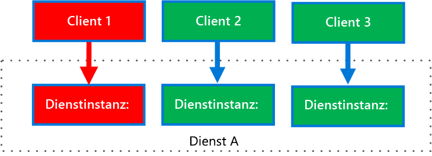

# <a name="bulkhead-pattern"></a><span data-ttu-id="98948-103">Bulkhead-Muster</span><span class="sxs-lookup"><span data-stu-id="98948-103">Bulkhead pattern</span></span>

<span data-ttu-id="98948-104">Isolieren Sie Elemente einer Anwendung in Pools, sodass die anderen Elemente beim Ausfall eines Elements weiterhin ausgeführt werden.</span><span class="sxs-lookup"><span data-stu-id="98948-104">Isolate elements of an application into pools so that if one fails, the others will continue to function.</span></span>

<span data-ttu-id="98948-105">Dieses Muster wird als *Bulkhead* (Schottwand) bezeichnet, da die Partitionen den Schottwänden eines Schiffs ähneln.</span><span class="sxs-lookup"><span data-stu-id="98948-105">This pattern is named *Bulkhead* because it resembles the sectioned partitions of a ship's hull.</span></span> <span data-ttu-id="98948-106">Wenn eine Schottwand eines Schiffs beschädigt ist, füllt sich nur der beschädigte Abschnitt mit Wasser, sodass das Schiff nicht sinkt.</span><span class="sxs-lookup"><span data-stu-id="98948-106">If the hull of a ship is compromised, only the damaged section fills with water, which prevents the ship from sinking.</span></span> 

## <a name="context-and-problem"></a><span data-ttu-id="98948-107">Kontext und Problem</span><span class="sxs-lookup"><span data-stu-id="98948-107">Context and problem</span></span>

<span data-ttu-id="98948-108">Eine cloudbasierte Anwendung kann mehrere Dienste umfassen, von denen jeder einen oder mehrere Consumer aufweist.</span><span class="sxs-lookup"><span data-stu-id="98948-108">A cloud-based application may include multiple services, with each service having one or more consumers.</span></span> <span data-ttu-id="98948-109">Eine übermäßige Last oder ein Fehler in einem Dienst wirkt sich auf alle Consumer des Diensts aus.</span><span class="sxs-lookup"><span data-stu-id="98948-109">Excessive load or failure in a service will impact all consumers of the service.</span></span>

<span data-ttu-id="98948-110">Außerdem kann ein Consumer Anforderungen an mehrere Dienste gleichzeitig senden und für jede Anforderung Ressourcen nutzen.</span><span class="sxs-lookup"><span data-stu-id="98948-110">Moreover, a consumer may send requests to multiple services simultaneously, using resources for each request.</span></span> <span data-ttu-id="98948-111">Wenn der Consumer eine Anforderung an einen Dienst sendet, der falsch konfiguriert ist oder nicht mehr reagiert, werden die für die Anforderung des Clients genutzten Ressourcen möglicherweise nicht rechtzeitig freigegeben.</span><span class="sxs-lookup"><span data-stu-id="98948-111">When the consumer sends a request to a service that is misconfigured or not responding, the resources used by the client's request may not be freed in a timely manner.</span></span> <span data-ttu-id="98948-112">Da die an den Dienst gesendeten Anforderungen bestehen bleiben, werden diese Ressourcen möglicherweise erschöpft.</span><span class="sxs-lookup"><span data-stu-id="98948-112">As requests to the service continue, those resources may be exhausted.</span></span> <span data-ttu-id="98948-113">Beispielsweise kann der Verbindungspool des Clients erschöpft sein.</span><span class="sxs-lookup"><span data-stu-id="98948-113">For example, the client's connection pool may be exhausted.</span></span> <span data-ttu-id="98948-114">Dies beeinträchtigt Anforderungen des Consumers an andere Dienste.</span><span class="sxs-lookup"><span data-stu-id="98948-114">At that point, requests by the consumer to other services are impacted.</span></span> <span data-ttu-id="98948-115">Schließlich kann der Consumer nicht nur an den ursprünglich nicht mehr reagierenden Dienst, sondern auch an andere Dienste keine Anforderungen mehr senden.</span><span class="sxs-lookup"><span data-stu-id="98948-115">Eventually the consumer can no longer send requests to other services, not just the original unresponsive service.</span></span>

<span data-ttu-id="98948-116">Das gleiche Problem der Ressourcenauslastung wirkt sich auf Dienste mit mehreren Consumern aus.</span><span class="sxs-lookup"><span data-stu-id="98948-116">The same issue of resource exhaustion affects services with multiple consumers.</span></span> <span data-ttu-id="98948-117">Eine große Anzahl von Anforderungen eines Clients erschöpft möglicherweise die im Dienst verfügbaren Ressourcen.</span><span class="sxs-lookup"><span data-stu-id="98948-117">A large number of requests originating from one client may exhaust available resources in the service.</span></span> <span data-ttu-id="98948-118">Andere Consumer können den Dienst nicht mehr nutzen, was einen kaskadierenden Fehler verursacht.</span><span class="sxs-lookup"><span data-stu-id="98948-118">Other consumers are no longer able to consume the service, causing a cascading failure effect.</span></span>

## <a name="solution"></a><span data-ttu-id="98948-119">Lösung</span><span class="sxs-lookup"><span data-stu-id="98948-119">Solution</span></span>

<span data-ttu-id="98948-120">Unterteilen Sie Dienstinstanzen in unterschiedliche Gruppen, abhängig von den Anforderungen an Consumerlast und Verfügbarkeit.</span><span class="sxs-lookup"><span data-stu-id="98948-120">Partition service instances into different groups, based on consumer load and availability requirements.</span></span> <span data-ttu-id="98948-121">Dieser Entwurf unterstützt das Isolieren von Fehlern und ermöglicht es Ihnen, auch während eines Fehlers die Dienstfunktionalität für einige Consumer aufrechtzuerhalten.</span><span class="sxs-lookup"><span data-stu-id="98948-121">This design helps to isolate failures, and allows you to sustain service functionality for some consumers, even during a failure.</span></span>

<span data-ttu-id="98948-122">Ein Consumer kann ebenfalls Ressourcen partitionieren, um sicherzustellen, dass Ressourcen, die zum Aufrufen eines Diensts genutzt werden, die zum Aufrufen anderer Dienste genutzten Ressourcen nicht beeinträchtigen.</span><span class="sxs-lookup"><span data-stu-id="98948-122">A consumer can also partition resources, to ensure that resources used to call one service don't affect the resources used to call another service.</span></span> <span data-ttu-id="98948-123">Beispielsweise kann einem Consumer, der mehrere Dienste aufruft, für jeden Dienst ein Verbindungspool zugewiesen werden.</span><span class="sxs-lookup"><span data-stu-id="98948-123">For example, a consumer that calls multiple services may be assigned a connection pool for each service.</span></span> <span data-ttu-id="98948-124">Wenn ein Dienst auszufallen beginnt, wirkt sich dies nur auf den Verbindungspool aus, der für diesen Dienst zugewiesen ist, sodass der Consumer die anderen Dienste weiter verwenden kann.</span><span class="sxs-lookup"><span data-stu-id="98948-124">If a service begins to fail, it only affects the connection pool assigned for that service, allowing the consumer to continue using the other services.</span></span>

<span data-ttu-id="98948-125">Vorteile dieses Musters:</span><span class="sxs-lookup"><span data-stu-id="98948-125">The benefits of this pattern include:</span></span>

- <span data-ttu-id="98948-126">Consumer und Dienste werden von kaskadierenden Fehlern isoliert.</span><span class="sxs-lookup"><span data-stu-id="98948-126">Isolates consumers and services from cascading failures.</span></span> <span data-ttu-id="98948-127">Ein Problem, das sich auf einen Consumer oder Dienst auswirkt, kann innerhalb des eigenen Bulkheads isoliert werden, um zu verhindern, dass die gesamte Lösung ausfällt.</span><span class="sxs-lookup"><span data-stu-id="98948-127">An issue affecting a consumer or service can be isolated within its own bulkhead, preventing the entire solution from failing.</span></span>
- <span data-ttu-id="98948-128">Sie können bei einem Dienstausfall einen Teil der Funktionalität bewahren.</span><span class="sxs-lookup"><span data-stu-id="98948-128">Allows you to preserve some functionality in the event of a service failure.</span></span> <span data-ttu-id="98948-129">Andere Dienste und Features der Anwendung werden weiterhin ausgeführt.</span><span class="sxs-lookup"><span data-stu-id="98948-129">Other services and features of the application will continue to work.</span></span>
- <span data-ttu-id="98948-130">Sie können Dienste bereitstellen, die für Consumeranwendungen eine andere Dienstqualität bieten.</span><span class="sxs-lookup"><span data-stu-id="98948-130">Allows you to deploy services that offer a different quality of service for consuming applications.</span></span> <span data-ttu-id="98948-131">Es kann ein Consumerpool hoher Priorität für die Verwendung von Diensten hoher Priorität konfiguriert werden.</span><span class="sxs-lookup"><span data-stu-id="98948-131">A high-priority consumer pool can be configured to use high-priority services.</span></span> 

<span data-ttu-id="98948-132">Im folgenden Diagramm sind Bulkheads dargestellt, die Verbindungspools umgeben, die einzelne Dienste aufrufen.</span><span class="sxs-lookup"><span data-stu-id="98948-132">The following diagram shows bulkheads structured around connection pools that call individual services.</span></span> <span data-ttu-id="98948-133">Wenn Dienst A ausfällt oder ein anderes Problem verursacht, wird der Verbindungspool isoliert, sodass nur Workloads betroffen sind, die den Dienst A zugewiesenen Threadpool verwenden.</span><span class="sxs-lookup"><span data-stu-id="98948-133">If Service A fails or causes some other issue, the connection pool is isolated, so only workloads using the thread pool assigned to Service A are affected.</span></span> <span data-ttu-id="98948-134">Workloads, die Dienst B und C verwenden, sind nicht betroffen und können ohne Unterbrechung fortgesetzt werden.</span><span class="sxs-lookup"><span data-stu-id="98948-134">Workloads that use Service B and C are not affected and can continue working without interruption.</span></span>

 

<span data-ttu-id="98948-135">Im nächsten Diagramm werden mehrere Clients gezeigt, die einen einzelnen Dienst aufgerufen.</span><span class="sxs-lookup"><span data-stu-id="98948-135">The next diagram shows multiple clients calling a single service.</span></span> <span data-ttu-id="98948-136">Jedem Client ist eine eigene Dienstinstanz zugewiesen.</span><span class="sxs-lookup"><span data-stu-id="98948-136">Each client is assigned a separate service instance.</span></span> <span data-ttu-id="98948-137">Client 1 hat zu viele Anforderungen gesendet und die zugewiesene Dienstinstanz überlastet.</span><span class="sxs-lookup"><span data-stu-id="98948-137">Client 1 has made too many requests and overwhelmed its instance.</span></span> <span data-ttu-id="98948-138">Da jede Dienstinstanz von den anderen isoliert ist, können alle anderen Clients weiterhin Aufrufe senden.</span><span class="sxs-lookup"><span data-stu-id="98948-138">Because each service instance is isolated from the others, the other clients can continue making calls.</span></span>


     
## <a name="issues-and-considerations"></a><span data-ttu-id="98948-139">Probleme und Überlegungen</span><span class="sxs-lookup"><span data-stu-id="98948-139">Issues and considerations</span></span>

- <span data-ttu-id="98948-140">Definieren Sie Partitionen entsprechend den geschäftlichen und technischen Anforderungen der Anwendung.</span><span class="sxs-lookup"><span data-stu-id="98948-140">Define partitions around the business and technical requirements of the application.</span></span>
- <span data-ttu-id="98948-141">Wenn Sie Dienste oder Consumer in Bulkheads unterteilen, berücksichtigen Sie den Grad der von der Technologie gebotenen Isolation sowie den Mehraufwand an Kosten, Leistung und Verwaltbarkeit.</span><span class="sxs-lookup"><span data-stu-id="98948-141">When partitioning services or consumers into bulkheads, consider the level of isolation offered by the technology as well as the overhead in terms of cost, performance and manageability.</span></span>
- <span data-ttu-id="98948-142">Möglicherweise empfiehlt es sich, Bulkheads mit Wiederholungs-, Trennschalter- und Drosselungsmustern zu kombinieren, um eine differenziertere Fehlerbehandlung zu ermöglichen.</span><span class="sxs-lookup"><span data-stu-id="98948-142">Consider combining bulkheads with retry, circuit breaker, and throttling patterns to provide more sophisticated fault handling.</span></span>
- <span data-ttu-id="98948-143">Wenn Sie Consumer in Bulkheads unterteilen, sollten Sie möglicherweise Prozesse, Threadpools und Semaphore verwenden.</span><span class="sxs-lookup"><span data-stu-id="98948-143">When partitioning consumers into bulkheads, consider using processes, thread pools, and semaphores.</span></span> <span data-ttu-id="98948-144">Projekte wie [Netflix Hystrix] [hystrix] und [Polly][polly] bieten ein Framework zum Erstellen von Consumerbulkheads.</span><span class="sxs-lookup"><span data-stu-id="98948-144">Projects like [Netflix Hystrix][hystrix] and [Polly][polly] offer a framework for creating consumer bulkheads.</span></span>
- <span data-ttu-id="98948-145">Wenn Sie Dienste in Bulkheads unterteilen, empfiehlt es sich, sie in jeweils eigenen virtuellen Computern, Containern oder Prozessen bereitzustellen.</span><span class="sxs-lookup"><span data-stu-id="98948-145">When partitioning services into bulkheads, consider deploying them into separate virtual machines, containers, or processes.</span></span> <span data-ttu-id="98948-146">Container bieten eine gut ausgewogene Ressourcenisolation mit relativ geringem Mehraufwand.</span><span class="sxs-lookup"><span data-stu-id="98948-146">Containers offer a good balance of resource isolation with fairly low overhead.</span></span>
- <span data-ttu-id="98948-147">Dienste, die mithilfe asynchroner Nachrichten kommunizieren, können mithilfe unterschiedlicher Gruppen von Warteschlangen isoliert werden.</span><span class="sxs-lookup"><span data-stu-id="98948-147">Services that communicate using asynchronous messages can be isolated through different sets of queues.</span></span> <span data-ttu-id="98948-148">Für jede Warteschlange kann eine dedizierte Gruppe von Instanzen vorhanden sein, die Nachrichten in der Warteschlange verarbeiten, oder eine einzelne Gruppe von Instanzen, die mit einem Algorithmus Nachrichten aus der Warteschlange entfernen und die Verarbeitung disponieren.</span><span class="sxs-lookup"><span data-stu-id="98948-148">Each queue can have a dedicated set of instances processing messages on the queue, or a single group of instances using an algorithm to dequeue and dispatch processing.</span></span>
- <span data-ttu-id="98948-149">Bestimmen Sie den Grad der Granularität für die Bulkheads.</span><span class="sxs-lookup"><span data-stu-id="98948-149">Determine the level of granularity for the bulkheads.</span></span> <span data-ttu-id="98948-150">Wenn Sie beispielsweise Mandanten auf Partitionen verteilen möchten, können Sie jeden Mandanten in einer eigenen Partition anordnen oder mehrere Mandanten in einer Partition anordnen.</span><span class="sxs-lookup"><span data-stu-id="98948-150">For example, if you want to distribute tenants across partitions, you could place each tenant into a separate partition, a put several tenants into one partition.</span></span>
- <span data-ttu-id="98948-151">Überwachen Sie die Leistung und SLA jeder Partition.</span><span class="sxs-lookup"><span data-stu-id="98948-151">Monitor each partition’s performance and SLA.</span></span>

## <a name="when-to-use-this-pattern"></a><span data-ttu-id="98948-152">Verwendung dieses Musters</span><span class="sxs-lookup"><span data-stu-id="98948-152">When to use this pattern</span></span>

<span data-ttu-id="98948-153">Verwendung Sie dieses Muster für folgende Zwecke:</span><span class="sxs-lookup"><span data-stu-id="98948-153">Use this pattern to:</span></span>

- <span data-ttu-id="98948-154">Isolieren von Ressourcen, die für die Nutzung eines Satzes von Back-End-Diensten verwendet werden, insbesondere wenn die Anwendung den gleich Grad an Funktionalität auch dann bereitstellen kann, wenn einer der Dienste nicht mehr reagiert.</span><span class="sxs-lookup"><span data-stu-id="98948-154">Isolate resources used to consume a set of backend services, especially if the application can provide some level of functionality even when one of the services is not responding.</span></span>
- <span data-ttu-id="98948-155">Isolieren kritischer Consumer von Standardconsumern.</span><span class="sxs-lookup"><span data-stu-id="98948-155">Isolate critical consumers from standard consumers.</span></span>
- <span data-ttu-id="98948-156">Schützen der Anwendung vor kaskadierenden Fehlern.</span><span class="sxs-lookup"><span data-stu-id="98948-156">Protect the application from cascading failures.</span></span>

<span data-ttu-id="98948-157">Dieses Muster ist in folgenden Fällen möglicherweise nicht geeignet:</span><span class="sxs-lookup"><span data-stu-id="98948-157">This pattern may not be suitable when:</span></span>

- <span data-ttu-id="98948-158">Eine weniger effiziente Nutzung von Ressourcen ist im Projekt nicht tolerierbar.</span><span class="sxs-lookup"><span data-stu-id="98948-158">Less efficient use of resources may not be acceptable in the project.</span></span>
- <span data-ttu-id="98948-159">Die zusätzliche Komplexität ist nicht erforderlich.</span><span class="sxs-lookup"><span data-stu-id="98948-159">The added complexity is not necessary</span></span>

## <a name="example"></a><span data-ttu-id="98948-160">Beispiel</span><span class="sxs-lookup"><span data-stu-id="98948-160">Example</span></span>

<span data-ttu-id="98948-161">Die folgende Kubernetes-Konfigurationsdatei erstellt einen isolierten Container zum Ausführen eines einzelnen Diensts, mit eigenen CPU- und Arbeitsspeicherressourcen und eigenen CPU- und Arbeitsspeicherlimits.</span><span class="sxs-lookup"><span data-stu-id="98948-161">The following Kubernetes configuration file creates an isolated container to run a single service, with its own CPU and memory resources and limits.</span></span>

```yml
apiVersion: v1
kind: Pod
metadata:
  name: drone-management
spec:
  containers:
  - name: drone-management-container
    image: drone-service
    resources:
      requests:
        memory: "64Mi"
        cpu: "250m"
      limits:
        memory: "128Mi"
        cpu: "1"
```

## <a name="related-guidance"></a><span data-ttu-id="98948-162">Verwandte Leitfäden</span><span class="sxs-lookup"><span data-stu-id="98948-162">Related guidance</span></span>

- [<span data-ttu-id="98948-163">Trennschalter-Muster</span><span class="sxs-lookup"><span data-stu-id="98948-163">Circuit Breaker pattern</span></span>](./circuit-breaker.md)
- [<span data-ttu-id="98948-164">Entwickeln robuster Anwendungen für Azure</span><span class="sxs-lookup"><span data-stu-id="98948-164">Designing resilient applications for Azure</span></span>](../resiliency/index.md)
- [<span data-ttu-id="98948-165">Wiederholungsmuster</span><span class="sxs-lookup"><span data-stu-id="98948-165">Retry pattern</span></span>](./retry.md)
- [<span data-ttu-id="98948-166">Drosselungsmuster</span><span class="sxs-lookup"><span data-stu-id="98948-166">Throttling pattern</span></span>](./throttling.md)


<!-- links -->

[hystrix]: https://github.com/Netflix/Hystrix
[polly]: https://github.com/App-vNext/Polly