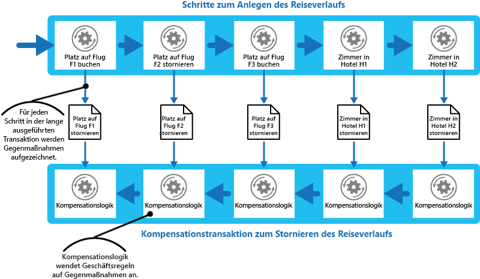

# Muster „Kompensierende Transaktion“

[!INCLUDE [header](../_includes/header.md)]

Machen Sie die Vorgänge rückgängig, die für eine Reihe von Schritten ausgeführt wurden (die zusammen schlussendlich einen letztlich konsistenten Vorgang bilden), wenn mindestens einer dieser Schritte fehlerhaft ist. Vorgänge, die dem Modell der letztlichen Konsistenz folgen, sind häufig in cloudbasierten Anwendungen anzutreffen, die komplexe Geschäftsprozesse und -workflows implementieren.

## Kontext und Problem

Anwendungen, die häufig in der Cloud ausgeführt werden, ändern Daten. Diese Daten können auf verschiedene Datenquellen verteilt sein, die sich an unterschiedlichen geographischen Standorten befinden. Um in einer verteilten Umgebung Konflikte zu vermeiden und die Leistung zu verbessern, sollte eine Anwendung nicht dafür eingesetzt werden, eine hohe Transaktionskonsistenz zu gewährleisten. Vielmehr sollte die Anwendung letztliche Konsistenz implementieren. In diesem Modell besteht ein typischer Geschäftsvorgang aus einer Reihe von separaten Schritten. Während der Ausführung dieser Schritte kann die Gesamtsicht auf den Systemzustand inkonsistent sein, doch wenn der Vorgang abgeschlossen ist und alle Schritte ausgeführt wurden, sollte das System wieder konsistent sein.

> Der [Datenkonsistenzprimer](https://msdn.microsoft.com/library/dn589800.aspx) liefert Informationen darüber, warum verteilte Transaktionen nicht gut skaliert werden können, sowie über die Prinzipien des Modells der letztlichen Konsistenz.

Eine Herausforderung beim Modell der letztlichen Konsistenz stellt die Frage dar, wie mit einem fehlerhaften Schritt umgegangen wird. In diesem Fall kann es notwendig sein, alle Arbeiten rückgängig zu machen, die durch die vorhergehenden Schritte des Vorgangs ausgeführt wurden. Für die Daten kann jedoch nicht ohne Weiteres ein Rollback ausgeführt werden, da andere gleichzeitige Instanzen der Anwendung diese möglicherweise geändert haben. Selbst in Fällen, in denen die Daten nicht durch eine gleichzeitige Instanz verändert wurden, kann das Rückgängigmachen eines Schrittes nicht nur eine Frage der Wiederherstellung des ursprünglichen Zustandes sein. So kann es notwendig sein, verschiedene geschäftsspezifische Regeln anzuwenden (siehe die im Abschnitt „Beispiel“ beschriebene Reisewebsite).

Wenn sich ein Vorgang, der letztliche Konsistenz implementiert, über mehrere heterogene Datenspeicher erstreckt, muss zum Rückgängigmachen der Schritte des Vorgangs nacheinander jeder einzelne Datenspeicher aufgerufen werden. Alle in den einzelnen Datenspeichern durchgeführte Aufgaben müssen zuverlässig rückgängig gemacht werden, damit das System nicht in einem inkonsistenten Zustand verbleibt.

Nicht alle Daten, die von einem Vorgang, der letztliche Konsistenz implementiert, betroffen sind, können in einer Datenbank gespeichert werden. In einer Umgebung mit serviceorientierter Architektur (SOA) könnte ein Vorgang eine Aktion in einem Dienst aufrufen und eine Änderung des Zustands dieses Diensts bewirken. Um den Vorgang rückgängig zu machen, muss auch diese Zustandsänderung rückgängig gemacht werden. Hierfür muss der Dienst eventuell erneut aufgerufen und eine weitere Aktion ausgeführt werden, die die Auswirkungen der ersten Aktion rückgängig macht.

## Lösung

Die Lösung besteht darin, eine kompensierende Transaktion zu implementieren. Die Schritte einer kompensierenden Transaktion müssen die Auswirkungen der Schritte des ursprünglichen Vorgangs rückgängig machen. Eine kompensierende Transaktion kann möglicherweise nicht einfach den aktuellen Zustand durch den Zustand ersetzen, in dem sich das System zu Beginn des Vorgangs befand, da durch diese Vorgehensweise Änderungen überschrieben werden könnten, die von anderen gleichzeitigen Instanzen einer Anwendung vorgenommen wurden. Stattdessen muss es sich um einen intelligenten Prozess handeln, der alle von gleichzeitigen Instanzen durchgeführten Aufgaben berücksichtigt. Dieser Prozess ist in der Regel anwendungsspezifisch und hängt von der Art der Aufgaben ab, die im ursprünglichen Vorgang durchgeführt wurden.

Eine übliche Vorgehensweise besteht darin, einen Workflow einzusetzen, um einen letztlich konsistenten Vorgang zu implementieren, der eine Kompensierung erfordert. Im weiteren Verlauf des ursprünglichen Vorgangs zeichnet das System Informationen über jeden einzelnen Schritt auf und zeigt an, wie die in diesem Schritt durchgeführten Aufgaben rückgängig gemacht werden können. Wenn beim Vorgang an irgendeiner Stelle ein Fehler auftritt, geht der Workflow die abgeschlossenen Schritte rückwärts durch und führt die Aufgabe zum Rückgängigmachen jedes Schritts durch. Beachten Sie, dass eine kompensierende Transaktion die Aufgabe möglicherweise nicht in genau der umgekehrten Reihenfolge des ursprünglichen Vorgangs rückgängig machen muss, und dass es möglich ist, einige der Schritte zum Rückgängigmachen parallel auszuführen.

> Diese Vorgehensweise ähnelt der Sagas-Strategie, die im [Blog von Clemens Vasters](http://vasters.com/clemensv/2012/09/01/Sagas.aspx) diskutiert wird.

Eine kompensierende Transaktion ist auch ein letztlich konsistenter Vorgang und kann auch Fehler verursachen. Das System sollte in der Lage sein, die kompensierende Transaktion an der Stelle, an der der Fehler aufgetreten ist, wieder aufzunehmen und fortzusetzen. Da ein fehlerhafter Schritt eventuell wiederholt werden muss, sollten die Schritte in einer kompensierenden Transaktion als idempotente Befehle definiert werden. Weitere Informationen finden Sie unter [Idempotenzmuster](http://blog.jonathanoliver.com/idempotency-patterns/) im Blog von Jonathan Oliver.

In einigen Fällen kann eine Wiederherstellung nach einem fehlerhaften Schritt nur durch manuelles Eingreifen durchgeführt werden. In diesen Situationen sollte das System eine Warnung auslösen und so viele Informationen wie möglich über die Ursache des Fehlers bereitstellen.

## Probleme und Überlegungen

Beachten Sie die folgenden Punkte bei der Entscheidung, wie dieses Muster implementiert werden soll:

Es mag nicht einfach sein, festzustellen, wann bei einem Schritt in einem Vorgang, der letztliche Konsistenz implementiert, ein Fehler aufgetreten ist. Bei einem Schritt muss nicht sofort ein Fehler auftreten, er könnte auch blockiert werden. Eventuell muss eine Art von Timeoutmechanismus implementiert werden.

Eine Kompensationslogik lässt sich nicht ohne Weiteres verallgemeinern. Eine kompensierende Transaktion ist anwendungsspezifisch. Sie setzt voraus, dass die Anwendung über ausreichende Informationen verfügt, um die Auswirkungen jedes einzelnen Schrittes in einem fehlerhaften Vorgang rückgängig machen zu können.

Sie sollten die Schritte einer kompensierenden Transaktion als idempotente Befehle definieren. Dadurch können die Schritte wiederholt werden, wenn bei der kompensierenden Transaktion selbst ein Fehler auftritt.

Die Infrastruktur, die die Schritte des ursprünglichen Vorgangs und die kompensierende Transaktion abwickelt, muss stabil sein. Sie darf nicht die Informationen verlieren, die zum Kompensieren eines fehlerhaften Schrittes erforderlich sind, und muss in der Lage sein, den Fortschritt der Kompensationslogik zuverlässig zu überwachen.

Eine kompensierende Transaktion gibt die Daten im System nicht unbedingt in dem Zustand zurück, in dem sich diese zu Beginn des ursprünglichen Vorgangs befanden. Stattdessen kompensiert sie die Aufgabe, die durch die erfolgreich abgeschlossenen Schritte vor dem Fehlervorkommnis im Vorgang durchgeführt wurde.

Die Reihenfolge der Schritte in der kompensierenden Transaktion muss nicht unbedingt in der genau gegenteiligen Reihenfolge der Schritte im ursprünglichen Vorgang erfolgen. Beispielsweise könnte ein Datenspeicher empfindlicher auf Inkonsistenzen reagieren als ein anderer Datenspeicher. Daher sollten die Schritte in der kompensierenden Transaktion, die die Änderungen an diesem Speicher rückgängig machen, zuerst durchgeführt werden.

Das Festlegen einer kurzfristigen, auf einem Timeout basierende Sperre für jede Ressource, die zur Durchführung eines Vorgangs erforderlich ist, und das vorzeitige Abrufen dieser Ressourcen kann die Wahrscheinlichkeit erhöhen, dass die Gesamtaktivität erfolgreich durchgeführt wird. Die Aufgabe sollte erst dann durchgeführt werden, wenn alle Ressourcen bezogen wurden. Alle Aktionen müssen abgeschlossen sein, bevor die Sperren ablaufen.

Ziehen Sie die Verwendung einer Wiederholungslogik in Betracht, die mehr Fehler toleriert als üblich, um Fehler zu minimieren, die eine kompensierende Transaktion auslösen. Wenn bei einem Schritt eines Vorgangs zur Implementierung von letztlicher Konsistenz ein Fehler auftritt, behandeln Sie den Fehler als vorübergehende Ausnahme, und wiederholen Sie den Schritt. Beenden Sie den Vorgang, und initiieren Sie eine kompensierende Transaktion, wenn bei einem Schritt wiederholt und unwiederbringlich ein Fehler auftritt.

> Viele der Herausforderungen bei der Implementierung einer kompensierenden Transaktion sind mit denen bei der Implementierung von letztlicher Konsistenz identisch. Weitere Informationen hierzu finden Sie im [Datenkonsistenzprimer](https://msdn.microsoft.com/library/dn589800.aspx) im Abschnitt „Überlegungen zur Implementierung von letztlicher Konsistenz“.

## Verwendung dieses Musters

Verwenden Sie dieses Muster nur bei Vorgängen, die bei auftretenden Fehlern rückgängig gemacht werden müssen. Entwerfen Sie möglichst Lösungen, mit denen Sie die Komplexität kompensierender Transaktionen vermeiden können.

## Beispiel

Über eine Reisewebsite können Kunden Reiserouten buchen. Eine einzelne Reiseroute kann aus einer Reihe von Flügen und Hotels bestehen. Ein Kunde, der von Seattle nach London und dann weiter nach Paris reist, könnte die bei der Erstellung einer Reiseroute folgenden Schritte durchführen:

1. Buchen Sie einen Sitzplatz auf dem Flug F1 von Seattle nach London.
2. Buchen Sie einen Sitzplatz auf dem Flug F2 von London nach Paris.
3. Buchen Sie einen Sitzplatz auf dem Flug F3 von Paris nach Seattle.
4. Reservieren Sie ein Zimmer im Hotel H1 in London.
5. Reservieren Sie ein Zimmer im Hotel H2 in Paris.

Diese Schritte bilden einen letztlich konsistenten Vorgang, obwohl jeder Schritt eine separate Aktion darstellt. Daher muss das System nicht nur diese Schritte durchführen, sondern auch die entgegensetzten Vorgänge erfassen, die zum Rückgängigmachen jedes Schritts notwendig sind, falls der Kunde beschließt, die Reiseroute zu stornieren. Die zur Durchführung der entgegengesetzten Vorgänge erforderlichen Schritte können dann als kompensierende Transaktion ausgeführt werden.

Beachten Sie, dass die Schritte in der kompensierenden Transaktion möglicherweise nicht das genaue Gegenteil der ursprünglichen Schritte darstellen und die Logik in jedem Schritt in der kompensierenden Transaktion allen geschäftsspezifischen Regeln entsprechen muss. Beispielsweise ist ein Kunden bei Stornierung eines Sitzplatzes auf einem Flug möglicherweise nicht zur vollständigen Rückerstattung des gezahlten Betrages berechtigt. Die Abbildung zeigt die Generierung einer kompensierenden Transaktion, um eine zeitintensive Transaktion zur Buchung einer Reiseroute rückgängig zu machen.

> Abhängig vom Entwurf der Kompensationslogik für die einzelnen Schritte können die Schritte der kompensierenden Transaktion parallel ausgeführt werden.

In vielen Unternehmenslösungen ist beim Auftreten eines Fehlers bei einem einzelnen Schritt nicht immer ein Rollback des Systems mit einer kompensierenden Transaktion erforderlich. Wenn der Kunde nicht in der Lage ist, – beispielsweise nach der Buchung der Flüge F1, F2 und F3 im Szenario der Reisewebsite – ein Zimmer im Hotel H1 zu reservieren, ist es besser, dem Kunden ein Zimmer in einem anderen Hotel in derselben Stadt anzubieten, als die Flüge zu stornieren. Der Kunde hat nach wie vor die Möglichkeit, eine Stornierung durchzuführen (in diesem Fall wird die kompensierende Transaktion ausgeführt, und die Buchungen für die Flüge F1, F2 und F3 werden rückgängig gemacht), aber diese Entscheidung sollte vom Kunden und nicht vom System getroffen werden.

## Zugehörige Muster und Anleitungen

Die folgenden Muster und Anweisungen können für die Implementierung dieses Musters ebenfalls relevant sein:

- [Datenkonsistenzprimer](https://msdn.microsoft.com/library/dn589800.aspx): Das Muster „Kompensierende Transaktion“ wird häufig verwendet, um Vorgänge rückgängig zu machen, die das Modell der letztlichen Konsistenz implementieren. Dieser Primer liefert Informationen über die Vor- und Nachteile von letztlicher Konsistenz.

- [Muster „Scheduler-Agent-Supervisor“](scheduler-agent-supervisor.md): Beschreibt die Implementierung stabiler Systeme, die Geschäftsvorgänge durchführen, bei denen verteilte Dienste und Ressourcen zum Einsatz kommen. In manchen Fällen kann es notwendig sein, die Aufgabe eines Vorgangs mithilfe einer kompensierenden Transaktion rückgängig zu machen.

- [Muster „Wiederholung“](./retry.md): Die Ausführung kompensierender Transaktionen kann sich als kostspielig erweisen. Ihre Verwendung kann minimiert werden, indem eine effektive Richtlinie zur Wiederholung fehlerhafter Vorgänge gemäß dem Wiederholungsmuster implementiert wird.
