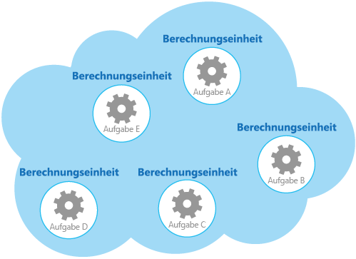

# <a name="compute-resource-consolidation-pattern"></a><span data-ttu-id="11093-104">Muster „Computeressourcenkonsolidierung“</span><span class="sxs-lookup"><span data-stu-id="11093-104">Compute Resource Consolidation pattern</span></span>

[!INCLUDE [header](../_includes/header.md)]

<span data-ttu-id="11093-105">Konsolidieren Sie mehrere Tasks oder Vorgänge in einer einzelnen Compute-Einheit.</span><span class="sxs-lookup"><span data-stu-id="11093-105">Consolidate multiple tasks or operations into a single computational unit.</span></span> <span data-ttu-id="11093-106">Dies kann die Auslastung der Computerressourcen erhöhen und die Kosten sowie den Verwaltungsaufwand bei der Computeverarbeitung in Anwendungen senken, die in der Cloud gehostet werden.</span><span class="sxs-lookup"><span data-stu-id="11093-106">This can increase compute resource utilization, and reduce the costs and management overhead associated with performing compute processing in cloud-hosted applications.</span></span>

## <a name="context-and-problem"></a><span data-ttu-id="11093-107">Kontext und Problem</span><span class="sxs-lookup"><span data-stu-id="11093-107">Context and problem</span></span>

<span data-ttu-id="11093-108">Eine Cloudanwendung implementiert häufig eine Vielzahl von Vorgängen.</span><span class="sxs-lookup"><span data-stu-id="11093-108">A cloud application often implements a variety of operations.</span></span> <span data-ttu-id="11093-109">Bei einigen Lösungen ist es sinnvoll, zunächst dem Entwurfsprinzip der Trennung von Zuständigkeiten zu folgen und diese Vorgänge in separate Compute-Einheiten aufzuteilen, die einzeln gehostet und bereitgestellt werden (z.B. als separate App Service-Web-Apps, als separate VMs oder als separate Clouddienstrollen).</span><span class="sxs-lookup"><span data-stu-id="11093-109">In some solutions it makes sense to follow the design principle of separation of concerns initially, and divide these operations into separate computational units that are hosted and deployed individually (for example, as separate App Service web apps, separate Virtual Machines, or separate Cloud Service roles).</span></span> <span data-ttu-id="11093-110">Doch obwohl diese Strategie dazu beitragen kann, das logische Design der Lösung zu vereinfachen, kann die Bereitstellung einer großen Anzahl von Compute-Einheiten im Rahmen derselben Anwendung die Kosten für das Laufzeithosting erhöhen und zu einer komplexeren Systemverwaltung führen.</span><span class="sxs-lookup"><span data-stu-id="11093-110">However, although this strategy can help simplify the logical design of the solution, deploying a large number of computational units as part of the same application can increase runtime hosting costs and make management of the system more complex.</span></span>

<span data-ttu-id="11093-111">Die Abbildung zeigt beispielhaft die vereinfachte Struktur einer cloudbasierten Lösung, die mit mehr als einer Compute-Einheit implementiert ist.</span><span class="sxs-lookup"><span data-stu-id="11093-111">As an example, the figure shows the simplified structure of a cloud-hosted solution that is implemented using more than one computational unit.</span></span> <span data-ttu-id="11093-112">Jede Compute-Einheit wird in einer eigenen virtuellen Umgebung ausgeführt.</span><span class="sxs-lookup"><span data-stu-id="11093-112">Each computational unit runs in its own virtual environment.</span></span> <span data-ttu-id="11093-113">Jede Funktion wurde als separater Task implementiert (Task A bis Task E), der in einer eigenen Compute-Einheit ausgeführt wird.</span><span class="sxs-lookup"><span data-stu-id="11093-113">Each function has been implemented as a separate task (labeled Task A through Task E) running in its own computational unit.</span></span>




<span data-ttu-id="11093-115">Jede Compute-Einheit verbraucht kostenpflichtige Ressourcen, auch wenn sie sich im Leerlauf befindet oder nur selten genutzt wird.</span><span class="sxs-lookup"><span data-stu-id="11093-115">Each computational unit consumes chargeable resources, even when it's idle or lightly used.</span></span> <span data-ttu-id="11093-116">Daher ist dies nicht immer die kosteneffizienteste Lösung.</span><span class="sxs-lookup"><span data-stu-id="11093-116">Therefore, this isn't always the most cost-effective solution.</span></span>

<span data-ttu-id="11093-117">In Azure betrifft dies Rollen in Cloud Services, App Services und Virtual Machines.</span><span class="sxs-lookup"><span data-stu-id="11093-117">In Azure, this concern applies to roles in a Cloud Service, App Services, and Virtual Machines.</span></span> <span data-ttu-id="11093-118">Diese Elemente werden in einer eigenen virtuellen Umgebung ausgeführt.</span><span class="sxs-lookup"><span data-stu-id="11093-118">These items run in their own virtual environment.</span></span> <span data-ttu-id="11093-119">Das Ausführen einer Sammlung separater Rollen, Websites oder virtueller Computer, die zur Ausführung einer Reihe klar definierter Vorgänge konzipiert sind, aber als Teil einer einzigen Lösung kommunizieren und zusammenarbeiten müssen, kann dies zu einer ineffizienten Ressourcennutzung führen.</span><span class="sxs-lookup"><span data-stu-id="11093-119">Running a collection of separate roles, websites, or virtual machines that are designed to perform a set of well-defined operations, but that need to communicate and cooperate as part of a single solution, can be an inefficient use of resources.</span></span>

## <a name="solution"></a><span data-ttu-id="11093-120">Lösung</span><span class="sxs-lookup"><span data-stu-id="11093-120">Solution</span></span>

<span data-ttu-id="11093-121">Um Kosten zu senken, die Auslastung zu erhöhen, die Kommunikationsgeschwindigkeit zu verbessern und den Verwaltungsaufwand zu senken, können mehrere Tasks oder Vorgänge in einer einzigen Compute-Einheit konsolidiert werden.</span><span class="sxs-lookup"><span data-stu-id="11093-121">To help reduce costs, increase utilization, improve communication speed, and reduce management it's possible to consolidate multiple tasks or operations into a single computational unit.</span></span>

<span data-ttu-id="11093-122">Tasks können nach Kriterien gruppiert werden, die auf den von der Umgebung bereitgestellten Features sowie den damit verbundenen Kosten basieren.</span><span class="sxs-lookup"><span data-stu-id="11093-122">Tasks can be grouped according to criteria based on the features provided by the environment and the costs associated with these features.</span></span> <span data-ttu-id="11093-123">Ein gängiger Ansatz besteht darin, nach Tasks zu suchen, die ein ähnliches Profil hinsichtlich ihrer Skalierbarkeit, Lebensdauer und Verarbeitungsanforderungen aufweisen.</span><span class="sxs-lookup"><span data-stu-id="11093-123">A common approach is to look for tasks that have a similar profile concerning their scalability, lifetime, and processing requirements.</span></span> <span data-ttu-id="11093-124">Das Gruppieren dieser Tasks ermöglicht es, sie als eine Einheit zu skalieren.</span><span class="sxs-lookup"><span data-stu-id="11093-124">Grouping these together allows them to scale as a unit.</span></span> <span data-ttu-id="11093-125">Die Elastizität vieler Cloudumgebungen ermöglicht es, je nach Workload zusätzliche Instanzen einer Compute-Einheit zu starten und zu beenden.</span><span class="sxs-lookup"><span data-stu-id="11093-125">The elasticity provided by many cloud environments enables additional instances of a computational unit to be started and stopped according to the workload.</span></span> <span data-ttu-id="11093-126">Beispielsweise bietet Azure eine automatische Skalierung, die Sie auf Rollen in Cloud Services, App Services und Virtual Machines anwenden können.</span><span class="sxs-lookup"><span data-stu-id="11093-126">For example, Azure provides autoscaling that you can apply to roles in a Cloud Service, App Services, and Virtual Machines.</span></span> <span data-ttu-id="11093-127">Weitere Informationen finden Sie im [Leitfaden für die automatische Skalierung](https://msdn.microsoft.com/library/dn589774.aspx).</span><span class="sxs-lookup"><span data-stu-id="11093-127">For more information, see [Autoscaling Guidance](https://msdn.microsoft.com/library/dn589774.aspx).</span></span>

<span data-ttu-id="11093-128">Betrachten Sie als Gegenbeispiel die folgenden zwei Tasks. Sie veranschaulichen die Verwendung der Skalierbarkeit, um zu bestimmen, welche Vorgänge nicht gruppiert werden sollten:</span><span class="sxs-lookup"><span data-stu-id="11093-128">As a counter example to show how scalability can be used to determine which operations shouldn't be grouped together, consider the following two tasks:</span></span>

- <span data-ttu-id="11093-129">Task 1 ruft seltene, zeitunempfindlichen Nachrichten ab, die an eine Warteschlange gesendet werden.</span><span class="sxs-lookup"><span data-stu-id="11093-129">Task 1 polls for infrequent, time-insensitive messages sent to a queue.</span></span>
- <span data-ttu-id="11093-130">Task 2 verarbeitet Spitzen im Netzwerkdatenverkehr.</span><span class="sxs-lookup"><span data-stu-id="11093-130">Task 2 handles high-volume bursts of network traffic.</span></span>

<span data-ttu-id="11093-131">Der zweite Task erfordert Elastizität, die das Starten und Beenden einer großen Anzahl von Instanzen der Compute-Einheit beinhalten kann.</span><span class="sxs-lookup"><span data-stu-id="11093-131">The second task requires elasticity that can involve starting and stopping a large number of instances of the computational unit.</span></span> <span data-ttu-id="11093-132">Die Anwendung derselben Skalierung auf den ersten Task würde lediglich dazu führen, dass mehr Tasks auf seltene Nachrichten in derselben Warteschlange lauschen. Dies wäre eine Vergeudung von Ressourcen.</span><span class="sxs-lookup"><span data-stu-id="11093-132">Applying the same scaling to the first task would simply result in more tasks listening for infrequent messages on the same queue, and is a waste of resources.</span></span>

<span data-ttu-id="11093-133">In vielen Cloudumgebungen ist es möglich, die einer Compute-Einheit zur Verfügung stehenden Ressourcen in Bezug auf die Anzahl von CPU-Kernen, den Arbeitsspeicher, den Festplattenspeicher usw. anzugeben.</span><span class="sxs-lookup"><span data-stu-id="11093-133">In many cloud environments it's possible to specify the resources available to a computational unit in terms of the number of CPU cores, memory, disk space, and so on.</span></span> <span data-ttu-id="11093-134">Allgemein gilt: Je mehr Ressourcen angegeben werden, desto höher sind die Kosten.</span><span class="sxs-lookup"><span data-stu-id="11093-134">Generally, the more resources specified, the greater the cost.</span></span> <span data-ttu-id="11093-135">Um Kosteneinsparungen zu erzielen, muss eine teure Compute-Einheit maximal ausgelastet werden und darf nicht für längere Zeit inaktiv sein.</span><span class="sxs-lookup"><span data-stu-id="11093-135">To save money, it's important to maximize the work an expensive computational unit performs, and not let it become inactive for an extended period.</span></span>

<span data-ttu-id="11093-136">Wenn Tasks vorhanden sind, die für kurze Spitzen viel CPU-Leistung anfordern, sollten diese in einer einzigen Compute-Einheit zusammengefasst werden, die die benötigte Leistung bereitstellt.</span><span class="sxs-lookup"><span data-stu-id="11093-136">If there are tasks that require a great deal of CPU power in short bursts, consider consolidating these into a single computational unit that provides the necessary power.</span></span> <span data-ttu-id="11093-137">Es ist hierbei jedoch wichtig, die Anforderung zur maximalen Auslastung teurer Ressourcen gegen die Konflikte abzuwägen, die bei einer Überlastung der Ressourcen auftreten können.</span><span class="sxs-lookup"><span data-stu-id="11093-137">However, it's important to balance this need to keep expensive resources busy against the contention that could occur if they are over stressed.</span></span> <span data-ttu-id="11093-138">Rechenintensive Tasks mit langer Ausführungszeit sollten beispielsweise nicht dieselbe Compute-Einheit verwenden.</span><span class="sxs-lookup"><span data-stu-id="11093-138">Long-running, compute-intensive tasks shouldn't share the same computational unit, for example.</span></span>

## <a name="issues-and-considerations"></a><span data-ttu-id="11093-139">Probleme und Überlegungen</span><span class="sxs-lookup"><span data-stu-id="11093-139">Issues and considerations</span></span>

<span data-ttu-id="11093-140">Beachten Sie bei der Implementierung dieses Musters die folgenden Punkte:</span><span class="sxs-lookup"><span data-stu-id="11093-140">Consider the following points when implementing this pattern:</span></span>

<span data-ttu-id="11093-141">**Skalierbarkeit und Elastizität**.</span><span class="sxs-lookup"><span data-stu-id="11093-141">**Scalability and elasticity**.</span></span> <span data-ttu-id="11093-142">Viele Cloudlösungen implementieren Skalierbarkeit und Elastizität auf Ebene der Compute-Einheit, indem sie Instanzen von Compute-Einheiten starten und beenden.</span><span class="sxs-lookup"><span data-stu-id="11093-142">Many cloud solutions implement scalability and elasticity at the level of the computational unit by starting and stopping instances of units.</span></span> <span data-ttu-id="11093-143">Vermeiden Sie es, Tasks mit konfliktverursachenden Skalierbarkeitsanforderungen in derselben Compute-Einheit zu gruppieren.</span><span class="sxs-lookup"><span data-stu-id="11093-143">Avoid grouping tasks that have conflicting scalability requirements in the same computational unit.</span></span>

<span data-ttu-id="11093-144">**Lebensdauer**.</span><span class="sxs-lookup"><span data-stu-id="11093-144">**Lifetime**.</span></span> <span data-ttu-id="11093-145">Die Cloudinfrastruktur recycelt in regelmäßigen Abständen die virtuelle Umgebung, die eine Compute-Einheit hostet.</span><span class="sxs-lookup"><span data-stu-id="11093-145">The cloud infrastructure periodically recycles the virtual environment that hosts a computational unit.</span></span> <span data-ttu-id="11093-146">Wenn in einer Compute-Einheit zu viele Tasks mit langer Ausführungszeit enthalten sind, muss die Einheit möglicherweise so konfiguriert werden, dass sie nicht vor dem Abschluss dieser Tasks recycelt wird.</span><span class="sxs-lookup"><span data-stu-id="11093-146">When there are many long-running tasks inside a computational unit, it might be necessary to configure the unit to prevent it from being recycled until these tasks have finished.</span></span> <span data-ttu-id="11093-147">Alternativ können Sie die Tasks mit einem Prüfpunktansatz entwerfen. Hierdurch können die Tasks sauber beendet und an dem Punkt fortgesetzt werden, an dem sie beim Neustart der Compute-Einheit unterbrochen wurden.</span><span class="sxs-lookup"><span data-stu-id="11093-147">Alternatively, design the tasks by using a check-pointing approach that enables them to stop cleanly, and continue at the point they were interrupted when the computational unit is restarted.</span></span>

<span data-ttu-id="11093-148">**Releaserhythmus**.</span><span class="sxs-lookup"><span data-stu-id="11093-148">**Release cadence**.</span></span> <span data-ttu-id="11093-149">Wenn sich die Implementierung oder Konfiguration eines Tasks häufig ändert, muss die Compute-Einheit, die den aktualisierten Code hostet, möglicherweise beendet, neu konfiguriert, neu bereitgestellt und dann neu gestartet werden.</span><span class="sxs-lookup"><span data-stu-id="11093-149">If the implementation or configuration of a task changes frequently, it might be necessary to stop the computational unit hosting the updated code, reconfigure and redeploy the unit, and then restart it.</span></span> <span data-ttu-id="11093-150">Dies erfordert auch, dass alle anderen Tasks innerhalb derselben Compute-Einheit beendet, neu bereitgestellt und neu gestartet werden.</span><span class="sxs-lookup"><span data-stu-id="11093-150">This process will also require that all other tasks within the same computational unit are stopped, redeployed, and restarted.</span></span>

<span data-ttu-id="11093-151">**Sicherheit**.</span><span class="sxs-lookup"><span data-stu-id="11093-151">**Security**.</span></span> <span data-ttu-id="11093-152">Tasks in derselben Compute-Einheit können sich einen Sicherheitskontext teilen und auf dieselben Ressourcen zugreifen.</span><span class="sxs-lookup"><span data-stu-id="11093-152">Tasks in the same computational unit might share the same security context and be able to access the same resources.</span></span> <span data-ttu-id="11093-153">Es muss ein hohes Maß an Vertrauen zwischen den Tasks bestehen, und es muss sichergestellt sein, dass die Tasks sich nicht gegenseitig beschädigen oder beeinträchtigen.</span><span class="sxs-lookup"><span data-stu-id="11093-153">There must be a high degree of trust between the tasks, and confidence that one task isn't going to corrupt or adversely affect another.</span></span> <span data-ttu-id="11093-154">Zusätzlich wird durch eine Erhöhung der Anzahl von Tasks, die in einer Compute-Einheit ausgeführt werden, die Angriffsfläche der Einheit vergrößert.</span><span class="sxs-lookup"><span data-stu-id="11093-154">Additionally, increasing the number of tasks running in a computational unit increases the attack surface of the unit.</span></span> <span data-ttu-id="11093-155">Jeder Task ist nur so sicher wie derjenige mit dem höchsten Sicherheitsrisiko.</span><span class="sxs-lookup"><span data-stu-id="11093-155">Each task is only as secure as the one with the most vulnerabilities.</span></span>

<span data-ttu-id="11093-156">**Fehlertoleranz**.</span><span class="sxs-lookup"><span data-stu-id="11093-156">**Fault tolerance**.</span></span> <span data-ttu-id="11093-157">Wenn ein Task in einer Compute-Einheit zu einem Fehler führt oder der Task sich ungewöhnlich verhält, kann dies Auswirkungen auf die anderen Tasks haben, die innerhalb derselben Einheit ausgeführt werden.</span><span class="sxs-lookup"><span data-stu-id="11093-157">If one task in a computational unit fails or behaves abnormally, it can affect the other tasks running within the same unit.</span></span> <span data-ttu-id="11093-158">Wenn z.B. ein Task nicht ordnungsgemäß gestartet wird, kann dies zu einem Fehler für die gesamte Startlogik der Compute-Einheit führen, sodass andere Tasks in derselben Einheit nicht ausgeführt werden können.</span><span class="sxs-lookup"><span data-stu-id="11093-158">For example, if one task fails to start correctly it can cause the entire startup logic for the computational unit to fail, and prevent other tasks in the same unit from running.</span></span>

<span data-ttu-id="11093-159">**Konflikte**.</span><span class="sxs-lookup"><span data-stu-id="11093-159">**Contention**.</span></span> <span data-ttu-id="11093-160">Vermeiden Sie Konflikte zwischen Tasks, die um Ressourcen in derselben Compute-Einheit konkurrieren.</span><span class="sxs-lookup"><span data-stu-id="11093-160">Avoid introducing contention between tasks that compete for resources in the same computational unit.</span></span> <span data-ttu-id="11093-161">Im Idealfall sollten Tasks, die dieselbe Compute-Einheit verwenden, unterschiedliche Merkmale in Bezug auf die Ressourcennutzung aufweisen.</span><span class="sxs-lookup"><span data-stu-id="11093-161">Ideally, tasks that share the same computational unit should exhibit different resource utilization characteristics.</span></span> <span data-ttu-id="11093-162">Beispielsweise sollten zwei rechenintensive Tasks nicht in derselben Compute-Einheit platziert werden, und ebenso auch keine zwei Tasks, die viel Speicher verbrauchen.</span><span class="sxs-lookup"><span data-stu-id="11093-162">For example, two compute-intensive tasks should probably not reside in the same computational unit, and neither should two tasks that consume large amounts of memory.</span></span> <span data-ttu-id="11093-163">Die Zusammenlegung eines rechenintensiven Tasks mit einem Task, der viel Arbeitsspeicher benötigt, ist hingegen eine geeignete Kombination.</span><span class="sxs-lookup"><span data-stu-id="11093-163">However, mixing a compute intensive task with a task that requires a large amount of memory is a workable combination.</span></span>

> [!NOTE]
>  <span data-ttu-id="11093-164">Ziehen Sie in Betracht, die Computerressourcen nur für ein System zu konsolidieren, das seit einiger Zeit in Produktion ist, sodass Operatoren und Entwickler das System überwachen und ein _Wärmebild_ erstellen können, das die Nutzung der verschiedenen Ressourcen durch jeden Task zeigt.</span><span class="sxs-lookup"><span data-stu-id="11093-164">Consider consolidating compute resources only for a system that's been in production for a period of time so that operators and developers can monitor the system and create a _heat map_ that identifies how each task utilizes differing resources.</span></span> <span data-ttu-id="11093-165">Anhand dieses Wärmebilds kann festgestellt werden, welche Tasks gute Kandidaten für die gemeinsame Nutzung von Computeressourcen sind.</span><span class="sxs-lookup"><span data-stu-id="11093-165">This map can be used to determine which tasks are good candidates for sharing compute resources.</span></span>

<span data-ttu-id="11093-166">**Komplexität**.</span><span class="sxs-lookup"><span data-stu-id="11093-166">**Complexity**.</span></span> <span data-ttu-id="11093-167">Die Kombination mehrerer Tasks in einer einzigen Compute-Einheit erhöht die Komplexität des Codes in der Einheit und erschwert möglicherweise das Testen, Debuggen sowie die Wartung.</span><span class="sxs-lookup"><span data-stu-id="11093-167">Combining multiple tasks into a single computational unit adds complexity to the code in the unit, possibly making it more difficult to test, debug, and maintain.</span></span>

<span data-ttu-id="11093-168">**Stabile logische Architektur**.</span><span class="sxs-lookup"><span data-stu-id="11093-168">**Stable logical architecture**.</span></span> <span data-ttu-id="11093-169">Entwickeln und implementieren Sie den Code in jedem Task so, dass er selbst dann nicht geändert werden muss, wenn sich die physische Umgebung für die Taskausführung ändert.</span><span class="sxs-lookup"><span data-stu-id="11093-169">Design and implement the code in each task so that it shouldn't need to change, even if the physical environment the task runs in does change.</span></span>

<span data-ttu-id="11093-170">**Weitere Strategien**.</span><span class="sxs-lookup"><span data-stu-id="11093-170">**Other strategies**.</span></span> <span data-ttu-id="11093-171">Die Konsolidierung von Computeressourcen ist nur eine Möglichkeit, die Kosten zu senken, die mit der gleichzeitigen Ausführung mehrerer Tasks verbunden sind.</span><span class="sxs-lookup"><span data-stu-id="11093-171">Consolidating compute resources is only one way to help reduce costs associated with running multiple tasks concurrently.</span></span> <span data-ttu-id="11093-172">Es ist eine sorgfältige Planung und Überwachung erforderlich, um sicherzustellen, dass die Konsolidierung ein wirksamer Ansatz bleibt.</span><span class="sxs-lookup"><span data-stu-id="11093-172">It requires careful planning and monitoring to ensure that it remains an effective approach.</span></span> <span data-ttu-id="11093-173">Andere Strategien sind möglicherweise besser geeignet – je nach Art der Arbeit und abhängig davon, wo sich die Benutzer befinden, die diese Aufgaben ausführen.</span><span class="sxs-lookup"><span data-stu-id="11093-173">Other strategies might be more appropriate, depending on the nature of the work and where the users these tasks are running are located.</span></span> <span data-ttu-id="11093-174">Zum Beispiel kann die funktionale Zerlegung der Workload (wie beschrieben im [Leitfaden zur Computepartitionierung](https://msdn.microsoft.com/library/dn589773.aspx)) eine bessere Option darstellen.</span><span class="sxs-lookup"><span data-stu-id="11093-174">For example, functional decomposition of the workload (as described by the [Compute Partitioning Guidance](https://msdn.microsoft.com/library/dn589773.aspx)) might be a better option.</span></span>

## <a name="when-to-use-this-pattern"></a><span data-ttu-id="11093-175">Verwendung dieses Musters</span><span class="sxs-lookup"><span data-stu-id="11093-175">When to use this pattern</span></span>

<span data-ttu-id="11093-176">Verwenden Sie dieses Muster für Tasks, die nicht kosteneffizient sind, wenn sie in eigenen Compute-Einheiten ausgeführt werden.</span><span class="sxs-lookup"><span data-stu-id="11093-176">Use this pattern for tasks that are not cost effective if they run in their own computational units.</span></span> <span data-ttu-id="11093-177">Wenn ein Task viel Zeit im Leerlauf verbringt, kann es teuer sein, diesen Task in einer dedizierten Einheit auszuführen.</span><span class="sxs-lookup"><span data-stu-id="11093-177">If a task spends much of its time idle, running this task in a dedicated unit can be expensive.</span></span>

<span data-ttu-id="11093-178">Dieses Muster eignet sich möglicherweise nicht für Tasks, die kritische fehlertolerante Vorgänge ausführen, oder für Tasks, die hochsensible oder private Daten verarbeiten und einen eigenen Sicherheitskontext benötigen.</span><span class="sxs-lookup"><span data-stu-id="11093-178">This pattern might not be suitable for tasks that perform critical fault-tolerant operations, or tasks that process highly sensitive or private data and require their own security context.</span></span> <span data-ttu-id="11093-179">Diese Tasks sollten in einer eigenen, isolierten Umgebung in einer separaten Compute-Einheit ausgeführt werden.</span><span class="sxs-lookup"><span data-stu-id="11093-179">These tasks should run in their own isolated environment, in a separate computational unit.</span></span>

## <a name="example"></a><span data-ttu-id="11093-180">Beispiel</span><span class="sxs-lookup"><span data-stu-id="11093-180">Example</span></span>

<span data-ttu-id="11093-181">Beim Erstellen eines Clouddiensts in Azure ist es möglich, die Verarbeitung mehrerer Tasks in einer einzigen Rolle zu konsolidieren.</span><span class="sxs-lookup"><span data-stu-id="11093-181">When building a cloud service on Azure, it’s possible to consolidate the processing performed by multiple tasks into a single role.</span></span> <span data-ttu-id="11093-182">Typischerweise handelt es sich dabei um eine Workerrolle, die Hintergrund- oder asynchrone Verarbeitungstasks ausführt.</span><span class="sxs-lookup"><span data-stu-id="11093-182">Typically this is a worker role that performs background or asynchronous processing tasks.</span></span>

> <span data-ttu-id="11093-183">In einigen Fällen ist es möglich, Hintergrund- oder asynchrone Verarbeitungsaufgaben in die Webrolle einzubinden.</span><span class="sxs-lookup"><span data-stu-id="11093-183">In some cases it's possible to include background or asynchronous processing tasks in the web role.</span></span> <span data-ttu-id="11093-184">Diese Technik trägt zur Kostensenkung bei und vereinfacht die Bereitstellung, wenngleich sie sich auf die Skalierbarkeit und Reaktionsfähigkeit der öffentlich zugänglichen Schnittstelle auswirken kann, die von der Webrolle bereitgestellt wird.</span><span class="sxs-lookup"><span data-stu-id="11093-184">This technique helps to reduce costs and simplify deployment, although it can impact the scalability and responsiveness of the public-facing interface provided by the web role.</span></span> <span data-ttu-id="11093-185">Der Artikel [Combining Multiple Azure Worker Roles into an Azure Web Role](http://www.31a2ba2a-b718-11dc-8314-0800200c9a66.com/2012/02/combining-multiple-azure-worker-roles.html) (Kombinieren mehrerer Azure-Workerrollen in einer Azure-Webrolle) enthält eine detaillierte Beschreibung der Implementierung von Hintergrund- oder asynchronen Verarbeitungstasks in einer Webrolle.</span><span class="sxs-lookup"><span data-stu-id="11093-185">The article [Combining Multiple Azure Worker Roles into an Azure Web Role](http://www.31a2ba2a-b718-11dc-8314-0800200c9a66.com/2012/02/combining-multiple-azure-worker-roles.html) contains a detailed description of implementing background or asynchronous processing tasks in a web role.</span></span>

<span data-ttu-id="11093-186">Die Rolle ist für das Starten und Beenden der Tasks verantwortlich.</span><span class="sxs-lookup"><span data-stu-id="11093-186">The role is responsible for starting and stopping the tasks.</span></span> <span data-ttu-id="11093-187">Wenn der Azure Fabric Controller eine Rolle lädt, löst er das Ereignis `Start` für die Rolle aus.</span><span class="sxs-lookup"><span data-stu-id="11093-187">When the Azure fabric controller loads a role, it raises the `Start` event for the role.</span></span> <span data-ttu-id="11093-188">Sie können die Methode `OnStart` der Klasse `WebRole` oder `WorkerRole` überschreiben, um dieses Ereignis zu behandeln – um beispielsweise die Daten und andere Ressourcen zu initialisieren, von denen die Tasks in dieser Methode abhängen.</span><span class="sxs-lookup"><span data-stu-id="11093-188">You can override the `OnStart` method of the `WebRole` or `WorkerRole` class to handle this event, perhaps to initialize the data and other resources the tasks in this method depend on.</span></span>

<span data-ttu-id="11093-189">Wenn die Methode `OnStart ` abgeschlossen wurde, kann die Rolle auf Anforderungen antworten.</span><span class="sxs-lookup"><span data-stu-id="11093-189">When the `OnStart `method completes, the role can start responding to requests.</span></span> <span data-ttu-id="11093-190">Weitere Informationen und Anweisungen zur Verwendung der Methoden `OnStart` und `Run` in einer Rolle finden Sie im Abschnitt [Prozesse für den Anwendungsstart](https://msdn.microsoft.com/library/ff803371.aspx#sec16) im Patterns & Practices-Leitfaden zum [Verschieben von Anwendungen in die Cloud](https://msdn.microsoft.com/library/ff728592.aspx).</span><span class="sxs-lookup"><span data-stu-id="11093-190">You can find more information and guidance about using the `OnStart` and `Run` methods in a role in the [Application Startup Processes](https://msdn.microsoft.com/library/ff803371.aspx#sec16) section in the patterns & practices guide [Moving Applications to the Cloud](https://msdn.microsoft.com/library/ff728592.aspx).</span></span>

> <span data-ttu-id="11093-191">Halten Sie den Code in der `OnStart`-Methode so kurz wie möglich.</span><span class="sxs-lookup"><span data-stu-id="11093-191">Keep the code in the `OnStart` method as concise as possible.</span></span> <span data-ttu-id="11093-192">Azure legt keine Zeit bis zum Abschluss dieser Methode fest, aber die Rolle kann erst auf eingehende Netzwerkanforderungen reagieren, wenn diese Methode abgeschlossen wurde.</span><span class="sxs-lookup"><span data-stu-id="11093-192">Azure doesn't impose any limit on the time taken for this method to complete, but the role won't be able to start responding to network requests sent to it until this method completes.</span></span>

<span data-ttu-id="11093-193">Wenn die Methode `OnStart` abgeschlossen wurde, führt die Rolle die Methode `Run` aus.</span><span class="sxs-lookup"><span data-stu-id="11093-193">When the `OnStart` method has finished, the role executes the `Run` method.</span></span> <span data-ttu-id="11093-194">Ab diesem Zeitpunkt kann der Fabric Controller mit dem Senden von Anforderungen an die Rolle beginnen.</span><span class="sxs-lookup"><span data-stu-id="11093-194">At this point, the fabric controller can start sending requests to the role.</span></span>

<span data-ttu-id="11093-195">Platzieren Sie den Code für die eigentliche Erstellung der Tasks in der `Run`-Methode.</span><span class="sxs-lookup"><span data-stu-id="11093-195">Place the code that actually creates the tasks in the `Run` method.</span></span> <span data-ttu-id="11093-196">Beachten Sie, dass die `Run`-Methode die Lebensdauer der Rolleninstanz definiert.</span><span class="sxs-lookup"><span data-stu-id="11093-196">Note that the `Run` method defines the lifetime of the role instance.</span></span> <span data-ttu-id="11093-197">Wenn diese Methode abgeschlossen wurde, veranlasst der Fabric Controller das Herunterfahren der Rolle.</span><span class="sxs-lookup"><span data-stu-id="11093-197">When this method completes, the fabric controller will arrange for the role to be shut down.</span></span>

<span data-ttu-id="11093-198">Wenn eine Rolle heruntergefahren oder recycelt wird, verhindert der Fabric Controller, dass weitere eingehende Anforderungen vom Load Balancer empfangen werden und löst das Ereignis `Stop` aus.</span><span class="sxs-lookup"><span data-stu-id="11093-198">When a role shuts down or is recycled, the fabric controller prevents any more incoming requests being received from the load balancer and raises the `Stop` event.</span></span> <span data-ttu-id="11093-199">Sie können dieses Ereignis erfassen, indem Sie die `OnStop`-Methode der Rolle außer Kraft setzen und alle erforderlichen Bereinigungen durchführen, bevor die Rolle beendet wird.</span><span class="sxs-lookup"><span data-stu-id="11093-199">You can capture this event by overriding the `OnStop` method of the role and perform any tidying up required before the role terminates.</span></span>

> <span data-ttu-id="11093-200">Alle Aktionen, die mit der `OnStop`-Methode ausgeführt werden, müssen innerhalb von fünf Minuten abgeschlossen sein (oder innerhalb von 30 Sekunden, wenn Sie den Azure-Emulator auf einem lokalen Computer verwenden).</span><span class="sxs-lookup"><span data-stu-id="11093-200">Any actions performed in the `OnStop` method must be completed within five minutes (or 30 seconds if you are using the Azure emulator on a local computer).</span></span> <span data-ttu-id="11093-201">Andernfalls geht der Azure Fabric Controller davon aus, dass die Rolle angehalten wurde und erzwingt ihre Beendigung.</span><span class="sxs-lookup"><span data-stu-id="11093-201">Otherwise the Azure fabric controller assumes that the role has stalled and will force it to stop.</span></span>

<span data-ttu-id="11093-202">Die Tasks werden von der Methode `Run` gestartet, die auf den Abschluss der Tasks wartet.</span><span class="sxs-lookup"><span data-stu-id="11093-202">The tasks are started by the `Run` method that waits for the tasks to complete.</span></span> <span data-ttu-id="11093-203">Die Tasks implementieren die Geschäftslogik des Clouddiensts und können auf Nachrichten reagieren, die über den Azure-Load Balancer an die Rolle gesendet werden.</span><span class="sxs-lookup"><span data-stu-id="11093-203">The tasks implement the business logic of the cloud service, and can respond to messages posted to the role through the Azure load balancer.</span></span> <span data-ttu-id="11093-204">Die Abbildung zeigt den Lebenszyklus von Tasks und Ressourcen in einer Rolle im Azure-Clouddienst.</span><span class="sxs-lookup"><span data-stu-id="11093-204">The figure shows the lifecycle of tasks and resources in a role in an Azure cloud service.</span></span>


<span data-ttu-id="11093-206">Die Datei _WorkerRole.cs_ im Projekt _ComputeResourceConsolidation.Worker_ zeigt ein Beispiel, wie Sie dieses Muster in einem Azure-Clouddienst implementieren können.</span><span class="sxs-lookup"><span data-stu-id="11093-206">The _WorkerRole.cs_ file in the _ComputeResourceConsolidation.Worker_ project shows an example of how you might implement this pattern in an Azure cloud service.</span></span>

> <span data-ttu-id="11093-207">Das Projekt _ComputeResourceConsolidation.Worker_ ist Teil der Lösung _ComputeResourceConsolidation_, die in [GitHub](https://github.com/mspnp/cloud-design-patterns/tree/master/compute-resource-consolidation) für den Download zur Verfügung steht.</span><span class="sxs-lookup"><span data-stu-id="11093-207">The _ComputeResourceConsolidation.Worker_ project is part of the _ComputeResourceConsolidation_ solution available for download from [GitHub](https://github.com/mspnp/cloud-design-patterns/tree/master/compute-resource-consolidation).</span></span>

<span data-ttu-id="11093-208">Die Methoden `MyWorkerTask1` und `MyWorkerTask2` veranschaulichen, wie verschiedene Tasks innerhalb derselben Workerrolle ausgeführt werden können.</span><span class="sxs-lookup"><span data-stu-id="11093-208">The `MyWorkerTask1` and the `MyWorkerTask2` methods illustrate how to perform different tasks within the same worker role.</span></span> <span data-ttu-id="11093-209">Der folgende Code zeigt `MyWorkerTask1`.</span><span class="sxs-lookup"><span data-stu-id="11093-209">The following code shows `MyWorkerTask1`.</span></span> <span data-ttu-id="11093-210">Es handelt sich um einen einfachen Task, der für 30 Sekunden in den Ruhezustand wechselt und dann eine Ablaufverfolgungsnachricht ausgibt.</span><span class="sxs-lookup"><span data-stu-id="11093-210">This is a simple task that sleeps for 30 seconds and then outputs a trace message.</span></span> <span data-ttu-id="11093-211">Dieser Prozess wird wiederholt, bis der Task abgebrochen wird.</span><span class="sxs-lookup"><span data-stu-id="11093-211">It repeats this process until the task is canceled.</span></span> <span data-ttu-id="11093-212">Der Code in `MyWorkerTask2` ist ähnlich.</span><span class="sxs-lookup"><span data-stu-id="11093-212">The code in `MyWorkerTask2` is similar.</span></span>

```csharp
// A sample worker role task.
private static async Task MyWorkerTask1(CancellationToken ct)
{
  // Fixed interval to wake up and check for work and/or do work.
  var interval = TimeSpan.FromSeconds(30);

  try
  {
    while (!ct.IsCancellationRequested)
    {
      // Wake up and do some background processing if not canceled.
      // TASK PROCESSING CODE HERE
      Trace.TraceInformation("Doing Worker Task 1 Work");

      // Go back to sleep for a period of time unless asked to cancel.
      // Task.Delay will throw an OperationCanceledException when canceled.
      await Task.Delay(interval, ct);
    }
  }
  catch (OperationCanceledException)
  {
    // Expect this exception to be thrown in normal circumstances or check
    // the cancellation token. If the role instances are shutting down, a
    // cancellation request will be signaled.
    Trace.TraceInformation("Stopping service, cancellation requested");

    // Rethrow the exception.
    throw;
  }
}
```

> <span data-ttu-id="11093-213">Der Beispielcode zeigt eine gängige Implementierung eines Hintergrundprozesses.</span><span class="sxs-lookup"><span data-stu-id="11093-213">The sample code shows a common implementation of a background process.</span></span> <span data-ttu-id="11093-214">In einer echten Anwendung können Sie dieselbe Struktur verwenden – mit dem Unterschied, dass Sie Ihre eigene Verarbeitungslogik in den Textkörper der Schleife einfügen sollten, die auf die Abbruchanforderung wartet.</span><span class="sxs-lookup"><span data-stu-id="11093-214">In a real world application you can follow this same structure, except that you should place your own processing logic in the body of the loop that waits for the cancellation request.</span></span>

<span data-ttu-id="11093-215">Nachdem die Workerrolle die von ihr verwendeten Ressourcen initialisiert hat, startet die `Run`-Methode die beiden Tasks gleichzeitig, wie hier gezeigt.</span><span class="sxs-lookup"><span data-stu-id="11093-215">After the worker role has initialized the resources it uses, the `Run` method starts the two tasks concurrently, as shown here.</span></span>

```csharp
/// <summary>
/// The cancellation token source use to cooperatively cancel running tasks
/// </summary>
private readonly CancellationTokenSource cts = new CancellationTokenSource();

/// <summary>
/// List of running tasks on the role instance
/// </summary>
private readonly List<Task> tasks = new List<Task>();

// RoleEntry Run() is called after OnStart().
// Returning from Run() will cause a role instance to recycle.
public override void Run()
{
  // Start worker tasks and add to the task list
  tasks.Add(MyWorkerTask1(cts.Token));
  tasks.Add(MyWorkerTask2(cts.Token));

  foreach (var worker in this.workerTasks)
  {
      this.tasks.Add(worker);
  }

  Trace.TraceInformation("Worker host tasks started");
  // The assumption is that all tasks should remain running and not return,
  // similar to role entry Run() behavior.
  try
  {
    Task.WaitAll(tasks.ToArray());
  }
  catch (AggregateException ex)
  {
    Trace.TraceError(ex.Message);

    // If any of the inner exceptions in the aggregate exception
    // are not cancellation exceptions then re-throw the exception.
    ex.Handle(innerEx => (innerEx is OperationCanceledException));
  }

  // If there wasn't a cancellation request, stop all tasks and return from Run()
  // An alternative to canceling and returning when a task exits would be to
  // restart the task.
  if (!cts.IsCancellationRequested)
  {
    Trace.TraceInformation("Task returned without cancellation request");
    Stop(TimeSpan.FromMinutes(5));
  }
}
...
```

<span data-ttu-id="11093-216">In diesem Beispiel wartet die `Run`-Methode auf den Abschluss der Tasks.</span><span class="sxs-lookup"><span data-stu-id="11093-216">In this example, the `Run` method waits for tasks to be completed.</span></span> <span data-ttu-id="11093-217">Wenn ein Task abgebrochen wird, geht die Methode `Run` davon aus, dass die Rolle heruntergefahren wird und wartet auf den Abbruch der verbleibenden Tasks, bevor sie abgeschlossen wird (sie wartet maximal fünf Minuten, bevor sie beendet wird).</span><span class="sxs-lookup"><span data-stu-id="11093-217">If a task is canceled, the `Run` method assumes that the role is being shut down and waits for the remaining tasks to be canceled before finishing (it waits for a maximum of five minutes before terminating).</span></span> <span data-ttu-id="11093-218">Wenn ein Task aufgrund einer erwarteten Ausnahme zu einem Fehler führt, bricht die Methode `Run` den Task ab.</span><span class="sxs-lookup"><span data-stu-id="11093-218">If a task fails due to an expected exception, the `Run` method cancels the task.</span></span>

> <span data-ttu-id="11093-219">Sie können auch umfassendere Strategien für die Überwachung und Ausnahmebehandlung in der `Run`-Methode implementieren. Beispielsweise können Sie fehlerhafte Tasks neu starten oder Code einfügen, über den die Rolle einzelne Tasks beenden und starten kann.</span><span class="sxs-lookup"><span data-stu-id="11093-219">You could implement more comprehensive monitoring and exception handling strategies in the `Run` method such as restarting tasks that have failed, or including code that enables the role to stop and start individual tasks.</span></span>

<span data-ttu-id="11093-220">Die im folgenden Code gezeigte `Stop`-Methode wird aufgerufen, wenn der Fabric Controller die Rolleninstanz herunterfährt (der Aufruf erfolgt über die Methode `OnStop`).</span><span class="sxs-lookup"><span data-stu-id="11093-220">The `Stop` method shown in the following code is called when the fabric controller shuts down the role instance (it's invoked from the `OnStop` method).</span></span> <span data-ttu-id="11093-221">Der Code beendet jeden Task ordnungsgemäß, indem er ihn abbricht.</span><span class="sxs-lookup"><span data-stu-id="11093-221">The code stops each task gracefully by canceling it.</span></span> <span data-ttu-id="11093-222">Wenn ein Task länger als fünf Minuten dauert, beendet die Abbruchverarbeitung in der Methode `Stop` den Wartevorgang, und die Rolle wird beendet.</span><span class="sxs-lookup"><span data-stu-id="11093-222">If any task takes more than five minutes to complete, the cancellation processing in the `Stop` method ceases waiting and the role is terminated.</span></span>

```csharp
// Stop running tasks and wait for tasks to complete before returning
// unless the timeout expires.
private void Stop(TimeSpan timeout)
{
  Trace.TraceInformation("Stop called. Canceling tasks.");
  // Cancel running tasks.
  cts.Cancel();

  Trace.TraceInformation("Waiting for canceled tasks to finish and return");

  // Wait for all the tasks to complete before returning. Note that the
  // emulator currently allows 30 seconds and Azure allows five
  // minutes for processing to complete.
  try
  {
    Task.WaitAll(tasks.ToArray(), timeout);
  }
  catch (AggregateException ex)
  {
    Trace.TraceError(ex.Message);

    // If any of the inner exceptions in the aggregate exception
    // are not cancellation exceptions then rethrow the exception.
    ex.Handle(innerEx => (innerEx is OperationCanceledException));
  }
}
```

## <a name="related-patterns-and-guidance"></a><span data-ttu-id="11093-223">Zugehörige Muster und Anleitungen</span><span class="sxs-lookup"><span data-stu-id="11093-223">Related patterns and guidance</span></span>

<span data-ttu-id="11093-224">Die folgenden Muster und Anweisungen können für die Implementierung dieses Musters ebenfalls relevant sein:</span><span class="sxs-lookup"><span data-stu-id="11093-224">The following patterns and guidance might also be relevant when implementing this pattern:</span></span>

- <span data-ttu-id="11093-225">[Leitfaden für die automatische Skalierung](https://msdn.microsoft.com/library/dn589774.aspx).</span><span class="sxs-lookup"><span data-stu-id="11093-225">[Autoscaling Guidance](https://msdn.microsoft.com/library/dn589774.aspx).</span></span> <span data-ttu-id="11093-226">Die automatische Skalierung kann verwendet werden, um Dienstinstanzen zu starten und zu beenden, die Computeressourcen hosten – je nach erwartetem Verarbeitungsbedarf.</span><span class="sxs-lookup"><span data-stu-id="11093-226">Autoscaling can be used to start and stop instances of service hosting computational resources, depending on the anticipated demand for processing.</span></span>

- <span data-ttu-id="11093-227">[Richtlinien zur Computepartitionierung](https://msdn.microsoft.com/library/dn589773.aspx).</span><span class="sxs-lookup"><span data-stu-id="11093-227">[Compute Partitioning Guidance](https://msdn.microsoft.com/library/dn589773.aspx).</span></span> <span data-ttu-id="11093-228">Hier wird beschrieben, wie die Dienste und Komponenten in einem Clouddienst so zugewiesen werden, dass die Ausführungskosten minimiert und gleichzeitig die Skalierbarkeit, Leistung, Verfügbarkeit und Sicherheit des Diensts beibehalten werden.</span><span class="sxs-lookup"><span data-stu-id="11093-228">Describes how to allocate the services and components in a cloud service in a way that helps to minimize running costs while maintaining the scalability, performance, availability, and security of the service.</span></span>

- <span data-ttu-id="11093-229">Zu diesem Muster gehört eine herunterladbare [Beispielanwendung](https://github.com/mspnp/cloud-design-patterns/tree/master/compute-resource-consolidation).</span><span class="sxs-lookup"><span data-stu-id="11093-229">This pattern includes a downloadable [sample application](https://github.com/mspnp/cloud-design-patterns/tree/master/compute-resource-consolidation).</span></span>
