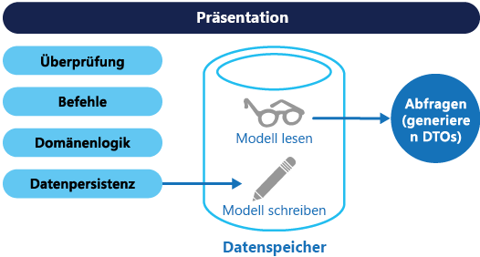

# <a name="command-and-query-responsibility-segregation-cqrs-pattern"></a>Muster „CQRS“ (Command and Query Responsibility Segregation)

[!INCLUDE [header](../_includes/header.md)]

Trennen Sie mithilfe separater Schnittstellen Datenlesevorgänge von Vorgängen zur Aktualisierung von Daten. Dies kann die Leistung, Skalierbarkeit und Sicherheit maximieren. Zudem unterstützt es die Entwicklung des Systems im Laufe der Zeit durch Erhöhung der Flexibilität und verhindert, dass Aktualisierungsbefehle zu Zusammenführungskonflikten auf Domänenebene führen.

## <a name="context-and-problem"></a>Kontext und Problem

In konventionellen Datenverwaltungssystemen werden Befehle (Datenaktualisierung) und Abfragen (Datenanforderungen) für die gleiche Gruppe von Entitäten in einem einzelnen Datenrepository ausgeführt. Bei diesen Entitäten kann es sich um eine Teilmenge der Zeilen in einer oder mehreren Tabellen in einer relationalen Datenbank wie SQL Server handeln.

In diesen Systemen werden alle CRUD-Vorgänge (Create, Read, Update and Delete) in der Regel auf dieselbe Entitätsdarstellung angewendet. Beispielsweise wird ein Datenübertragungsobjekt (Data Transfer Object, DTO), das einen Kunden darstellt, mit der Datenzugriffsschicht (Data Access Layer, DAL) aus dem Datenspeicher abgerufen und auf dem Bildschirm angezeigt hat. Ein Benutzer aktualisiert einige Felder des DTO (möglicherweise durch Datenbindung), und das DTO wird dann wieder von der DAL im Datenspeicher gespeichert. Das gleiche DTO wird sowohl für Lese- als auch Schreibvorgänge verwendet. Die Abbildung zeigt eine konventionelle CRUD-Architektur.


Konventionelle CRUD-Entwürfe sind gut geeignet, wenn nur eine begrenzte Geschäftslogik auf die Datenvorgänge angewendet wird. Die von Entwicklungstools bereitgestellten Gerüstmechanismen können sehr schnell Datenzugriffscodes erstellen, die dann bei Bedarf angepasst werden können.

Die konventionelle CRUD-Vorgehensweise birgt jedoch auch einige Nachteile:

- Diese Vorgehensweise führt häufig zu einem Konflikt zwischen den Lese- und Schreibdarstellungen der Daten, beispielsweise aufgrund zusätzlicher Spalten oder Eigenschaften, die ordnungsgemäß aktualisiert werden müssen, auch wenn sie im Rahmen eines Vorgangs nicht erforderlich sind.

- Bei dieser Vorgehensweise besteht das Risiko eines Datenkonflikts, wenn Datensätze im Datenspeicher in einer gemeinsamen Domäne gesperrt werden, in der mehrere Darsteller parallel in derselben Gruppe von Daten ausgeführt werden. Anderenfalls werden Updatekonflikte durch gleichzeitige Updates verursacht, wenn eine optimistische Sperre verwendet wird. Diese Risiken steigen mit zunehmender Komplexität und steigendem Durchsatz des Systems. Darüber hinaus kann sich die konventionelle Vorgehensweise negativ auf die Leistung auswirken, was auf die Auslastung im Datenspeicher und der Datenzugriffsschicht sowie die Komplexität der zum Abrufen von Informationen erforderlichen Abfragen zurückzuführen ist.

- Sie kann die Verwaltung von Sicherheitsfeatures und Berechtigungen verkomplizieren, da jede Entität sowohl Lese- als auch Schreibvorgängen unterworfen ist. Hierdurch werden Daten möglicherweise im falschen Kontext verfügbar gemacht.

> Einen ausführlicheren Überblick über die Einschränkungen des CRUD-Ansatzes finden Sie unter [CRUD, Only When You Can Afford It](https://blogs.msdn.microsoft.com/maarten_mullender/2004/07/23/crud-only-when-you-can-afford-it-revisited/) (CRUD, aber nur wenn Sie es sich leisten können).

## <a name="solution"></a>Lösung

CQRS (Command and Query Responsibility Segregation) ist ein Muster, das mittels separater Schnittstellen Datenlesevorgänge (Abfragen) von Datenaktualisierungsvorgängen (Befehle) trennt. Folglich unterscheidet sich das für Abfragen verwendete Datenmodell von dem Datenmodell für Aktualisierungen. Die Modelle können dann wie in der folgenden Abbildung gezeigt isoliert werden, obwohl dies keine zwingende Voraussetzung ist.



Im Vergleich zu einem einzelnen Datenmodell, das in CRUD-basierten Systemen eingesetzt wird, führt die Verwendung von separaten Abfrage- und Updatemodellen für die Daten in CQRS-basierten Systemen zur Vereinfachung des Entwurfs und der Implementierung. Ein Nachteil besteht jedoch darin, dass CQRS-Codes im Gegensatz zu CRUD-Entwürfen nicht automatisch mithilfe von Gerüstmechanismen generiert werden können.

Das Abfragemodell zum Lesen von Daten und das Updatemodell zum Schreiben von Daten können auf denselben physischen Speicher zugreifen, z.B. durch die Verwendung von SQL-Ansichten oder Generierung von Projektionen im laufenden Betrieb. Es ist jedoch üblich, die Daten wie in der folgenden Abbildung gezeigt in verschiedenen physischen Speicher zu trennen, um die Leistung, Skalierbarkeit und Sicherheit zu maximieren.


Beim Speicher für Lesevorgänge kann es sich um ein schreibgeschütztes Replikat des Speichers für Schreibvorgänge handeln. Anderenfalls können Speicher für Lese- und Schreibvorgänge grundlegend verschiedene Strukturen aufweisen. Die Verwendung von mehreren schreibgeschützten Replikaten des Speichers für Lesevorgänge kann die Abfrageleistung und die Reaktionsfähigkeit der Anwendungsbenutzeroberfläche erheblich verbessern, insbesondere in verteilten Szenarien, in denen sich schreibgeschützte Replikate in der Nähe der Anwendungsinstanzen befinden. Einige Datenbanksysteme (SQL Server) bieten zur Maximierung der Verfügbarkeit zusätzliche Funktionen wie Failoverreplikate.

Durch die Trennung von Speichern für Lese- und Schreibvorgänge kann können beide Speicher entsprechend der Auslastung skaliert werden. Beispielsweise ist in Speichern für Lesevorgänge in der Regel eine weitaus höhere Auslastung anzutreffen als bei Speichern für Schreibvorgänge.

Wenn das Abfrage-/Lesemodell denormalisierte Daten enthält (siehe [Muster „Materialisierte Sichten“](materialized-view.md)), wird die Leistung beim Lesen von Daten für jede der Sichten in einer Anwendung oder beim Abfragen der Daten im System maximiert.

## <a name="issues-and-considerations"></a>Probleme und Überlegungen

Beachten Sie die folgenden Punkte bei der Entscheidung, wie dieses Muster implementiert werden soll:

- Die Aufteilung des Datenspeichers in separate physische Speicher für Lese- und Schreibvorgänge kann die Leistung und Sicherheit eines Systems erhöhen – damit jedoch auch die Komplexität in Bezug auf Resilienz und letztliche Konsistenz. Der Speicher mit dem Lesemodell muss aktualisiert werden, damit Änderungen am Speicher mit dem Schreibmodell übernommen werden. Zudem kann es schwierig sein, basierend auf veralteten Lesedaten festzustellen, wann ein Benutzer eine Anforderung gestellt hat. Dies bedeutet, dass der Vorgang nicht abgeschlossen werden kann.

    > Eine Beschreibung der letztlichen Konsistenz finden Sie unter [Data Consistency Primer](https://msdn.microsoft.com/library/dn589800.aspx) (Grundlagen der Datenkonsistenz).

- Es wird empfohlen, CQRS auf bestimmte Bereiche Ihres Systems anzuwenden, wo es den größten Nutzen bietet.

- Eine typische Vorgehensweise zur Bereitstellung von letztlicher Konsistenz besteht darin, die Ereignisherkunftsermittlung mit CQRS zu kombinieren, sodass das Schreibmodell ein ausschließlich anfügbarer Ereignisstrom ist, der durch die Ausführung von Befehlen gesteuert wird. Diese Ereignisse werden zur Aktualisierung von materialisierten Sichten verwendet, die als Lesemodell fungieren. Weitere Informationen finden Sie unter [Ereignisherkunftsermittlung und CQRS](/azure/architecture/patterns/cqrs#event-sourcing-and-cqrs).

## <a name="when-to-use-this-pattern"></a>Verwendung dieses Musters

Verwenden Sie dieses Muster in folgenden Situationen:

- Bei gemeinsamen Domänen, in denen mehrere Vorgänge parallel für dieselben Daten ausgeführt werden. Mithilfe von CQRS können Sie Befehle mit ausreichender Granularität definieren, um Zusammenführungskonflikte auf Domänenebene (auftretende Konflikte können per Befehl zusammengeführt werden) zu minimieren, selbst wenn Sie scheinbar dieselben Datentypen aktualisieren.

- Bei taskbasierten Benutzeroberflächen, bei denen Benutzer in mehreren Schritten oder mit komplexen Domänenmodellen durch einen komplizierten Prozess geführt werden. Dies ist auch für Teams nützlich, die bereits mit DDD-Methoden (Domain-Driven Design) vertraut sind. Das Schreibmodell verfügt über einen vollständigen Befehlsverarbeitungsstapel mit Geschäftslogik, Eingabevalidierung und Geschäftsvalidierung, um sicherzustellen, dass sämtliche Elemente für jedes der Aggregate (jeden Cluster von verknüpften Objekten, die als Einheit für Datenänderungen behandelt werden) im Schreibmodell stets konsistent sind. Das Lesemodell weist weder eine Geschäftslogik noch einen Validierungsstapel auf und gibt nur ein DTO zur Verwendung in einem Anzeigemodell zurück. Das Lesemodell ist letztlich konsistent mit dem Schreibmodell.

- In Szenarien, in denen die Leistung von Datenlesevorgängen getrennt von der Leistung von Datenschreibvorgängen angepasst werden muss, insbesondere wenn das Verhältnis zwischen Lese-/Schreibvorgängen sehr hoch ist, und in denen eine horizontale Skalierung erforderlich ist. Beispielsweise ist in vielen Systemen die Anzahl der Lesevorgänge um ein Vielfaches größer als die Anzahl der Schreibvorgänge. Um dies zu berücksichtigen, sollten Sie eine horizontale Skalierung des Lesemodells in Erwägung ziehen, das Schreibmodell jedoch nur auf mindestens einer Instanz ausführen. Die Verwendung einer kleinen Anzahl von Schreibmodellinstanzen kann auch das Auftreten von Zusammenführungskonflikten minimieren.

- In Szenarien, in denen sich ein Entwicklerteam auf das komplexe Domänenmodell als Teil des Schreibmodells konzentrieren kann, während sich ein anderes Team auf das Lesemodell und die Benutzeroberflächen konzentrieren kann.

- In Szenarien, in denen das System voraussichtlich im Laufe der Zeit weiterentwickelt wird und mehrere Versionen des Modells enthalten kann oder in denen sich Geschäftsregeln regelmäßig ändern.

- Bei der Integration in andere Systeme, insbesondere in Kombination mit Ereignisquellen, bei denen der vorübergehende Ausfall eines Subsystems nicht die Verfügbarkeit der anderen Systeme beeinträchtigen soll.

Dieses Muster wird in folgenden Situationen empfohlen:

- Situationen, in denen die Domäne oder die Geschäftsregeln einfach sind

- Situationen, in denen eine einfache Benutzeroberfläche im CRUD-Stil und die damit verbundenen Datenzugriffsvorgänge ausreichen

- Bei der systemweiten Implementierung. Es gibt bestimmte Komponenten eines umfassenden Datenverwaltungsszenarios, bei denen sich CQRS als nützlich erweisen kann. Wenn diese Vorgehensweise jedoch nicht benötigt wird, kann es jedoch die Komplexität unnötigerweise um ein Vielfaches vergrößern.

## <a name="event-sourcing-and-cqrs"></a>Ereignisherkunftsermittlung und CQRS

Das Muster „CQRS“ wird häufig zusammen mit dem Muster „Ereignisherkunftsermittlung“ verwendet. CQRS-basierte Systeme verwenden getrennte Lese- und Schreibdatenmodelle, die auf ihre jeweiligen Tasks zugeschnitten sind und sich häufig in räumlich getrennten Speichern befinden. Bei Verwendung mit dem Muster [Ereignisherkunftsermittlung](event-sourcing.md) weist der Ereignisspeicher das Schreibmodell auf und stellt die offizielle Informationsquelle dar. Das Lesemodell eines CQRS-basierten Systems bietet materialisierte Sichten der Daten, üblicherweise in Form von hochgradig denormalisierten Sichten. Diese Sichten sind auf die Schnittstellen und die Anzeigeanforderungen der Anwendung zugeschnitten, wodurch sowohl die Anzeige- als auch die Abfrageleistung maximiert werden können.

Durch die Verwendung des Ereignisdatenstroms als Speicher für Schreibvorgänge anstelle der eigentlichen Daten zu einem bestimmten Zeitpunkt werden Aktualisierungskonflikte in einem einzigen Aggregat vermieden und die Leistung sowie Skalierbarkeit maximiert. Mit den Ereignissen können materialisierte Sichten der Daten asynchron generiert werden, mit denen Speicher für Lesevorgänge aufgefüllt werden.

Da der Ereignisspeicher die offizielle Informationsquelle darstellt, ist es möglich, die materialisierten Sichten zu löschen und alle vergangenen Ereignisse erneut wiederzugeben, um eine neue Darstellung des aktuellen Zustands zu erstellen, wenn das System weiterentwickelt wird oder das Lesemodell geändert werden muss. Bei den materialisierten Sichten handelt es sich praktisch um einen zuverlässigen schreibgeschützten Datencache.

Bei der Verwendung von CQRS in Kombination mit dem Muster „Ereignisherkunftsermittlung“ sollten Sie Folgendes beachten:

- Wie bei jedem System, bei dem die Speicher für Lese- und Schreibvorgänge getrennt sind, sind die Systeme, die auf diesem Muster basieren, nur letztlich konsistent. Zwischen der Generierung des Ereignisses und der Aktualisierung des Datenspeichers wird eine gewisse Verzögerung auftreten.

- Das Muster erhöht die Komplexität, da Codes erstellt werden müssen, um Ereignisse zu initiieren und zu verarbeiten und die entsprechenden Ansichten oder Objekte, die für das Abfrage- oder Lesemodell erforderlich sind, zusammenzustellen oder zu aktualisieren. Die Komplexität des Musters „CQRS“ in Verbindung mit dem Muster für die Ereignisherkunftsermittlung kann eine erfolgreiche Implementierung erschweren und erfordert eine andere Herangehensweise beim Entwurf von Systemen. Die Ereignisherkunftsermittlung kann jedoch die Modellierung der Domäne vereinfachen. Zudem vereinfacht es das erneute Generieren von Ansichten oder Erstellen neuer Ansichten, da die Änderungsabsicht in den Daten erhalten bleibt.

- Die Generierung materialisierter Sichten für die Verwendung im Lesemodell oder in Projektionen der Daten durch Wiedergabe und Verarbeitung der Ereignisse für bestimmte Entitäten oder Sammlungen von Entitäten kann eine enorme Verarbeitungszeit und einen immensen Ressourcenverbrauch zur Folge haben. Dies gilt insbesondere dann, wenn Werte über lange Zeiträume zu summieren oder zu analysieren sind, da eventuell alle zugehörigen Ereignisse untersucht werden müssen. Dies lässt sich durch die Implementierung von Momentaufnahmen der Daten in geplanten Intervallen lösen, wie etwa der Gesamtzahl aufgetretener Aktionen oder des aktuellen Zustands einer Entität.

## <a name="example"></a>Beispiel

Der folgende Code zeigt einige Auszüge aus einem Beispiel einer CQRS-Implementierung, in der unterschiedliche Definitionen für das Lese- und das Schreibmodell verwendet werden. Die Modellschnittstellen legen keine Features der zugrundeliegenden Datenspeicher fest und können unabhängig voneinander weiterentwickelt und angepasst werden, da diese Schnittstellen getrennt sind.

Der folgende Code zeigt die Definition des Lesemodells.

```csharp
// Query interface
namespace ReadModel
{
  public interface ProductsDao
  {
    ProductDisplay FindById(int productId);
    ICollection<ProductDisplay> FindByName(string name);
    ICollection<ProductInventory> FindOutOfStockProducts();
    ICollection<ProductDisplay> FindRelatedProducts(int productId);
  }

  public class ProductDisplay
  {
    public int Id { get; set; }
    public string Name { get; set; }
    public string Description { get; set; }
    public decimal UnitPrice { get; set; }
    public bool IsOutOfStock { get; set; }
    public double UserRating { get; set; }
  }

  public class ProductInventory
  {
    public int Id { get; set; }
    public string Name { get; set; }
    public int CurrentStock { get; set; }
  }
}
```

Das System ermöglicht den Benutzern, Produkte zu bewerten. Hierfür wird im Anwendungscode der Befehl `RateProduct` verwendet, wie im folgenden Code zu sehen ist.

```csharp
public interface ICommand
{
  Guid Id { get; }
}

public class RateProduct : ICommand
{
  public RateProduct()
  {
    this.Id = Guid.NewGuid();
  }
  public Guid Id { get; set; }
  public int ProductId { get; set; }
  public int Rating { get; set; }
  public int UserId {get; set; }
}
```

Das System verwendet die Klasse `ProductsCommandHandler`, um die von der Anwendung gesendeten Befehle zu verarbeiten. Clients senden Befehle üblicherweise über ein Messagingsystem wie eine Warteschlange an die Domäne. Der Befehlshandler akzeptiert diese Befehle und ruft Methoden der Domänenschnittstelle auf. Die Granularität der einzelnen Befehle ist darauf ausgelegt, die Wahrscheinlichkeit von in Konflikt stehenden Anforderungen zu verringern. Der folgende Code zeigt eine Gliederung der Klasse `ProductsCommandHandler`.

```csharp
public class ProductsCommandHandler :
    ICommandHandler<AddNewProduct>,
    ICommandHandler<RateProduct>,
    ICommandHandler<AddToInventory>,
    ICommandHandler<ConfirmItemShipped>,
    ICommandHandler<UpdateStockFromInventoryRecount>
{
  private readonly IRepository<Product> repository;

  public ProductsCommandHandler (IRepository<Product> repository)
  {
    this.repository = repository;
  }

  void Handle (AddNewProduct command)
  {
    ...
  }

  void Handle (RateProduct command)
  {
    var product = repository.Find(command.ProductId);
    if (product != null)
    {
      product.RateProduct(command.UserId, command.Rating);
      repository.Save(product);
    }
  }

  void Handle (AddToInventory command)
  {
    ...
  }

  void Handle (ConfirmItemsShipped command)
  {
    ...
  }

  void Handle (UpdateStockFromInventoryRecount command)
  {
    ...
  }
}
```

Der folgende Code zeigt die `IProductsDomain`-Schnittstelle des Schreibmodells.

```csharp
public interface IProductsDomain
{
  void AddNewProduct(int id, string name, string description, decimal price);
  void RateProduct(int userId, int rating);
  void AddToInventory(int productId, int quantity);
  void ConfirmItemsShipped(int productId, int quantity);
  void UpdateStockFromInventoryRecount(int productId, int updatedQuantity);
}
```

Beachten Sie auch, dass die `IProductsDomain`-Schnittstelle Methoden enthält, die in der Domäne eine Bedeutung haben. Diese Methoden sind in einer CRUD-Umgebung typischerweise mit generische Namen wie `Save` oder `Update` versehen und enthalten als einziges Argument ein DTO. Die CQRS-Vorgehensweise kann auf die Anforderungen der Geschäfts- und Bestandsverwaltungssysteme dieser Organisation abgestimmt werden.

## <a name="related-patterns-and-guidance"></a>Zugehörige Muster und Anleitungen

Die folgenden Muster und Anweisungen könnten für die Implementierung dieses Musters relevant sein:

- Einen Vergleich zwischen CQRS und anderen Architekturstilen finden Sie unter [Architekturstile](/azure/architecture/guide/architecture-styles/) und [Architekturstil „CQRS“](/azure/architecture/guide/architecture-styles/cqrs).

- [Data Consistency Primer](https://msdn.microsoft.com/library/dn589800.aspx) (Grundlagen der Datenkonsistenz). In diesem Artikel werden die Probleme, die typischerweise aufgrund von letztlicher Konsistenz zwischen den Speichern für Lese- und Schreibvorgänge bei der Verwendung des Musters „CQRS“ auftreten, sowie Möglichkeiten zur Behandlung dieser Probleme erklärt.

- [Anweisungen zur Datenpartitionierung](https://msdn.microsoft.com/library/dn589795.aspx): In diesem Artikel wird beschrieben, wie die im Muster „CQRS“ verwendeten Speicher für Lese- und Schreibvorgänge in Partitionen aufgeteilt werden, die separat verwaltet und abgerufen werden können, um die Skalierbarkeit zu verbessern, Konflikte zu verringern und die Leistung zu optimieren.

- [Muster „Ereignisherkunftsermittlung“](event-sourcing.md): In diesem Artikel wird ausführlich beschrieben, wie das Muster „CQRS“ mithilfe der Ereignisherkunftsermittlung eingesetzt werden kann, um Tasks in komplexen Domänen zu vereinfachen und gleichzeitig die Leistung, Skalierbarkeit und Reaktionsfähigkeit zu verbessern. Außerdem erfahren Sie, wie Sie die Konsistenz von Transaktionsdaten sicherstellen und gleichzeitig vollständige Audit-Trails und Überwachungsverläufe erstellen können, die kompensierende Maßnahmen ermöglichen.

- [Muster „Materialisierte Sichten“](materialized-view.md): Das Lesemodell einer CQRS-Implementierung kann materialisierte Sichten der Daten des Schreibmodells enthalten. Das Modell kann alternativ auch zur Generierung materialisierter Sichten verwendet werden.

- Muster und Vorgehensweisen zu [CQRS](http://aka.ms/cqrs): Im Artikel [Introducing the Command Query Responsibility Segregation Pattern](https://msdn.microsoft.com/library/jj591573.aspx) (Einführung zum Command Query Responsibility Segregation-Muster) werden insbesondere das Muster und die entsprechenden Anwendungsfälle erläutert. Der Artikel [Epilog: Lessons Learned](https://msdn.microsoft.com/library/jj591568.aspx) (Epilog: Gesammelte Erfahrungen) enthält Informationen zu einigen Problemen, die bei der Verwendung dieses Musters auftreten.

- In dem Beitrag [CQRS](http://martinfowler.com/bliki/CQRS.html) von Martin Fowler werden die Grundlagen des Musters erklärt und Links zu anderen nützlichen Ressourcen angegeben.

- In dem [Beitrag von Greg Young](http://codebetter.com/gregyoung/) werden die zahlreichen Aspekte des Musters „CQRS“ erläutert.
